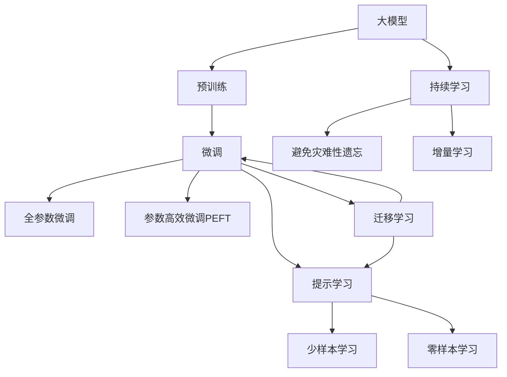

                 

## 1. 背景介绍

### 1.1 问题由来
在人工智能领域，思想的演变始终是一个充满激情与挑战的课题。它不仅关联着算法的进步、理论的创新，也涉及了数据、模型、架构等多方面的综合考量。近年来，深度学习技术的兴起，特别是神经网络结构的革命性改变，如卷积神经网络（CNN）、循环神经网络（RNN）以及近年来大放异彩的Transformer模型，极大地提升了AI模型在图像识别、自然语言处理（NLP）等领域的性能。而在大模型和微调（Fine-Tuning）等技术的大潮下，如何在实践中高效构建、训练和部署这些复杂系统，成为了研究者和工程师们面临的新问题。

### 1.2 问题核心关键点
本文将深入探讨大模型微调技术，涵盖其原理、步骤、应用、挑战及未来趋势。微调技术旨在通过在特定任务上对大模型进行微小的调整，使其在该任务上表现更优。这不仅能够有效提升模型性能，还能减少从头训练所需的时间和计算资源，尤其在数据量较小或新出现的任务上具有重要意义。

## 2. 核心概念与联系

### 2.1 核心概念概述
为更好地理解大模型微调，本文将介绍几个关键概念及其相互联系：

- **大模型（Large Model）**：指的是具有庞大参数量、能处理复杂任务的高性能深度学习模型，如BERT、GPT-3等。这些模型通过大规模预训练学习到通用的语言或图像知识。
- **微调（Fine-Tuning）**：在大模型基础上，通过特定任务的少量标注数据对其进行微小调整，优化其在特定任务上的性能。微调时通常仅调整顶层或部分层，以保留模型的大规模知识。
- **迁移学习（Transfer Learning）**：指在预训练模型的基础上，通过微调等方式在新任务上实现性能提升，避免从头训练。
- **参数高效微调（Parameter-Efficient Fine-Tuning, PEFT）**：指仅调整模型中的少量参数，以减少计算资源消耗。
- **提示学习（Prompt Learning）**：通过精心设计的输入模板引导模型执行特定任务，尤其在不更新模型参数的情况下进行零样本或少样本学习。
- **对抗训练（Adversarial Training）**：引入对抗样本，提升模型对输入噪声的鲁棒性。
- **对抗式微调（Adversarial Fine-Tuning）**：在微调过程中加入对抗样本，进一步提高模型性能。

这些概念通过Mermaid流程图展示其相互联系：



### 2.2 概念间的关系
这些概念共同构成了大模型微调技术的核心生态系统。具体而言：

- 大模型通过预训练学习通用知识，是微调技术的基础。
- 微调通过特定任务的标注数据优化模型，使得模型能够更好地适应新任务。
- 迁移学习帮助模型将预训练知识迁移到新任务，提高微调效果。
- 参数高效微调在保留预训练知识的同时，降低微调对计算资源的依赖。
- 提示学习通过输入模板引导模型执行任务，可以在不更新模型的情况下实现学习。
- 对抗训练和对抗式微调提升模型对噪声输入的鲁棒性。
- 持续学习使模型能够不断学习和适应新数据，避免遗忘。

这些概念相互支撑，为大模型微调技术的全面应用提供了坚实的基础。

## 3. 核心算法原理 & 具体操作步骤

### 3.1 算法原理概述
基于监督学习的大模型微调过程可以分为预训练、微调和后处理三个主要阶段。其核心思想是利用大规模预训练模型的通用知识，通过少量标注数据微调，使其在特定任务上表现更优。

具体而言，假设预训练模型为 $M_{\theta}$，通过大规模无标签数据进行预训练，学习到通用的语言或图像表示。对于特定任务 $T$，通过在 $T$ 的少量标注数据上微调，得到新模型 $M_{\hat{\theta}}$，使其在 $T$ 上表现更优。

### 3.2 算法步骤详解
1. **准备数据和模型**：收集任务 $T$ 的标注数据集 $D=\{(x_i,y_i)\}_{i=1}^N$，选择适合的预训练模型 $M_{\theta}$，并设计任务适配层。
2. **设置超参数**：选择合适的优化器、学习率、批大小、迭代轮数等。
3. **执行微调**：使用标注数据 $D$ 训练模型，最小化损失函数 $\mathcal{L}(\theta)$。
4. **后处理**：评估模型性能，根据实际需求进行调整，完成模型部署。

### 3.3 算法优缺点
- **优点**：
  - 快速适应新任务，节省从头训练所需的时间和计算资源。
  - 提高模型在新任务上的性能，特别是在数据量较小的情况下。
  - 保留预训练模型的通用知识，避免从头训练的知识丢失。

- **缺点**：
  - 对标注数据的依赖较大，获取高质量标注数据成本高。
  - 过拟合风险，尤其是在数据量较小时。
  - 模型的跨领域迁移能力有限，对数据分布变化敏感。

### 3.4 算法应用领域
大模型微调技术已被广泛应用于NLP领域的多个任务，如文本分类、命名实体识别、关系抽取、问答系统、机器翻译、文本摘要、对话系统等。在计算机视觉领域，也有如图像分类、目标检测、图像生成等应用。

## 4. 数学模型和公式 & 详细讲解 & 举例说明

### 4.1 数学模型构建
假设微调任务的标注数据集为 $D=\{(x_i,y_i)\}_{i=1}^N$，其中 $x_i$ 为输入，$y_i$ 为标签。预训练模型 $M_{\theta}$ 输出 $M_{\theta}(x_i)$，损失函数 $\ell(\cdot)$ 定义为模型输出与真实标签之间的差异。

### 4.2 公式推导过程
以二分类任务为例，假设模型输出为 $M_{\theta}(x_i)$，真实标签为 $y_i$，交叉熵损失函数为 $\ell(M_{\theta}(x_i),y_i)=-[y_i\log M_{\theta}(x_i)+(1-y_i)\log(1-M_{\theta}(x_i))]$。在数据集 $D$ 上的经验风险为 $\mathcal{L}(\theta)=\frac{1}{N}\sum_{i=1}^N \ell(M_{\theta}(x_i),y_i)$。

### 4.3 案例分析与讲解
假设模型在训练集上损失函数 $\mathcal{L}(\theta)=0.5$，验证集上损失为 $0.3$，测试集上损失为 $0.6$。可以判断模型在验证集上性能最优，选择模型参数 $\hat{\theta}$ 进行下一步应用。

## 5. 项目实践：代码实例和详细解释说明

### 5.1 开发环境搭建
1. 安装PyTorch：使用 `pip install torch` 安装。
2. 安装相关库：如 `transformers`、`numpy`、`pandas` 等。
3. 准备数据集：准备任务的标注数据集。

### 5.2 源代码详细实现
```python
import torch
from transformers import BertForSequenceClassification, AdamW

# 准备数据和模型
model = BertForSequenceClassification.from_pretrained('bert-base-uncased', num_labels=2)
optimizer = AdamW(model.parameters(), lr=2e-5)
device = torch.device('cuda') if torch.cuda.is_available() else torch.device('cpu')

# 训练函数
def train_epoch(model, data_loader, optimizer):
    model.train()
    epoch_loss = 0
    for batch in data_loader:
        inputs, labels = batch.to(device)
        outputs = model(inputs)
        loss = outputs.loss
        epoch_loss += loss.item()
        optimizer.zero_grad()
        loss.backward()
        optimizer.step()
    return epoch_loss / len(data_loader)

# 测试函数
def evaluate(model, data_loader):
    model.eval()
    total_loss, total_correct, total_sample = 0, 0, 0
    with torch.no_grad():
        for batch in data_loader:
            inputs, labels = batch.to(device)
            outputs = model(inputs)
            loss = outputs.loss
            total_loss += loss.item() * labels.size(0)
            total_correct += (outputs.logits.argmax(dim=1) == labels).sum().item()
            total_sample += labels.size(0)
    acc = total_correct / total_sample
    return acc
```

### 5.3 代码解读与分析
- 使用 `BertForSequenceClassification` 构建二分类模型。
- 定义训练和测试函数，使用 `AdamW` 优化器，学习率为 $2e-5$。
- 在训练函数中，前向传播计算损失，反向传播更新模型参数。
- 在测试函数中，评估模型性能，计算准确率。

### 5.4 运行结果展示
```python
from torch.utils.data import DataLoader
from torchtext.datasets import AG News

# 加载数据集
train_data, test_data = AGNews()
train_data, test_data = train_data.split()
train_dataset = DataLoader(train_data, batch_size=32)
test_dataset = DataLoader(test_data, batch_size=32)

# 训练模型
for epoch in range(10):
    train_loss = train_epoch(model, train_dataset)
    test_acc = evaluate(model, test_dataset)
    print(f'Epoch {epoch+1}, train loss: {train_loss:.3f}, test acc: {test_acc:.3f}')
```

## 6. 实际应用场景

### 6.1 智能客服系统
智能客服系统通过微调预训练模型，能够快速适应新问题和用户意图，提供实时对话支持。例如，微调BERT模型进行文本分类，将其应用于智能客服的问答识别，识别用户意图并快速给出回答。

### 6.2 金融舆情监测
金融舆情监测系统通过微调模型，实时分析新闻、评论等文本，检测市场情绪变化，及时预警潜在的金融风险。例如，微调BERT模型进行情感分析，检测市场评论中的情绪倾向，辅助风险控制。

### 6.3 个性化推荐系统
个性化推荐系统通过微调模型，能够根据用户历史行为数据，学习用户的兴趣和偏好，推荐符合其喜好的内容。例如，微调BERT模型进行文本分类，识别用户对不同内容的喜好，生成个性化推荐列表。

### 6.4 未来应用展望
随着大模型和微调技术的不断发展，未来在多个领域将有更多应用场景：

- 智慧医疗：微调模型用于医疗问答、病历分析、药物研发等，提高医疗服务的智能化水平。
- 教育：微调模型用于作业批改、学情分析、知识推荐等，提升教学质量。
- 智慧城市：微调模型用于城市事件监测、舆情分析、应急指挥等，提高城市管理水平。
- 金融：微调模型用于实时市场分析、风险控制等，提高金融决策效率。

## 7. 工具和资源推荐

### 7.1 学习资源推荐
1. **《深度学习》课程**：斯坦福大学提供的深度学习课程，涵盖深度学习的基本概念和实现方法。
2. **《TensorFlow实战》书籍**：介绍TensorFlow的搭建和优化技术，适合实战学习。
3. **Kaggle竞赛平台**：通过参加Kaggle竞赛，实战练习深度学习和NLP技术。
4. **arXiv预印本**：关注最新研究成果，跟踪前沿技术发展。
5. **GitHub代码库**：找到最新的开源项目，学习优秀的实现方法和技术。

### 7.2 开发工具推荐
1. **PyTorch**：深度学习领域的主流框架，灵活的动态计算图设计，适合研究。
2. **TensorFlow**：谷歌开发的深度学习框架，生产部署方便，适合工程应用。
3. **Jupyter Notebook**：交互式编程环境，支持多种编程语言，适合快速实验。
4. **Weights & Biases**：模型训练的实验跟踪工具，记录和可视化训练过程，方便调试。
5. **TensorBoard**：TensorFlow配套的可视化工具，实时监测训练状态。

### 7.3 相关论文推荐
1. **Attention is All You Need**：Transformer的开创性论文，提出自注意力机制。
2. **BERT: Pre-training of Deep Bidirectional Transformers for Language Understanding**：BERT模型的奠基性论文，提出基于掩码的自监督预训练。
3. **Language Models are Unsupervised Multitask Learners**：GPT-2的论文，展示了大规模语言模型的零样本学习能力。
4. **Adversarial Examples in the Physical World**：研究对抗样本对模型鲁棒性的影响。
5. **Adversarial Machine Learning**：总结了对抗机器学习的最新进展，包括对抗训练和对抗式微调。

## 8. 总结：未来发展趋势与挑战

### 8.1 研究成果总结
大模型微调技术在NLP领域取得了显著成果，通过微调模型快速适应新任务，显著提升模型性能，减少从头训练的时间和成本。未来，这一技术将在更多领域得到应用，推动AI技术的产业化进程。

### 8.2 未来发展趋势
1. **大模型规模持续增大**：预训练模型的参数量不断增长，学习到的知识更加丰富，提升了微调模型的泛化能力和表现。
2. **微调方法多样化**：除了全参数微调外，参数高效微调和对抗式微调等方法将进一步发展，提高微调效率。
3. **持续学习成为常态**：微调模型需要不断学习新数据，保持性能，避免遗忘旧知识。
4. **少样本学习和多模态学习**：利用提示学习等技术，在少样本情况下实现高效微调，扩展多模态数据的微调能力。
5. **对抗性学习**：通过对抗训练提升模型的鲁棒性和安全性，避免模型对对抗样本的脆弱性。

### 8.3 面临的挑战
1. **标注数据瓶颈**：微调对标注数据的依赖较大，获取高质量标注数据成本高。
2. **模型鲁棒性不足**：模型对数据分布变化敏感，泛化性能有待提高。
3. **计算资源限制**：大规模模型的推理效率低下，计算资源消耗大。
4. **模型可解释性不足**：模型输出缺乏可解释性，难以解释其决策过程。
5. **模型安全性问题**：模型可能学习到有害信息，输出不符合伦理道德。

### 8.4 研究展望
未来需要在多个方向进行研究突破：

1. **无监督和半监督学习**：减少对标注数据的依赖，利用自监督学习进行微调。
2. **参数高效微调方法**：开发高效微调技术，减小计算资源消耗。
3. **对抗性和因果学习**：引入对抗性和因果学习，提升模型鲁棒性和解释性。
4. **多模态和跨领域学习**：扩展多模态数据的微调能力，提高跨领域迁移能力。
5. **伦理和安全约束**：在模型训练中引入伦理导向的评估指标，保障模型输出符合伦理道德。

总之，大模型微调技术将继续推动AI技术的发展，为多个领域带来深远影响。但同时，也需要在标注数据、模型鲁棒性、计算资源、可解释性和安全性等方面进行全面优化，以实现更好的应用效果。

## 9. 附录：常见问题与解答

**Q1: 如何选择合适的学习率？**
答：微调的学习率一般比预训练时小1-2个数量级。可以从 $2e-5$ 开始调参，逐步减小，或者使用warmup策略，初期使用较小学习率，逐渐过渡到预设值。

**Q2: 微调过程中如何避免过拟合？**
答：可以使用数据增强、正则化、对抗训练等技术。减少批大小，增加迭代轮数，也可以尝试参数高效微调方法。

**Q3: 如何部署微调后的模型？**
答：使用服务化封装，将模型部署为标准化服务接口，便于集成调用。进行模型裁剪和量化加速，优化推理速度。

**Q4: 微调模型在落地部署时需要注意哪些问题？**
答：进行模型裁剪、量化加速，优化推理速度。服务化封装，便于集成调用。设置弹性伸缩，根据请求流量动态调整资源配置。

---

作者：禅与计算机程序设计艺术 / Zen and the Art of Computer Programming

