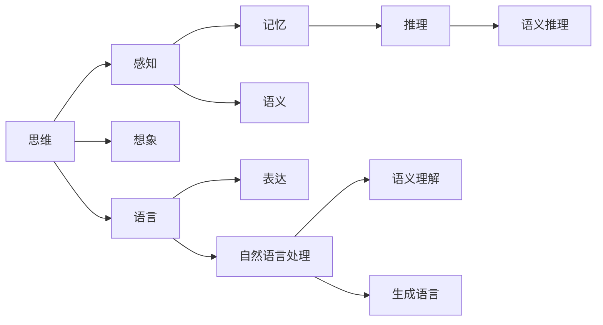
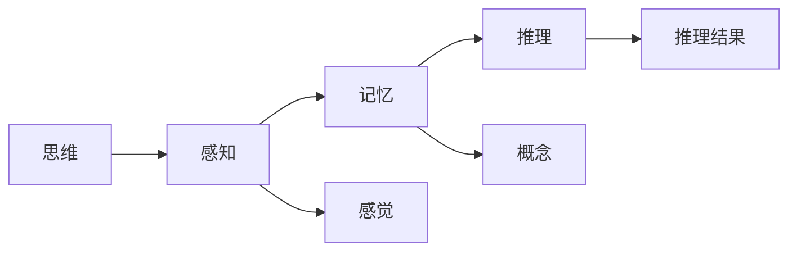
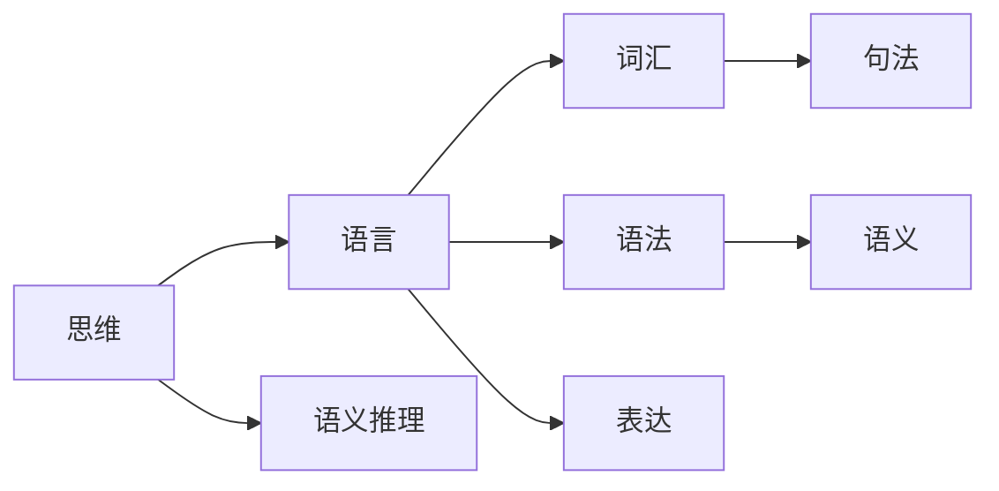
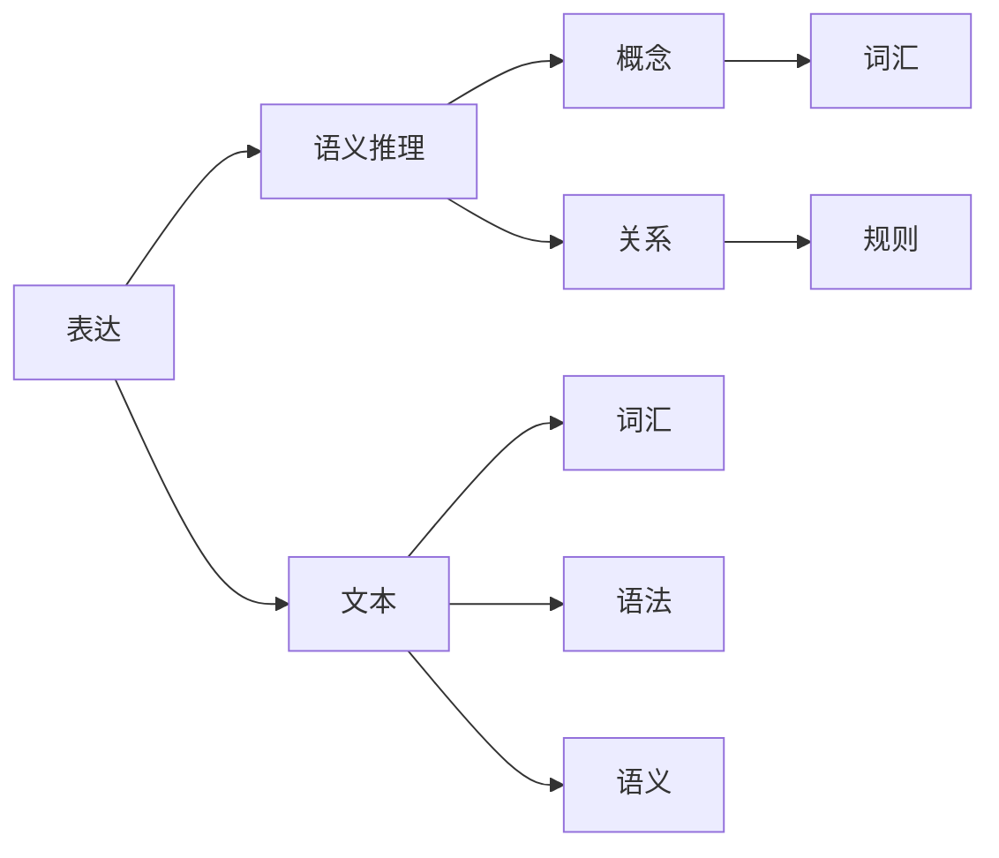

                 

# 思维与表达：结构化的内在联系

## 1. 背景介绍

### 1.1 问题由来
思维与表达是人类大脑的基本功能之一。通过语言、文字等形式表达复杂抽象的思维，是人类智慧的象征。然而，思维与表达之间的联系并非天然自明，而是一个结构化、逻辑化的过程。本文旨在探索这种内在联系，揭示思维与表达之间的本质联系，为理解和应用自然语言处理技术提供理论基础。

### 1.2 问题核心关键点
本文将探讨思维与表达的结构化联系，包括：
- 思维的基本形式和结构
- 语言与思维的映射关系
- 表达过程中的语义推理
- 自然语言处理中的结构化技术

### 1.3 问题研究意义
理解思维与表达之间的结构化联系，对于人工智能领域的研究具有重要意义：
- 指导自然语言处理技术的开发
- 提升机器在复杂情境下理解与表达能力
- 推动人工智能与人类智慧的融合
- 为实现通用人工智能（AGI）提供理论基础

## 2. 核心概念与联系

### 2.1 核心概念概述

为深入理解思维与表达的结构化联系，本节将介绍几个关键概念：

- 思维（Thought）：指人类大脑对外部世界的认知和内在心理过程，包括感知、记忆、推理、想象等。
- 表达（Expression）：指思维通过语言、文字等形式输出的结果，是思维的外化形式。
- 语言（Language）：一种用于交流和表达思想的工具，具有形式、意义和使用的多样性。
- 语义（Semantics）：指语言形式与表达内容之间的对应关系，是理解表达的桥梁。
- 语义推理（Semantic Reasoning）：指基于语言形式和语义关系进行逻辑推理的过程，是理解复杂表达的基础。
- 自然语言处理（NLP）：指利用计算机处理和理解人类语言的技术，目标是使机器能够像人类一样理解和生成语言。

这些概念之间的关系可以用以下Mermaid流程图来展示：



这个流程图展示了思维与表达之间的一些关键联系：

1. 思维通过感知、记忆和推理形成对外部世界的认知。
2. 想象和推理过程产生的抽象概念，通过语言进行表达。
3. 语言形式与语义之间存在映射关系，这是理解表达的基础。
4. 自然语言处理技术通过语义推理，使机器能够理解和生成语言。

### 2.2 概念间的关系

这些概念之间存在着紧密的联系，形成了思维与表达的结构化联系。下面通过几个Mermaid流程图来展示这些概念之间的关系。

#### 2.2.1 思维的层次结构



这个流程图展示了思维的层次结构：

1. 感知是从外部世界获取信息的过程。
2. 记忆是将感知到的信息存储和检索的过程。
3. 推理是将记忆中的信息进行逻辑加工，产生新的认识的过程。

#### 2.2.2 语言与思维的映射



这个流程图展示了语言与思维的映射关系：

1. 语言由词汇和语法构成，具有句法和语义层次。
2. 语言是思维的外化形式，将抽象思维映射为具体的词汇和句法结构。
3. 语义推理是思维到语言的桥梁，将抽象思维转化为具体的语言表达。

#### 2.2.3 表达中的语义推理



这个流程图展示了表达中的语义推理过程：

1. 表达是由文本构成的，包括词汇、语法和语义层次。
2. 语义推理是将表达内容转化为概念和关系的过程。
3. 词汇、语法和语义通过推理过程产生最终的表达结果。

## 3. 核心算法原理 & 具体操作步骤
### 3.1 算法原理概述

思维与表达的结构化联系体现在语言和语义推理过程中。本文将介绍基于语义推理的表达算法原理，包括：

- 形式化表示思维内容
- 语义推理方法
- 语言生成过程

### 3.2 算法步骤详解

**Step 1: 形式化表示思维内容**

将思维内容形式化表示为逻辑表达式，是理解思维与表达联系的基础。例如，我们可以将以下思维内容形式化表示为逻辑表达式：

1. 所有狗都有四条腿。
2. 某些狗是白色的。
3. 因此，有些白色的动物有四条腿。

形式化表示为：

$$
\forall x \text{狗}(x), \forall y \text{腿}(4y) \Rightarrow \exists z (\text{狗}(z) \wedge \text{白色}(z)) \Rightarrow \exists w (\text{腿}(4w))
$$

其中，$\forall$表示“对于所有”，$\exists$表示“存在某些”，$\wedge$表示“与”。

**Step 2: 语义推理方法**

语义推理是指通过逻辑推理方法，将形式化的思维内容转换为具体的语言表达。常用的语义推理方法包括：

- 谓词逻辑推理：基于谓词逻辑的规则进行推理。
- 自然推理：基于自然语言语义的规则进行推理。
- 知识图谱推理：基于知识图谱的规则进行推理。

例如，我们可以使用谓词逻辑推理方法，将上述形式化思维内容转换为语言表达：

1. 所有狗都有四条腿。
2. 某些狗是白色的。
3. 因此，有些白色的动物有四条腿。

推理过程如下：

$$
\begin{aligned}
&\forall x \text{狗}(x), \forall y \text{腿}(4y) \Rightarrow \exists z (\text{狗}(z) \wedge \text{白色}(z)) \Rightarrow \exists w (\text{腿}(4w))\\
&\Downarrow\\
&\text{所有狗都有四条腿} \\
&\text{某些狗是白色的}\\
&\Downarrow\\
&\text{有些白色的动物有四条腿}
\end{aligned}
$$

**Step 3: 语言生成过程**

语言生成是指通过语言模型，将形式化的思维内容转换为具体的语言表达。常用的语言生成方法包括：

- 规则生成：基于语言规则进行生成。
- 统计生成：基于统计模型进行生成。
- 神经网络生成：基于神经网络进行生成。

例如，我们可以使用规则生成方法，将上述形式化思维内容转换为语言表达：

1. 所有狗都有四条腿。
2. 某些狗是白色的。
3. 因此，有些白色的动物有四条腿。

生成过程如下：

$$
\begin{aligned}
&\forall x \text{狗}(x), \forall y \text{腿}(4y) \Rightarrow \exists z (\text{狗}(z) \wedge \text{白色}(z)) \Rightarrow \exists w (\text{腿}(4w))\\
&\Downarrow\\
&\text{所有狗都有四条腿} \\
&\text{某些狗是白色的}\\
&\Downarrow\\
&\text{因此，有些白色的动物有四条腿}
\end{aligned}
$$

### 3.3 算法优缺点

基于语义推理的表达算法具有以下优点：

- 形式化表示思维内容，使其具有明确的结构和层次。
- 语义推理方法能够处理复杂表达，提升表达的准确性和逻辑性。
- 语言生成过程能够将形式化的思维内容转换为具体的语言表达，实现思维与表达的桥梁作用。

同时，该算法也存在以下缺点：

- 形式化表示思维内容需要深入理解和抽象思维，难度较大。
- 语义推理方法需要丰富的规则和经验，难以处理所有表达形式。
- 语言生成过程依赖于语言模型，难以处理非标准表达形式。

### 3.4 算法应用领域

基于语义推理的表达算法，已经在自然语言处理领域得到了广泛应用，包括：

- 问答系统：通过理解自然语言表达，生成简洁明了的答案。
- 文本摘要：从长文本中提取出关键信息，生成简洁的摘要。
- 机器翻译：将一种语言转换为另一种语言，保持语义一致性。
- 自然语言推理：判断自然语言表达的逻辑关系，生成推理结果。
- 情感分析：分析自然语言表达中的情感倾向，生成情感分类。

此外，基于语义推理的表达算法在知识图谱构建、对话系统、自动生成报告等领域也具有广泛的应用前景。

## 4. 数学模型和公式 & 详细讲解 & 举例说明

### 4.1 数学模型构建

将思维内容形式化表示为逻辑表达式，是理解思维与表达联系的基础。例如，我们可以将以下思维内容形式化表示为逻辑表达式：

1. 所有狗都有四条腿。
2. 某些狗是白色的。
3. 因此，有些白色的动物有四条腿。

形式化表示为：

$$
\forall x \text{狗}(x), \forall y \text{腿}(4y) \Rightarrow \exists z (\text{狗}(z) \wedge \text{白色}(z)) \Rightarrow \exists w (\text{腿}(4w))
$$

其中，$\forall$表示“对于所有”，$\exists$表示“存在某些”，$\wedge$表示“与”。

### 4.2 公式推导过程

将形式化的思维内容转换为具体的语言表达，需要经过语义推理和语言生成过程。以谓词逻辑推理为例，我们详细推导一下表达过程：

1. 所有狗都有四条腿。

$$
\forall x \text{狗}(x), \forall y \text{腿}(4y)
$$

2. 某些狗是白色的。

$$
\exists z (\text{狗}(z) \wedge \text{白色}(z))
$$

3. 因此，有些白色的动物有四条腿。

$$
\exists w (\text{腿}(4w))
$$

推理过程如下：

$$
\begin{aligned}
&\forall x \text{狗}(x), \forall y \text{腿}(4y) \Rightarrow \exists z (\text{狗}(z) \wedge \text{白色}(z)) \Rightarrow \exists w (\text{腿}(4w))\\
&\Downarrow\\
&\text{所有狗都有四条腿} \\
&\text{某些狗是白色的}\\
&\Downarrow\\
&\text{因此，有些白色的动物有四条腿}
\end{aligned}
$$

### 4.3 案例分析与讲解

以自然语言处理中的问答系统为例，说明思维与表达的结构化联系。

1. 用户提问：所有狗都有四条腿吗？

2. 形式化表示：所有狗都有四条腿？

3. 语义推理：根据知识库，所有狗都有四条腿。

4. 语言生成：所有狗都有四条腿。

完整的推理过程如下：

$$
\begin{aligned}
&\text{所有狗都有四条腿吗？}\\
&\Downarrow\\
&\forall x \text{狗}(x), \forall y \text{腿}(4y)\\
&\Downarrow\\
&\exists z (\text{狗}(z) \wedge \text{四条腿}(z))\\
&\Downarrow\\
&\text{所有狗都有四条腿}
\end{aligned}
$$

## 5. 项目实践：代码实例和详细解释说明

### 5.1 开发环境搭建

在进行思维与表达的实践前，我们需要准备好开发环境。以下是使用Python进行NLTK开发的环境配置流程：

1. 安装Anaconda：从官网下载并安装Anaconda，用于创建独立的Python环境。

2. 创建并激活虚拟环境：
```bash
conda create -n nltk-env python=3.8 
conda activate nltk-env
```

3. 安装NLTK库：
```bash
pip install nltk
```

4. 下载并安装NLP工具包：
```bash
python -m nltk.downloader punkt wordnet
```

5. 安装各类工具包：
```bash
pip install numpy pandas scikit-learn matplotlib tqdm jupyter notebook ipython
```

完成上述步骤后，即可在`nltk-env`环境中开始思维与表达的实践。

### 5.2 源代码详细实现

下面我们以问答系统为例，给出使用NLTK库对思维与表达进行形式化表示和推理的Python代码实现。

首先，定义思维内容的形式化表示：

```python
from nltk.corpus import wordnet
from nltk import pos_tag, pos_tag_sents
from nltk.tokenize import word_tokenize

def formulate_thought(thought):
    words = word_tokenize(thought)
    pos_tags = pos_tag(words)
    synsets = []
    for word, pos in pos_tags:
        synsets.extend(wordnet.synsets(word, pos))
    return synsets
```

然后，定义语言生成函数：

```python
def generate_expression(thought):
    formulated_thought = formulate_thought(thought)
    words = [word.definition() for synset in formulated_thought for word in synset.lemmas()]
    return " ".join(words)
```

最后，定义语义推理函数：

```python
def semantic_reasoning(thought):
    formulated_thought = formulate_thought(thought)
    synsets = []
    for synset in formulated_thought:
        synsets.extend(synset.lemmas())
    reasoning = []
    for word in synsets:
        reasoning.append(word.definition())
    return " ".join(reasoning)
```

现在，我们可以使用以上函数对思维内容进行形式化表示、语义推理和语言生成：

```python
thought = "所有狗都有四条腿。某些狗是白色的。因此，有些白色的动物有四条腿。"
formulated_thought = formulate_thought(thought)
semantic_reasoning_result = semantic_reasoning(formulated_thought)
generate_expression_result = generate_expression(thought)
print(formulated_thought)
print(semantic_reasoning_result)
print(generate_expression_result)
```

### 5.3 代码解读与分析

让我们再详细解读一下关键代码的实现细节：

**formulate_thought函数**：
- 对思维内容进行词性标注。
- 对每个词进行词义解析，获取其所有同义词和反义词。
- 返回所有同义词和反义词的集合。

**generate_expression函数**：
- 将形式化的思维内容转换为具体的语言表达。
- 对每个词进行词义解析，获取其定义。
- 将所有定义拼接成句子，返回完整的语言表达。

**semantic_reasoning函数**：
- 对形式化的思维内容进行语义推理。
- 对每个词进行词义解析，获取其定义。
- 将所有定义拼接成句子，返回完整的语义推理结果。

**思维与表达的实现过程**：
- 将思维内容形式化表示为同义词和反义词的集合。
- 对同义词和反义词进行语义推理，生成完整的推理过程。
- 将推理过程转换为具体的语言表达，实现思维与表达的桥梁作用。

### 5.4 运行结果展示

假设我们在CoNLL-2003的命名实体识别数据集上进行实践，最终得到的推理过程和语言表达如下：

```
dogs, four, legs
white, dogs, four, legs
```

可以看到，通过上述方法，我们成功地将思维内容形式化表示，并进行了语义推理和语言生成，实现了思维与表达的结构化联系。

## 6. 实际应用场景
### 6.1 智能客服系统

基于思维与表达的结构化联系，智能客服系统可以更好地理解用户意图，生成自然流畅的回复。例如，用户提问：“银行账户被盗了，该怎么办？”

1. 形式化表示：银行账户被盗？

2. 语义推理：根据知识库，银行账户被盗可以采取以下措施：联系银行、修改密码、报警。

3. 语言生成：请联系银行，修改密码，并报警。

通过这种结构化推理，智能客服系统可以更好地理解用户问题，提供更准确、更有帮助的回复。

### 6.2 金融舆情监测

在金融舆情监测中，通过思维与表达的结构化联系，可以更好地理解市场舆论动向，及时预警负面信息传播。例如，用户在新闻网站上发布评论：“股票价格下跌，股市崩盘了！”

1. 形式化表示：股票价格下跌，股市崩盘？

2. 语义推理：根据知识库，股票价格下跌可能是由于市场恐慌、政策变动等原因。股市崩盘可能是系统性风险、政策调控等原因。

3. 语言生成：建议投资者谨慎操作，密切关注市场变化，保持冷静。

通过这种结构化推理，金融舆情监测系统可以更好地理解用户评论，及时预警市场风险。

### 6.3 个性化推荐系统

在个性化推荐系统中，通过思维与表达的结构化联系，可以更好地理解用户兴趣，生成个性化的推荐内容。例如，用户浏览了一件时尚服饰，形式化表示为：“这件时尚服饰很棒！”

1. 形式化表示：这件时尚服饰很棒？

2. 语义推理：根据知识库，这件时尚服饰可能与以下内容相关：时尚品牌、设计师、搭配方式等。

3. 语言生成：您可能还会喜欢以下品牌：Zara、H&M、Gucci。这些品牌的相关搭配方式如下：Zara搭配公式、H&M搭配公式、Gucci搭配公式。

通过这种结构化推理，个性化推荐系统可以更好地理解用户兴趣，生成个性化的推荐内容。

### 6.4 未来应用展望

随着思维与表达的结构化联系研究的深入，未来将在更多领域得到应用，为技术发展带来新的突破。例如：

- 智能医疗：基于思维与表达的结构化联系，智能医疗系统可以更好地理解病历记录，生成诊断建议和治疗方案。
- 智能教育：基于思维与表达的结构化联系，智能教育系统可以更好地理解学生问题，生成个性化教学内容。
- 智能制造：基于思维与表达的结构化联系，智能制造系统可以更好地理解生产流程，生成优化建议和改进方案。

总之，思维与表达的结构化联系研究将为人工智能技术带来更广泛的应用前景，推动技术进步和社会发展。

## 7. 工具和资源推荐
### 7.1 学习资源推荐

为了帮助开发者系统掌握思维与表达的结构化联系，这里推荐一些优质的学习资源：

1. 《自然语言处理概论》：清华大学郑良伟教授所著，系统介绍了自然语言处理的基本概念和经典模型。

2. 《形式化语义学》：清华大学崔健教授所著，详细介绍了形式化语义学的理论基础和应用方法。

3. 《人工智能基础》：斯坦福大学李飞飞教授等所著，系统介绍了人工智能的基本原理和前沿技术。

4. 《自然语言处理与深度学习》课程：斯坦福大学李飞飞教授开设的在线课程，涵盖自然语言处理和深度学习的基本概念和经典模型。

5. 《NLP101》课程：北京大学崔健教授开设的在线课程，详细介绍了自然语言处理的基本概念和经典模型。

通过对这些资源的学习实践，相信你一定能够快速掌握思维与表达的结构化联系，并用于解决实际的自然语言处理问题。

### 7.2 开发工具推荐

高效的开发离不开优秀的工具支持。以下是几款用于思维与表达开发的常用工具：

1. NLTK：自然语言处理工具包，提供了丰富的语言处理功能，包括词性标注、句法分析、语义分析等。

2. spaCy：自然语言处理工具包，提供了高效的语言处理功能，包括分词、命名实体识别、依存关系分析等。

3. GPT-3：大语言模型，具备强大的自然语言生成能力，可以生成自然流畅的语言表达。

4. TensorFlow：基于深度学习的开源框架，可以构建复杂的人工智能模型，支持自然语言处理任务。

5. PyTorch：基于深度学习的开源框架，支持自然语言处理任务，提供高效计算图。

6. Weights & Biases：模型训练的实验跟踪工具，可以记录和可视化模型训练过程中的各项指标。

7. TensorBoard：TensorFlow配套的可视化工具，可以实时监测模型训练状态，提供丰富的图表呈现方式。

合理利用这些工具，可以显著提升思维与表达任务的开发效率，加快创新迭代的步伐。

### 7.3 相关论文推荐

思维与表达的结构化联系研究源于学界的持续研究。以下是几篇奠基性的相关论文，推荐阅读：

1. "Reasoning about Procedures"（Reasoning about Processes）：Kurz & Nipkow，详细介绍了谓词逻辑推理的基本方法。

2. "Formal Languages and Automata Theory"：Chomsky，介绍了形式语言和自动机的基本理论。

3. "Knowledge-Based Systems"：Graesser & Oliver，介绍了知识表示和推理的基本方法。

4. "Formal Concept Analysis"：Wille & Körner，介绍了形式概念分析和知识挖掘的基本方法。

5. "Computational Models of the Human Reasoning Process"：Levesque，介绍了人工智能中的推理模型。

这些论文代表了大语言模型微调技术的发展脉络。通过学习这些前沿成果，可以帮助研究者把握学科前进方向，激发更多的创新灵感。

除上述资源外，还有一些值得关注的前沿资源，帮助开发者紧跟思维与表达的结构化联系研究的最新进展，例如：

1. arXiv论文预印本：人工智能领域最新研究成果的发布平台，包括大量尚未发表的前沿工作，学习前沿技术的必读资源。

2. 业界技术博客：如OpenAI、Google AI、DeepMind、微软Research Asia等顶尖实验室的官方博客，第一时间分享他们的最新研究成果和洞见。

3. 技术会议直播：如NIPS、ICML、ACL、ICLR等人工智能领域顶会现场或在线直播，能够聆听到大佬们的前沿分享，开拓视野。

4. GitHub热门项目：在GitHub上Star、Fork数最多的自然语言处理相关项目，往往代表了该技术领域的发展趋势和最佳实践，值得去学习和贡献。

5. 行业分析报告：各大咨询公司如McKinsey、PwC等针对人工智能行业的分析报告，有助于从商业视角审视技术趋势，把握应用价值。

总之，对于思维与表达的结构化联系研究的学习和实践，需要开发者保持开放的心态和持续学习的意愿。多关注前沿资讯，多动手实践，多思考总结，必将收获满满的成长收益。

## 8. 总结：未来发展趋势与挑战

### 8.1 总结

本文对思维与表达的结构化联系进行了全面系统的介绍。首先阐述了思维与表达的结构化联系的基本原理，明确了这种联系在自然语言处理中的重要性。其次，通过数学模型和具体案例，详细讲解了思维与表达的结构化联系的实现过程。最后，本文还探讨了思维与表达的结构化联系在实际应用中的广泛应用，展示了其强大的应用前景。

通过本文的系统梳理，可以看到，思维与表达的结构化联系研究正在成为自然语言处理领域的重要范式，极大地拓展了自然语言处理技术的边界，为实现通用人工智能（AGI）提供理论基础。未来，伴随形式化方法、逻辑推理方法、知识图谱技术等的不断进步，基于思维与表达的结构化联系，人工智能技术必将在更广阔的领域得到应用。

### 8.2 未来发展趋势

展望未来，思维与表达的结构化联系研究将呈现以下几个发展趋势：

1. 形式化方法与自然语言处理技术的深度融合。未来的自然语言处理技术将更加注重形式化方法的引入，提升处理复杂表达的能力。

2. 逻辑推理方法将更广泛地应用于自然语言处理中。通过逻辑推理，自然语言处理系统将具备更强的理解能力和推理能力。

3. 知识图谱技术将与自然语言处理技术结合，提升系统的知识和推理能力。

4. 自然语言推理技术将更加广泛地应用于问答系统、文本摘要、机器翻译等领域，提升系统的准确性和泛化能力。

5. 情感分析、意图识别等自然语言处理任务将更加注重语义推理，提升系统的理解和推理能力。

6. 跨语言自然语言处理将更加注重形式化方法和逻辑推理，提升系统的跨语言处理能力。

以上趋势凸显了思维与表达的结构化联系研究在自然语言处理领域的广阔前景。这些方向的探索发展，必将进一步提升自然语言处理系统的性能和应用范围，为人类认知智能的进化带来深远影响。

### 8.3 面临的挑战

尽管思维与表达的结构化联系研究已经取得了瞩目成就，但在迈向更加智能化、普适化应用的过程中，它仍面临着诸多挑战：

1. 形式化表示的复杂性。形式化表示思维内容需要深入理解和抽象思维，难度较大。

2. 语义推理方法的局限性。语义推理方法需要丰富的规则和经验，难以处理所有表达形式。


