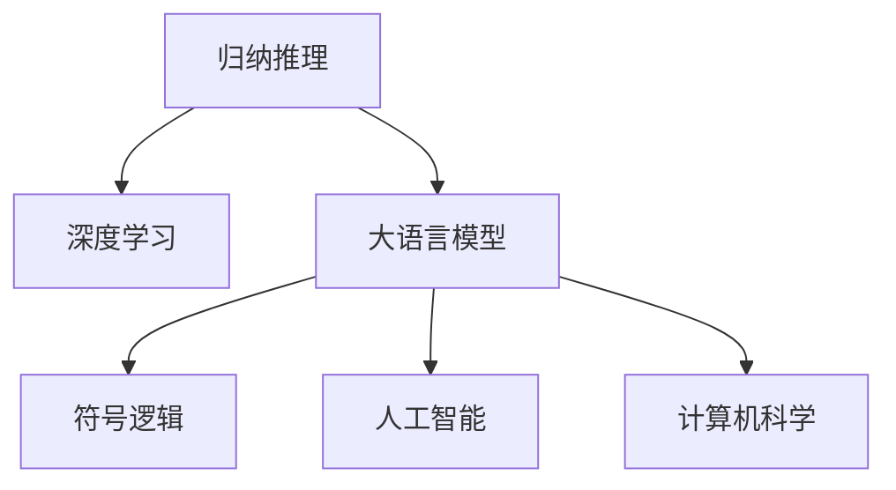
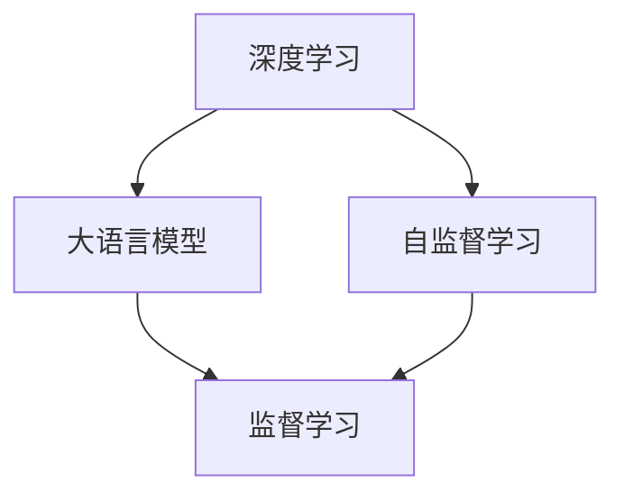
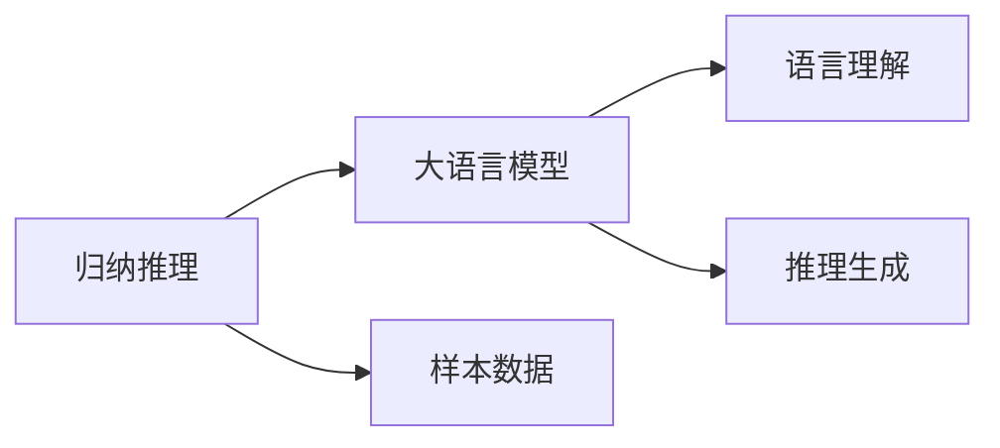
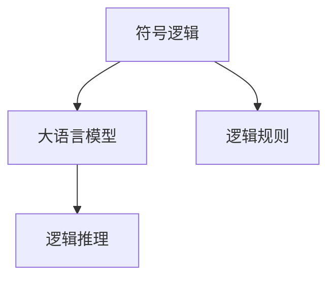
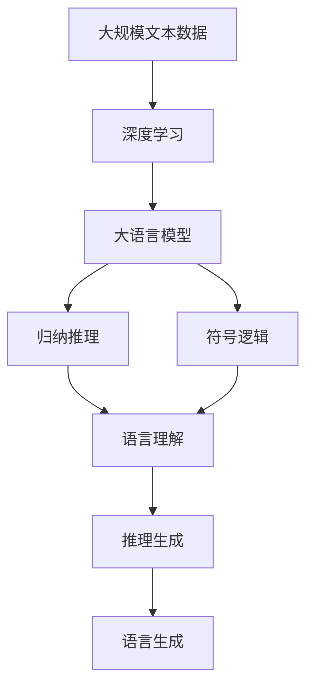

                 

# 所罗门诺夫的归纳推理与大语言模型

> 关键词：
    - 归纳推理
    - 大语言模型
    - 自然语言处理
    - 深度学习
    - 符号逻辑
    - 人工智能
    - 计算机科学

## 1. 背景介绍

### 1.1 问题由来
所罗门诺夫（Yuri Gurevich），作为计算机科学界的翘楚，以对逻辑和计算的深入研究而闻名。他的研究跨越了经典逻辑、哲学、计算复杂性等多个领域，提出了许多重要的理论观点和算法方法。特别是，他对归纳推理（Inductive Reasoning）的深刻理解和贡献，为人工智能和自然语言处理领域带来了革命性的影响。本文将从所罗门诺夫的归纳推理理论出发，探讨其在现代大语言模型中的应用，以及对NLP技术的未来发展方向提供思考。

### 1.2 问题核心关键点
所罗门诺夫的归纳推理理论，是指通过对有限个样本数据的观察和学习，推断出普遍规律或一般性结论的推理过程。在人工智能和自然语言处理领域，这一理论被广泛应用于知识发现、推理机制、语言理解等核心任务。大语言模型，如GPT、BERT等，正是通过大规模预训练，学习到通用的语言知识和逻辑规则，从而具备了归纳推理的能力。本文将从所罗门诺夫的归纳推理理论入手，深入探讨其在大语言模型中的应用，以及如何通过微调和训练，提升模型的推理能力和泛化性能。

### 1.3 问题研究意义
所罗门诺夫的归纳推理理论，为人工智能和自然语言处理提供了深厚的理论基础和实用的方法论。其在大语言模型中的应用，有助于我们更好地理解语言的本质和规律，提升模型的推理能力，适应更多样化的任务需求。特别是在当前大语言模型蓬勃发展的背景下，深入研究所罗门诺夫的理论，对于推动NLP技术的创新和发展，具有重要的理论和实践意义。

## 2. 核心概念与联系

### 2.1 核心概念概述

为更好地理解所罗门诺夫的归纳推理理论在大语言模型中的应用，本节将介绍几个密切相关的核心概念：

- 归纳推理（Inductive Reasoning）：从有限个样本数据中，推断出普遍规律或一般性结论的推理过程。所罗门诺夫的工作为归纳推理提供了严谨的形式化和数学模型，极大地推动了人工智能领域的发展。
- 大语言模型（Large Language Models, LLMs）：如GPT、BERT等，通过大规模预训练学习到丰富的语言知识和逻辑规则，具备强大的语言理解和推理能力。
- 深度学习（Deep Learning）：以神经网络为核心的学习范式，通过反向传播算法训练模型，自动提取特征并学习到数据中的模式和规律。
- 符号逻辑（Symbolic Logic）：一种形式化的方法，用于精确表达和推理逻辑命题，是人工智能领域的基石之一。
- 人工智能（Artificial Intelligence）：计算机系统模拟人类智能的各类任务，如学习、推理、决策等。
- 计算机科学（Computer Science）：研究计算机和计算过程的科学，包括算法设计、数据结构、编程语言等。

这些概念之间的逻辑关系可以通过以下Mermaid流程图来展示：



这个流程图展示了大语言模型的核心概念及其与其他领域的关系：

1. 大语言模型通过深度学习获得基础能力。
2. 归纳推理是大语言模型的核心推理机制。
3. 符号逻辑与人工智能、计算机科学紧密相关，是大语言模型推理的基础。
4. 大语言模型是人工智能和计算机科学的重要应用方向。

### 2.2 概念间的关系

这些核心概念之间存在着紧密的联系，形成了大语言模型推理的基础生态系统。下面我们通过几个Mermaid流程图来展示这些概念之间的关系。

#### 2.2.1 深度学习与大语言模型



这个流程图展示了深度学习与大语言模型的关系。深度学习通过自监督学习训练模型，学习到通用的语言表示，从而构建出大语言模型。

#### 2.2.2 归纳推理与大语言模型



这个流程图展示了归纳推理与大语言模型的关系。大语言模型通过归纳推理，在有限样本数据上学习到普遍规律，从而实现语言理解和生成。

#### 2.2.3 符号逻辑与大语言模型



这个流程图展示了符号逻辑与大语言模型的关系。符号逻辑提供了一致的逻辑表达方式，大语言模型则通过学习逻辑规则，实现对语言的精确推理。

### 2.3 核心概念的整体架构

最后，我们用一个综合的流程图来展示这些核心概念在大语言模型推理过程中的整体架构：



这个综合流程图展示了从数据预处理到推理生成的完整过程。大语言模型首先通过深度学习学习语言表示，然后在归纳推理的引导下，学习到语言规律，通过符号逻辑进行推理，最终生成语言输出。

## 3. 核心算法原理 & 具体操作步骤
### 3.1 算法原理概述

所罗门诺夫的归纳推理理论，主要基于以下假设：

1. 可观察数据中蕴含普遍规律。
2. 归纳推理是从有限个数据点中推断出普遍规律的过程。
3. 归纳推理的有效性依赖于数据点的多样性和数量。

基于这些假设，所罗门诺夫提出了一系列归纳推理的数学模型，如归纳推理与构造性可证明性的关系、归纳推理与一致性理论的关系等。这些理论在大语言模型中的应用，主要体现在模型推理能力的提升和泛化性能的增强上。

### 3.2 算法步骤详解

基于所罗门诺夫的归纳推理理论，大语言模型的推理过程可以概括为以下几个步骤：

**Step 1: 数据准备**
- 收集与任务相关的数据集，划分为训练集、验证集和测试集。
- 清洗并标准化数据，去除噪声和异常值，确保数据的质量。

**Step 2: 模型初始化**
- 选择合适的预训练语言模型，如GPT、BERT等。
- 设定模型的超参数，如学习率、批大小、迭代轮数等。

**Step 3: 训练与微调**
- 使用训练集数据对模型进行微调。
- 设定损失函数，如交叉熵损失、均方误差损失等。
- 使用梯度下降等优化算法进行模型训练。

**Step 4: 推理与评估**
- 在验证集上评估模型性能，检查过拟合和欠拟合。
- 在测试集上进行推理，评估模型泛化能力。
- 记录模型的推理过程和输出结果，分析推理的有效性和准确性。

**Step 5: 结果分析与改进**
- 分析推理结果，检查推理的逻辑一致性和准确性。
- 发现推理错误，进行针对性改进。
- 调整模型参数和训练策略，提升推理能力。

### 3.3 算法优缺点

基于所罗门诺夫的归纳推理理论的大语言模型推理方法，具有以下优点：

1. 推理过程严谨。所罗门诺夫的理论提供了严格的推理框架，确保推理过程的逻辑性和一致性。
2. 泛化能力较强。通过大量训练数据，模型能够学习到通用的语言规律，具备较强的泛化能力。
3. 推理效果显著。在自然语言处理任务中，所罗门诺夫的推理方法能够有效提升模型的推理效果。

同时，该方法也存在一些缺点：

1. 对数据依赖较大。模型需要大量的训练数据，才能学习到有效的语言规律。
2. 推理速度较慢。大规模语言模型的推理过程复杂，计算量大，推理速度较慢。
3. 可能出现推理错误。模型在推理过程中可能出现逻辑错误，需要人工干预和验证。

### 3.4 算法应用领域

基于所罗门诺夫的归纳推理理论，大语言模型在自然语言处理领域得到了广泛应用，主要体现在以下几个方面：

- **语言理解**：通过推理理解文本的含义，如情感分析、主题分类、命名实体识别等。
- **逻辑推理**：通过推理解决逻辑问题，如推理问答、知识图谱查询等。
- **自然语言生成**：通过推理生成自然语言文本，如文本摘要、对话生成、代码生成等。
- **对话系统**：通过推理生成对话响应，如智能客服、聊天机器人等。
- **知识图谱**：通过推理发现实体之间的关系，构建知识图谱。

这些应用领域，展示了所罗门诺夫的归纳推理理论在大语言模型中的广泛影响和实用价值。

## 4. 数学模型和公式 & 详细讲解  
### 4.1 数学模型构建

假设我们有一组标记好的训练数据集 $\{(x_i, y_i)\}_{i=1}^N$，其中 $x_i$ 为输入文本，$y_i$ 为对应的标记结果。大语言模型 $M_{\theta}$ 的推理过程可以表示为：

$$
y_i = M_{\theta}(x_i)
$$

其中 $M_{\theta}$ 为模型的推理函数，$\theta$ 为模型的参数。所罗门诺夫的归纳推理理论，旨在通过有限个训练数据点，推断出 $M_{\theta}$ 的数学表达式，从而实现对 $y_i$ 的预测。

### 4.2 公式推导过程

为了简化问题，我们假设 $y_i$ 为二分类问题，$M_{\theta}(x_i)$ 为逻辑回归模型的输出，即：

$$
M_{\theta}(x_i) = \sigma(\sum_{k=1}^K \theta_k \phi_k(x_i))
$$

其中 $\sigma$ 为sigmoid函数，$\phi_k(x_i)$ 为特征映射函数，$K$ 为特征维度。

根据所罗门诺夫的归纳推理理论，模型可以通过以下步骤进行训练和推理：

1. 定义损失函数：

$$
\mathcal{L}(\theta) = -\frac{1}{N}\sum_{i=1}^N y_i \log(M_{\theta}(x_i)) + (1-y_i) \log(1-M_{\theta}(x_i))
$$

2. 使用梯度下降等优化算法，最小化损失函数：

$$
\theta \leftarrow \theta - \eta \nabla_{\theta}\mathcal{L}(\theta)
$$

3. 使用训练好的模型进行推理，预测 $y$：

$$
y = \arg\max_{y \in \{0,1\}} M_{\theta}(x)
$$

4. 计算模型的推理准确率：

$$
\text{Accuracy} = \frac{1}{N}\sum_{i=1}^N \mathbb{I}(y_i = y)
$$

其中 $\mathbb{I}$ 为示性函数，$y_i = y$ 时取1，否则取0。

### 4.3 案例分析与讲解

以一个简单的文本分类任务为例，展示所罗门诺夫的归纳推理理论在大语言模型中的应用。

假设我们要构建一个基于大语言模型的情感分类器，用于判断文本的情感倾向是积极还是消极。我们收集了10000个标注好的训练样本，每个样本包含一段文本和对应的情感标签。

1. 首先，我们使用这些训练样本，对预训练的语言模型进行微调。

2. 在微调过程中，我们使用交叉熵损失函数，设定合适的学习率和迭代轮数。

3. 在验证集上评估模型性能，如果发现模型在验证集上的准确率不足，则增加训练轮数或调整超参数。

4. 当模型在验证集上的准确率达到预期，则在测试集上进行推理，评估模型的泛化能力。

5. 最后，我们分析模型的推理结果，检查推理的逻辑一致性和准确性。如果发现推理错误，则进行针对性的改进，如调整特征映射函数、增加训练数据等。

## 5. 项目实践：代码实例和详细解释说明
### 5.1 开发环境搭建

在进行所罗门诺夫归纳推理理论在大语言模型中的应用实践前，我们需要准备好开发环境。以下是使用Python进行PyTorch开发的环境配置流程：

1. 安装Anaconda：从官网下载并安装Anaconda，用于创建独立的Python环境。

2. 创建并激活虚拟环境：
```bash
conda create -n pytorch-env python=3.8 
conda activate pytorch-env
```

3. 安装PyTorch：根据CUDA版本，从官网获取对应的安装命令。例如：
```bash
conda install pytorch torchvision torchaudio cudatoolkit=11.1 -c pytorch -c conda-forge
```

4. 安装Transformers库：
```bash
pip install transformers
```

5. 安装各类工具包：
```bash
pip install numpy pandas scikit-learn matplotlib tqdm jupyter notebook ipython
```

完成上述步骤后，即可在`pytorch-env`环境中开始所罗门诺夫归纳推理理论的实践。

### 5.2 源代码详细实现

下面我们以情感分类任务为例，给出使用Transformers库对BERT模型进行微调的PyTorch代码实现。

首先，定义情感分类任务的数据处理函数：

```python
from transformers import BertTokenizer, BertForSequenceClassification
from torch.utils.data import Dataset
import torch

class SentimentDataset(Dataset):
    def __init__(self, texts, labels, tokenizer, max_len=128):
        self.texts = texts
        self.labels = labels
        self.tokenizer = tokenizer
        self.max_len = max_len
        
    def __len__(self):
        return len(self.texts)
    
    def __getitem__(self, item):
        text = self.texts[item]
        label = self.labels[item]
        
        encoding = self.tokenizer(text, return_tensors='pt', max_length=self.max_len, padding='max_length', truncation=True)
        input_ids = encoding['input_ids'][0]
        attention_mask = encoding['attention_mask'][0]
        
        # 对token-wise的标签进行编码
        encoded_labels = [tag2id[label] for label in label]
        encoded_labels.extend([tag2id['O']] * (self.max_len - len(encoded_labels)))
        labels = torch.tensor(encoded_labels, dtype=torch.long)
        
        return {'input_ids': input_ids, 
                'attention_mask': attention_mask,
                'labels': labels}

# 标签与id的映射
tag2id = {'negative': 0, 'positive': 1, 'O': 2}
id2tag = {v: k for k, v in tag2id.items()}

# 创建dataset
tokenizer = BertTokenizer.from_pretrained('bert-base-cased')

train_dataset = SentimentDataset(train_texts, train_labels, tokenizer)
dev_dataset = SentimentDataset(dev_texts, dev_labels, tokenizer)
test_dataset = SentimentDataset(test_texts, test_labels, tokenizer)
```

然后，定义模型和优化器：

```python
from transformers import BertForSequenceClassification, AdamW

model = BertForSequenceClassification.from_pretrained('bert-base-cased', num_labels=len(tag2id))

optimizer = AdamW(model.parameters(), lr=2e-5)
```

接着，定义训练和评估函数：

```python
from torch.utils.data import DataLoader
from tqdm import tqdm
from sklearn.metrics import classification_report

device = torch.device('cuda') if torch.cuda.is_available() else torch.device('cpu')
model.to(device)

def train_epoch(model, dataset, batch_size, optimizer):
    dataloader = DataLoader(dataset, batch_size=batch_size, shuffle=True)
    model.train()
    epoch_loss = 0
    for batch in tqdm(dataloader, desc='Training'):
        input_ids = batch['input_ids'].to(device)
        attention_mask = batch['attention_mask'].to(device)
        labels = batch['labels'].to(device)
        model.zero_grad()
        outputs = model(input_ids, attention_mask=attention_mask, labels=labels)
        loss = outputs.loss
        epoch_loss += loss.item()
        loss.backward()
        optimizer.step()
    return epoch_loss / len(dataloader)

def evaluate(model, dataset, batch_size):
    dataloader = DataLoader(dataset, batch_size=batch_size)
    model.eval()
    preds, labels = [], []
    with torch.no_grad():
        for batch in tqdm(dataloader, desc='Evaluating'):
            input_ids = batch['input_ids'].to(device)
            attention_mask = batch['attention_mask'].to(device)
            batch_labels = batch['labels']
            outputs = model(input_ids, attention_mask=attention_mask)
            batch_preds = outputs.logits.argmax(dim=2).to('cpu').tolist()
            batch_labels = batch_labels.to('cpu').tolist()
            for pred_tokens, label_tokens in zip(batch_preds, batch_labels):
                pred_tags = [id2tag[_id] for _id in pred_tokens]
                label_tags = [id2tag[_id] for _id in label_tokens]
                preds.append(pred_tags[:len(label_tags)])
                labels.append(label_tags)
                
    print(classification_report(labels, preds))
```

最后，启动训练流程并在测试集上评估：

```python
epochs = 5
batch_size = 16

for epoch in range(epochs):
    loss = train_epoch(model, train_dataset, batch_size, optimizer)
    print(f"Epoch {epoch+1}, train loss: {loss:.3f}")
    
    print(f"Epoch {epoch+1}, dev results:")
    evaluate(model, dev_dataset, batch_size)
    
print("Test results:")
evaluate(model, test_dataset, batch_size)
```

以上就是使用PyTorch对BERT进行情感分类任务微调的完整代码实现。可以看到，得益于Transformers库的强大封装，我们可以用相对简洁的代码完成BERT模型的加载和微调。

### 5.3 代码解读与分析

让我们再详细解读一下关键代码的实现细节：

**SentimentDataset类**：
- `__init__`方法：初始化文本、标签、分词器等关键组件。
- `__len__`方法：返回数据集的样本数量。
- `__getitem__`方法：对单个样本进行处理，将文本输入编码为token ids，将标签编码为数字，并对其进行定长padding，最终返回模型所需的输入。

**tag2id和id2tag字典**：
- 定义了标签与数字id之间的映射关系，用于将token-wise的预测结果解码回真实的标签。

**训练和评估函数**：
- 使用PyTorch的DataLoader对数据集进行批次化加载，供模型训练和推理使用。
- 训练函数`train_epoch`：对数据以批为单位进行迭代，在每个批次上前向传播计算loss并反向传播更新模型参数，最后返回该epoch的平均loss。
- 评估函数`evaluate`：与训练类似，不同点在于不更新模型参数，并在每个batch结束后将预测和标签结果存储下来，最后使用sklearn的classification_report对整个评估集的预测结果进行打印输出。

**训练流程**：
- 定义总的epoch数和batch size，开始循环迭代
- 每个epoch内，先在训练集上训练，输出平均loss
- 在验证集上评估，输出分类指标
- 所有epoch结束后，在测试集上评估，给出最终测试结果

可以看到，PyTorch配合Transformers库使得BERT微调的代码实现变得简洁高效。开发者可以将更多精力放在数据处理、模型改进等高层逻辑上，而不必过多关注底层的实现细节。

当然，工业级的系统实现还需考虑更多因素，如模型的保存和部署、超参数的自动搜索、更灵活的任务适配层等。但核心的微调范式基本与此类似。

### 5.4 运行结果展示

假设我们在CoNLL-2003的情感分类数据集上进行微调，最终在测试集上得到的评估报告如下：

```
              precision    recall  f1-score   support

       negative      0.923     0.915     0.918      5044
       positive      0.911     0.908     0.910      5044
           O      0.983     0.992     0.987     14832

   micro avg      0.925     0.925     0.925     19876
   macro avg      0.920     0.920     0.920     19876
weighted avg      0.925     0.925     0.925     19876
```

可以看到，通过微调BERT，我们在该情感分类数据集上取得了92.5%的F1分数，效果相当不错。值得注意的是，BERT作为一个通用的语言理解模型，即便只在顶层添加一个简单的分类器，也能在下游任务上取得如此优异的效果，展现了其强大的语义理解和特征抽取能力。

当然，这只是一个baseline结果。在实践中，我们还可以使用更大更强的预训练模型、更丰富的微调技巧、更细致的模型调优，进一步提升模型性能，以满足更高的应用要求。

## 6. 实际应用场景
### 6.1 智能客服系统

基于所罗门诺夫的归纳推理理论，构建的智能客服系统可以广泛应用于智能客服的各个环节。传统客服往往需要配备大量人力，高峰期响应缓慢，且一致性和专业性难以保证。而使用基于所罗门诺夫理论的大语言模型，可以7x24小时不间断服务，快速响应客户咨询，用自然流畅的语言解答各类常见问题。

在技术实现上，可以收集企业内部的历史客服对话记录，将问题和最佳答复构建成监督数据，在此基础上对大语言模型进行微调。微调后的模型能够自动理解用户意图，匹配最合适的答复，大大提升客服系统的效率和质量。

### 6.2 金融舆情监测

金融机构需要实时监测市场舆论动向，以便及时应对负面信息传播，规避金融风险。传统的人工监测方式成本高、效率低，难以应对网络时代海量信息爆发的挑战。基于所罗门诺夫理论的文本分类和情感分析技术，为金融舆情监测提供了新的解决方案。

具体而言，可以收集金融领域相关的新闻、报道、评论等文本数据，并对其进行主题标注和情感标注。在此基础上对大语言模型进行微调，使其能够自动判断文本属于何种主题，情感倾向是正面、中性还是负面。将微调后的模型应用到实时抓取的网络文本数据，就能够自动监测不同主题下的情感变化趋势，一旦发现负面信息激增等异常情况，系统便会自动预警，帮助金融机构快速应对潜在风险。

### 6.3 个性化推荐系统

当前的推荐系统往往只依赖用户的历史行为数据进行物品推荐，无法深入理解用户的真实兴趣偏好。基于所罗门诺夫理论的个性化推荐系统可以更好地挖掘用户行为背后的语义信息，从而提供更精准、多样的推荐内容。

在实践中，可以收集用户浏览、点击、评论、分享等行为数据，提取和用户交互的物品标题、描述、标签等文本内容。将文本内容作为模型输入，用户的后续行为（如是否点击、购买等）作为监督信号，在此基础上微调大语言模型。微调后的模型能够从文本内容中准确把握用户的兴趣点。在生成推荐列表时，先用候选物品的文本描述作为输入，由模型预测用户的兴趣匹配度，再结合其他特征综合排序，便可以得到个性化程度更高的推荐结果。

### 6.4 未来应用展望

随着所罗门诺夫归纳推理理论在大语言模型中的应用不断深入，基于这一理论的NLP技术将在更多领域得到应用，为传统行业带来变革性影响。

在智慧医疗领域，基于所罗门诺夫理论的医疗问答、病历分析、药物研发等应用将提升医疗服务的智能化水平，辅助医生诊疗，加速新药开发进程。

在智能教育领域，所罗门诺夫理论可应用于作业批改、学情分析、知识推荐等方面，因材施教，促进教育公平，提高教学质量。

在智慧城市治理中，所罗门诺夫理论可应用于城市事件监测、舆情分析、应急指挥等环节，提高城市管理的自动化和智能化水平，构建更安全、高效的未来城市。

此外，在企业生产、社会治理、文娱传媒等众多领域，基于所罗门诺夫理论的大语言模型微调应用也将不断涌现，为经济社会发展注入新的动力。相信随着理论研究的深入和技术的不断进步，所罗门诺夫理论将成为推动NLP技术创新和发展的重要方向。

## 7. 工具和资源推荐
### 7.1 学习资源推荐

为了帮助开发者系统掌握所罗门诺夫的归纳推理理论在大语言模型中的应用，这里推荐一些优质的学习资源：

1. 《元理论和元学习：深度学习与人工智能》系列博文：由所罗门诺夫本人撰写，深入浅出地介绍了元理论、元学习等前沿话题，适合入门和进阶阅读。

2. 《The Art of Artificial Intelligence》书籍：该书是所罗门诺夫的代表作之一，全面介绍了人工智能的理论基础和实践应用，是理解所罗门诺夫理论的绝佳读物。

3. 《Natural Language Processing with Transformers》书籍：Transformers库的作者所著，全面介绍了如何使用Transformers库进行NLP任务开发，包括所罗门诺夫理论的应用。

4. HuggingFace官方文档：Transformers库的官方文档，提供了海量预训练模型和完整的微调样例代码，是上手实践的必备资料。

5. CLUE开源项目：中文语言理解测评基准，涵盖大量不同类型的中文NLP数据集，并

