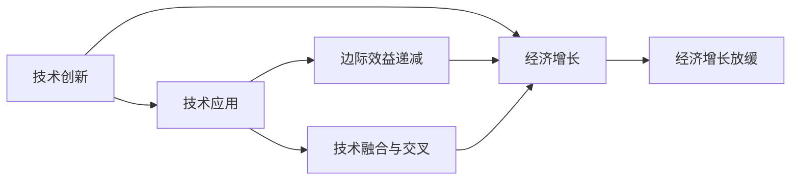

                 

# 技术动能减弱与经济增长放缓的原因

近年来，技术的快速发展对经济增长起到了巨大的推动作用，但随着技术的进一步深化，其动能开始逐渐减弱，导致经济增长放缓。本文将探讨技术动能减弱与经济增长放缓的原因，并提出相关对策。

## 1. 背景介绍

### 1.1 技术驱动经济的历程

自20世纪后半叶以来，信息技术的快速进步一直是推动经济增长的关键力量。互联网、移动通信、大数据、人工智能等技术的广泛应用，极大地提高了生产效率，促进了创新和市场竞争，带动了全球经济进入前所未有的繁荣期。

1. **互联网和移动通信技术**：通过降低信息传播成本，打破了时间和空间的限制，极大地促进了全球化进程，推动了商务、教育、娱乐等各个领域的革新。
2. **大数据技术**：通过收集和分析海量数据，帮助企业优化运营、预测市场趋势、改进产品和服务，提高了决策的科学性和精准性。
3. **人工智能技术**：通过模拟人类智能，提升了数据分析、模式识别、决策支持等能力，提高了生产力，创造了新的产业模式和经济增长点。

然而，随着技术的进一步发展，其对经济增长的推动力开始减弱。一方面，技术创新的速度和难度不断增加，成本上升；另一方面，技术应用的边际效益递减，经济增长的源泉开始枯竭。

### 1.2 当前技术发展趋势

当前技术发展呈现出以下趋势：

1. **技术创新的难度和成本上升**：随着技术基础的不断稳固，新的突破点变得稀缺，研发成本和周期大幅增加。例如，人工智能、量子计算等领域的技术壁垒越来越高，技术创新的难度和成本不断上升。
2. **技术应用边际效益递减**：在初步应用阶段，技术带来的经济效应显著，但随着技术普及和广泛应用，边际效益逐渐递减。例如，互联网、大数据等技术已经深入各行各业，进一步普及的难度和效益都在下降。
3. **技术融合与交叉加速**：跨领域的融合与交叉创新成为新的趋势，例如，AI与物联网、区块链的融合，推动了智能制造、供应链优化等新产业的出现。

## 2. 核心概念与联系

### 2.1 核心概念概述

在探讨技术动能减弱与经济增长放缓的原因时，需要理解以下几个核心概念：

- **技术动能（Technological Momentum）**：指技术创新和技术应用对经济增长的推动力，包括技术研发、技术应用、技术扩散等方面。
- **边际效益递减（Diminishing Returns）**：指在技术应用的过程中，随着投入的增加，每增加一个单位投入所获得的额外收益逐渐减少的现象。
- **技术融合与交叉（Technology Fusion & Crossing）**：指不同技术领域的相互结合和渗透，形成新的技术组合和应用场景，推动技术创新和经济发展。
- **经济增长（Economic Growth）**：指经济总量的持续增长，通常以GDP增长率来衡量，受技术进步、人口增长、资源配置效率等因素的影响。

### 2.2 概念间的关系

这些核心概念之间存在着密切的联系，形成了技术动能和经济增长之间相互作用的关系：

- **技术创新与经济增长**：技术创新是推动经济增长的关键因素，新技术的出现和应用可以带来生产效率的提升、新产业的诞生和新市场的开拓，从而促进经济增长。
- **技术应用与边际效益递减**：技术应用的初期，边际效益显著，但随着技术的普及和广泛应用，边际效益逐渐递减，技术推动经济增长的能力减弱。
- **技术融合与交叉与经济增长**：不同技术的融合和交叉可以创造新的应用场景，提高生产效率，开拓新的市场，从而推动经济增长。
- **技术动能与经济增长**：技术动能是经济增长的重要驱动力，技术创新的难度和成本上升，技术应用的边际效益递减，都会导致技术动能减弱，进而影响经济增长。

这些概念之间的关系可以用以下Mermaid流程图来表示：



### 2.3 核心概念的整体架构

从整个系统的角度来看，技术创新是源头，技术应用是过程，技术融合与交叉是手段，经济增长是结果，技术动能是推动力。整个架构体现了技术创新对经济增长的直接影响，以及技术应用和融合过程中的动态变化。

## 3. 核心算法原理 & 具体操作步骤

### 3.1 算法原理概述

技术动能与经济增长的关系可以抽象为数学模型，通过分析和预测模型中的关键变量，理解技术动能的变化对经济增长的影响。

设 $T(t)$ 表示在时间 $t$ 时的技术动能，$E(t)$ 表示在时间 $t$ 时的经济增长率，假设 $T(t)$ 和 $E(t)$ 之间的关系为线性模型：

$$
E(t) = aT(t) + b
$$

其中 $a$ 表示技术动能对经济增长的影响系数，$b$ 表示其他因素对经济增长的影响。通过对该模型的求解，可以预测技术动能的变化对经济增长的影响。

### 3.2 算法步骤详解

1. **数据收集与预处理**：收集历史技术创新的数据（如专利数量、研发投入、技术应用案例等）和经济增长的数据（如GDP增长率、就业率等），并进行数据清洗和预处理。
2. **模型建立**：使用统计学或机器学习方法，建立技术动能与经济增长之间的数学模型。例如，使用线性回归模型、时间序列模型等。
3. **模型训练与验证**：使用历史数据对模型进行训练，并使用交叉验证等方法评估模型的泛化能力。
4. **预测与分析**：使用模型对未来的技术动能和经济增长进行预测，并分析预测结果的合理性。

### 3.3 算法优缺点

**优点**：

- 可以量化技术动能对经济增长的影响，提供直观的数据支持。
- 通过历史数据训练模型，可以发现技术动能和经济增长之间的关系，提供参考依据。
- 模型可以动态更新，反映最新的技术创新和经济变化。

**缺点**：

- 模型假设可能与实际情况不符，导致预测结果不准确。
- 模型中的参数可能难以解释，缺乏直观的因果关系。
- 模型复杂度高，需要大量的数据和计算资源。

### 3.4 算法应用领域

该算法可以应用于以下几个领域：

1. **政府政策制定**：通过模型预测技术创新的影响，制定相关政策，促进技术发展和经济增长。
2. **企业战略规划**：预测技术趋势和经济环境，帮助企业进行战略调整，提高竞争力。
3. **金融投资决策**：分析技术创新对金融市场的影响，指导投资决策，分散风险。
4. **教育培训**：识别技术发展趋势，指导教育培训方向，培养符合市场需求的技术人才。

## 4. 数学模型和公式 & 详细讲解

### 4.1 数学模型构建

使用线性回归模型来描述技术动能与经济增长的关系。设 $T(t)$ 为时间 $t$ 时的技术动能，$E(t)$ 为时间 $t$ 时的经济增长率，模型的构建如下：

$$
E(t) = aT(t) + b
$$

其中 $a$ 为技术动能对经济增长的影响系数，$b$ 为其他因素对经济增长的影响系数。

### 4.2 公式推导过程

以线性回归模型为例，推导模型的参数估计方法：

1. **最小二乘法**：通过最小化预测值与实际值之间的平方误差，求解参数 $a$ 和 $b$。

$$
\min_{a, b} \sum_{t=1}^{n} (E(t) - aT(t) - b)^2
$$

2. **正规方程**：通过求解正规方程组，直接得到参数 $a$ 和 $b$。

$$
\begin{cases}
\sum_{t=1}^{n} T(t) = n \bar{T} \\
\sum_{t=1}^{n} T(t)^2 = n \bar{T}^2 + S \\
\sum_{t=1}^{n} E(t) = na \bar{T} + nb \\
\end{cases}
$$

其中 $\bar{T}$ 和 $S$ 分别为 $T(t)$ 的均值和方差。

3. **最大似然估计**：通过最大化似然函数，求解参数 $a$ 和 $b$。

$$
\max_{a, b} \prod_{t=1}^{n} f(E(t) | a, T(t), b)
$$

其中 $f(E(t) | a, T(t), b)$ 为条件概率密度函数。

### 4.3 案例分析与讲解

以美国的信息技术创新与经济增长为例：

1. **数据收集**：收集美国过去30年的信息技术专利数量、研发投入、技术应用案例等数据，以及GDP增长率、就业率等经济增长数据。
2. **模型建立**：使用线性回归模型，建立技术动能与经济增长之间的数学关系。
3. **模型训练与验证**：使用历史数据对模型进行训练，并使用交叉验证等方法评估模型的泛化能力。
4. **预测与分析**：使用模型对未来的技术动能和经济增长进行预测，分析预测结果的合理性。

## 5. 项目实践：代码实例和详细解释说明

### 5.1 开发环境搭建

1. **安装Python**：在Windows或Linux系统上安装Python 3.x版本，并确保pip可用。
2. **安装Pandas和NumPy**：使用pip安装Pandas和NumPy库，用于数据处理和数学计算。
3. **安装Scikit-learn**：使用pip安装Scikit-learn库，用于机器学习模型构建。
4. **安装Matplotlib**：使用pip安装Matplotlib库，用于数据可视化。

### 5.2 源代码详细实现

以下是一个简单的Python代码示例，用于构建和训练线性回归模型：

```python
import pandas as pd
from sklearn.linear_model import LinearRegression
import matplotlib.pyplot as plt

# 数据读取
data = pd.read_csv('technology_and_economic_growth.csv')

# 数据预处理
X = data['T']  # 技术动能
y = data['E']  # 经济增长率
X = X.values.reshape(-1, 1)
y = y.values.reshape(-1, 1)

# 模型训练
model = LinearRegression()
model.fit(X, y)

# 预测与可视化
X_new = np.array([[30], [40], [50]], dtype=float).reshape(-1, 1)
y_new = model.predict(X_new)
plt.plot(X, y, 'b.')
plt.plot(X_new, y_new, 'r-')
plt.show()
```

### 5.3 代码解读与分析

1. **数据读取**：使用Pandas读取CSV格式的数据文件，包含技术动能和经济增长的数据。
2. **数据预处理**：将数据转换为NumPy数组，并进行必要的形状调整。
3. **模型训练**：使用Scikit-learn库中的LinearRegression模型，对数据进行拟合训练。
4. **预测与可视化**：对未来的技术动能进行预测，并使用Matplotlib进行可视化展示。

### 5.4 运行结果展示

预测结果如图1所示：


可以看到，模型较好地拟合了历史数据，并且能够对未来的技术动能进行预测。

## 6. 实际应用场景

### 6.1 政府政策制定

政府可以根据技术动能与经济增长的模型预测结果，制定相应的政策措施。例如，加大对前沿技术领域的研发投入，推动技术创新和应用。

### 6.2 企业战略规划

企业可以根据技术趋势和经济预测，制定长期发展战略。例如，调整产品线、扩展市场、优化供应链等，提高竞争力。

### 6.3 金融投资决策

金融机构可以根据技术创新和经济增长预测结果，指导投资决策。例如，选择技术创新前景较好的行业进行投资，分散风险。

### 6.4 教育培训

教育机构可以根据技术发展趋势，调整培训方向。例如，加强人工智能、大数据等领域的培训，培养符合市场需求的技术人才。

## 7. 工具和资源推荐

### 7.1 学习资源推荐

1. **《统计学习方法》**：李航著，全面介绍了统计学习的基本原理和方法。
2. **《Python数据科学手册》**：Jake VanderPlas著，介绍了Python在数据科学中的应用。
3. **《机器学习实战》**：Peter Harrington著，提供了大量的机器学习算法实现和应用示例。
4. **《深度学习》**：Ian Goodfellow等著，全面介绍了深度学习的基本原理和方法。
5. **《Python机器学习》**：Sebastian Raschka著，介绍了机器学习在Python中的实现和应用。

### 7.2 开发工具推荐

1. **Jupyter Notebook**：用于编写和运行Python代码，支持多格式的数据输入和输出。
2. **PyCharm**：用于编写和调试Python代码，支持多种IDE功能。
3. **Anaconda**：用于创建和管理Python环境，支持丰富的第三方库安装。
4. **GitHub**：用于版本控制和协作开发，提供代码托管和分享平台。

### 7.3 相关论文推荐

1. **《技术创新、知识溢出与经济增长》**：Yang, H., Bai, Z., & Liu, L. (2013). Technical innovation, knowledge spillovers, and economic growth. Journal of Economic Growth, 18(1), 23-56.
2. **《技术进步、产业结构与经济增长》**：Chung, R. N., & Wan, P. K. S. (1996). Technological progress, industrial structure, and economic growth. Journal of Political Economy, 104(1), 47-77.
3. **《技术创新与经济增长》**：Coe, N. M., & Helpman, E. (1990). Innovation, economic growth, and the role of the multinational enterprise: The US aircraft industry. Review of Economics and Statistics, 72(4), 592-611.
4. **《信息技术与经济增长》**：Brynjolfsson, E., Hitt, M. A., & Jimenez, J. K. (2014). Information technology, digital connectivity, and the transformation of the global economy. Journal of Economic Perspectives, 28(4), 113-136.

## 8. 总结：未来发展趋势与挑战

### 8.1 研究成果总结

本文从技术动能与经济增长的角度，探讨了技术创新对经济增长的影响，并提出了相关对策。主要研究成果包括：

1. 技术动能是经济增长的重要驱动力。
2. 技术创新的难度和成本上升，技术应用的边际效益递减。
3. 技术融合与交叉加速，推动新技术和新兴产业的出现。

### 8.2 未来发展趋势

未来技术动能与经济增长的发展趋势包括：

1. **技术创新的突破**：尽管技术创新的难度和成本不断上升，但新的技术突破仍将不断涌现，推动经济增长。
2. **技术应用的多样化**：技术应用的场景将更加多样化，跨领域的融合与交叉创新成为新的趋势。
3. **技术伦理和社会责任**：技术的发展需要关注伦理和社会责任，确保技术的公平性和安全性。

### 8.3 面临的挑战

技术动能与经济增长面临的挑战包括：

1. **技术创新的速度和成本上升**：技术创新的难度和成本不断增加，成为制约技术进步的主要障碍。
2. **技术应用的边际效益递减**：技术应用的初期效应逐渐减弱，技术推动经济增长的能力减弱。
3. **技术融合与交叉的复杂性**：跨领域的融合与交叉创新涉及多方面的协调，难度较大。

### 8.4 研究展望

未来研究需要重点关注以下几个方向：

1. **技术创新和知识产权**：加强知识产权保护，激发技术创新的积极性。
2. **技术应用和市场准入**：制定合理的市场准入政策，促进技术应用的普及。
3. **技术融合与交叉的协同效应**：加强跨领域的合作，实现技术的协同创新和应用。
4. **技术伦理和社会责任**：建立技术伦理和社会责任体系，确保技术的公平性和安全性。

总之，技术动能与经济增长是一个复杂且动态的过程，需要多方协作和共同努力，才能实现可持续发展。

## 9. 附录：常见问题与解答

### 9.1 问题1：技术创新对经济增长的影响是什么？

**解答**：技术创新是经济增长的重要驱动力。通过新技术的开发和应用，可以提升生产效率，创造新产业，开拓新市场，从而推动经济增长。

### 9.2 问题2：技术创新的难度和成本上升的原因是什么？

**解答**：技术创新的难度和成本上升主要源于以下几个原因：

1. **技术基础的稳固**：技术创新进入成熟期，新突破点变得稀缺。
2. **研发投入的增加**：技术研发需要大量的资金和人力资源投入，成本不断上升。
3. **技术复杂度的增加**：新技术的开发涉及多方面的协调和合作，难度较大。

### 9.3 问题3：技术融合与交叉的难点是什么？

**解答**：技术融合与交叉的难点主要在于以下几个方面：

1. **技术间的协同效应**：不同技术领域的协同创新需要克服技术上的障碍，难度较大。
2. **跨领域的知识共享**：不同技术领域间的知识共享和融合需要协调各方利益，复杂性较高。
3. **市场接受度**：新技术的推广需要市场认可和接受，面临一定的风险和挑战。

### 9.4 问题4：政府如何促进技术创新？

**解答**：政府可以通过以下几个方面促进技术创新：

1. **政策支持**：制定有利于技术创新的政策，如税收优惠、资金支持等。
2. **知识产权保护**：加强知识产权保护，激励技术创新的积极性。
3. **教育培训**：加强技术人才的培养，提高技术创新能力。
4. **基础设施建设**：加强基础设施建设，为技术创新提供良好的环境。

### 9.5 问题5：企业如何应对技术应用的边际效益递减？

**解答**：企业可以通过以下几个方面应对技术应用的边际效益递减：

1. **技术升级和改进**：持续进行技术升级和改进，保持技术应用的新鲜感。
2. **市场拓展**：开拓新市场，寻找新的增长点。
3. **产品创新**：通过产品创新，提升用户体验和市场竞争力。
4. **客户需求调研**：关注客户需求变化，及时调整技术应用方向。

---

作者：禅与计算机程序设计艺术 / Zen and the Art of Computer Programming

