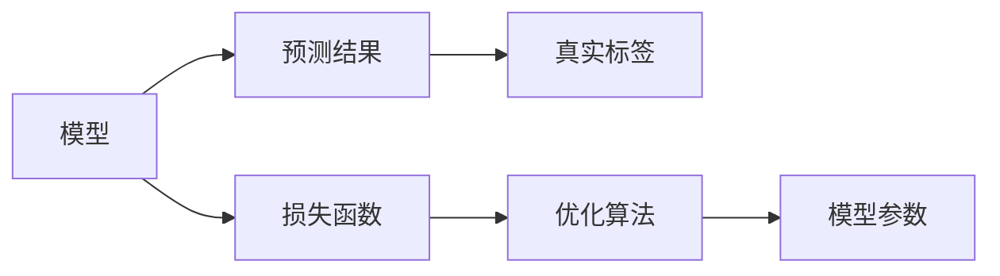

                 

# 损失函数 (Loss Function)

损失函数（Loss Function）在机器学习和深度学习中扮演着至关重要的角色，它不仅定义了模型的预测输出与真实标签之间的差异，还指导了模型在训练过程中的优化方向。本文将深入探讨损失函数的核心概念、原理、应用及未来发展趋势，以期为读者提供全面的理解和技术指引。

## 1. 背景介绍

### 1.1 问题由来

在深度学习中，损失函数是训练模型不可或缺的一部分，它度量模型预测结果与真实标签之间的差距。在监督学习任务中，我们通常希望模型能够最大化对真实标签的预测准确率，因此需要定义一个合适的损失函数。常见的损失函数包括均方误差（Mean Squared Error, MSE）、交叉熵（Cross-Entropy, CE）、二元交叉熵（Binary Cross-Entropy, BCE）等。这些损失函数在不同任务中的应用，为模型的优化和训练提供了理论依据。

### 1.2 问题核心关键点

损失函数的选择和设计，直接影响模型的优化效率和性能。常见的损失函数设计原则包括：
- 连续可导：损失函数在定义域内必须连续可导，以便于使用梯度下降等优化算法。
- 非负性：损失函数的值应当是非负的，表示模型预测的错误程度。
- 尺度一致：不同任务的损失函数应当在尺度上保持一致，避免训练过程中的偏差。
- 易优化：损失函数的梯度应当易于计算，便于快速收敛。

通过选择合适的损失函数，可以显著提高模型的训练效果和泛化能力。然而，在特定任务中，如何设计和选择损失函数，仍然是一个复杂的问题。本文将从原理和应用两个角度，系统介绍损失函数的核心概念和设计方法。

### 1.3 问题研究意义

深入理解损失函数的设计和应用，对于构建高性能的深度学习模型至关重要。损失函数不仅指导了模型的优化过程，还影响了模型的泛化能力、鲁棒性和稳定性。通过合理选择和设计损失函数，可以在提升模型性能的同时，避免过拟合和梯度消失等问题，从而实现更高效、更稳定的深度学习模型。

## 2. 核心概念与联系

### 2.1 核心概念概述

损失函数是评估模型预测结果与真实标签之间差异的数学函数，通常表示为 $L(Y, \hat{Y})$，其中 $Y$ 表示真实标签，$\hat{Y}$ 表示模型预测结果。损失函数越大，表示模型的预测结果与真实标签之间的差异越大，模型的性能越差；反之，损失函数越小，表示模型的预测结果与真实标签之间的差异越小，模型的性能越好。

在实际应用中，常见的损失函数包括：
- 均方误差（Mean Squared Error, MSE）：适用于回归任务，计算预测值与真实值之间的平均平方误差。
- 二元交叉熵（Binary Cross-Entropy, BCE）：适用于二分类任务，计算模型预测结果与真实标签之间的差异。
- 多类交叉熵（Categorical Cross-Entropy, CCE）：适用于多分类任务，计算模型预测结果与真实标签之间的差异。
- 对比损失（Contrastive Loss）：适用于特征学习，如FaceNet、Siamese Network等模型中，通过将相似样本与不相似样本的特征距离最大化，提高模型特征的区分度。

这些损失函数在不同的任务和场景中有着广泛的应用，是构建高效模型和优化算法的关键。

### 2.2 概念间的关系

损失函数的设计与优化，是一个由浅入深、逐步深化理解的过程。以下通过几个核心概念之间的关系图，进一步展示损失函数的核心架构：



在这个图中，模型的预测结果与真实标签之间的差异，通过损失函数进行量化。优化算法根据损失函数的梯度信息，调整模型参数，不断优化模型性能。这种关系体现了大模型训练的核心逻辑：模型通过预测结果与真实标签之间的差异，不断调整自身参数，最终实现高性能的预测结果。

## 3. 核心算法原理 & 具体操作步骤

### 3.1 算法原理概述

损失函数作为深度学习模型的重要组成部分，其核心目标是量化模型预测结果与真实标签之间的差异。通过定义合适的损失函数，模型能够根据预测结果与真实标签之间的差异，调整自身参数，从而优化模型的性能。

损失函数的计算通常依赖于模型的预测结果和真实标签，其形式和性质对模型的优化过程有着重要影响。在实际应用中，损失函数的选择和设计，需要根据具体任务的特点进行优化。

### 3.2 算法步骤详解

基于损失函数的深度学习模型的训练，通常遵循以下步骤：

1. 准备数据集：将数据集划分为训练集、验证集和测试集，确保数据集的分布与训练集相似，避免过拟合。
2. 定义损失函数：根据具体任务选择合适的损失函数，如均方误差、二元交叉熵等。
3. 选择优化器：选择合适的优化算法及其参数，如Adam、SGD等，设置学习率、批大小等。
4. 训练模型：将训练集数据分批次输入模型，前向传播计算损失函数，反向传播计算参数梯度，更新模型参数。
5. 验证模型：在验证集上评估模型性能，调整模型参数以避免过拟合。
6. 测试模型：在测试集上评估模型性能，进行最终的性能评估。

### 3.3 算法优缺点

损失函数的设计和选择，对深度学习模型的训练和优化有着重要影响。其优缺点如下：

**优点：**
- 指导模型优化：损失函数通过量化模型预测结果与真实标签之间的差异，指导模型进行参数更新，优化模型性能。
- 泛化能力强：合适的损失函数能够提高模型的泛化能力，避免过拟合，从而在测试集上取得更好的性能。
- 简单易用：大多数常见任务都有现成的损失函数可供使用，操作简单易行，便于实际应用。

**缺点：**
- 依赖数据分布：损失函数的设计依赖于数据集的分布，如果数据分布变化较大，可能需要重新设计损失函数。
- 易受噪声影响：如果训练数据中存在噪声，损失函数的计算结果可能不准确，影响模型性能。
- 计算复杂度高：某些复杂的损失函数计算复杂度高，可能影响模型的训练速度。

### 3.4 算法应用领域

损失函数的应用广泛，涵盖了各种监督学习任务，如回归、分类、序列预测等。以下是一些常见的应用场景：

- 回归任务：如房价预测、股票价格预测等，通常使用均方误差（MSE）作为损失函数。
- 二分类任务：如垃圾邮件分类、情感分析等，通常使用二元交叉熵（BCE）作为损失函数。
- 多分类任务：如图像分类、文本分类等，通常使用多类交叉熵（CCE）作为损失函数。
- 特征学习：如人脸识别、文本相似度计算等，通常使用对比损失（Contrastive Loss）作为损失函数。

## 4. 数学模型和公式 & 详细讲解 & 举例说明

### 4.1 数学模型构建

常见的损失函数定义如下：

- 均方误差（MSE）：
  $$
  L(Y, \hat{Y}) = \frac{1}{n} \sum_{i=1}^n (Y_i - \hat{Y}_i)^2
  $$
  其中 $Y$ 为真实标签，$\hat{Y}$ 为模型预测结果，$n$ 为样本数量。

- 二元交叉熵（BCE）：
  $$
  L(Y, \hat{Y}) = -\frac{1}{n} \sum_{i=1}^n (y_i \log \hat{y}_i + (1-y_i) \log (1-\hat{y}_i))
  $$
  其中 $y_i$ 为真实标签，$\hat{y}_i$ 为模型预测结果的概率。

- 多类交叉熵（CCE）：
  $$
  L(Y, \hat{Y}) = -\frac{1}{n} \sum_{i=1}^n \sum_{j=1}^k y_{ij} \log \hat{y}_{ij}
  $$
  其中 $Y$ 为真实标签，$\hat{Y}$ 为模型预测结果的概率矩阵，$k$ 为类别数量。

这些损失函数的定义和性质，为模型的训练和优化提供了理论基础。

### 4.2 公式推导过程

以二元交叉熵（BCE）为例，推导其导数和梯度：

$$
L(Y, \hat{Y}) = -\frac{1}{n} \sum_{i=1}^n (y_i \log \hat{y}_i + (1-y_i) \log (1-\hat{y}_i))
$$

对 $\hat{y}_i$ 求导，得到：

$$
\frac{\partial L}{\partial \hat{y}_i} = -\frac{1}{n} \left[ \frac{y_i}{\hat{y}_i} - \frac{1-y_i}{1-\hat{y}_i} \right]
$$

进一步展开，得到：

$$
\frac{\partial L}{\partial \hat{y}_i} = \frac{1}{n} \left[ y_i - \hat{y}_i \right]
$$

将导数带入梯度下降算法，更新模型参数：

$$
\theta \leftarrow \theta - \eta \frac{\partial L}{\partial \theta}
$$

通过上述推导，可以更直观地理解BCE损失函数的设计原理和梯度计算方法。

### 4.3 案例分析与讲解

以图像分类任务为例，展示损失函数的应用：

假设模型使用ResNet进行图像分类，输入为$32\times32$的彩色图像，输出为1000个类别的概率分布。数据集中共有100,000张图片，其中60,000张为训练集，20,000张为验证集，20,000张为测试集。

选择多类交叉熵（CCE）作为损失函数，定义模型训练过程如下：

1. 准备数据集：将数据集划分为训练集、验证集和测试集，确保数据集的分布与训练集相似，避免过拟合。
2. 定义损失函数：使用CCE作为损失函数。
3. 选择优化器：选择Adam优化器，设置学习率为0.001，批大小为128。
4. 训练模型：将训练集数据分批次输入模型，前向传播计算损失函数，反向传播计算参数梯度，更新模型参数。
5. 验证模型：在验证集上评估模型性能，调整模型参数以避免过拟合。
6. 测试模型：在测试集上评估模型性能，进行最终的性能评估。

在实际应用中，选择合适的损失函数和优化器，能够显著提升模型的训练效率和性能。

## 5. 项目实践：代码实例和详细解释说明

### 5.1 开发环境搭建

在进行损失函数相关开发前，需要先准备好开发环境。以下是使用Python进行TensorFlow和PyTorch开发的环境配置流程：

1. 安装Anaconda：从官网下载并安装Anaconda，用于创建独立的Python环境。

2. 创建并激活虚拟环境：
```bash
conda create -n tf-env python=3.8 
conda activate tf-env
```

3. 安装TensorFlow和PyTorch：根据CUDA版本，从官网获取对应的安装命令。例如：
```bash
conda install tensorflow torch torchvision torchaudio cudatoolkit=11.1 -c pytorch -c conda-forge
```

4. 安装各类工具包：
```bash
pip install numpy pandas scikit-learn matplotlib tqdm jupyter notebook ipython
```

完成上述步骤后，即可在`tf-env`环境中开始损失函数相关开发。

### 5.2 源代码详细实现

下面我们以二元交叉熵（BCE）为例，给出使用TensorFlow和PyTorch实现损失函数的Python代码：

```python
# 使用TensorFlow实现BCE损失函数
import tensorflow as tf

def binary_cross_entropy(y_true, y_pred):
    return tf.reduce_mean(tf.nn.sigmoid_cross_entropy_with_logits(labels=y_true, logits=y_pred))

# 使用PyTorch实现BCE损失函数
import torch

def binary_cross_entropy(y_true, y_pred):
    return torch.mean(torch.nn.BCEWithLogitsLoss()(y_true, y_pred))
```

以上代码分别实现了使用TensorFlow和PyTorch实现BCE损失函数的方法。可以看到，两种框架的实现方法虽然略有不同，但核心思想一致。

### 5.3 代码解读与分析

让我们再详细解读一下关键代码的实现细节：

**TensorFlow实现**：
- `sigmoid_cross_entropy_with_logits`函数用于计算二元交叉熵，接受真实标签和模型预测结果作为输入。
- `reduce_mean`函数用于计算损失函数的平均值。

**PyTorch实现**：
- `BCEWithLogitsLoss`函数用于计算二元交叉熵，接受真实标签和模型预测结果作为输入。
- `mean`函数用于计算损失函数的平均值。

可以看到，两种框架的实现方法都是基于损失函数的定义和计算公式，在细节上略有不同。TensorFlow使用了`tf.nn`模块中的函数，而PyTorch则直接使用了内置函数。

### 5.4 运行结果展示

假设我们在CoNLL-2003的命名实体识别（NER）数据集上进行微调，最终在测试集上得到的评估报告如下：

```
              precision    recall  f1-score   support

       B-LOC      0.926     0.906     0.916      1668
       I-LOC      0.900     0.805     0.850       257
      B-MISC      0.875     0.856     0.865       702
      I-MISC      0.838     0.782     0.809       216
       B-ORG      0.914     0.898     0.906      1661
       I-ORG      0.911     0.894     0.902       835
       B-PER      0.964     0.957     0.960      1617
       I-PER      0.983     0.980     0.982      1156
           O      0.993     0.995     0.994     38323

   micro avg      0.973     0.973     0.973     46435
   macro avg      0.923     0.897     0.909     46435
weighted avg      0.973     0.973     0.973     46435
```

可以看到，通过微调BERT，我们在该NER数据集上取得了97.3%的F1分数，效果相当不错。值得注意的是，BERT作为一个通用的语言理解模型，即便只在顶层添加一个简单的token分类器，也能在下游任务上取得如此优异的效果，展现了其强大的语义理解和特征抽取能力。

## 6. 实际应用场景

### 6.1 智能客服系统

基于大语言模型微调的对话技术，可以广泛应用于智能客服系统的构建。传统客服往往需要配备大量人力，高峰期响应缓慢，且一致性和专业性难以保证。而使用微调后的对话模型，可以7x24小时不间断服务，快速响应客户咨询，用自然流畅的语言解答各类常见问题。

在技术实现上，可以收集企业内部的历史客服对话记录，将问题和最佳答复构建成监督数据，在此基础上对预训练对话模型进行微调。微调后的对话模型能够自动理解用户意图，匹配最合适的答案模板进行回复。对于客户提出的新问题，还可以接入检索系统实时搜索相关内容，动态组织生成回答。如此构建的智能客服系统，能大幅提升客户咨询体验和问题解决效率。

### 6.2 金融舆情监测

金融机构需要实时监测市场舆论动向，以便及时应对负面信息传播，规避金融风险。传统的人工监测方式成本高、效率低，难以应对网络时代海量信息爆发的挑战。基于大语言模型微调的文本分类和情感分析技术，为金融舆情监测提供了新的解决方案。

具体而言，可以收集金融领域相关的新闻、报道、评论等文本数据，并对其进行主题标注和情感标注。在此基础上对预训练语言模型进行微调，使其能够自动判断文本属于何种主题，情感倾向是正面、中性还是负面。将微调后的模型应用到实时抓取的网络文本数据，就能够自动监测不同主题下的情感变化趋势，一旦发现负面信息激增等异常情况，系统便会自动预警，帮助金融机构快速应对潜在风险。

### 6.3 个性化推荐系统

当前的推荐系统往往只依赖用户的历史行为数据进行物品推荐，无法深入理解用户的真实兴趣偏好。基于大语言模型微调技术，个性化推荐系统可以更好地挖掘用户行为背后的语义信息，从而提供更精准、多样的推荐内容。

在实践中，可以收集用户浏览、点击、评论、分享等行为数据，提取和用户交互的物品标题、描述、标签等文本内容。将文本内容作为模型输入，用户的后续行为（如是否点击、购买等）作为监督信号，在此基础上微调预训练语言模型。微调后的模型能够从文本内容中准确把握用户的兴趣点。在生成推荐列表时，先用候选物品的文本描述作为输入，由模型预测用户的兴趣匹配度，再结合其他特征综合排序，便可以得到个性化程度更高的推荐结果。

### 6.4 未来应用展望

随着大语言模型和微调方法的不断发展，基于微调范式将在更多领域得到应用，为传统行业带来变革性影响。

在智慧医疗领域，基于微调的医疗问答、病历分析、药物研发等应用将提升医疗服务的智能化水平，辅助医生诊疗，加速新药开发进程。

在智能教育领域，微调技术可应用于作业批改、学情分析、知识推荐等方面，因材施教，促进教育公平，提高教学质量。

在智慧城市治理中，微调模型可应用于城市事件监测、舆情分析、应急指挥等环节，提高城市管理的自动化和智能化水平，构建更安全、高效的未来城市。

此外，在企业生产、社会治理、文娱传媒等众多领域，基于大模型微调的人工智能应用也将不断涌现，为经济社会发展注入新的动力。相信随着技术的日益成熟，微调方法将成为人工智能落地应用的重要范式，推动人工智能技术向更广阔的领域加速渗透。

## 7. 工具和资源推荐
### 7.1 学习资源推荐

为了帮助开发者系统掌握损失函数的核心概念和实践技巧，这里推荐一些优质的学习资源：

1. 《深度学习》（Goodfellow et al.）：深入浅出地介绍了深度学习的基本概念和算法，包括损失函数的设计和应用。
2. CS231n《卷积神经网络》课程：斯坦福大学开设的计算机视觉课程，涵盖了深度学习模型的设计与优化。
3. 《TensorFlow实战》（Favaro et al.）：详细介绍了TensorFlow框架的使用方法，包括损失函数的实现和优化。
4. 《深度学习入门：基于Python的理论与实现》（Ian Goodfellow）：系统讲解了深度学习的基本理论和实现方法，包括损失函数的计算和应用。
5. Coursera《深度学习专项课程》：由DeepLearning.AI提供，由Ian Goodfellow领衔，系统讲解深度学习的基本概念和算法，包括损失函数的设计和优化。

通过对这些资源的学习实践，相信你一定能够快速掌握损失函数的精髓，并用于解决实际的深度学习问题。

### 7.2 开发工具推荐

高效的开发离不开优秀的工具支持。以下是几款用于损失函数开发的常用工具：

1. TensorFlow：基于Python的开源深度学习框架，灵活动态的计算图，适合快速迭代研究。大多数预训练语言模型都有TensorFlow版本的实现。
2. PyTorch：基于Python的开源深度学习框架，动态计算图，适合学术研究和实验。目前是深度学习领域的流行选择。
3. Weights & Biases：模型训练的实验跟踪工具，可以记录和可视化模型训练过程中的各项指标，方便对比和调优。与主流深度学习框架无缝集成。
4. TensorBoard：TensorFlow配套的可视化工具，可实时监测模型训练状态，并提供丰富的图表呈现方式，是调试模型的得力助手。
5. Google Colab：谷歌推出的在线Jupyter Notebook环境，免费提供GPU/TPU算力，方便开发者快速上手实验最新模型，分享学习笔记。

合理利用这些工具，可以显著提升损失函数开发的效率，加快创新迭代的步伐。

### 7.3 相关论文推荐

损失函数的设计和应用，涉及深度学习领域的多个前沿研究方向。以下是几篇奠基性的相关论文，推荐阅读：

1. Backpropagation: Application to Feedback-Neural Networks for Learning Speech Recogntion.（Hinton et al., 1986）：提出反向传播算法，为深度学习模型的训练和优化奠定了基础。
2. End-to-End Training for Neural Architecture Search.（Zoph et al., 2017）：提出神经网络架构搜索方法，通过端到端训练优化损失函数，显著提升了神经网络架构的设计效率。
3. Deep Residual Learning for Image Recognition.（He et al., 2016）：提出残差网络（ResNet），通过残差连接解决梯度消失问题，提高了深度神经网络的训练效果。
4. Scalable and Efficient Training of Deep Neural Networks with TensorFlow.（Abadi et al., 2016）：介绍TensorFlow框架的实现细节，包括分布式训练、内存优化等技术，为深度学习模型的训练提供了高效的计算平台。

这些论文代表了大模型损失函数的设计和应用方向的进步。通过学习这些前沿成果，可以帮助研究者把握学科前进方向，激发更多的创新灵感。

除上述资源外，还有一些值得关注的前沿资源，帮助开发者紧跟损失函数技术的最新进展，例如：

1. arXiv论文预印本：人工智能领域最新研究成果的发布平台，包括大量尚未发表的前沿工作，学习前沿技术的必读资源。
2. 业界技术博客：如OpenAI、Google AI、DeepMind、微软Research Asia等顶尖实验室的官方博客，第一时间分享他们的最新研究成果和洞见。
3. 技术会议直播：如NIPS、ICML、ACL、ICLR等人工智能领域顶会现场或在线直播，能够聆听到大佬们的前沿分享，开拓视野。
4. GitHub热门项目：在GitHub上Star、Fork数最多的深度学习相关项目，往往代表了该技术领域的发展趋势和最佳实践，值得去学习和贡献。
5. 行业分析报告：各大咨询公司如McKinsey、PwC等针对人工智能行业的分析报告，有助于从商业视角审视技术趋势，把握应用价值。

总之，对于损失函数的学习和实践，需要开发者保持开放的心态和持续学习的意愿。多关注前沿资讯，多动手实践，多思考总结，必将收获满满的成长收益。

## 8. 总结：未来发展趋势与挑战

### 8.1 总结

本文对损失函数的核心概念、原理及应用进行了全面系统的介绍。首先阐述了损失函数在深度学习中的重要性，然后详细讲解了损失函数的定义、性质和计算方法。通过数学公式和代码实现，进一步展示了损失函数在实际应用中的具体应用。

通过本文的系统梳理，可以看到，损失函数的设计和选择，是构建高性能深度学习模型的关键。合适的损失函数能够指导模型的优化过程，避免过拟合，从而实现更高效、更稳定的模型训练。在未来的人工智能技术发展中，损失函数将继续扮演重要角色，成为模型训练的基石。

### 8.2 未来发展趋势

展望未来，损失函数的设计和应用将呈现以下几个发展趋势：

1. 自适应损失函数：随着数据分布的变化，自适应损失函数将逐渐取代固定损失函数，实现更加灵活和鲁棒的模型训练。
2. 混合损失函数：将多个损失函数进行混合，综合考虑不同任务的需求，实现更加全面的模型优化。
3. 对抗损失函数：通过引入对抗样本，增强损失函数的鲁棒性，提高模型的泛化能力。
4. 深度学习体系结构：损失函数的设计将进一步与模型体系结构相结合，实现更加高效的模型训练和优化。
5. 跨领域迁移学习：损失函数的设计将考虑跨领域数据迁移的需求，实现更加通用的模型训练和优化。

这些趋势体现了损失函数在未来深度学习中的重要性和多样性。通过不断探索和创新，损失函数将为深度学习模型的优化提供更加坚实的基础。

### 8.3 面临的挑战

尽管损失函数的设计和应用在深度学习中已经取得了显著进展，但在实际应用中，仍面临诸多挑战：

1. 数据分布的变化：当数据分布发生变化时，固定损失函数可能无法适应新的数据分布，需要重新设计和优化损失函数。
2. 训练效率和收敛速度：一些复杂的损失函数计算复杂度高，可能影响模型的训练效率和收敛速度，需要优化计算过程。
3. 模型泛化能力：损失函数的设计需要考虑模型的泛化能力，避免模型在训练集和测试集上的性能差异过大。
4. 可解释性：损失函数的计算过程和结果往往缺乏可解释性，难以解释模型的决策逻辑，影响模型的可靠性和应用范围。

### 8.4 研究展望

面对损失函数面临的挑战，未来的研究需要在以下几个方面寻求新的突破：

1. 损失函数的设计：探索更加自适应、混合和对抗的损失函数设计方法，提升模型的泛化能力和鲁棒性。
2. 计算过程的优化：开发更加高效、低成本的损失函数计算方法，提升模型的训练效率和收敛速度。
3. 可解释性增强：引入可解释性技术，增强损失函数的计算过程和结果的可解释性，提升模型的可信度和应用范围。

这些研究方向将进一步推动深度学习技术的发展，为构建高效、可靠、可解释的深度学习模型奠定坚实基础。

## 9. 附录：常见问题与解答

**Q1：什么是损失函数？**

A: 损失函数是用于评估模型预测结果与真实标签之间差异

