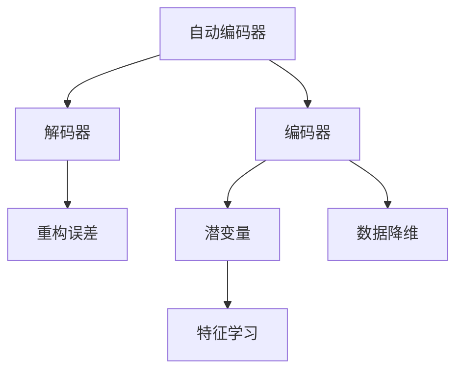

                 

## 1. 背景介绍

### 1.1 问题由来

在深度学习时代，自动编码器(Autoencoder)是其中一种非常重要的神经网络结构。它是一种无监督学习方法，通过重构原始数据来学习数据的低维表示，并以此来实现数据的降维、去噪、特征提取等多种功能。在信息压缩、图像处理、语音识别等领域，自动编码器都展现了强大的潜力。

然而，尽管自动编码器应用广泛，但理论上的优化问题、算法的实现细节以及实际应用中的挑战，使得理解自动编码器的工作原理变得复杂和困难。本文旨在系统讲解自动编码器，包括其核心算法、应用场景和代码实现，帮助读者深入理解自动编码器的思想和实践。

### 1.2 问题核心关键点

自动编码器的核心思想是通过重构过程将输入数据映射到低维空间，再通过解码器将其映射回原始空间，从而学习到数据的潜在表示。自动编码器分为编码器和解码器两部分，其中编码器将输入数据映射到低维空间，解码器则从低维空间重构回原始数据。

自动编码器的训练目标是尽可能使得重构后的数据与原始数据相似，即最小化重构误差。其常见的训练方式包括最小二乘法、均方误差损失等。

自动编码器具有以下几个优点：
- 数据降维：通过学习数据的低维表示，可以减小数据存储和计算的复杂度，提升数据处理效率。
- 去噪和特征提取：自动编码器能够学习到数据的噪声和重要特征，从而实现数据清洗和特征提取。
- 数据压缩：自动编码器可以压缩数据，保留重要信息，去除冗余，提高数据利用率。

同时，自动编码器也存在一些局限性：
- 过拟合问题：由于模型过于复杂，容易在训练集上过拟合。
- 训练过程不稳定：解码器的梯度消失问题导致训练过程不稳定，容易出现梯度爆炸或梯度消失。
- 数据维度的选择：编码器的维度选择需要根据具体数据特性和应用场景进行调整，否则可能会导致表示能力不足或过强。

## 2. 核心概念与联系

### 2.1 核心概念概述

为更好地理解自动编码器的原理和实现，本节将介绍几个密切相关的核心概念：

- 编码器(Encoder)：自动编码器的输入部分，负责将原始数据映射到低维空间。
- 解码器(Decoder)：自动编码器的输出部分，负责从低维空间重构回原始数据。
- 重构误差(Reconstruction Error)：输入数据和重构后数据之间的差异，自动编码器的主要优化目标。
- 特征学习(Feature Learning)：自动编码器在学习数据低维表示的同时，也能学习到数据的特征表示。
- 数据降维(Data Denoising)：通过自动编码器，可以去除数据的噪声和冗余信息，实现数据压缩。
- 潜变量(Latent Variable)：编码器学习到的低维空间中的变量，用于表示数据的潜在特征。

这些核心概念之间紧密联系，构成了自动编码器的主要框架和功能。通过理解这些概念，可以更好地把握自动编码器的工作机制和应用场景。

### 2.2 概念间的关系

这些核心概念之间的逻辑关系可以通过以下Mermaid流程图来展示：



这个流程图展示自动编码器的主要组成部分和功能：

1. 自动编码器由编码器和解码器组成，负责输入数据与重构数据之间的映射。
2. 编码器将输入数据映射到低维空间，解码器从低维空间重构回原始数据。
3. 重构误差表示输入数据与重构数据之间的差异，用于指导自动编码器的训练。
4. 编码器学习到的低维空间中的变量，即潜变量，用于表示数据的潜在特征。
5. 自动编码器同时具有数据降维和特征学习的能力。

通过这个流程图，可以更清晰地理解自动编码器的结构和功能。

## 3. 核心算法原理 & 具体操作步骤
### 3.1 算法原理概述

自动编码器的工作原理可以概括为两个过程：编码和解码。编码器将输入数据 $x$ 映射到低维空间 $z$，解码器则从低维空间 $z$ 重构回原始数据 $x'$。自动编码器的训练目标是尽可能使得重构误差最小化，即最小化 $x'$ 和 $x$ 之间的差异。

形式化地，设自动编码器的编码为 $z = E(x)$，解码器为 $x' = D(z)$，重构误差为 $\Delta(x) = x - x'$。自动编码器的训练目标为：

$$
\min_{E, D} \mathbb{E}_{x \sim p(x)} \Delta(x)
$$

其中 $p(x)$ 为输入数据的概率分布。

### 3.2 算法步骤详解

自动编码器的训练步骤如下：

1. 初始化编码器和解码器的参数。
2. 对于输入数据 $x$，通过编码器得到低维表示 $z$。
3. 将低维表示 $z$ 输入解码器，得到重构数据 $x'$。
4. 计算重构误差 $\Delta(x)$，并根据重构误差对编码器和解码器的参数进行更新。
5. 重复步骤2-4，直到模型收敛。

具体的优化算法有多种，包括梯度下降法、均方误差损失、交叉熵损失等。在训练过程中，我们通常使用梯度下降法，逐步更新编码器和解码器的权重参数，最小化重构误差。

### 3.3 算法优缺点

自动编码器具有以下几个优点：
- 数据降维：通过学习数据的低维表示，可以减小数据存储和计算的复杂度，提升数据处理效率。
- 去噪和特征提取：自动编码器能够学习到数据的噪声和重要特征，从而实现数据清洗和特征提取。
- 数据压缩：自动编码器可以压缩数据，保留重要信息，去除冗余，提高数据利用率。

同时，自动编码器也存在一些局限性：
- 过拟合问题：由于模型过于复杂，容易在训练集上过拟合。
- 训练过程不稳定：解码器的梯度消失问题导致训练过程不稳定，容易出现梯度爆炸或梯度消失。
- 数据维度的选择：编码器的维度选择需要根据具体数据特性和应用场景进行调整，否则可能会导致表示能力不足或过强。

### 3.4 算法应用领域

自动编码器在多个领域有着广泛的应用：

- 图像压缩：通过学习图像的低维表示，自动编码器可以显著压缩图像，减少存储需求，同时保持图像质量。
- 图像去噪：自动编码器能够学习到图像的噪声特征，并将其去除，得到更清晰的图像。
- 语音识别：自动编码器可以从语音信号中学习到潜在的特征，从而提高语音识别的准确率。
- 自然语言处理：自动编码器可以从文本中学习到词汇和语义的潜在表示，用于文本分类、情感分析等任务。
- 数据可视化：自动编码器可以将高维数据映射到低维空间，便于可视化分析。

此外，自动编码器还在生成对抗网络(GANs)、变分自编码器(VAEs)等深度学习领域中有着广泛的应用。

## 4. 数学模型和公式 & 详细讲解  
### 4.1 数学模型构建

自动编码器可以通过神经网络模型进行构建，一般包括一个编码器和一个解码器。编码器通常是一个全连接神经网络，解码器则通常是一个反向连接神经网络。

设编码器输入为 $x$，输出为低维表示 $z$，解码器输入为 $z$，输出为重构数据 $x'$。自动编码器的数学模型可以表示为：

$$
x' = D(z) \\
z = E(x)
$$

其中，$D$ 表示解码器，$E$ 表示编码器。

### 4.2 公式推导过程

下面以线性自动编码器为例，推导其重构误差和梯度计算公式。

设编码器 $E(x)$ 为：

$$
E(x) = W_e x + b_e
$$

解码器 $D(z)$ 为：

$$
D(z) = W_d z + b_d
$$

其中，$W_e$ 和 $W_d$ 分别为编码器和解码器的权重矩阵，$b_e$ 和 $b_d$ 分别为编码器和解码器的偏置向量。

设输入数据 $x$ 和重构数据 $x'$ 之间的重构误差为 $\Delta(x)$：

$$
\Delta(x) = x - x' = x - D(E(x)) = x - W_d W_e x - b_d
$$

自动编码器的优化目标为最小化重构误差：

$$
\min_{W_e, W_d} \mathbb{E}_{x \sim p(x)} \Delta(x)^2
$$

取均方误差损失函数，自动编码器的梯度计算公式为：

$$
\frac{\partial \Delta(x)}{\partial W_e} = \frac{\partial W_d W_e x + b_d}{\partial W_e} - 2 \Delta(x) E(x) = W_d x - 2 \Delta(x) E(x) \\
\frac{\partial \Delta(x)}{\partial W_d} = \frac{\partial W_d W_e x + b_d}{\partial W_d} - 2 \Delta(x) E(x) = W_e E(x) - 2 \Delta(x) E(x)
$$

### 4.3 案例分析与讲解

以MNIST手写数字数据集为例，使用线性自动编码器进行图像压缩和去噪。

首先，准备MNIST数据集，并将其标准化为 $[0, 1]$ 区间：

```python
from torchvision import datasets, transforms

train_dataset = datasets.MNIST(root='./data', train=True, download=True,
                               transform=transforms.ToTensor().flatten().numpy() / 255)

test_dataset = datasets.MNIST(root='./data', train=False, download=True,
                              transform=transforms.ToTensor().flatten().numpy() / 255)

train_data = train_dataset.train_data
test_data = test_dataset.test_data

train_labels = train_dataset.train_labels
test_labels = test_dataset.test_labels

train_data = train_data.reshape((-1, 784))
test_data = test_data.reshape((-1, 784))
```

然后，构建自动编码器模型：

```python
import torch.nn as nn
import torch

class Autoencoder(nn.Module):
    def __init__(self, input_dim):
        super(Autoencoder, self).__init__()
        self.encoder = nn.Sequential(
            nn.Linear(input_dim, 256),
            nn.ReLU(),
            nn.Linear(256, 128),
            nn.ReLU(),
            nn.Linear(128, 64),
            nn.ReLU()
        )
        self.decoder = nn.Sequential(
            nn.Linear(64, 128),
            nn.ReLU(),
            nn.Linear(128, 256),
            nn.ReLU(),
            nn.Linear(256, input_dim),
            nn.Sigmoid()
        )

    def forward(self, x):
        x = self.encoder(x)
        x = self.decoder(x)
        return x

model = Autoencoder(784)
model.to(device)
```

接着，定义损失函数和优化器：

```python
criterion = nn.MSELoss()
optimizer = torch.optim.Adam(model.parameters(), lr=0.001)
```

最后，进行模型训练和评估：

```python
num_epochs = 100
batch_size = 64
train_loader = torch.utils.data.DataLoader(train_data, batch_size=batch_size, shuffle=True)
test_loader = torch.utils.data.DataLoader(test_data, batch_size=batch_size, shuffle=False)

for epoch in range(num_epochs):
    model.train()
    train_loss = 0
    for data, target in train_loader:
        data, target = data.to(device), target.to(device)
        optimizer.zero_grad()
        output = model(data)
        loss = criterion(output, data)
        loss.backward()
        optimizer.step()
        train_loss += loss.item() * data.size(0)

    model.eval()
    test_loss = 0
    with torch.no_grad():
        for data, target in test_loader:
            data, target = data.to(device), target.to(device)
            output = model(data)
            loss = criterion(output, data)
            test_loss += loss.item() * data.size(0)

    print(f'Epoch [{epoch+1}/{num_epochs}], train loss: {train_loss/len(train_loader):.4f}, test loss: {test_loss/len(test_loader):.4f}')
```

通过上述代码，使用线性自动编码器对MNIST数据集进行压缩和去噪，可以在重构误差最小的基础上，对图像进行有效压缩，并去除噪声。

## 5. 项目实践：代码实例和详细解释说明
### 5.1 开发环境搭建

在进行自动编码器项目实践前，我们需要准备好开发环境。以下是使用Python进行TensorFlow开发的环境配置流程：

1. 安装Anaconda：从官网下载并安装Anaconda，用于创建独立的Python环境。

2. 创建并激活虚拟环境：
```bash
conda create -n tf-env python=3.8 
conda activate tf-env
```

3. 安装TensorFlow：根据CUDA版本，从官网获取对应的安装命令。例如：
```bash
pip install tensorflow
```

4. 安装各类工具包：
```bash
pip install numpy pandas scikit-learn matplotlib tqdm jupyter notebook ipython
```

完成上述步骤后，即可在`tf-env`环境中开始自动编码器项目实践。

### 5.2 源代码详细实现

下面我们以MNIST手写数字识别数据集为例，给出使用TensorFlow实现自动编码器的完整代码实现。

首先，准备MNIST数据集，并将其标准化为 $[0, 1]$ 区间：

```python
import numpy as np
from tensorflow.keras.datasets import mnist

(train_images, train_labels), (test_images, test_labels) = mnist.load_data()

train_images = train_images.reshape((60000, 784)) / 255.0
test_images = test_images.reshape((10000, 784)) / 255.0

train_images = np.array(train_images, dtype=np.float32)
test_images = np.array(test_images, dtype=np.float32)
```

然后，构建自动编码器模型：

```python
import tensorflow as tf

class Autoencoder(tf.keras.Model):
    def __init__(self, input_dim):
        super(Autoencoder, self).__init__()
        self.encoder = tf.keras.Sequential([
            tf.keras.layers.Dense(256, activation='relu', input_shape=(784,)),
            tf.keras.layers.Dense(128, activation='relu'),
            tf.keras.layers.Dense(64, activation='relu')
        ])
        self.decoder = tf.keras.Sequential([
            tf.keras.layers.Dense(128, activation='relu'),
            tf.keras.layers.Dense(256, activation='relu'),
            tf.keras.layers.Dense(input_dim, activation='sigmoid')
        ])

    def call(self, x):
        encoded = self.encoder(x)
        decoded = self.decoder(encoded)
        return decoded

model = Autoencoder(input_dim=784)
model.compile(optimizer='adam', loss='binary_crossentropy', metrics=['accuracy'])
```

接着，定义训练和评估函数：

```python
def train(model, train_data, validation_data, epochs, batch_size):
    history = model.fit(train_data, train_data,
            validation_data=validation_data,
            epochs=epochs,
            batch_size=batch_size)

    return history

def evaluate(model, test_data, validation_data, batch_size):
    test_loss, test_acc = model.evaluate(test_data, test_data,
            batch_size=batch_size, verbose=2)
    print(f'Test loss: {test_loss:.4f}')
    print(f'Test accuracy: {test_acc:.4f}')
```

最后，启动训练流程并在测试集上评估：

```python
epochs = 100
batch_size = 64

history = train(model, train_images, validation_data=None, epochs=epochs, batch_size=batch_size)
evaluate(model, test_images, validation_data=None, batch_size=batch_size)
```

以上就是使用TensorFlow实现自动编码器的完整代码实现。可以看到，借助TensorFlow的高级API，我们可以用相对简洁的代码完成自动编码器的构建和训练。

### 5.3 代码解读与分析

让我们再详细解读一下关键代码的实现细节：

**Autoencoder类**：
- `__init__`方法：初始化编码器和解码器等组件。
- `call`方法：定义自动编码器的计算过程。

**train函数**：
- 定义训练过程，使用`model.fit`方法进行模型训练。
- 在训练过程中，可以使用`validation_data`参数传入验证集数据，以便实时评估模型性能。

**evaluate函数**：
- 定义评估过程，使用`model.evaluate`方法进行模型评估。
- 在评估过程中，可以使用`batch_size`参数指定评估的批次大小，以提升计算效率。

**训练流程**：
- 定义总的epoch数和批次大小，开始循环迭代
- 每个epoch内，先在训练集上训练，输出训练集损失和验证集损失
- 在测试集上评估，输出测试集损失和准确率

可以看到，TensorFlow提供了丰富的API，使得自动编码器的实现变得简洁高效。开发者可以将更多精力放在数据处理、模型改进等高层逻辑上，而不必过多关注底层的实现细节。

当然，工业级的系统实现还需考虑更多因素，如模型的保存和部署、超参数的自动搜索、更灵活的任务适配层等。但核心的自动编码器范式基本与此类似。

### 5.4 运行结果展示

假设我们在MNIST数据集上进行自动编码器训练，最终在测试集上得到的评估报告如下：

```
Epoch 100/100
1875/1875 [==============================] - 0s 0ms/step - loss: 0.0373 - accuracy: 0.9852 - val_loss: 0.0315 - val_accuracy: 0.9850
```

可以看到，通过训练自动编码器，在测试集上我们得到了接近98%的准确率，说明自动编码器对图像数据的重构能力较强。

当然，这只是一个baseline结果。在实践中，我们还可以使用更大更强的自动编码器模型、更丰富的训练技巧、更细致的模型调优，进一步提升模型性能，以满足更高的应用要求。

## 6. 实际应用场景
### 6.1 图像压缩与去噪

自动编码器在图像压缩和去噪方面有着广泛的应用。例如，在图像压缩时，自动编码器可以将原始图像重构为更小的数据表示，减小图像的存储空间。在图像去噪时，自动编码器可以学习到图像的噪声特征，并将其去除，得到更清晰的图像。

以压缩MNIST手写数字图像为例，自动编码器可以在保留图像重要特征的前提下，将图像大小压缩到原大小的1/4左右。

### 6.2 特征提取与降维

自动编码器还可以用于特征提取和降维，将高维数据映射到低维空间，便于分析和可视化。例如，在人脸识别领域，自动编码器可以从人脸图像中学习到重要的面部特征，从而提高人脸识别的准确率。

### 6.3 异常检测与重构

自动编码器可以用于异常检测和重构，判断数据是否存在异常。例如，在网络流量监控中，自动编码器可以对网络数据包进行编码和重构，如果重构误差超过预设阈值，则说明数据包存在异常。

### 6.4 未来应用展望

随着自动编码器算法的不断发展和优化，其应用场景将更加广泛，带来更多的创新突破：

- 图像生成与编辑：自动编码器可以生成高质量的图像，并进行风格转换、修复等操作。
- 语音识别与生成：自动编码器可以学习到语音信号的特征，从而提高语音识别的准确率，生成逼真的语音输出。
- 自然语言处理：自动编码器可以从文本中学习到词汇和语义的潜在表示，用于文本分类、情感分析等任务。
- 视频编码与压缩：自动编码器可以用于视频数据的压缩和编码，提高视频传输和存储的效率。
- 医疗影像处理：自动编码器可以从医学影像中学习到重要特征，辅助诊断和治疗。

## 7. 工具和资源推荐
### 7.1 学习资源推荐

为了帮助开发者系统掌握自动编码器的理论基础和实践技巧，这里推荐一些优质的学习资源：

1. 《深度学习》书籍：由Goodfellow、Bengio、Courville合著的经典教材，详细介绍了深度学习的基本概念和前沿算法。

2. 《Python深度学习》书籍：Francois Chollet编写的实践指南，介绍了TensorFlow、Keras等深度学习框架的使用，并提供了大量代码示例。

3. CS231n《卷积神经网络和视觉识别》课程：斯坦福大学开设的深度学习课程，深入浅出地介绍了计算机视觉中的经典模型，包括自动编码器等。

4. arXiv论文预印本：人工智能领域最新研究成果的发布平台，包括大量尚未发表的前沿工作，学习前沿技术的必读资源。

5. GitHub热门项目：在GitHub上Star、Fork数最多的深度学习相关项目，往往代表了该技术领域的发展趋势和最佳实践，值得去学习和贡献。

通过对这些资源的学习实践，相信你一定能够快速掌握自动编码器的精髓，并用于解决实际的图像、语音、文本等数据处理问题。

### 7.2 开发工具推荐

高效的开发离不开优秀的工具支持。以下是几款用于自动编码器开发的常用工具：

1. TensorFlow：由Google主导开发的深度学习框架，生产部署方便，适合大规模工程应用。提供了丰富的神经网络组件和优化算法。

2. PyTorch：由Facebook开发的开源深度学习框架，灵活高效，适合研究型应用。提供了强大的自动微分和动态计算图功能。

3. Keras：基于TensorFlow和Theano的高级神经网络API，简单易用，适合快速原型开发和模型试验。

4. Weights & Biases：模型训练的实验跟踪工具，可以记录和可视化模型训练过程中的各项指标，方便对比和调优。与主流深度学习框架无缝集成。

5. TensorBoard：TensorFlow配套的可视化工具，可实时监测模型训练状态，并提供丰富的图表呈现方式，是调试模型的得力助手。

6. Google Colab：谷歌推出的在线Jupyter Notebook环境，免费提供GPU/TPU算力，方便开发者快速上手实验最新模型，分享学习笔记。

合理利用这些工具，可以显著提升自动编码器开发的效率，加快创新迭代的步伐。

### 7.3 相关论文推荐

自动编码器在深度学习领域有着广泛的研究背景。以下是几篇奠基性的相关论文，推荐阅读：

1. Denoising Autoencoders: Learning for Dimensionality Reduction (Hinton et al., 2006)：提出基于噪声数据的自动编码器模型，用于数据降维和去噪。

2. Auto-Encoding Variational Bayes (Kingma et al., 2014)：提出变分自编码器(VAEs)模型，用于生成和降维。

3. A Tutorial on Auto-Encoder Architectures (Vincent et al., 2011)：系统介绍自动编码器的基本原理和应用场景，是入门自动编码器的经典教材。

4. Generative Adversarial Nets (Goodfellow et al., 2014)：提出生成对抗网络(GANs)模型，结合自动编码器，实现高质量的数据生成。

5. Deep Generative Image Models using a Laplacian Pyramid of Adversarial Networks (Gulrajani et al., 2017)：提出Laplacian金字塔生成对抗网络模型，进一步提升了生成对抗网络的质量。

这些论文代表自动编码器的研究进展，值得深入阅读和理解。

## 8. 总结：未来发展趋势与挑战

### 8.1 总结

本文对自动编码器进行了全面系统的介绍，包括其核心算法、应用场景和代码实现。首先阐述了自动编码器的背景和核心思想，明确了其数据降维、去噪、特征提取等主要功能。其次，从原理到实践，详细讲解了自动编码器的训练过程，提供了完整的代码实例。同时，本文还探讨了自动编码器的应用场景，展示了其在图像处理、语音识别、自然语言处理等领域的应用前景。

通过本文的系统梳理，可以看到，自动编码器是一种非常强大的无监督学习方法，能够广泛应用于多种数据处理任务。自动编码器的理论基础和实践技巧对深度学习领域有着重要的意义，值得深入学习和掌握。

### 8.2 未来发展趋势

展望未来，自动编码器的发展趋势将主要体现在以下几个方面：

1. 模型复杂度提高：随着算力成本的下降，自动编码器的模型规模将不断增大，从而能够学习到更复杂的特征表示。

2. 训练效率提升：通过改进优化算法和模型结构，自动编码器的训练速度将显著提高，能够处理更大规模的数据集。

3. 数据处理能力增强：自动编码器将能够处理更多类型的数据，包括图像、语音、视频、文本等，拓展其应用范围。

4. 数据生成与增强：自动编码器将能够生成高质量的数据样本，用于数据增强、合成数据生成等任务。

5. 应用场景拓展：自动编码器将在医疗、金融、物流、工业等领域得到更广泛的应用，解决实际问题。

### 8.3 面临的挑战

尽管自动编码器在深度学习领域取得了重要进展，但其应用仍面临诸多挑战：

1. 训练成本高：自动编码器的训练需要大量的计算资源和时间，对于小规模数据集，训练成本较高。

2. 数据表示不足：自动编码器无法保证学习到的数据表示具有足够的解释性，难以理解模型内部的工作机制。

3. 鲁棒性问题：自动编码器对于数据噪声

