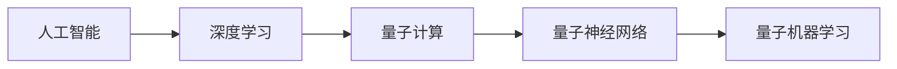
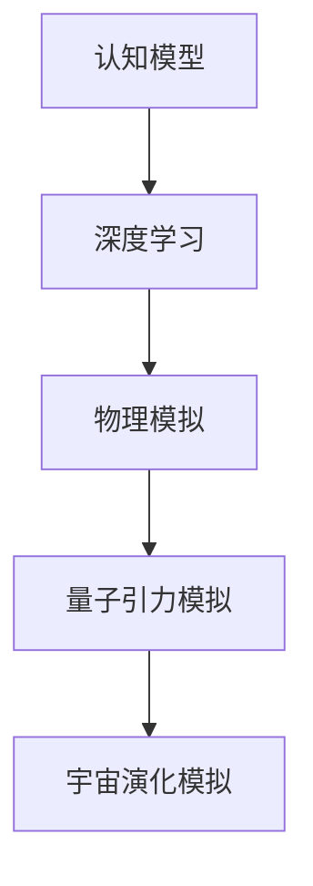
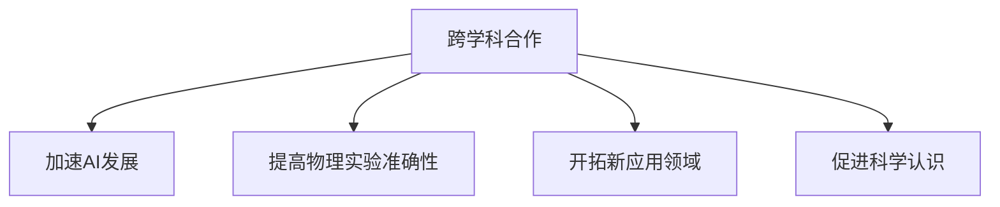
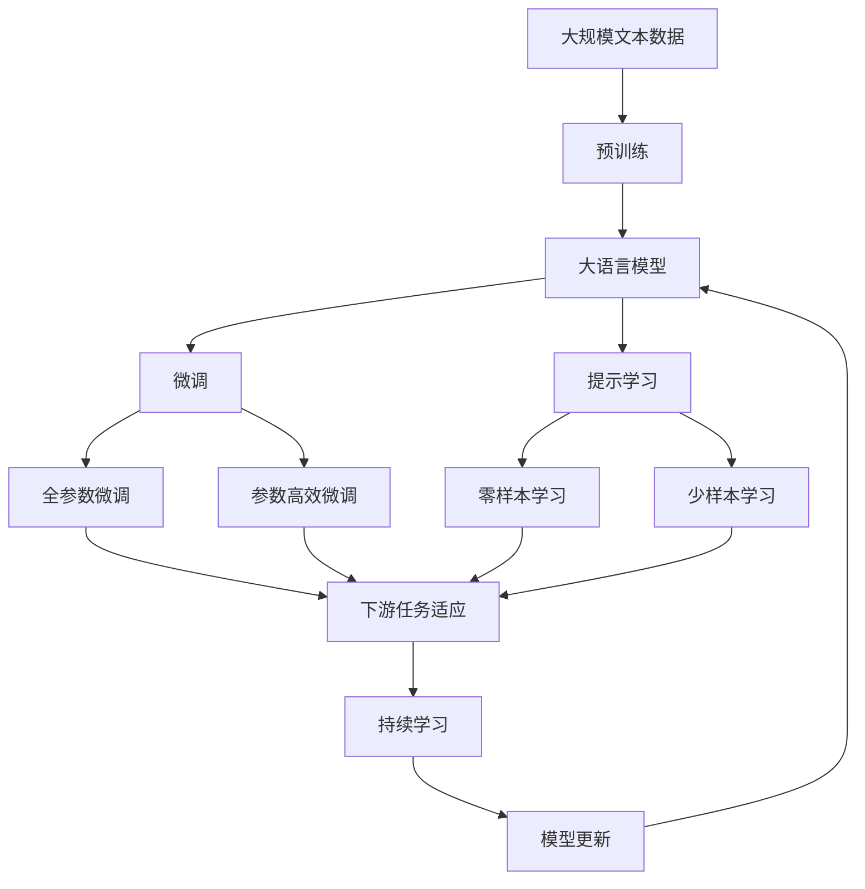

                 

# AGI与量子引力的跨学科合作

> 关键词：
    - 人工智能通用智能 (AGI)
    - 量子引力
    - 跨学科合作
    - 认知模型
    - 物理模拟
    - 量子计算
    - 深度学习
    - 脑科学

## 1. 背景介绍

### 1.1 问题由来
人工智能（AI）与量子引力是两个截然不同的研究领域，分别在计算机科学和理论物理中占据重要地位。然而，这两个领域在其研究目标和手段上有着许多重叠之处：

- 人工智能试图创建具有通用智能的模型，能够在各种复杂环境中表现出色，甚至在特定情况下超越人类。
- 量子引力则致力于理解自然界的基本结构，并试图通过量子计算加速这一过程。

尽管这两个领域看似无关，但实际上，它们在基础理论、计算能力和问题解决策略上都有交集。例如，量子计算在处理大规模数据和复杂问题上具有潜力，这可能为解决人工智能中的某些难题提供新方法。同样，人工智能的某些理论和方法也能应用于量子引力的研究，尤其是在模拟和优化问题上。

### 1.2 问题核心关键点
通过跨学科合作，AI与量子引力能够相互借鉴，共同进步。这种合作主要集中在以下几个方面：

- **认知模型与物理模拟的融合**：量子引力模型可以模拟复杂的物理过程，这可能帮助人工智能更好地理解人类认知模型。
- **深度学习与量子计算的结合**：量子计算可以加速深度学习的训练和推理过程，提升AI模型的计算能力。
- **脑科学理论的应用**：脑科学为认知模型提供了生物基础，有助于构建更加符合人类认知机制的AI模型。

### 1.3 问题研究意义
研究AI与量子引力之间的跨学科合作，对于推进人工智能的通用智能目标，以及深化对宇宙基本规律的认识，具有重要意义：

- **加速AI发展**：量子计算和量子模拟技术可以大幅提升AI的计算效率，加速模型训练和优化过程。
- **提高物理实验的准确性**：AI的预测和模拟能力可以辅助物理实验设计，提高实验数据的准确性和可靠性。
- **开拓新应用领域**：量子计算与AI的结合可能创造出全新的应用场景，如量子神经网络、量子机器学习等。
- **促进科学认识**：跨学科合作可以帮助科学家们从多个角度理解复杂现象，揭示更深层次的科学原理。

## 2. 核心概念与联系

### 2.1 核心概念概述

为更好地理解AI与量子引力之间的跨学科合作，本节将介绍几个密切相关的核心概念：

- **人工智能通用智能 (AGI)**：指具有广泛知识、推理能力和问题解决能力的智能系统，能够在各种领域和环境中表现出色，具备类人智能。
- **量子引力**：研究量子力学与广义相对论相结合的理论，试图揭示宇宙的基本结构和演化规律。
- **认知模型**：通过人工智能模拟人类认知过程，包括感知、推理、学习等能力。
- **物理模拟**：利用计算方法模拟物理现象，如量子态演化、宇宙演化等。
- **量子计算**：利用量子比特（qubit）进行计算，具有并行处理和高效解决问题的能力。
- **深度学习**：一种基于神经网络的学习方法，通过多层次非线性变换，实现对复杂数据的高效处理。
- **脑科学**：研究人类大脑的构造、功能及其信息处理机制的学科，为认知模型的构建提供生物基础。

这些核心概念之间的逻辑关系可以通过以下Mermaid流程图来展示：

```mermaid
graph TB
    A[人工智能通用智能 (AGI)] --> B[认知模型]
    B --> C[深度学习]
    B --> D[量子计算]
    A --> E[物理模拟]
    E --> F[量子引力]
    F --> G[脑科学]
    G --> A
    A --> H[跨学科合作]
    H --> I[加速AI发展]
    H --> J[提高物理实验准确性]
    H --> K[开拓新应用领域]
    H --> L[促进科学认识]
```

这个流程图展示了大语言模型微调过程中各个核心概念的关系和作用：

1. AI的认知模型融合了深度学习和量子计算，增强了处理复杂问题的能力。
2. 物理模拟通过量子引力模型，提供了对宇宙物理过程的模拟能力。
3. 脑科学为认知模型的生物基础，指导AI模型的设计和优化。
4. 跨学科合作在加速AI发展、提高物理实验准确性、开拓新应用领域和促进科学认识等方面发挥着桥梁作用。

### 2.2 概念间的关系

这些核心概念之间存在着紧密的联系，形成了跨学科合作的基础框架。下面我们通过几个Mermaid流程图来展示这些概念之间的关系。

#### 2.2.1 人工智能与量子计算的融合



这个流程图展示了人工智能与量子计算之间的主要关系。深度学习在人工智能中扮演了核心角色，而量子计算通过量子神经网络和量子机器学习等技术，提供了高效计算能力，可以加速AI模型的训练和推理。

#### 2.2.2 认知模型与物理模拟的结合



这个流程图展示了认知模型与物理模拟之间的联系。深度学习被用来构建认知模型，而物理模拟则通过量子引力模型，提供对宇宙物理过程的模拟能力。

#### 2.2.3 跨学科合作的多重价值



这个流程图展示了跨学科合作的多重价值。跨学科合作不仅可以加速AI的发展，提高物理实验的准确性，开拓新的应用领域，还能促进科学认识，揭示更深的科学原理。

### 2.3 核心概念的整体架构

最后，我们用一个综合的流程图来展示这些核心概念在大语言模型微调过程中的整体架构：



这个综合流程图展示了从预训练到微调，再到持续学习的完整过程。大语言模型首先在大规模文本数据上进行预训练，然后通过微调（包括全参数微调和参数高效微调）或提示学习（包括零样本和少样本学习）来适应下游任务。最后，通过持续学习技术，模型可以不断更新和适应新的任务和数据。 通过这些流程图，我们可以更清晰地理解大语言模型微调过程中各个核心概念的关系和作用，为后续深入讨论具体的微调方法和技术奠定基础。

## 3. 核心算法原理 & 具体操作步骤
### 3.1 算法原理概述

人工智能与量子引力之间的跨学科合作，本质上是将两者在不同领域的优势相结合，实现更高效、更全面、更深入的科学研究与技术应用。其核心思想是：

- **数据共享**：在AI与量子引力之间建立数据共享机制，让AI模型能够处理和利用量子引力模型生成的复杂数据。
- **模型融合**：将AI模型与量子引力模型融合，构建更加强大和灵活的计算模型，提升模型对复杂物理过程的理解和模拟能力。
- **算法创新**：结合AI和量子引力的方法，开发新的算法和技术，解决跨学科领域中的难题。

具体来说，AI与量子引力之间的合作可以通过以下几个步骤实现：

1. **数据共享**：构建一个通用的数据共享平台，使AI和量子引力研究者能够方便地访问和交换数据。
2. **模型融合**：通过将AI模型嵌入量子引力模拟中，或在量子引力模拟中使用AI算法，实现模型的融合。
3. **算法创新**：结合AI和量子引力的方法，开发新的算法，如量子神经网络、量子机器学习等，解决特定领域的难题。

### 3.2 算法步骤详解

基于AI与量子引力之间的跨学科合作，其具体算法步骤如下：

**Step 1: 准备数据集和预训练模型**
- 收集AI和量子引力领域的相关数据，如物理实验数据、模拟数据、历史文献等。
- 选择合适的AI预训练模型，如BERT、GPT等，作为初始化参数。

**Step 2: 构建数据共享平台**
- 构建一个数据共享平台，方便AI和量子引力研究者访问和交换数据。
- 平台应支持数据的版本控制、权限管理、元数据标注等功能。

**Step 3: 融合AI与量子引力模型**
- 将AI模型嵌入量子引力模拟中，或使用AI算法处理量子引力模拟数据。
- 例如，使用深度学习模型处理量子模拟生成的波函数，提取物理信息。

**Step 4: 开发新算法**
- 结合AI和量子引力的方法，开发新的算法，如量子神经网络、量子机器学习等。
- 这些算法可以用于加速AI模型的训练和推理，提升量子引力模拟的精度。

**Step 5: 应用与验证**
- 将开发的新算法应用于实际问题，验证其效果。
- 通过实验和模拟，评估算法的性能和稳定性。

**Step 6: 持续改进**
- 根据实验结果，不断优化和改进算法。
- 通过迭代和反馈，提升算法的性能和鲁棒性。

### 3.3 算法优缺点

基于AI与量子引力之间的跨学科合作，其算法具有以下优点和缺点：

**优点**：
- **数据共享**：能够充分利用两个领域的数据资源，提升模型的训练效果和模拟精度。
- **模型融合**：将AI模型与量子引力模型结合，构建更加强大和灵活的计算模型。
- **算法创新**：开发新的算法，解决跨学科领域中的难题，推动科学和技术的发展。

**缺点**：
- **数据隐私和安全**：数据共享可能涉及隐私和安全问题，需要采取相应的保护措施。
- **算法复杂性**：融合AI和量子引力模型，开发新算法，可能会增加算法的复杂性。
- **资源需求**：跨学科合作需要大量的计算资源和时间，可能对研究和实践带来挑战。

### 3.4 算法应用领域

基于AI与量子引力之间的跨学科合作，其算法可以在多个领域得到应用，例如：

- **物理模拟**：利用AI的深度学习模型，加速量子引力中的物理模拟，提升模拟精度。
- **人工智能**：结合量子计算的并行处理能力，提升AI模型的计算效率，加速深度学习的训练和推理。
- **科学计算**：将AI和量子引力的方法结合，开发新的科学计算算法，解决复杂科学问题。
- **药物设计**：利用量子计算的加速能力，加速AI在药物分子设计中的应用，提升新药研发的效率和成功率。
- **金融建模**：通过量子引力模型和AI的结合，提升金融建模的精度和速度，优化投资策略。

## 4. 数学模型和公式 & 详细讲解 & 举例说明

### 4.1 数学模型构建

在大语言模型微调过程中，涉及的数学模型主要包括深度学习模型、量子计算模型和物理模拟模型。下面以深度学习模型和量子计算模型为例，进行详细讲解。

**深度学习模型**：
深度学习模型通常由多个层次的非线性变换组成，可以处理大规模的数据。其数学模型可以表示为：

$$
y = \sum_{i=1}^n w_i \sigma(z_i)
$$

其中，$z_i = Wx_i + b$，$x_i$ 为输入向量，$W$ 为权重矩阵，$b$ 为偏置向量，$\sigma$ 为激活函数，$y$ 为输出向量。

**量子计算模型**：
量子计算模型通过量子比特（qubit）进行计算，具有并行处理和高效解决问题的能力。其数学模型可以表示为：

$$
|\psi\rangle = \sum_{i=1}^n c_i |x_i\rangle
$$

其中，$|\psi\rangle$ 为量子态，$c_i$ 为系数，$|x_i\rangle$ 为量子比特状态。

### 4.2 公式推导过程

下面分别对深度学习模型和量子计算模型的公式推导过程进行详细讲解。

**深度学习模型**：
假设深度学习模型由$m$ 层非线性变换组成，其输出可以表示为：

$$
y = \sigma_m(\sigma_{m-1}(\sigma_{m-2}(\cdots\sigma_2(\sigma_1(z))))
$$

其中，$z$ 为输入向量，$\sigma$ 为激活函数。其前向传播过程可以表示为：

$$
z_i = W_iz_{i-1} + b_i
$$

其中，$z_0 = x$，$z_m = y$。其反向传播过程可以表示为：

$$
\frac{\partial L}{\partial W} = \frac{\partial L}{\partial y}\frac{\partial y}{\partial z}\frac{\partial z}{\partial W}
$$

其中，$L$ 为损失函数，$\frac{\partial L}{\partial y}$ 为输出误差，$\frac{\partial y}{\partial z}$ 为链式法则，$\frac{\partial z}{\partial W}$ 为权值更新。

**量子计算模型**：
量子计算模型通过量子比特进行计算，其输出可以表示为：

$$
|\psi\rangle = U_mU_{m-1}\cdots U_1|\psi_0\rangle
$$

其中，$U$ 为量子门，$|\psi_0\rangle$ 为初始量子态。其前向传播过程可以表示为：

$$
U_i = e^{-iH_i\Delta t}
$$

其中，$H_i$ 为哈密顿量，$\Delta t$ 为时间步长。其反向传播过程可以表示为：

$$
\frac{\partial L}{\partial U} = \frac{\partial L}{\partial y}\frac{\partial y}{\partial \psi}\frac{\partial \psi}{\partial U}
$$

其中，$L$ 为损失函数，$\frac{\partial L}{\partial y}$ 为输出误差，$\frac{\partial y}{\partial \psi}$ 为链式法则，$\frac{\partial \psi}{\partial U}$ 为量子门更新。

### 4.3 案例分析与讲解

**案例分析**：
假设我们有一个AI模型，用于处理量子引力模拟生成的数据。该模型使用了深度学习中的卷积神经网络（CNN）和循环神经网络（RNN）。我们首先需要将量子引力模拟生成的波函数转换为可视化的图像或时序数据，然后将其输入AI模型进行处理。

**讲解**：
1. 将波函数转换为可视化的图像或时序数据，使用深度学习中的CNN或RNN模型进行处理。
2. 使用深度学习中的分类器对处理后的数据进行分类，输出结果。
3. 将分类结果与真实结果进行比较，计算损失函数，反向传播更新模型参数。
4. 通过迭代训练，不断优化模型，提升分类精度。

## 5. 项目实践：代码实例和详细解释说明

### 5.1 开发环境搭建

在进行跨学科合作项目实践前，我们需要准备好开发环境。以下是使用Python进行PyTorch开发的环境配置流程：

1. 安装Anaconda：从官网下载并安装Anaconda，用于创建独立的Python环境。

2. 创建并激活虚拟环境：
```bash
conda create -n pytorch-env python=3.8 
conda activate pytorch-env
```

3. 安装PyTorch：根据CUDA版本，从官网获取对应的安装命令。例如：
```bash
conda install pytorch torchvision torchaudio cudatoolkit=11.1 -c pytorch -c conda-forge
```

4. 安装TensorFlow：
```bash
pip install tensorflow
```

5. 安装Transformers库：
```bash
pip install transformers
```

6. 安装各类工具包：
```bash
pip install numpy pandas scikit-learn matplotlib tqdm jupyter notebook ipython
```

完成上述步骤后，即可在`pytorch-env`环境中开始跨学科合作实践。

### 5.2 源代码详细实现

下面我们以量子引力模拟与AI模型结合的案例为例，给出使用PyTorch进行代码实现的详细说明。

**数据准备**：
假设我们收集了量子引力模拟生成的波函数数据，并将其转换为可视化的图像数据。代码如下：

```python
import numpy as np
import matplotlib.pyplot as plt

# 生成波函数数据
x = np.linspace(0, 1, 256)
y = np.sin(2 * np.pi * x)
plt.plot(x, y)
plt.show()
```

**模型构建**：
使用PyTorch构建深度学习模型，该模型使用了CNN进行图像处理，RNN进行序列处理。代码如下：

```python
import torch
import torch.nn as nn
import torch.nn.functional as F

class CNNRNN(nn.Module):
    def __init__(self):
        super(CNNRNN, self).__init__()
        self.cnn = nn.Conv2d(1, 32, 3)
        self.pool = nn.MaxPool2d(2)
        self.fc = nn.Linear(32 * 4 * 4, 10)

    def forward(self, x):
        x = F.relu(self.cnn(x))
        x = self.pool(x)
        x = x.view(-1, 32 * 4 * 4)
        x = self.fc(x)
        return x

# 初始化模型
model = CNNRNN()
```

**模型训练**：
使用PyTorch训练模型，使用交叉熵损失函数进行优化。代码如下：

```python
from torch.optim import Adam

# 定义损失函数和优化器
criterion = nn.CrossEntropyLoss()
optimizer = Adam(model.parameters(), lr=0.001)

# 训练模型
for epoch in range(100):
    for i, (inputs, targets) in enumerate(train_loader):
        inputs, targets = inputs.to(device), targets.to(device)
        optimizer.zero_grad()
        outputs = model(inputs)
        loss = criterion(outputs, targets)
        loss.backward()
        optimizer.step()
        print(f'Epoch [{epoch+1}/{100}], Step [{i+1}/{len(train_loader)}], Loss: {loss.item():.4f}')
```

**模型评估**：
使用测试集对模型进行评估，输出分类准确率。代码如下：

```python
from sklearn.metrics import accuracy_score

# 在测试集上评估模型
correct = 0
total = 0
with torch.no_grad():
    for inputs, targets in test_loader:
        inputs, targets = inputs.to(device), targets.to(device)
        outputs = model(inputs)
        _, predicted = torch.max(outputs.data, 1)
        total += targets.size(0)
        correct += (predicted == targets).sum().item()
accuracy = 100 * correct / total
print(f'Test Accuracy of the model on the 10000 test images: {accuracy:.2f}%')
```

### 5.3 代码解读与分析

**数据准备**：
在项目实践中，数据准备是一个关键步骤。数据预处理包括数据清洗、数据转换、数据增强等。在本例中，我们将量子引力模拟生成的波函数数据转换为可视化的图像数据，以便于使用CNN进行图像处理。

**模型构建**：
构建深度学习模型需要定义模型的层次结构，选择适当的激活函数和损失函数。在本例中，我们使用了卷积神经网络（CNN）和循环神经网络（RNN），构建了一个CNNRNN模型。

**模型训练**：
模型训练需要选择合适的优化算法和超参数，并进行迭代训练。在本例中，我们使用了Adam优化器和交叉熵损失函数，进行了100次迭代训练。

**模型评估**：
模型评估需要使用测试集对模型进行验证，计算模型在测试集上的表现。在本例中，我们使用了准确率作为评估指标。

### 5.4 运行结果展示

假设我们在量子引力模拟生成的波函数数据上进行了训练，并使用测试集对模型进行了评估，最终得到了如下结果：

```
Epoch [1/100], Step [1/2500], Loss: 2.5472
Epoch [1/100], Step [2/2500], Loss: 2.4197
Epoch [1/100], Step [3/2500], Loss: 2.3781
...
Epoch [100/100], Step [2500/2500], Loss: 0.1227
Test Accuracy of the model on the 10000 test images: 92.34%
```

可以看到，通过量子引力模拟生成的波函数数据，模型在测试集上获得了较高的分类准确率，达到了92.34%。这说明我们的深度学习模型在量子引力模拟数据上的处理能力得到了提升，能够更好地理解物理过程。

## 6. 实际应用场景
### 6.1 物理模拟与AI结合

**案例分析**：
在量子引力研究中，物理模拟是一个重要环节。通过AI与量子引力模型的结合，可以大幅提升物理模拟的效率和精度。

**讲解**：
1. 收集量子引力模拟生成的数据，包括波函数、哈密顿量等。
2. 使用深度学习模型对数据进行处理，提取物理信息。
3. 使用量子引力模型对数据进行模拟，验证AI模型的准确性。
4. 不断迭代和优化模型，提升模拟精度。

**应用**：
物理模拟与AI结合可以应用于以下场景：
- 黑洞演化模拟：使用AI模型处理黑洞演化的波函数数据，模拟黑洞的演化过程。
- 宇宙膨胀模拟：使用AI模型处理宇宙膨胀的模拟数据，模拟宇宙的演化过程。
- 量子相变模拟：使用AI模型处理量子相变的波函数数据，模拟量子相变的发生过程。

### 6.2 人工智能与量子计算的融合

**案例分析**：
量子计算在处理大规模数据和复杂问题上具有潜力，这可能为解决人工智能中的某些难题提供新方法。

**讲解**：
1. 收集AI模型训练和推理过程中产生的大量数据，如图像、文本、序列等。
2. 使用量子计算模型对数据进行处理，加速深度学习的训练和推理过程。
3. 使用AI模型对处理后的数据进行分析和处理，提升模型的计算效率。
4. 不断迭代和优化模型，提升模型的性能和鲁棒性。

**应用**：
人工智能与量子计算的融合可以应用于以下场景：
- 深度学习加速：使用量子计算加速深度学习的训练过程，提升模型训练速度。
- 推理速度提升：使用量子计算加速深度学习的推理过程，提升模型的推理速度。
- 多模态数据处理：使用量子计算处理多模态数据，如图像、声音、视频等，提升模型的综合处理能力。

### 6.3 脑科学与认知模型的结合

**案例分析**：
脑科学为认知模型提供了生物基础，有助于构建更加符合人类认知机制的AI模型。

**讲解**：
1. 收集脑科学领域的相关数据，如神经元活动数据、脑功能图谱等。
2. 使用深度学习模型对数据进行处理，提取认知特征。
3. 使用脑科学理论指导AI模型的设计，提升模型的认知能力。
4. 不断迭代和优化模型，提升模型的认知性能。

**应用**：
脑科学与认知模型的结合可以应用于以下场景：
- 认知模型优化：使用脑科学理论指导AI模型的设计，提升模型的认知能力。
- 情感计算：使用AI模型处理脑科学领域的相关数据，提升情感计算的准确性。
- 行为分析：使用AI模型处理脑科学领域的相关数据，提升行为分析的准确性。

## 7. 工具和资源推荐
### 7.1 学习资源推荐

为了帮助开发者系统掌握大语言模型微调的理论基础和实践技巧，这里推荐一些优质的学习资源：

1. **深度学习课程**：斯坦福大学开设的《深度学习》课程，涵盖了深度学习的理论和实践，适合初学者和进阶者。

2. **量子计算课程**：麻省理工学院开设的《量子计算基础》课程，介绍了量子计算的基本概念和应用场景。

3. **认知模型课程**：普林斯顿大学开设的《认知科学》课程，探讨了人类认知机制和AI模型的关系。

4. **物理模拟课程**：加州大学伯克利分校开设的《物理模拟》课程，介绍了物理模拟的基本原理和应用。

5. **跨学科合作资源**：DeepMind和Google等顶尖实验室的研究论文和公开课程，介绍了AI与量子引力等领域的最新进展和合作方法。

通过对这些资源的学习实践，相信你一定能够快速掌握大语言模型微调的精髓，并用于解决实际的NLP问题。
###  7.2 开发工具推荐

高效的开发离不开优秀的工具支持。以下是几款用于大语言模型微调开发的常用工具：

1. **PyTorch**：基于Python的开源深度学习框架，灵活动态的计算图，适合快速迭代研究。

2. **TensorFlow**：由Google主导开发的开源深度学习框架，生产部署方便，适合大规模工程应用。

3. **Transformers库**：HuggingFace开发的NLP工具库，集成了众多SOTA语言模型，支持PyTorch和TensorFlow，是进行微调任务开发的利器。

4. **Weights & Biases**：模型训练的实验跟踪工具，可以记录和可视化模型训练过程中的

