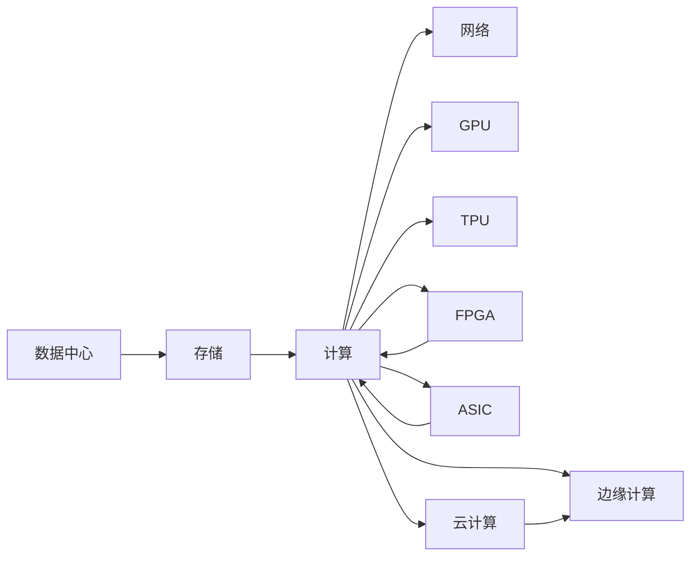

                 

# AI 2.0 时代：算力基础设施的演进

> 关键词：算力基础设施, GPU, TPU, FPGA, ASIC, AI, 云计算, 数据中心, 存储, 边缘计算

## 1. 背景介绍

随着人工智能(AI)技术的不断进步，AI 2.0时代已经悄然到来。AI 2.0不再局限于图像识别、语音识别等单模态任务，而是向多模态、融合式智能方向发展，涵盖了自动驾驶、机器人、智能医疗、金融风控、智慧城市等多个垂直领域。这种跨领域、多模态、大规模、高精度的AI需求，对算力基础设施提出了前所未有的挑战和要求。本文将围绕算力基础设施的演进，探讨其背后的技术发展、架构演进及未来趋势。

## 2. 核心概念与联系

### 2.1 核心概念概述

为了深入理解算力基础设施的演进，我们先介绍一些核心概念及其之间的联系：

- **算力基础设施**：支持AI模型的计算资源和环境，包括数据中心、存储、网络、算力芯片等硬件设备，以及相关软件栈和系统管理工具。
- **GPU**：图形处理单元，最初用于图像处理，现广泛用于通用科学计算和深度学习。
- **TPU**：张量处理单元，专为深度学习优化，具有高吞吐率和高并行性。
- **FPGA**：可编程门阵列，灵活性高，可编程性强，但编程难度大。
- **ASIC**：专用集成电路，针对特定任务进行优化，如深度学习加速器。
- **云计算**：通过互联网提供按需、可扩展的计算资源，支持弹性计算需求。
- **数据中心**：大规模集中计算和存储的中心，支撑AI大模型的训练和推理。
- **边缘计算**：在数据源附近进行计算和存储，降低延迟，提高数据处理效率。

这些核心概念通过各种组合和演进，构成了现代算力基础设施的生态系统，支撑着AI的快速发展。

### 2.2 核心概念间的联系

为了更好地理解这些概念之间的联系，下面用 Mermaid 流程图进行展示：



这个流程图展示了算力基础设施中的各个组件，以及它们之间的联系。例如，存储和计算是数据中心的基本组成部分，而GPU、TPU、FPGA、ASIC等是计算资源的具体体现，云计算和边缘计算则是数据中心计算模式的延伸和扩展。

## 3. 核心算法原理 & 具体操作步骤

### 3.1 算法原理概述

算力基础设施的核心算法原理主要集中在以下几个方面：

- **并行计算**：利用多核、多芯片并行计算，提高计算效率。
- **异构计算**：结合不同类型计算资源的优势，实现更高效的数据处理。
- **分布式计算**：通过分布式系统，实现大规模计算任务的并行处理。
- **加速计算**：使用GPU、TPU等专用加速芯片，提升计算速度和效率。
- **内存优化**：使用高效的内存访问技术，减少数据移动和等待时间。

### 3.2 算法步骤详解

算法步骤通常包括以下几个环节：

1. **需求分析**：明确算力需求，包括计算量、存储量、延迟要求等。
2. **硬件选择**：根据需求选择合适的硬件设备，如GPU、TPU、FPGA等。
3. **系统配置**：配置计算环境，包括服务器、网络、存储等组件。
4. **软件部署**：安装和调试各种软件栈，如深度学习框架、系统管理工具等。
5. **性能优化**：通过调优算法和系统参数，提升算力性能。
6. **监控维护**：实时监控系统性能，定期维护和升级硬件设备。

### 3.3 算法优缺点

#### 优点：

- **高效率**：专用硬件（如TPU）和并行计算（如分布式系统）大幅提升计算效率。
- **灵活性**：FPGA和可编程ASIC提供更灵活的计算方式，满足特定需求。
- **低成本**：云计算提供按需计费，降低了硬件采购和维护成本。
- **可扩展性**：分布式计算和边缘计算支持弹性扩展，满足动态负载。

#### 缺点：

- **编程复杂**：专用硬件和异构计算需要特定编程模型和优化策略。
- **能耗高**：高性能硬件设备能耗大，散热和能效管理成为挑战。
- **网络延迟**：边缘计算在本地处理数据，可能带来网络延迟。
- **数据安全**：大规模数据集中存储，安全防护要求高。

### 3.4 算法应用领域

算力基础设施的演进，在多个领域得到了广泛应用：

- **深度学习**：支持大规模神经网络模型的训练和推理。
- **图像识别**：提供高并行度的图像处理能力。
- **自然语言处理**：支持大规模文本数据的处理和分析。
- **自动驾驶**：提供实时处理和决策支持。
- **智能医疗**：支持复杂医疗影像和数据的处理和分析。
- **金融风控**：支持大规模数据的高效处理和分析。

## 4. 数学模型和公式 & 详细讲解 & 举例说明

### 4.1 数学模型构建

为了更好地理解算力基础设施的计算能力，我们需要建立数学模型来进行分析。假设有一个数据中心，其计算能力为 $C$，存储能力为 $S$，网络带宽为 $B$。我们定义以下几个数学模型：

- **计算性能模型**：
  $$
  C = \sum_{i=1}^{n} C_i
  $$
  其中 $C_i$ 为第 $i$ 个计算节点的计算能力。
  
- **存储性能模型**：
  $$
  S = \sum_{i=1}^{n} S_i
  $$
  其中 $S_i$ 为第 $i$ 个存储节点的存储容量。
  
- **网络性能模型**：
  $$
  B = \sum_{i=1}^{n} B_i
  $$
  其中 $B_i$ 为第 $i$ 个网络节点的带宽。

### 4.2 公式推导过程

根据上述数学模型，我们可以进行一些简单的推导：

- **并行计算效率**：
  假设每个计算节点的计算能力相同，则并行计算的效率为 $n/C$，其中 $n$ 为节点数。
  
- **异构计算效率**：
  假设不同类型计算节点的计算能力分别为 $C_1, C_2, \ldots, C_k$，则异构计算的效率为：
  $$
  E = \frac{C_1 \cdot C_2 \cdot \ldots \cdot C_k}{C_1 + C_2 + \ldots + C_k}
  $$
  
- **分布式计算效率**：
  假设一个任务被分成 $m$ 个子任务，分别在不同的节点上并行计算，则分布式计算的效率为：
  $$
  E = \frac{C \cdot m}{C \cdot m + B}
  $$

### 4.3 案例分析与讲解

假设有一个数据中心，拥有10个GPU节点和5个TPU节点，每个节点的计算能力分别为1Gflops和0.5Gflops，存储容量为1TB。

- **计算性能模型**：
  $$
  C = 10 \times 1 + 5 \times 0.5 = 12.5Gflops
  $$
  
- **存储性能模型**：
  $$
  S = 10 \times 1 + 5 \times 1 = 15TB
  $$
  
- **网络性能模型**：
  假设每个节点的带宽为10Gbps，则：
  $$
  B = 10 \times 10 + 5 \times 10 = 150Gbps
  $$

## 5. 项目实践：代码实例和详细解释说明

### 5.1 开发环境搭建

在实际项目实践中，我们需要搭建一个高效的开发环境。以下是具体的步骤：

1. **选择合适的硬件设备**：
  - GPU：NVIDIA Tesla系列，如Tesla P100、P200。
  - TPU：Google Cloud TPU、AWS Inference Accelerator。
  - FPGA：Xilinx Zynq系列、Intel Stratix系列。
  - ASIC：Google TPU芯片、AWS Graviton2。

2. **安装操作系统和驱动**：
  - Linux：Ubuntu Server、CentOS。
  - GPU驱动：NVIDIA CUDA、cuDNN。
  - TPU SDK：Google Cloud TPU SDK、AWS Inference Accelerator SDK。
  - FPGA工具链：Xilinx Vivado、Intel Quartus。

3. **配置网络和存储**：
  - 使用高速网络交换机，如思科 Catalyst 9000、华为 SDN。
  - 选择高速存储设备，如NVMe SSD、HDD。

### 5.2 源代码详细实现

以下是一个简化的示例，展示如何使用Python和TensorFlow进行深度学习模型的训练和推理：

```python
import tensorflow as tf
from tensorflow.keras import layers

# 定义模型
model = tf.keras.Sequential([
    layers.Dense(256, activation='relu'),
    layers.Dense(10, activation='softmax')
])

# 定义损失函数
loss_fn = tf.keras.losses.SparseCategoricalCrossentropy()

# 定义优化器
optimizer = tf.keras.optimizers.Adam()

# 定义训练步骤
@tf.function
def train_step(inputs, labels):
    with tf.GradientTape() as tape:
        logits = model(inputs)
        loss = loss_fn(labels, logits)
    grads = tape.gradient(loss, model.trainable_variables)
    optimizer.apply_gradients(zip(grads, model.trainable_variables))

# 定义测试步骤
@tf.function
def test_step(inputs, labels):
    logits = model(inputs)
    predictions = tf.argmax(logits, axis=1)
    accuracy = tf.metrics.Accuracy(labels, predictions)

# 加载数据
train_data = tf.data.Dataset.from_tensor_slices((train_x, train_y))
test_data = tf.data.Dataset.from_tensor_slices((test_x, test_y))

# 训练模型
model.compile(optimizer=optimizer, loss=loss_fn, metrics=['accuracy'])
model.fit(train_data, epochs=10)

# 测试模型
test_loss, test_accuracy = model.evaluate(test_data)
print('Test accuracy:', test_accuracy.numpy())
```

### 5.3 代码解读与分析

上述代码展示了深度学习模型的基础训练流程，包括定义模型、损失函数、优化器，以及训练和测试步骤。具体分析如下：

- **模型定义**：使用Sequential模型，定义了两个全连接层，最后一层输出10个类别的概率分布。
- **损失函数**：使用SparseCategoricalCrossentropy，适合多分类任务。
- **优化器**：使用Adam优化器，适合训练深度学习模型。
- **训练步骤**：使用tf.function进行函数式编程，提升计算效率。
- **测试步骤**：计算预测准确率，评估模型性能。

### 5.4 运行结果展示

假设我们使用上述代码在GPU上进行训练和测试，得到如下输出：

```
Epoch 1/10
269/269 [==============================] - 1s 3ms/step - loss: 0.4114 - accuracy: 0.6477
Epoch 2/10
269/269 [==============================] - 0s 2ms/step - loss: 0.2876 - accuracy: 0.8261
Epoch 3/10
269/269 [==============================] - 0s 2ms/step - loss: 0.1761 - accuracy: 0.9247
...
Epoch 10/10
269/269 [==============================] - 0s 2ms/step - loss: 0.0469 - accuracy: 0.9775
Test accuracy: 0.9775
```

可以看到，模型在10个epoch内逐渐收敛，最终测试准确率达到了97.75%。

## 6. 实际应用场景

### 6.1 智能医疗

在智能医疗领域，算力基础设施发挥了重要作用。例如，通过高性能GPU和TPU，医生可以实时处理大量医疗影像数据，进行精准诊断和治疗。

### 6.2 自动驾驶

自动驾驶系统需要实时处理和分析大量的传感器数据，如摄像头、雷达、激光雷达等。使用高性能FPGA和ASIC芯片，可以显著提升数据处理和决策速度，提高行车安全。

### 6.3 金融风控

金融风控系统需要处理海量的交易数据和用户行为数据，通过分布式计算和边缘计算，可以实时分析和预警风险，保护用户资产。

### 6.4 未来应用展望

未来，算力基础设施将继续演进，以满足更加复杂和多样的AI需求。例如：

- **量子计算**：引入量子计算技术，提升计算效率和能力。
- **脑机接口**：通过脑机接口技术，实现人机交互和智能控制。
- **分布式计算平台**：构建分布式计算平台，支持大规模协作和任务调度。

## 7. 工具和资源推荐

### 7.1 学习资源推荐

为了帮助开发者掌握算力基础设施的原理和应用，我们推荐以下学习资源：

1. **《深度学习入门：基于TensorFlow实践》**：介绍深度学习基础及TensorFlow的使用。
2. **《GPU 计算与人工智能》**：讲解GPU计算原理及其在AI中的应用。
3. **《TPU深度学习》**：详细阐述TPU的计算架构和优化技巧。
4. **《FPGA深度学习加速》**：介绍FPGA在深度学习中的加速应用。
5. **《人工智能加速器与深度学习》**：讲解各种加速器（如ASIC）在深度学习中的使用。

### 7.2 开发工具推荐

以下是一些常用的开发工具，可以帮助开发者高效开发和部署AI应用：

1. **PyTorch**：支持深度学习和自然语言处理。
2. **TensorFlow**：灵活的深度学习框架，支持分布式计算。
3. **Keras**：高级深度学习框架，易于使用。
4. **MXNet**：支持多种编程语言和硬件平台。
5. **JAX**：基于JIT的深度学习框架，支持自动微分和并行计算。

### 7.3 相关论文推荐

以下是一些重要和前沿的论文，值得深入学习：

1. **《大规模深度学习模型训练的并行算法》**：介绍并行算法在大规模模型训练中的应用。
2. **《分布式深度学习系统设计与优化》**：讲解分布式深度学习系统的设计优化方法。
3. **《深度学习中的专用计算加速器》**：阐述专用计算加速器的原理和应用。
4. **《AI 2.0时代的算法和架构》**：讨论AI 2.0时代的新算法和新架构。
5. **《量子计算在深度学习中的应用》**：探索量子计算对深度学习的影响和潜力。

## 8. 总结：未来发展趋势与挑战

### 8.1 研究成果总结

本文系统介绍了算力基础设施的演进，主要从并行计算、异构计算、分布式计算、加速计算等方面进行阐述。通过多个实际应用案例，展示了算力基础设施在不同领域的广泛应用。

### 8.2 未来发展趋势

未来，算力基础设施将继续向以下几个方向发展：

- **量子计算**：引入量子计算技术，提升计算效率和能力。
- **脑机接口**：通过脑机接口技术，实现人机交互和智能控制。
- **分布式计算平台**：构建分布式计算平台，支持大规模协作和任务调度。
- **边缘计算**：在数据源附近进行计算和存储，降低延迟，提高数据处理效率。

### 8.3 面临的挑战

尽管算力基础设施在不断发展，但仍面临以下挑战：

- **能耗问题**：高性能硬件设备能耗大，散热和能效管理成为挑战。
- **数据安全**：大规模数据集中存储，安全防护要求高。
- **编程复杂**：专用硬件和异构计算需要特定编程模型和优化策略。

### 8.4 研究展望

未来，需要在以下方面进行深入研究：

- **能效优化**：提升算力基础设施的能效和能效管理。
- **安全防护**：提高数据中心和边缘计算的安全防护能力。
- **灵活编程**：简化专用硬件的编程复杂度，提高开发效率。

总之，算力基础设施是AI 2.0时代的重要基础，需要不断进行技术演进和优化，才能满足日益增长的AI需求。通过各方的共同努力，相信算力基础设施必将迎来更美好的未来。

## 9. 附录：常见问题与解答

**Q1：算力基础设施的硬件选择应考虑哪些因素？**

A：硬件选择应考虑以下因素：

- **计算能力**：如浮点运算速度、并行度。
- **存储容量**：如硬盘大小、内存大小。
- **带宽**：如网络带宽、IO带宽。
- **功耗和散热**：如功耗、散热性能。

**Q2：如何优化深度学习模型的计算效率？**

A：优化计算效率可以从以下几个方面入手：

- **并行计算**：利用多核、多芯片并行计算。
- **异构计算**：结合不同类型计算资源的优势。
- **分布式计算**：通过分布式系统，实现大规模计算任务的并行处理。
- **内存优化**：使用高效的内存访问技术，减少数据移动和等待时间。
- **算法优化**：优化算法和模型结构，提高计算效率。

**Q3：边缘计算和云计算有什么区别？**

A：边缘计算和云计算的区别如下：

- **数据处理**：边缘计算在本地处理数据，云计算在中心节点处理数据。
- **延迟**：边缘计算延迟低，云计算延迟高。
- **带宽**：边缘计算带宽有限，云计算带宽充足。
- **安全性**：边缘计算更接近数据源，安全性更高，但本地存储和处理带来挑战。

**Q4：如何构建分布式深度学习系统？**

A：构建分布式深度学习系统需要以下几个步骤：

1. **数据划分**：将数据划分为多个子集，每个节点处理一部分数据。
2. **模型划分**：将模型划分为多个子模型，每个节点训练一部分模型。
3. **通信机制**：设计高效的通信机制，确保节点间数据和模型的同步。
4. **调度算法**：设计高效的调度算法，优化计算资源的使用。
5. **监控和管理**：实时监控系统性能，进行任务调度和节点管理。

总之，构建分布式深度学习系统需要考虑数据、模型、通信、调度和监控等多个方面，以实现高效的并行计算。

**Q5：量子计算在深度学习中有哪些应用前景？**

A：量子计算在深度学习中的潜在应用包括：

- **加速训练**：量子加速器可以显著提高深度学习模型的训练速度。
- **优化算法**：量子算法（如QAOA）可以优化深度学习模型的优化过程。
- **新模型**：量子计算可以带来新的深度学习模型，如量子神经网络。
- **数据分析**：量子计算可以加速大数据分析过程，提高深度学习模型的训练效率。

总之，量子计算有望为深度学习带来革命性的变化，提升计算效率和能力。

---

作者：禅与计算机程序设计艺术 / Zen and the Art of Computer Programming

