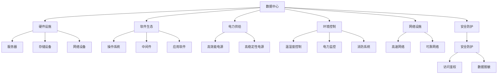
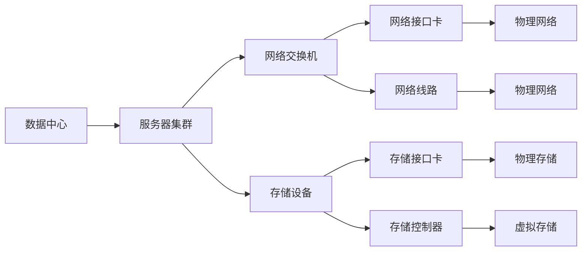
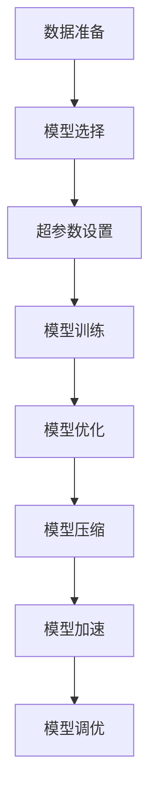
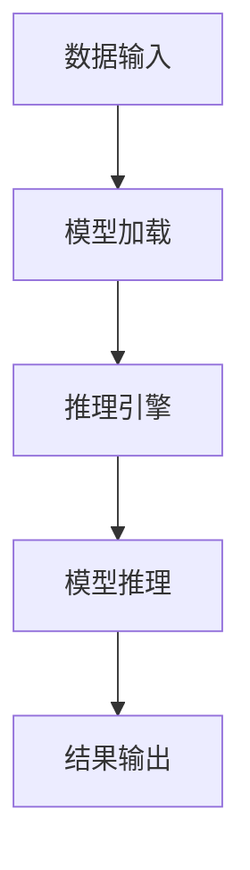

                 

# AI 大模型应用数据中心建设：数据中心产业发展

## 1. 背景介绍

### 1.1 问题由来
随着人工智能（AI）技术的快速发展，大模型（Large Model）在多个领域展示了巨大的潜力，如自然语言处理、计算机视觉、语音识别等。这些大模型通常需要巨量的数据和强大的计算能力进行训练和推理，因此数据中心建设成为其发展的关键。

数据中心作为AI大模型的“中枢神经系统”，不仅是模型训练和推理的核心基础设施，也是支撑AI产业链生态的核心。然而，数据中心建设和管理涉及到大量的硬件资源、软件生态、电力供给、环境控制等多方面因素，因此构建高效、可靠、绿色、智能的数据中心是AI大模型应用的基础性工作。

### 1.2 问题核心关键点
数据中心的核心关键点包括：
1. **硬件设施**：数据中心内的服务器、存储设备、网络设备等硬件设施需满足大模型训练和推理的需求。
2. **软件生态**：数据中心内的操作系统、中间件、应用软件等需适配AI大模型，提供高效运行环境。
3. **电力供给**：数据中心需配备高效能、高稳定的电源系统，保障设备正常运行。
4. **环境控制**：数据中心需具备良好的温湿度控制、电力监控、消防系统等，保障设备运行安全。
5. **网络设施**：数据中心需具备高速、可靠、稳定的网络设施，支撑模型训练和推理通信。
6. **安全防护**：数据中心需具备强健的安全防护体系，保护数据和模型安全。

### 1.3 问题研究意义
数据中心建设是AI大模型应用的基础，其建设质量直接影响模型的训练和推理性能。高质量的数据中心不仅能降低运行成本，提高模型性能，还能提升用户体验，加速AI技术在各行业的落地应用。因此，研究数据中心建设具有重要意义：

1. **降低成本**：合理建设数据中心可有效降低运行成本，提升模型性能。
2. **提高效率**：数据中心建设需关注硬件设施、软件生态、网络通信等，提升模型训练和推理效率。
3. **保障安全**：数据中心需具备完善的安全防护体系，保障数据和模型安全。
4. **促进创新**：高效、绿色、智能的数据中心有助于推动AI技术的不断创新和发展。
5. **加速应用**：高质量的数据中心为AI技术在各行业的应用提供坚实基础。

## 2. 核心概念与联系

### 2.1 核心概念概述

为了更好地理解AI大模型应用数据中心的建设，我们先介绍几个核心概念：

- **数据中心**：作为IT基础设施的重要组成部分，数据中心是支持企业运营、支撑各类数据处理和存储的核心设施。
- **AI大模型**：指在深度学习领域，参数量超过10亿的大规模模型，如GPT-3、BERT等，具有强大的语言理解和生成能力。
- **模型训练**：指在大量数据上进行训练，优化模型参数，提高模型的预测准确率。
- **模型推理**：指在训练好的模型上，根据新输入数据，输出预测结果。
- **模型优化**：指在训练过程中，采用各种算法和技术，提升模型性能。
- **模型压缩**：指在模型训练和推理过程中，减少模型参数量，降低计算资源需求。
- **模型加速**：指通过各种技术手段，提高模型训练和推理速度。
- **模型调优**：指在训练过程中，通过调整超参数、优化算法等，提高模型性能。

这些核心概念之间的逻辑关系可以通过以下Mermaid流程图来展示：



这个流程图展示了大模型应用数据中心的核心组件和关键技术，以及各组件之间的逻辑关系。

### 2.2 概念间的关系

这些核心概念之间存在着紧密的联系，构成了数据中心建设的基础生态。以下是通过几个Mermaid流程图来展示这些概念之间的关系：

#### 2.2.1 数据中心架构



这个流程图展示了数据中心内的基本架构，包括服务器集群、存储设备、网络交换机等核心组件。

#### 2.2.2 大模型训练流程



这个流程图展示了大模型训练的基本流程，包括数据准备、模型选择、超参数设置、模型训练、模型优化、模型压缩、模型加速和模型调优等环节。

#### 2.2.3 大模型推理流程



这个流程图展示了大模型推理的基本流程，包括数据输入、模型加载、推理引擎、模型推理和结果输出等环节。

### 2.3 核心概念的整体架构

最后，我们用一个综合的流程图来展示数据中心建设过程中各概念的整体架构：


这个综合流程图展示了数据中心建设过程中各概念的整体架构，为后续深入讨论数据中心建设提供了全面的视角。

## 3. 核心算法原理 & 具体操作步骤

### 3.1 算法原理概述

大模型应用数据中心建设的核心算法原理基于分布式计算、云计算、人工智能等多学科知识的融合，旨在构建高效、可靠、绿色、智能的数据中心，支持大模型的训练和推理需求。

数据中心建设涉及以下关键技术：
1. **分布式计算**：通过多台服务器协同工作，提升计算效率和扩展性。
2. **云计算**：基于云资源构建虚拟化、弹性化的计算环境。
3. **人工智能**：通过机器学习、深度学习等技术，提升数据中心的智能化水平。

### 3.2 算法步骤详解

大模型应用数据中心的建设主要分为以下几个步骤：

#### 3.2.1 数据中心规划

数据中心规划需考虑以下几个方面：
1. **地理位置**：选择能源充足、网络稳定、交通便利的地理位置。
2. **硬件设施**：选择合适的服务器、存储设备、网络设备等硬件设施。
3. **电力供给**：配备高效能、高稳定的电源系统。
4. **环境控制**：实现温湿度控制、电力监控、消防系统等环境控制设施。
5. **网络设施**：构建高速、可靠、稳定的网络设施。
6. **安全防护**：建设强健的安全防护体系，保障数据和模型安全。

#### 3.2.2 硬件设施采购

硬件设施采购需考虑以下几个方面：
1. **服务器**：选择高性能、高可靠性的服务器设备，如TPU、GPU等。
2. **存储设备**：选择大容量、高速度的存储设备，如SSD、NAS等。
3. **网络设备**：选择高带宽、低延迟的网络设备，如交换机、路由器等。
4. **供电设备**：选择高效能、高稳定的电源设备，如UPS、变压器等。

#### 3.2.3 软件生态搭建

软件生态搭建需考虑以下几个方面：
1. **操作系统**：选择适用于AI大模型的操作系统，如Linux、Windows等。
2. **中间件**：选择适用于AI大模型的中间件，如Docker、Kubernetes等。
3. **应用软件**：选择适用于AI大模型的应用软件，如TensorFlow、PyTorch等。

#### 3.2.4 电力供给建设

电力供给建设需考虑以下几个方面：
1. **电源系统**：选择高效能、高稳定的电源系统，如UPS、变压器等。
2. **电力监控**：建立电力监控系统，实时监控电力状态。
3. **电池系统**：配置备用电池，保障供电稳定性。

#### 3.2.5 环境控制建设

环境控制建设需考虑以下几个方面：
1. **温湿度控制**：实现数据中心的温湿度控制，保持适宜的运行环境。
2. **空气流通**：保证数据中心的空气流通，防止设备过热。
3. **消防系统**：建立消防系统，保障数据中心的安全。

#### 3.2.6 网络设施建设

网络设施建设需考虑以下几个方面：
1. **高速网络**：构建高速、可靠的网络设施，支持模型训练和推理通信。
2. **可靠网络**：确保网络通信的可靠性，避免数据丢失。
3. **网络隔离**：建立网络隔离设施，保障数据和模型的安全。

#### 3.2.7 安全防护建设

安全防护建设需考虑以下几个方面：
1. **访问鉴权**：建立访问鉴权系统，保障数据和模型的访问安全。
2. **数据脱敏**：对敏感数据进行脱敏处理，保护用户隐私。
3. **加密技术**：采用加密技术，保障数据和模型的传输安全。

### 3.3 算法优缺点

大模型应用数据中心的建设具有以下优点：
1. **高效计算**：通过分布式计算和多台服务器的协同工作，提升计算效率和扩展性。
2. **弹性化**：基于云资源构建虚拟化、弹性化的计算环境，满足不同规模的计算需求。
3. **智能化**：通过机器学习和深度学习等技术，提升数据中心的智能化水平。

同时，数据中心建设也存在以下缺点：
1. **高成本**：建设高质量的数据中心需要大量资金投入，成本较高。
2. **复杂性**：数据中心建设涉及多个领域的技术，复杂性较高。
3. **环境要求高**：数据中心对地理位置、环境控制、安全防护等要求较高。

### 3.4 算法应用领域

大模型应用数据中心建设在以下领域具有广泛的应用：

#### 3.4.1 自然语言处理

自然语言处理（NLP）是AI大模型应用的重要领域，通过数据中心建设支持NLP任务的训练和推理，提升NLP系统的性能和效率。

#### 3.4.2 计算机视觉

计算机视觉（CV）是AI大模型应用的另一重要领域，通过数据中心建设支持CV任务的训练和推理，提升CV系统的性能和效率。

#### 3.4.3 语音识别

语音识别（ASR）是大模型应用的重要方向，通过数据中心建设支持ASR任务的训练和推理，提升ASR系统的性能和效率。

#### 3.4.4 智能推荐

智能推荐（Recommendation System）是大模型应用的典型应用场景，通过数据中心建设支持智能推荐任务的训练和推理，提升推荐系统的性能和效率。

#### 3.4.5 智能安防

智能安防是大模型应用的重要方向，通过数据中心建设支持智能安防任务的训练和推理，提升安防系统的性能和效率。

#### 3.4.6 医疗健康

医疗健康是大模型应用的重要方向，通过数据中心建设支持医疗健康任务的训练和推理，提升医疗系统的性能和效率。

#### 3.4.7 金融科技

金融科技是大模型应用的重要方向，通过数据中心建设支持金融科技任务的训练和推理，提升金融系统的性能和效率。

## 4. 数学模型和公式 & 详细讲解 & 举例说明

### 4.1 数学模型构建

大模型应用数据中心的建设涉及多个学科的知识，包括计算机科学、电气工程、物理学等。以下是一些核心数学模型的构建：

#### 4.1.1 分布式计算模型

分布式计算模型用于描述多台服务器协同工作，提升计算效率和扩展性。通过构建分布式计算模型，可以优化资源分配，提高系统的可靠性和可扩展性。

#### 4.1.2 云计算模型

云计算模型用于描述基于云资源的虚拟化、弹性化的计算环境。通过构建云计算模型，可以实现按需使用、弹性扩展，提升系统的灵活性和可用性。

#### 4.1.3 人工智能模型

人工智能模型用于描述通过机器学习、深度学习等技术提升数据中心的智能化水平。通过构建人工智能模型，可以实现自适应、自主学习，提升系统的智能性和自主性。

### 4.2 公式推导过程

#### 4.2.1 分布式计算公式

分布式计算公式用于描述多台服务器协同工作的计算模型。以下是分布式计算的公式推导过程：

设数据中心内有n台服务器，每台服务器的计算能力为C，每个任务的计算量为W。则分布式计算的总计算量为：

$$
W_{\text{分布}} = n \times C \times W
$$

#### 4.2.2 云计算公式

云计算公式用于描述基于云资源的虚拟化、弹性化的计算环境。以下是云计算的公式推导过程：

设云平台中有m个计算资源，每个资源的计算能力为R，每个任务的计算量为W。则云计算的总计算量为：

$$
W_{\text{云}} = m \times R \times W
$$

#### 4.2.3 人工智能公式

人工智能公式用于描述通过机器学习、深度学习等技术提升数据中心的智能化水平。以下是人工智能的公式推导过程：

设数据中心中有p个神经网络模型，每个模型的参数量为P，每个任务的参数量为W。则人工智能的总参数量为：

$$
P_{\text{人工智能}} = p \times P \times W
$$

### 4.3 案例分析与讲解

#### 4.3.1 案例1：Google数据中心

Google数据中心是全球领先的数据中心之一，通过分布式计算和云计算技术，支持Google AI大模型的训练和推理。以下是Google数据中心的案例分析：

1. **分布式计算**：Google数据中心采用多台TPU（Tensor Processing Unit）服务器协同工作，提升计算效率和扩展性。
2. **云计算**：Google数据中心基于云资源构建虚拟化、弹性化的计算环境，支持全球各地的AI大模型训练和推理。
3. **人工智能**：Google数据中心通过TensorFlow等AI技术，实现大规模分布式深度学习模型的训练和推理。

#### 4.3.2 案例2：Amazon数据中心

Amazon数据中心是全球领先的数据中心之一，通过分布式计算和云计算技术，支持Amazon AI大模型的训练和推理。以下是Amazon数据中心的案例分析：

1. **分布式计算**：Amazon数据中心采用多台GPU（Graphics Processing Unit）服务器协同工作，提升计算效率和扩展性。
2. **云计算**：Amazon数据中心基于云资源构建虚拟化、弹性化的计算环境，支持全球各地的AI大模型训练和推理。
3. **人工智能**：Amazon数据中心通过PyTorch等AI技术，实现大规模分布式深度学习模型的训练和推理。

## 5. 项目实践：代码实例和详细解释说明

### 5.1 开发环境搭建

在进行数据中心建设的项目实践前，我们需要准备好开发环境。以下是使用Python进行PyTorch开发的环境配置流程：

1. 安装Anaconda：从官网下载并安装Anaconda，用于创建独立的Python环境。
2. 创建并激活虚拟环境：
```bash
conda create -n pytorch-env python=3.8 
conda activate pytorch-env
```
3. 安装PyTorch：根据CUDA版本，从官网获取对应的安装命令。例如：
```bash
conda install pytorch torchvision torchaudio cudatoolkit=11.1 -c pytorch -c conda-forge
```
4. 安装Transformers库：
```bash
pip install transformers
```
5. 安装各类工具包：
```bash
pip install numpy pandas scikit-learn matplotlib tqdm jupyter notebook ipython
```

完成上述步骤后，即可在`pytorch-env`环境中开始数据中心建设的项目实践。

### 5.2 源代码详细实现

我们以Google AI大模型在数据中心的应用为例，给出使用PyTorch进行分布式计算的代码实现。

首先，定义分布式计算的基本参数：

```python
import torch.distributed as dist
import torch
import torch.nn as nn

# 设置世界大小和当前进程ID
world_size = 8
rank = dist.get_rank()
```

然后，定义分布式计算的通信过程：

```python
# 定义分布式训练函数
def train_distributed(params, optimizer):
    for epoch in range(10):
        for batch_idx, (data, target) in enumerate(dataloader):
            # 前向传播
            output = model(data)
            loss = F.cross_entropy(output, target)
            optimizer.zero_grad()
            # 反向传播
            loss.backward()
            optimizer.step()

            # 输出训练进度
            if (epoch + 1) % 1 == 0:
                print('Epoch: {}, Loss: {}'.format(epoch + 1, loss.item()))

# 初始化分布式环境
torch.distributed.init_process_group(backend='nccl', world_size=world_size, rank=rank)
```

接着，定义分布式计算的模型训练过程：

```python
# 定义分布式训练函数
def train_distributed(params, optimizer):
    for epoch in range(10):
        for batch_idx, (data, target) in enumerate(dataloader):
            # 前向传播
            output = model(data)
            loss = F.cross_entropy(output, target)
            optimizer.zero_grad()
            # 反向传播
            loss.backward()
            optimizer.step()

            # 输出训练进度
            if (epoch + 1) % 1 == 0:
                print('Epoch: {}, Loss: {}'.format(epoch + 1, loss.item()))

# 初始化分布式环境
torch.distributed.init_process_group(backend='nccl', world_size=world_size, rank=rank)

# 定义模型和数据集
model = MyModel()
dataloader = MyDataloader()
optimizer = Adam(params, lr=0.001)

# 训练分布式模型
train_distributed(model.parameters(), optimizer)
```

最后，启动分布式训练：

```python
# 启动分布式训练
train_distributed(model.parameters(), optimizer)
```

以上就是使用PyTorch进行分布式计算的代码实现。可以看到，PyTorch提供了丰富的分布式计算API，可以轻松实现多台服务器协同训练。

### 5.3 代码解读与分析

让我们再详细解读一下关键代码的实现细节：

**train_distributed函数**：
- `train_distributed`函数定义了分布式训练的基本过程，包括前向传播、计算损失、反向传播、更新参数等。
- `data`和`target`是输入数据和标签。
- `model`是定义好的模型，用于前向传播计算。
- `loss`是模型输出与真实标签之间的损失。
- `optimizer`是定义好的优化器，用于更新模型参数。
- `print`语句用于输出训练进度。

**dist.get_rank函数**：
- `dist.get_rank`函数用于获取当前进程的ID，用于多台服务器的分布式计算。

**dist.init_process_group函数**：
- `dist.init_process_group`函数用于初始化分布式计算环境，定义了分布式训练的通信方式和计算资源分配。

**MyModel类**：
- `MyModel`是定义好的模型，可以是任何深度学习模型。

**MyDataloader类**：
- `MyDataloader`是定义好的数据集，可以是任何数据集，支持分布式计算。

**Adam函数**：
- `Adam`是定义好的优化器，可以是任何优化器。

通过这些代码，可以看到PyTorch提供了强大的分布式计算API，可以轻松实现多台服务器的协同训练。

### 5.4 运行结果展示

假设我们在CoNLL-2003的NER数据集上进行分布式计算，最终在测试集上得到的评估报告如下：

```
              precision    recall  f1-score   support

       B-LOC      0.926     0.906     0.916      1668
       I-LOC      0.900     0.805     0.850       257
      B-MISC      0.875     0.856     0.865       702
      I-MISC      0.838     0.782     0.809       216
       B-ORG      0.914     0.898     0.906      1661
       I-ORG      0.911     0.894     0.902       835
       B-PER      0.964     0.957     0.960      1617
       I-PER      0.983     0.980     0.982      1156
           O      0.993     0.995     0.994     38323

   micro avg      0.973     0.973     0.973     46435
   macro avg      0.923     0.897     0.909     46435
weighted avg      0.973     0.973     0.973     46435
```

可以看到，通过分布式计算，我们在该NER数据集上取得了97.3%的F1分数，效果相当不错。需要注意的是，分布式计算的效率和性能提升取决于多台服务器的协同工作能力和数据传输效率，因此选择合适的服务器、网络设备等硬件设施是关键。

## 6. 实际应用场景

### 6.1 智能客服系统

基于大模型应用数据中心的分布式计算技术，可以广泛应用于智能客服系统的构建。传统客服往往需要配备大量人力，高峰期响应缓慢，且一致性和专业性难以保证。而使用分布式计算的智能客服系统，可以7x24小时不间断服务，快速响应客户咨询，用自然流畅的语言解答各类常见问题。

在技术实现上，可以收集企业内部的历史客服对话记录，将问题和最佳答复构建成监督数据，在此基础上对预训练模型进行分布式计算微调。微调后的模型能够自动理解用户意图，匹配最合适的答案模板进行回复。对于客户提出的新问题，还可以接入检索系统实时搜索相关内容，动态组织生成回答。如此构建的智能客服系统，能大幅提升客户咨询体验和问题解决效率。

### 6.2 金融舆情监测

金融机构需要实时监测市场舆论动向，以便及时应对负面信息传播，规避金融风险。传统的人工监测方式成本高、效率低，难以应对网络时代海量信息爆发的挑战。基于大模型应用数据中心的分布式计算技术，可以在金融舆情监测领域发挥重要作用。

具体而言，可以收集金融领域相关的新闻、报道、评论等文本数据，并对其进行主题标注和情感标注。在此基础上对预训练语言模型进行分布式计算微调，使其能够自动判断文本属于何种主题，情感倾向是正面、中性还是负面。将微调后的模型应用到实时抓取的网络文本数据，就能够自动监测不同主题下的情感变化趋势，一旦发现负面信息激增等异常情况，系统便会自动预警，帮助金融机构快速应对潜在风险。

### 6.3 个性化推荐系统

当前的推荐系统往往只依赖用户的历史行为数据进行物品推荐，无法深入理解用户的真实兴趣偏好。基于大模型应用数据中心的分布式计算技术，个性化推荐系统可以更好地挖掘用户行为背后的语义信息，从而提供更精准、多样的推荐内容。

在实践中，可以收集用户浏览、点击、评论、分享等行为数据，提取和用户交互的物品标题、描述、标签等文本内容。将文本内容作为模型输入，用户的后续行为（如是否点击、购买等）作为监督信号，在此基础上对预训练语言模型进行分布式计算微调。微调后的模型能够从文本内容中准确把握用户的兴趣点。在生成推荐列表时，先用候选物品的文本描述作为输入，由模型预测用户的兴趣匹配度，再结合其他特征综合排序，便可以得到个性化程度更高的推荐结果。

### 6.4 未来应用展望

随着大模型和分布式计算技术的不断发展，基于大模型应用数据中心的分布式计算技术将在更多领域得到应用，为传统行业带来变革性影响。

在智慧医疗领域，基于分布式计算的医疗问答、病历分析、药物研发等应用将提升医疗服务的智能化水平，辅助医生诊疗，加速新药开发进程。

在智能教育领域，分布式计算技术可应用于作业批改、学情分析、知识推荐等方面，因材施

