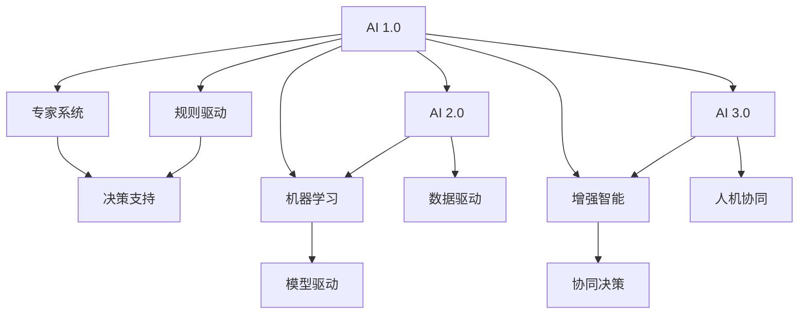

                 

# AIGC从入门到实战：人工智能时代的三个子阶段：AI 1.0、AI 2.0、AI 3.0

## 1. 背景介绍

随着计算机技术的飞速发展，人工智能（AI）已经在各个领域取得了令人瞩目的成就。从早期的AI 1.0时代，到如今的AI 2.0、AI 3.0时代，AI技术正在不断突破自我，进入了一个全新的阶段。理解这些不同阶段的特点和演化过程，将帮助我们更好地把握未来AI发展的方向。

### 1.1 AI 1.0时代

AI 1.0时代，也称为专家系统（Expert Systems）时代，主要是依赖人工编写的规则和逻辑，进行问题解决和决策支持。这一阶段的人工智能主要应用于医学诊断、故障诊断、金融分析等领域，其核心在于将专家的知识和经验编码为软件系统，辅助人类进行决策。AI 1.0时代的标志性技术包括决策树、规则引擎等，它们虽然简单但非常有效，但在处理复杂问题时，往往需要大量的规则编写和调试工作。

### 1.2 AI 2.0时代

AI 2.0时代，也称为机器学习（Machine Learning）时代，是指使用大量数据和计算资源，通过机器学习算法（如统计学习、深度学习等）自动学习模型，从而解决复杂问题。这一阶段的人工智能主要应用于图像识别、语音识别、自然语言处理等领域，其核心在于数据驱动和模型驱动。AI 2.0时代的标志性技术包括卷积神经网络（CNN）、递归神经网络（RNN）、生成对抗网络（GAN）等，它们在处理大规模数据时表现出了强大的能力。

### 1.3 AI 3.0时代

AI 3.0时代，也称为增强智能（Augmented Intelligence）时代，是指利用AI技术与人类智慧相结合，进一步提升人类决策和创新能力的时代。这一阶段的人工智能主要应用于个性化推荐、智能客服、智能写作、智能设计等领域，其核心在于人机协同。AI 3.0时代的标志性技术包括自监督学习、零样本学习、知识图谱、自然语言生成等，它们在理解和利用人类知识方面表现出了前所未有的能力。

## 2. 核心概念与联系

### 2.1 核心概念概述

为了更好地理解AI 1.0、AI 2.0、AI 3.0之间的联系，我们首先介绍一些核心概念：

- **专家系统**：基于规则的自动化决策支持系统，主要用于医学诊断、故障诊断等领域。
- **机器学习**：通过数据驱动的方式，自动学习模型，从而解决复杂问题。
- **深度学习**：一种机器学习方法，主要利用多层神经网络进行特征学习和模型训练。
- **自然语言处理**：研究如何让计算机理解、处理和生成人类语言的技术。
- **知识图谱**：通过构建结构化的知识库，帮助机器更好地理解和利用人类知识。
- **增强智能**：通过将AI技术与人类智慧相结合，进一步提升人类决策和创新能力。

### 2.2 核心概念间的关系

这些核心概念之间的联系可以通过以下Mermaid流程图来展示：



这个流程图展示了AI 1.0、AI 2.0、AI 3.0三个子阶段的核心概念及其之间的关系：

1. AI 1.0：通过专家系统和规则驱动的决策支持系统，实现了简单的自动化决策。
2. AI 2.0：通过机器学习，特别是深度学习，实现了基于数据驱动和模型驱动的复杂问题解决。
3. AI 3.0：通过增强智能，结合了AI技术与人类智慧，进一步提升了决策和创新能力。

这些概念共同构成了人工智能发展的全貌，帮助我们理解不同阶段的演进过程。

## 3. 核心算法原理 & 具体操作步骤

### 3.1 算法原理概述

AI 1.0、AI 2.0、AI 3.0时代的算法原理有着显著的不同。下面分别介绍每个阶段的算法原理。

#### AI 1.0：专家系统

专家系统的核心是知识表示和推理。知识表示通常使用IF-THEN规则或框架表示法，通过编写大量规则和逻辑，构建决策树或规则引擎。推理过程主要是根据输入数据，匹配规则进行判断和决策。

#### AI 2.0：机器学习

机器学习的核心是数据驱动和模型驱动。通过训练大量的标注数据，利用统计学习或深度学习算法（如逻辑回归、支持向量机、神经网络等）自动学习模型，从而实现对未知数据的预测和分类。机器学习算法通常分为监督学习、无监督学习和半监督学习。

#### AI 3.0：增强智能

增强智能的核心是人机协同和知识图谱。通过构建结构化的知识库（如知识图谱），将人类知识和AI技术相结合，实现更加复杂的推理和决策。增强智能技术还包括自然语言处理、知识图谱查询、协同推理等。

### 3.2 算法步骤详解

#### AI 1.0：专家系统

1. **知识获取**：通过领域专家的知识获取，构建IF-THEN规则或框架表示法。
2. **知识存储**：将获取的知识存储在专家系统中。
3. **推理过程**：根据输入数据，匹配规则进行推理和决策。

#### AI 2.0：机器学习

1. **数据预处理**：对原始数据进行清洗和标准化处理，转换为机器学习算法可处理的形式。
2. **模型训练**：利用训练数据集，训练机器学习模型。
3. **模型评估**：通过测试数据集评估模型的性能，优化模型参数。
4. **模型应用**：将训练好的模型应用于实际问题中，进行预测或分类。

#### AI 3.0：增强智能

1. **知识获取**：通过文献、网络等渠道获取知识库。
2. **知识图谱构建**：将知识库转换为结构化的知识图谱。
3. **知识图谱查询**：通过知识图谱查询，获取相关知识。
4. **协同推理**：将AI技术与人类智慧相结合，进行协同推理和决策。

### 3.3 算法优缺点

#### AI 1.0：专家系统

优点：
- 依赖专家知识，规则明确，易于理解和调试。
- 适用于规则明确、逻辑简单的决策支持。

缺点：
- 依赖大量人工规则编写，成本高、效率低。
- 规则匹配可能出现冗余，导致决策冲突。

#### AI 2.0：机器学习

优点：
- 自动学习模型，无需大量人工规则编写。
- 适用于大规模数据和复杂问题。

缺点：
- 需要大量标注数据，成本高、效率低。
- 模型可能出现过拟合，泛化性能不足。

#### AI 3.0：增强智能

优点：
- 结合AI技术与人类智慧，决策更全面、更准确。
- 知识图谱构建可以提供结构化知识，提升决策能力。

缺点：
- 知识图谱构建复杂，需要大量领域知识。
- 协同推理过程复杂，需要更高水平的技术支持。

### 3.4 算法应用领域

#### AI 1.0：专家系统

主要应用于医学诊断、故障诊断、金融分析等领域，帮助领域专家进行决策支持。

#### AI 2.0：机器学习

主要应用于图像识别、语音识别、自然语言处理等领域，利用数据驱动和模型驱动的方式解决复杂问题。

#### AI 3.0：增强智能

主要应用于个性化推荐、智能客服、智能写作、智能设计等领域，通过人机协同提升决策和创新能力。

## 4. 数学模型和公式 & 详细讲解 & 举例说明

### 4.1 数学模型构建

#### AI 1.0：专家系统

专家系统的核心是IF-THEN规则，可以用布尔代数来表示。例如：

$$
IF (Condition) THEN (Action)
$$

其中Condition表示输入的条件，Action表示决策结果。

#### AI 2.0：机器学习

机器学习的核心是模型训练和预测。以线性回归为例，假设输入数据为$x=(x_1, x_2, ..., x_n)$，目标变量为$y$，则线性回归模型的公式为：

$$
y = \theta_0 + \sum_{i=1}^{n} \theta_i x_i
$$

其中$\theta_0, \theta_1, ..., \theta_n$为模型参数，需要通过训练数据集来优化。

#### AI 3.0：增强智能

增强智能的核心是知识图谱查询和协同推理。以知识图谱查询为例，假设知识图谱中有一条规则：

$$
If \; Person(P) \; AND \; Organization(O) \; THEN \; Collaboration(P, O)
$$

其中Person表示人物节点，Organization表示组织节点，Collaboration表示人物和组织的合作关系。则可以通过规则引擎进行查询和推理，得到相关的人物和组织节点。

### 4.2 公式推导过程

#### AI 1.0：专家系统

专家系统的推理过程相对简单，主要通过规则引擎进行匹配和决策。

#### AI 2.0：机器学习

线性回归模型的推导过程如下：

1. 假设目标变量$y$与输入变量$x$之间存在线性关系，可以表示为：

$$
y = \theta_0 + \theta_1 x_1 + \theta_2 x_2 + ... + \theta_n x_n
$$

2. 通过最小二乘法，将模型参数$\theta_0, \theta_1, ..., \theta_n$优化为：

$$
\theta = (X^TX)^{-1}X^Ty
$$

其中$X$为输入变量的矩阵，$y$为目标变量的向量。

#### AI 3.0：增强智能

知识图谱查询的推导过程相对复杂，需要构建图谱模型并进行规则匹配。以规则引擎为例，其查询过程如下：

1. 将查询条件转换为图谱中的节点和边。
2. 从知识图谱中查询相关的节点和边。
3. 通过规则引擎进行匹配，得到相关结果。

### 4.3 案例分析与讲解

#### AI 1.0：专家系统

例如，在医学诊断中，专家系统可以通过以下规则进行决策：

1. 如果病人有头痛、呕吐等症状，则可能是脑震荡。
2. 如果病人有胸痛、气短等症状，则可能是心脏病。

#### AI 2.0：机器学习

以图像识别为例，假设有一张猫的图片，机器学习算法通过训练数据集，可以自动学习到猫的特征，从而进行分类预测。

#### AI 3.0：增强智能

以个性化推荐为例，增强智能技术可以通过知识图谱查询和协同推理，结合用户的兴趣和行为数据，推荐用户可能感兴趣的产品或服务。

## 5. 项目实践：代码实例和详细解释说明

### 5.1 开发环境搭建

#### AI 1.0：专家系统

1. **安装专家系统开发工具**：例如Python的Pykeen、Prolog等工具。
2. **编写规则**：通过领域专家的知识获取，构建IF-THEN规则。
3. **测试和优化**：通过测试数据集进行测试和优化。

#### AI 2.0：机器学习

1. **安装机器学习框架**：例如TensorFlow、PyTorch等。
2. **准备数据集**：对原始数据进行清洗和标准化处理。
3. **模型训练**：利用训练数据集训练机器学习模型。
4. **模型评估和优化**：通过测试数据集评估模型的性能，优化模型参数。

#### AI 3.0：增强智能

1. **安装增强智能工具**：例如SPARQL、RDF等工具。
2. **构建知识图谱**：通过领域知识构建结构化的知识图谱。
3. **知识图谱查询和推理**：通过规则引擎进行查询和推理。

### 5.2 源代码详细实现

#### AI 1.0：专家系统

例如，在Prolog中，可以使用以下代码构建一个简单的专家系统：

```prolog
% 定义规则
goals([head1, tail1; head2, tail2; ...]) :-
    read_some(Some),
    head1(Some, Input),
    tail1(Some, Action),
    head2(Some, Input),
    tail2(Some, Action),
    ...

% 运行规则
Main :- goals([head1, tail1; head2, tail2; ...]).
```

#### AI 2.0：机器学习

例如，在TensorFlow中，可以使用以下代码实现线性回归模型：

```python
import tensorflow as tf

# 定义模型
model = tf.keras.Sequential([
    tf.keras.layers.Dense(1, input_shape=(1,))
])

# 编译模型
model.compile(optimizer=tf.keras.optimizers.SGD(learning_rate=0.01),
              loss='mean_squared_error',
              metrics=['mae'])

# 训练模型
model.fit(X_train, y_train, epochs=100, batch_size=10)

# 预测
y_pred = model.predict(X_test)
```

#### AI 3.0：增强智能

例如，在SPARQL中，可以使用以下代码查询知识图谱：

```sparql
PREFIX rdfs: <http://www.w3.org/2000/01/rdf-schema#>
PREFIX owl: <http://www.w3.org/2002/07/owl#>
PREFIX geo: <http://www.w3.org/2003/01/geo/wgs84_pos#>
PREFIX foaf: <http://xmlns.com/foaf/0.1/>
PREFIX skos: <http://www.w3.org/2004/02/skos/core#>
SELECT ?p ?o WHERE { 
    ?p <http://example.org/alpha> ?o .
    FILTER (regex(str(?o), "World")) 
}
```

### 5.3 代码解读与分析

#### AI 1.0：专家系统

专家系统的代码相对简单，主要通过规则引擎进行匹配和决策。

#### AI 2.0：机器学习

机器学习模型的代码较为复杂，主要涉及数据预处理、模型训练、模型评估和模型应用。

#### AI 3.0：增强智能

增强智能技术的代码通常需要结合领域知识库和规则引擎，进行知识图谱查询和协同推理。

### 5.4 运行结果展示

#### AI 1.0：专家系统

例如，在医学诊断中，专家系统可以根据输入的病人症状进行推理和决策。

#### AI 2.0：机器学习

例如，在图像识别中，机器学习模型可以通过训练数据集自动学习猫的特征，并进行分类预测。

#### AI 3.0：增强智能

例如，在个性化推荐中，增强智能技术可以通过知识图谱查询和协同推理，推荐用户可能感兴趣的产品或服务。

## 6. 实际应用场景

### 6.1 AI 1.0：专家系统

AI 1.0时代的专家系统广泛应用于医学诊断、故障诊断、金融分析等领域，例如：

- **医学诊断**：通过专家系统，医生可以更快地诊断出疾病，提高诊疗效率。
- **故障诊断**：通过专家系统，工程师可以更快地判断设备故障，提高维护效率。

### 6.2 AI 2.0：机器学习

AI 2.0时代的机器学习广泛应用于图像识别、语音识别、自然语言处理等领域，例如：

- **图像识别**：利用机器学习，可以自动识别图像中的物体和场景，应用于自动驾驶、安防监控等领域。
- **语音识别**：利用机器学习，可以自动转录和理解语音内容，应用于智能音箱、智能客服等领域。

### 6.3 AI 3.0：增强智能

AI 3.0时代的增强智能广泛应用于个性化推荐、智能客服、智能写作、智能设计等领域，例如：

- **个性化推荐**：通过增强智能，可以结合用户的兴趣和行为数据，推荐用户可能感兴趣的产品或服务。
- **智能客服**：通过增强智能，可以自动解答用户咨询，提高客户满意度。

## 7. 工具和资源推荐

### 7.1 学习资源推荐

#### AI 1.0：专家系统

1. **书籍**：《专家系统基础》（Expert Systems: The Complete Guide）。
2. **在线课程**：Coursera上的《规则驱动的决策系统》（Rule-based Decision Systems）课程。

#### AI 2.0：机器学习

1. **书籍**：《机器学习》（Machine Learning）（周志华）。
2. **在线课程**：Coursera上的《机器学习》（Machine Learning）课程。

#### AI 3.0：增强智能

1. **书籍**：《增强智能》（Augmented Intelligence: The Future of Work）。
2. **在线课程**：Coursera上的《增强智能》（Augmented Intelligence）课程。

### 7.2 开发工具推荐

#### AI 1.0：专家系统

1. **Pykeen**：用于开发基于规则的专家系统。
2. **Prolog**：用于编写和执行专家系统规则。

#### AI 2.0：机器学习

1. **TensorFlow**：用于构建和训练机器学习模型。
2. **PyTorch**：用于构建和训练机器学习模型。

#### AI 3.0：增强智能

1. **SPARQL**：用于查询和推理知识图谱。
2. **RDF**：用于构建和存储知识图谱。

### 7.3 相关论文推荐

#### AI 1.0：专家系统

1. Russell, S. & Norvig, P. (2003). 《人工智能：一种现代方法》（Artificial Intelligence: A Modern Approach）。
2. Fikes, R. & Kowalski, R. (1987). 《专家系统导论》（Expert Systems: An Introduction）。

#### AI 2.0：机器学习

1. Bishop, C. M. (2006). 《模式识别与机器学习》（Pattern Recognition and Machine Learning）。
2. Goodfellow, I., Bengio, Y., & Courville, A. (2016). 《深度学习》（Deep Learning）。

#### AI 3.0：增强智能

1. Musicki, T., Anastasiades, K., & Iandola, F. (2016). 《增强智能：融合人类和机器智能》（Augmented Intelligence: Fusion of Human and Machine Intelligence）。
2. Clarke, E. (2011). 《增强智能：工作未来的新维度》（Augmented Intelligence: The New Dimension of Work）。

## 8. 总结：未来发展趋势与挑战

### 8.1 研究成果总结

AI 1.0、AI 2.0、AI 3.0三个子阶段各有其特点和优势，它们共同构成了人工智能的全貌。AI 1.0强调规则驱动的决策支持，适用于规则明确、逻辑简单的决策场景；AI 2.0强调数据驱动的模型驱动，适用于大规模数据和复杂问题的解决；AI 3.0强调人机协同的增强智能，结合AI技术与人类智慧，进一步提升决策和创新能力。

### 8.2 未来发展趋势

未来AI的发展将融合AI 1.0、AI 2.0、AI 3.0的优点，形成更加全面、高效、智能的系统。具体趋势如下：

1. **跨领域融合**：AI技术与各垂直行业的深度融合，提升各行各业的智能化水平。
2. **人机协同**：通过增强智能，进一步提升人机协同决策和创新能力。
3. **多模态处理**：将视觉、语音、文本等多种模态信息进行融合，提升AI系统的全面感知能力。
4. **自监督学习**：利用自监督学习，进一步提升AI系统的泛化能力和自适应能力。
5. **安全与伦理**：AI系统的安全性、可解释性和伦理道德问题将进一步受到关注。

### 8.3 面临的挑战

未来AI的发展仍面临诸多挑战：

1. **数据隐私和安全**：如何在保证数据隐私和安全的前提下，进行高效的数据处理和利用。
2. **模型可解释性**：如何增强AI模型的可解释性和透明度，提升用户信任和接受度。
3. **知识图谱构建**：如何在高效构建知识图谱的基础上，实现知识图谱的查询和推理。
4. **跨领域迁移**：如何实现AI技术在各领域的跨领域迁移和应用。

### 8.4 研究展望

未来AI的研究方向包括：

1. **自监督学习**：利用自监督学习，提升AI系统的泛化能力和自适应能力。
2. **多模态处理**：将视觉、语音、文本等多种模态信息进行融合，提升AI系统的全面感知能力。
3. **人机协同**：进一步提升人机协同决策和创新能力。
4. **增强智能**：结合AI技术与人类智慧，提升决策和创新能力。

## 9. 附录：常见问题与解答

### Q1：AI 1.0、AI 2.0、AI 3.0之间的区别是什么？

A: AI 1.0、AI 2.0、AI 3.0主要区别在于决策方式、数据驱动和模型驱动的程度以及人机协同的深度。AI 1.0依靠规则驱动，AI 2.0依靠数据驱动和模型驱动，AI 3.0结合AI技术与人类智慧，进一步提升决策和创新能力。

### Q2：AI 1.0、AI 2.0、AI 3.0的发展趋势是什么？

A: AI 1.0将逐步被AI 2.0和AI 3.0所替代，AI 2.0和AI 3.0将进一步融合，形成更加全面、高效、智能的系统。未来AI的发展将聚焦于跨领域融合、人机协同、多模态处理、自监督学习和知识图谱构建等方面。

### Q3：如何应对AI 1.0、AI 2.0、AI 3.0面临的挑战？

A: 针对数据隐私和安全问题，可以通过数据加密、差分隐私等技术进行解决。针对模型可解释性问题，可以通过可解释性模型、知识图谱等方法进行改进。针对知识图谱构建问题，可以借助外部知识库和专家知识，进行高效构建和查询。针对跨领域迁移问题，可以采用迁移学习、跨领域自适应等方法进行优化。

### Q4：未来AI的研究方向有哪些？

A: 未来AI的研究方向包括自监督学习、多模态处理、人机协同、增强智能和知识图谱构建等方面。这些研究方向将推动AI技术在各垂直行业的深度融合和应用，提升各行各业的智能化水平。

