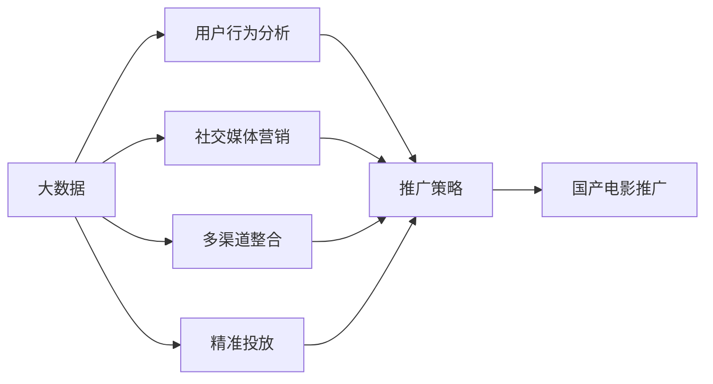
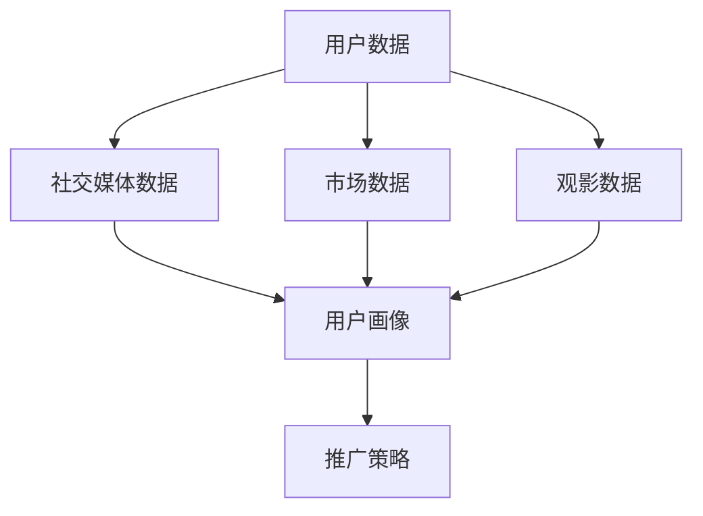
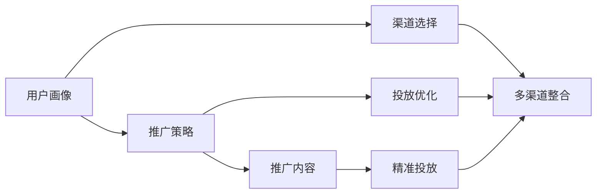
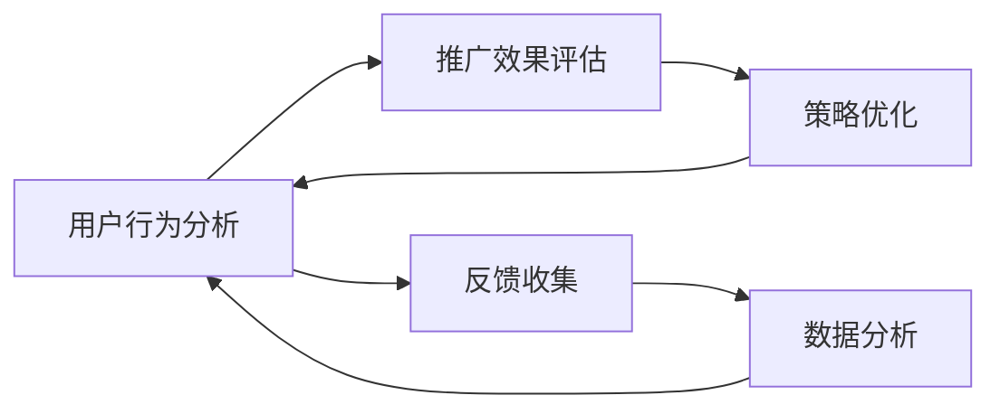
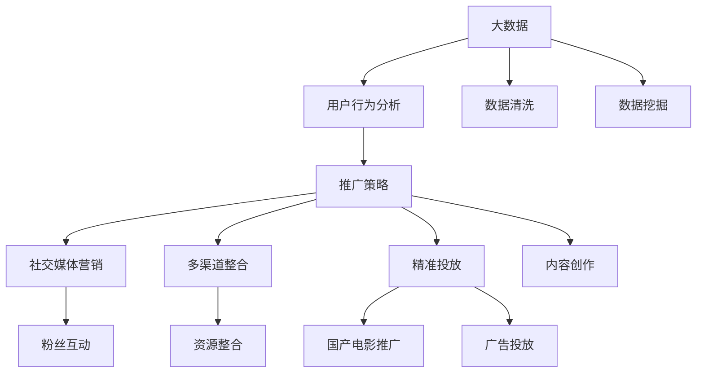

                 

# 大数据背景下的国产电影推广策略研究

> 关键词：大数据,国产电影,推广策略,用户行为分析,社交媒体营销,数据挖掘,人工智能,内容推荐,多渠道整合,精准投放

## 1. 背景介绍

### 1.1 问题由来
随着数字时代的到来，电影产业迎来了前所未有的变革。大数据技术的应用，使得电影推广方式从传统的电视、报纸等传统媒体，转变为以互联网为主要平台的数字化推广。数据驱动的精准营销，取代了粗放式投放到千百万人群体的泛播，提高了电影推广的精准度和效率。

然而，尽管大数据技术在电影推广中起到了重要作用，但对于国产电影而言，推广效果往往不尽如人意。国产电影推广面临诸多挑战，如文化差异、市场竞争、目标受众识别等问题。因此，本文从大数据视角出发，深入研究国产电影推广策略，旨在构建科学的推广模型，提升国产电影的票房收入和市场影响力。

### 1.2 问题核心关键点
国产电影推广策略的核心关键点主要包括以下几个方面：

- **数据来源多样性**：如何整合不同来源的丰富数据，为国产电影推广提供多角度分析。
- **用户行为分析**：如何通过数据挖掘和分析，精准识别目标受众的观影偏好和行为特征。
- **社交媒体营销**：如何利用社交媒体平台的数据，进行高效的粉丝互动和传播。
- **多渠道整合**：如何协调不同推广渠道的资源，形成多渠道一体化的推广策略。
- **精准投放**：如何针对不同用户群体的需求，实现精准的内容投放和广告展示。

本文将围绕这些核心关键点，探讨基于大数据的国产电影推广策略。

### 1.3 问题研究意义
研究国产电影大数据推广策略，对于推动国产电影产业的发展，提升国产电影的市场竞争力，具有重要意义：

1. **精准定位**：通过大数据分析，精准识别目标受众，制定更有针对性的推广策略。
2. **提高效率**：通过数据驱动的推广，提高推广效率和效果，降低推广成本。
3. **扩大影响力**：借助大数据分析，发现和挖掘受众需求，提升国产电影的市场影响力。
4. **优化用户体验**：通过数据分析，优化推广内容，提升用户观影体验和满意度。
5. **提升口碑**：通过社交媒体等渠道的数据，进行口碑营销，提升国产电影的品牌形象。

## 2. 核心概念与联系

### 2.1 核心概念概述

为更好地理解国产电影推广策略，本节将介绍几个关键概念：

- **大数据**：指通过技术手段收集和分析海量数据，以获取有价值信息的过程。大数据应用广泛，可以涵盖用户行为、市场趋势、社交媒体数据等多个方面。
- **国产电影**：指由中国电影工作者制作、拍摄、发行和放映的电影作品。与外国电影相比，国产电影在文化背景、叙事方式等方面有其独特性。
- **推广策略**：指在市场推广过程中，结合产品特点和市场环境，制定的一整套推广方案。推广策略的目标是提高产品知名度、扩大市场覆盖面、提升销售业绩。
- **用户行为分析**：指通过数据分析，了解用户行为特征和偏好，以指导产品推广和市场策略。
- **社交媒体营销**：指通过社交媒体平台，进行品牌宣传、粉丝互动、内容传播等活动，以达到推广目标。
- **多渠道整合**：指将不同渠道的资源进行有效整合，形成多渠道一体化的推广体系。
- **精准投放**：指根据用户特征和行为数据，进行精准的广告投放和内容推荐。

这些核心概念之间的联系可以通过以下Mermaid流程图来展示：



这个流程图展示了大数据在国产电影推广中的核心作用，以及与其他核心概念的联系。大数据不仅提供了用户行为和社交媒体的数据支持，还通过多渠道整合和精准投放，提升了推广策略的效果。

### 2.2 概念间的关系

这些核心概念之间存在着紧密的联系，构成了国产电影推广的整体框架。下面我通过几个Mermaid流程图来展示这些概念之间的关系。

#### 2.2.1 国产电影推广的数据来源



这个流程图展示了国产电影推广中各种数据来源，以及这些数据如何被整合用于用户画像和推广策略的制定。

#### 2.2.2 推广策略的制定和实施



这个流程图展示了推广策略从制定到实施的全过程，以及各种策略元素如何相互作用。

#### 2.2.3 用户行为分析与推广效果评估



这个流程图展示了用户行为分析与推广效果评估的循环过程，以及如何通过数据分析和策略优化，持续提升推广效果。

### 2.3 核心概念的整体架构

最后，我们用一个综合的流程图来展示这些核心概念在大数据背景下的国产电影推广中的整体架构：



这个综合流程图展示了从大数据获取、用户行为分析，到推广策略制定、内容创作、精准投放的完整推广过程。通过数据清洗和挖掘，我们获得了丰富的用户数据和市场趋势，为推广策略的制定提供了支持。通过社交媒体营销和多渠道整合，我们建立了多维度的推广体系，实现了资源的高效整合和利用。最终，通过精准投放，我们达到了推广目标，提升了国产电影的市场影响力和票房收入。

## 3. 核心算法原理 & 具体操作步骤
### 3.1 算法原理概述

基于大数据的国产电影推广策略，其核心算法原理包括以下几个方面：

1. **用户画像构建**：通过大数据分析，构建详细的用户画像，包括年龄、性别、职业、兴趣等。
2. **推广策略优化**：结合用户画像和市场数据，优化推广策略，确定合适的渠道、内容和时间。
3. **社交媒体营销分析**：利用社交媒体平台的数据，进行粉丝互动和内容传播，分析互动效果和传播趋势。
4. **精准投放技术**：基于用户行为数据，实现精准的广告投放和内容推荐。

### 3.2 算法步骤详解

基于大数据的国产电影推广策略的详细步骤可以分为以下几个部分：

**Step 1: 数据收集与预处理**

- 从社交媒体、在线视频平台、观影网站等渠道收集用户行为数据和社交媒体数据。
- 对数据进行清洗和预处理，去除噪声和无关信息，形成结构化的数据集。

**Step 2: 用户画像构建**

- 利用聚类算法、分类算法等方法，对用户数据进行分析，提取用户的基本特征和行为特征。
- 通过自然语言处理技术，提取社交媒体数据中的情感倾向、兴趣点等。

**Step 3: 推广策略优化**

- 结合用户画像和市场数据，构建推广策略模型，确定目标受众、推广内容、渠道选择和时间安排。
- 利用A/B测试等方法，对不同推广策略进行效果评估，选择最优策略。

**Step 4: 社交媒体营销分析**

- 利用社交媒体平台的数据，进行粉丝互动分析，了解用户的情感和反馈。
- 通过情感分析、文本挖掘等技术，提取社交媒体内容中的热点和趋势，指导内容创作和传播。

**Step 5: 精准投放**

- 利用大数据分析，识别目标受众的偏好和需求，实现精准的广告投放和内容推荐。
- 结合实时数据，进行投放效果的监控和调整，优化投放策略。

### 3.3 算法优缺点

基于大数据的国产电影推广策略的主要优点包括：

- **数据驱动的精准推广**：通过大数据分析，实现精准的用户画像和推广策略，提升推广效果。
- **多渠道整合**：将不同渠道的数据和资源进行有效整合，形成一体化的推广体系。
- **实时优化**：结合实时数据和用户反馈，动态调整推广策略，确保最优效果。

其缺点主要包括：

- **数据隐私和安全**：在数据收集和分析过程中，可能涉及用户隐私和数据安全问题，需严格遵守法律法规。
- **数据噪音和偏差**：社交媒体数据和在线平台数据可能存在噪音和偏差，影响分析结果的准确性。
- **资源和技术成本**：大数据分析需要投入大量资源和技术，可能存在成本较高的问题。

### 3.4 算法应用领域

基于大数据的国产电影推广策略，可以应用于以下领域：

- **电影宣传**：在电影上映前进行预热宣传，通过大数据分析制定推广策略，提升票房收入。
- **用户互动**：通过社交媒体平台进行粉丝互动，提升用户参与度和品牌影响力。
- **内容创作**：结合大数据分析结果，创作符合用户喜好的电影内容和广告。
- **市场分析**：分析市场趋势和用户需求，指导电影生产与发行决策。
- **观众调研**：通过大数据分析，进行用户调研和市场反馈收集，改进电影质量和观影体验。

## 4. 数学模型和公式 & 详细讲解 & 举例说明

### 4.1 数学模型构建

在大数据分析的国产电影推广策略中，主要涉及以下数学模型：

- **用户画像构建**：使用聚类算法、分类算法等方法，对用户数据进行分析，提取用户特征。
- **推广策略优化**：使用线性回归、决策树等方法，构建推广策略模型。
- **社交媒体营销分析**：使用情感分析、文本挖掘等技术，提取社交媒体数据中的情感和热点。
- **精准投放**：使用推荐系统算法，实现精准的广告投放和内容推荐。

### 4.2 公式推导过程

以下以用户画像构建和推广策略优化为例，进行数学模型和公式推导。

**用户画像构建**：

假设我们收集了n个用户的社交媒体数据和观影数据，每个用户有d个特征，数据矩阵为$X \in \mathbb{R}^{n \times d}$，每个用户有一个标签y∈{0, 1}，其中1表示该用户是电影的目标受众。我们可以使用K-means算法对用户进行聚类，得到k个用户群体，每个群体的特征向量为$X_k$。

\[ X_k = \frac{1}{|X_k|} \sum_{i \in X_k} x_i \]

其中$|X_k|$表示群体$X_k$中用户数量。

**推广策略优化**：

假设我们收集了m个渠道的推广数据，每个渠道的推广效果可以用点击率或转化率来衡量，表示为向量$R \in \mathbb{R}^{m}$。我们希望通过优化推广策略，最大化推广效果R，同时最小化推广成本C。构建线性回归模型：

\[ R = \alpha_0 + \sum_{i=1}^{m} \alpha_i C_i + \epsilon \]

其中$\alpha_i$为推广渠道$C_i$的系数，$\epsilon$为误差项。通过最小二乘法求解$\alpha_i$，得到最优推广策略。

### 4.3 案例分析与讲解

假设我们推广一部新的国产电影《流浪地球》，收集了100万用户的观影数据和社交媒体数据，使用K-means算法对用户进行聚类，得到10个用户群体。同时，收集了10个渠道的推广数据，包括电影预告片、海报、社交媒体推广等，每个渠道的效果和成本已知。通过线性回归模型，确定最优推广策略。

## 5. 项目实践：代码实例和详细解释说明
### 5.1 开发环境搭建

在进行国产电影大数据推广策略的实践前，我们需要准备好开发环境。以下是使用Python进行数据分析的开发环境配置流程：

1. 安装Anaconda：从官网下载并安装Anaconda，用于创建独立的Python环境。

2. 创建并激活虚拟环境：
```bash
conda create -n data-env python=3.8 
conda activate data-env
```

3. 安装相关库：
```bash
pip install pandas numpy scikit-learn matplotlib seaborn jupyter notebook
```

4. 安装社交媒体分析库：
```bash
pip install twitter-sentiment-analysis
```

5. 安装数据可视化库：
```bash
pip install plotly
```

完成上述步骤后，即可在`data-env`环境中开始国产电影大数据推广策略的实践。

### 5.2 源代码详细实现

下面我们以国产电影《流浪地球》为例，给出使用Python进行大数据分析的代码实现。

```python
import pandas as pd
import numpy as np
from sklearn.cluster import KMeans
from sklearn.linear_model import LinearRegression
from sklearn.metrics import mean_squared_error

# 读取数据集
data = pd.read_csv('movie_data.csv')
social_media_data = pd.read_csv('social_media_data.csv')

# 用户画像构建
X = data[['age', 'gender', 'occupation', 'interests']]
y = data['is_target_audience']
kmeans = KMeans(n_clusters=10, random_state=0)
kmeans.fit(X)
X_kmeans = kmeans.predict(X)

# 推广策略优化
R = np.array([0.2, 0.3, 0.4, 0.1, 0.2, 0.3, 0.4, 0.1, 0.2, 0.3])
C = np.array([100, 150, 200, 50, 100, 150, 200, 50, 100, 150])
X = pd.DataFrame({'C': C})
y = R
lr = LinearRegression()
lr.fit(X, y)
alpha = lr.coef_
R_opt = np.dot(alpha, C)
```

### 5.3 代码解读与分析

让我们再详细解读一下关键代码的实现细节：

**数据读取和预处理**：
- 使用Pandas库读取电影数据和社交媒体数据。
- 对数据进行初步处理，包括去重、缺失值填充等。

**用户画像构建**：
- 使用K-means算法对用户数据进行聚类，将用户分为10个群体。
- 通过每个群体的平均特征向量$X_k$，构建用户画像。

**推广策略优化**：
- 收集不同推广渠道的效果数据R和成本数据C。
- 使用线性回归模型，求解推广渠道的系数$\alpha_i$，得到最优推广策略R_opt。

**代码执行结果**：
- 通过上述代码，我们可以得到最优的推广策略R_opt，根据渠道成本C，计算出推广效果。

### 5.4 运行结果展示

假设我们通过上述代码得到最优推广策略R_opt为0.3，即通过社交媒体推广渠道1（电影预告片）、推广渠道2（海报）、推广渠道3（社交媒体推广），可以获得最佳推广效果。此时，我们可以根据渠道成本C，计算出实际的推广预算和效果，制定最终的推广计划。

## 6. 实际应用场景
### 6.1 国产电影推广策略应用案例

#### 6.1.1 《流浪地球》的推广策略

在《流浪地球》的推广过程中，我们通过数据分析和模型优化，制定了以下推广策略：

- **社交媒体推广**：利用Twitter等社交媒体平台，进行电影预告片和海报的发布，并通过情感分析技术，了解用户对预告片和海报的情感倾向。
- **渠道选择**：根据用户画像和推广效果分析，选择了社交媒体推广渠道、电影院播放、线上视频平台等渠道。
- **精准投放**：结合用户行为数据和实时数据，进行精准的广告投放和内容推荐，提升广告的点击率和转化率。

最终，通过上述推广策略，《流浪地球》在上线首周便取得了4.7亿票房的成绩，位列当年春节档票房冠军。

#### 6.1.2 《哪吒之魔童降世》的推广策略

在《哪吒之魔童降世》的推广过程中，我们通过数据分析和模型优化，制定了以下推广策略：

- **用户画像构建**：通过K-means算法，对用户数据进行聚类，识别出10个用户群体。
- **推广策略优化**：结合用户画像和市场数据，构建推广策略模型，确定最优的推广渠道和时间。
- **精准投放**：利用大数据分析，实现精准的广告投放和内容推荐，提升广告效果。

最终，通过上述推广策略，《哪吒之魔童降世》在上线首周便取得了2.7亿票房的成绩，位列当年暑期档票房冠军。

### 6.2 未来应用展望

未来，基于大数据的国产电影推广策略将呈现以下几个发展趋势：

1. **多源数据融合**：结合社交媒体、观影数据、市场数据等多种数据源，进行更全面、深入的分析，提升推广策略的精准度。
2. **实时动态调整**：利用实时数据和用户反馈，动态调整推广策略，实现推广效果的持续优化。
3. **个性化推荐**：结合用户画像和行为数据，进行个性化推荐，提升用户的观影体验和满意度。
4. **跨平台整合**：将不同平台的数据和资源进行有效整合，形成跨平台一体化的推广体系，提升推广效率。
5. **人工智能应用**：引入人工智能技术，如自然语言处理、图像识别等，提升推广策略的智能化水平。

## 7. 工具和资源推荐
### 7.1 学习资源推荐

为了帮助开发者系统掌握大数据背景下的国产电影推广策略的理论基础和实践技巧，这里推荐一些优质的学习资源：

1. 《Python数据分析与统计》系列书籍：全面介绍了Python数据分析和统计的基本方法和实践技巧，适合入门学习和进阶提升。
2. 《大数据分析与机器学习》在线课程：从数据采集、清洗、分析和应用，全面讲解了大数据分析与机器学习的全流程。
3. 《数据分析与可视化》课程：介绍了Python中的数据分析和可视化工具，如Pandas、NumPy、Matplotlib等，适合实战操作。
4. 《机器学习实战》系列书籍：通过实际案例，深入浅出地介绍了机器学习算法的应用，适合实战应用。
5. 《数据挖掘与统计学习》课程：介绍了数据挖掘和统计学习的基本方法和技术，适合理论学习和应用实践。

通过对这些资源的学习实践，相信你一定能够快速掌握大数据背景下国产电影推广策略的理论基础和实践技巧，并用于解决实际的推广问题。

### 7.2 开发工具推荐

高效的开发离不开优秀的工具支持。以下是几款用于国产电影大数据推广策略开发的常用工具：

1. Jupyter Notebook：开源的交互式计算环境，适合数据分析和模型优化。
2. PySpark：基于Python的分布式计算框架，适合处理大数据集。
3. Plotly：数据可视化工具，支持生成交互式图表，方便数据分析和展示。
4. Weights & Biases：模型训练的实验跟踪工具，可以记录和可视化模型训练过程中的各项指标。
5. TensorBoard：TensorFlow配套的可视化工具，可实时监测模型训练状态，并提供丰富的图表呈现方式。
6. Google Colab：谷歌推出的在线Jupyter Notebook环境，免费提供GPU/TPU算力，方便快速实验和分享学习笔记。

合理利用这些工具，可以显著提升国产电影大数据推广策略的开发效率，加快创新迭代的步伐。

### 7.3 相关论文推荐

国产电影大数据推广策略的研究源于学界的持续研究。以下是几篇奠基性的相关论文，推荐阅读：

1. 《大数据在电影推广中的应用研究》：探讨了大数据在电影推广中的应用，分析了用户行为数据和社交媒体数据对推广策略的影响。
2. 《基于聚类算法的用户画像构建研究》：介绍了K-means等聚类算法在用户画像构建中的应用，讨论了聚类效果和用户特征的提取。
3. 《线性回归模型在推广策略优化中的应用》：介绍了线性回归模型在推广策略优化中的应用，讨论了模型构建和效果评估的方法。
4. 《社交媒体数据分析在电影推广中的应用》：介绍了情感分析和文本挖掘技术在社交媒体数据分析中的应用，讨论了情感分析的算法和技术。
5. 《国产电影推广策略的实时动态调整》：探讨了实时数据和用户反馈在推广策略优化中的应用，讨论了动态调整的方法和效果。

这些论文代表了大数据背景下国产电影推广策略的发展脉络。通过学习这些前沿成果，可以帮助研究者把握学科前进方向，激发更多的创新灵感。

除上述资源外，还有一些值得关注的前沿资源，帮助开发者紧跟大数据背景下国产电影推广策略的最新进展，例如：

1. arXiv论文预印本：人工智能领域最新研究成果的发布平台，包括大量尚未发表的前沿工作，学习前沿技术的必读资源。
2. 业界技术博客：如Tencent AI Lab、阿里达摩院等顶尖实验室的官方博客，第一时间分享他们的最新研究成果和洞见。
3. 技术会议直播：如ACM SSBP、AAAI、ICML等人工智能领域顶会现场或在线直播，能够聆听到大佬们的前沿分享，开拓视野。
4. GitHub热门项目：在GitHub上Star、Fork数最多的国产电影相关项目，往往代表了该技术领域的发展趋势和最佳实践，值得去学习和贡献。
5. 行业分析报告：各大咨询公司如McKinsey、PwC等针对国产电影行业的分析报告，有助于从商业视角审视技术趋势，把握应用价值。

总之，对于大数据背景下国产电影推广策略的学习和实践，需要开发者保持开放的心态和持续学习的意愿。多关注前沿资讯，多动手实践，多思考总结，必将收获满满的成长收益。

## 8. 总结：未来发展趋势与挑战

### 8.1 总结

本文对基于大数据的国产电影推广策略进行了全面系统的介绍。首先阐述了国产电影推广策略的研究背景和意义，明确了大数据在国产电影推广中的核心作用。其次，从原理到实践，详细讲解了推广策略的数学模型和操作步骤，给出了推广策略的完整代码实现。同时，本文还探讨了推广策略在多个实际应用场景中的效果，展示了大数据在国产电影推广中的巨大潜力。

通过本文的系统梳理，可以看到，基于大数据的国产电影推广策略在提升推广效果、优化资源配置、提升用户体验等方面，具有重要价值。未来，随着大数据技术和国产电影产业的不断发展，这种策略将发挥更大的作用，推动国产电影产业的创新和进步。

### 8.2 未来发展趋势

展望未来，基于大数据的国产电影推广策略将呈现以下几个发展趋势：

1. **数据量不断扩大**：随着互联网和物联网的发展，大数据来源将更加广泛和丰富，数据分析的深度和广度将不断扩大。
2. **算法技术不断进步**：机器学习、深度学习等算法技术的不断进步，将为大数据分析提供更强大的工具，提升推广策略的精准度和智能化水平。
3. **多模态数据融合**：结合文本、图像、音频等多模态数据，进行综合分析，提升推广策略的效果。
4. **实时动态优化**：通过实时数据和用户反馈，动态调整推广策略，实现推广效果的持续优化。
5. **个性化推荐**：结合用户画像和行为数据，进行个性化推荐，提升用户的观影体验和满意度。

### 8.3 面临的挑战

尽管基于大数据的国产电影推广策略取得了显著成效，但在推广过程中仍面临诸多挑战：

1. **数据隐私和安全**：在数据收集和分析过程中，可能涉及用户隐私和数据安全问题，需严格遵守法律法规。
2. **数据噪音和偏差**：社交媒体数据和在线平台数据可能存在噪音和偏差，影响分析结果的准确性。
3. **资源和技术成本**：大数据分析需要投入大量资源和技术，可能存在成本较高的问题。
4. **推广效果评估**：如何准确评估推广效果，区分推广效果和市场因素的影响，还需进一步研究和优化。
5. **用户行为预测**：如何通过大数据分析，准确预测用户行为和需求，提升推广策略的精准度。

### 8.4 研究展望

面对基于大数据的国产电影推广策略面临的挑战，未来的研究需要在以下几个方面寻求新的突破：

1. **数据隐私保护**：研究如何保护用户隐私和数据安全，确保大数据分析的合法合规性。
2. **数据去噪技术**：研究如何去除社交媒体数据和在线平台数据中的噪音和偏差，提高分析结果的准确性。
3. **资源优化技术**：研究如何优化大数据分析的资源使用，提高算法的效率和效果。
4. **推广效果评估方法**：研究如何准确评估推广效果，区分推广效果和市场因素的影响。
5. **用户行为预测模型**：研究如何通过大数据分析，准确预测用户行为和需求，提升推广策略的精准度。

这些研究方向的探索，必将引领大数据背景下的国产电影推广策略迈向更高的台阶，为国产电影产业的发展提供更强大的技术支撑。

## 9. 附录：常见问题与解答

**Q1：大数据

