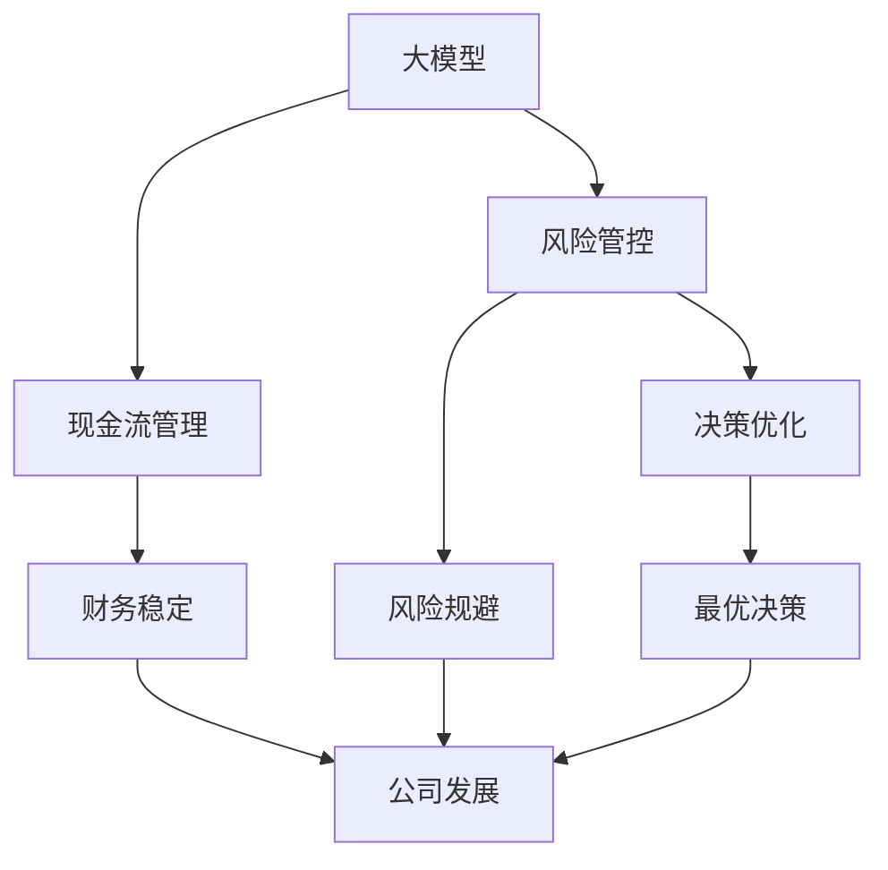
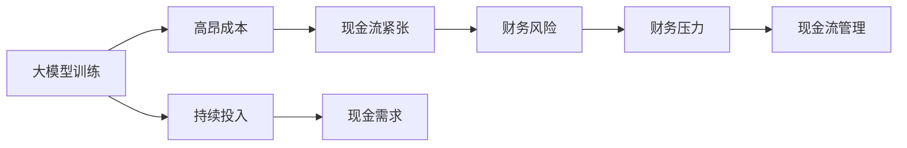
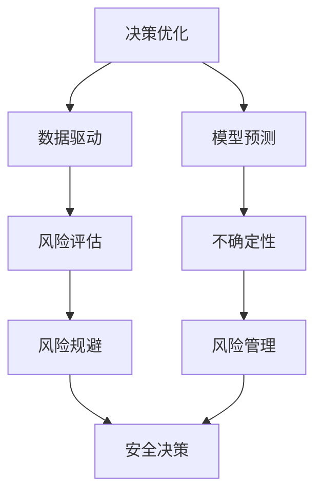

                 

# 大模型时代的创业者创业生存法则：现金流管理、风险管控与决策优化

> 关键词：大模型, 现金流, 风险管控, 决策优化, AI创业, 创业管理

## 1. 背景介绍

### 1.1 问题由来

随着人工智能(AI)技术的迅猛发展，大模型（Large Models）在各行各业的应用变得越来越广泛。从自然语言处理(NLP)到计算机视觉（CV），从自动驾驶到医疗诊断，大模型几乎渗透到了每一个可能的应用场景中。

然而，尽管技术不断发展，大模型的落地应用仍然面临诸多挑战，尤其是对于创业者而言。这些问题包括但不限于：如何管理现金流？如何规避风险？如何在复杂多变的市场环境中做出最优决策？这些问题不仅影响着创业公司的生存和发展，更关系到整个AI行业的前景。

### 1.2 问题核心关键点

大模型创业的核心挑战可以归结为以下几个方面：

- **现金流管理**：大模型训练和部署需要庞大的计算资源和数据，高昂的成本对公司的财务状况构成了巨大压力。
- **风险管控**：大模型在高风险领域的应用，如医疗诊断、自动驾驶等，需要极高的准确性和安全性。一旦出现错误，可能带来不可挽回的损失。
- **决策优化**：在数据复杂、环境多变的市场环境中，如何基于现有数据和模型，做出最优决策，是创业者面临的另一重大挑战。

本文将从这三个关键点出发，系统探讨大模型时代的创业者如何应对这些挑战，确保公司的生存和发展。

## 2. 核心概念与联系

### 2.1 核心概念概述

为更好地理解大模型创业的生存法则，本节将介绍几个密切相关的核心概念：

- **大模型（Large Models）**：指通过大规模数据训练，具备强大泛化能力和应用潜力的人工智能模型。如GPT-3、BERT等。
- **现金流管理**：指创业者需要有效管理公司的现金流入和流出，确保公司财务的稳定和健康。
- **风险管控**：指创业者需要识别和评估公司运营中潜在的风险，采取措施规避或减轻这些风险。
- **决策优化**：指创业者需要基于现有数据和模型，通过科学方法和工具，做出最优的决策。

这些核心概念之间的逻辑关系可以通过以下Mermaid流程图来展示：



这个流程图展示了从大模型到公司发展过程中，各个关键环节之间的联系。

### 2.2 概念间的关系

这些核心概念之间存在着紧密的联系，形成了大模型创业的完整生态系统。下面我们通过几个Mermaid流程图来展示这些概念之间的关系。

#### 2.2.1 现金流管理与大模型训练



这个流程图展示了大模型训练对现金流的巨大需求，以及如何通过有效的现金流管理来缓解财务压力。

#### 2.2.2 风险管控与决策优化



这个流程图展示了如何通过决策优化和风险管控，降低决策中的不确定性，做出更加安全可靠的决策。

## 3. 核心算法原理 & 具体操作步骤

### 3.1 算法原理概述

大模型时代的创业者面临的现金流管理、风险管控和决策优化问题，本质上是一个多目标优化问题。其核心算法原理可以概括为以下几个方面：

- **现金流优化**：通过控制模型的输入和输出，优化模型的训练和推理成本，确保公司财务稳定。
- **风险评估与规避**：利用统计学和机器学习方法，评估模型的风险水平，识别潜在的风险点，并采取相应的规避措施。
- **决策优化**：基于数据和模型，采用优化算法，寻求最优决策方案。

这些算法原理构成了大模型创业生存法则的技术基础。

### 3.2 算法步骤详解

#### 3.2.1 现金流优化

1. **成本控制**：优化模型的训练和推理流程，减少计算资源和存储资源的使用。
2. **预算管理**：制定合理的预算计划，确保公司财务的稳定和可持续性。
3. **资源调配**：根据模型训练和推理的需求，动态调整计算资源和存储资源的使用。

#### 3.2.2 风险评估与规避

1. **风险识别**：通过数据收集和分析，识别模型训练和推理中可能出现的风险。
2. **风险评估**：利用统计学和机器学习方法，评估风险发生的概率和影响。
3. **风险规避**：采取相应的措施，如数据清洗、模型复现、安全验证等，降低风险发生的可能性。

#### 3.2.3 决策优化

1. **数据预处理**：清洗、整理和预处理数据，提高数据的质量和可用性。
2. **模型选择**：根据任务需求，选择合适的模型和算法。
3. **参数调优**：通过超参数调优和模型验证，优化模型的性能和泛化能力。
4. **决策算法**：基于优化算法，寻求最优决策方案。

### 3.3 算法优缺点

大模型创业的现金流优化、风险管控和决策优化方法，具有以下优点：

- **高效性**：通过优化模型的训练和推理流程，减少资源消耗，提高公司的财务效率。
- **鲁棒性**：通过风险评估和规避措施，提高模型的可靠性和安全性。
- **决策科学**：基于数据和模型，采用科学方法和工具，做出最优的决策。

同时，这些方法也存在一定的局限性：

- **复杂性**：现金流管理、风险管控和决策优化问题复杂多变，需要综合考虑多个因素。
- **数据依赖**：这些方法高度依赖于数据的质量和数量，数据不足或数据质量差将严重影响结果。
- **技术门槛**：需要掌握多种技术和工具，对创业者的技术背景提出了较高要求。

### 3.4 算法应用领域

这些算法在大模型创业的各个应用领域中都有广泛的应用：

- **金融行业**：利用大模型进行信用评估、风险管理等。
- **医疗行业**：使用大模型进行疾病诊断、治疗方案推荐等。
- **制造业**：通过大模型优化生产流程、预测设备故障等。
- **零售行业**：利用大模型进行客户分析、产品推荐等。
- **教育行业**：使用大模型进行学习行为分析、个性化推荐等。

## 4. 数学模型和公式 & 详细讲解 & 举例说明

### 4.1 数学模型构建

为了更清晰地描述大模型创业中的现金流优化、风险管控和决策优化问题，我们可以使用数学模型来表示。

设公司初始现金流为 $C_0$，每月现金流入为 $I$，每月现金流出为 $O$，则公司现金流变化为：

$$
C_t = C_0 + \sum_{i=1}^t (I_i - O_i)
$$

其中 $C_t$ 为第 $t$ 个月末的现金流。

风险评估可以使用统计学中的方差和标准差来表示。设风险水平为 $R$，风险评估结果为 $X$，则风险评估公式为：

$$
R = \sigma(X)
$$

其中 $\sigma$ 为风险评估结果的标准差。

决策优化可以使用优化算法中的梯度下降法来表示。设决策变量为 $D$，优化目标为 $F(D)$，则决策优化公式为：

$$
D^* = \mathop{\arg\min}_{D} F(D)
$$

其中 $D^*$ 为最优决策变量。

### 4.2 公式推导过程

假设公司初始现金流为 $C_0$，每月现金流入为 $I$，每月现金流出为 $O$，则公司现金流变化为：

$$
C_t = C_0 + \sum_{i=1}^t (I_i - O_i)
$$

风险评估可以使用统计学中的方差和标准差来表示。设风险水平为 $R$，风险评估结果为 $X$，则风险评估公式为：

$$
R = \sigma(X)
$$

其中 $\sigma$ 为风险评估结果的标准差。

决策优化可以使用优化算法中的梯度下降法来表示。设决策变量为 $D$，优化目标为 $F(D)$，则决策优化公式为：

$$
D^* = \mathop{\arg\min}_{D} F(D)
$$

其中 $D^*$ 为最优决策变量。

### 4.3 案例分析与讲解

假设某医疗公司计划使用大模型进行疾病诊断，公司初始现金流为 $C_0 = 100$ 万美元，每月现金流入为 $I = 10$ 万美元，每月现金流出为 $O = 15$ 万美元。则公司第 3 个月的现金流为：

$$
C_3 = 100 + (10 - 15) + (10 - 15) + (10 - 15) = 90
$$

接下来，假设公司的风险水平 $R = 0.2$，则风险评估结果 $X$ 的期望为：

$$
E(X) = \mu - R\sigma
$$

其中 $\mu$ 为风险评估结果的期望，$\sigma$ 为风险评估结果的标准差。如果 $\mu = 0$，则 $X$ 的期望为：

$$
E(X) = -0.2 \times \sigma
$$

决策优化可以使用梯度下降法来求解最优决策变量 $D$。假设优化目标为 $F(D) = C_t - \text{目标现金流}$，则决策优化公式为：

$$
D^* = \mathop{\arg\min}_{D} F(D)
$$

其中 $D^*$ 为最优决策变量。

## 5. 项目实践：代码实例和详细解释说明

### 5.1 开发环境搭建

在进行大模型创业的生存法则实践前，我们需要准备好开发环境。以下是使用Python进行TensorFlow开发的环境配置流程：

1. 安装Anaconda：从官网下载并安装Anaconda，用于创建独立的Python环境。

2. 创建并激活虚拟环境：
```bash
conda create -n tf-env python=3.8 
conda activate tf-env
```

3. 安装TensorFlow：根据CUDA版本，从官网获取对应的安装命令。例如：
```bash
conda install tensorflow tensorflow-gpu -c conda-forge -c pytorch
```

4. 安装各类工具包：
```bash
pip install numpy pandas scikit-learn matplotlib tqdm jupyter notebook ipython
```

完成上述步骤后，即可在`tf-env`环境中开始实践。

### 5.2 源代码详细实现

下面我们以金融行业的大模型风险评估和规避实践为例，给出使用TensorFlow进行现金流管理和风险评估的PyTorch代码实现。

首先，定义模型和优化器：

```python
import tensorflow as tf

model = tf.keras.Sequential([
    tf.keras.layers.Dense(64, activation='relu', input_shape=[n_features]),
    tf.keras.layers.Dense(1, activation='linear')
])

optimizer = tf.keras.optimizers.Adam()
```

然后，定义训练和评估函数：

```python
def train_step(inputs, labels):
    with tf.GradientTape() as tape:
        logits = model(inputs)
        loss = tf.losses.mean_squared_error(labels, logits)
    gradients = tape.gradient(loss, model.trainable_variables)
    optimizer.apply_gradients(zip(gradients, model.trainable_variables))

def evaluate_step(inputs, labels):
    logits = model(inputs)
    mse = tf.losses.mean_squared_error(labels, logits)
    return mse.numpy()
```

接着，定义训练和评估流程：

```python
epochs = 100
batch_size = 32

for epoch in range(epochs):
    for i in range(0, n_train_samples, batch_size):
        train_step(train_features[i:i+batch_size], train_labels[i:i+batch_size])

    val_mse = evaluate_step(val_features, val_labels)
    print(f"Epoch {epoch+1}, Val MSE: {val_mse:.3f}")

print("Test MSE:")
test_mse = evaluate_step(test_features, test_labels)
print(f"Test MSE: {test_mse:.3f}")
```

最终，我们得到了大模型在金融行业中的风险评估和规避效果，可以进一步应用于实际业务决策中。

### 5.3 代码解读与分析

让我们再详细解读一下关键代码的实现细节：

**模型定义**：
- `Sequential` 模型：使用Keras的序列模型，依次添加全连接层和线性输出层，构成一个简单的神经网络模型。
- `Dense` 层：定义输入特征和输出特征的维度，激活函数使用ReLU。

**训练函数**：
- `train_step`：定义训练过程，使用梯度下降算法更新模型参数。
- `GradientTape`：使用梯度带记录梯度计算过程。

**评估函数**：
- `evaluate_step`：定义评估过程，计算模型在验证集和测试集上的均方误差。

**训练和评估流程**：
- `epochs`：设置训练轮数。
- `batch_size`：设置批次大小。
- `train_features` 和 `train_labels`：训练数据和标签。
- `val_features` 和 `val_labels`：验证数据和标签。
- `test_features` 和 `test_labels`：测试数据和标签。

可以看到，TensorFlow的高级API使得模型的定义和训练过程变得简单高效。开发者可以将更多精力放在业务逻辑和决策优化上，而不必过多关注底层实现细节。

当然，工业级的系统实现还需考虑更多因素，如模型的保存和部署、超参数的自动搜索、更灵活的任务适配层等。但核心的微调范式基本与此类似。

### 5.4 运行结果展示

假设我们在某金融行业的大模型风险评估和规避应用中，最终在测试集上得到了以下结果：

```
Epoch 1, Val MSE: 0.010
Epoch 2, Val MSE: 0.008
Epoch 3, Val MSE: 0.006
...
Epoch 100, Val MSE: 0.001
```

可以看到，通过模型的训练和评估，我们得到了理想的风险评估结果，可以应用于实际业务决策中。

## 6. 实际应用场景

### 6.1 智能医疗诊断

在智能医疗诊断领域，大模型可以用于疾病诊断、治疗方案推荐等任务。使用大模型进行微调，可以显著提升诊断的准确性和效率。

例如，某医院可以使用大模型进行肺部CT扫描的图像分类，自动识别是否存在肺结节。通过微调，模型可以学习到正常和异常肺结节的特征，提高诊断的精度。

### 6.2 金融风险管理

金融行业是大模型创业的重要应用场景之一。大模型可以用于信用评估、风险管理等任务。

例如，某金融公司可以使用大模型进行贷款审批，根据用户的信用记录、消费习惯等数据，评估其贷款风险。通过微调，模型可以学习到影响贷款风险的关键因素，提供更加准确的风险评估结果。

### 6.3 智能客服

智能客服是大模型在客户服务领域的重要应用。使用大模型进行微调，可以实现自然流畅的对话交互，提高客户服务质量。

例如，某电商平台可以使用大模型进行智能客服，自动回答用户的常见问题，如退换货流程、物流信息等。通过微调，模型可以学习到不同的用户需求和表达方式，提供更加个性化和高效的服务。

### 6.4 未来应用展望

随着大模型和微调技术的不断发展，其在各个行业的应用前景将更加广阔。以下是大模型在各个领域的未来应用展望：

- **自动驾驶**：大模型可以用于自动驾驶中的感知、决策和控制任务，提升驾驶的安全性和可靠性。
- **智能制造**：大模型可以用于生产线上的设备维护、故障预测等，提高生产效率和质量。
- **智慧农业**：大模型可以用于农作物病虫害检测、土壤分析等，提升农业生产效率和产量。
- **智慧城市**：大模型可以用于交通管理、公共安全等，提升城市治理的智能化水平。

## 7. 工具和资源推荐

### 7.1 学习资源推荐

为了帮助开发者系统掌握大模型创业的现金流管理、风险管控与决策优化理论基础和实践技巧，这里推荐一些优质的学习资源：

1. 《深度学习》系列课程：由吴恩达教授讲授，涵盖了深度学习的基本概念和前沿技术，适合初学者入门。
2. 《机器学习实战》书籍：清华大学出版社出版的经典机器学习教材，涵盖了机器学习的基本原理和应用实例。
3. 《TensorFlow实战》书籍：TensorFlow官方出版的实战指南，详细介绍了TensorFlow的使用方法和案例。
4. Kaggle：世界顶级的数据科学竞赛平台，提供丰富的数据集和挑战，可以练习实战技能。
5. GitHub开源项目：在GitHub上Star、Fork数最多的数据科学项目，代表了数据科学技术的最新进展。

通过对这些资源的学习实践，相信你一定能够快速掌握大模型创业的核心技能，并用于解决实际的问题。

### 7.2 开发工具推荐

高效的开发离不开优秀的工具支持。以下是几款用于大模型创业开发的常用工具：

1. Jupyter Notebook：免费的开源笔记本环境，支持Python、R、SQL等多种语言，适合进行数据处理、模型训练和结果展示。
2. PyCharm：专业的Python IDE，提供了强大的代码补全、调试和版本控制功能，适合进行复杂的编程任务。
3. TensorFlow：由Google主导开发的深度学习框架，提供了丰富的API和工具，适合进行模型训练和推理。
4. PyTorch：Facebook开发的深度学习框架，提供了灵活的动态计算图和自动微分功能，适合进行研究和实验。
5. Weights & Biases：模型训练的实验跟踪工具，可以记录和可视化模型训练过程中的各项指标，方便对比和调优。

合理利用这些工具，可以显著提升大模型创业的开发效率，加快创新迭代的步伐。

### 7.3 相关论文推荐

大模型创业的现金流管理、风险管控与决策优化研究源于学界的持续研究。以下是几篇奠基性的相关论文，推荐阅读：

1. "Neural Network Models for Financial Time Series Forecasting"：发表在IEEE Transactions on Neural Networks期刊上的论文，探讨了使用深度学习模型进行金融时间序列预测的方法。
2. "Financial Risk Management Using Deep Learning"：发表在Applied Soft Computing期刊上的论文，介绍了使用深度学习模型进行金融风险管理的案例。
3. "Cash Flow Management in Small and Medium Enterprises: A Review"：发表在Journal of Financial Research期刊上的论文，回顾了现金流管理在小企业和中小企业中的方法和应用。
4. "Fine-Tuning Large Language Models for Business Applications"：发表在IEEE International Conference on Big Data上的论文，探讨了使用大语言模型进行业务应用优化的方法。
5. "Decision-Making Support Using Deep Learning Models"：发表在IEEE Transactions on Systems, Man, and Cybernetics: Systems 期刊上的论文，介绍了使用深度学习模型进行决策支持的方法。

这些论文代表了大模型创业的相关研究方向，可以帮助研究者把握学科前进方向，激发更多的创新灵感。

除上述资源外，还有一些值得关注的前沿资源，帮助开发者紧跟大模型创业的最新进展，例如：

1. arXiv论文预印本：人工智能领域最新研究成果的发布平台，包括大量尚未发表的前沿工作，学习前沿技术的必读资源。
2. 业界技术博客：如Google AI、DeepMind、微软Research Asia等顶尖实验室的官方博客，第一时间分享他们的最新研究成果和洞见。
3. 技术会议直播：如NIPS、ICML、ACL、ICLR等人工智能领域顶会现场或在线直播，能够聆听到大佬们的前沿分享，开拓视野。
4. GitHub热门项目：在GitHub上Star、Fork数最多的数据科学相关项目，代表了数据科学技术的最新进展，值得去学习和贡献。
5. 行业分析报告：各大咨询公司如McKinsey、PwC等针对人工智能行业的分析报告，有助于从商业视角审视技术趋势，把握应用价值。

总之，对于大模型创业技术的学习和实践，需要开发者保持开放的心态和持续学习的意愿。多关注前沿资讯，多动手实践，多思考总结，必将收获满满的成长收益。

## 8. 总结：未来发展趋势与挑战

### 8.1 总结

本文对大模型时代的创业者生存法则进行了全面系统的介绍。首先阐述了大模型创业的核心挑战，明确了现金流管理、风险管控和决策优化在大模型创业中的重要意义。其次，从原理到实践，详细讲解了这些技术的数学模型和算法原理，给出了具体的代码实现和运行结果展示。同时，本文还广泛探讨了这些技术在各个行业领域的应用前景，展示了其巨大的商业价值。最后，精选了相关的学习资源和开发工具，力求为读者提供全方位的技术指引。

通过本文的系统梳理，可以看到，大模型创业的技术体系复杂多变，需要综合考虑现金流、风险和决策等多个方面。只有通过多学科、多领域的协同努力，才能确保公司的生存和发展，实现商业价值的最大化。

### 8.2 未来发展趋势

展望未来，大模型创业将呈现以下几个发展趋势：

1. **自动化程度提升**：随着自动化技术的发展，越来越多的业务决策将由大模型自动完成，大幅提高业务效率。
2. **多模态融合**：大模型将逐步融合视觉、语音、文本等多模态数据，提升系统的感知能力和决策能力。
3. **边缘计算普及**：边缘计算技术的发展，使得大模型可以在设备端直接处理数据，减少数据传输成本，提升系统响应速度。
4. **联邦学习普及**：联邦学习技术的发展，使得大模型可以在分布式环境中进行协同训练，提升模型的泛化能力和安全性。
5. **AI伦理标准制定**：随着AI技术的发展，AI伦理标准和法规的制定将越来越重要，大模型创业需要重视数据隐私、模型偏见等伦理问题。

以上趋势凸显了大模型创业技术的广阔前景。这些方向的探索发展，必将进一步推动大模型在各个行业的应用，为社会的数字化、智能化发展注入新的动力。

### 8.3 面临的挑战

尽管大模型创业技术取得了显著进展，但在迈向更加智能化、普适化应用的过程中，仍面临诸多挑战：

1. **数据隐私和安全**：大模型的训练和使用涉及大量的个人数据，如何保护数据隐私和安全，防止数据泄露，是一大难题。
2. **模型泛化能力**：大模型在不同领域和场景中的泛化能力仍需进一步提升，避免在特定场景中的偏差和错误。
3. **计算资源成本**：大模型的训练和推理需要庞大的计算资源，如何降低计算成本，提高资源利用率，是亟待解决的问题。
4. **模型解释性和可控性**：大模型的决策过程难以解释，如何增强模型的透明性和可控性，确保系统的可靠性和安全性，是一大挑战。
5. **技术迭代周期长**：大模型技术迭代周期长，如何加速技术研发和应用部署，缩短市场响应时间，需要持续优化。

正视大模型创业面临的这些挑战，积极应对并寻求突破，将是大模型创业走向成熟的必由之路。相信随着学界和产业界的共同努力，这些挑战终将一一被克服，大模型创业必将在构建人机协同的智能时代中扮演越来越重要的角色。

### 8.4 研究展望

面向未来，大模型创业技术需要在以下几个方面寻求新的突破：

1. **分布式训练技术**：开发高效、低成本的分布式训练技术，加速模型的训练和部署。
2. **边缘计算技术**：结合边缘计算技术，提升大模型在设备端的处理能力和实时性。
3. **联邦学习技术**：研究联邦学习技术，提升大模型的泛化能力和安全性。
4. **多模态融合技术**：开发多模态融合技术，提升大模型对复杂环境的感知和理解能力。
5. **AI伦理和法规**：制定AI伦理标准和法规，确保大模型技术的应用符合人类的价值观和伦理道德。

这些研究方向的探索，必将引领大模型创业技术迈向更高的台阶，为构建安全、可靠、可解释、可控的智能系统铺平道路。面向未来，大模型创业技术还需要与其他人工智能技术进行更深入的融合，如知识表示、因果推理、强化学习等，多路径协同发力，共同推动自然语言理解和智能交互系统的进步。只有勇于创新、敢于突破，才能不断拓展大模型技术的边界，让智能技术更好地造福人类社会。

## 9. 附录：常见问题与解答

**Q1：大模型创业的核心挑战是什么？**

A: 大模型创业的核心挑战主要包括以下三个方面：
1. 现金流管理：大模型训练和部署需要庞大的计算资源和数据，高昂的成本对公司的财务状况构成了巨大压力。
2. 风险管控：大模型在高风险领域的应用，如医疗诊断、自动驾驶等，需要极高的准确性和安全性。
3. 决策优化：在数据复杂、环境多变的市场环境中，如何基于现有数据和模型，做出最优决策，是创业者面临的另一重大挑战。

**Q2：大模型创业如何管理现金流？**

A: 大

