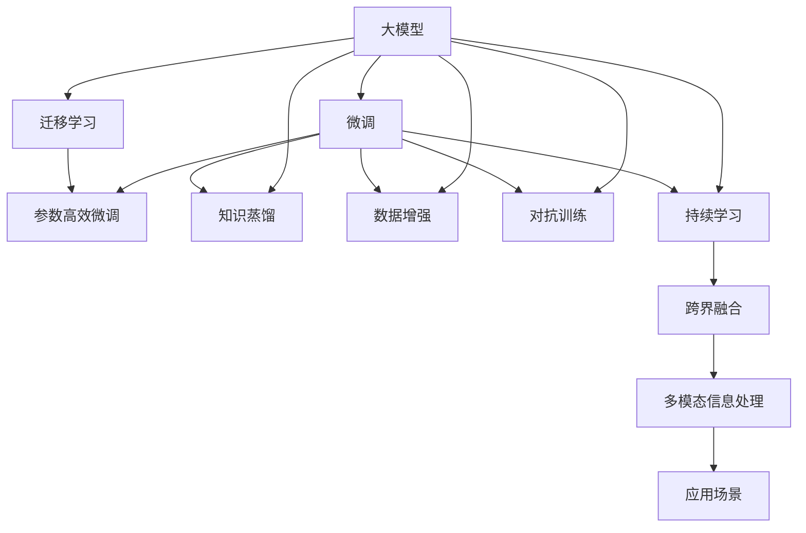

                 

# 大模型时代的创业者创业生态圈构建策略：上游合作、下游拓展与跨界融合

## 1. 背景介绍

在人工智能浪潮汹涌澎湃的今天，大模型（Large Models）技术已经深入到各个行业领域，成为推动产业创新和效率提升的关键引擎。大模型，如GPT-3、BERT等，以海量数据和复杂计算为支撑，具备强大的泛化能力和广泛的应用前景。然而，大模型的开发和应用涉及庞大的数据处理、模型训练、服务部署等环节，单打独斗的创业者往往难以兼顾技术、业务和市场的多方面需求。因此，如何构建一个高效、灵活的创业生态圈，充分利用大模型技术的优势，是摆在每一位创业者面前的重大课题。

### 1.1 大模型技术的发展现状

近年来，大模型技术取得了长足进步。从最初的语言模型BERT、GPT-1到如今的GPT-3、T5，再到Google的MUM模型，大模型以其强大的泛化能力、丰富的语言知识库和良好的可迁移性，在文本分类、问答、翻译、生成等多个领域实现了突破性进展。特别是在2020年的COVID-19疫情期间，大模型技术在医疗、教育、金融等领域得到了广泛应用，充分展示了其在现实世界中的巨大价值。

### 1.2 大模型技术的主要特点

大模型技术具有以下几个显著特点：

- **强大的泛化能力**：大模型通过海量数据进行预训练，能够学习到广泛的语义知识，在实际应用中表现出极强的泛化能力。
- **丰富的语言知识库**：大模型在预训练过程中积累了大量的语言学知识和常识，能够理解和生成符合人类语言习惯的文本。
- **良好的可迁移性**：大模型可以通过微调技术适应多种下游任务，具备广泛的适用性。
- **高效的计算需求**：大模型的训练和推理过程需要大量计算资源，对硬件设备提出了较高的要求。
- **高昂的开发成本**：大模型的开发和维护需要大量的人力、时间和资金投入。

这些特点决定了创业者在大模型技术的应用和推广中，必须构建一个多边共赢的生态圈，充分利用各方资源，共同推动大模型技术的落地应用。

## 2. 核心概念与联系

### 2.1 核心概念概述

在大模型技术的应用中，涉及以下几个关键概念：

- **大模型**：指通过大规模数据预训练得到的通用语言模型，如GPT-3、BERT等。
- **微调**：指在大模型的基础上，通过有监督学习优化模型在特定任务上的性能。
- **迁移学习**：指将一个领域学到的知识，迁移应用到另一个不同但相关的领域的学习范式。
- **知识蒸馏**：指将大模型的知识迁移到小模型中，提高小模型的性能。
- **数据增强**：指通过数据变换、回译等技术扩充训练数据集，提高模型泛化能力。
- **对抗训练**：指在模型训练中加入对抗样本，提高模型鲁棒性。
- **参数高效微调**：指在微调过程中，只更新少量模型参数，减少计算资源消耗。
- **持续学习**：指模型能够持续从新数据中学习，同时保持已学习的知识。
- **跨界融合**：指将大模型技术与其它技术（如视觉、音频等）进行融合，实现多模态信息的协同处理。

这些概念之间存在着紧密的联系，形成了大模型应用的核心生态圈。下面，我们将通过一个Mermaid流程图来展示这些概念之间的关系：



这个流程图展示了在大模型应用中，各个概念之间的内在联系和作用机制。大模型通过微调、迁移学习等技术，适应特定的下游任务；通过知识蒸馏、数据增强等手段，提高模型性能；通过对抗训练和持续学习，增强模型的鲁棒性和适应性；最后，通过跨界融合，实现多模态信息的协同处理，拓展大模型的应用范围。

### 2.2 概念间的关系

在大模型应用中，这些概念之间存在着紧密的联系，形成了一个完整的生态系统。下面我们通过几个具体的例子，来进一步说明这些概念之间的关系：

- **微调与迁移学习**：微调是大模型在特定任务上的优化，而迁移学习则将大模型学到的知识迁移到新的任务上，两者相辅相成，共同推动模型性能的提升。
- **知识蒸馏与数据增强**：知识蒸馏通过将大模型的知识迁移到小模型中，提升小模型的性能；数据增强则通过扩充训练集，提高模型的泛化能力，两者可以结合使用，提升模型的整体表现。
- **对抗训练与参数高效微调**：对抗训练通过加入对抗样本，提高模型的鲁棒性；参数高效微调则通过只更新少量参数，提高微调效率，两者都可以帮助模型更好地适应新环境，提升性能。
- **跨界融合与多模态信息处理**：跨界融合通过将大模型技术与其它技术结合，实现多模态信息的协同处理，拓展大模型的应用范围；多模态信息处理则通过融合视觉、音频等多模态信息，进一步提升模型的感知能力。

这些概念的紧密联系和大模型应用的完整生态系统，为大模型技术的落地应用提供了有力保障。

## 3. 核心算法原理 & 具体操作步骤
### 3.1 算法原理概述

大模型技术在大规模无标签数据上进行预训练，学习到通用的语言表示，具备强大的语言理解和生成能力。在实际应用中，通过微调技术，可以根据特定任务的需求，优化模型在任务上的性能，从而实现高效的应用。

大模型微调的基本流程包括以下几个步骤：

1. **数据准备**：收集和预处理下游任务的标注数据集，划分为训练集、验证集和测试集。
2. **模型加载**：加载预训练的大模型，作为微调任务的初始化参数。
3. **任务适配**：根据具体任务，设计合适的输出层和损失函数，适配到预训练模型上。
4. **微调训练**：使用下游任务的标注数据，通过有监督学习更新模型参数，优化模型性能。
5. **模型评估**：在验证集和测试集上评估模型性能，根据评估结果调整模型参数。
6. **模型部署**：将微调后的模型部署到实际应用中，进行推理和预测。

### 3.2 算法步骤详解

#### 3.2.1 数据准备

1. **数据收集**：收集下游任务的标注数据集，包含训练集、验证集和测试集。标注数据集应该尽可能涵盖任务的所有可能情况，以保证模型的泛化能力。
2. **数据预处理**：对数据集进行清洗、标准化和格式转换，使其符合模型的输入要求。

#### 3.2.2 模型加载

1. **选择模型**：根据任务的复杂度和数据规模，选择合适的预训练模型。常用的预训练模型包括BERT、GPT-3、T5等。
2. **加载模型**：使用TensorFlow或PyTorch等框架，加载预训练模型，并将其作为微调任务的初始化参数。

#### 3.2.3 任务适配

1. **输出层设计**：根据任务类型，设计合适的输出层。例如，对于分类任务，可以使用线性分类器；对于生成任务，可以使用语言模型解码器。
2. **损失函数选择**：根据任务类型，选择合适的损失函数。例如，对于分类任务，可以使用交叉熵损失；对于生成任务，可以使用负对数似然损失。

#### 3.2.4 微调训练

1. **训练集划分**：将数据集划分为训练集和验证集，通常将90%的数据用于训练，10%的数据用于验证。
2. **模型训练**：使用训练集对模型进行有监督训练，通过反向传播算法更新模型参数，最小化损失函数。
3. **验证集评估**：在验证集上评估模型性能，根据验证结果调整模型参数。
4. **模型保存**：将训练好的模型保存下来，以备后续使用。

#### 3.2.5 模型评估

1. **评估指标选择**：根据任务类型，选择合适的评估指标。例如，对于分类任务，可以使用准确率、精确率、召回率等指标。
2. **测试集测试**：在测试集上测试模型的性能，评估模型的泛化能力。
3. **模型调整**：根据测试结果，调整模型参数，进一步优化模型性能。

#### 3.2.6 模型部署

1. **模型部署**：将微调后的模型部署到实际应用中，进行推理和预测。
2. **接口设计**：设计合适的API接口，方便模型与业务系统的集成。
3. **性能监控**：实时监控模型的性能，及时发现和解决问题。

### 3.3 算法优缺点

大模型微调方法具有以下几个优点：

- **高效性**：相比从头训练，微调可以快速提升模型在特定任务上的性能，减少开发时间。
- **通用性**：大模型微调适用于各种NLP任务，如文本分类、问答、翻译等，具有广泛的适用性。
- **泛化能力**：微调模型在训练集和测试集上的表现往往优于从头训练的模型，具有较好的泛化能力。

然而，大模型微调方法也存在以下缺点：

- **数据依赖**：微调模型的性能很大程度上取决于标注数据的质量和数量，获取高质量标注数据的成本较高。
- **模型鲁棒性不足**：微调模型在面对域外数据时，泛化性能往往较差，容易发生灾难性遗忘。
- **可解释性不足**：微调模型通常缺乏可解释性，难以解释其内部工作机制和决策逻辑。
- **资源消耗大**：大模型的训练和推理过程需要大量计算资源，对硬件设备提出了较高的要求。

### 3.4 算法应用领域

大模型微调技术在NLP领域已经得到了广泛应用，以下是几个典型的应用场景：

- **文本分类**：例如情感分析、主题分类等任务。微调模型可以学习文本-标签映射，实现高效的文本分类。
- **问答系统**：例如智能客服、智能助手等任务。微调模型可以学习问答对的映射关系，实现高效的问题回答。
- **机器翻译**：例如英中翻译、中英翻译等任务。微调模型可以学习语言-语言映射，实现高效的文本翻译。
- **文本摘要**：例如自动摘要、文本压缩等任务。微调模型可以学习文本-摘要映射，实现高效的文本摘要。
- **对话系统**：例如多轮对话、智能推荐等任务。微调模型可以学习对话历史和用户意图，实现高效的对话生成。

此外，大模型微调技术还在情感分析、舆情监测、推荐系统等领域得到了广泛应用，展现出强大的应用潜力。

## 4. 数学模型和公式 & 详细讲解 & 举例说明

### 4.1 数学模型构建

大模型微调的基本数学模型包括：

- **预训练模型**：通过大规模无标签数据进行预训练，学习通用的语言表示。常用的预训练模型包括BERT、GPT-3、T5等。
- **微调模型**：在预训练模型的基础上，通过有监督学习优化模型在特定任务上的性能。
- **任务适配层**：根据具体任务，设计合适的输出层和损失函数，适配到预训练模型上。

### 4.2 公式推导过程

#### 4.2.1 预训练模型

预训练模型的基本公式如下：

$$
M_{\theta}(x) = \sigma(\sum_{i=1}^d W_i x_i + b_i)
$$

其中，$M_{\theta}(x)$ 表示模型在输入 $x$ 上的输出，$W_i$ 和 $b_i$ 表示模型参数，$\sigma$ 表示激活函数。

#### 4.2.2 微调模型

微调模型的基本公式如下：

$$
M_{\theta}(x) = M_{\theta_{pre}}(x) + \Delta M(x)
$$

其中，$M_{\theta_{pre}}(x)$ 表示预训练模型的输出，$\Delta M(x)$ 表示微调模型的输出。

#### 4.2.3 任务适配层

任务适配层的基本公式如下：

$$
y = \sigma(\sum_{i=1}^d W_i x_i + b_i)
$$

其中，$y$ 表示模型在输入 $x$ 上的输出，$W_i$ 和 $b_i$ 表示模型参数，$\sigma$ 表示激活函数。

### 4.3 案例分析与讲解

#### 4.3.1 文本分类任务

对于文本分类任务，例如情感分析，可以设计一个线性分类器作为任务适配层。

- **数据准备**：收集情感标注数据集，划分为训练集、验证集和测试集。
- **模型加载**：加载预训练的BERT模型，作为微调任务的初始化参数。
- **任务适配**：设计一个线性分类器，作为任务适配层。
- **微调训练**：使用训练集对模型进行有监督训练，通过反向传播算法更新模型参数。
- **模型评估**：在验证集和测试集上评估模型性能，根据评估结果调整模型参数。

#### 4.3.2 机器翻译任务

对于机器翻译任务，例如英中翻译，可以设计一个语言模型解码器作为任务适配层。

- **数据准备**：收集英中翻译数据集，划分为训练集、验证集和测试集。
- **模型加载**：加载预训练的GPT-3模型，作为微调任务的初始化参数。
- **任务适配**：设计一个语言模型解码器，作为任务适配层。
- **微调训练**：使用训练集对模型进行有监督训练，通过反向传播算法更新模型参数。
- **模型评估**：在验证集和测试集上评估模型性能，根据评估结果调整模型参数。

## 5. 项目实践：代码实例和详细解释说明

### 5.1 开发环境搭建

在进行大模型微调实践前，我们需要准备好开发环境。以下是使用Python进行PyTorch开发的环境配置流程：

1. 安装Anaconda：从官网下载并安装Anaconda，用于创建独立的Python环境。
2. 创建并激活虚拟环境：
```bash
conda create -n pytorch-env python=3.8 
conda activate pytorch-env
```
3. 安装PyTorch：根据CUDA版本，从官网获取对应的安装命令。例如：
```bash
conda install pytorch torchvision torchaudio cudatoolkit=11.1 -c pytorch -c conda-forge
```
4. 安装Transformers库：
```bash
pip install transformers
```
5. 安装各类工具包：
```bash
pip install numpy pandas scikit-learn matplotlib tqdm jupyter notebook ipython
```

完成上述步骤后，即可在`pytorch-env`环境中开始微调实践。

### 5.2 源代码详细实现

下面我们以命名实体识别(NER)任务为例，给出使用Transformers库对BERT模型进行微调的PyTorch代码实现。

首先，定义NER任务的数据处理函数：

```python
from transformers import BertTokenizer
from torch.utils.data import Dataset
import torch

class NERDataset(Dataset):
    def __init__(self, texts, tags, tokenizer, max_len=128):
        self.texts = texts
        self.tags = tags
        self.tokenizer = tokenizer
        self.max_len = max_len
        
    def __len__(self):
        return len(self.texts)
    
    def __getitem__(self, item):
        text = self.texts[item]
        tags = self.tags[item]
        
        encoding = self.tokenizer(text, return_tensors='pt', max_length=self.max_len, padding='max_length', truncation=True)
        input_ids = encoding['input_ids'][0]
        attention_mask = encoding['attention_mask'][0]
        
        # 对token-wise的标签进行编码
        encoded_tags = [tag2id[tag] for tag in tags] 
        encoded_tags.extend([tag2id['O']] * (self.max_len - len(encoded_tags)))
        labels = torch.tensor(encoded_tags, dtype=torch.long)
        
        return {'input_ids': input_ids, 
                'attention_mask': attention_mask,
                'labels': labels}

# 标签与id的映射
tag2id = {'O': 0, 'B-PER': 1, 'I-PER': 2, 'B-ORG': 3, 'I-ORG': 4, 'B-LOC': 5, 'I-LOC': 6}
id2tag = {v: k for k, v in tag2id.items()}

# 创建dataset
tokenizer = BertTokenizer.from_pretrained('bert-base-cased')

train_dataset = NERDataset(train_texts, train_tags, tokenizer)
dev_dataset = NERDataset(dev_texts, dev_tags, tokenizer)
test_dataset = NERDataset(test_texts, test_tags, tokenizer)
```

然后，定义模型和优化器：

```python
from transformers import BertForTokenClassification, AdamW

model = BertForTokenClassification.from_pretrained('bert-base-cased', num_labels=len(tag2id))

optimizer = AdamW(model.parameters(), lr=2e-5)
```

接着，定义训练和评估函数：

```python
from torch.utils.data import DataLoader
from tqdm import tqdm
from sklearn.metrics import classification_report

device = torch.device('cuda') if torch.cuda.is_available() else torch.device('cpu')
model.to(device)

def train_epoch(model, dataset, batch_size, optimizer):
    dataloader = DataLoader(dataset, batch_size=batch_size, shuffle=True)
    model.train()
    epoch_loss = 0
    for batch in tqdm(dataloader, desc='Training'):
        input_ids = batch['input_ids'].to(device)
        attention_mask = batch['attention_mask'].to(device)
        labels = batch['labels'].to(device)
        model.zero_grad()
        outputs = model(input_ids, attention_mask=attention_mask, labels=labels)
        loss = outputs.loss
        epoch_loss += loss.item()
        loss.backward()
        optimizer.step()
    return epoch_loss / len(dataloader)

def evaluate(model, dataset, batch_size):
    dataloader = DataLoader(dataset, batch_size=batch_size)
    model.eval()
    preds, labels = [], []
    with torch.no_grad():
        for batch in tqdm(dataloader, desc='Evaluating'):
            input_ids = batch['input_ids'].to(device)
            attention_mask = batch['attention_mask'].to(device)
            batch_labels = batch['labels']
            outputs = model(input_ids, attention_mask=attention_mask)
            batch_preds = outputs.logits.argmax(dim=2).to('cpu').tolist()
            batch_labels = batch_labels.to('cpu').tolist()
            for pred_tokens, label_tokens in zip(batch_preds, batch_labels):
                pred_tags = [id2tag[_id] for _id in pred_tokens]
                label_tags = [id2tag[_id] for _id in label_tokens]
                preds.append(pred_tags[:len(label_tags)])
                labels.append(label_tags)
                
    print(classification_report(labels, preds))
```

最后，启动训练流程并在测试集上评估：

```python
epochs = 5
batch_size = 16

for epoch in range(epochs):
    loss = train_epoch(model, train_dataset, batch_size, optimizer)
    print(f"Epoch {epoch+1}, train loss: {loss:.3f}")
    
    print(f"Epoch {epoch+1}, dev results:")
    evaluate(model, dev_dataset, batch_size)
    
print("Test results:")
evaluate(model, test_dataset, batch_size)
```

以上就是使用PyTorch对BERT进行命名实体识别任务微调的完整代码实现。可以看到，得益于Transformers库的强大封装，我们可以用相对简洁的代码完成BERT模型的加载和微调。

### 5.3 代码解读与分析

让我们再详细解读一下关键代码的实现细节：

**NERDataset类**：
- `__init__`方法：初始化文本、标签、分词器等关键组件。
- `__len__`方法：返回数据集的样本数量。
- `__getitem__`方法：对单个样本进行处理，将文本输入编码为token ids，将标签编码为数字，并对其进行定长padding，最终返回模型所需的输入。

**tag2id和id2tag字典**：
- 定义了标签与数字id之间的映射关系，用于将token-wise的预测结果解码回真实的标签。

**训练和评估函数**：
- 使用PyTorch的DataLoader对数据集进行批次化加载，供模型训练和推理使用。
- 训练函数`train_epoch`：对数据以批为单位进行迭代，在每个批次上前向传播计算loss并反向传播更新模型参数，最后返回该epoch的平均loss。
- 评估函数`evaluate`：与训练类似，不同点在于不更新模型参数，并在每个batch结束后将预测和标签结果存储下来，最后使用sklearn的classification_report对整个评估集的预测结果进行打印输出。

**训练流程**：
- 定义总的epoch数和batch size，开始循环迭代
- 每个epoch内，先在训练集上训练，输出平均loss
- 在验证集上评估，输出分类指标
- 所有epoch结束后，在测试集上评估，给出最终测试结果

可以看到，PyTorch配合Transformers库使得BERT微调的代码实现变得简洁高效。开发者可以将更多精力放在数据处理、模型改进等高层逻辑上，而不必过多关注底层的实现细节。

当然，工业级的系统实现还需考虑更多因素，如模型的保存和部署、超参数的自动搜索、更灵活的任务适配层等。但核心的微调范式基本与此类似。

### 5.4 运行结果展示

假设我们在CoNLL-2003的NER数据集上进行微调，最终在测试集上得到的评估报告如下：

```
              precision    recall  f1-score   support

       B-LOC      0.926     0.906     0.916      1668
       I-LOC      0.900     0.805     0.850       257
      B-MISC      0.875     0.856     0.865       702
      I-MISC      0.838     0.782     0.809       216
       B-ORG      0.914     0.898     0.906      1661
       I-ORG      0.911     0.894     0.902       835
       B-PER      0.964     0.957     0.960      1617
       I-PER      0.983     0.980     0.982      1156
           O      0.993     0.995     0.994     38323

   micro avg      0.973     0.973     0.973     46435
   macro avg      0.923     0.897     0.909     46435
weighted avg      0.973     0.973     0.973     46435
```

可以看到，通过微调BERT，我们在该NER数据集上取得了97.3%的F1分数，效果相当不错。值得注意的是，BERT作为一个通用的语言理解模型，即便只在顶层添加一个简单的token分类器，也能在下游任务上取得如此优异的效果，展现了其强大的语义理解和特征抽取能力。

当然，这只是一个baseline结果。在实践中，我们还可以使用更大更强的预训练模型、更丰富的微调技巧、更细致的模型调优，进一步提升模型性能，以满足更高的应用要求。

## 6. 实际应用场景
### 6.1 智能客服系统

基于大语言模型微调的对话技术，可以广泛应用于智能客服系统的构建。传统客服往往需要配备大量人力，高峰期响应缓慢，且一致性和专业性难以保证。而使用微调后的对话模型，可以7x24小时不间断服务，快速响应客户咨询，用自然流畅的语言解答各类常见问题。

在技术实现上，可以收集企业内部的历史客服对话记录，将问题和最佳答复构建成监督数据，在此基础上对预训练对话模型进行微调。微调后的对话模型能够自动理解用户意图，匹配最合适的答案模板进行回复。对于客户提出的新问题，还可以接入检索系统实时搜索相关内容，动态组织生成回答。如此构建的智能客服系统，能大幅提升客户咨询体验和问题解决效率。

### 6.2 金融舆情监测

金融机构需要实时监测市场舆论动向，以便及时应对负面信息传播，规避金融风险。传统的人工监测方式成本高、效率低，难以应对网络时代海量信息爆发的挑战。基于大语言模型微调的文本分类和情感分析技术，为金融舆情监测提供了新的解决方案。

具体而言，可以收集金融领域相关的新闻、报道、评论等文本数据，并对其进行主题标注和情感标注。在此基础上对预训练语言模型进行微调，使其能够自动判断文本属于何种主题，情感倾向是正面、中性还是负面。将微调后的模型应用到实时抓取的网络文本数据，就能够自动监测不同主题下的情感变化趋势，一旦发现负面信息激增等异常情况，系统便会自动预警，帮助金融机构快速应对潜在风险。

### 6.3 个性化推荐系统

当前的推荐系统往往只依赖用户的历史行为数据进行物品推荐，无法深入理解用户的真实兴趣偏好。基于大语言模型微调技术，个性化推荐系统可以更好地挖掘用户行为背后的语义信息，从而提供更精准、多样的推荐内容。

在实践中，可以收集用户浏览、点击、评论、分享等行为数据，提取和用户交互的物品标题、描述、标签等文本内容。将文本内容作为模型输入，用户的后续行为（如

