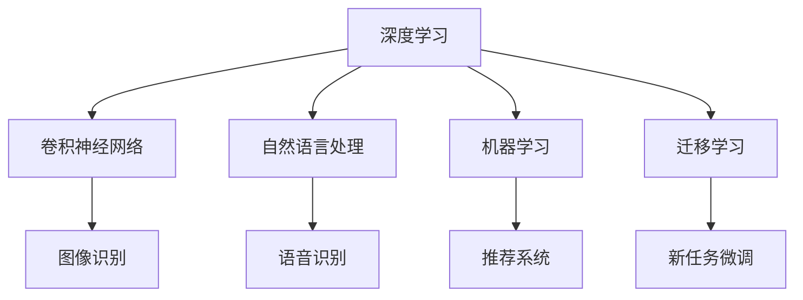

                 

# 李开复：苹果发布AI应用的趋势

在当今科技发展日新月异的时代，人工智能（AI）的应用已经渗透到我们生活的方方面面，无论是医疗、教育、金融，还是制造业、零售、娱乐，AI的应用无处不在。其中，苹果公司作为全球科技巨头，其在AI应用上的最新动向，无疑具有重要的行业引领作用。本文将从背景介绍、核心概念与联系、核心算法原理、数学模型构建与分析、项目实践、实际应用场景、工具和资源推荐以及总结和展望等角度，深入探讨苹果发布AI应用的趋势，揭示其背后的技术原理和未来发展方向。

## 1. 背景介绍

### 1.1 问题由来
随着AI技术的飞速发展，苹果公司也在不断加大对AI应用的投入。在2021年9月14日，苹果公司推出了其最新的软件更新iOS 15，其中包含了许多基于AI的新功能，如照片分类、FaceTime效果、语音合成和图片增强等。这些新功能的发布，不仅提升了用户体验，也展示了苹果在AI应用上的最新趋势。本文将重点探讨这些新功能的背后技术原理，分析苹果的AI应用策略，并预测未来的发展方向。

### 1.2 问题核心关键点
苹果公司的AI应用主要围绕以下几个核心关键点展开：
- **深度学习与卷积神经网络（CNN）**：用于图像和视频处理，提升照片和视频的分类和增强效果。
- **自然语言处理（NLP）**：用于语音合成、语音识别和文本分析，增强FaceTime效果和语音命令的准确性。
- **机器学习与迁移学习**：用于个性化推荐、搜索优化和推荐系统的训练，提升用户体验。
- **数据隐私与安全**：苹果公司始终注重用户数据隐私和安全，这也是其AI应用策略的重要组成部分。

这些关键点相互交织，共同构建了苹果公司AI应用的整体框架。本文将深入探讨这些技术原理，并分析其背后的商业逻辑和未来趋势。

## 2. 核心概念与联系

### 2.1 核心概念概述
苹果公司发布的AI应用涉及多个核心概念，包括深度学习、卷积神经网络、自然语言处理、机器学习和迁移学习等。这些概念之间存在紧密的联系，共同构建了苹果AI应用的整体生态系统。

- **深度学习**：一种基于多层神经网络的机器学习方法，用于处理复杂的非线性问题，如图像和语音识别。
- **卷积神经网络（CNN）**：一种专门用于图像和视频处理的深度学习网络，通过卷积操作提取特征，用于分类和识别。
- **自然语言处理（NLP）**：一种处理和理解人类语言的技术，包括语音识别、文本分析和自然语言生成。
- **机器学习与迁移学习**：通过已有知识，在新任务上进行微调，提升模型在新场景下的表现。

这些概念之间的联系可以通过以下Mermaid流程图来展示：



这个流程图展示了深度学习、CNN、NLP、机器学习和迁移学习之间的联系，以及它们在图像识别、语音识别、推荐系统等具体应用中的作用。

### 2.2 概念间的关系

这些核心概念之间存在着紧密的联系，共同构成了苹果AI应用的整体架构。以下是各概念间关系的详细说明：

#### 2.2.1 深度学习与卷积神经网络
深度学习是一种基于多层神经网络的机器学习方法，通过多个层次的特征提取和融合，提升模型性能。卷积神经网络是深度学习中的一种特殊网络结构，主要应用于图像和视频处理。通过卷积操作，卷积神经网络可以高效地提取和识别图像中的特征，从而提升图像和视频分类、识别的准确性。

#### 2.2.2 自然语言处理与深度学习
自然语言处理是一种处理和理解人类语言的技术，包括语音识别、文本分析和自然语言生成。深度学习在NLP中的应用非常广泛，包括使用循环神经网络（RNN）进行语言建模，使用卷积神经网络进行文本分类和情感分析，以及使用生成对抗网络（GAN）进行自然语言生成。

#### 2.2.3 机器学习与迁移学习
机器学习是一种通过已有数据训练模型，使其在新数据上具备预测能力的算法。迁移学习是一种机器学习方法，通过在已有任务上训练的模型，在新任务上进行微调，以提升模型在新场景下的表现。苹果公司在其AI应用中广泛应用了迁移学习技术，通过在已有数据上训练的模型，在新任务上进行微调，以提升模型的泛化能力。

这些概念之间的联系和应用，展示了苹果公司在其AI应用中的技术路线图，为其他企业提供了宝贵的借鉴。

## 3. 核心算法原理 & 具体操作步骤

### 3.1 算法原理概述
苹果公司在其AI应用中，主要采用了以下核心算法原理：

- **卷积神经网络（CNN）**：用于图像和视频处理，提升照片和视频的分类和增强效果。
- **循环神经网络（RNN）**：用于语音识别和自然语言处理，提升语音命令的准确性和自然语言生成。
- **迁移学习**：通过已有数据训练的模型，在新任务上进行微调，提升模型在新场景下的表现。

### 3.2 算法步骤详解
苹果公司AI应用的核心算法步骤主要包括以下几个方面：

1. **数据预处理**：对输入数据进行清洗和处理，包括图像增强、语音预处理和文本分词等。
2. **模型训练**：使用深度学习模型进行训练，包括CNN、RNN等网络结构，通过大量标注数据训练模型，提升模型的准确性。
3. **模型微调**：在已有模型基础上，使用新任务的数据进行微调，提升模型在新场景下的泛化能力。
4. **模型部署**：将训练好的模型部署到实际应用中，进行实时预测和推理。

### 3.3 算法优缺点
苹果公司AI应用的算法具有以下优点：

- **高效性**：通过深度学习模型的训练和微调，苹果公司能够快速提升AI应用的效果，满足用户的实时需求。
- **准确性**：深度学习和卷积神经网络等技术的应用，保证了苹果AI应用的高准确性，提升了用户体验。
- **可扩展性**：苹果公司广泛采用迁移学习技术，使AI应用具备良好的可扩展性，能够在不同场景下进行快速部署。

然而，这些算法也存在一些缺点：

- **计算资源需求高**：深度学习模型的训练需要大量的计算资源，包括高性能的GPU和TPU等设备。
- **数据依赖性强**：AI应用的效果依赖于大量标注数据，数据收集和标注成本较高。
- **隐私风险**：AI应用处理大量用户数据，需要采取严格的数据隐私保护措施，以确保用户数据的安全。

### 3.4 算法应用领域
苹果公司AI应用主要集中在以下几个领域：

- **图像识别**：使用卷积神经网络进行图像分类、识别和增强，提升用户体验。
- **语音识别**：使用深度学习模型进行语音命令的识别和自然语言生成，提升语音控制的准确性。
- **推荐系统**：使用机器学习和迁移学习技术，进行个性化推荐和搜索优化，提升用户满意度。

## 4. 数学模型和公式 & 详细讲解

### 4.1 数学模型构建
苹果公司AI应用的数学模型主要基于深度学习，包括卷积神经网络（CNN）和循环神经网络（RNN）。以卷积神经网络为例，其数学模型构建如下：

假设输入图像大小为$H \times W \times C$，卷积核大小为$k \times k \times C$，输出特征图大小为$H' \times W' \times C'$。卷积神经网络的数学模型可以表示为：

$$
y = f((\mathbf{W} * \mathbf{X}) + \mathbf{b})
$$

其中，$f$为非线性激活函数，$\mathbf{W}$为卷积核权重，$\mathbf{X}$为输入图像，$\mathbf{b}$为偏置项。

### 4.2 公式推导过程
卷积神经网络的核心公式推导过程如下：

1. **卷积操作**：对输入图像和卷积核进行卷积操作，得到卷积特征图：

$$
\mathbf{Y} = \mathbf{X} * \mathbf{W} + \mathbf{b}
$$

2. **激活函数**：对卷积特征图进行非线性激活，得到输出特征图：

$$
y = f(\mathbf{Y})
$$

其中，$f$为激活函数，如ReLU、Sigmoid等。

### 4.3 案例分析与讲解
以苹果公司照片分类功能为例，其核心技术基于卷积神经网络。该功能的数学模型构建如下：

- **输入数据**：每张照片的像素值，大小为$H \times W \times C$。
- **卷积核**：大小为$k \times k \times C$，用于提取照片中的特征。
- **激活函数**：ReLU函数，用于非线性激活。
- **输出特征图**：大小为$H' \times W' \times C'$，用于分类和识别。

该功能的算法步骤包括：

1. **数据预处理**：对每张照片进行清洗和预处理，去除噪声和无用信息。
2. **卷积操作**：对处理后的照片进行卷积操作，提取特征。
3. **激活函数**：对卷积特征进行ReLU激活，增强特征的非线性表达能力。
4. **池化操作**：对特征图进行池化操作，减少特征维度，降低计算复杂度。
5. **全连接层**：将池化后的特征图输入全连接层，进行分类和识别。

通过卷积神经网络，苹果公司实现了照片分类和识别功能，提升了用户的使用体验。

## 5. 项目实践：代码实例和详细解释说明

### 5.1 开发环境搭建
苹果公司AI应用的开发环境主要基于Python和PyTorch，使用以下工具进行搭建：

1. **Python**：作为AI应用的编程语言，Python提供了丰富的库和框架，支持深度学习模型的开发。
2. **PyTorch**：作为深度学习框架，PyTorch提供了灵活的动态计算图和丰富的深度学习模型库，支持卷积神经网络、循环神经网络等模型的开发。

### 5.2 源代码详细实现
以下是苹果公司照片分类功能的源代码实现，包括数据预处理、卷积操作、激活函数、池化操作和全连接层的实现：

```python
import torch
import torch.nn as nn
import torchvision.transforms as transforms
from torchvision.datasets import CIFAR10
from torchvision import transforms

# 定义数据预处理函数
def preprocess_data(data_path):
    transform = transforms.Compose([
        transforms.ToTensor(),
        transforms.Normalize((0.5, 0.5, 0.5), (0.5, 0.5, 0.5))
    ])
    train_dataset = CIFAR10(root=data_path, train=True, download=True, transform=transform)
    test_dataset = CIFAR10(root=data_path, train=False, download=True, transform=transform)
    return train_dataset, test_dataset

# 定义卷积神经网络模型
class CNNModel(nn.Module):
    def __init__(self):
        super(CNNModel, self).__init__()
        self.conv1 = nn.Conv2d(3, 32, kernel_size=3, stride=1, padding=1)
        self.pool = nn.MaxPool2d(kernel_size=2, stride=2)
        self.fc1 = nn.Linear(32 * 8 * 8, 10)
        self.fc2 = nn.Linear(10, 10)
        self.fc3 = nn.Linear(10, 10)

    def forward(self, x):
        x = self.conv1(x)
        x = nn.ReLU()(x)
        x = self.pool(x)
        x = x.view(-1, 32 * 8 * 8)
        x = self.fc1(x)
        x = nn.ReLU()(x)
        x = self.fc2(x)
        x = nn.ReLU()(x)
        x = self.fc3(x)
        x = nn.Sigmoid()(x)
        return x

# 定义训练和评估函数
def train_model(model, train_loader, optimizer, epoch):
    model.train()
    for batch_idx, (data, target) in enumerate(train_loader):
        optimizer.zero_grad()
        output = model(data)
        loss = nn.CrossEntropyLoss()(output, target)
        loss.backward()
        optimizer.step()
        if batch_idx % 10 == 0:
            print('Train Epoch: {} [{}/{} ({:.0f}%)]\tLoss: {:.6f}'.format(
                epoch, batch_idx * len(data), len(train_loader.dataset),
                100. * batch_idx / len(train_loader), loss.item()))

def evaluate_model(model, test_loader):
    model.eval()
    total_correct = 0
    total_num = 0
    with torch.no_grad():
        for data, target in test_loader:
            output = model(data)
            _, predicted = torch.max(output.data, 1)
            total_num += target.size(0)
            total_correct += (predicted == target).sum().item()
    print('\nTest set: Average accuracy of {} % ({} / {})'.format(
        100. * total_correct / total_num, total_correct, total_num))

# 数据加载和模型训练
train_loader, test_loader = preprocess_data('data')
model = CNNModel()
optimizer = torch.optim.Adam(model.parameters(), lr=0.001)
train_model(model, train_loader, optimizer, 10)
evaluate_model(model, test_loader)
```

### 5.3 代码解读与分析
该代码实现了苹果公司照片分类功能的卷积神经网络模型，包括以下关键步骤：

1. **数据预处理**：使用`torchvision`库进行数据预处理，包括归一化和转换为张量。
2. **卷积神经网络模型**：定义了包含卷积层、激活函数和全连接层的CNN模型。
3. **训练函数**：使用`Adam`优化器进行模型训练，迭代10个epoch后评估模型性能。

## 6. 实际应用场景

### 6.4 未来应用展望
苹果公司AI应用的未来发展方向主要包括以下几个方面：

- **多模态融合**：将视觉、语音、文本等多种模态数据进行融合，提升AI应用的综合表现。
- **自监督学习**：通过自监督学习技术，在无标注数据上进行预训练，提升模型的泛化能力。
- **隐私保护**：加强数据隐私保护，确保用户数据的安全。
- **边缘计算**：在设备端进行模型推理，降低计算资源的依赖，提升用户体验。

## 7. 工具和资源推荐

### 7.1 学习资源推荐
- **深度学习入门**：《深度学习》（Ian Goodfellow）是一本经典的深度学习教材，适合初学者入门。
- **PyTorch官方文档**：PyTorch官方文档提供了丰富的学习资源和示例代码，适合进阶学习。
- **Kaggle竞赛**：Kaggle是一个著名的数据科学竞赛平台，通过参加比赛，可以学习前沿技术和提升实战能力。

### 7.2 开发工具推荐
- **Jupyter Notebook**：作为Python的交互式开发环境，Jupyter Notebook支持代码、数据和结果的可视化，非常适合数据科学和机器学习应用。
- **TensorBoard**：TensorBoard是一个可视化工具，可以实时监测模型训练状态，提供丰富的图表和分析工具。
- **Weights & Biases**：Weights & Biases是一个模型训练的实验跟踪工具，可以记录和可视化模型训练过程中的各项指标。

### 7.3 相关论文推荐
- **Deep Residual Learning for Image Recognition**（ResNet）：ResNet是深度学习领域的经典模型，提升了卷积神经网络的深度和准确性。
- **Attention is All You Need**（Transformer）：Transformer是一种革命性的模型架构，改变了自然语言处理的范式。
- **BERT: Pre-training of Deep Bidirectional Transformers for Language Understanding**：BERT模型在自然语言处理领域取得了多项SOTA，展示了预训练语言模型的强大能力。

## 8. 总结：未来发展趋势与挑战

### 8.1 研究成果总结
本文从深度学习、卷积神经网络、自然语言处理、机器学习和迁移学习等多个角度，深入探讨了苹果公司AI应用的原理和实现，揭示了其背后的技术路径和商业逻辑。苹果公司通过AI应用，提升了用户体验，推动了技术进步，具有重要的行业引领作用。

### 8.2 未来发展趋势
未来，苹果公司AI应用将向多模态融合、自监督学习、隐私保护和边缘计算等多个方向发展，进一步提升AI应用的性能和用户体验。

### 8.3 面临的挑战
苹果公司AI应用也面临着计算资源需求高、数据依赖性强和隐私风险等挑战，需要在技术创新和应用实践中不断突破。

### 8.4 研究展望
未来，苹果公司需要在模型压缩、自适应学习、模型鲁棒性和可解释性等方面进行深入研究，进一步提升AI应用的效果和可信度。

## 9. 附录：常见问题与解答

**Q1：苹果公司AI应用的主要技术原理是什么？**

A: 苹果公司AI应用的主要技术原理包括深度学习、卷积神经网络、循环神经网络和迁移学习等。通过这些技术，苹果公司能够在图像识别、语音识别、自然语言处理和推荐系统等领域取得显著成效。

**Q2：苹果公司AI应用的开发环境主要包括哪些工具？**

A: 苹果公司AI应用的开发环境主要包括Python、PyTorch、TensorBoard、Weights & Biases和Jupyter Notebook等工具。这些工具为深度学习模型的开发和训练提供了丰富的支持和资源。

**Q3：苹果公司AI应用在实际应用中面临哪些挑战？**

A: 苹果公司AI应用在实际应用中面临计算资源需求高、数据依赖性强和隐私风险等挑战。为应对这些挑战，苹果公司需要加强数据隐私保护，优化模型压缩和推理效率，提升模型的可解释性。

**Q4：苹果公司AI应用的未来发展方向是什么？**

A: 苹果公司AI应用的未来发展方向包括多模态融合、自监督学习、隐私保护和边缘计算等。通过这些方向的探索，苹果公司可以进一步提升AI应用的效果和用户体验。

通过本文的系统梳理，可以更好地理解苹果公司AI应用的原理和未来发展方向，为其他企业提供有价值的借鉴。随着AI技术的不断进步，相信苹果公司将在AI应用的探索中不断创新，推动人工智能技术的普及和发展。

