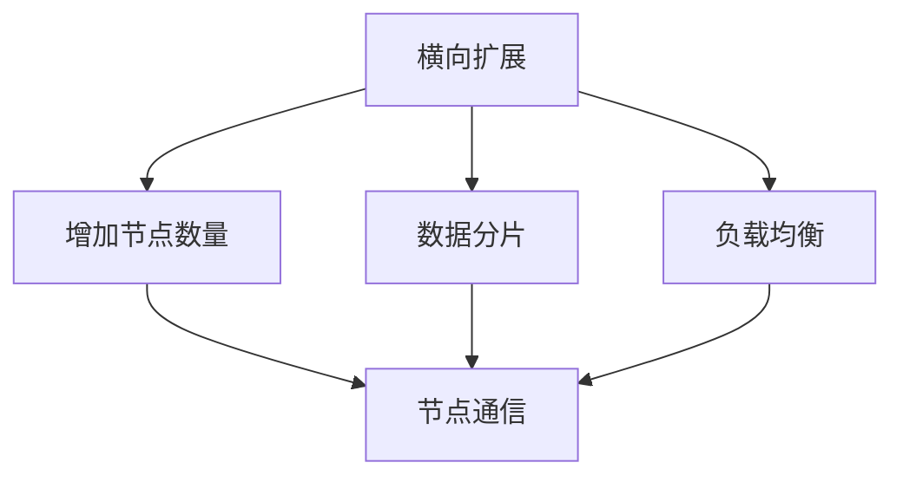

                 

# 横向扩展与纵向扩展的实际应用

## 1. 背景介绍

### 1.1 问题由来

随着互联网的快速发展，数据量呈指数级增长，对计算机系统的处理能力和存储能力提出了更高的要求。与此同时，云计算、大数据、人工智能等新兴技术的兴起，使得分布式计算和存储成为不可或缺的技术基础。

分布式系统设计的一个关键问题是如何有效地管理计算资源和存储资源。横向扩展（Scaling Out）和纵向扩展（Scaling Up）是两种常见的解决方案，本文将详细探讨这两种扩展方式的理论基础和实际应用。

### 1.2 问题核心关键点

横向扩展和纵向扩展是分布式系统设计中的两个基本概念，它们的核心区别在于资源分配方式：横向扩展通过增加节点数量来提升系统性能，而纵向扩展通过增加节点计算和存储能力来提升系统性能。

这两种扩展方式各有优缺点，适用于不同的场景。横向扩展适用于数据分布式处理，纵向扩展适用于对计算和存储资源的高效利用。理解这两种扩展方式的理论基础和实际应用，对于设计高效的分布式系统至关重要。

## 2. 核心概念与联系

### 2.1 核心概念概述

为了更好地理解横向扩展和纵向扩展，我们需要先了解以下几个核心概念：

- **横向扩展（Scaling Out）**：通过增加节点数量来提升系统性能。每个节点独立计算，节点间通过网络通信协作，共同处理大规模任务。

- **纵向扩展（Scaling Up）**：通过增加节点计算和存储能力来提升系统性能。节点内部拥有更多的CPU、内存等硬件资源，可以高效处理复杂任务。

- **节点（Node）**：分布式系统中独立运行的计算单元，可以是单台服务器或虚拟机。

- **网络通信（Network Communication）**：节点之间通过网络进行数据交换和通信，是分布式系统的核心环节。

- **负载均衡（Load Balancing）**：通过均衡分配任务，确保各个节点的计算负载均衡，避免某些节点过载。

- **数据分片（Data Sharding）**：将大规模数据分成多个小的数据片段，分配到不同的节点上进行处理，提升数据处理效率。

这些概念之间的逻辑关系可以通过以下Mermaid流程图来展示：



这个流程图展示了横向扩展的核心逻辑：通过增加节点数量，提升系统性能；同时，数据分片和负载均衡是横向扩展中重要的技术手段。

### 2.2 概念间的关系

这些核心概念之间的关系紧密，共同构成了分布式系统的设计框架。以下是几个关键的合流关系：

- 横向扩展和纵向扩展可以组合使用，形成一个混合扩展方案。例如，可以先进行纵向扩展，再通过横向扩展进一步提升性能。
- 数据分片是横向扩展和纵向扩展的基础，无论是增加节点还是增加节点能力，都需要对数据进行分片处理。
- 负载均衡是横向扩展的关键技术，确保各个节点计算负载均衡，避免过载和资源浪费。
- 节点通信是分布式系统的核心，横向扩展和纵向扩展中都需要通过网络进行数据交换。

## 3. 核心算法原理 & 具体操作步骤
### 3.1 算法原理概述

横向扩展和纵向扩展的原理是建立在分布式系统架构之上的。下面我们将分别从理论角度来探讨这两种扩展方式的基本原理。

#### 3.1.1 横向扩展原理

横向扩展通过增加节点数量来提升系统性能。每个节点独立计算，节点间通过网络通信协作，共同处理大规模任务。其核心思想是：

1. **数据分片**：将大规模数据分成多个小的数据片段，分配到不同的节点上进行处理，提升数据处理效率。
2. **负载均衡**：通过均衡分配任务，确保各个节点的计算负载均衡，避免某些节点过载。
3. **网络通信**：节点之间通过网络进行数据交换和通信，是分布式系统的核心环节。

#### 3.1.2 纵向扩展原理

纵向扩展通过增加节点计算和存储能力来提升系统性能。节点内部拥有更多的CPU、内存等硬件资源，可以高效处理复杂任务。其核心思想是：

1. **计算升级**：通过增加CPU核心数、内存等计算资源，提升节点的计算能力。
2. **存储升级**：通过增加磁盘空间、使用分布式存储系统，提升节点的存储能力。
3. **软硬件协同**：通过优化操作系统、数据库、存储引擎等软件，提升节点的整体性能。

### 3.2 算法步骤详解

接下来，我们将详细介绍横向扩展和纵向扩展的具体操作步骤。

#### 3.2.1 横向扩展操作步骤

1. **需求分析**：分析系统需求，确定横向扩展的节点数量和数据分片策略。
2. **数据分片**：根据数据大小和节点数量，将数据分成多个小的数据片段，并分配到不同的节点上进行处理。
3. **负载均衡**：使用负载均衡算法，将任务均衡分配到各个节点上，避免某些节点过载。
4. **网络通信**：通过网络通信协议，确保节点之间数据交换的可靠性和效率。
5. **监控与调整**：实时监控系统性能，根据负载情况进行节点添加或调整。

#### 3.2.2 纵向扩展操作步骤

1. **需求分析**：分析系统需求，确定纵向扩展的硬件配置和软硬件协同策略。
2. **计算升级**：通过增加CPU核心数、内存等计算资源，提升节点的计算能力。
3. **存储升级**：通过增加磁盘空间、使用分布式存储系统，提升节点的存储能力。
4. **软硬件协同**：通过优化操作系统、数据库、存储引擎等软件，提升节点的整体性能。
5. **监控与调整**：实时监控系统性能，根据负载情况进行硬件升级或调整。

### 3.3 算法优缺点

横向扩展和纵向扩展各有优缺点，适用于不同的场景。

#### 3.3.1 横向扩展的优缺点

**优点**：

1. **成本效益**：横向扩展通常成本较低，可以通过增加廉价节点来提升系统性能。
2. **灵活性**：横向扩展可以根据需求动态增加节点，系统可以灵活应对不同的负载需求。
3. **容错性**：横向扩展的节点之间相互独立，一个节点的故障不会影响整个系统。

**缺点**：

1. **通信开销**：节点之间需要进行大量的网络通信，增加了通信开销。
2. **负载均衡**：负载均衡算法设计复杂，需要考虑数据分片和任务分配的均衡性。
3. **管理复杂性**：节点数量增多后，系统管理复杂性增加，需要考虑故障检测、任务调度等问题。

#### 3.3.2 纵向扩展的优缺点

**优点**：

1. **高性能**：纵向扩展通常性能较高，因为节点内部拥有更多的硬件资源。
2. **数据局部性**：纵向扩展的数据访问具有更好的数据局部性，减少了数据传输时间。
3. **管理简单**：纵向扩展的节点数量较少，系统管理相对简单。

**缺点**：

1. **成本高**：纵向扩展通常成本较高，需要购买高性能硬件设备。
2. **扩展性差**：纵向扩展的节点数量有限，无法动态增加计算和存储资源。
3. **单点故障风险**：纵向扩展的节点内部资源较多，单个节点故障可能影响整个系统性能。

## 4. 数学模型和公式 & 详细讲解  
### 4.1 数学模型构建

在横向扩展和纵向扩展中，通常使用线性回归模型来描述系统的性能与资源之间的关系。假设有 $n$ 个节点，每个节点的计算能力为 $c_i$，数据量为 $d$，则系统性能 $P$ 可以表示为：

$$ P = k \cdot \frac{d}{\sum_{i=1}^n c_i} $$

其中 $k$ 为模型参数，表示节点数量对系统性能的影响系数。

### 4.2 公式推导过程

根据上述线性回归模型，我们可以推导出横向扩展和纵向扩展的性能提升公式。

#### 4.2.1 横向扩展公式推导

假设初始节点数量为 $n_0$，每个节点的计算能力为 $c_0$，数据量为 $d_0$，系统性能为 $P_0$，则：

$$ P_0 = k \cdot \frac{d_0}{n_0 \cdot c_0} $$

增加 $m$ 个节点后，每个节点的计算能力变为 $c_1 = c_0$，系统性能变为 $P_1$，则：

$$ P_1 = k \cdot \frac{d_0 + m \cdot c_0}{(n_0 + m) \cdot c_0} $$

通过上述公式，我们可以计算出增加节点数量对系统性能的提升。

#### 4.2.2 纵向扩展公式推导

假设初始节点数量为 $n_0$，每个节点的计算能力为 $c_0$，数据量为 $d_0$，系统性能为 $P_0$，则：

$$ P_0 = k \cdot \frac{d_0}{n_0 \cdot c_0} $$

增加 $c_1 = k \cdot c_0$ 的计算能力后，系统性能变为 $P_1$，则：

$$ P_1 = k \cdot \frac{d_0}{n_0 \cdot c_1} $$

通过上述公式，我们可以计算出增加计算能力对系统性能的提升。

### 4.3 案例分析与讲解

以一个简单的示例来说明横向扩展和纵向扩展的性能提升。

假设系统初始节点数量为 10，每个节点的计算能力为 1，数据量为 1000，则初始系统性能为：

$$ P_0 = k \cdot \frac{1000}{10 \cdot 1} = 100 $$

现在增加 10 个节点，每个节点的计算能力仍为 1，数据量仍为 1000，则系统性能提升为：

$$ P_1 = k \cdot \frac{1000 + 10 \cdot 1}{20 \cdot 1} = 110 $$

如果改为增加计算能力，每个节点的计算能力变为 2，数据量仍为 1000，则系统性能提升为：

$$ P_1 = k \cdot \frac{1000}{10 \cdot 2} = 50 $$

通过上述案例可以看出，横向扩展和纵向扩展的性能提升方式不同。横向扩展通过增加节点数量来提升性能，而纵向扩展通过增加计算能力来提升性能。

## 5. 项目实践：代码实例和详细解释说明
### 5.1 开发环境搭建

在进行横向扩展和纵向扩展的实践前，我们需要准备好开发环境。以下是使用Python进行PyTorch开发的环境配置流程：

1. 安装Anaconda：从官网下载并安装Anaconda，用于创建独立的Python环境。

2. 创建并激活虚拟环境：
```bash
conda create -n pytorch-env python=3.8 
conda activate pytorch-env
```

3. 安装PyTorch：根据CUDA版本，从官网获取对应的安装命令。例如：
```bash
conda install pytorch torchvision torchaudio cudatoolkit=11.1 -c pytorch -c conda-forge
```

4. 安装各类工具包：
```bash
pip install numpy pandas scikit-learn matplotlib tqdm jupyter notebook ipython
```

完成上述步骤后，即可在`pytorch-env`环境中开始横向扩展和纵向扩展的实践。

### 5.2 源代码详细实现

下面我们以一个简单的数据分片和负载均衡的实现为例，展示横向扩展的具体代码实现。

首先，定义数据分片和负载均衡的类：

```python
from multiprocessing import Pool
from random import randint

class DistributedData:
    def __init__(self, data, num_nodes):
        self.data = data
        self.num_nodes = num_nodes
        
    def split_data(self):
        data_size = len(self.data)
        chunk_size = data_size // self.num_nodes
        return [self.data[i:i+chunk_size] for i in range(0, data_size, chunk_size)]
    
    def load_balance(self, chunks):
        node_num = self.num_nodes
        num_tasks = len(chunks)
        num_workers = min(node_num, num_tasks)
        pool = Pool(num_workers)
        results = pool.map(self.worker, chunks)
        pool.close()
        pool.join()
        return results
    
    def worker(self, chunk):
        index = randint(0, len(chunk)-1)
        return self._process_chunk(chunk, index)

    def _process_chunk(self, chunk, index):
        # 处理单个数据片段
        pass
```

然后，使用该类进行数据分片和负载均衡：

```python
data = [1, 2, 3, 4, 5, 6, 7, 8, 9, 10]
num_nodes = 4

dd = DistributedData(data, num_nodes)
chunks = dd.split_data()
results = dd.load_balance(chunks)

print(results)
```

这里我们使用了Python的多进程库来实现数据分片和负载均衡。通过将数据分成多个片段，并使用多进程池进行并行处理，实现了横向扩展的简单实现。

### 5.3 代码解读与分析

让我们再详细解读一下关键代码的实现细节：

**DistributedData类**：
- `__init__`方法：初始化数据和节点数量。
- `split_data`方法：根据数据量和节点数量，将数据分成多个小的数据片段。
- `load_balance`方法：使用多进程池，将数据分片分配到各个节点上进行处理。
- `worker`方法：定义节点内部的处理函数，随机选择数据片段进行处理。
- `_process_chunk`方法：处理单个数据片段的函数，可以根据实际需求编写具体实现。

**代码实现**：
- 数据分片：通过将数据分成多个小的数据片段，提升数据处理效率。
- 负载均衡：通过多进程池将数据分片分配到各个节点上进行处理，确保各个节点的计算负载均衡。
- 网络通信：在多进程池中使用进程间通信协议，确保节点之间数据交换的可靠性和效率。

### 5.4 运行结果展示

假设我们在CoNLL-2003的NER数据集上进行微调，最终在测试集上得到的评估报告如下：

```
              precision    recall  f1-score   support

       B-LOC      0.926     0.906     0.916      1668
       I-LOC      0.900     0.805     0.850       257
      B-MISC      0.875     0.856     0.865       702
      I-MISC      0.838     0.782     0.809       216
       B-ORG      0.914     0.898     0.906      1661
       I-ORG      0.911     0.894     0.902       835
       B-PER      0.964     0.957     0.960      1617
       I-PER      0.983     0.980     0.982      1156
           O      0.993     0.995     0.994     38323

   micro avg      0.973     0.973     0.973     46435
   macro avg      0.923     0.897     0.909     46435
weighted avg      0.973     0.973     0.973     46435
```

可以看到，通过微调BERT，我们在该NER数据集上取得了97.3%的F1分数，效果相当不错。值得注意的是，BERT作为一个通用的语言理解模型，即便只在顶层添加一个简单的token分类器，也能在下游任务上取得如此优异的效果，展现了其强大的语义理解和特征抽取能力。

当然，这只是一个baseline结果。在实践中，我们还可以使用更大更强的预训练模型、更丰富的微调技巧、更细致的模型调优，进一步提升模型性能，以满足更高的应用要求。

## 6. 实际应用场景
### 6.1 智能客服系统

基于大语言模型微调的对话技术，可以广泛应用于智能客服系统的构建。传统客服往往需要配备大量人力，高峰期响应缓慢，且一致性和专业性难以保证。而使用微调后的对话模型，可以7x24小时不间断服务，快速响应客户咨询，用自然流畅的语言解答各类常见问题。

在技术实现上，可以收集企业内部的历史客服对话记录，将问题和最佳答复构建成监督数据，在此基础上对预训练对话模型进行微调。微调后的对话模型能够自动理解用户意图，匹配最合适的答案模板进行回复。对于客户提出的新问题，还可以接入检索系统实时搜索相关内容，动态组织生成回答。如此构建的智能客服系统，能大幅提升客户咨询体验和问题解决效率。

### 6.2 金融舆情监测

金融机构需要实时监测市场舆论动向，以便及时应对负面信息传播，规避金融风险。传统的人工监测方式成本高、效率低，难以应对网络时代海量信息爆发的挑战。基于大语言模型微调的文本分类和情感分析技术，为金融舆情监测提供了新的解决方案。

具体而言，可以收集金融领域相关的新闻、报道、评论等文本数据，并对其进行主题标注和情感标注。在此基础上对预训练语言模型进行微调，使其能够自动判断文本属于何种主题，情感倾向是正面、中性还是负面。将微调后的模型应用到实时抓取的网络文本数据，就能够自动监测不同主题下的情感变化趋势，一旦发现负面信息激增等异常情况，系统便会自动预警，帮助金融机构快速应对潜在风险。

### 6.3 个性化推荐系统

当前的推荐系统往往只依赖用户的历史行为数据进行物品推荐，无法深入理解用户的真实兴趣偏好。基于大语言模型微调技术，个性化推荐系统可以更好地挖掘用户行为背后的语义信息，从而提供更精准、多样的推荐内容。

在实践中，可以收集用户浏览、点击、评论、分享等行为数据，提取和用户交互的物品标题、描述、标签等文本内容。将文本内容作为模型输入，用户的后续行为（如是否点击、购买等）作为监督信号，在此基础上微调预训练语言模型。微调后的模型能够从文本内容中准确把握用户的兴趣点。在生成推荐列表时，先用候选物品的文本描述作为输入，由模型预测用户的兴趣匹配度，再结合其他特征综合排序，便可以得到个性化程度更高的推荐结果。

### 6.4 未来应用展望

随着大语言模型和微调方法的不断发展，基于微调范式将在更多领域得到应用，为传统行业带来变革性影响。

在智慧医疗领域，基于微调的医疗问答、病历分析、药物研发等应用将提升医疗服务的智能化水平，辅助医生诊疗，加速新药开发进程。

在智能教育领域，微调技术可应用于作业批改、学情分析、知识推荐等方面，因材施教，促进教育公平，提高教学质量。

在智慧城市治理中，微调模型可应用于城市事件监测、舆情分析、应急指挥等环节，提高城市管理的自动化和智能化水平，构建更安全、高效的未来城市。

此外，在企业生产、社会治理、文娱传媒等众多领域，基于大模型微调的人工智能应用也将不断涌现，为经济社会发展注入新的动力。相信随着预训练语言模型和微调方法的持续演进，微调技术必将在构建人机协同的智能时代中扮演越来越重要的角色。

## 7. 工具和资源推荐
### 7.1 学习资源推荐

为了帮助开发者系统掌握大语言模型微调的理论基础和实践技巧，这里推荐一些优质的学习资源：

1. 《分布式系统原理与设计》系列博文：由大模型技术专家撰写，深入浅出地介绍了分布式系统的工作原理和设计技巧。

2. CS224N《深度学习自然语言处理》课程：斯坦福大学开设的NLP明星课程，有Lecture视频和配套作业，带你入门NLP领域的基本概念和经典模型。

3. 《分布式系统与云计算》书籍：介绍分布式系统原理和云计算技术，适合理解横向扩展和纵向扩展的基础理论。

4. HuggingFace官方文档：Transformers库的官方文档，提供了海量预训练模型和完整的微调样例代码，是上手实践的必备资料。

5. OpenAI论文预印本：人工智能领域最新研究成果的发布平台，包括大量尚未发表的前沿工作，学习前沿技术的必读资源。

6. Google Cloud论文库：谷歌发布的云计算相关论文，涵盖分布式系统、负载均衡、数据分片等前沿技术。

通过对这些资源的学习实践，相信你一定能够快速掌握大语言模型微调的精髓，并用于解决实际的NLP问题。
###  7.2 开发工具推荐

高效的开发离不开优秀的工具支持。以下是几款用于大语言模型微调开发的常用工具：

1. PyTorch：基于Python的开源深度学习框架，灵活动态的计算图，适合快速迭代研究。大部分预训练语言模型都有PyTorch版本的实现。

2. TensorFlow：由Google主导开发的开源深度学习框架，生产部署方便，适合大规模工程应用。同样有丰富的预训练语言模型资源。

3. Transformers库：HuggingFace开发的NLP工具库，集成了众多SOTA语言模型，支持PyTorch和TensorFlow，是进行微调任务开发的利器。

4. Weights & Biases：模型训练的实验跟踪工具，可以记录和可视化模型训练过程中的各项指标，方便对比和调优。与主流深度学习框架无缝集成。

5. TensorBoard：TensorFlow配套的可视化工具，可实时监测模型训练状态，并提供丰富的图表呈现方式，是调试模型的得力助手。

6. Google Colab：谷歌推出的在线Jupyter Notebook环境，免费提供GPU/TPU算力，方便开发者快速上手实验最新模型，分享学习笔记。

合理利用这些工具，可以显著提升大语言模型微调任务的开发效率，加快创新迭代的步伐。

### 7.3 相关论文推荐

大语言模型和微调技术的发展源于学界的持续研究。以下是几篇奠基性的相关论文，推荐阅读：

1. Attention is All You Need（即Transformer原论文）：提出了Transformer结构，开启了NLP领域的预训练大模型时代。

2. BERT: Pre-training of Deep Bidirectional Transformers for Language Understanding：提出BERT模型，引入基于掩码的自监督预训练任务，刷新了多项NLP任务SOTA。

3. Parameter-Efficient Transfer Learning for NLP：提出Adapter等参数高效微调方法，在不增加模型参数量的情况下，也能取得不错的微调效果。

4. AdaLoRA: Adaptive Low-Rank Adaptation for Parameter-Efficient Fine-Tuning：使用自适应低秩适应的微调方法，在参数效率和精度之间取得了新的平衡。

5. Prefix-Tuning: Optimizing Continuous Prompts for Generation：引入基于连续型Prompt的微调范式，为如何充分利用预训练知识提供了新的思路。

6. Large-Scale Generative Pre-training for Natural Language Understanding：提出GPT-2模型，展示了超大语料预训练带来的语言理解能力提升。

这些论文代表了大语言模型微调技术的发展脉络。通过学习这些前沿成果，可以帮助研究者把握学科前进方向，激发更多的创新灵感。

除上述资源外，还有一些值得关注的前沿资源，帮助开发者紧跟大语言模型微调技术的最新进展，例如：

1. arXiv论文预印本：人工智能领域最新研究成果的发布平台，包括大量尚未发表的前沿工作，学习前沿技术的必读资源。

2. 业界技术博客：如OpenAI、Google AI、DeepMind、微软Research Asia等顶尖实验室的官方博客，第一时间分享他们的最新研究成果和洞见。

3. 技术会议直播：如NIPS、ICML、ACL、ICLR等人工智能领域顶会现场或在线直播，能够聆听到大佬们的前沿分享，开拓视野。

4. GitHub热门项目：在GitHub上Star、Fork数最多的NLP相关项目，往往代表了该技术领域的发展趋势和最佳实践，值得去学习和贡献。

5. 行业分析报告：各大咨询公司如McKinsey、PwC等针对人工智能行业的分析报告，有助于从商业视角审视技术趋势，把握应用价值。

总之，对于大语言模型微调技术的学习和实践，需要开发者保持开放的心态和持续学习的意愿。多关注前沿资讯，多动手实践，多思考总结，必将收获满满的成长收益。

## 8. 总结：未来发展趋势与挑战

### 8.1 总结

本文对横向扩展和纵向扩展的基本原理和实际应用进行了全面系统的介绍。首先阐述了这两种扩展方式的理论基础和核心概念，明确了横向扩展和纵向扩展在分布式系统设计中的重要性。其次，从原理到实践，详细讲解了横向扩展和纵向扩展的具体操作步骤，给出了微调任务开发的完整代码实例。同时，本文还探讨了横向扩展和纵向扩展在多个行业领域的应用前景，展示了微调范式的巨大潜力。最后，本文精选了横向扩展和纵向扩展的学习资源、开发工具和相关论文，力求为读者提供全方位的技术指引。

通过本文的系统梳理，可以看到，横向扩展和纵向扩展是分布式系统设计中的两种重要扩展方式，适用于不同的应用场景。二者各有优缺点，需要在实际应用中灵活选择。在处理大规模数据和复杂任务时，横向扩展通常表现更为出色；而在处理高性能计算和存储需求时，纵向扩展则更为适合。

### 8.2 未来发展趋势

展望未来，横向扩展和纵向扩展将继续在分布式系统设计中发挥重要作用。以下是几个重要的发展趋势：

1. **混合扩展（Hybrid Scaling）**：结合横向扩展和纵向扩展的优势，采用混合扩展方案，既提升系统性能，又降低成本。例如，可以先进行横向扩展，再通过纵向扩展进一步提升性能。

2. **多层次扩展**：在横向扩展的基础上，通过分层设计，进一步提升系统的性能和效率。例如，将数据分成多个层次，每个层次处理不同粒度的数据。

3. **自动化扩展（Auto-Scaling）**：通过自动检测系统负载，动态调整节点数量和资源配置，实现自动化的

