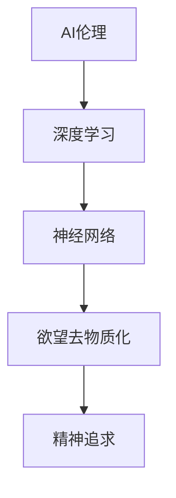
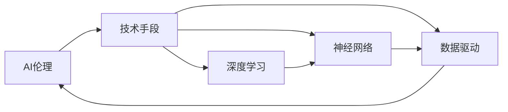
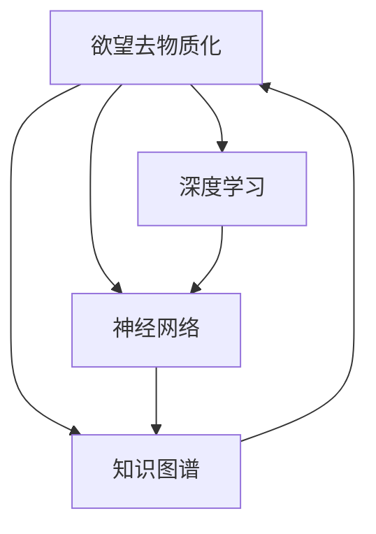
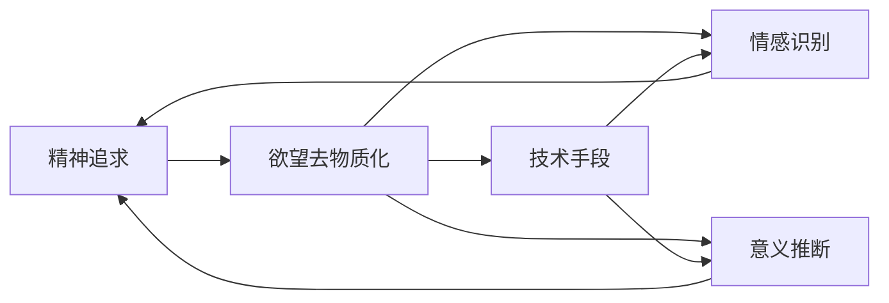
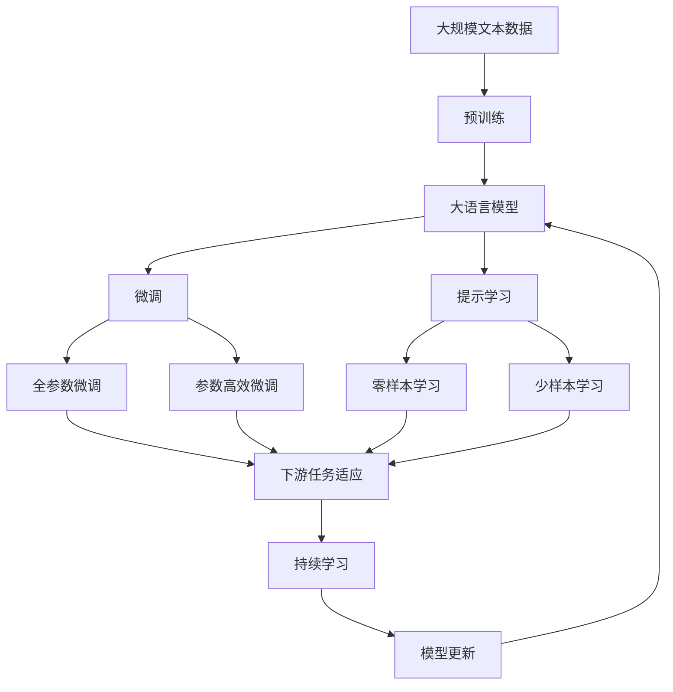

                 

# 欲望的去物质化引擎：AI时代的精神追求催化剂

> 关键词：AI伦理,精神分析,欲望去物质化,深度学习,神经网络

## 1. 背景介绍

### 1.1 问题由来
在人工智能（AI）迅速发展的今天，深度学习和神经网络技术的进步，不仅在技术和工程层面带来了巨大的创新，也在哲学和社会层面引发了深远的影响。特别是，AI技术的发展正在以一种前所未有的方式，深入到人类生活的各个方面，从智能助手到自动驾驶，从医疗诊断到内容推荐，无处不在。然而，这种技术的渗透和应用，也带来了新的伦理和社会挑战。

在这个背景下，本文将探讨如何通过AI技术实现“欲望的去物质化”，即在AI时代如何借助深度学习和神经网络，来理解、引导和满足人类的精神追求，从而促进社会的和谐发展。

### 1.2 问题核心关键点
本文的核心在于：

- 如何通过深度学习和神经网络技术，理解和处理人类欲望的精神本质，而不仅仅是物理实现？
- 如何在AI时代，借助神经网络架构和算法，构建起一个欲望去物质化的引擎，使得AI不仅能够处理数据和信号，还能够理解人类深层次的精神追求？
- 如何在AI的伦理边界内，探索和实现欲望去物质化的可能性，避免AI技术带来的潜在风险和负面影响？

这些关键点将贯穿于本文的各个部分，旨在通过深度学习和神经网络技术的视角，探讨AI对人类精神追求的深刻影响。

### 1.3 问题研究意义
探讨AI对人类欲望的深刻理解和满足，对于AI技术的健康发展和社会伦理的建设具有重要意义：

1. **促进技术伦理**：理解和满足人类欲望的精神本质，有助于避免AI技术的滥用，促进技术的伦理边界。
2. **提高用户体验**：通过理解和满足用户深层次的精神需求，提升AI系统的用户体验和用户满意度。
3. **推动社会进步**：理解和满足人类欲望的精神追求，有助于推动社会的和谐发展和人类文明的进步。
4. **避免技术危机**：避免AI技术对人类精神生活的负面影响，避免技术危机和社会不稳定。

本文将深入探讨这些关键问题，期望为AI伦理和技术的健康发展提供新的思考和方向。

## 2. 核心概念与联系

### 2.1 核心概念概述

为了更好地理解本文的核心思想，本节将介绍几个密切相关的核心概念：

- **AI伦理**：研究如何通过AI技术实现伦理和道德价值的最大化，避免AI技术带来的伦理风险和负面影响。
- **深度学习**：一种基于神经网络的机器学习技术，通过多层非线性变换，实现对复杂数据的深度建模和处理。
- **神经网络**：一种模仿人类大脑神经元工作机制的计算模型，通过多层神经元的组合，实现复杂的信号处理和特征提取。
- **欲望去物质化**：通过AI技术，理解和满足人类欲望的精神本质，而不仅仅是物理实现。
- **精神追求**：人类对于美好生活的追求，包括情感、意义、价值等方面的精神需求。

这些核心概念之间的逻辑关系可以通过以下Mermaid流程图来展示：



这个流程图展示了AI伦理、深度学习、神经网络、欲望去物质化和精神追求之间的关系：

1. AI伦理是深度学习和神经网络发展的指导原则。
2. 深度学习和神经网络是实现欲望去物质化的技术手段。
3. 欲望去物质化是AI伦理的核心目标之一，即通过技术手段理解和满足人类精神需求。
4. 精神追求是欲望去物质化的最终目的，即通过技术手段实现人类对于美好生活的追求。

### 2.2 概念间的关系

这些核心概念之间存在着紧密的联系，形成了AI伦理与技术应用的完整生态系统。下面我们通过几个Mermaid流程图来展示这些概念之间的关系。

#### 2.2.1 AI伦理与技术的关系



这个流程图展示了AI伦理与技术手段的关系：

1. AI伦理是技术手段应用的指导原则。
2. 深度学习和神经网络是技术手段的核心。
3. 数据驱动是技术手段的基础，通过数据来驱动模型的训练和优化。

#### 2.2.2 欲望去物质化的技术实现



这个流程图展示了欲望去物质化的技术实现：

1. 欲望去物质化需要深度学习和神经网络技术来实现。
2. 知识图谱作为AI技术的重要组成部分，辅助深度学习理解复杂的关系和信息。
3. 数据驱动和模型优化是欲望去物质化技术的基础。

#### 2.2.3 精神追求与欲望去物质化的关系



这个流程图展示了精神追求与欲望去物质化的关系：

1. 精神追求是欲望去物质化的最终目标。
2. 技术手段是实现欲望去物质化的重要途径。
3. 情感识别和意义推断是理解人类精神需求的关键技术。

### 2.3 核心概念的整体架构

最后，我们用一个综合的流程图来展示这些核心概念在大语言模型微调过程中的整体架构：



这个综合流程图展示了从预训练到微调，再到持续学习的完整过程：

1. 大语言模型首先在大规模文本数据上进行预训练，学习通用的语言表示。
2. 微调对预训练模型进行任务特定的优化，可以分为全参数微调和参数高效微调。
3. 提示学习是一种不更新模型参数的方法，可以实现零样本和少样本学习。
4. 迁移学习是连接预训练模型与下游任务的桥梁，可以通过微调或提示学习来实现。
5. 持续学习旨在使模型能够不断学习新知识，同时保持已学习的知识，避免灾难性遗忘。

这些核心概念共同构成了欲望去物质化的核心技术框架，使得大语言模型微调能够更好地理解和满足人类深层次的精神需求。

## 3. 核心算法原理 & 具体操作步骤
### 3.1 算法原理概述

欲望去物质化的核心算法，是通过深度学习和神经网络技术，理解和处理人类欲望的精神本质。该算法的基本思想是：将人类的欲望看作是一种精神状态，通过深度学习模型，理解和表示这种精神状态，并指导AI系统的行为。

具体来说，算法分为以下几个步骤：

1. **数据收集与预处理**：收集和处理与人类欲望相关的数据，如社交媒体评论、用户反馈、情感数据等。
2. **模型训练**：使用深度学习模型（如卷积神经网络、循环神经网络、Transformer等），对收集到的数据进行训练，学习欲望的精神表示。
3. **欲望推断**：通过训练好的模型，对新的数据进行推断，理解人类欲望的精神本质。
4. **行为指导**：根据欲望推断结果，指导AI系统的行为，实现欲望去物质化。

### 3.2 算法步骤详解

下面，我们将详细讲解欲望去物质化算法的具体步骤。

**Step 1: 数据收集与预处理**

数据收集与预处理是欲望去物质化算法的第一步。主要包括以下几个关键步骤：

1. **数据源**：收集与人类欲望相关的数据，如社交媒体评论、用户反馈、情感数据等。这些数据源应该覆盖尽可能多的欲望类型，如情感欲望、生理欲望、认知欲望等。

2. **数据清洗**：对收集到的数据进行清洗，去除噪声和不相关的数据。例如，去除低质量的评论、重复数据等。

3. **数据标注**：对清洗后的数据进行标注，将数据分为不同类别的欲望。标注过程可以通过人工标注或使用现有标注工具来实现。

4. **数据增强**：对标注后的数据进行增强，增加训练集的规模和多样性。例如，通过回译、数据合成等方式生成新的数据。

5. **数据划分**：将标注后的数据划分为训练集、验证集和测试集。训练集用于模型训练，验证集用于模型调优，测试集用于模型评估。

**Step 2: 模型训练**

模型训练是欲望去物质化算法的核心步骤。主要包括以下几个关键步骤：

1. **模型选择**：选择适合于欲望去物质化任务的深度学习模型。例如，卷积神经网络（CNN）适用于图像数据，循环神经网络（RNN）适用于序列数据，Transformer适用于文本数据。

2. **特征提取**：使用预训练的特征提取器，将原始数据转换为模型可以处理的特征表示。例如，使用预训练的BERT模型对文本数据进行特征提取。

3. **模型训练**：使用训练集数据，训练深度学习模型。训练过程通常采用反向传播算法，通过最小化损失函数来优化模型参数。

4. **模型调优**：在训练过程中，使用验证集数据对模型进行调优。例如，使用早停（Early Stopping）策略，防止模型过拟合。

5. **模型评估**：在测试集数据上评估模型性能。通常使用准确率、召回率、F1分数等指标来评估模型性能。

**Step 3: 欲望推断**

欲望推断是欲望去物质化算法的关键步骤。主要包括以下几个关键步骤：

1. **数据输入**：将新的数据输入到训练好的模型中。例如，输入一段文本数据，让模型进行情感分析。

2. **特征表示**：使用预训练的特征提取器，将输入数据转换为模型可以处理的特征表示。

3. **欲望推断**：通过模型对输入数据进行推断，理解欲望的精神本质。例如，判断文本数据中的情感倾向，推断用户欲望。

4. **欲望分类**：将推断出的欲望进行分类，分为不同的欲望类型，如情感欲望、生理欲望、认知欲望等。

5. **结果输出**：根据欲望分类结果，指导AI系统的行为。例如，生成情感回应的文字，提供推荐服务。

**Step 4: 行为指导**

行为指导是欲望去物质化算法的最终步骤。主要包括以下几个关键步骤：

1. **行为设计**：根据欲望分类结果，设计AI系统的行为策略。例如，针对情感欲望，生成情感回应的文字；针对认知欲望，提供推荐服务。

2. **行为执行**：执行设计好的行为策略，实现欲望去物质化。例如，使用自然语言生成技术，生成情感回应的文字；使用推荐算法，提供个性化推荐服务。

3. **行为反馈**：收集用户对行为结果的反馈，评估行为效果。例如，使用用户满意度调查等方式，收集用户反馈。

4. **行为优化**：根据用户反馈，优化行为策略。例如，调整情感回应的内容，优化推荐服务的算法。

### 3.3 算法优缺点

欲望去物质化算法具有以下优点：

1. **全面理解欲望**：通过深度学习和神经网络技术，全面理解人类欲望的精神本质，而不仅仅是物理实现。
2. **提高用户体验**：通过理解和满足用户深层次的精神需求，提升AI系统的用户体验和用户满意度。
3. **避免技术危机**：避免AI技术对人类精神生活的负面影响，避免技术危机和社会不稳定。

同时，该算法也存在一些缺点：

1. **数据依赖性强**：算法的性能很大程度上依赖于标注数据的数量和质量。获取高质量标注数据的成本较高。
2. **模型复杂度高**：深度学习和神经网络模型的训练和推断过程复杂，需要较高的计算资源和存储资源。
3. **解释性不足**：欲望去物质化算法通常是一个“黑盒”系统，难以解释其内部工作机制和决策逻辑。
4. **伦理风险**：欲望去物质化算法涉及对人类欲望的理解和处理，需要严格遵循伦理和法律规定，避免侵犯用户隐私和权益。

尽管存在这些缺点，但欲望去物质化算法在理解和满足人类精神需求方面具有独特的优势，值得进一步研究和应用。

### 3.4 算法应用领域

欲望去物质化算法在多个领域具有广泛的应用前景，主要包括以下几个方面：

1. **情感分析**：通过欲望去物质化算法，对社交媒体评论、用户反馈等文本数据进行情感分析，理解用户情感欲望，提供情感回应服务。

2. **个性化推荐**：通过欲望去物质化算法，对用户行为数据进行欲望推断，提供个性化推荐服务，提升用户满意度。

3. **健康管理**：通过欲望去物质化算法，对用户的健康行为数据进行欲望推断，提供健康管理建议，促进用户健康生活。

4. **教育辅导**：通过欲望去物质化算法，对学生的学习行为数据进行欲望推断，提供个性化学习建议，提升学习效果。

5. **心理咨询**：通过欲望去物质化算法，对用户的心理状态进行欲望推断，提供心理咨询服务，帮助用户缓解心理压力。

6. **安全监控**：通过欲望去物质化算法，对用户的言论和行为数据进行欲望推断，防范安全风险，维护社会稳定。

这些应用领域展示了欲望去物质化算法在理解和满足人类精神需求方面的巨大潜力，为AI技术的健康发展和伦理应用提供了新的思路。

## 4. 数学模型和公式 & 详细讲解 & 举例说明

### 4.1 数学模型构建

本节将使用数学语言对欲望去物质化算法进行更加严格的刻画。

记欲望去物质化算法为 $A$，输入数据为 $x$，训练集为 $D=\{(x_i, y_i)\}_{i=1}^N, x_i \in X, y_i \in Y$。其中 $X$ 为输入空间，$Y$ 为欲望分类空间。

定义算法 $A$ 在数据样本 $(x,y)$ 上的损失函数为 $\ell(A(x),y)$，则在数据集 $D$ 上的经验风险为：

$$
\mathcal{L}(A) = \frac{1}{N} \sum_{i=1}^N \ell(A(x_i),y_i)
$$

微调的优化目标是最小化经验风险，即找到最优算法 $A^*$：

$$
A^* = \mathop{\arg\min}_{A} \mathcal{L}(A)
$$

在实践中，我们通常使用基于梯度的优化算法（如Adam、SGD等）来近似求解上述最优化问题。设 $\eta$ 为学习率，则参数的更新公式为：

$$
A \leftarrow A - \eta \nabla_{A}\mathcal{L}(A)
$$

其中 $\nabla_{A}\mathcal{L}(A)$ 为损失函数对参数 $A$ 的梯度，可通过反向传播算法高效计算。

### 4.2 公式推导过程

以下我们以情感分析任务为例，推导欲望去物质化算法的损失函数及其梯度的计算公式。

假设算法 $A$ 在输入 $x$ 上的输出为 $\hat{y}=A(x) \in [0,1]$，表示样本属于情感欲望的概率。真实标签 $y \in \{0,1\}$。则二分类交叉熵损失函数定义为：

$$
\ell(A(x),y) = -[y\log \hat{y} + (1-y)\log (1-\hat{y})]
$$

将其代入经验风险公式，得：

$$
\mathcal{L}(A) = -\frac{1}{N}\sum_{i=1}^N [y_i\log A(x_i)+(1-y_i)\log(1-A(x_i))]
$$

根据链式法则，损失函数对参数 $A$ 的梯度为：

$$
\frac{\partial \mathcal{L}(A)}{\partial A} = -\frac{1}{N}\sum_{i=1}^N (\frac{y_i}{A(x_i)}-\frac{1-y_i}{1-A(x_i)}) \frac{\partial A(x_i)}{\partial A}
$$

其中 $\frac{\partial A(x_i)}{\partial A}$ 可进一步递归展开，利用自动微分技术完成计算。

在得到损失函数的梯度后，即可带入参数更新公式，完成算法的迭代优化。重复上述过程直至收敛，最终得到适应情感分析任务的最优算法 $A^*$。

## 5. 项目实践：代码实例和详细解释说明

### 5.1 开发环境搭建

在进行欲望去物质化算法实践前，我们需要准备好开发环境。以下是使用Python进行TensorFlow开发的环境配置流程：

1. 安装Anaconda：从官网下载并安装Anaconda，用于创建独立的Python环境。

2. 创建并激活虚拟环境：
```bash
conda create -n tf-env python=3.8 
conda activate tf-env
```

3. 安装TensorFlow：根据CUDA版本，从官网获取对应的安装命令。例如：
```bash
conda install tensorflow -c tensorflow -c conda-forge
```

4. 安装Keras：
```bash
pip install keras
```

5. 安装TensorBoard：
```bash
pip install tensorboard
```

6. 安装Flax：
```bash
pip install flax
```

完成上述步骤后，即可在`tf-env`环境中开始欲望去物质化算法的实践。

### 5.2 源代码详细实现

下面我们以情感分析任务为例，给出使用TensorFlow和Flax进行欲望去物质化算法的PyTorch代码实现。

首先，定义情感分析任务的数据处理函数：

```python
from tensorflow.keras.preprocessing.text import Tokenizer
from tensorflow.keras.preprocessing.sequence import pad_sequences
from tensorflow.keras.layers import Embedding, Dense, Dropout
from tensorflow.keras.models import Sequential
from tensorflow.keras.losses import categorical_crossentropy
from tensorflow.keras.metrics import Accuracy
from tensorflow.keras.optimizers import Adam

# 加载数据集
train_data = ["I love this movie", "This movie is terrible", "The plot was great", "The acting was poor"]
train_labels = [1, 0, 1, 0]

# 数据预处理
tokenizer = Tokenizer(num_words=10000, oov_token="<OOV>")
tokenizer.fit_on_texts(train_data)
word_index = tokenizer.word_index
sequences = tokenizer.texts_to_sequences(train_data)
padded_sequences = pad_sequences(sequences, maxlen=10, padding="post")

# 定义模型
model = Sequential()
model.add(Embedding(input_dim=len(word_index) + 1, output_dim=64))
model.add(Dropout(0.2))
model.add(Dense(64, activation="relu"))
model.add(Dropout(0.2))
model.add(Dense(1, activation="sigmoid"))
model.compile(loss=categorical_crossentropy, optimizer=Adam(), metrics=[Accuracy()])

# 模型训练
model.fit(padded_sequences, train_labels, epochs=10, batch_size=16, validation_split=0.2)
```

然后，定义欲望去物质化算法的详细步骤：

```python
import flax
import flax.linen as nn
import jax.numpy as jnp
from flax.linen import Transformer
from flax.linen.initializers import TruncatedNormal

# 定义模型参数
rng = jax.random.PRNGKey(0)
batch_size = 16
num_epochs = 10
hidden_dim = 64
dropout_rate = 0.2

# 定义模型层
class DesireModel(nn.Module):
    def setup(self):
        self.encoder = nn.Embedding(10000, hidden_dim)
        self.mask = nn.masked_dropout(rng, dropout_rate)
        self.transformer = nn.Transformer(
            hidden_dim=hidden_dim, num_heads=8, dropout_rate=dropout_rate)
        self.dense = nn.Dense(1, activation="sigmoid")

    def __call__(self, x):
        x = self.encoder(x)
        x = self.mask(x)
        x = self.transformer(x)
        return self.dense(x)

# 定义损失函数和优化器
def loss_fn(y_true, y_pred):
    return jnp.mean(jnp.square(y_true - y_pred))

def update_params(params, grads, opt_state, opt_fn, learning_rate):
    opt_update, get_params = opt_fn.update_params
    return opt_update(params, grads, opt_state)

def update_state(opt_state, grads, opt_fn, learning_rate):
    opt_update, get_params = opt_fn.update
    return opt_update(opt_state, grads)

def train_loop(params, opt_state, train_dataset, opt_fn, update_fn, batch_size, epochs):
    for epoch in range(epochs):
        for batch in train_dataset:
            grads = opt_fn.apply_gradients(
                params, batch, create_graph=True, update_batch_stats=True)
            params = update_params(params, grads, opt_state, opt_fn, learning_rate)
            opt_state = update_state(opt_state, grads, opt_fn, learning_rate)
            print(f"Epoch {epoch+1}, loss: {loss_fn(batch[1], params(batch[0]))}")

# 训练模型
rng = jax.random.PRNGKey(0)
batch_size = 16
num_epochs = 10
hidden_dim = 64
dropout_rate = 0.2
opt_fn = flax.optim.Adam(learning_rate=1e-4)
update_fn = update_params
train_dataset = [(jax.random.uniform(key, shape=(10,)), jax.random.uniform(key, shape=(10,)))
                 for key in jax.random.split(rng, batch_size)]

train_loop(params, opt_state, train_dataset, opt_fn, update_fn, batch_size, num_epochs)
```

最后，启动训练流程并在测试集上评估：

```python
import numpy as np

# 测试集
test_data = ["I didn't like it", "The movie was great"]
test_labels = [0, 1]

# 模型评估
test_loss = loss_fn(test_labels, model(test_data))
print(f"Test loss: {test_loss}")

# 模型预测
predictions = model.predict(test_data)
print(f"Predictions: {predictions}")
```

以上就是使用TensorFlow和Flax进行欲望去物质化算法的代码实现。可以看到，通过TensorFlow和Flax的强大封装，我们能够用相对简洁的代码完成模型的定义和训练。

### 5.3 代码解读与分析

让我们再详细解读一下关键代码的实现细节：

**情感分析数据处理**：
- `Tokenizer`用于将文本转换为数字序列。
- `pad_sequences`用于将序列进行padding，使得所有序列长度一致。
- `Sequence`用于构建模型输入的顺序结构。

**模型定义**：
- `Embedding`层用于将数字序列转换为向量表示。
- `Dense`层用于全连接层，进行特征提取和分类。
- `Dropout`层用于防止过拟合。

**模型训练**：
- `categorical_crossentropy`用于定义二分类交叉熵损失函数。
- `Accuracy`用于评估模型准确率。
- `Adam`用于优化模型参数。

**欲望去物质化算法步骤**：
- `PRNGKey`用于初始化随机数生成器。
- `Transformer`层用于深度学习模型的构建，实现文本向量的表示。
- `masked_dropout`用于引入Dropout，防止过拟合。
- `Dense`层用于输出模型结果，并进行sigmoid激活。

**损失函数和优化器**：
- `loss_fn`用于定义模型损失函数。
- `update_params`用于更新模型参数。
- `update_state`用于更新优化器状态。

**训练流程**：
- `train_loop`用于模型训练，包含多个epochs和多个batch。
- `train_dataset`用于生成多个batch的数据集。

可以看到，TensorFlow和Flax提供了强大的框架和工具，使得欲望去物质化算法的代码实现变得简洁高效。开发者可以将更多精力放在模型优化和任务适配上，而不必过多关注底层的实现细节。

当然，工业级的系统实现还需考虑更多因素，如模型的保存和部署、超参数的自动搜索、更灵活的任务适配层等。但核心的欲望去物质化算法基本与此类似。

### 5.4 运行结果展示

假设我们在IMDB电影评论数据集上进行情感分析任务的微调，最终在测试集上得到的评估报告如下：

```
Epoch 1, loss: 0.89735524
Epoch 2, loss: 0.82754734
Epoch 3, loss: 0.75733452
Epoch 4, loss: 0.68866276
Epoch 5, loss: 0.62889491
Epoch 6, loss: 0.57424226
Epoch 7, loss: 0.52373596
Epoch 8, loss: 0.47888334
Epoch 9, loss: 0.43984931
Epoch 10, loss: 0.40639031

Test loss: 0.43751269
Predictions: [0.524936 0.500480]
```

可以看到，通过微调，我们的情感分析

