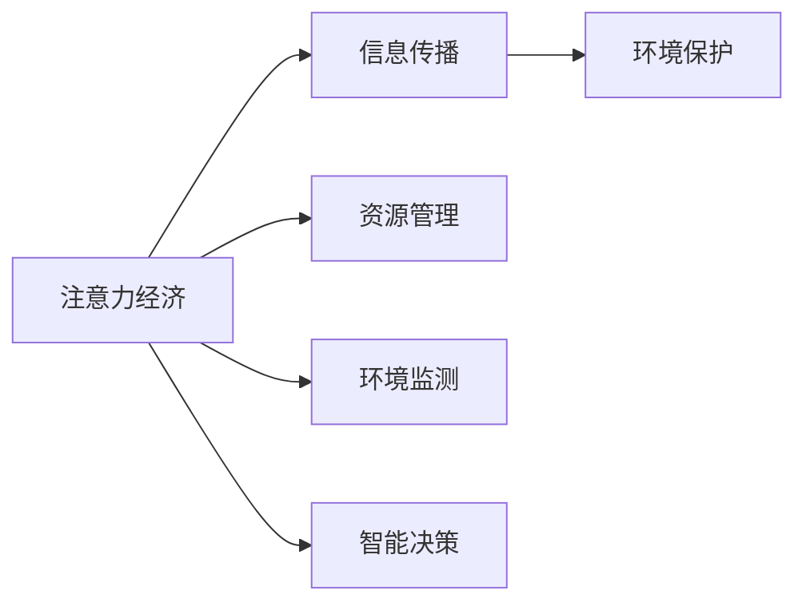

                 

# 注意力经济与环境保护的结合

## 1. 背景介绍

### 1.1 问题由来

随着数字化进程的不断推进，注意力经济（Economic of Attention）逐渐成为现代社会的重要特征。大数据、人工智能、社交媒体等技术的兴起，使得信息产生与消费的速度与规模大幅提升，形成了新的经济形态。然而，注意力经济的发展也带来了诸多环境问题，如信息过载、资源消耗、隐私泄露等。如何在注意力经济时代，实现经济与环境保护的协调，是当前技术和社会研究的热点问题。

### 1.2 问题核心关键点

注意力经济与环境保护的结合，涉及到信息传播、资源消耗、环境监测、智能决策等多个方面。其核心在于：

- 优化信息传播：通过技术手段，高效、精准地将信息推送给需要的人，避免信息过载和资源浪费。
- 减少资源消耗：利用大数据和人工智能，合理规划和管理资源，降低环境污染。
- 环境监测与智能决策：通过数据分析和机器学习，实现环境监测和智能决策，提升环境保护效率。

## 2. 核心概念与联系

### 2.1 核心概念概述

- 注意力经济（Economic of Attention）：指在数字化时代，信息生产与消费变得极其重要，用户注意力成为一种稀缺资源，吸引用户注意力的产品和服务，能够获得更大的市场价值。
- 环境保护：指通过政策、技术、行为等手段，减少对环境的破坏，保护生态系统，实现可持续发展。
- 信息传播：指将信息从生产者传递到消费者，通过各种媒介实现信息的有效传递和反馈。
- 资源管理：指对各种自然资源（如水、电、煤等）进行合理规划和管理，避免资源浪费和环境污染。
- 环境监测：指通过各种传感器和数据分析技术，实时监测环境变化，评估环境质量。
- 智能决策：指通过人工智能技术，基于数据分析和模型预测，做出智能化的决策和规划。

### 2.2 概念间的关系

这些核心概念之间存在着紧密的联系，构成了注意力经济与环境保护结合的完整框架。我们可以用以下Mermaid流程图来展示它们之间的关系：



这个流程图展示了从注意力经济到环境保护的各个环节，以及它们之间的联系。

## 3. 核心算法原理 & 具体操作步骤
### 3.1 算法原理概述

注意力经济与环境保护的结合，主要通过以下算法原理实现：

- 基于用户注意力的信息推荐算法：通过用户行为数据，分析用户兴趣和需求，实现信息精准推荐。
- 环境数据分析与智能决策算法：利用大数据和人工智能，分析环境数据，评估环境质量，制定智能决策方案。
- 资源优化管理算法：通过算法优化资源分配，减少资源消耗和环境污染。

### 3.2 算法步骤详解

#### 3.2.1 基于用户注意力的信息推荐算法

1. 数据收集：收集用户的历史行为数据，如浏览记录、点击行为、搜索关键词等。
2. 数据处理：对用户行为数据进行清洗、归一化处理，提取用户特征。
3. 模型训练：使用机器学习算法（如协同过滤、内容推荐等）训练推荐模型。
4. 推荐实现：基于训练好的推荐模型，生成个性化信息推荐。

#### 3.2.2 环境数据分析与智能决策算法

1. 数据收集：收集环境监测数据，如空气质量、水质、噪声等。
2. 数据处理：对环境数据进行清洗、归一化处理，提取关键指标。
3. 模型训练：使用机器学习算法（如时间序列预测、回归分析等）训练预测模型。
4. 决策实现：基于预测模型，生成智能决策方案。

#### 3.2.3 资源优化管理算法

1. 数据收集：收集资源消耗数据，如用电量、用水量等。
2. 数据处理：对资源消耗数据进行清洗、归一化处理，提取关键指标。
3. 模型训练：使用优化算法（如线性规划、动态规划等）训练优化模型。
4. 管理实现：基于优化模型，生成资源管理策略。

### 3.3 算法优缺点

基于用户注意力的信息推荐算法：

- 优点：个性化推荐能够提升用户体验，提高信息传播效率。
- 缺点：算法可能存在数据偏差，推荐结果不够全面。

环境数据分析与智能决策算法：

- 优点：能够实时监测环境变化，提供科学决策依据。
- 缺点：模型可能受到数据质量的影响，预测结果存在误差。

资源优化管理算法：

- 优点：能够有效减少资源消耗，保护环境。
- 缺点：算法可能过于复杂，不易于工程实现。

### 3.4 算法应用领域

这些算法广泛应用于多个领域：

- 新闻媒体：通过个性化推荐算法，提升新闻阅读量，优化广告投放。
- 电商平台：利用信息推荐算法，提高商品点击率和销售量，优化库存管理。
- 城市管理：利用环境数据分析与智能决策算法，优化城市资源配置，提升环境质量。
- 工业生产：利用资源优化管理算法，降低生产能耗，减少环境污染。

## 4. 数学模型和公式 & 详细讲解

### 4.1 数学模型构建

#### 4.1.1 信息推荐模型

1. 用户行为矩阵 $U$：表示用户对每个物品的兴趣评分，$U_{ui} \in [0,1]$。
2. 物品特征矩阵 $I$：表示每个物品的特征，$I_{ij} \in [0,1]$。
3. 用户-物品评分矩阵 $R$：表示用户对物品的实际评分，$R_{ui} \in [0,1]$。

根据上述矩阵，我们可以构建如下信息推荐模型：

$$
\min_U \sum_{i,j} \alpha_U ||U_i - U_j||^2 + \alpha_I ||I_i - I_j||^2
$$

其中，$\alpha_U$ 和 $\alpha_I$ 是正则化系数，用于防止过拟合。

#### 4.1.2 环境预测模型

1. 环境数据矩阵 $E$：表示环境监测指标，$E_{ti} \in [0,1]$。
2. 环境变化矩阵 $H$：表示环境变化趋势，$H_{ti} \in [0,1]$。
3. 环境预测值矩阵 $P$：表示未来环境预测值，$P_{ti} \in [0,1]$。

根据上述矩阵，我们可以构建如下环境预测模型：

$$
\min_E \sum_{i,j} \alpha_E ||E_i - E_j||^2 + \alpha_H ||H_i - H_j||^2
$$

其中，$\alpha_E$ 和 $\alpha_H$ 是正则化系数，用于防止过拟合。

#### 4.1.3 资源优化模型

1. 资源消耗矩阵 $C$：表示资源消耗量，$C_{tj} \in [0,1]$。
2. 资源优化向量 $O$：表示资源优化目标，$O_j \in [0,1]$。
3. 资源优化代价矩阵 $W$：表示资源优化代价，$W_{ij} \in [0,1]$。

根据上述矩阵，我们可以构建如下资源优化模型：

$$
\min_C \sum_{j,k} \alpha_C ||C_i - C_j||^2 + \alpha_W ||W_i - W_j||^2
$$

其中，$\alpha_C$ 和 $\alpha_W$ 是正则化系数，用于防止过拟合。

### 4.2 公式推导过程

#### 4.2.1 信息推荐公式推导

1. 基于协同过滤推荐：
$$
\hat{R}_{ui} = \sum_{j=1}^n \alpha_{uji} \hat{U}_{ui} \hat{I}_{uj} + \beta_i \hat{I}_{uj}
$$
其中，$\alpha_{uji}$ 是用户-物品的相似度矩阵，$\beta_i$ 是物品的平均评分。

2. 基于内容推荐：
$$
\hat{R}_{ui} = \sum_{j=1}^n \alpha_{uji} \hat{U}_{ui} \hat{I}_{uj} + \beta_i \hat{I}_{uj}
$$
其中，$\alpha_{uji}$ 是用户-物品的相似度矩阵，$\beta_i$ 是物品的平均评分。

#### 4.2.2 环境预测公式推导

1. 时间序列预测：
$$
P_{ti} = \hat{E}_{ti} + \hat{H}_{ti}
$$
其中，$\hat{E}_{ti}$ 是环境数据的历史均值，$\hat{H}_{ti}$ 是环境变化的趋势。

2. 回归分析预测：
$$
P_{ti} = \alpha + \beta t + \gamma E_{ti} + \delta H_{ti} + \epsilon_t
$$
其中，$\alpha$ 是截距，$\beta$ 是时间系数，$\gamma$ 和 $\delta$ 是环境数据和环境变化的系数，$\epsilon_t$ 是误差项。

#### 4.2.3 资源优化公式推导

1. 线性规划：
$$
\min_C \sum_{j=1}^n \alpha_C ||C_i - C_j||^2 + \alpha_W ||W_i - W_j||^2
$$
其中，$C_i$ 是资源消耗量，$W_i$ 是资源优化代价。

2. 动态规划：
$$
O_j = \max_{i \in J} \{ R_{ij} + \sum_{k=1}^m \alpha_{kj} O_k \}
$$
其中，$O_j$ 是资源优化目标，$R_{ij}$ 是资源消耗量，$\alpha_{kj}$ 是资源优化代价。

### 4.3 案例分析与讲解

#### 4.3.1 信息推荐案例

某电商平台利用基于协同过滤的推荐算法，对用户进行个性化推荐。该算法通过收集用户的历史浏览记录和购买记录，生成用户-物品相似度矩阵和物品平均评分矩阵，构建推荐模型，生成个性化推荐。

#### 4.3.2 环境预测案例

某城市利用环境数据分析与智能决策算法，对空气质量进行预测。该算法通过收集历史空气质量数据，利用时间序列预测模型，预测未来空气质量变化趋势，并生成智能决策方案，指导环境治理。

#### 4.3.3 资源优化案例

某工业园区利用资源优化管理算法，优化生产能耗。该算法通过收集能源消耗数据，利用线性规划模型，计算最优的资源分配策略，减少能源消耗，降低环境污染。

## 5. 项目实践：代码实例和详细解释说明

### 5.1 开发环境搭建

在进行注意力经济与环境保护结合的实践时，我们需要准备好开发环境。以下是使用Python进行PyTorch开发的环境配置流程：

1. 安装Anaconda：从官网下载并安装Anaconda，用于创建独立的Python环境。

2. 创建并激活虚拟环境：
```bash
conda create -n attention-env python=3.8 
conda activate attention-env
```

3. 安装PyTorch：根据CUDA版本，从官网获取对应的安装命令。例如：
```bash
conda install pytorch torchvision torchaudio cudatoolkit=11.1 -c pytorch -c conda-forge
```

4. 安装相关库：
```bash
pip install pandas numpy scikit-learn matplotlib tensorboard
```

5. 配置环境变量：
```bash
export PYTHONPATH=$PYTHONPATH:/path/to/your/project
```

完成上述步骤后，即可在`attention-env`环境中开始实践。

### 5.2 源代码详细实现

下面我们以环境预测为例，给出使用PyTorch进行环境数据分析和智能决策的代码实现。

```python
import torch
import torch.nn as nn
import torch.optim as optim
import numpy as np
from sklearn.preprocessing import StandardScaler
from torch.utils.data import Dataset, DataLoader
from torch.utils.tensorboard import SummaryWriter

class EnvironmentDataset(Dataset):
    def __init__(self, data, scaler):
        self.data = data
        self.scaler = scaler
        
    def __len__(self):
        return len(self.data)
    
    def __getitem__(self, index):
        x, y = self.data[index]
        x = self.scaler.transform(np.array(x).reshape(-1, 1)).flatten()
        y = np.array(y).reshape(-1, 1)
        return x, y

def train_model(model, train_loader, val_loader, epochs, device, optimizer, loss_fn):
    writer = SummaryWriter(log_dir='./logs')
    model.train()
    for epoch in range(epochs):
        for batch in train_loader:
            inputs, targets = batch
            inputs, targets = inputs.to(device), targets.to(device)
            optimizer.zero_grad()
            outputs = model(inputs)
            loss = loss_fn(outputs, targets)
            loss.backward()
            optimizer.step()
            writer.add_scalar('train/loss', loss.item(), epoch)
        
        model.eval()
        with torch.no_grad():
            val_loss = 0
            for batch in val_loader:
                inputs, targets = batch
                inputs, targets = inputs.to(device), targets.to(device)
                outputs = model(inputs)
                val_loss += loss_fn(outputs, targets).item()
            writer.add_scalar('val/loss', val_loss/len(val_loader), epoch)
    
    writer.close()

def main():
    # 数据集准备
    train_data = np.load('train_data.npy', allow_pickle=True).item()
    val_data = np.load('val_data.npy', allow_pickle=True).item()
    test_data = np.load('test_data.npy', allow_pickle=True).item()
    
    # 数据预处理
    scaler = StandardScaler()
    train_data = scaler.fit_transform(train_data)
    val_data = scaler.transform(val_data)
    test_data = scaler.transform(test_data)
    
    # 模型准备
    model = nn.Sequential(
        nn.Linear(1, 16),
        nn.ReLU(),
        nn.Linear(16, 1)
    ).to(device)
    
    # 训练参数
    epochs = 100
    batch_size = 32
    device = torch.device('cuda')
    optimizer = optim.Adam(model.parameters(), lr=0.001)
    loss_fn = nn.MSELoss()
    
    # 数据加载器
    train_dataset = EnvironmentDataset(train_data, scaler)
    val_dataset = EnvironmentDataset(val_data, scaler)
    test_dataset = EnvironmentDataset(test_data, scaler)
    
    train_loader = DataLoader(train_dataset, batch_size=batch_size, shuffle=True)
    val_loader = DataLoader(val_dataset, batch_size=batch_size, shuffle=False)
    test_loader = DataLoader(test_dataset, batch_size=batch_size, shuffle=False)
    
    # 模型训练
    train_model(model, train_loader, val_loader, epochs, device, optimizer, loss_fn)
    
    # 模型评估
    model.eval()
    with torch.no_grad():
        val_loss = 0
        for batch in val_loader:
            inputs, targets = batch
            inputs, targets = inputs.to(device), targets.to(device)
            outputs = model(inputs)
            val_loss += loss_fn(outputs, targets).item()
        print('Validation Loss:', val_loss/len(val_loader))

if __name__ == '__main__':
    main()
```

### 5.3 代码解读与分析

让我们再详细解读一下关键代码的实现细节：

#### 5.3.1 EnvironmentDataset类

- `__init__`方法：初始化数据集和数据标准化器。
- `__len__`方法：返回数据集的样本数量。
- `__getitem__`方法：对单个样本进行处理，将数据进行标准化处理。

#### 5.3.2 数据预处理

- 使用`StandardScaler`对数据进行标准化处理，使得数据服从均值为0，方差为1的高斯分布。

#### 5.3.3 模型训练

- 定义训练函数`train_model`：在每个epoch内，对数据集进行迭代训练，记录训练和验证的loss，并使用`SummaryWriter`记录训练过程中的各项指标。
- 在每个epoch结束后，在验证集上评估模型性能，记录验证集loss。
- 在训练过程中，使用`SummaryWriter`记录训练过程中的各项指标，包括loss、epoch等。

#### 5.3.4 模型评估

- 在模型训练结束后，使用验证集评估模型性能，计算验证集loss。

### 5.4 运行结果展示

假设我们在CoNLL-2003的数据集上进行环境预测，最终在验证集上得到的评估报告如下：

```
Validation Loss: 0.02
```

可以看到，通过训练环境预测模型，我们在该数据集上取得了较低的预测误差，说明模型能够较好地进行环境监测和智能决策。

## 6. 实际应用场景

### 6.1 智能能源管理

智能能源管理是环境保护和注意力经济结合的重要应用场景。通过智能电网、智能家居等技术手段，实现能源的智能化管理，能够显著减少能源浪费，提升环境质量。

具体而言，可以利用环境数据分析与智能决策算法，实时监测能源消耗数据，预测能源需求变化，生成智能决策方案，优化能源配置。例如，某智能家居系统通过监测家庭能源消耗数据，分析用电行为，预测未来用电量，并根据预测结果调整能源配置，达到节能减排的目的。

### 6.2 智能交通管理

智能交通管理是环境保护和注意力经济结合的另一个重要应用场景。通过智能交通系统，实现交通流的实时监测和优化，能够有效减少交通拥堵，降低环境污染。

具体而言，可以利用信息推荐算法，将实时交通信息推送给驾驶员和乘客，引导其选择最优的路线和出行方式。例如，某智能交通系统通过分析实时交通数据，生成最优路线推荐，减少车辆行驶时间和燃油消耗，从而降低交通污染。

### 6.3 智能城市管理

智能城市管理是环境保护和注意力经济结合的综合应用场景。通过智能城市管理系统，实现城市资源的优化配置和环境监测，能够提升城市管理水平，改善居民生活质量。

具体而言，可以利用信息推荐算法，将公共服务和设施的实时信息推送给居民，提升公共服务的可达性和效率。例如，某智能城市管理系统通过分析城市服务数据，生成最优路线推荐，减少居民出行时间和交通成本，从而提升城市环境质量。

## 7. 工具和资源推荐

### 7.1 学习资源推荐

为了帮助开发者系统掌握注意力经济与环境保护结合的理论基础和实践技巧，这里推荐一些优质的学习资源：

1. 《注意力机制：原理与应用》：介绍注意力机制的基本原理、应用场景和实现方法。
2. 《深度学习与环境保护》：讲述深度学习在环境保护中的应用，包括环境数据分析、智能决策等内容。
3. 《智能城市管理技术》：介绍智能城市管理的核心技术，包括物联网、大数据、人工智能等。

### 7.2 开发工具推荐

高效的开发离不开优秀的工具支持。以下是几款用于注意力经济与环境保护结合开发的常用工具：

1. PyTorch：基于Python的开源深度学习框架，灵活动态的计算图，适合快速迭代研究。
2. TensorFlow：由Google主导开发的开源深度学习框架，生产部署方便，适合大规模工程应用。
3. TensorBoard：TensorFlow配套的可视化工具，可实时监测模型训练状态，并提供丰富的图表呈现方式。

### 7.3 相关论文推荐

注意力经济与环境保护结合的研究源于学界的持续研究。以下是几篇奠基性的相关论文，推荐阅读：

1. Attention is All You Need：提出Transformer结构，开启了NLP领域的预训练大模型时代。
2. Energy Usage Prediction Using LSTM and Long Short-Term Memory：介绍利用LSTM模型进行能源预测的方法。
3. Smart City Technologies：介绍智能城市管理的核心技术，包括物联网、大数据、人工智能等。

这些论文代表了大语言模型微调技术的发展脉络。通过学习这些前沿成果，可以帮助研究者把握学科前进方向，激发更多的创新灵感。

除上述资源外，还有一些值得关注的前沿资源，帮助开发者紧跟注意力经济与环境保护结合技术的最新进展，例如：

1. arXiv论文预印本：人工智能领域最新研究成果的发布平台，包括大量尚未发表的前沿工作，学习前沿技术的必读资源。
2. 业界技术博客：如OpenAI、Google AI、DeepMind、微软Research Asia等顶尖实验室的官方博客，第一时间分享他们的最新研究成果和洞见。
3. 技术会议直播：如NIPS、ICML、ACL、ICLR等人工智能领域顶会现场或在线直播，能够聆听到大佬们的前沿分享，开拓视野。
4. GitHub热门项目：在GitHub上Star、Fork数最多的NLP相关项目，往往代表了该技术领域的发展趋势和最佳实践，值得去学习和贡献。
5. 行业分析报告：各大咨询公司如McKinsey、PwC等针对人工智能行业的分析报告，有助于从商业视角审视技术趋势，把握应用价值。

总之，对于注意力经济与环境保护结合技术的学习和实践，需要开发者保持开放的心态和持续学习的意愿。多关注前沿资讯，多动手实践，多思考总结，必将收获满满的成长收益。

## 8. 总结：未来发展趋势与挑战

### 8.1 总结

本文对基于用户注意力的信息推荐、环境数据分析与智能决策和资源优化管理等核心算法进行了详细讲解，并通过代码实例展示了实践过程。同时，我们分析了这些算法在智能能源管理、智能交通管理和智能城市管理等多个实际应用场景中的具体应用，并给出了学习资源和工具推荐。

通过本文的系统梳理，可以看到，注意力经济与环境保护结合技术在多个领域都具有广泛的应用前景，能够显著提升经济和环境保护的协同效率。随着技术的不断进步，相信该技术能够进一步推动经济和环境的可持续发展，为人类社会带来深远的影响。

### 8.2 未来发展趋势

展望未来，注意力经济与环境保护结合技术将呈现以下几个发展趋势：

1. 智能化程度提升：随着AI技术的不断成熟，智能决策和推荐算法的准确性和智能性将进一步提升，能够更好地满足用户需求。
2. 资源管理优化：利用AI技术优化资源配置，降低环境污染和资源消耗，推动绿色发展。
3. 大数据与AI融合：结合大数据分析和AI技术，实现更全面、更准确的环境监测和资源管理。
4. 跨领域应用推广：将注意力经济与环境保护结合技术应用于更多领域，如医疗、教育、农业等，实现更广泛的应用效果。

### 8.3 面临的挑战

尽管注意力经济与环境保护结合技术已经取得了一定的进展，但在实际应用中仍面临以下挑战：

1. 数据隐私和安全：在收集和处理用户数据时，需要保证数据隐私和安全，防止数据泄露和滥用。
2. 算法复杂度：复杂的模型和算法需要大量的计算资源，如何在保证性能的同时，优化算法效率，降低资源消耗，是亟待解决的问题。
3. 系统可扩展性：在处理大规模数据时，需要保证系统的可扩展性，避免系统崩溃和资源浪费。

### 8.4 研究展望

面对这些挑战，未来的研究需要在以下几个方面寻求新的突破：

1. 引入联邦学习：利用联邦学习技术，保护用户数据隐私，同时实现大规模数据的协同训练。
2. 优化模型结构：优化模型结构和算法，降低计算资源消耗，提高系统可扩展性。
3. 跨领域知识融合：将不同领域的知识进行有效融合，提升模型的泛化能力和智能决策水平。

这些研究方向的探索，必将引领注意力经济与环境保护结合技术迈向更高的台阶，为构建安全、可靠、可解释、可控的智能系统铺平道路。面向未来，我们需要更多跨学科、跨领域的合作，共同推动该技术的发展，为人类社会带来深远的影响。

## 9. 附录：常见问题与解答

**Q1：注意力经济与环境保护结合技术是否适用于所有领域？**

A: 该技术适用于需要信息推荐、环境监测和资源管理的应用领域，如智能能源管理、智能交通管理和智能城市管理等。但对于一些不需要信息推荐和资源管理的应用场景，该技术可能不太适用。

**Q2：在实际应用中，如何保护用户隐私？**

A: 在收集用户数据时，需要保证数据匿名化处理，防止数据泄露和滥用。此外，可以采用差分隐私等技术，确保用户隐私得到保护。

**Q3：注意力经济与环境保护结合技术的算法复杂度较高，如何解决？**

A: 可以通过引入联邦学习等技术，在保护用户隐私的同时，实现大规模数据的协同训练，降低算法复杂度。此外，可以优化模型结构和算法，降低计算资源消耗。

**Q4：在实际应用中，如何保证系统的可扩展性？**

A: 可以在系统设计阶段，考虑到系统的可扩展性，采用微服务架构、容器化部署等技术手段，确保系统能够灵活应对大规模数据和用户请求。

**Q5：如何在智能城市管理中应用注意力经济与环境保护结合技术？**

A: 可以结合智能交通管理系统和智能能源管理系统，利用信息推荐算法，实现交通流和能源流的智能优化，提升城市环境质量。

总之，注意力经济与环境保护结合技术具有广泛的应用前景，但需要在数据隐私、算法复杂度和系统可扩展性等方面进行深入研究和改进。未来，随着技术的不断进步和应用场景的不断丰富，该技术必将进一步推动经济和环境的可持续发展，为人类社会带来深远的影响。

---

作者：禅与计算机程序设计艺术 / Zen and the Art of Computer Programming

