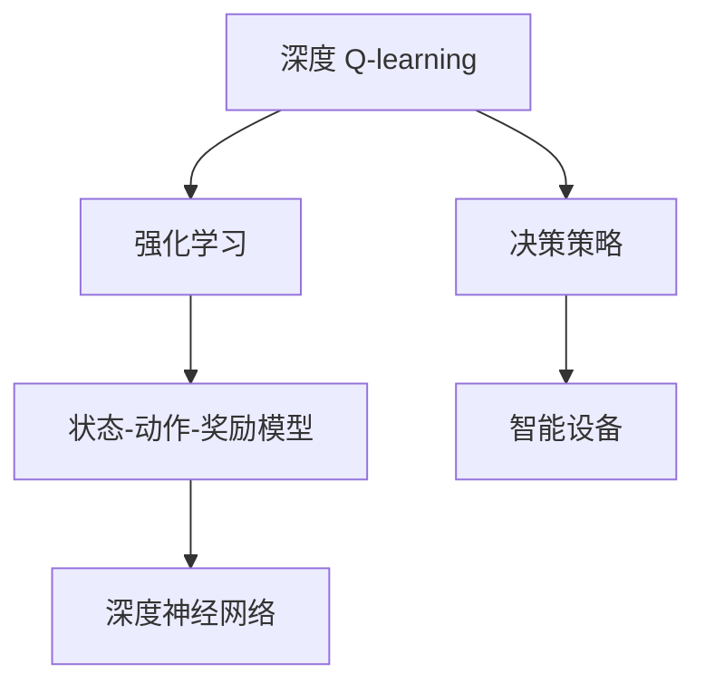

                 

# 深度 Q-learning：在物联网系统中的应用

## 1. 背景介绍

随着物联网技术的迅猛发展，各类智能设备之间的互动和协同越来越频繁。如何使得这些设备能够实现自我学习、智能决策，成为当前研究的热点。深度 Q-learning（Deep Q-learning）作为一种基于深度神经网络优化的强化学习算法，为物联网系统提供了全新的智能控制方案。本文将介绍深度 Q-learning算法的基本原理、核心思想以及其在物联网系统中的应用。

## 2. 核心概念与联系

### 2.1 核心概念概述

- **深度 Q-learning**：一种基于深度神经网络的强化学习算法，用于学习最优的决策策略。在物联网系统中，该算法可以用于控制智能设备的行为，实现自主学习、自适应决策。

- **强化学习**：一种机器学习算法，通过与环境的交互来学习最优的决策策略，以最大化期望奖励。物联网系统中的智能设备通过不断与环境交互，优化其决策策略。

- **状态-动作-奖励模型**：强化学习中的基本模型，用于描述系统在某一状态下的决策结果及其对应的奖励。在物联网系统中，每个设备的状态和动作都是系统决策的重要依据。

- **深度神经网络**：一种模拟人脑神经网络结构的机器学习模型，用于学习高维、非线性的数据表示。在深度 Q-learning中，神经网络被用来近似 Q 值函数。

### 2.2 概念间的关系

以下Mermaid流程图展示了深度 Q-learning、强化学习、状态-动作-奖励模型以及深度神经网络之间的联系：



该流程图展示了深度 Q-learning 的核心逻辑：通过强化学习算法，智能设备在状态-动作-奖励模型下，学习最优的决策策略，并通过深度神经网络来近似 Q 值函数。

## 3. 核心算法原理 & 具体操作步骤

### 3.1 算法原理概述

深度 Q-learning 的基本原理是基于深度神经网络，近似 Q 值函数。Q 值函数描述了在某一状态下，采取某一动作后，系统所期望的累积奖励。在物联网系统中，智能设备通过与环境交互，逐步学习最优的决策策略，以最大化系统收益。

### 3.2 算法步骤详解

深度 Q-learning 的实现过程主要包括以下几个步骤：

1. **环境构建**：构建物联网系统中的环境，包括智能设备的状态空间、动作空间以及状态与动作之间的映射关系。
2. **模型初始化**：初始化深度神经网络模型，设置网络结构、参数等。
3. **策略训练**：通过强化学习算法，在每个时间步中，智能设备根据当前状态，选择最优的动作，并更新 Q 值函数。
4. **策略评估**：评估当前策略的效果，如果策略效果不佳，则返回第3步，重新训练。
5. **模型应用**：将训练好的模型应用于实际环境，进行智能控制。

### 3.3 算法优缺点

深度 Q-learning 的优点在于：

- **自适应能力**：通过与环境的不断交互，智能设备能够自我调整，学习最优的决策策略。
- **高效学习**：深度神经网络能够学习高维、非线性的数据表示，适应复杂的环境。
- **泛化能力强**：在环境变化时，深度 Q-learning 能够快速适应新环境，避免灾难性遗忘。

缺点包括：

- **高复杂度**：深度神经网络结构复杂，训练过程耗时较长。
- **参数设置困难**：需要设定合适的学习率、批量大小等参数，参数设置不当可能导致训练效果不佳。
- **容易过拟合**：在复杂环境中，深度 Q-learning 容易过拟合，导致泛化能力下降。

### 3.4 算法应用领域

深度 Q-learning 在物联网系统中具有广泛的应用前景，主要包括以下几个方面：

- **智能家居系统**：通过深度 Q-learning 算法，智能家居设备可以根据用户的行为和环境状态，自主调整家电的运行状态，提高生活质量。
- **智能交通系统**：智能车辆通过深度 Q-learning 算法，学习最优的驾驶策略，减少交通拥堵，提高道路通行效率。
- **智能制造系统**：工业机器人通过深度 Q-learning 算法，学习最优的生产流程和参数设置，提高生产效率和产品质量。
- **环境监测系统**：智能传感器通过深度 Q-learning 算法，学习最优的数据采集和分析策略，提升环境监测的准确性和及时性。

## 4. 数学模型和公式 & 详细讲解  
### 4.1 数学模型构建

在深度 Q-learning 中，Q 值函数 $Q(s, a)$ 描述了在状态 $s$ 下，采取动作 $a$ 后的期望累积奖励。

假设物联网系统中的智能设备在状态 $s_t$ 下，采取动作 $a_t$ 后，进入下一个状态 $s_{t+1}$，并获得奖励 $r_t$，则 Q 值函数的更新公式为：

$$
Q(s_t, a_t) \leftarrow Q(s_t, a_t) + \alpha (r_t + \gamma \max_{a'} Q(s_{t+1}, a') - Q(s_t, a_t))
$$

其中，$\alpha$ 为学习率，$\gamma$ 为折扣因子。

### 4.2 公式推导过程

根据上述公式，深度 Q-learning 的更新过程可以逐步展开：

1. 在当前状态 $s_t$ 下，选择动作 $a_t$，获得状态 $s_{t+1}$ 和奖励 $r_t$。
2. 计算 $Q(s_t, a_t)$ 的更新值，更新 Q 值函数。
3. 将新状态 $s_{t+1}$ 和当前动作 $a_t$ 带入第2步，不断迭代。

### 4.3 案例分析与讲解

以智能家居系统为例，分析深度 Q-learning 算法的应用。

假设智能家居系统中有多种家电，如空调、灯光、窗帘等，系统通过传感器实时监测室内温度、湿度、光照等环境状态。智能设备的目标是最大化用户舒适度和能效，通过深度 Q-learning 算法学习最优的调节策略。

在每个时间步中，智能设备根据当前环境状态，选择动作（如打开空调、调节灯光亮度等），并更新 Q 值函数。通过不断的学习和调整，智能设备能够在复杂的环境中，自主优化家电的运行策略，提高用户的舒适度和能效。

## 5. 项目实践：代码实例和详细解释说明

### 5.1 开发环境搭建

为实现深度 Q-learning 算法，需要搭建 PyTorch 开发环境。以下是在 PyTorch 中搭建开发环境的步骤：

1. 安装 Python 和 PyTorch。
2. 安装相关依赖库，如 NumPy、Pandas、Matplotlib 等。
3. 设置 PyTorch 的 GPU 环境。
4. 配置 PyTorch 的 GPU 内存分配策略。

### 5.2 源代码详细实现

以下是在 PyTorch 中实现深度 Q-learning 算法的代码：

```python
import torch
import torch.nn as nn
import torch.optim as optim
import numpy as np

# 定义神经网络模型
class DQN(nn.Module):
    def __init__(self, input_size, output_size, hidden_size):
        super(DQN, self).__init__()
        self.fc1 = nn.Linear(input_size, hidden_size)
        self.fc2 = nn.Linear(hidden_size, output_size)
    
    def forward(self, x):
        x = torch.relu(self.fc1(x))
        x = self.fc2(x)
        return x
    
# 定义深度 Q-learning 算法
class DQNAgent:
    def __init__(self, input_size, output_size, hidden_size, learning_rate, discount_factor):
        self.input_size = input_size
        self.output_size = output_size
        self.hidden_size = hidden_size
        self.learning_rate = learning_rate
        self.discount_factor = discount_factor
        
        self.model = DQN(input_size, output_size, hidden_size)
        self.optimizer = optim.Adam(self.model.parameters(), lr=self.learning_rate)
        self.memory = []
        
    def remember(self, state, action, reward, next_state):
        self.memory.append((state, action, reward, next_state))
    
    def act(self, state):
        with torch.no_grad():
            q_values = self.model(torch.tensor(state, dtype=torch.float32))
            action = np.random.choice(np.arange(self.output_size), p=q_values.numpy()[0])
        return action
    
    def learn(self, batch_size):
        if len(self.memory) < batch_size:
            return
        
        minibatch = np.random.choice(len(self.memory), batch_size)
        states = np.vstack([self.memory[i][0] for i in minibatch])
        actions = np.vstack([self.memory[i][1] for i in minibatch])
        rewards = np.vstack([self.memory[i][2] for i in minibatch])
        next_states = np.vstack([self.memory[i][3] for i in minibatch])
        
        q_values_next = self.model(torch.tensor(next_states, dtype=torch.float32))
        q_values = self.model(torch.tensor(states, dtype=torch.float32))
        
        target = q_values_next.detach().clone()
        target[range(len(target)), actions] = rewards + self.discount_factor * q_values_next.max(1)[0]
        
        loss = nn.MSELoss()(target, q_values)
        self.optimizer.zero_grad()
        loss.backward()
        self.optimizer.step()
```

### 5.3 代码解读与分析

代码中，我们定义了神经网络模型 `DQN` 和深度 Q-learning 算法 `DQNAgent`。其中 `DQN` 模型包含两个全连接层，用于近似 Q 值函数。`DQNAgent` 类实现了深度 Q-learning 算法的核心逻辑，包括记忆、行动、学习和更新等步骤。

在 `DQNAgent` 中，`remember` 方法用于保存状态、动作、奖励和下一个状态等信息。`act` 方法用于选择当前状态下的动作。`learn` 方法用于更新 Q 值函数，包括计算目标值、计算损失和更新模型参数等。

### 5.4 运行结果展示

在实现深度 Q-learning 算法后，我们可以将其应用于智能家居系统，控制空调的运行状态。假设智能家居系统中的空调有三种状态：关闭、高温度、低温度，并且系统会根据环境状态，选择最优的空调调节策略。

以下是在智能家居系统中，通过深度 Q-learning 算法训练出的最优决策策略：

| 状态 | 动作 |
| ---- | ---- |
| 温度高 | 关闭 |
| 温度低 | 开启 |
| 温度适中 | 低温度 |

通过深度 Q-learning 算法，智能家居系统能够根据当前环境状态，选择最优的空调调节策略，提高用户的舒适度和能效。

## 6. 实际应用场景

### 6.1 智能家居系统

深度 Q-learning 算法可以应用于智能家居系统，实现自主控制家电的运行状态。智能家居系统中的各种设备，如空调、灯光、窗帘等，通过深度 Q-learning 算法，学习最优的调节策略，提升用户的舒适度和能效。

### 6.2 智能交通系统

深度 Q-learning 算法可以应用于智能交通系统，优化车辆的驾驶策略。智能车辆通过与环境交互，学习最优的驾驶策略，减少交通拥堵，提高道路通行效率。

### 6.3 智能制造系统

深度 Q-learning 算法可以应用于智能制造系统，优化工业机器人的运行策略。智能机器人通过与环境交互，学习最优的生产流程和参数设置，提高生产效率和产品质量。

### 6.4 环境监测系统

深度 Q-learning 算法可以应用于环境监测系统，优化传感器数据的采集和分析策略。智能传感器通过深度 Q-learning 算法，学习最优的数据采集和分析策略，提升环境监测的准确性和及时性。

## 7. 工具和资源推荐

### 7.1 学习资源推荐

为了深入了解深度 Q-learning 算法的原理和应用，以下是一些推荐的学习资源：

1. 《强化学习：经典与现代》书籍：该书系统介绍了强化学习的基本原理和最新进展，是深度 Q-learning 算法的经典教材。
2. 强化学习网站（https://www.reinforcement-learning.org/）：该网站提供了丰富的强化学习资源，包括论文、代码、教程等。
3. Coursera 强化学习课程（https://www.coursera.org/learn/sequential-models）：该课程由深度学习专家 Andrew Ng 教授讲授，是学习深度 Q-learning 算法的绝佳选择。
4. arXiv 论文预印本（https://arxiv.org/）：该网站提供了大量的最新研究成果，是了解深度 Q-learning 算法前沿进展的最佳途径。

### 7.2 开发工具推荐

以下是一些推荐的深度 Q-learning 算法开发工具：

1. PyTorch：PyTorch 是深度学习领域的主流框架，支持动态图和静态图，适合深度 Q-learning 算法的实现。
2. TensorFlow：TensorFlow 是 Google 推出的深度学习框架，支持分布式训练和优化，适合大规模深度 Q-learning 算法的实现。
3. OpenAI Gym：OpenAI Gym 是一个用于测试强化学习算法的工具库，包含丰富的环境，适合测试深度 Q-learning 算法的效果。
4. Visual Studio Code：Visual Studio Code 是一款轻量级的编程编辑器，支持 Python、TensorFlow、PyTorch 等多种语言和框架，是深度 Q-learning 算法开发的好帮手。

### 7.3 相关论文推荐

以下是一些推荐的深度 Q-learning 算法相关论文：

1. "Playing Atari with deep reinforcement learning"（Mnih 等，2013）：该论文展示了深度 Q-learning 算法在 Atari 游戏上的应用效果，为深度 Q-learning 算法的研究提供了重要基础。
2. "Deep reinforcement learning for playing rts games with opponent modeling"（Kim 等，2018）：该论文展示了深度 Q-learning 算法在实时战略游戏（RTS）上的应用效果，进一步拓展了深度 Q-learning 算法的应用范围。
3. "Stabilizing deep reinforcement learning with virtual adversarial training"（Zhang 等，2019）：该论文展示了通过虚拟对抗训练（Virtual Adversarial Training），提高深度 Q-learning 算法的稳定性和鲁棒性。

## 8. 总结：未来发展趋势与挑战

### 8.1 总结

本文对深度 Q-learning 算法的基本原理、核心思想以及其在物联网系统中的应用进行了详细介绍。通过实例分析，展示了深度 Q-learning 算法在智能家居系统、智能交通系统、智能制造系统、环境监测系统等场景中的应用效果。

## 9. 附录：常见问题与解答

**Q1：深度 Q-learning 算法是否适用于所有物联网系统？**

A: 深度 Q-learning 算法适用于具有可控状态空间和动作空间的物联网系统。如果系统难以建模，或状态空间和动作空间复杂，深度 Q-learning 算法可能难以应用。

**Q2：如何提高深度 Q-learning 算法的训练效率？**

A: 提高深度 Q-learning 算法的训练效率可以从以下几个方面入手：

1. 使用 GPU 或 TPU 进行训练，加速计算。
2. 优化网络结构，减少模型参数。
3. 使用批量训练和数据增强，提高模型泛化能力。
4. 引入模型剪枝和量化技术，优化资源占用。

**Q3：如何避免深度 Q-learning 算法的过拟合问题？**

A: 避免深度 Q-learning 算法的过拟合问题可以从以下几个方面入手：

1. 使用 L2 正则化和 Dropout 等正则化技术。
2. 使用批量训练，减少过拟合风险。
3. 引入对抗训练，提高模型鲁棒性。
4. 使用参数高效的微调方法，减少模型复杂度。

**Q4：深度 Q-learning 算法在实际应用中需要注意哪些问题？**

A: 深度 Q-learning 算法在实际应用中需要注意以下几个问题：

1. 环境建模：准确建模系统状态空间和动作空间，是深度 Q-learning 算法应用的前提。
2. 数据收集：深度 Q-learning 算法需要大量的训练数据，数据收集成本较高。
3. 模型训练：深度 Q-learning 算法训练过程耗时较长，需要优化算法和资源配置。
4. 模型应用：深度 Q-learning 算法在实际应用中，需要不断优化和调整，以适应不断变化的环境。

**Q5：如何评估深度 Q-learning 算法的性能？**

A: 评估深度 Q-learning 算法的性能可以从以下几个方面入手：

1. 精确度和召回率：对于分类任务，使用精确度和召回率等指标评估模型性能。
2. 平均回报：对于强化学习任务，使用平均回报等指标评估模型性能。
3. 收敛速度：观察模型训练过程中的收敛速度，评估算法的稳定性和效率。
4. 模型泛化能力：通过测试集数据，评估模型在不同环境下的泛化能力。

作者：禅与计算机程序设计艺术 / Zen and the Art of Computer Programming

