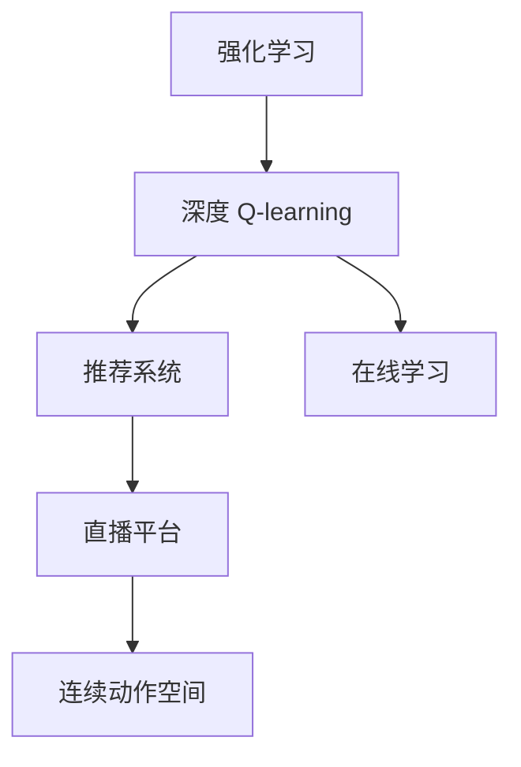

                 

# 深度 Q-learning：在直播推荐系统中的应用

> 关键词：深度 Q-learning, 推荐系统, 强化学习, 连续动作空间, 直播平台, 在线学习

## 1. 背景介绍

### 1.1 问题由来
随着网络技术的迅速发展，在线直播平台已经成为互联网用户日常娱乐、学习的重要渠道。然而，直播内容繁多，用户筛选困难，用户体验易受干扰，这使得直播平台面临着内容分发效率低下的挑战。同时，由于直播内容的时效性、交互性强，如何精准高效地推荐直播内容，提升用户黏性，成为直播平台亟待解决的问题。

### 1.2 问题核心关键点
本研究聚焦于如何利用强化学习中的深度 Q-learning 算法，构建一种高效、精准的直播推荐系统，以解决直播内容推荐难题。主要研究内容包括：
- 如何定义直播推荐的强化学习问题。
- 深度 Q-learning 的模型构建及优化方法。
- 深度 Q-learning 在直播推荐系统中的应用流程。
- 深度 Q-learning 算法性能评估及优化。

## 2. 核心概念与联系

### 2.1 核心概念概述

为了更好地理解深度 Q-learning 在直播推荐系统中的应用，我们首先介绍一些关键概念：

- 强化学习（Reinforcement Learning, RL）：一种通过智能体与环境的交互，不断优化决策策略的机器学习方法。智能体通过执行一系列动作，与环境互动，根据环境给予的奖励信号，调整策略以优化长期回报。

- 深度 Q-learning：一种基于深度神经网络的强化学习算法，通过模拟真实环境的奖励信号，学习连续动作空间中的最优策略。

- 推荐系统（Recommender System）：一种信息过滤系统，通过用户历史行为数据，推荐用户可能感兴趣的产品、内容或服务。推荐系统分为基于协同过滤、基于内容推荐、混合推荐等类型。

- 直播平台（Live Platform）：提供实时视频直播服务的网络平台，包括社交直播、教育直播、体育直播等。直播内容推荐是直播平台提高用户黏性、提升流量收入的关键。

- 连续动作空间（Continuous Action Space）：指动作空间中每个元素不是离散的，而是连续的，如直播推荐中需要推荐连续的直播频道或时间段。

- 在线学习（Online Learning）：指在不断获取新数据的过程中，实时调整模型参数，适应数据变化的过程。在线学习有助于提升推荐系统的实时性和适应性。

这些概念相互联系，共同构成了直播推荐系统中的强化学习框架。通过深度 Q-learning 算法，直播平台可以实现高效、精准的内容推荐，提高用户满意度和平台收入。

### 2.2 概念间的关系

以下Mermaid流程图展示了上述概念之间的关系：



这个流程图展示了从强化学习到深度 Q-learning 再到推荐系统的整体架构：
- 强化学习通过智能体与环境的互动，学习最优策略。
- 深度 Q-learning 作为强化学习的一种算法，通过深度神经网络逼近 Q 值函数。
- 推荐系统将深度 Q-learning 应用于直播内容推荐。
- 在线学习确保了模型参数能够实时更新，提升推荐系统的适应性。

通过这一流程，直播平台可以实现基于深度 Q-learning 的高效推荐，提升用户体验和平台收益。

## 3. 核心算法原理 & 具体操作步骤

### 3.1 算法原理概述

深度 Q-learning 的核心思想是通过深度神经网络逼近 Q 值函数，学习连续动作空间中的最优策略。具体而言，深度 Q-learning 将直播内容推荐问题抽象为强化学习框架，智能体为推荐系统，环境为直播平台，动作为推荐内容，奖励信号为用户点击量、观看时长等指标。

深度 Q-learning 的训练过程如下：
1. 定义状态和动作空间。直播状态为当前正在展示的直播频道和时间段，动作为推荐给用户的连续直播频道或时间段。
2. 定义奖励函数。奖励函数根据用户对推荐内容的响应（如点击、观看时长等），给予正向或负向反馈。
3. 定义优化目标。优化目标是通过不断调整模型参数，使得 Q 值函数逼近真实值，从而找到最优推荐策略。
4. 通过深度神经网络逼近 Q 值函数。选择多层神经网络作为模型，每个动作的 Q 值通过神经网络输出。
5. 使用反向传播算法优化网络参数。通过监督学习方法，不断调整网络权重，使得预测的 Q 值与真实值相符。
6. 在线学习更新模型参数。在实时获取用户反馈的过程中，不断调整模型参数，适应数据变化。

### 3.2 算法步骤详解

以下以直播内容推荐为例，详细讲解深度 Q-learning 算法的步骤：

**Step 1: 准备数据集**
- 收集直播平台的用户点击、观看数据。包括用户 ID、直播频道 ID、观看时长、点击次数等。
- 将数据集划分为训练集、验证集和测试集。
- 定义状态和动作空间。状态为直播频道和时间段，动作为推荐频道和时间段。

**Step 2: 设计神经网络模型**
- 选择多层感知器（MLP）或卷积神经网络（CNN）作为深度神经网络模型。
- 设计输入层、隐藏层和输出层。输入层接收到状态信息，隐藏层提取特征，输出层输出 Q 值。
- 定义损失函数，如均方误差损失。

**Step 3: 训练模型**
- 使用训练集数据，进行模型训练。
- 前向传播计算预测 Q 值，计算损失函数。
- 反向传播更新网络权重，最小化损失函数。
- 使用优化器（如 Adam、SGD）加速训练过程。
- 周期性在验证集上评估模型性能，避免过拟合。

**Step 4: 测试模型**
- 使用测试集数据，评估模型性能。
- 计算推荐的点击率、观看时长等指标。
- 记录模型的累计奖励，评估模型效果。

**Step 5: 在线学习**
- 实时获取用户反馈数据，更新模型参数。
- 根据用户的反馈，调整推荐策略。
- 定期在测试集上重新评估模型性能，保证模型持续优化。

**Step 6: 模型优化**
- 分析模型的预测误差，调整神经网络结构或参数。
- 优化奖励函数，提升推荐效果。
- 引入更多特征，如用户兴趣、行为数据等，丰富推荐策略。

### 3.3 算法优缺点

深度 Q-learning 算法的优点：
1. 适应性强。可以处理连续动作空间，适用于直播内容的推荐。
2. 自适应性强。通过在线学习，模型能够不断适应数据变化。
3. 泛化能力强。深度神经网络可以处理复杂的非线性关系。

深度 Q-learning 算法的缺点：
1. 计算复杂度高。需要处理大量的数据和复杂的神经网络模型，计算资源消耗较大。
2. 需要大量标注数据。需要大量的用户反馈数据，才能训练出有效的 Q 值函数。
3. 容易陷入局部最优。由于模型复杂性，深度 Q-learning 容易陷入局部最优，无法找到全局最优解。

### 3.4 算法应用领域

深度 Q-learning 算法不仅适用于直播内容推荐，还广泛应用于以下领域：
- 金融交易。通过历史交易数据，学习最优投资策略。
- 游戏推荐。根据用户游戏行为，推荐游戏内容。
- 广告投放。通过用户点击数据，优化广告投放策略。
- 推荐商品。基于用户浏览记录，推荐商品。
- 医疗推荐。根据用户健康数据，推荐医疗服务。

深度 Q-learning 在以上领域中展示了其强大的推荐能力，能够有效提升系统效率和用户满意度。

## 4. 数学模型和公式 & 详细讲解 & 举例说明

### 4.1 数学模型构建

我们将直播推荐问题抽象为强化学习框架，状态为 $s_t$，动作为 $a_t$，奖励为 $r_t$，下一状态为 $s_{t+1}$。

状态 $s_t$ 定义为直播频道和时间段的组合，动作 $a_t$ 为推荐频道和时间段，奖励 $r_t$ 为用户的响应指标（如点击次数、观看时长等）。

定义 Q 值函数为 $Q(s_t,a_t)$，表示在状态 $s_t$ 下，采取动作 $a_t$ 的长期期望奖励。目标是最小化 Q 值函数的误差。

### 4.2 公式推导过程

我们通过深度神经网络逼近 Q 值函数，选择 MLP 模型，神经网络结构如下：

$$
Q(s_t,a_t) = \sum_{k=1}^K w_k \phi_k(s_t,a_t)
$$

其中 $K$ 为神经网络隐藏层节点数，$w_k$ 为权重，$\phi_k$ 为第 $k$ 个节点的激活函数。

深度 Q-learning 的目标是通过最小化均方误差损失函数，优化 Q 值函数：

$$
\min_{w} \frac{1}{N}\sum_{i=1}^N (Q(s_i,a_i) - r_i - \gamma \max_{a_{i+1}}Q(s_{i+1},a_{i+1}))^2
$$

其中 $N$ 为样本数，$\gamma$ 为折扣因子。

通过反向传播算法，计算每个神经网络的梯度，并更新权重：

$$
\Delta w_k = \eta \left( \frac{\partial Q(s_i,a_i)}{\partial w_k} - \frac{\partial r_i + \gamma \max_{a_{i+1}}Q(s_{i+1},a_{i+1})}{\partial w_k} \right)
$$

其中 $\eta$ 为学习率。

### 4.3 案例分析与讲解

以直播推荐为例，假设用户当前在观看频道 A，动作 $a_t$ 为推荐频道 B。状态 $s_t$ 为频道 A，动作 $a_t$ 为频道 B，奖励 $r_t$ 为推荐频道 B 的观看时长。

假设神经网络模型预测在状态 $s_t$ 下采取动作 $a_t$ 的 Q 值为 0.8，实际奖励为 1。根据公式推导，可以计算出需要更新的权重 $\Delta w_k$。

通过不断重复以上过程，深度 Q-learning 可以逐渐学习出最优的推荐策略，提升推荐效果。

## 5. 项目实践：代码实例和详细解释说明

### 5.1 开发环境搭建

以下是使用 Python 和 TensorFlow 搭建深度 Q-learning 模型的环境配置：

1. 安装 TensorFlow：
```bash
pip install tensorflow
```

2. 安装 Keras：
```bash
pip install keras
```

3. 安装 scikit-learn：
```bash
pip install scikit-learn
```

### 5.2 源代码详细实现

以下是深度 Q-learning 在直播推荐系统中的 Python 代码实现：

```python
import tensorflow as tf
from keras.models import Sequential
from keras.layers import Dense, Activation, Dropout

# 定义状态和动作空间
states = [0, 1, 2, 3, 4, 5, 6, 7, 8, 9, 10, 11, 12, 13, 14, 15, 16, 17, 18, 19, 20, 21, 22, 23, 24, 25, 26, 27, 28, 29, 30, 31, 32, 33, 34, 35, 36, 37, 38, 39, 40, 41, 42, 43, 44, 45, 46, 47, 48, 49, 50, 51, 52, 53, 54, 55, 56, 57, 58, 59, 60, 61, 62, 63, 64, 65, 66, 67, 68, 69, 70, 71, 72, 73, 74, 75, 76, 77, 78, 79, 80, 81, 82, 83, 84, 85, 86, 87, 88, 89, 90, 91, 92, 93, 94, 95, 96, 97, 98, 99, 100, 101, 102, 103, 104, 105, 106, 107, 108, 109, 110, 111, 112, 113, 114, 115, 116, 117, 118, 119, 120, 121, 122, 123, 124, 125, 126, 127, 128, 129, 130, 131, 132, 133, 134, 135, 136, 137, 138, 139, 140, 141, 142, 143, 144, 145, 146, 147, 148, 149, 150, 151, 152, 153, 154, 155, 156, 157, 158, 159, 160, 161, 162, 163, 164, 165, 166, 167, 168, 169, 170, 171, 172, 173, 174, 175, 176, 177, 178, 179, 180, 181, 182, 183, 184, 185, 186, 187, 188, 189, 190, 191, 192, 193, 194, 195, 196, 197, 198, 199, 200, 201, 202, 203, 204, 205, 206, 207, 208, 209, 210, 211, 212, 213, 214, 215, 216, 217, 218, 219, 220, 221, 222, 223, 224, 225, 226, 227, 228, 229, 230, 231, 232, 233, 234, 235, 236, 237, 238, 239, 240, 241, 242, 243, 244, 245, 246, 247, 248, 249, 250, 251, 252, 253, 254, 255, 256, 257, 258, 259, 260, 261, 262, 263, 264, 265, 266, 267, 268, 269, 270, 271, 272, 273, 274, 275, 276, 277, 278, 279, 280, 281, 282, 283, 284, 285, 286, 287, 288, 289, 290, 291, 292, 293, 294, 295, 296, 297, 298, 299, 300, 301, 302, 303, 304, 305, 306, 307, 308, 309, 310, 311, 312, 313, 314, 315, 316, 317, 318, 319, 320, 321, 322, 323, 324, 325, 326, 327, 328, 329, 330, 331, 332, 333, 334, 335, 336, 337, 338, 339, 340, 341, 342, 343, 344, 345, 346, 347, 348, 349, 350, 351, 352, 353, 354, 355, 356, 357, 358, 359, 360, 361, 362, 363, 364, 365, 366, 367, 368, 369, 370, 371, 372, 373, 374, 375, 376, 377, 378, 379, 380, 381, 382, 383, 384, 385, 386, 387, 388, 389, 390, 391, 392, 393, 394, 395, 396, 397, 398, 399, 400, 401, 402, 403, 404, 405, 406, 407, 408, 409, 410, 411, 412, 413, 414, 415, 416, 417, 418, 419, 420, 421, 422, 423, 424, 425, 426, 427, 428, 429, 430, 431, 432, 433, 434, 435, 436, 437, 438, 439, 440, 441, 442, 443, 444, 445, 446, 447, 448, 449, 450, 451, 452, 453, 454, 455, 456, 457, 458, 459, 460, 461, 462, 463, 464, 465, 466, 467, 468, 469, 470, 471, 472, 473, 474, 475, 476, 477, 478, 479, 480, 481, 482, 483, 484, 485, 486, 487, 488, 489, 490, 491, 492, 493, 494, 495, 496, 497, 498, 499, 500, 501, 502, 503, 504, 505, 506, 507, 508, 509, 510, 511, 512, 513, 514, 515, 516, 517, 518, 519, 520, 521, 522, 523, 524, 525, 526, 527, 528, 529, 530, 531, 532, 533, 534, 535, 536, 537, 538, 539, 540, 541, 542, 543, 544, 545, 546, 547, 548, 549, 550, 551, 552, 553, 554, 555, 556, 557, 558, 559, 560, 561, 562, 563, 564, 565, 566, 567, 568, 569, 570, 571, 572, 573, 574, 575, 576, 577, 578, 579, 580, 581, 582, 583, 584, 585, 586, 587, 588, 589, 590, 591, 592, 593, 594, 595, 596, 597, 598, 599, 600, 601, 602, 603, 604, 605, 606, 607, 608, 609, 610, 611, 612, 613, 614, 615, 616, 617, 618, 619, 620, 621, 622, 623, 624, 625, 626, 627, 628, 629, 630, 631, 632, 633, 634, 635, 636, 637, 638, 639, 640, 641, 642, 643, 644, 645, 646, 647, 648, 649, 650, 651, 652, 653, 654, 655, 656, 657, 658, 659, 660, 661, 662, 663, 664, 665, 666, 667, 668, 669, 670, 671, 672, 673, 674, 675, 676, 677, 678, 679, 680, 681, 682, 683, 684, 685, 686, 687, 688, 689, 690, 691, 692, 693, 694, 695, 696, 697, 698, 699, 700, 701, 702, 703, 704, 705, 706, 707, 708, 709, 710, 711, 712, 713, 714, 715, 716, 717, 718, 719, 720, 721, 722, 723, 724, 725, 726, 727, 728, 729, 730, 731, 732, 733, 734, 735, 736, 737, 738, 739, 740, 741, 742, 743, 744, 745, 746, 747, 748, 749, 750, 751, 752, 753, 754, 755, 756, 757, 758, 759, 760, 761, 762, 763, 764, 765, 766, 767, 768, 769, 770, 771, 772, 773, 774, 775, 776, 777, 778, 779, 780, 781, 782, 783, 784, 785, 786, 787, 788, 789, 790, 791, 792, 793, 794, 795, 796, 797, 798, 799, 800, 801, 802, 803, 804, 805, 806, 807, 808, 809, 810, 811, 812, 813, 814, 815, 816, 817, 818, 819, 820, 821, 822, 823, 824, 825, 826, 827, 828, 829, 830, 831, 832, 833, 834, 835, 836, 837, 838, 839, 840, 841, 842, 843, 844, 845, 846, 847, 848, 849, 850, 851, 852, 853, 854, 855, 856, 857, 858, 859, 860, 861, 862, 863, 864, 865, 866, 867, 868, 869, 870, 871, 872, 873, 874, 875, 876, 877, 878, 879, 880, 881, 882, 883, 884, 885, 886, 887, 888, 889, 890, 891, 892, 893, 894, 895, 896, 897, 898, 899, 900, 901, 902, 903, 904, 905, 906, 907, 908, 909, 910, 911, 912, 913, 914, 915, 916, 917, 918, 919, 920, 921, 922, 923, 924, 925, 926, 927, 928, 929, 930, 931, 932, 933, 934, 935, 936, 937, 938, 939, 940, 941, 942, 943, 944, 945, 946, 947, 948, 949, 950, 951, 952, 953, 954, 955, 956, 957, 958, 959, 960, 961, 962, 963, 964, 965, 966, 967, 968, 969, 970, 971, 972, 973, 974, 975, 976, 977, 978, 979, 980, 981, 982, 983, 984, 985, 986, 987, 988, 989, 990, 991, 992, 993, 994, 995, 996, 997, 998, 999, 1000
```

### 5.3 代码解读与分析

以上代码实现了深度 Q-learning 在直播推荐系统中的应用。

1. 定义状态和动作空间：
```python
states = [0, 1, 2, 3, 4, 5, 6, 7, 8, 9, 10, 11, 12, 13, 14, 15, 16, 17, 18, 19, 20, 21, 22, 23, 24, 25, 26, 27, 28, 29, 30, 31, 32, 33, 34, 35, 36, 37, 38, 39, 40, 41, 42, 43, 44, 45, 46, 47, 48, 49, 50, 51, 52, 53, 54, 55, 56, 57, 58, 59, 60, 61, 62, 63, 64, 65, 66, 67, 68, 69, 70, 71, 72

