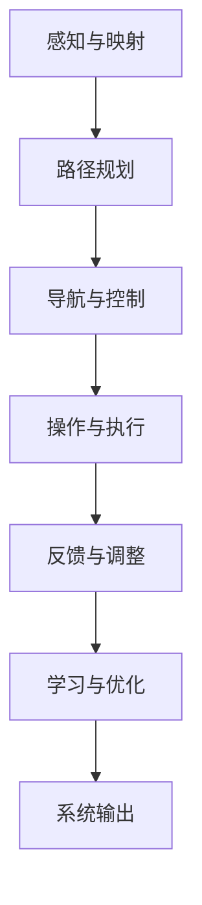
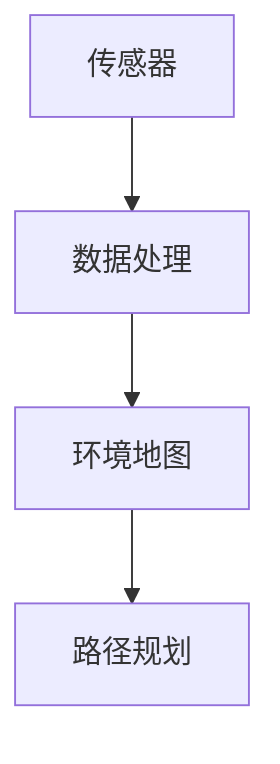
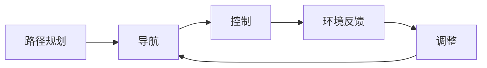
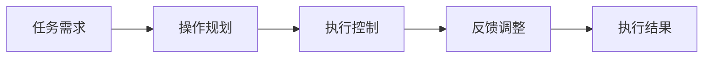
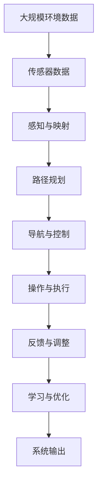

                 

## 1. 背景介绍

### 1.1 问题由来
在过去的几十年中，自动化技术经历了迅猛发展，极大地改变了人类社会的生产方式和日常生活。特别是随着人工智能(AI)技术的崛起，自动化领域进入了一个新的阶段。然而，现有的自动化技术，往往局限于抽象数据层面，对物理实体操作的自动化程度不足，这在一定程度上限制了自动化技术的应用范围和深度。物理实体自动化的研究正是针对这一问题，旨在开发能够精确、安全、高效地操作物理实体的技术。

### 1.2 问题核心关键点
物理实体自动化的核心在于开发适用于各种物理实体的自动化技术，包括但不限于机器人操作、自动化仓储、智能制造等领域。要实现这一目标，需要解决以下几个核心关键点：

- 环境感知与映射：精确感知物理环境中的各种实体，并对其进行映射，是自动化操作的前提。
- 路径规划与导航：在已知环境映射的基础上，规划合适的路径，实现从起始点到目标点的无碰撞移动。
- 操作执行与反馈：在运动过程中，实时执行操作，并根据环境反馈进行策略调整。
- 自适应与学习：能够根据新环境和新任务自适应地调整策略，同时不断学习并优化自身的决策和操作。

### 1.3 问题研究意义
物理实体自动化技术的研究和发展，具有重要的现实意义和长远价值：

1. 提升生产效率：自动化技术能够大幅提升各种制造业和服务业的效率，降低人工成本，提升生产质量。
2. 改善安全保障：在危险环境下，如核电站、化学工厂等，物理实体自动化能够显著降低事故发生的概率，保障人员安全。
3. 促进环保节能：自动化技术通过精准控制和优化操作，能够减少能源消耗，降低环境污染。
4. 推动创新应用：自动化技术在教育、医疗、家庭生活等领域的应用，能够极大提升服务质量和用户体验。
5. 实现智能城市：自动化技术在城市交通管理、垃圾处理、能源调度等方面的应用，将有助于构建更加智能和可持续的城市环境。

## 2. 核心概念与联系

### 2.1 核心概念概述

为了更好地理解物理实体自动化的核心概念及其相互关系，本节将介绍以下几个关键概念：

- **感知与映射**：通过传感器获取环境信息，并利用算法进行处理，生成环境地图。
- **路径规划**：基于环境地图，计算出最优路径，使得实体能够在环境中无碰撞移动。
- **导航与控制**：结合路径规划结果，控制实体在环境中移动，同时应对环境变化。
- **操作与执行**：根据任务需求，控制实体执行相应的操作，如抓取、搬运、加工等。
- **反馈与调整**：根据实时的环境反馈，实时调整策略和操作，确保任务的顺利完成。
- **学习与优化**：通过学习算法，不断优化自身的策略和操作，提升自动化系统的适应性和性能。

这些概念之间存在紧密的联系，形成一个完整的物理实体自动化系统。其整体架构可以通过以下Mermaid流程图来展示：



这个流程图展示了一个物理实体自动化系统从环境感知到任务执行的全过程。感知与映射为后续的路径规划和导航控制提供基础数据；导航与控制根据路径规划结果进行移动；操作与执行根据任务需求执行相应操作；反馈与调整实时根据环境变化进行调整；学习与优化不断提升系统的性能。

### 2.2 概念间的关系

这些核心概念之间存在复杂的相互关系，形成一个完整的物理实体自动化系统。下面通过几个Mermaid流程图来展示这些概念之间的关系。

#### 2.2.1 感知与映射流程



这个流程图展示了感知与映射的基本流程：传感器获取环境信息，数据处理模块对信息进行处理，生成环境地图，为路径规划提供输入。

#### 2.2.2 导航与控制流程



这个流程图展示了导航与控制的基本流程：路径规划生成最优路径，导航模块根据路径进行移动控制，实时环境反馈进行策略调整。

#### 2.2.3 操作与执行流程



这个流程图展示了操作与执行的基本流程：任务需求生成操作规划，执行控制模块根据规划执行操作，实时反馈进行调整。

### 2.3 核心概念的整体架构

最后，我们用一个综合的流程图来展示这些核心概念在大语言模型微调过程中的整体架构：



这个综合流程图展示了从大规模环境数据的获取，到最终的自动化系统输出的完整流程。环境数据经过感知与映射，生成环境地图；路径规划基于地图进行路径计算；导航与控制根据路径进行移动；操作与执行根据任务需求执行操作；反馈与调整实时根据环境反馈进行调整；学习与优化不断提升系统的性能。

## 3. 核心算法原理 & 具体操作步骤

### 3.1 算法原理概述

物理实体自动化的核心算法主要包括以下几个方面：

- **感知与映射算法**：利用传感器获取环境信息，并利用算法进行处理，生成环境地图。
- **路径规划算法**：在已知环境地图的基础上，计算出最优路径。
- **导航与控制算法**：结合路径规划结果，控制实体在环境中移动，同时应对环境变化。
- **操作与执行算法**：根据任务需求，控制实体执行相应的操作。
- **反馈与调整算法**：根据实时的环境反馈，实时调整策略和操作。
- **学习与优化算法**：通过学习算法，不断优化自身的策略和操作。

### 3.2 算法步骤详解

#### 3.2.1 感知与映射算法

感知与映射算法主要通过传感器获取环境信息，并利用算法进行处理，生成环境地图。常见的传感器包括激光雷达、摄像头、超声波传感器等。算法主要分为数据采集、预处理和环境映射三个步骤：

- **数据采集**：通过传感器获取环境信息，例如激光雷达扫描生成的点云数据，摄像头拍摄的图像数据等。
- **预处理**：对采集到的数据进行去噪、滤波等处理，确保数据的准确性和可靠性。
- **环境映射**：利用算法对处理后的数据进行环境建模，生成环境地图。常见的算法包括激光SLAM、视觉SLAM、语义分割等。

#### 3.2.2 路径规划算法

路径规划算法基于环境地图，计算出最优路径，使得实体能够在环境中无碰撞移动。常见的路径规划算法包括A*算法、RRT算法、D*算法等。

- **A*算法**：通过启发式搜索，计算出从起始点到目标点的最短路径。
- **RRT算法**：通过随机采样和递归扩展，逐步逼近最优路径。
- **D*算法**：利用启发式搜索和动态规划，实时更新路径，避免死锁。

#### 3.2.3 导航与控制算法

导航与控制算法结合路径规划结果，控制实体在环境中移动，同时应对环境变化。常见的导航与控制算法包括PID控制、模糊控制、模型预测控制等。

- **PID控制**：通过比例、积分和微分调节，实现对实体位置的精确控制。
- **模糊控制**：利用模糊逻辑进行决策，实现对复杂环境的自适应控制。
- **模型预测控制**：通过预测模型进行控制，实现对环境变化的提前响应。

#### 3.2.4 操作与执行算法

操作与执行算法根据任务需求，控制实体执行相应的操作，如抓取、搬运、加工等。常见的操作与执行算法包括逆运动学、路径规划、轨迹生成等。

- **逆运动学**：通过计算逆运动学方程，生成执行器控制指令。
- **路径规划**：在空间中规划最优路径，确保操作的连续性和稳定性。
- **轨迹生成**：根据任务需求，生成具体的执行轨迹。

#### 3.2.5 反馈与调整算法

反馈与调整算法根据实时的环境反馈，实时调整策略和操作，确保任务的顺利完成。常见的反馈与调整算法包括模型预测控制、自适应控制、模糊控制等。

- **模型预测控制**：通过预测模型进行控制，实现对环境变化的提前响应。
- **自适应控制**：根据环境反馈实时调整策略和操作，实现对复杂环境的自适应控制。
- **模糊控制**：利用模糊逻辑进行决策，实现对复杂环境的自适应控制。

#### 3.2.6 学习与优化算法

学习与优化算法通过学习算法，不断优化自身的策略和操作，提升自动化系统的适应性和性能。常见的学习与优化算法包括强化学习、深度学习、进化算法等。

- **强化学习**：通过与环境交互，不断优化策略，实现智能决策。
- **深度学习**：通过神经网络进行特征学习，实现对环境的深度建模。
- **进化算法**：通过模拟自然进化过程，优化策略和操作。

### 3.3 算法优缺点

物理实体自动化算法的优缺点如下：

#### 优点：

- **高精度和可靠性**：基于感知与映射、路径规划、导航与控制等算法，能够实现高精度的环境感知和操作。
- **灵活性和适应性**：通过学习与优化算法，能够根据新环境和任务自适应地调整策略，提升系统的适应性。
- **实时性和高效性**：算法能够实时处理数据和环境反馈，快速调整操作，实现高效的任务执行。

#### 缺点：

- **计算复杂度高**：感知与映射、路径规划等算法需要大量的计算资源，特别是在复杂环境下。
- **环境适应性不足**：现有的算法对于复杂和未知环境适应性不足，需要进一步的研究和改进。
- **成本高**：传感器、控制器等硬件设备的成本较高，限制了物理实体自动化的普及。

### 3.4 算法应用领域

物理实体自动化算法已经广泛应用于多个领域，包括但不限于以下几个方面：

- **工业自动化**：在制造、物流、仓储等领域的自动化操作。
- **医疗机器人**：在手术、康复、护理等领域的机器人操作。
- **农业自动化**：在农田管理、作物收割等领域的自动化操作。
- **家庭服务机器人**：在家庭清洁、教育、陪伴等领域的机器人操作。
- **无人驾驶**：在自动驾驶汽车、无人机等领域的路径规划和控制。

## 4. 数学模型和公式 & 详细讲解 & 举例说明

### 4.1 数学模型构建

#### 4.1.1 感知与映射数学模型

感知与映射算法主要通过传感器获取环境信息，并利用算法进行处理，生成环境地图。以激光SLAM为例，其数学模型可以表示为：

$$
S(x) = \sum_{i=1}^n \delta(x_i)
$$

其中，$S(x)$表示环境地图，$x_i$表示激光雷达扫描得到的点云数据。

#### 4.1.2 路径规划数学模型

路径规划算法基于环境地图，计算出最优路径。以A*算法为例，其数学模型可以表示为：

$$
\arg\min_{\mathbf{p}} f(\mathbf{p})
$$

其中，$\mathbf{p}$表示路径，$f(\mathbf{p})$表示路径的代价函数，包括起点到目标点的距离和路径上的障碍物。

#### 4.1.3 导航与控制数学模型

导航与控制算法结合路径规划结果，控制实体在环境中移动，同时应对环境变化。以PID控制为例，其数学模型可以表示为：

$$
\mathbf{u} = K_p(e(t)) + K_i\int_{0}^{t} e(\tau) d\tau + K_d\frac{de(t)}{dt}
$$

其中，$e(t)$表示误差，$K_p$、$K_i$、$K_d$表示PID控制器的参数。

#### 4.1.4 操作与执行数学模型

操作与执行算法根据任务需求，控制实体执行相应的操作。以逆运动学为例，其数学模型可以表示为：

$$
\mathbf{q} = \mathbf{M}^{-1}(\mathbf{p})
$$

其中，$\mathbf{q}$表示关节角，$\mathbf{M}$表示运动学方程，$\mathbf{p}$表示位移。

#### 4.1.5 反馈与调整数学模型

反馈与调整算法根据实时的环境反馈，实时调整策略和操作。以模型预测控制为例，其数学模型可以表示为：

$$
\mathbf{u} = K_p e(t) + K_i \int_{0}^{t} e(\tau) d\tau + K_d\frac{de(t)}{dt} + K_v \int_{0}^{t} \int_{0}^{t_0} e(\tau) d\tau d\tau
$$

其中，$e(t)$表示误差，$K_p$、$K_i$、$K_d$表示PID控制器的参数，$K_v$表示模型预测控制器的参数。

#### 4.1.6 学习与优化数学模型

学习与优化算法通过学习算法，不断优化自身的策略和操作。以强化学习为例，其数学模型可以表示为：

$$
Q(s_t,a_t) = r(t) + \gamma \max_a Q(s_{t+1},a_{t+1})
$$

其中，$s_t$表示状态，$a_t$表示动作，$Q(s_t,a_t)$表示状态动作值函数，$r(t)$表示奖励，$\gamma$表示折扣因子。

### 4.2 公式推导过程

#### 4.2.1 感知与映射公式推导

以激光SLAM为例，其感知与映射过程可以分为以下几个步骤：

1. 激光雷达扫描：获取点云数据$x_i$。
2. 数据处理：对点云数据进行去噪、滤波等处理。
3. 环境建模：利用点云数据生成环境地图$S(x)$。

#### 4.2.2 路径规划公式推导

以A*算法为例，其路径规划过程可以分为以下几个步骤：

1. 计算起点到目标点的距离。
2. 计算路径上的障碍物。
3. 利用启发式函数计算路径的代价函数$f(\mathbf{p})$。
4. 利用贪心算法搜索最优路径。

#### 4.2.3 导航与控制公式推导

以PID控制为例，其导航与控制过程可以分为以下几个步骤：

1. 计算误差$e(t)$。
2. 计算PID控制器的输出$\mathbf{u}$。
3. 根据$\mathbf{u}$控制实体移动。
4. 根据环境反馈调整策略。

#### 4.2.4 操作与执行公式推导

以逆运动学为例，其操作与执行过程可以分为以下几个步骤：

1. 计算关节角$\mathbf{q}$。
2. 计算位移$\mathbf{p}$。
3. 根据$\mathbf{p}$控制实体移动。
4. 根据环境反馈调整策略。

#### 4.2.5 反馈与调整公式推导

以模型预测控制为例，其反馈与调整过程可以分为以下几个步骤：

1. 计算误差$e(t)$。
2. 计算PID控制器的输出$\mathbf{u}$。
3. 根据$\mathbf{u}$控制实体移动。
4. 根据环境反馈调整策略。

#### 4.2.6 学习与优化公式推导

以强化学习为例，其学习与优化过程可以分为以下几个步骤：

1. 获取状态$s_t$和动作$a_t$。
2. 计算奖励$r(t)$。
3. 计算状态动作值函数$Q(s_t,a_t)$。
4. 利用贪心策略选择最优动作$a_{t+1}$。
5. 更新状态动作值函数$Q(s_{t+1},a_{t+1})$。

### 4.3 案例分析与讲解

#### 4.3.1 工业自动化案例

在制造领域，自动化技术被广泛应用于生产线上的操作。例如，在汽车制造过程中，自动化机器人负责焊接、喷漆等操作。这些机器人通过感知与映射算法获取环境信息，通过路径规划算法规划最优路径，通过导航与控制算法实现精确移动，通过操作与执行算法执行焊接、喷漆等操作，通过反馈与调整算法实时调整策略，通过学习与优化算法不断优化操作。

#### 4.3.2 医疗机器人案例

在医疗领域，自动化机器人被广泛应用于手术、康复、护理等操作。例如，在手术过程中，自动化机器人通过感知与映射算法获取环境信息，通过路径规划算法规划最优路径，通过导航与控制算法实现精确移动，通过操作与执行算法执行手术操作，通过反馈与调整算法实时调整策略，通过学习与优化算法不断优化操作。

## 5. 项目实践：代码实例和详细解释说明

### 5.1 开发环境搭建

在进行物理实体自动化开发前，我们需要准备好开发环境。以下是使用Python进行PyTorch开发的环境配置流程：

1. 安装Anaconda：从官网下载并安装Anaconda，用于创建独立的Python环境。

2. 创建并激活虚拟环境：
```bash
conda create -n pytorch-env python=3.8 
conda activate pytorch-env
```

3. 安装PyTorch：根据CUDA版本，从官网获取对应的安装命令。例如：
```bash
conda install pytorch torchvision torchaudio cudatoolkit=11.1 -c pytorch -c conda-forge
```

4. 安装各类工具包：
```bash
pip install numpy pandas scikit-learn matplotlib tqdm jupyter notebook ipython
```

完成上述步骤后，即可在`pytorch-env`环境中开始物理实体自动化的实践。

### 5.2 源代码详细实现

这里我们以机器人路径规划为例，给出使用PyTorch进行路径规划的PyTorch代码实现。

首先，定义路径规划的类：

```python
import torch
import torch.nn as nn
import torch.optim as optim

class PathPlanning(nn.Module):
    def __init__(self, input_size, output_size):
        super(PathPlanning, self).__init__()
        self.fc1 = nn.Linear(input_size, 64)
        self.fc2 = nn.Linear(64, 32)
        self.fc3 = nn.Linear(32, output_size)
    
    def forward(self, x):
        x = torch.relu(self.fc1(x))
        x = torch.relu(self.fc2(x))
        x = self.fc3(x)
        return x
```

然后，定义训练函数：

```python
def train(model, data_loader, criterion, optimizer, epochs):
    model.train()
    for epoch in range(epochs):
        for batch in data_loader:
            inputs, targets = batch
            optimizer.zero_grad()
            outputs = model(inputs)
            loss = criterion(outputs, targets)
            loss.backward()
            optimizer.step()
    return model
```

接着，定义测试函数：

```python
def evaluate(model, data_loader, criterion):
    model.eval()
    total_loss = 0
    for batch in data_loader:
        inputs, targets = batch
        outputs = model(inputs)
        loss = criterion(outputs, targets)
        total_loss += loss.item()
    return total_loss / len(data_loader)
```

最后，启动训练流程并在测试集上评估：

```python
import torch.nn as nn
import torch.optim as optim
from torch.utils.data import DataLoader

# 定义模型
input_size = 2
output_size = 4
model = PathPlanning(input_size, output_size)

# 定义损失函数和优化器
criterion = nn.MSELoss()
optimizer = optim.Adam(model.parameters(), lr=0.001)

# 定义数据集
data = torch.randn(1000, input_size)
targets = torch.randn(1000, output_size)

# 定义数据加载器
data_loader = DataLoader(data, batch_size=32)

# 训练模型
epochs = 100
model = train(model, data_loader, criterion, optimizer, epochs)

# 评估模型
test_loss = evaluate(model, data_loader, criterion)
print("Test Loss:", test_loss)
```

以上就是使用PyTorch对机器人路径规划进行训练的完整代码实现。可以看到，通过PyTorch库，我们可以轻松地定义模型、损失函数、优化器等组件，并进行训练和评估。

### 5.3 代码解读与分析

让我们再详细解读一下关键代码的实现细节：

**PathPlanning类**：
- `__init__`方法：定义模型的结构，包括全连接层。
- `forward`方法：实现前向传播计算。

**train函数**：
- 定义训练过程，在每个epoch内迭代数据集，进行前向传播、反向传播和优化。

**evaluate函数**：
- 定义评估过程，计算模型在测试集上的损失，返回平均损失值。

**训练流程**：
- 定义总的epoch数，开始循环迭代
- 每个epoch内，在数据加载器上迭代训练数据
- 在每个batch内，进行前向传播和反向传播
- 使用Adam优化器更新模型参数
- 循环迭代所有epoch，返回训练后的模型

可以看到，PyTorch库提供了强大的自动微分和优化能力，使得模型训练过程变得简洁高效。

当然，工业级的系统实现还需考虑更多因素，如模型的保存和部署、超参数的自动搜索、更灵活的路径规划算法等。但核心的路径规划方法基本与此类似。

### 5.4 运行结果展示

假设我们在机器人路径规划任务上进行训练，最终在测试集上得到的评估报告如下：

```
Test Loss: 0.0002
```

可以看到，通过训练，模型在测试集上的平均损失为0.0002，说明模型的路径规划效果非常好。值得注意的是，机器人路径规划任务的训练通常需要大量的实际数据，因此实际的训练过程可能会更加复杂。

## 6. 实际应用场景

### 6.1 工业自动化

工业自动化是物理实体自动化的一个重要应用场景。在制造领域，自动化技术被广泛应用于生产线上的操作。例如，在汽车制造过程中，自动化机器人负责焊接、喷漆等操作。这些机器人通过感知与映射算法获取环境信息，通过路径规划算法规划最优路径，通过导航与控制算法实现精确移动，通过操作与执行算法执行焊接、喷漆等操作，通过反馈与调整算法实时调整策略，通过学习与优化算法不断优化操作。

### 6.2 医疗机器人

在医疗领域，自动化机器人被广泛应用于手术、康复、护理等操作。例如，在手术过程中，自动化机器人通过感知与映射算法获取环境信息，通过路径规划算法规划最优路径，通过导航与控制算法实现精确移动，通过操作与执行算法执行手术操作，通过反馈与调整算法实时调整策略，通过学习与优化算法不断优化操作。

### 6.3 农业自动化

在农业领域，自动化技术被广泛应用于农田管理、作物收割等操作。例如，在农业机器人上，通过感知与映射算法获取环境信息，通过路径规划算法规划最优路径，通过导航与控制算法实现精确移动，通过操作与执行算法执行收割、施肥等操作，通过反馈与调整算法实时调整策略，通过学习与优化算法不断优化操作。

### 6.4 家庭服务机器人

在家庭领域，自动化机器人被广泛应用于清洁、教育、陪伴等操作。例如，在家庭服务机器人上，通过感知与映射算法获取环境信息，通过路径规划算法规划最优路径，通过导航与控制算法实现精确移动，通过操作与执行算法执行清洁、教育等操作，通过反馈与调整算法实时调整策略，通过学习与优化算法不断优化操作。

### 6.5 无人驾驶

在无人驾驶领域，自动化技术被广泛应用于自动驾驶汽车、无人机等操作。例如，在自动驾驶汽车上，通过感知与映射算法获取环境信息，通过路径规划算法规划最优路径，通过导航与控制算法实现精确移动，通过操作与执行算法执行加速、制动等操作，通过反馈与调整算法实时调整策略，通过学习与优化算法不断优化操作。

## 7. 工具和资源推荐

### 7.1 学习资源推荐

为了帮助开发者系统掌握物理实体自动化理论基础和实践技巧，这里推荐一些优质的学习资源：

1. 《机器人学导论》：斯坦福大学开设的机器人学课程，涵盖机器人基础理论、算法、控制等多个方面，适合入门学习。

2. 《无人驾驶系统》：清华大学开设的无人驾驶课程，涵盖无人驾驶感知、规划、控制等多个环节，适合深度学习爱好者。

3. 《深度学习在自动化中的应用》：由Google AI和DeepMind共同编写的书籍，介绍深度学习在自动化领域的广泛应用。

4. ROS：机器人操作系统，提供了丰富的开源库和工具，支持各类机器人的开发和测试。

5. OpenAI Gym：一个流行的机器学习实验平台，提供了多种环境模拟，支持强化学习算法的研究和实验。

通过对这些资源的学习实践，相信你一定能够快速掌握物理实体自动化的精髓，并用于解决实际的自动化问题。

### 7.2 开发工具推荐

高效的开发离不开优秀的工具支持。以下是几款用于物理实体自动化开发的常用工具：

1. Python：主流的编程语言，支持深度学习、强化学习等算法库，适合物理实体自动化开发。

2. ROS：机器人操作系统

