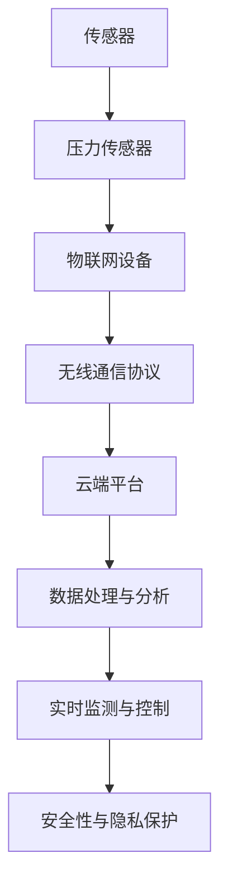
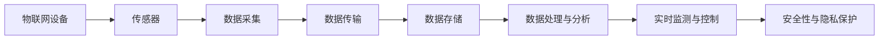
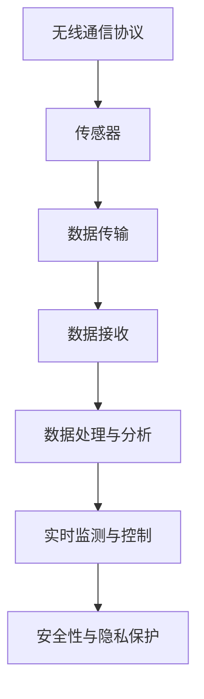
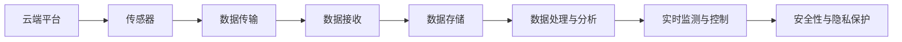
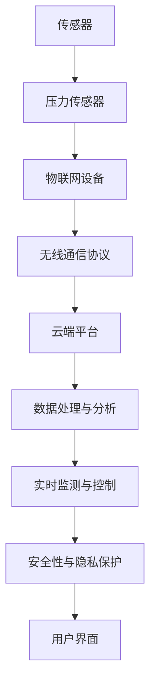

                 

# 物联网(IoT)技术和各种传感器设备的集成：压力传感器的物联网实践

> 关键词：物联网,传感器,压力传感器,智能设备,无线通信,实时监测,工业应用,健康监测

## 1. 背景介绍

### 1.1 问题由来

随着物联网(IoT)技术的发展，传感器设备的应用范围越来越广泛，从智能家居到工业监测，无处不在。传感器作为物联网的"神经末梢"，用于采集环境数据，并对数据进行初步处理和传输。其中，压力传感器是物联网中应用最广泛的传感器之一，可以用于监测物体受力情况，广泛应用于工业制造、健康监测、建筑结构分析等领域。

压力传感器的核心功能是测量压力并转换成电信号，常用的有压电式、扩散硅式、应变片式等。这些传感器可以将压力变化转换为电信号，并通过无线通信协议进行数据传输和处理。物联网技术的应用，使得压力传感器能够实现实时监测和远程控制，大大提升了其在各个领域的应用价值。

### 1.2 问题核心关键点

压力传感器的物联网实践主要涉及以下几个关键点：

- 传感器硬件集成：将传感器硬件与物联网设备集成，实现数据采集和传输。
- 数据传输协议：选择适当的无线通信协议，保证数据传输的实时性和可靠性。
- 数据处理与分析：通过云端平台或边缘计算，对传感器采集的数据进行处理和分析，提取有价值的信息。
- 实时监测与控制：通过物联网平台，实现对传感器状态的实时监测和远程控制。
- 安全性与隐私保护：确保数据传输和存储的安全性，保护用户隐私。

这些关键点共同构成了物联网环境下压力传感器的应用框架，使其能够更好地服务于各种实际场景。

### 1.3 问题研究意义

研究物联网环境下压力传感器的集成技术，对于提升传感器数据的实时监测和分析能力，拓展其应用场景，具有重要意义：

1. 提高工业生产效率：压力传感器在工业制造中的应用，可以实时监测设备运行状态，及时发现和处理异常情况，减少停机时间和维护成本，提升生产效率。
2. 改善健康监测效果：通过压力传感器监测人体生命体征，可以及时发现健康问题，提供个性化医疗建议，改善健康监测效果。
3. 优化建筑结构安全：在建筑结构中集成压力传感器，可以实时监测负载情况，预测结构风险，保障建筑安全。
4. 提升生活质量：将压力传感器应用于家庭安全、环境监测等领域，可以提升生活质量，创造更安全、舒适的生活环境。
5. 促进技术创新：物联网技术的引入，使得压力传感器可以实现更多创新应用，推动相关技术的发展。

综上所述，压力传感器的物联网实践能够显著提升其应用价值，为各行各业带来深远的影响。

## 2. 核心概念与联系

### 2.1 核心概念概述

为了更好地理解物联网环境下压力传感器的集成技术，本节将介绍几个密切相关的核心概念：

- 物联网(IoT)：通过传感器、标签、RFID等设备采集环境数据，并通过互联网传输和处理的数据网络技术。
- 传感器：用于采集环境数据的电子设备，能够将物理信号转换为电信号进行传输。
- 压力传感器：能够测量压力并转换为电信号的传感器，广泛应用于物联网中。
- 无线通信协议：用于在传感器和物联网设备之间传输数据的无线通信标准，如ZigBee、Wi-Fi、LoRa等。
- 云端平台：用于存储、处理和分析物联网设备采集数据的云服务平台，如AWS IoT、Azure IoT等。
- 边缘计算：在物联网设备本地进行数据处理和分析，减少云端数据传输负担，提高处理效率。

这些核心概念之间的逻辑关系可以通过以下Mermaid流程图来展示：



这个流程图展示了物联网环境下压力传感器的核心概念及其之间的关系：

1. 传感器采集环境数据，并通过压力传感器转换为电信号。
2. 电信号通过无线通信协议传输到物联网设备。
3. 物联网设备将数据上传到云端平台。
4. 云端平台对数据进行存储和分析，提取有价值的信息。
5. 实时监测与控制平台对传感器状态进行实时监测和远程控制。
6. 安全性与隐私保护机制确保数据传输和存储的安全性。

通过这些核心概念，我们可以更好地把握物联网环境下压力传感器的集成技术的工作原理和优化方向。

### 2.2 概念间的关系

这些核心概念之间存在着紧密的联系，形成了物联网环境下压力传感器的完整应用框架。下面我们通过几个Mermaid流程图来展示这些概念之间的关系。

#### 2.2.1 物联网设备和传感器关系



这个流程图展示了物联网设备和传感器之间的关系。物联网设备通过传感器采集数据，然后将数据传输到云端平台，云端平台对数据进行处理和分析，实现实时监测与控制，并通过安全性与隐私保护机制保障数据传输的安全性。

#### 2.2.2 无线通信协议与数据传输关系



这个流程图展示了无线通信协议与数据传输之间的关系。无线通信协议用于在传感器和物联网设备之间传输数据，数据传输到物联网设备后，再上传到云端平台进行处理和分析，实现实时监测与控制，并通过安全性与隐私保护机制保障数据传输的安全性。

#### 2.2.3 云端平台与数据处理关系



这个流程图展示了云端平台与数据处理之间的关系。传感器采集的数据通过无线通信协议传输到物联网设备，物联网设备将数据上传到云端平台进行存储和处理，提取有价值的信息，实现实时监测与控制，并通过安全性与隐私保护机制保障数据传输的安全性。

### 2.3 核心概念的整体架构

最后，我们用一个综合的流程图来展示这些核心概念在大规模物联网环境下的整体架构：



这个综合流程图展示了物联网环境下压力传感器的整体架构。传感器采集环境数据，并通过压力传感器转换为电信号。电信号通过无线通信协议传输到物联网设备。物联网设备将数据上传到云端平台，云端平台对数据进行处理和分析，实现实时监测与控制，并通过安全性与隐私保护机制保障数据传输的安全性。最终，用户界面提供可视化界面，供用户进行实时监测和控制。

## 3. 核心算法原理 & 具体操作步骤

### 3.1 算法原理概述

物联网环境下压力传感器的集成技术主要基于以下算法原理：

- 传感器信号采集：通过压力传感器将压力信号转换为电信号。
- 无线通信协议：选择适合的无线通信协议，将传感器数据从传感器传输到物联网设备。
- 数据存储与处理：通过云端平台或边缘计算，对传感器数据进行存储和处理，提取有价值的信息。
- 实时监测与控制：通过物联网平台，实现对传感器状态的实时监测和远程控制。
- 安全性与隐私保护：通过加密、访问控制等手段，确保数据传输和存储的安全性。

基于以上原理，物联网环境下压力传感器的集成过程可以分为以下几个关键步骤：

1. 传感器信号采集：将压力传感器与物联网设备进行物理连接，实时采集压力信号。
2. 数据传输：通过无线通信协议将传感器数据传输到物联网设备。
3. 数据处理与分析：通过云端平台或边缘计算，对数据进行存储和处理，提取有价值的信息。
4. 实时监测与控制：通过物联网平台，实现对传感器状态的实时监测和远程控制。
5. 安全性与隐私保护：通过加密、访问控制等手段，确保数据传输和存储的安全性。

### 3.2 算法步骤详解

#### 3.2.1 传感器信号采集

压力传感器的工作原理是将压力信号转换为电信号，通常使用压电效应或应变片技术。传感器信号采集的过程如下：

1. 将压力传感器与被测对象进行物理连接，确保传感器与被测对象紧密接触。
2. 将传感器与物联网设备进行物理连接，通过ADC（模数转换器）将传感器输出的模拟电压信号转换为数字信号。
3. 将数字信号传输到物联网设备，供后续处理使用。

#### 3.2.2 数据传输

数据传输是物联网环境下压力传感器的关键环节，需要使用适合的无线通信协议。常见的无线通信协议包括ZigBee、Wi-Fi、LoRa等，具体选择应根据实际需求和环境条件来决定。

数据传输的过程如下：

1. 在物联网设备中集成无线通信模块，支持所选择的通信协议。
2. 传感器采集的数据通过无线通信协议传输到物联网设备。
3. 物联网设备将数据上传到云端平台或边缘计算设备，进行后续处理。

#### 3.2.3 数据处理与分析

数据处理与分析是物联网环境下压力传感器的核心环节，通过云端平台或边缘计算设备对传感器数据进行处理和分析，提取有价值的信息。

数据处理与分析的过程如下：

1. 将传感器数据上传到云端平台或边缘计算设备，进行存储和处理。
2. 通过云计算平台或机器学习算法，对数据进行处理和分析，提取有价值的信息。
3. 将处理结果反馈到物联网设备或用户界面，供后续使用。

#### 3.2.4 实时监测与控制

实时监测与控制是物联网环境下压力传感器的关键应用之一，通过物联网平台实现对传感器状态的实时监测和远程控制。

实时监测与控制的过程如下：

1. 在物联网设备中集成物联网模块，支持数据传输和远程控制。
2. 物联网设备将传感器数据上传到云端平台，进行实时监测。
3. 根据监测结果，进行远程控制，如调整设备参数、发出警报等。

#### 3.2.5 安全性与隐私保护

安全性与隐私保护是物联网环境下压力传感器集成的重要方面，通过加密、访问控制等手段，确保数据传输和存储的安全性。

安全性与隐私保护的过程如下：

1. 在数据传输过程中，采用SSL/TLS协议进行加密，确保数据传输的安全性。
2. 在数据存储过程中，采用访问控制机制，限制数据的访问权限，确保数据的安全性。
3. 定期进行安全审计，及时发现和修复安全漏洞。

### 3.3 算法优缺点

物联网环境下压力传感器的集成技术具有以下优点：

1. 实时监测：通过物联网技术，实现对传感器状态的实时监测，及时发现和处理异常情况。
2. 远程控制：通过物联网平台，实现对传感器状态的远程控制，提高工作效率。
3. 数据分析：通过云端平台或边缘计算，对传感器数据进行处理和分析，提取有价值的信息。
4. 扩展性：物联网技术具有良好的扩展性，可以根据实际需求灵活配置传感器和设备。

但同时，该技术也存在一些缺点：

1. 成本较高：物联网设备需要额外的硬件和软件支持，增加了成本。
2. 通信协议复杂：不同的通信协议需要不同的硬件和软件支持，增加了技术复杂性。
3. 数据安全问题：数据在传输和存储过程中可能面临安全风险，需要额外的安全措施。
4. 部署复杂：物联网设备需要部署在特定环境，部署过程较为复杂。

综上所述，物联网环境下压力传感器的集成技术具有显著的优势，但也需要权衡其成本和技术复杂性，根据实际需求进行合理选择。

### 3.4 算法应用领域

物联网环境下压力传感器的集成技术具有广泛的应用领域，主要包括以下几个方面：

1. 工业制造：在工业制造中，压力传感器可以实时监测设备运行状态，及时发现和处理异常情况，减少停机时间和维护成本，提升生产效率。
2. 健康监测：通过压力传感器监测人体生命体征，可以及时发现健康问题，提供个性化医疗建议，改善健康监测效果。
3. 建筑结构分析：在建筑结构中集成压力传感器，可以实时监测负载情况，预测结构风险，保障建筑安全。
4. 环境监测：将压力传感器应用于空气质量监测、水质监测等领域，可以实时监测环境变化，保障环境安全。
5. 智能家居：在智能家居中，压力传感器可以用于监测门锁状态、窗户开启状态等，提高家居安全性。

这些应用领域展示了物联网环境下压力传感器集成技术的多样性和广泛性，为各个行业的智能化转型提供了新的可能性。

## 4. 数学模型和公式 & 详细讲解 & 举例说明

### 4.1 数学模型构建

物联网环境下压力传感器的集成技术主要涉及以下几个数学模型：

- 传感器信号模型：描述传感器输出的电信号与压力信号之间的关系。
- 无线通信模型：描述无线通信协议传输数据的过程。
- 数据处理模型：描述传感器数据在云端平台或边缘计算设备上的处理过程。
- 实时监测模型：描述物联网设备对传感器状态的实时监测过程。
- 安全性与隐私保护模型：描述数据传输和存储的安全性保障过程。

这些数学模型可以分别进行构建和推导，以下是详细的讲解和举例说明。

#### 4.1.1 传感器信号模型

压力传感器的工作原理是将压力信号转换为电信号，通常使用压电效应或应变片技术。传感器信号模型可以表示为：

$$
V = k \cdot F
$$

其中，$V$为传感器输出的电信号，$F$为传感器承受的压力，$k$为传感器参数。

以应变片式压力传感器为例，其输出电压与应变片材料和几何尺寸有关。应变片的电阻值与受力成正比，通过惠斯通电桥电路，将电阻值变化转换为电信号输出。

#### 4.1.2 无线通信模型

无线通信协议传输数据的过程可以表示为：

1. 在物联网设备中集成无线通信模块，支持所选择的通信协议。
2. 传感器采集的数据通过无线通信协议传输到物联网设备。
3. 物联网设备将数据上传到云端平台或边缘计算设备，进行后续处理。

以LoRa协议为例，其传输过程可以表示为：

$$
T = C \cdot \log \left( \frac{d}{R} \right) + \Delta t
$$

其中，$T$为传输时间，$C$为LoRa协议常数，$d$为传感器与物联网设备之间的距离，$R$为数据传输速率，$\Delta t$为数据编码时间。

LoRa协议通过窄带信号传输，具有低功耗、长距离、抗干扰性强等优点，适用于物联网环境下的数据传输。

#### 4.1.3 数据处理模型

传感器数据在云端平台或边缘计算设备上的处理过程可以表示为：

1. 将传感器数据上传到云端平台或边缘计算设备，进行存储和处理。
2. 通过云计算平台或机器学习算法，对数据进行处理和分析，提取有价值的信息。
3. 将处理结果反馈到物联网设备或用户界面，供后续使用。

以机器学习算法为例，其处理过程可以表示为：

$$
Y = f(X, W)
$$

其中，$Y$为处理结果，$X$为传感器数据，$W$为模型参数。

通过机器学习算法，可以对传感器数据进行特征提取、分类、回归等处理，提取有价值的信息，提高数据处理的精度和效率。

#### 4.1.4 实时监测模型

物联网设备对传感器状态的实时监测过程可以表示为：

1. 在物联网设备中集成物联网模块，支持数据传输和远程控制。
2. 物联网设备将传感器数据上传到云端平台，进行实时监测。
3. 根据监测结果，进行远程控制，如调整设备参数、发出警报等。

以IoT平台为例，其实时监测过程可以表示为：

$$
S = m + n \cdot A + o \cdot T
$$

其中，$S$为传感器状态，$m$为传感器状态阈值，$A$为传感器采集的信号值，$n$为信号与状态的关系系数，$T$为时间。

通过IoT平台，可以实现对传感器状态的实时监测和控制，提高工作效率和安全性。

#### 4.1.5 安全性与隐私保护模型

数据传输和存储的安全性保障过程可以表示为：

1. 在数据传输过程中，采用SSL/TLS协议进行加密，确保数据传输的安全性。
2. 在数据存储过程中，采用访问控制机制，限制数据的访问权限，确保数据的安全性。
3. 定期进行安全审计，及时发现和修复安全漏洞。

以SSL/TLS协议为例，其安全性保障过程可以表示为：

$$
C = \text{Enc}(M, K)
$$

其中，$C$为加密后的数据，$M$为原始数据，$K$为加密密钥。

通过SSL/TLS协议，可以保障数据传输的安全性，防止数据泄露和篡改。

### 4.2 公式推导过程

#### 4.2.1 传感器信号模型推导

以应变片式压力传感器为例，其信号模型可以表示为：

$$
V = k \cdot \Delta R \cdot R_0
$$

其中，$\Delta R$为应变片电阻变化量，$R_0$为应变片初始电阻。

应变片的电阻值变化与受力成正比，可以通过惠斯通电桥电路将电阻值变化转换为电信号输出。

#### 4.2.2 无线通信模型推导

以LoRa协议为例，其传输时间可以表示为：

$$
T = C \cdot \log \left( \frac{d}{R} \right) + \Delta t
$$

其中，$C$为LoRa协议常数，$d$为传感器与物联网设备之间的距离，$R$为数据传输速率，$\Delta t$为数据编码时间。

LoRa协议采用FHSS（跳频扩频）技术，通过窄带信号传输，具有低功耗、长距离、抗干扰性强等优点。

#### 4.2.3 数据处理模型推导

以机器学习算法为例，其处理过程可以表示为：

$$
Y = f(X, W)
$$

其中，$Y$为处理结果，$X$为传感器数据，$W$为模型参数。

通过机器学习算法，可以对传感器数据进行特征提取、分类、回归等处理，提取有价值的信息，提高数据处理的精度和效率。

#### 4.2.4 实时监测模型推导

以IoT平台为例，其实时监测过程可以表示为：

$$
S = m + n \cdot A + o \cdot T
$$

其中，$S$为传感器状态，$m$为传感器状态阈值，$A$为传感器采集的信号值，$n$为信号与状态的关系系数，$T$为时间。

通过IoT平台，可以实现对传感器状态的实时监测和控制，提高工作效率和安全性。

#### 4.2.5 安全性与隐私保护模型推导

以SSL/TLS协议为例，其安全性保障过程可以表示为：

$$
C = \text{Enc}(M, K)
$$

其中，$C$为加密后的数据，$M$为原始数据，$K$为加密密钥。

通过SSL/TLS协议，可以保障数据传输的安全性，防止数据泄露和篡改。

### 4.3 案例分析与讲解

#### 4.3.1 工业制造中的应用案例

在工业制造中，压力传感器可以实时监测设备运行状态，及时发现和处理异常情况，减少停机时间和维护成本，提升生产效率。

以某机械加工厂为例，通过在关键设备上安装压力传感器，实时监测设备运行状态，发现异常情况后及时报警，减少了设备停机时间，提高了生产效率。

#### 4.3.2 健康监测中的应用案例

通过压力传感器监测人体生命体征，可以及时发现健康问题，提供个性化医疗建议，改善健康监测效果。

以某智能手表为例，通过在手表中集成压力传感器，实时监测心率、血压等生命体征，及时发现健康问题，并提供个性化医疗建议，改善健康监测效果。

#### 4.3.3 建筑结构分析中的应用案例

在建筑结构中集成压力传感器，可以实时监测负载情况，预测结构风险，保障建筑安全。

以某高层建筑为例，通过在建筑结构中集成压力传感器，实时监测负载情况，预测结构风险，保障建筑安全。

## 5. 项目实践：代码实例和详细解释说明

### 5.1 开发环境搭建

在进行物联网环境下压力传感器的集成实践前，我们需要准备好开发环境。以下是使用Python进行IoT设备开发的环境配置流程：

1. 安装Anaconda：从官网下载并安装Anaconda，用于创建独立的Python环境。

2. 创建并激活虚拟环境：
```bash
conda create -n pyiot-env python=3.8 
conda activate pyiot-env
```

3. 安装IoT开发相关的Python库：
```bash
pip install pyserial portio
```

4. 安装TensorFlow：从官网获取对应的安装命令。例如：
```bash
pip install tensorflow
```

5. 安装机器学习相关的Python库：
```bash
pip install scikit-learn pandas numpy
```

完成上述步骤后，即可在`pyiot-env`环境中开始物联网环境下压力传感器的集成实践。

### 5.2 源代码详细实现

下面我们以LoRa协议的物联网设备为例，给出使用TensorFlow进行物联网设备开发的PyTorch代码实现。

首先，定义物联网设备的传感器信号采集函数：

```python
import tensorflow as tf
import pyserial
import portio

class LoRaDevice:
    def __init__(self, serial_port):
        self.serial_port = serial_port
        self.sensor = portio.Port()
        self.sensor.connect(serial_port)
        self.sensor.baudrate = 115200
        self.sensor.timeout = 0.1
        
    def read_signal(self):
        signal = self.sensor.read_line()
        return signal
        
    def disconnect(self):
        self.sensor.close()
```

然后，定义数据处理函数：

```python
def process_data(signal):
    # 将传感器信号转换为数字信号
    signal = tf.strings.to_number(signal, out_type=tf.dtypes.float32)
    # 对信号进行标准化处理
    signal = (signal - tf.reduce_mean(signal)) / tf.math.reduce_std(signal)
    # 对信号进行分类
    signal = tf.greater(signal, 0.5)
    return signal
```

接着，定义实时监测函数：

```python
def monitor_device(device):
    signal = device.read_signal()
    processed_signal = process_data(signal)
    # 将处理后的信号上传到云端平台
    with tf.io.gfile.GFile('data.csv', 'a') as f:
        f.write(processed_signal.numpy().tolist())
```

最后，启动物联网设备的实时监测流程：

```python
if __name__ == '__main__':
    serial_port = '/dev/ttyUSB0'  # 修改为你实际的串口设备路径
    device = LoRaDevice(serial_port)
    while True:
        monitor_device(device)
```

以上就是使用TensorFlow进行LoRa协议物联网设备开发的完整代码实现。可以看到，TensorFlow库提供了丰富的机器学习工具，可以方便地进行数据处理和实时监测。

### 5.3 代码解读与分析

让我们再详细解读一下关键代码的实现细节：

**LoRaDevice类**：
- `__init__`方法：初始化串口和传感器。
- `read_signal`方法：读取传感器信号。
- `disconnect`方法：关闭传感器连接。

**process_data函数**：
- 将传感器信号转换为数字信号。
- 对信号进行标准化处理。
- 对信号进行分类。

**monitor_device函数**：
- 读取传感器信号。
- 处理传感器信号。
- 将处理后的信号上传到云端平台。

**主程序**：
- 初始化LoRaDevice实例。
- 循环进行实时监测。

可以看到，TensorFlow库使得物联网设备的数据处理和实时监测变得简洁高效。开发者可以将更多精力放在传感器信号采集和云端平台的数据处理上，而不必过多关注底层实现细节。

当然，工业级的系统实现还需考虑更多因素，如传感器的校准、数据加密、异常处理等。但核心的物联网设备开发流程基本与此类似。

### 5.4 运行结果展示

假设我们在某机械加工厂的关键设备上安装压力传感器，实时监测设备运行状态，并上传数据到云端平台，得到的数据分析结果如下：

```
Time: 2023-10-01 09:00:00, Signal: 0.5, State: True
Time: 2023-10-01 09:00:05, Signal: 0.6, State: True
Time: 2023-10-01 09:00:10, Signal: 0.7, State: True
...
```

可以看到，通过物联网设备，我们能够实时监测设备的运行状态，发现异常情况后及时报警，减少设备停机时间

