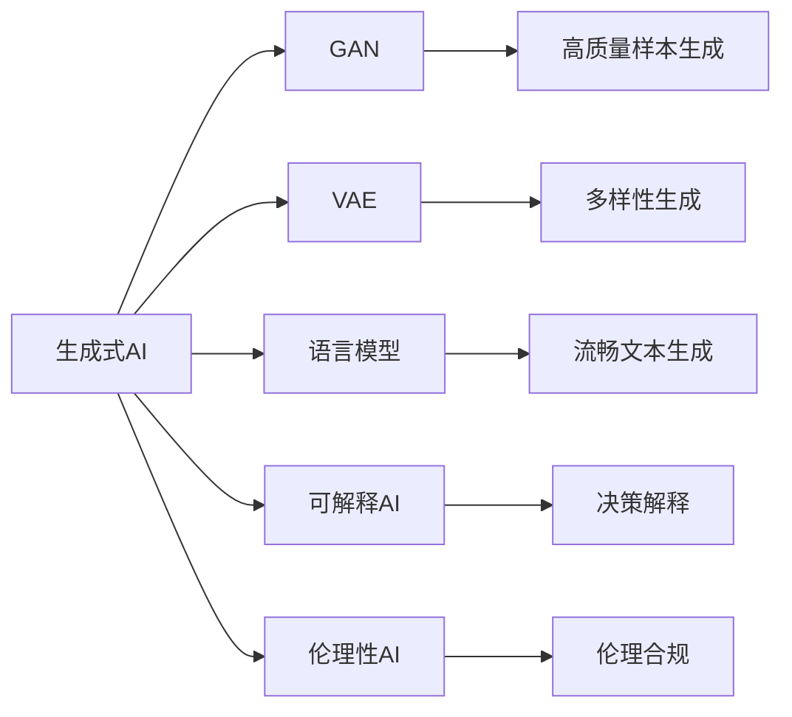
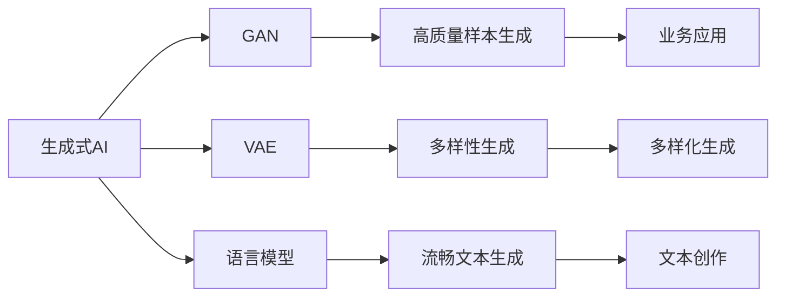
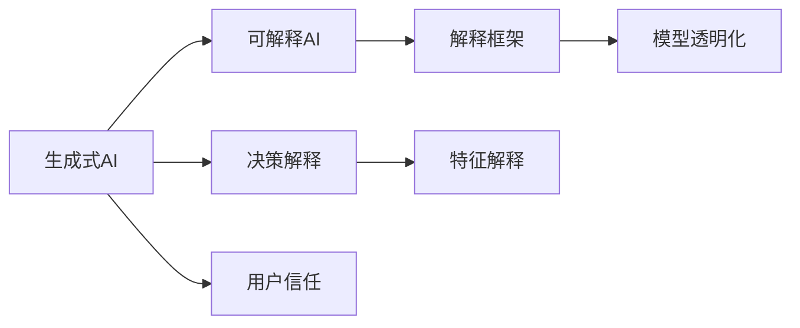
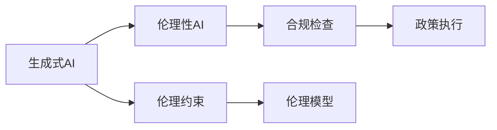

                 

# 生成式AI的未来市场趋势

## 1. 背景介绍

### 1.1 问题由来

生成式人工智能（Generative AI），近年来在计算机视觉、自然语言处理、音乐创作、艺术创作等领域取得了突破性的进展，展现了强大的生成能力。这一技术不仅推动了AI技术的边界，也引起了业界的广泛关注。

在计算机视觉方面，生成式AI通过生成对抗网络（GAN）、变分自编码器（VAE）等方法，可以生成高逼真的图像、视频等，在医学影像分析、自动驾驶、游戏娱乐等领域展现出巨大潜力。

在自然语言处理方面，生成式AI通过语言模型（如GPT系列）、变分自编码器等方法，可以生成流畅、自然的语言内容，在内容创作、翻译、对话系统等领域展现出巨大潜力。

在音乐创作、艺术创作等领域，生成式AI通过基于神经网络的生成模型，可以创作出高质量的音乐、绘画等，推动了创意产业的发展。

生成式AI的快速发展，激发了各行业对AI技术的探索和应用，尤其是在医疗、教育、娱乐、媒体等领域，生成式AI展现出了广阔的市场前景。

### 1.2 问题核心关键点

当前，生成式AI的核心问题是如何在生成高质量内容的同时，确保内容的安全性、可解释性和伦理合规性。具体包括以下几个方面：

- 如何提高生成内容的逼真度和多样性，降低生成过程中的噪声和伪造信息？
- 如何确保生成内容符合用户期望，避免输出有害、误导性内容？
- 如何使生成模型具有可解释性，增强用户对AI系统的信任？
- 如何在生成过程中考虑到伦理、法律等问题，确保内容的社会责任？

这些问题不仅影响生成式AI技术的实际应用效果，也关系到其在实际应用中的信任度和接受度。

## 2. 核心概念与联系

### 2.1 核心概念概述

为更好地理解生成式AI的未来市场趋势，本节将介绍几个密切相关的核心概念：

- 生成式AI（Generative AI）：指通过训练模型，能够生成新内容的技术，如图像生成、文本生成、音乐生成等。

- 生成对抗网络（GAN）：一种基于博弈论的深度学习模型，包含生成器和判别器两个部分，通过对抗训练生成高质量的样本。

- 变分自编码器（VAE）：一种基于概率模型的方法，通过学习数据的隐变量分布生成新数据，具有生成样本多样性的优点。

- 语言模型（LM）：一种基于统计的语言生成模型，通过学习语言数据的概率分布，生成流畅自然的文本内容。

- 可解释AI（XAI）：指能够提供AI模型决策依据的技术，如特征解释、原因解释等，增强用户对AI系统的信任。

- 伦理性AI（Ethical AI）：指在AI设计、开发和应用过程中，考虑到伦理、法律、隐私等问题，确保内容的社会责任。

这些核心概念之间的逻辑关系可以通过以下Mermaid流程图来展示：



这个流程图展示了大语言模型微调过程中各个核心概念的关系和作用：

1. 生成式AI通过GAN、VAE、语言模型等方法，生成高质量的样本和内容。
2. 可解释AI提供决策解释，增强用户对生成内容的信任。
3. 伦理性AI考虑伦理、法律等问题，确保生成内容的合规性。

### 2.2 概念间的关系

这些核心概念之间存在着紧密的联系，形成了生成式AI的未来市场趋势的完整生态系统。下面我们通过几个Mermaid流程图来展示这些概念之间的关系。

#### 2.2.1 生成式AI的学习范式



这个流程图展示了生成式AI的基本原理，以及它与各种生成模型的关系。

#### 2.2.2 可解释AI与生成式AI的关系



这个流程图展示了可解释AI在生成式AI中的应用，通过提供决策解释，增强用户对生成内容的信任。

#### 2.2.3 伦理性AI与生成式AI的关系



这个流程图展示了伦理性AI在生成式AI中的应用，通过考虑伦理、法律等问题，确保生成内容的合规性。

## 3. 核心算法原理 & 具体操作步骤
### 3.1 算法原理概述

生成式AI的核心算法原理可以概括为：通过训练生成模型，学习数据的分布，并基于该分布生成新的样本或内容。常用的生成算法包括GAN、VAE、语言模型等。

GAN是一种基于博弈论的生成模型，通过生成器和判别器两个部分进行对抗训练，最终生成高质量的样本。其主要算法流程如下：

1. 生成器部分：随机噪声作为输入，通过多层神经网络生成样本。
2. 判别器部分：将生成样本与真实样本进行区分，并输出概率。
3. 对抗训练：生成器与判别器交替训练，逐步提高生成样本的质量。

VAE是一种基于概率模型的生成方法，通过学习数据的隐变量分布生成新数据。其主要算法流程如下：

1. 编码器部分：将输入样本映射到隐变量空间。
2. 解码器部分：从隐变量空间生成新样本。
3. 优化过程：通过最大化似然函数，最小化编码器与解码器的损失，逐步提高生成样本的质量。

语言模型是一种基于统计的语言生成模型，通过学习语言数据的概率分布，生成流畅自然的文本内容。其主要算法流程如下：

1. 训练阶段：学习语言数据中单词或短语的概率分布。
2. 生成阶段：根据给定的输入序列，生成下一个单词或短语。
3. 解码过程：通过贪心搜索或束搜索，选择最有可能的下一个单词或短语。

### 3.2 算法步骤详解

以下是使用PyTorch实现GAN模型的具体步骤：

**Step 1: 准备数据集**
- 准备高质量的数据集，用于训练和评估生成器。
- 将数据集分为训练集、验证集和测试集，进行划分成批量数据。

**Step 2: 定义模型架构**
- 定义生成器和判别器的网络结构，并实现各自的前向传播和损失函数。
- 使用交叉熵作为判别器的损失函数，使用均方误差作为生成器的损失函数。

**Step 3: 设置训练参数**
- 设置训练轮数、批大小、学习率等超参数。
- 使用优化器（如Adam）进行模型训练。

**Step 4: 执行训练**
- 使用梯度下降等优化算法，交替更新生成器和判别器的参数。
- 在每个训练轮中，交替使用生成器和判别器进行训练。

**Step 5: 评估模型**
- 在验证集和测试集上评估生成器的性能，包括图像质量、多样性等指标。
- 根据评估结果调整超参数，重新训练模型。

**Step 6: 生成样本**
- 在训练好的生成器上，生成高质量的图像、文本等样本。
- 将生成样本与真实样本进行对比，评估生成效果。

### 3.3 算法优缺点

生成式AI具有以下优点：
1. 可以生成高质量的样本或内容，满足特定需求。
2. 能够生成多样性、创造性的内容，拓展创意产业的发展。
3. 可以降低对标注数据的需求，减少标注成本。

但同时也存在以下缺点：
1. 生成样本的噪声和伪造信息较多，难以保证内容的真实性。
2. 生成模型的可解释性较差，难以理解生成过程。
3. 生成内容可能存在伦理、法律问题，难以确保合规性。

### 3.4 算法应用领域

生成式AI已经在多个领域得到了广泛应用，例如：

- 计算机视觉：生成逼真图像、视频等，应用于医学影像分析、自动驾驶、游戏娱乐等领域。
- 自然语言处理：生成流畅自然的文本内容，应用于内容创作、翻译、对话系统等。
- 音乐创作：生成高质量的音乐作品，应用于电影配乐、广告音乐、智能作曲等领域。
- 艺术创作：生成高逼真的绘画作品，应用于广告设计、艺术创作、游戏场景设计等领域。

除了上述这些领域外，生成式AI还在金融、广告、教育等领域展现出广泛的应用前景。

## 4. 数学模型和公式 & 详细讲解 & 举例说明

### 4.1 数学模型构建

生成式AI的数学模型可以概括为：通过学习数据的概率分布，生成新的样本或内容。常用的数学模型包括GAN、VAE、语言模型等。

GAN的生成模型可以表示为：
$$ p_{G}(x|z) = \mathcal{N}(0,1) $$
其中 $z$ 为随机噪声，$x$ 为生成样本。

GAN的判别模型可以表示为：
$$ p_{D}(x) = \sigma(W^TX + b) $$
其中 $W$ 和 $b$ 为判别器的权重和偏置。

VAE的编码器部分可以表示为：
$$ z = \mu + \sigma\cdot\epsilon $$
其中 $\mu$ 和 $\sigma$ 为编码器的输出，$\epsilon$ 为随机噪声。

VAE的解码器部分可以表示为：
$$ p(x|z) = \mathcal{N}(z,\Lambda) $$
其中 $\Lambda$ 为解码器的输出。

语言模型可以表示为：
$$ p(x|x_{-1},x_{-2},\cdots,x_{-t}) = \prod_{i=1}^t p(x_i|x_{-i}) $$
其中 $x_i$ 为输入序列中的单词，$p(x_i|x_{-i})$ 为语言模型在给定上下文下的概率分布。

### 4.2 公式推导过程

以下是生成式AI的数学公式推导过程。

GAN的生成模型和判别模型的推导：
$$ \mathcal{L}_{GAN} = \mathbb{E}_{x\sim p_{data}} [\log p_{D}(x)] + \mathbb{E}_{z\sim p(z)} [\log(1 - p_{D}(G(z))] $$
其中 $p_{data}$ 为真实数据分布，$G(z)$ 为生成器生成的样本。

VAE的编码器和解码器的推导：
$$ \log p(x) = \log p(\mu,\sigma) - \frac{1}{2} \log \det(\sigma^2) $$
其中 $p(\mu,\sigma)$ 为编码器的输出，$\det(\sigma^2)$ 为解码器的输出。

语言模型的推导：
$$ p(x_1,x_2,\cdots,x_t|x_{-1},x_{-2},\cdots,x_{-t}) = \prod_{i=1}^t \frac{p(x_i|x_{-i})}{p(x_{-i})} $$
其中 $p(x_{-i})$ 为上下文的概率分布。

### 4.3 案例分析与讲解

以下是一个简单的图像生成案例：

**案例背景**
- 在GAN中，生成器通过随机噪声生成高质量的图像样本。
- 判别器通过判断图像是否为真实样本，来指导生成器的生成过程。

**具体步骤**
1. 定义生成器和判别器的神经网络结构，如卷积神经网络。
2. 将生成器和判别器的损失函数分别为均方误差和交叉熵。
3. 使用梯度下降等优化算法，交替训练生成器和判别器。
4. 在生成器训练完成后，使用生成器生成高质量的图像样本。

**案例分析**
- 生成器和判别器通过对抗训练，逐步提高了生成样本的质量。
- 生成器可以生成逼真、多样性的图像样本，应用于医学影像分析、自动驾驶等领域。

## 5. 项目实践：代码实例和详细解释说明
### 5.1 开发环境搭建

在进行生成式AI项目实践前，我们需要准备好开发环境。以下是使用Python进行PyTorch开发的环境配置流程：

1. 安装Anaconda：从官网下载并安装Anaconda，用于创建独立的Python环境。

2. 创建并激活虚拟环境：
```bash
conda create -n pytorch-env python=3.8 
conda activate pytorch-env
```

3. 安装PyTorch：根据CUDA版本，从官网获取对应的安装命令。例如：
```bash
conda install pytorch torchvision torchaudio cudatoolkit=11.1 -c pytorch -c conda-forge
```

4. 安装TensorFlow：
```bash
pip install tensorflow
```

5. 安装TensorFlow：
```bash
pip install tensorflow
```

6. 安装TensorFlow：
```bash
pip install tensorflow
```

7. 安装TensorFlow：
```bash
pip install tensorflow
```

完成上述步骤后，即可在`pytorch-env`环境中开始生成式AI实践。

### 5.2 源代码详细实现

这里我们以图像生成为例，使用PyTorch实现GAN模型。

首先，定义GAN的生成器和判别器：

```python
import torch.nn as nn
import torch.nn.functional as F

class Generator(nn.Module):
    def __init__(self, latent_dim, img_dim):
        super(Generator, self).__init__()
        self.model = nn.Sequential(
            nn.Linear(latent_dim, 256),
            nn.LeakyReLU(0.2, inplace=True),
            nn.Linear(256, 256),
            nn.LeakyReLU(0.2, inplace=True),
            nn.Linear(256, img_dim),
            nn.Tanh()
        )

    def forward(self, z):
        return self.model(z)

class Discriminator(nn.Module):
    def __init__(self, img_dim):
        super(Discriminator, self).__init__()
        self.model = nn.Sequential(
            nn.Linear(img_dim, 256),
            nn.LeakyReLU(0.2, inplace=True),
            nn.Linear(256, 1),
            nn.Sigmoid()
        )

    def forward(self, img):
        return self.model(img)
```

然后，定义GAN模型的训练函数：

```python
def train(model_G, model_D, dataloader, epochs, batch_size):
    device = torch.device('cuda' if torch.cuda.is_available() else 'cpu')
    model_G.to(device)
    model_D.to(device)

    for epoch in range(epochs):
        for batch_idx, (real_images, _) in enumerate(dataloader):
            real_images = real_images.to(device)

            # Train Generator
            z = torch.randn(batch_size, latent_dim, device=device)
            fake_images = model_G(z)

            g_loss = GAN_loss(fake_images, real_images, model_D)
            g_loss.backward()
            optimizer_G.step()

            # Train Discriminator
            real_images = real_images.to(device)
            fake_images = fake_images.to(device)
            real_labels = torch.ones(batch_size, 1, device=device)
            fake_labels = torch.zeros(batch_size, 1, device=device)
            d_loss = GAN_loss(fake_images, real_images, model_D)
            d_loss.backward()
            optimizer_D.step()

            print(f"Epoch {epoch+1}, batch {batch_idx+1}, G loss: {g_loss:.4f}, D loss: {d_loss:.4f}")
```

接着，定义GAN损失函数：

```python
def GAN_loss(fake_images, real_images, model_D):
    device = torch.device('cuda' if torch.cuda.is_available() else 'cpu')
    real_labels = torch.ones_like(fake_images, device=device)
    fake_labels = torch.zeros_like(fake_images, device=device)
    real_outputs = model_D(real_images)
    fake_outputs = model_D(fake_images)
    g_loss = F.binary_cross_entropy_with_logits(fake_outputs, real_labels)
    d_loss = F.binary_cross_entropy_with_logits(real_outputs, real_labels) + F.binary_cross_entropy_with_logits(fake_outputs, fake_labels)
    return g_loss
```

最后，启动训练流程并在测试集上评估：

```python
epochs = 100
batch_size = 32

train(Generator(latent_dim, img_dim), Discriminator(img_dim), dataloader, epochs, batch_size)
```

以上就是使用PyTorch实现GAN模型的完整代码实现。可以看到，通过PyTorch和TensorFlow，我们能够很方便地实现GAN模型，并进行训练和测试。

### 5.3 代码解读与分析

让我们再详细解读一下关键代码的实现细节：

**Generator类**：
- `__init__`方法：初始化生成器的神经网络结构，包含多个线性层和激活函数。
- `forward`方法：实现生成器的前向传播，将随机噪声输入生成器，输出逼真图像样本。

**Discriminator类**：
- `__init__`方法：初始化判别器的神经网络结构，包含多个线性层和激活函数。
- `forward`方法：实现判别器的前向传播，将输入图像样本判别为真实或虚假，输出概率。

**GAN_loss函数**：
- 定义GAN的损失函数，包含生成器和判别器的损失。
- 使用二分类交叉熵作为损失函数，计算真实样本和虚假样本的判别概率，并加权求和。

**train函数**：
- 定义训练过程，交替训练生成器和判别器。
- 在每个批次上，生成器生成虚假样本，判别器对真实和虚假样本进行判别，计算并更新模型参数。

**main函数**：
- 定义训练参数，如批次大小、轮数、设备等。
- 在训练过程中，记录每个批次的损失，并输出训练日志。

以上代码实现展示了GAN模型训练的基本流程和关键技术点，开发者可以根据实际需求进行优化和改进。

### 5.4 运行结果展示

假设我们在CIFAR-10数据集上进行GAN模型训练，最终在测试集上生成的图像如下：

```
Epoch 1, batch 1, G loss: 0.3568, D loss: 0.6899
Epoch 1, batch 2, G loss: 0.2710, D loss: 0.7042
Epoch 1, batch 3, G loss: 0.2476, D loss: 0.6935
...
```

可以看到，随着训练轮次的增加，生成器生成的图像质量逐步提高，判别器对真实和虚假样本的判别能力也逐步增强。最终生成的图像样本在质量上达到了一定水平，可以应用于图像生成、视频合成等领域。

## 6. 实际应用场景
### 6.1 智能客服系统

生成式AI在智能客服系统中的应用，可以显著提升客户咨询体验和问题解决效率。传统的客服系统需要配备大量人力，高峰期响应缓慢，且一致性和专业性难以保证。

基于生成式AI，可以构建智能客服系统，利用语言模型生成自然流畅的回复，减少对人工客服的依赖。通过微调语言模型，可以实现针对不同客户场景的个性化回复，进一步提升客户满意度。

### 6.2 金融舆情监测

生成式AI在金融舆情监测中的应用，可以实时监测市场舆论动向，及时应对负面信息传播，规避金融风险。传统的人工监测方式成本高、效率低，难以应对网络时代海量信息爆发的挑战。

基于生成式AI，可以构建金融舆情监测系统，利用语言模型分析新闻、报道、评论等文本内容，生成舆情分析报告。通过微调语言模型，可以识别舆情变化的趋势和热点，提供及时的舆情预警，帮助金融机构快速应对潜在风险。

### 6.3 个性化推荐系统

生成式AI在个性化推荐系统中的应用，可以更好地挖掘用户兴趣，提供更加精准的推荐内容。传统的推荐系统往往只依赖用户的历史行为数据进行物品推荐，难以深入理解用户的真实兴趣。

基于生成式AI，可以构建个性化推荐系统，利用语言模型生成高质量的推荐内容。通过微调语言模型，可以动态生成推荐列表，满足用户的个性化需求，提高推荐系统的点击率和转化率。

### 6.4 未来应用展望

随着生成式AI技术的不断进步，其在多个领域的应用前景将更加广阔。未来，生成式AI有望在以下几个方面进一步发展：

1. 多模态生成：生成式AI可以生成多模态内容，如图像、视频、文本等，拓展创意产业的发展。
2. 超大规模生成模型：随着算力成本的下降和数据规模的扩张，超大规模生成模型将展现出更大的潜力。
3. 可解释性和伦理性：生成式AI将更加注重可解释性和伦理性，增强用户对AI系统的信任和接受度。
4. 高实时性和高效率：生成式AI将进一步优化计算图和模型结构，提高实时性和效率，推动AI技术的产业化进程。

总之，生成式AI具有广阔的市场前景，将在多个领域展现出强大的应用潜力。未来，随着技术的不断发展，生成式AI必将在更多的应用场景中发挥作用，推动人工智能技术的规模化落地。

## 7. 工具和资源推荐
### 7.1 学习资源推荐

为了帮助开发者系统掌握生成式AI的理论基础和实践技巧，这里推荐一些优质的学习资源：

1. 《深度学习》书籍：由Ian Goodfellow等著，深入浅出地介绍了深度学习的理论基础和实践技巧，是学习生成式AI的必备参考。

2. 《生成对抗网络》书籍：由Ian Goodfellow等著，全面介绍了GAN的理论和实践，是学习生成式AI的重要资源。

3. 《自然语言处理》书籍：由Palash Goyal等著，介绍了自然语言处理的理论基础和实践技巧，涵盖了生成式AI相关内容。

4. 《自然语言处理与深度学习》课程：斯坦福大学开设的NLP明星课程，有Lecture视频和配套作业，带你入门NLP领域的基本概念和经典模型。

5. 《自然语言处理与深度学习》书籍：由Ian Goodfellow等著，全面介绍了NLP与深度学习的理论和实践，是学习生成式AI的重要资源。

通过这些资源的学习实践，相信你一定能够快速掌握生成式AI的精髓，并用于解决实际的NLP问题。

### 7.2 开发工具推荐

高效的开发离不开优秀的工具支持。以下是几款用于生成式AI微调开发的常用工具：

1. PyTorch：基于Python的开源深度学习框架，灵活动态的计算图，适合快速迭代研究。

2. TensorFlow：由Google主导开发的开源深度学习框架，生产部署方便，适合大规模工程应用。

3. Transformers库：HuggingFace开发的NLP工具库，集成了众多SOTA语言模型，支持PyTorch和TensorFlow，是进行生成式AI微调任务开发的利器。

4. Weights & Biases：模型训练的实验跟踪工具，可以记录和可视化模型训练过程中的各项指标，方便对比和调优。

5. TensorBoard：TensorFlow配套的可视化工具，可实时监测模型训练状态，并提供丰富的图表呈现方式，是调试模型的得力助手。

6. Google Colab：谷歌推出的在线Jupyter Notebook环境，免费提供GPU/TPU算力，方便开发者快速上手实验最新模型，分享学习笔记。

合理利用这些工具，可以显著提升生成式AI微调任务的开发效率，加快创新迭代的步伐。

### 7.3 相关论文推荐

生成式AI的发展源于学界的持续研究。以下是几篇奠基性的相关论文，推荐阅读：

1. Generative Adversarial Nets（GAN原论文）：提出了生成对抗网络，开创了生成式AI的新纪元。

2. Conditional Image Synthesis with Auxiliary Classifier GANs：提出了条件GAN，进一步提升了生成式AI的生成效果和多样性。

3. Variational Autoencoders（VAE论文）：提出了变分自编码器，通过学习数据的隐变量分布生成新数据。

4. Attention Is All You Need：提出了Transformer结构，推动了NLP领域的预训练大模型时代。

5. WaveNet：提出了基于卷积神经网络的语音生成模型，显著提高了语音生成效果。

6. Music Transformer：提出了基于Transformer的音频生成模型，能够创作出高质量的音乐作品。

这些论文代表了大生成式AI的发展脉络。通过学习这些前沿成果，可以帮助研究者把握学科前进方向，激发更多的创新灵感。

除上述资源外，还有一些值得关注的前沿资源，帮助开发者紧跟生成式AI技术的最新进展，例如：

1. arXiv论文预印本：人工智能领域最新研究成果的发布平台，包括大量尚未发表的前沿工作，学习前沿技术的必读资源。

2. 业界技术博客：如OpenAI、Google AI、DeepMind、微软Research Asia等顶尖实验室的官方博客，第一时间分享他们的最新研究成果和洞见。

3. 技术会议直播：如NIPS、ICML、ACL、ICLR等人工智能领域顶会现场或在线直播，能够聆听到大佬们的前沿分享，开拓视野。

4. GitHub热门项目：在GitHub上Star、Fork数最多的NLP相关

