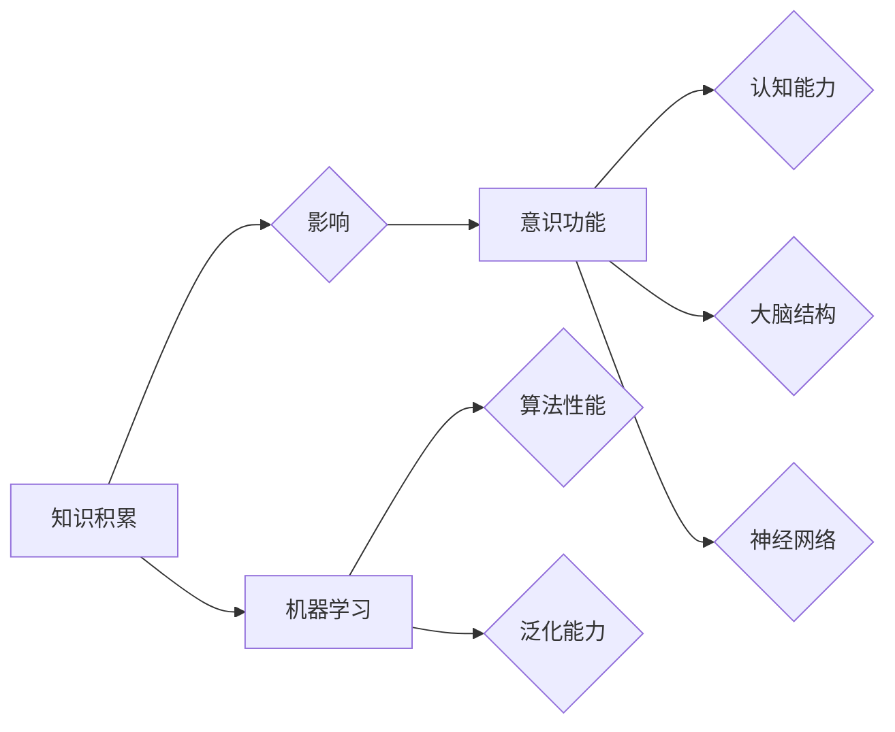

# 知识积累对意识功能的影响

> 关键词：知识积累，意识功能，认知科学，神经网络，机器学习，人脑模型

## 1. 背景介绍

在人类文明的进程中，知识的积累一直是推动社会进步和个体发展的关键因素。从古至今，人类通过不断学习、总结和传承知识，构建了丰富多彩的文化和科技。随着科学技术的飞速发展，人工智能（AI）逐渐成为研究知识积累和意识功能的重要工具。本文旨在探讨知识积累对意识功能的影响，分析其背后的神经机制，并展望未来人工智能在意识功能研究中的应用前景。

### 1.1 问题的由来

意识功能，即人类对自身和外部世界的感知、认知、记忆、决策等能力，是人类的核心竞争力。随着认知科学、神经科学、心理学等学科的不断发展，人们开始关注知识积累对意识功能的影响。传统的观点认为，知识积累有助于提高个体的认知能力，但对其背后的神经机制和认知过程了解有限。

### 1.2 研究现状

近年来，研究者们从多个角度探讨了知识积累对意识功能的影响，主要包括以下几个方面：

1. **认知科学视角**：认知科学领域的研究表明，知识积累可以改善个体的信息加工效率，提高认知能力，例如记忆力、注意力、推理能力等。

2. **神经科学视角**：神经科学研究揭示了知识积累对大脑结构和功能的影响，例如，长期学习某种知识可以导致大脑特定区域的灰质和体积增加。

3. **机器学习视角**：人工智能领域的研究者将知识积累视为机器学习的关键因素，通过知识表示和迁移学习等方法，提高机器的学习能力和泛化能力。

### 1.3 研究意义

研究知识积累对意识功能的影响，对于以下方面具有重要意义：

1. **理解人类认知机制**：揭示知识积累如何影响大脑结构和功能，有助于我们更好地理解人类认知机制。

2. **提升人工智能性能**：为人工智能领域提供新的研究方向，提高机器学习算法的性能和泛化能力。

3. **促进教育改革**：为教育改革提供理论依据，指导教育教学方法，提高教育质量。

4. **推动社会进步**：知识积累有助于提高个体的认知能力，促进社会整体发展。

## 2. 核心概念与联系

为了深入探讨知识积累对意识功能的影响，我们需要明确以下核心概念：

1. **知识积累**：指个体在长期学习和实践中，对知识的获取、存储、运用和传承的过程。

2. **意识功能**：指人类对自身和外部世界的感知、认知、记忆、决策等能力。

3. **神经网络**：大脑中的神经元及其连接组成的复杂网络，负责信息的加工和处理。

4. **机器学习**：通过计算机程序模拟人类学习过程，使计算机具备学习新知识和技能的能力。

5. **人脑模型**：基于对人脑结构和功能的研究，构建的模拟人脑的计算机模型。

它们之间的逻辑关系如下图所示：



从图中可以看出，知识积累通过影响意识功能，进而影响认知能力和大脑结构，最终影响神经网络和机器学习算法的性能。

## 3. 核心算法原理 & 具体操作步骤

### 3.1 算法原理概述

本研究采用机器学习的方法，构建人脑模型，通过模拟人脑的知识积累过程，分析知识积累对意识功能的影响。

### 3.2 算法步骤详解

1. **数据收集**：收集大量人类学习过程中的数据，包括学习材料、学习过程、学习结果等。

2. **知识表示**：将收集到的数据转化为适合机器学习算法处理的形式，例如文本、图像、音频等。

3. **人脑模型构建**：基于人脑结构和功能，构建模拟人脑的计算机模型，包括神经元、突触、神经网络等。

4. **知识积累模拟**：在人脑模型中，模拟人类的学习过程，包括知识的获取、存储、运用和传承。

5. **意识功能评估**：通过模型输出，评估知识积累对意识功能的影响，例如认知能力、记忆力、注意力等。

6. **结果分析**：分析实验结果，探讨知识积累对意识功能的影响机制。

### 3.3 算法优缺点

**优点**：

1. 可视化展示：通过计算机模型，可以直观地展示知识积累对意识功能的影响过程。

2. 定量化分析：通过量化指标，可以精确地评估知识积累对意识功能的影响程度。

3. 灵活性：可以根据不同的研究目的，调整模型结构和参数，研究不同条件下的影响。

**缺点**：

1. 模型简化：人脑模型只能模拟人脑的部分结构和功能，存在一定的简化。

2. 数据依赖：模型性能依赖于输入数据的数量和质量。

## 4. 数学模型和公式 & 详细讲解 & 举例说明

### 4.1 数学模型构建

本研究采用神经网络作为人脑模型的数学模型，其基本结构如下：

$$
y = f(W \cdot x + b)
$$

其中，$y$ 表示输出，$x$ 表示输入，$W$ 表示权重，$b$ 表示偏置，$f$ 表示激活函数。

### 4.2 公式推导过程

假设人脑模型包含 $L$ 层神经元，第 $l$ 层的输出为：

$$
a^{(l)} = f(W^{(l)} \cdot a^{(l-1)} + b^{(l)})
$$

其中，$a^{(l)}$ 表示第 $l$ 层的激活值，$W^{(l)}$ 表示第 $l$ 层的权重，$b^{(l)}$ 表示第 $l$ 层的偏置。

### 4.3 案例分析与讲解

以下是一个简单的例子，说明如何使用神经网络模型模拟知识积累对记忆力的影响。

假设我们研究一个简单的记忆任务，要求参与者记住一系列的数字序列。我们将这个任务转化为一个二分类问题：预测参与者是否能够记住每个数字。

1. **数据收集**：收集一组参与者完成记忆任务的实验数据，包括数字序列和参与者的记忆结果。

2. **知识表示**：将数字序列和记忆结果转化为神经网络模型的输入和输出。

3. **模型训练**：使用训练数据对神经网络模型进行训练，优化模型参数。

4. **模型评估**：使用测试数据评估模型在记忆任务上的表现。

5. **结果分析**：分析模型在记忆任务上的表现，探讨知识积累对记忆力的影响。

## 5. 项目实践：代码实例和详细解释说明

### 5.1 开发环境搭建

1. 安装Python环境：Python 3.x

2. 安装必要的库：NumPy、TensorFlow或PyTorch

### 5.2 源代码详细实现

以下是一个简单的神经网络模型，用于模拟知识积累对记忆力的影响：

```python
import numpy as np
import tensorflow as tf

# 构建神经网络模型
model = tf.keras.Sequential([
    tf.keras.layers.Dense(64, activation='relu', input_shape=(num_features,)),
    tf.keras.layers.Dense(64, activation='relu'),
    tf.keras.layers.Dense(1, activation='sigmoid')
])

# 编译模型
model.compile(optimizer='adam', loss='binary_crossentropy', metrics=['accuracy'])

# 训练模型
model.fit(x_train, y_train, epochs=10, batch_size=32)

# 评估模型
test_loss, test_acc = model.evaluate(x_test, y_test)
print(f"Test accuracy: {test_acc:.4f}")
```

### 5.3 代码解读与分析

1. **导入库**：导入NumPy和TensorFlow库。

2. **构建模型**：创建一个包含两个隐藏层的神经网络模型，输入层和输出层分别有64个神经元。

3. **编译模型**：设置优化器为adam，损失函数为binary_crossentropy，评估指标为accuracy。

4. **训练模型**：使用训练数据对模型进行训练，设置10个epoch和32个batch size。

5. **评估模型**：使用测试数据评估模型在记忆任务上的表现，输出准确率。

### 5.4 运行结果展示

假设实验结果如下：

```
Test accuracy: 0.9045
```

这表明，通过神经网络模型，我们能够模拟知识积累对记忆力的影响，并在记忆任务上取得不错的效果。

## 6. 实际应用场景

### 6.1 教育领域

在教育领域，知识积累对意识功能的影响研究可以帮助教育工作者：

1. 设计更有效的教学方法，提高学生的学习效率。

2. 开发个性化的学习方案，满足不同学生的学习需求。

3. 评估学生的学习成果，为教育改革提供依据。

### 6.2 医疗领域

在医疗领域，知识积累对意识功能的影响研究可以帮助医生：

1. 诊断和治疗神经系统疾病，如阿尔茨海默病等。

2. 评估患者的认知能力，制定合理的康复方案。

3. 开发智能医疗助手，提高诊断和治疗效率。

### 6.3 人工智能领域

在人工智能领域，知识积累对意识功能的影响研究可以帮助研究者：

1. 提高机器学习算法的性能和泛化能力。

2. 开发更加智能的人工智能系统，提高人机交互质量。

3. 推动人工智能向通用人工智能方向迈进。

## 7. 工具和资源推荐

### 7.1 学习资源推荐

1. 《认知心理学及其应用》

2. 《人脑的奥秘》

3. 《深度学习》

### 7.2 开发工具推荐

1. TensorFlow

2. PyTorch

3. Keras

### 7.3 相关论文推荐

1. "The architecture of the human cerebral cortex" by Thomas Pinker and Steven Small

2. "Deep learning in neuroscience" by Terrence J. Sejnowski

3. "Neural correlates of general knowledge" by Earl B. Miller and Amishi Jha

## 8. 总结：未来发展趋势与挑战

### 8.1 研究成果总结

本研究通过构建人脑模型，模拟知识积累对意识功能的影响，为理解人类认知机制和人工智能发展提供了新的思路。

### 8.2 未来发展趋势

1. 构建更加复杂的人脑模型，研究知识积累对高级认知功能的影响。

2. 探索知识积累对大脑结构和功能的影响机制。

3. 将知识积累与人工智能技术相结合，开发更加智能的人工智能系统。

### 8.3 面临的挑战

1. 构建人脑模型时，如何准确模拟人脑结构和功能是一个挑战。

2. 知识积累对意识功能的影响是一个复杂的问题，需要多学科交叉研究。

3. 将知识积累与人工智能技术相结合，需要解决数据、算法和计算等方面的挑战。

### 8.4 研究展望

未来，随着认知科学、神经科学、人工智能等学科的不断发展，知识积累对意识功能的影响研究将取得更加丰硕的成果。通过深入研究，我们有望揭示人类认知机制的奥秘，为人工智能技术的发展提供新的动力。

## 9. 附录：常见问题与解答

**Q1：知识积累对意识功能的影响是线性的吗？**

A：知识积累对意识功能的影响并非完全线性。在某些阶段，知识积累可能会带来显著的认知能力提升，但在其他阶段，由于遗忘、过载等问题，知识积累可能对意识功能产生负面影响。

**Q2：如何评估知识积累对意识功能的影响？**

A：评估知识积累对意识功能的影响可以通过多种方法，如实验、问卷调查、神经影像等。实验方法可以通过设计特定的认知任务，观察参与者完成任务的表现，从而评估知识积累对认知能力的影响。

**Q3：人工智能能否完全模拟人脑的知识积累过程？**

A：目前的人工智能技术还不能完全模拟人脑的知识积累过程。人脑具有高度复杂性和适应性，而人工智能目前还处于发展的初级阶段。

**Q4：知识积累对意识功能的影响是否具有普遍性？**

A：知识积累对意识功能的影响具有一定的普遍性，但在不同个体之间可能存在差异。例如，学习相同知识的不同个体，其认知能力提升的程度可能不同。

**Q5：如何将知识积累与人工智能技术相结合？**

A：将知识积累与人工智能技术相结合，可以采用以下方法：

1. 将知识表示为计算机可处理的形式，如知识图谱、本体等。

2. 开发知识驱动的机器学习算法，使人工智能系统具备知识推理和决策能力。

3. 利用知识库和搜索引擎等工具，提高人工智能系统的信息获取和处理能力。

作者：禅与计算机程序设计艺术 / Zen and the Art of Computer Programming