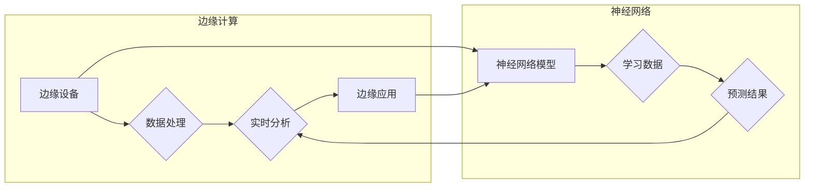

# 神经网络在边缘计算中的应用

> 关键词：神经网络，边缘计算，深度学习，边缘AI，计算优化，实时性，低功耗，边缘设备

## 1. 背景介绍

随着物联网（IoT）技术的飞速发展，边缘计算作为一种计算架构，正逐渐成为数据处理和分析的新兴领域。边缘计算将数据处理和计算能力从云端转移到网络边缘，即在数据产生的地方进行处理，从而减少数据传输延迟，提高系统响应速度，并降低带宽成本。

神经网络，特别是深度学习技术，在图像识别、语音识别、自然语言处理等领域取得了显著的成就。将神经网络应用于边缘计算，可以实现对实时数据的快速分析，为自动驾驶、智能监控、智能家居等场景提供强大的技术支持。

### 1.1 问题的由来

边缘计算环境中，设备资源有限，对实时性和低功耗有更高的要求。传统的神经网络模型由于计算复杂度高、参数量大，难以在边缘设备上实时运行。因此，如何将神经网络应用于边缘计算，实现实时、高效、低功耗的计算，成为了研究的热点。

### 1.2 研究现状

近年来，研究人员针对神经网络在边缘计算中的应用，开展了大量的研究工作，主要集中在以下几个方面：

- **模型压缩**：通过模型剪枝、量化、蒸馏等技术，减小模型规模，降低模型复杂度和计算量。
- **低精度计算**：使用低精度浮点数（如FP16、INT8）进行计算，降低计算资源消耗。
- **异构计算**：利用边缘设备上的多种计算资源（如CPU、GPU、FPGA）进行协同计算，提高计算效率。
- **硬件加速**：开发针对神经网络加速的专用硬件，如TPU、NPU等。

### 1.3 研究意义

将神经网络应用于边缘计算，具有重要的理论意义和应用价值：

- **提高实时性**：边缘计算可以实时处理数据，快速响应实时事件，满足实时性要求。
- **降低带宽成本**：减少数据传输量，降低网络带宽成本。
- **提高安全性**：数据在边缘设备上处理，降低了数据泄露的风险。
- **推动AI应用**：为边缘设备提供强大的计算能力，推动AI在更多领域的应用。

### 1.4 本文结构

本文将围绕神经网络在边缘计算中的应用展开，主要内容包括：

- 核心概念与联系
- 核心算法原理与具体操作步骤
- 数学模型与公式
- 项目实践
- 实际应用场景
- 工具和资源推荐
- 总结：未来发展趋势与挑战

## 2. 核心概念与联系

### 2.1 核心概念

- **边缘计算**：将数据处理和计算能力从云端转移到网络边缘，即在数据产生的地方进行处理。
- **神经网络**：一种模拟人脑神经元连接的数学模型，用于学习和预测数据模式。
- **深度学习**：一种利用多层神经网络进行数据学习和预测的技术。
- **模型压缩**：通过减少模型参数数量或计算量，减小模型规模。
- **低精度计算**：使用低精度浮点数进行计算，降低计算资源消耗。
- **异构计算**：利用多种计算资源进行协同计算，提高计算效率。
- **硬件加速**：开发针对神经网络加速的专用硬件。

### 2.2 联系

边缘计算与神经网络之间的联系如下：



边缘设备通过神经网络模型进行数据处理和实时分析，并将预测结果应用于边缘应用。

## 3. 核心算法原理 & 具体操作步骤

### 3.1 算法原理概述

神经网络在边缘计算中的应用，主要涉及以下核心算法：

- **模型压缩**：通过剪枝、量化、蒸馏等技术，减小模型规模，降低计算量。
- **低精度计算**：使用低精度浮点数进行计算，降低计算资源消耗。
- **异构计算**：利用边缘设备上的多种计算资源进行协同计算，提高计算效率。
- **硬件加速**：开发针对神经网络加速的专用硬件。

### 3.2 算法步骤详解

#### 3.2.1 模型压缩

**1. 剪枝**：通过移除网络中不重要的连接或神经元，减少模型参数数量。

**2. 量化**：将浮点数参数转换为低精度整数，降低存储和计算需求。

**3. 蒸馏**：将大模型的知识迁移到小模型中，保持模型性能。

#### 3.2.2 低精度计算

**1. 使用INT8精度进行计算**：将浮点数参数和激活函数转换为INT8整数，提高计算速度。

**2. 硬件支持**：使用支持低精度计算的硬件，如NVIDIA Tensor Cores。

#### 3.2.3 异构计算

**1. 选择合适的硬件**：根据任务特点，选择合适的计算资源，如CPU、GPU、FPGA等。

**2. 调度算法**：设计高效的调度算法，将任务分配到不同的硬件上。

#### 3.2.4 硬件加速

**1. 开发专用硬件**：开发针对神经网络加速的专用硬件，如TPU、NPU等。

**2. 驱动程序**：开发相应的驱动程序，支持专用硬件与软件栈的交互。

### 3.3 算法优缺点

#### 3.3.1 模型压缩

**优点**：减小模型规模，降低计算量，提高边缘设备性能。

**缺点**：可能导致模型性能下降。

#### 3.3.2 低精度计算

**优点**：提高计算速度，降低功耗。

**缺点**：可能导致精度下降。

#### 3.3.3 异构计算

**优点**：充分利用多种计算资源，提高计算效率。

**缺点**：系统设计复杂，调度算法难以设计。

#### 3.3.4 硬件加速

**优点**：大幅提高计算速度，降低功耗。

**缺点**：开发成本高，需要专用硬件支持。

### 3.4 算法应用领域

神经网络在边缘计算中的应用领域包括：

- **图像识别**：如人脸识别、物体检测等。
- **语音识别**：如语音识别、语音合成等。
- **自然语言处理**：如文本分类、机器翻译等。
- **自动驾驶**：如环境感知、决策规划等。
- **智能家居**：如智能安防、智能家居控制等。

## 4. 数学模型和公式 & 详细讲解 & 举例说明

### 4.1 数学模型构建

神经网络模型通常由多个层组成，包括输入层、隐藏层和输出层。每个层由多个神经元组成，神经元之间通过权重连接。神经元的激活函数通常为非线性函数。

假设神经网络模型为 $f(x)$，其中 $x$ 为输入向量，$w$ 为权重矩阵，$b$ 为偏置向量，$f$ 为激活函数。则：

$$
f(x) = \sigma(w^T x + b)
$$

其中 $\sigma$ 为激活函数，常用的激活函数包括ReLU、Sigmoid、Tanh等。

### 4.2 公式推导过程

以ReLU激活函数为例，其定义为：

$$
\sigma(x) = \begin{cases} 
x, & x \geq 0 \\
0, & x < 0 
\end{cases}
$$

### 4.3 案例分析与讲解

以下以简单的卷积神经网络（CNN）为例，讲解神经网络在图像识别中的应用。

#### 4.3.1 模型结构

CNN由卷积层、池化层、全连接层等组成。以下是一个简单的CNN模型结构：

```
[输入] --> [卷积层1] --> [池化层1] --> [卷积层2] --> [池化层2] --> [全连接层1] --> [全连接层2] --> [输出]
```

#### 4.3.2 模型训练

使用标注数据对CNN模型进行训练，包括以下步骤：

1. **前向传播**：将输入数据传递到网络中，计算输出结果。
2. **计算损失**：计算预测结果与真实标签之间的损失。
3. **反向传播**：根据损失函数，计算梯度，并更新模型参数。

#### 4.3.3 模型评估

使用测试数据对训练好的模型进行评估，包括准确率、召回率、F1值等指标。

## 5. 项目实践：代码实例和详细解释说明

### 5.1 开发环境搭建

以下以TensorFlow和Keras为例，讲解如何使用神经网络进行边缘计算。

1. 安装TensorFlow：

```bash
pip install tensorflow
```

2. 安装Keras：

```bash
pip install keras
```

### 5.2 源代码详细实现

以下是一个简单的CNN模型代码示例：

```python
import tensorflow as tf
from tensorflow.keras import layers

def create_cnn_model():
    model = tf.keras.Sequential()
    model.add(layers.Conv2D(32, (3, 3), activation='relu', input_shape=(64, 64, 3)))
    model.add(layers.MaxPooling2D((2, 2)))
    model.add(layers.Conv2D(64, (3, 3), activation='relu'))
    model.add(layers.MaxPooling2D((2, 2)))
    model.add(layers.Conv2D(64, (3, 3), activation='relu'))
    model.add(layers.Flatten())
    model.add(layers.Dense(64, activation='relu'))
    model.add(layers.Dense(10, activation='softmax'))
    return model

model = create_cnn_model()
model.compile(optimizer='adam', loss='categorical_crossentropy', metrics=['accuracy'])
model.fit(train_images, train_labels, epochs=10, validation_data=(test_images, test_labels))
```

### 5.3 代码解读与分析

- `create_cnn_model`函数定义了一个简单的CNN模型，包括卷积层、池化层和全连接层。
- `model.compile`函数配置模型训练参数，包括优化器、损失函数和评价指标。
- `model.fit`函数进行模型训练，包括训练数据和验证数据。

### 5.4 运行结果展示

运行代码后，模型会在训练集和验证集上进行训练，并在每个epoch结束后输出训练和验证集上的损失值和准确率。

## 6. 实际应用场景

### 6.1 智能安防

利用神经网络进行图像识别，实现对监控视频的实时分析，如人脸识别、车辆识别、异常行为检测等。

### 6.2 智能家居

利用神经网络进行语音识别和自然语言处理，实现对智能家居设备的语音控制，如智能音箱、智能门锁等。

### 6.3 自动驾驶

利用神经网络进行环境感知和决策规划，实现自动驾驶功能。

### 6.4 医疗诊断

利用神经网络进行医学图像识别，辅助医生进行疾病诊断。

### 6.5 工业自动化

利用神经网络进行设备状态监测和故障诊断，提高生产效率和安全性。

## 7. 工具和资源推荐

### 7.1 学习资源推荐

- 《深度学习》
- 《神经网络与深度学习》
- TensorFlow官方文档
- Keras官方文档

### 7.2 开发工具推荐

- TensorFlow
- Keras
- PyTorch
- ONNX

### 7.3 相关论文推荐

- "Deep Learning for Real-Time Edge Computing: A Survey"
- "Edge Computing for AI: Enabling Smart Applications at the Edge"
- "Neural Acceleration Hardware for Deep Learning at the Edge"

## 8. 总结：未来发展趋势与挑战

### 8.1 研究成果总结

本文系统地介绍了神经网络在边缘计算中的应用，包括核心概念、算法原理、项目实践和实际应用场景。通过模型压缩、低精度计算、异构计算和硬件加速等技术，神经网络在边缘计算中取得了显著的应用成果。

### 8.2 未来发展趋势

- **模型压缩**：进一步优化模型压缩算法，降低模型规模和计算量。
- **低精度计算**：探索更低精度的计算方式，如INT4、INT2等。
- **异构计算**：设计更高效的异构计算架构，提高计算效率。
- **硬件加速**：开发更高效的神经网络加速器，降低功耗和成本。

### 8.3 面临的挑战

- **模型性能与资源消耗的平衡**：如何在保证模型性能的前提下，降低计算资源消耗。
- **边缘设备异构性**：如何设计适用于不同边缘设备的神经网络模型。
- **数据安全和隐私保护**：如何确保边缘计算中的数据安全和隐私保护。

### 8.4 研究展望

未来，神经网络在边缘计算中的应用将面临更多挑战和机遇。随着人工智能技术的不断发展，相信神经网络在边缘计算中的应用将更加广泛，为人类社会带来更多便利。

## 9. 附录：常见问题与解答

**Q1：什么是边缘计算？**

A：边缘计算是一种计算架构，将数据处理和计算能力从云端转移到网络边缘，即在数据产生的地方进行处理。

**Q2：什么是神经网络？**

A：神经网络是一种模拟人脑神经元连接的数学模型，用于学习和预测数据模式。

**Q3：神经网络在边缘计算中有哪些应用？**

A：神经网络在边缘计算中的应用非常广泛，包括图像识别、语音识别、自然语言处理、自动驾驶、智能家居等。

**Q4：如何将神经网络应用于边缘计算？**

A：将神经网络应用于边缘计算，需要考虑模型压缩、低精度计算、异构计算和硬件加速等技术。

**Q5：边缘计算有哪些优势？**

A：边缘计算具有提高实时性、降低带宽成本、提高安全性等优势。

**Q6：边缘计算有哪些挑战？**

A：边缘计算面临着模型性能与资源消耗的平衡、边缘设备异构性、数据安全和隐私保护等挑战。

---

作者：禅与计算机程序设计艺术 / Zen and the Art of Computer Programming