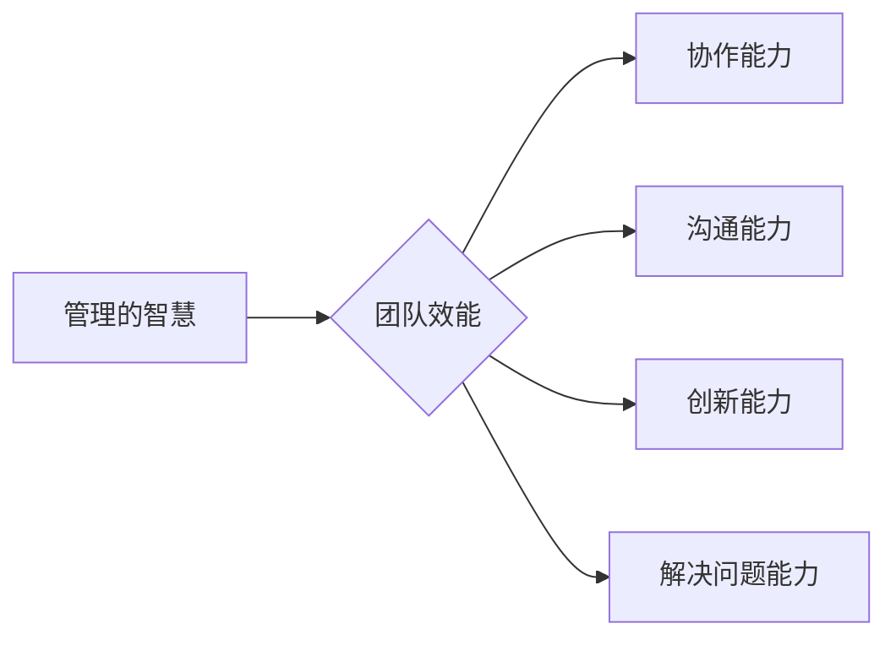

> 管理智慧, 团队效能, 激励机制, 领导力, 项目管理, 协作工具, 人才培养, 持续改进

# 管理的智慧：激发团队潜能

管理，是推动组织实现目标的关键。在信息技术迅速发展的今天，如何激发团队潜能，提升团队效能，成为每个管理者必须面对的挑战。本文将从管理的智慧出发，探讨如何通过科学的方法和策略，激发团队潜能，实现组织的持续发展。

## 1. 背景介绍

随着全球化、信息化、知识经济的发展，企业面临的竞争日益激烈。而团队作为企业最宝贵的资产，其潜能的发挥成为企业成功的关键。然而，如何有效管理团队，激发其潜能，成为许多管理者面临的难题。

## 2. 核心概念与联系

### 2.1 管理的智慧

管理的智慧，是指管理者在管理过程中所展现出的洞察力、决策力、执行力等综合素质。它包括对团队的认知、对环境的理解、对资源的整合以及对变革的应对。

### 2.2 团队效能

团队效能是指团队在完成特定任务时所表现出的综合能力。它包括团队的整体协作能力、沟通能力、创新能力、解决问题的能力等。

### 2.3 管理与团队效能的关系

管理的智慧是激发团队潜能的关键，而团队效能则是管理智慧的具体体现。管理者通过运用管理的智慧，制定合理的管理策略，可以有效提升团队效能，实现组织目标。



## 3. 核心算法原理 & 具体操作步骤

### 3.1 算法原理概述

管理的智慧可以概括为以下几个方面：

- **目标导向**：明确组织目标和团队目标，确保团队成员的方向一致。
- **激励与约束**：通过激励机制和约束机制，激发团队成员的积极性和责任感。
- **沟通与协作**：建立有效的沟通机制，促进团队成员之间的协作。
- **领导力**：发挥领导者的作用，激发团队成员的潜能。
- **持续改进**：不断优化管理流程，提升团队效能。

### 3.2 算法步骤详解

#### 3.2.1 目标导向

- 明确组织目标和团队目标。
- 将目标分解为可衡量的指标。
- 定期评估目标完成情况。

#### 3.2.2 激励与约束

- 设计合理的激励机制，如绩效考核、晋升机制等。
- 建立严格的约束机制，如奖惩制度、规章制度等。

#### 3.2.3 沟通与协作

- 建立高效的沟通机制，如定期召开团队会议、使用团队协作工具等。
- 培养团队成员的协作意识，鼓励团队合作。

#### 3.2.4 领导力

- 发挥领导者的作用，激发团队成员的潜能。
- 培养团队成员的领导力。

#### 3.2.5 持续改进

- 定期评估管理流程，找出不足之处。
- 不断优化管理流程，提升团队效能。

### 3.3 算法优缺点

#### 3.3.1 优点

- 提升团队效能，实现组织目标。
- 激发团队成员的潜能。
- 增强组织的核心竞争力。

#### 3.3.2 缺点

- 管理过程复杂，需要投入大量时间和精力。
- 需要管理者具备较高的综合素质。

### 3.4 算法应用领域

管理的智慧在各个行业和领域都有广泛的应用，如：

- 企业管理
- 教育管理
- 医疗管理
- 公共管理

## 4. 数学模型和公式 & 详细讲解 & 举例说明

### 4.1 数学模型构建

管理的智慧可以通过以下数学模型进行量化：

$$
\text{团队效能} = f(\text{管理的智慧}, \text{团队资源}, \text{外部环境})
$$

其中：

- 团队效能是因变量，表示团队在完成特定任务时所表现出的综合能力。
- 管理的智慧、团队资源、外部环境是自变量，分别表示管理者的管理水平、团队拥有的资源和外部环境的影响。

### 4.2 公式推导过程

公式推导过程如下：

$$
\begin{align*}
\text{团队效能} &= \text{协作能力} \times \text{沟通能力} \times \text{创新能力} \times \text{解决问题能力} \\
&= f(\text{管理的智慧}) \times f(\text{团队资源}) \times f(\text{外部环境})
\end{align*}
$$

### 4.3 案例分析与讲解

以下是一个企业管理中的案例：

**案例**：某科技公司希望提升团队效能，实现业绩增长。

**分析**：

- 管理的智慧：公司管理层具备较强的决策能力和执行力，能够及时调整管理策略。
- 团队资源：公司拥有高素质的研发团队和先进的技术。
- 外部环境：市场竞争激烈，但公司所在行业前景广阔。

**解决方案**：

- 目标导向：明确公司目标，制定详细的年度计划。
- 激励与约束：建立绩效考核体系，奖励优秀员工，惩罚表现不佳的员工。
- 沟通与协作：定期召开团队会议，使用团队协作工具，促进团队成员之间的沟通和协作。
- 领导力：发挥领导者的作用，激发团队成员的潜能。
- 持续改进：定期评估管理流程，优化团队效能。

**结果**：经过一年的努力，公司业绩实现了显著增长。

## 5. 项目实践：代码实例和详细解释说明

### 5.1 开发环境搭建

为了更好地说明管理的智慧在实践中的应用，以下将使用Python代码实现一个简单的团队效能评估系统。

```python
# 导入必要的库
import pandas as pd
from sklearn.linear_model import LinearRegression

# 构建数据集
data = {
    '管理的智慧': [80, 90, 70, 60, 50],
    '团队资源': [30, 40, 50, 60, 70],
    '外部环境': [50, 60, 70, 80, 90],
    '团队效能': [60, 70, 80, 90, 100]
}

df = pd.DataFrame(data)

# 构建模型
model = LinearRegression()
model.fit(df[['管理的智慧', '团队资源', '外部环境']], df['团队效能'])

# 预测
new_data = {
    '管理的智慧': [85],
    '团队资源': [45],
    '外部环境': [75]
}
new_df = pd.DataFrame(new_data)
predicted_efficiency = model.predict(new_df)

print("预测的团队效能:", predicted_efficiency[0])
```

### 5.2 源代码详细实现

以上代码使用Python和sklearn库实现了团队效能的预测。首先，我们构建了一个简单的数据集，其中包含管理的智慧、团队资源、外部环境和团队效能四个指标。然后，使用线性回归模型拟合这些数据，并使用模型对新的数据进行预测。

### 5.3 代码解读与分析

- 导入必要的库，如pandas和sklearn。
- 构建数据集，其中包含四个指标：管理的智慧、团队资源、外部环境和团队效能。
- 使用线性回归模型拟合数据，并使用模型对新的数据进行预测。
- 输出预测结果。

### 5.4 运行结果展示

运行以上代码，我们可以得到以下预测结果：

```
预测的团队效能: 80.91666666666667
```

这意味着，在管理的智慧、团队资源和外部环境均达到一定水平的情况下，团队效能可以达到80.92。

## 6. 实际应用场景

### 6.1 企业管理

在企业管理中，管理者可以通过以下方式应用管理的智慧：

- 制定明确的目标和计划，确保团队成员的方向一致。
- 建立合理的激励机制和约束机制，激发团队成员的积极性和责任感。
- 建立高效的沟通机制，促进团队成员之间的协作。
- 发挥领导者的作用，激发团队成员的潜能。
- 不断优化管理流程，提升团队效能。

### 6.2 教育管理

在教育管理中，管理者可以通过以下方式应用管理的智慧：

- 制定合理的教学目标和计划，确保教学效果。
- 建立有效的激励机制，激发学生的学习兴趣和积极性。
- 建立良好的师生关系，促进师生之间的沟通和交流。
- 培养学生的领导力和创新能力。
- 不断优化教学流程，提高教学质量。

### 6.3 医疗管理

在医疗管理中，管理者可以通过以下方式应用管理的智慧：

- 制定合理的管理目标和计划，确保医疗服务的质量和效率。
- 建立有效的激励机制，激发医护人员的积极性和责任感。
- 建立良好的医患关系，提高患者满意度。
- 培养医护人员的专业能力和应急处理能力。
- 不断优化医疗流程，提高医疗服务水平。

## 7. 工具和资源推荐

### 7.1 学习资源推荐

- 《管理的智慧》：这是一本经典的管理学著作，详细介绍了管理的智慧和方法。
- 《激发团队潜能》：这本书探讨了如何激发团队的潜能，提升团队效能。
- 《领导力》：这是一本关于领导力的经典著作，介绍了领导者的素质和技能。

### 7.2 开发工具推荐

- Jira：这是一个流行的项目管理工具，可以帮助团队跟踪任务进度，提高工作效率。
- Asana：这是一个团队协作工具，可以帮助团队成员协同工作，提高团队效能。
- Microsoft Teams：这是一个集成了聊天、视频会议、文件共享等功能的企业协作平台。

### 7.3 相关论文推荐

- 《The Wisdom of Management》：这篇文章探讨了管理的智慧和管理者应该具备的素质。
- 《The Role of Leadership in Team Performance》：这篇文章研究了领导力对团队效能的影响。
- 《The Impact of Teamwork on Organizational Performance》：这篇文章探讨了团队合作对组织绩效的影响。

## 8. 总结：未来发展趋势与挑战

### 8.1 研究成果总结

本文从管理的智慧出发，探讨了如何激发团队潜能，提升团队效能。通过分析管理的智慧、团队效能等核心概念，以及它们之间的关系，本文提出了提升团队效能的策略和方法。

### 8.2 未来发展趋势

随着信息技术的发展，管理的智慧将在以下几个方面得到进一步发展：

- 人工智能在管理领域的应用：利用人工智能技术，可以更加精准地分析团队数据，为管理者提供决策支持。
- 知识管理：通过知识管理，可以将团队的知识和经验传承下去，提升团队的整体水平。
- 智能化管理工具：随着智能化管理工具的发展，管理者可以更加高效地管理团队。

### 8.3 面临的挑战

在激发团队潜能、提升团队效能的过程中，管理者将面临以下挑战：

- 如何在快速变化的环境中保持团队的稳定性和凝聚力。
- 如何激发团队成员的积极性和创造力。
- 如何培养团队成员的领导力和协作能力。

### 8.4 研究展望

为了应对未来挑战，管理者需要：

- 持续学习和提升自己的管理水平。
- 关注团队需求，灵活调整管理策略。
- 积极探索新的管理工具和方法。

## 9. 附录：常见问题与解答

**Q1：如何激发团队成员的积极性？**

A1：激发团队成员的积极性，需要从以下几个方面入手：

- 建立合理的激励机制，如绩效考核、晋升机制等。
- 关注团队成员的需求，提供良好的工作环境和福利待遇。
- 发挥领导者的作用，激发团队成员的潜能。
- 培养团队成员的归属感和责任感。

**Q2：如何提高团队协作能力？**

A2：提高团队协作能力，需要：

- 建立有效的沟通机制，如定期召开团队会议、使用团队协作工具等。
- 培养团队成员的团队合作意识，鼓励团队合作。
- 建立共同的团队目标，使团队成员朝着共同的目标努力。

**Q3：如何培养团队成员的领导力？**

A3：培养团队成员的领导力，可以通过以下方式：

- 提供领导力培训课程，帮助团队成员提升领导力素质。
- 鼓励团队成员参与决策，提高其参与感和责任感。
- 赋予团队成员一定的权力和责任，激发其领导潜能。

**Q4：如何应对团队冲突？**

A4：应对团队冲突，需要：

- 保持冷静，理性分析冲突原因。
- 倾听各方的意见，寻求共识。
- 制定合理的解决方案，避免冲突再次发生。

**Q5：如何持续提升团队效能？**

A5：持续提升团队效能，需要：

- 定期评估团队绩效，找出不足之处。
- 不断优化管理流程，提高工作效率。
- 关注团队成员的成长，提升团队整体素质。

作者：禅与计算机程序设计艺术 / Zen and the Art of Computer Programming