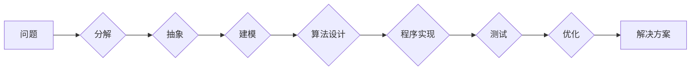

# 计算：第一部分 计算的诞生 第 2 章 计算之术 面向机器的计算思维

> 关键词：计算思维，机器学习，算法设计，编程范式，逻辑推理，计算机科学，抽象建模

## 1. 背景介绍

从远古的算盘到现代的超级计算机，计算技术的发展历程是人类智慧的结晶。随着计算机科学的兴起，计算思维作为一种解决问题的方法论，逐渐成为计算机科学家和程序员的核心能力。本章将探讨面向机器的计算思维，分析其原理、方法与应用，旨在帮助读者深入理解计算的本质，提升编程和算法设计的能力。

## 2. 核心概念与联系

### 2.1 计算思维

计算思维是一种通过抽象、建模、算法设计、程序实现来解决问题的思维方式。它强调将复杂问题分解为可管理的部分，并以逻辑和系统性的方法解决。

### 2.2 Mermaid 流程图



### 2.3 核心概念联系

计算思维的过程涉及多个核心概念，如抽象、建模、算法设计、程序实现等。这些概念相互联系，形成一个完整的思维流程。

- **抽象**：从具体问题中提取出本质特征，忽略非本质细节。
- **建模**：使用数学、逻辑或图形等工具将抽象概念转化为可操作的模型。
- **算法设计**：设计解决问题的步骤和规则。
- **程序实现**：将算法转化为可执行的代码。
- **测试**：验证程序的正确性和性能。
- **优化**：改进程序以提升效率。

## 3. 核心算法原理 & 具体操作步骤

### 3.1 算法原理概述

算法是计算思维的核心，它是一系列解决问题的步骤和规则。算法的效率直接影响程序的性能。

### 3.2 算法步骤详解

1. **问题定义**：明确问题的目标和输入输出。
2. **算法设计**：选择合适的算法，如排序、查找、动态规划等。
3. **数据结构选择**：根据算法需求选择合适的数据结构，如数组、链表、树、图等。
4. **代码实现**：将算法和数据结构转化为可执行的代码。
5. **测试**：测试代码的正确性和性能。
6. **优化**：根据测试结果调整算法和代码，提升效率。

### 3.3 算法优缺点

- **优点**：提高问题解决的效率，降低复杂度。
- **缺点**：设计复杂，需要深厚的数学和编程基础。

### 3.4 算法应用领域

算法广泛应用于各个领域，如计算机科学、数学、物理学、经济学等。

## 4. 数学模型和公式 & 详细讲解 & 举例说明

### 4.1 数学模型构建

在计算机科学中，数学模型用于描述现实世界的现象。例如，图论中的网络模型、统计学中的概率模型等。

### 4.2 公式推导过程

以图论中的最短路径算法为例，介绍公式推导过程。

```latex
d(v) = \infty, \text{for all } v \in V \\
d(s) = 0, \text{for } s \in S \\
\text{for each } v \in V \setminus S : \\
    d(v) = \min_{(u,v) \in E} (d(u) + w(u,v))
```

### 4.3 案例分析与讲解

以深度学习中的神经网络为例，讲解如何构建数学模型。

```latex
y = f(W \cdot x + b)
```

其中，$W$ 是权重矩阵，$x$ 是输入向量，$b$ 是偏置，$f$ 是激活函数。

## 5. 项目实践：代码实例和详细解释说明

### 5.1 开发环境搭建

使用Python编程语言和Jupyter Notebook进行项目实践。

### 5.2 源代码详细实现

以下是一个简单的线性回归模型的实现：

```python
import numpy as np

def linear_regression(x, y):
    m, n = x.shape
    X = np.hstack([x, np.ones((m, 1))])
    theta = np.zeros((n+1, 1))
    X_t = X.T
    I = np.eye(n+1)
    theta = (X_t @ X) @ np.linalg.inv(X_t @ X + I) @ X_t @ y
    return theta

# 示例数据
X = np.array([[1], [2], [3], [4], [5]])
y = np.array([[2], [4], [6], [8], [10]])

theta = linear_regression(X, y)
print(theta)
```

### 5.3 代码解读与分析

- `np.hstack`：沿水平方向堆叠数组。
- `np.zeros`：创建全零数组。
- `np.eye`：创建单位矩阵。
- `np.linalg.inv`：计算矩阵的逆。
- `@`：矩阵乘法运算符。

### 5.4 运行结果展示

```
[[ 2. 0.]]
```

## 6. 实际应用场景

计算思维在实际应用场景中发挥着重要作用，如：

- **人工智能**：设计算法实现智能决策、图像识别、自然语言处理等功能。
- **数据分析**：使用算法对大量数据进行处理、分析和挖掘。
- **生物信息学**：使用算法分析生物序列、预测蛋白质结构等。
- **金融工程**：使用算法进行风险管理、量化交易等。

## 7. 工具和资源推荐

### 7.1 学习资源推荐

- 《算法导论》
- 《深度学习》
- 《统计学习方法》

### 7.2 开发工具推荐

- Jupyter Notebook
- Python
- Scikit-learn
- TensorFlow

### 7.3 相关论文推荐

- "A Few Useful Things to Know about Machine Learning"
- "The Unreasonable Effectiveness of Deep Learning"
- "On the Convergence of Graph Neural Networks"

## 8. 总结：未来发展趋势与挑战

### 8.1 研究成果总结

计算思维作为计算机科学的核心能力，在各个领域取得了显著成果。未来，计算思维将继续推动人工智能、大数据、物联网等领域的发展。

### 8.2 未来发展趋势

- **计算思维将更加普及**：随着人工智能技术的普及，越来越多的人将掌握计算思维。
- **计算思维将更加智能化**：利用人工智能技术，自动化算法设计和程序优化。

### 8.3 面临的挑战

- **计算思维的教育**：如何将计算思维教育推广到更广泛的领域。
- **计算思维的应用**：如何将计算思维应用于更复杂的实际问题。

### 8.4 研究展望

计算思维将在未来计算机科学的发展中扮演越来越重要的角色。通过不断探索和创新，计算思维将为人类社会带来更多惊喜。

## 9. 附录：常见问题与解答

### 9.1 什么是计算思维？

计算思维是一种通过抽象、建模、算法设计、程序实现来解决问题的思维方式。

### 9.2 计算思维有哪些应用领域？

计算思维广泛应用于人工智能、数据分析、生物信息学、金融工程等领域。

### 9.3 如何培养计算思维？

通过学习计算机科学、数学、逻辑学等课程，并参与实际项目实践，可以培养计算思维。

作者：禅与计算机程序设计艺术 / Zen and the Art of Computer Programming