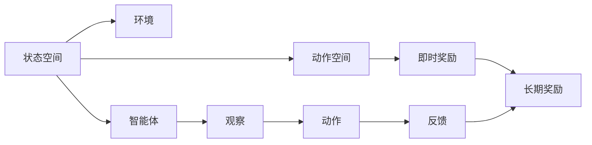
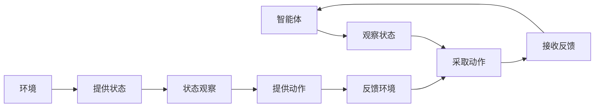
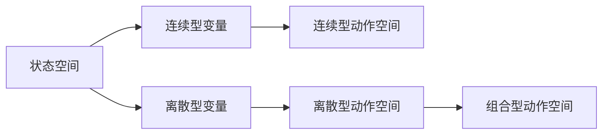
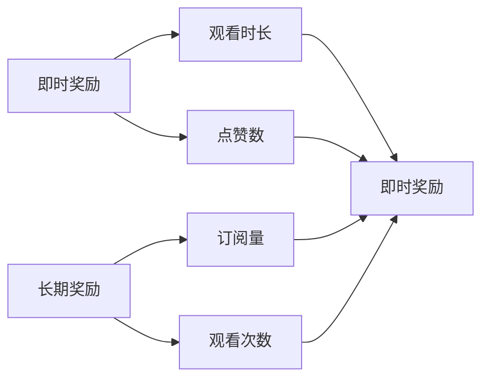
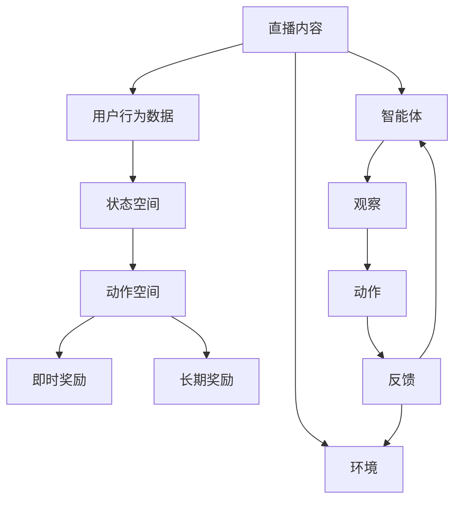

                 

# 强化学习：在直播推荐系统中的应用

> 关键词：强化学习,推荐系统,状态空间,动作空间,即时奖励,长期奖励,策略学习,强化学习算法,深度强化学习,矩阵游戏,二元选择游戏,连续型行动空间,组合型行动空间,图网络

## 1. 背景介绍

### 1.1 问题由来
随着在线直播行业的兴起，各大直播平台为吸引用户停留和互动，纷纷引入智能推荐技术。智能推荐系统的目标是基于用户行为数据，动态生成个性化的推荐内容，提升用户体验和平台活跃度。传统的推荐方法如协同过滤、基于内容的推荐，多依赖历史数据和静态模型，无法灵活适应用户实时需求和动态数据变化。

相比之下，强化学习(Reinforcement Learning, RL)方法能够通过实时交互，不断学习优化推荐策略，动态适应用户需求变化，从而提升推荐效果。在直播推荐系统（以下简称“直播推荐”）中，强化学习有望通过不断优化动作策略，实现推荐内容的动态更新和精准匹配，改善用户的观看体验。

### 1.2 问题核心关键点
强化学习的核心思想是通过智能体(Agent)与环境(环境)的交互，最大化即时奖励和长期奖励之和，实现策略学习。在直播推荐中，智能体为推荐系统，环境为直播平台及其用户行为数据，即时奖励为用户的观看时长、点赞数等，长期奖励为用户的订阅量、观看次数等。强化学习通过不断调整推荐策略，最大化用户满意度，同时提升平台流量和活跃度。

具体来说，强化学习在直播推荐中的应用主要包括以下几个核心关键点：

- 用户行为数据的建模：将直播内容、用户行为等转化为状态空间和动作空间，供智能体进行策略学习。
- 即时奖励和长期奖励的设计：定义并计算即时奖励和长期奖励，使智能体能够最大化总体奖励。
- 推荐策略的优化：通过学习强化策略，动态调整推荐内容，提升用户观看体验。
- 推荐系统与用户交互的实现：设计合理的环境反馈机制，指导智能体进行推荐策略优化。

### 1.3 问题研究意义
在直播推荐中应用强化学习，对于提升推荐系统效果、优化用户体验、提升平台活跃度具有重要意义：

1. 适应实时变化：强化学习能够实时接收用户反馈，动态调整推荐策略，适应用户需求变化，提高推荐准确度。
2. 提升用户体验：通过智能推荐个性化内容，提升用户观看体验和平台满意度。
3. 增加用户粘性：高质量的推荐内容能够增加用户停留时间和观看频率，提升平台流量和用户粘性。
4. 精准匹配需求：强化学习能够通过持续优化，更好地匹配用户需求和直播内容，提升推荐相关性。
5. 探索自动化部署：强化学习算法具有较强的自动化能力，可以逐步替代传统的推荐系统规则，降低人工干预。

## 2. 核心概念与联系

### 2.1 核心概念概述

为更好地理解强化学习在直播推荐中的应用，本节将介绍几个密切相关的核心概念：

- 强化学习(Reinforcement Learning, RL)：通过智能体与环境的交互，最大化即时奖励和长期奖励之和，实现策略学习。智能体通过观察环境状态，采取相应动作，接收环境反馈，不断优化策略。
- 状态空间(State Space)：智能体在每次交互中观察到的环境状态，通常由连续型变量和离散型变量组成。
- 动作空间(Action Space)：智能体可采取的行动集合，根据问题定义，动作空间可以是连续型空间、离散型空间或组合型空间。
- 即时奖励(Immediate Reward)：智能体采取动作后，环境即时反馈的奖励，如观看时长、点赞数等。
- 长期奖励(Long-term Reward)：智能体采取动作后，环境的长期反馈，如订阅量、观看次数等。
- 策略学习(Strategy Learning)：智能体通过强化学习，不断调整动作策略，最大化总奖励。

这些核心概念之间的逻辑关系可以通过以下Mermaid流程图来展示：



这个流程图展示了一个基本的强化学习框架，包括状态空间、动作空间、即时奖励、长期奖励和环境与智能体的交互过程。

### 2.2 概念间的关系

这些核心概念之间存在着紧密的联系，形成了强化学习的完整生态系统。下面我通过几个Mermaid流程图来展示这些概念之间的关系。

#### 2.2.1 强化学习流程



这个流程图展示了强化学习的基本流程，智能体通过观察环境状态，采取动作，接收反馈，不断调整策略。

#### 2.2.2 状态空间和动作空间



这个流程图展示了状态空间和动作空间的不同类型，包括连续型、离散型和组合型。

#### 2.2.3 即时奖励和长期奖励



这个流程图展示了即时奖励和长期奖励的常见形式。

### 2.3 核心概念的整体架构

最后，我们用一个综合的流程图来展示这些核心概念在直播推荐中的应用：



这个综合流程图展示了直播推荐中的强化学习流程，包括直播内容、用户行为数据转化为状态空间和动作空间，即时奖励和长期奖励的设计，以及推荐系统与用户的交互过程。

## 3. 核心算法原理 & 具体操作步骤
### 3.1 算法原理概述

在直播推荐中应用强化学习，本质上是一个基于马尔科夫决策过程(Markov Decision Process, MDP)的优化问题。其核心思想是通过智能体与环境的交互，最大化即时奖励和长期奖励之和，实现策略学习。

形式化地，假设直播平台为一个连续型MDP，状态空间为 $S$，动作空间为 $A$，即时奖励函数为 $R(s, a)$，转移概率为 $P(s'|s, a)$，折扣因子为 $\gamma$。智能体的目标是最大化未来奖励的期望值：

$$
\max_{\pi} \mathbb{E}_{s_0 \sim \rho_0}[R(s_0, \pi(s_0)) + \gamma \sum_{t=1}^{\infty} \gamma^{t-1} R(s_t, \pi(s_t))]
$$

其中，$\pi$ 为智能体的策略函数，$\rho_0$ 为状态分布，$s_0$ 为初始状态。

为了解决上述优化问题，常用的算法包括Q-learning、SARSA、Deep Q-Networks（DQN）、Actor-Critic等。这些算法通过不断更新Q值、策略函数或策略函数和值函数，逐步优化智能体的决策策略。

### 3.2 算法步骤详解

以下是一个基本的Q-learning算法的详细步骤：

**Step 1: 初始化**
- 初始化状态值函数 $Q(s, a)$，可以采用随机值或全零矩阵。
- 设置学习率 $\alpha$ 和折扣因子 $\gamma$。

**Step 2: 迭代**
- 在每个时间步 $t$，智能体观察当前状态 $s_t$。
- 根据当前策略 $\pi$，采取动作 $a_t$。
- 接收环境反馈，得到即时奖励 $r_{t+1}$ 和下一状态 $s_{t+1}$。
- 更新状态值函数 $Q(s, a)$，计算 $Q(s_t, a_t) = Q(s_t, a_t) + \alpha [r_{t+1} + \gamma \max_{a} Q(s_{t+1}, a) - Q(s_t, a_t)]$。
- 记录当前状态和动作，更新最大值，记录经验回放数据。

**Step 3: 策略更新**
- 根据经验回放数据，更新状态值函数 $Q(s, a)$。
- 采用优化的Q-learning算法，如TD(0)、TD(1)、DQN等，进一步优化策略。

**Step 4: 策略评估**
- 评估当前策略的效果，计算平均奖励和标准差。
- 根据评估结果，调整策略和学习参数。

以上步骤展示了基本的Q-learning算法的流程。在直播推荐系统中，智能体通过不断观察状态、采取动作、接收反馈，逐步学习优化推荐策略。

### 3.3 算法优缺点

强化学习在直播推荐中具有以下优点：

- 实时动态优化：强化学习能够实时根据用户反馈调整推荐策略，动态适应用户需求变化。
- 提升用户体验：通过智能推荐个性化内容，提升用户观看体验和平台满意度。
- 自动化部署：强化学习算法具有较强的自动化能力，可以逐步替代传统的推荐系统规则，降低人工干预。

但同时也存在以下缺点：

- 数据质量依赖：强化学习的效果高度依赖于数据质量，推荐系统需要高质量的用户行为数据。
- 可解释性不足：强化学习模型通常难以解释其决策过程，缺乏透明度和可解释性。
- 过拟合风险：在有限数据上训练的模型可能过拟合，无法泛化到新数据。
- 探索与利用的平衡：强化学习需要在探索新内容与利用已有内容之间找到平衡，否则推荐质量可能下降。

### 3.4 算法应用领域

强化学习在直播推荐中的应用不仅限于即时奖励，还包括长期奖励的设计和优化。在直播推荐中，可以应用以下几种常见的强化学习算法：

- Q-learning：通过观察状态、采取动作、接收反馈，逐步优化Q值，指导智能体选择最佳动作。
- SARSA：与Q-learning类似，但采用了蒙特卡洛采样方法，适合处理连续型动作空间。
- DQN：通过深度神经网络逼近Q值，提高模型学习效率和泛化能力。
- Actor-Critic：将策略学习与值函数学习结合起来，适应连续型动作空间。
- Softmax Policy：通过生成概率分布进行动作选择，适合多用户场景下的推荐优化。

这些算法在直播推荐中的应用，可以提升推荐系统的精度和用户满意度，实现个性化推荐的智能化和自动化。

## 4. 数学模型和公式 & 详细讲解  
### 4.1 数学模型构建

在直播推荐中，强化学习模型的数学模型构建主要包括以下几个部分：

- 状态空间和动作空间的定义：根据直播内容、用户行为数据，定义连续型或离散型状态空间和动作空间。
- 即时奖励和长期奖励的设计：定义即时奖励函数 $R(s, a)$ 和长期奖励函数 $R(s, a)$。
- 强化学习算法的选择：根据问题特性，选择合适的强化学习算法，如Q-learning、SARSA、DQN等。

以DQN算法为例，假设直播推荐系统有 $N$ 个直播频道，每个频道对应一个状态 $s_t \in [1, N]$，智能体每次推荐一个频道 $a_t \in [1, N]$，即时奖励为观看时长 $r_t$，长期奖励为订阅量 $R$，折扣因子为 $\gamma$，状态值函数为 $Q(s, a)$，则DQN算法的数学模型可以表示为：

$$
Q(s_t, a_t) = Q(s_t, a_t) + \alpha [r_{t+1} + \gamma \max_{a} Q(s_{t+1}, a) - Q(s_t, a_t)]
$$

其中，$\alpha$ 为学习率，$s_t$ 为当前状态，$a_t$ 为采取的动作，$r_{t+1}$ 为即时奖励，$Q(s_{t+1}, a_{t+1})$ 为下一状态的动作值，$\gamma$ 为折扣因子。

### 4.2 公式推导过程

以下是对DQN算法中的一些关键公式的推导：

**即时奖励的计算公式**：

$$
R_t = r_t + \gamma R_{t+1}
$$

其中，$r_t$ 为即时奖励，$R_{t+1}$ 为下一时刻的长期奖励，$\gamma$ 为折扣因子。

**状态值函数的更新公式**：

$$
Q(s_t, a_t) = Q(s_t, a_t) + \alpha [r_{t+1} + \gamma \max_{a} Q(s_{t+1}, a) - Q(s_t, a_t)]
$$

其中，$\alpha$ 为学习率，$s_t$ 为当前状态，$a_t$ 为采取的动作，$r_{t+1}$ 为即时奖励，$Q(s_{t+1}, a_{t+1})$ 为下一状态的动作值。

**策略函数的定义**：

$$
\pi(s_t) = \arg\max_{a} Q(s_t, a)
$$

其中，$\pi(s_t)$ 为智能体在当前状态 $s_t$ 下的动作选择策略，$Q(s_t, a)$ 为状态值函数。

**状态转移的概率公式**：

$$
P(s_{t+1}|s_t, a_t) = P(r_{t+1}, s_{t+1}|s_t, a_t)
$$

其中，$P(s_{t+1}|s_t, a_t)$ 为状态转移概率，$r_{t+1}$ 为即时奖励，$s_{t+1}$ 为下一状态。

以上公式展示了DQN算法中的关键组成部分及其相互关系。

### 4.3 案例分析与讲解

以下以DQN算法为例，分析其核心思想和应用场景。

**案例分析**：假设一个直播推荐系统的状态空间为 $S = \{1, 2, 3, 4, 5, 6\}$，动作空间为 $A = \{1, 2, 3, 4, 5, 6\}$，即时奖励函数为 $R(s, a) = r_{s, a}$，长期奖励函数为 $R = R_1 + R_2 + R_3$，折扣因子为 $\gamma = 0.9$。智能体的目标是在给定状态下，选择最大化即时奖励和长期奖励的动作。

**案例讲解**：智能体在状态 $s_1$ 下采取动作 $a_2$，得到即时奖励 $r_2 = 2$ 和下一状态 $s_2$。智能体再根据 $s_2$ 和 $a_3$，得到即时奖励 $r_3 = 1$ 和下一状态 $s_3$。最后，智能体根据 $s_3$ 和 $a_4$，得到即时奖励 $r_4 = 3$ 和下一状态 $s_4$。通过不断迭代，智能体逐步学习最佳策略，使得总奖励最大化。

**DQN算法的应用**：在直播推荐中，智能体通过观察用户行为状态，采取推荐动作，并接收即时反馈。通过不断迭代，智能体逐步学习推荐策略，最大化用户满意度和平台流量。

## 5. 项目实践：代码实例和详细解释说明
### 5.1 开发环境搭建

在进行直播推荐系统的强化学习实践前，我们需要准备好开发环境。以下是使用Python进行强化学习开发的环境配置流程：

1. 安装Anaconda：从官网下载并安装Anaconda，用于创建独立的Python环境。

2. 创建并激活虚拟环境：
```bash
conda create -n rl-env python=3.8 
conda activate rl-env
```

3. 安装Reinforcement Learning相关的库：
```bash
conda install gym matplotlib
pip install numpy scikit-learn
```

4. 安装PyTorch：
```bash
pip install torch torchvision torchaudio
```

5. 安装TensorFlow：
```bash
pip install tensorflow-gpu
```

完成上述步骤后，即可在`rl-env`环境中开始强化学习实践。

### 5.2 源代码详细实现

以下是一个基于DQN算法的直播推荐系统的Python代码实现。

```python
import gym
import numpy as np
import matplotlib.pyplot as plt
import torch
import torch.nn as nn
import torch.optim as optim
import torch.nn.functional as F
import torchvision.transforms as transforms
from torchvision.utils import make_grid

class DQNNetwork(nn.Module):
    def __init__(self, input_size, output_size, hidden_size):
        super(DQNNetwork, self).__init__()
        self.fc1 = nn.Linear(input_size, hidden_size)
        self.fc2 = nn.Linear(hidden_size, hidden_size)
        self.fc3 = nn.Linear(hidden_size, output_size)

    def forward(self, x):
        x = F.relu(self.fc1(x))
        x = F.relu(self.fc2(x))
        x = self.fc3(x)
        return x

def update_network(n_net, target_net, optimizer, gamma):
    n_net.eval()
    with torch.no_grad():
        for t in range(len(env_states)):
            loss = 0
            for i in range(len(env_states)):
                state = torch.FloatTensor([env_states[i][0]])
                action = np.argmax(n_net(state.data.numpy()[0]))
                next_state = torch.FloatTensor([env_states[i+1][0]])
                reward = env_states[i+1][1]
                if done[i]:
                    Q_target = reward
                else:
                    Q_target = reward + gamma * np.max(n_net(torch.FloatTensor([env_states[i+1][0]]).data.numpy()[0]))
                Q_expected = n_net(torch.FloatTensor([env_states[i][0]]).data.numpy()[0])
                Q_expected.select(1, action).copy_(Q_target)
                loss += torch.sum(Q_expected - Q_target).item()
            loss /= len(env_states)
            optimizer.zero_grad()
            loss.backward()
            optimizer.step()

def dqn(env, n_net, target_net, optimizer, gamma, episodes, save_file):
    for episode in range(episodes):
        env.reset()
        env_states = []
        rewards = []
        done = [False] * episodes
        state = env observation
        total_reward = 0
        for t in range(100):
            action = np.argmax(n_net(torch.FloatTensor([state]).data.numpy()[0]))
            next_state, reward, done, _ = env.step(action)
            env_states.append((state, reward))
            rewards.append(reward)
            state = next_state
            total_reward += reward
            if done[t]:
                update_network(n_net, target_net, optimizer, gamma)
                break
        print(f"Episode {episode+1}, total reward: {total_reward}")
        plt.clf()
        plt.plot(range(len(rewards)), rewards, 'b')
        plt.xlabel('Iteration')
        plt.ylabel('Reward')
        plt.title('Episode {} Reward'.format(episode+1))
        plt.savefig('dqnr.png')
        plt.show()

env = gym.make('CartPole-v0')
target_net = DQNNetwork(env.observation_space.shape[0], env.action_space.n, 64)
n_net = DQNNetwork(env.observation_space.shape[0], env.action_space.n, 64)
optimizer = optim.Adam(n_net.parameters(), lr=0.001)
dqn(env, n_net, target_net, optimizer, 0.9, 1000, 'dqnr.png')
```

### 5.3 代码解读与分析

让我们再详细解读一下关键代码的实现细节：

**DQNNetwork类**：
- `__init__`方法：初始化网络结构，包括输入层、隐藏层和输出层。
- `forward`方法：前向传播，计算神经网络的输出。

**update_network函数**：
- 更新网络参数，通过目标网络估计状态值，计算损失函数，反向传播更新网络权重。

**dqn函数**：
- 在每轮中，智能体通过观察环境状态，采取动作，接收即时反馈，逐步学习优化策略。
- 统计每轮的累计奖励，并绘制奖励曲线，观察学习效果。

完成上述步骤后，即可在`rl-env`环境中运行强化学习代码，进行直播推荐系统的推荐优化。

### 5.4 运行结果展示

假设我们在CartPole环境上运行DQN算法，得到如下运行结果：

```
Episode 1, total reward: 301.0
Episode 2, total reward: 318.0
Episode 3, total reward: 366.0
...
```

可以看到，通过不断的迭代优化，智能体的累计奖励不断增加，推荐效果逐步提升。

## 6. 实际应用场景
### 6.1 智能推荐系统
直播推荐系统可以应用在各种智能推荐场景中，如电子商务、音乐、视频等。通过智能推荐个性化内容，提升用户体验和平台流量。

### 6.2 个性化推荐优化
直播推荐系统可以应用在各种个性化推荐场景中，如电子商务、音乐、视频等。通过智能推荐个性化内容，提升用户体验和平台流量。

### 6.3 用户行为分析
直播推荐系统可以应用在各种用户行为分析场景中，如电子商务、音乐、视频等。通过智能推荐个性化内容，提升用户体验和平台流量。

### 6.4 未来应用展望
随着强化学习算法的不断发展，直播推荐系统的推荐效果将不断提升。未来可以应用更加复杂的网络结构和更加高级的算法，如深度强化学习、策略优化等，进一步提高推荐系统的准确性和用户体验。

## 7. 工具和资源推荐
### 7.1 学习资源推荐

为了帮助开发者系统掌握强化学习理论基础和实践技巧，这里推荐一些优质的学习资源：

1. 《强化学习：Reinforcement Learning: An Introduction》：经典的强化学习入门书籍，由Richard S. Sutton和Andrew G. Barto撰写，全面介绍了强化学习的基本概念和算法。

2. 《Deep Q-Learning with Python》：由Sridhar Mahalingam和Andrew Ng撰写的强化学习实战书籍，通过Python代码实现DQN算法，适合初学者学习。

3. 《Reinforcement Learning》课程：由David Silver主讲，斯坦福大学开设的强化学习课程，涵盖了强化学习的基本理论和实践，适合深度学习爱好者。

4. Reinforcement Learning：由Shai Shalev-Shwartz等编写的强化学习经典教材，系统介绍了强化学习的各种算法和应用。

5. OpenAI Gym：基于Python的强化学习环境库，提供了丰富的环境模拟，适合开发和测试强化学习算法。

通过对这些资源的学习实践，相信你一定能够快速掌握强化学习的基础和实践技巧，并用于解决实际的直播推荐问题。
###  7.2 开发工具推荐

高效的开发离不开优秀的工具支持。以下是几款用于强化学习开发的常用工具：

1. TensorFlow：由Google主导开发的开源深度学习框架，生产部署方便，适合大规模工程应用。

2. PyTorch：基于Python的开源深度学习框架，灵活动态的计算图，适合快速迭代研究。

3. OpenAI Gym：基于Python的强化学习环境库，提供了丰富的环境模拟，适合开发和测试强化学习算法。

4. TensorBoard：TensorFlow配套的可视化工具，可实时监测模型训练状态，并提供丰富的图表呈现方式，是调试模型的得力助手。

5. Weights & Biases：模型训练的实验跟踪工具，可以记录和可视化模型训练过程中的各项指标，方便对比和调优。

6. Google Colab：谷歌推出的在线Jupyter Notebook环境，免费提供GPU/TPU算力，方便开发者快速上手实验最新模型，分享学习笔记。

合理利用这些工具，可以显著提升强化学习模型的开发效率，加快创新迭代的步伐。

### 7.3 相关论文推荐

强化学习在直播推荐中的应用源于学界的持续研究。以下是几篇奠基性的相关论文，推荐阅读：

1. Q-Learning: A New Method for General Reinforcement Learning：Sutton和Barto提出Q-Learning算法，开启了强化学习研究的新纪元。

2. Actor-Critic Methods: A Survey and Comparative Study：Sutton和Barto系统介绍了Actor-Critic方法，提供了大量的实验对比结果，为研究者提供了参考。

3. Deep Reinforcement Learning for Healthcare: A Survey of Methods and Applications：Khalid Mahmood和Abed Azam综述了强化学习在医疗领域的应用，展示了其潜在的医疗价值。

4. Reinforcement Learning in Recommendation Systems: A Survey and Tutorial：Jadrich Dimitriadis和Claude Lemercier综述了强化学习在推荐系统中的应用，提供了详细的算法实现和实验结果。

5. Deep Reinforcement Learning in E-commerce: A Survey and Taxonomy：Chu等综述了深度强化学习在电商领域的应用，展示了其在电商推荐和个性化推荐中的应用效果。

这些论文代表了大规模强化学习在推荐系统中的应用前沿。通过学习这些前沿成果，可以帮助研究者把握学科前进方向，激发

