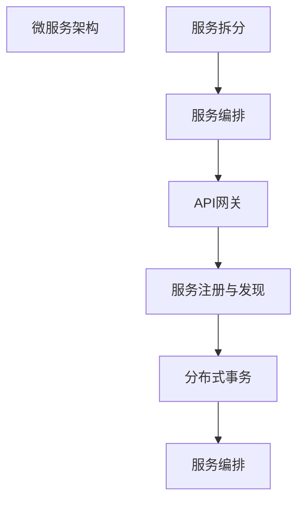

                 

# 微服务架构在高扩展性中的实例应用

## 1. 背景介绍

### 1.1 问题由来
随着互联网技术的快速发展，企业应用规模不断扩大，业务复杂度日益增加，传统的单体架构（Monolithic Architecture）已经无法满足日益增长的业务需求。单体架构的单一部署单元、单一数据库、代码交织等问题，导致系统的维护和扩展变得极为困难。为了应对这些挑战，微服务架构（Microservices Architecture）应运而生。

微服务架构是一种基于组件化的系统设计方法，通过将应用程序拆分为多个独立部署、独立运行的小服务，提升系统的可扩展性、可维护性和可用性。每个微服务独立运行，相互之间通过轻量级的接口进行通信。该架构的核心思想是通过解耦合、自治、快速迭代等机制，解决单体架构的问题，满足企业的持续创新需求。

### 1.2 问题核心关键点
微服务架构的核心理念是“拆”和“合”。拆，即将大型应用拆分成一系列细粒度、高内聚的独立服务；合，则是通过服务间调用，实现跨服务的功能协同。微服务架构的关键点包括：

- 独立部署：每个服务独立部署，快速上线、下线。
- 独立运行：服务之间松耦合，通过API网关进行通信，解除了直接的依赖关系。
- 独立扩展：服务可以独立地进行横向扩展，提升系统的吞吐量。
- 快速迭代：每个服务可以独立开发、测试和部署，支持快速迭代。
- 灵活配置：每个服务可以独立配置，适应不同的运行环境。

微服务架构在应对高扩展性需求方面，具备明显的优势。通过将大型应用拆分成多个小服务，每个服务可以针对自己的业务特性进行优化和扩展。同时，微服务架构也带来了诸多挑战，如系统复杂度增加、服务间通信开销、分布式事务管理等。本文将重点讨论微服务架构在高扩展性中的应用，并结合实例应用场景，展示如何通过微服务架构实现系统的有效扩展。

### 1.3 问题研究意义
微服务架构在高扩展性中的应用，对于提升企业应用系统的灵活性和适应性，具有重要意义：

1. 快速响应市场变化：微服务架构的独立开发、独立部署和独立扩展特性，使得系统可以快速应对市场变化，快速迭代新功能。
2. 高效资源利用：通过细粒度拆分和独立扩展，微服务架构可以实现资源的按需分配和高效利用，避免资源浪费。
3. 提升系统可靠性：服务间的松耦合特性，使得系统具备更好的容错能力，单个服务的故障不会影响整个系统。
4. 促进团队协作：微服务架构的独立开发和独立扩展特性，可以激发团队的创造力，促进团队之间的协作和创新。
5. 降低系统维护成本：微服务架构的独立部署和独立配置特性，可以降低系统的维护成本，提高系统的可维护性和可扩展性。

总之，微服务架构为高扩展性的系统设计提供了一种有效的解决方案，能够显著提升系统的灵活性、可靠性和可维护性。

## 2. 核心概念与联系

### 2.1 核心概念概述

微服务架构的核心概念包括服务拆分、服务编排、API网关、服务注册与发现、分布式事务等。这些概念之间通过某种方式联系起来，形成了一个完整的微服务架构体系。

- **服务拆分**：将大型应用拆分为多个小服务，每个服务独立运行。
- **服务编排**：通过编排机制，将服务按需组合，实现跨服务的功能协同。
- **API网关**：作为服务之间的通信枢纽，API网关负责路由和转发服务请求，屏蔽内部服务实现细节。
- **服务注册与发现**：服务注册中心记录所有服务的地址和元信息，服务通过注册中心进行发现和调用。
- **分布式事务**：通过分布式事务管理，确保跨服务的事务一致性。

这些核心概念通过某种方式联系起来，形成了微服务架构的整体架构。以下是微服务架构的整体架构图：



这个架构图展示了微服务架构的主要组件及其相互关系。服务拆分是基础，API网关和服务编排是实现跨服务功能协同的关键，服务注册与发现和分布式事务则是确保系统可靠性的重要手段。通过这些核心概念的协同工作，微服务架构能够在高扩展性方面发挥其独特优势。

### 2.2 概念间的关系

微服务架构的各个核心概念之间存在着紧密的联系，通过这些联系，微服务架构形成了一个完整的系统架构。

#### 2.2.1 服务拆分与服务编排

服务拆分是微服务架构的基础，通过将大型应用拆分成多个小服务，每个服务独立运行，提升系统的可扩展性和可维护性。服务编排则是在服务拆分的基础上，通过编排机制，将服务按需组合，实现跨服务的功能协同。服务编排使得服务之间的协作变得更加灵活和高效，同时也有助于提升系统的复用性和可维护性。

#### 2.2.2 API网关与服务注册与发现

API网关作为服务之间的通信枢纽，负责路由和转发服务请求，屏蔽内部服务实现细节。服务注册与发现则是通过服务注册中心记录所有服务的地址和元信息，服务通过注册中心进行发现和调用。API网关和服务注册与发现共同确保了服务之间的通信安全和高效性，使得服务之间的交互变得更加稳定和可靠。

#### 2.2.3 分布式事务与可靠性

分布式事务管理通过确保跨服务的事务一致性，保证系统的可靠性和稳定性。在微服务架构中，分布式事务是确保服务之间数据一致性和业务逻辑一致性的重要手段。

这些核心概念之间相互依赖，共同构成了微服务架构的完整体系。通过合理利用这些概念，可以有效地应对系统高扩展性的需求，提升系统的灵活性、可靠性和可维护性。

## 3. 核心算法原理 & 具体操作步骤

### 3.1 算法原理概述

微服务架构在高扩展性方面的核心算法原理，主要包括服务拆分、服务编排、API网关、服务注册与发现、分布式事务等。这些算法原理通过一系列的技术手段，实现了系统的解耦合、自治和快速迭代等特性，提升了系统的灵活性和可扩展性。

### 3.2 算法步骤详解

#### 3.2.1 服务拆分

服务拆分的目标是将大型应用拆分为多个独立、自治的小服务。具体步骤如下：

1. **需求分析**：通过业务需求分析，确定应用的业务功能模块，将其拆分为多个独立的功能模块。
2. **设计服务边界**：根据业务功能模块，设计服务边界，确保每个服务独立运行，互不影响。
3. **编写服务代码**：根据设计的服务边界，编写服务代码，实现服务功能。
4. **独立部署**：将服务独立部署，确保服务可以快速上线、下线，不影响其他服务的运行。

#### 3.2.2 服务编排

服务编排的目的是通过编排机制，将服务按需组合，实现跨服务的功能协同。具体步骤如下：

1. **定义服务依赖关系**：根据服务之间的依赖关系，定义服务编排规则。
2. **实现服务编排逻辑**：通过编排逻辑，将服务按需组合，实现跨服务的功能协同。
3. **服务注册与发现**：将编排后的服务注册到服务注册中心，通过注册中心进行服务发现和调用。

#### 3.2.3 API网关

API网关是服务之间的通信枢纽，负责路由和转发服务请求。具体步骤如下：

1. **定义API接口**：根据服务之间的依赖关系，定义API接口。
2. **实现API网关**：通过API网关实现路由和转发逻辑，屏蔽内部服务实现细节。
3. **注册API接口**：将API接口注册到API网关，通过API网关进行调用。

#### 3.2.4 服务注册与发现

服务注册与发现通过服务注册中心记录所有服务的地址和元信息，服务通过注册中心进行发现和调用。具体步骤如下：

1. **实现服务注册中心**：通过服务注册中心记录所有服务的地址和元信息。
2. **服务注册**：将服务注册到注册中心，确保服务可以被其他服务发现和调用。
3. **服务发现**：通过注册中心进行服务发现，实现服务的自动发现和调用。

#### 3.2.5 分布式事务

分布式事务通过确保跨服务的事务一致性，保证系统的可靠性和稳定性。具体步骤如下：

1. **定义分布式事务规则**：根据业务需求，定义分布式事务规则。
2. **实现分布式事务管理器**：通过分布式事务管理器，管理跨服务的事务一致性。
3. **确保事务一致性**：通过分布式事务管理器，确保跨服务的事务一致性。

### 3.3 算法优缺点

#### 3.3.1 优点

1. **高扩展性**：微服务架构通过服务拆分和独立扩展，可以针对不同的业务需求，进行灵活扩展，提升系统的可扩展性。
2. **高可用性**：微服务架构通过服务之间的松耦合特性，使得系统具备更好的容错能力，单个服务的故障不会影响整个系统。
3. **高可靠性**：微服务架构通过分布式事务管理，确保跨服务的事务一致性，提升系统的可靠性。
4. **高可维护性**：微服务架构的独立开发和独立配置特性，可以降低系统的维护成本，提高系统的可维护性。

#### 3.3.2 缺点

1. **系统复杂度增加**：微服务架构的多个服务之间的交互，使得系统的复杂度增加，管理难度增大。
2. **服务间通信开销**：服务之间的通信开销增大，导致系统的响应时间增加。
3. **分布式事务管理复杂**：分布式事务管理复杂，增加了系统的开发和维护成本。

## 4. 数学模型和公式 & 详细讲解 & 举例说明

### 4.1 数学模型构建

微服务架构的数学模型构建，主要涉及服务拆分、服务编排、API网关、服务注册与发现、分布式事务等概念。这些概念通过数学模型进行建模，以便于分析和优化。

设一个大型应用共有 $n$ 个服务 $S=\{S_1,S_2,\dots,S_n\}$，每个服务的服务实例数为 $m_i$，总的服务实例数为 $M=\sum_{i=1}^n m_i$。

#### 4.1.1 服务拆分

服务拆分的数学模型为：

$$
S=\bigcup_{i=1}^n S_i
$$

其中，$S_i$ 表示服务 $i$ 的服务实例集合。

#### 4.1.2 服务编排

服务编排的数学模型为：

$$
\mathcal{P}=\{P_1,P_2,\dots,P_k\}
$$

其中，$P_i$ 表示编排后的服务组合，$k$ 表示编排后的服务组合数量。

#### 4.1.3 API网关

API网关的数学模型为：

$$
R=\bigcup_{i=1}^n R_i
$$

其中，$R_i$ 表示服务 $i$ 的API接口集合。

#### 4.1.4 服务注册与发现

服务注册与发现的数学模型为：

$$
R_{\text{register}}=\bigcup_{i=1}^n R_{i,\text{register}}
$$

其中，$R_{i,\text{register}}$ 表示服务 $i$ 注册到注册中心的API接口集合。

#### 4.1.5 分布式事务

分布式事务的数学模型为：

$$
T=\bigcup_{i=1}^n T_i
$$

其中，$T_i$ 表示服务 $i$ 的分布式事务集合。

### 4.2 公式推导过程

#### 4.2.1 服务拆分

服务拆分的公式推导过程如下：

$$
\begin{aligned}
S &= \bigcup_{i=1}^n S_i \\
  &= \bigcup_{i=1}^n \bigcup_{j=1}^{m_i} S_{i,j} \\
  &= \bigcup_{i=1}^n \bigcup_{j=1}^{m_i} \{S_{i,j}\}
\end{aligned}
$$

其中，$S_{i,j}$ 表示服务 $i$ 的第 $j$ 个服务实例。

#### 4.2.2 服务编排

服务编排的公式推导过程如下：

$$
\begin{aligned}
\mathcal{P} &= \{P_1,P_2,\dots,P_k\} \\
    &= \bigcup_{i=1}^k \{P_i\}
\end{aligned}
$$

其中，$P_i$ 表示编排后的服务组合。

#### 4.2.3 API网关

API网关的公式推导过程如下：

$$
\begin{aligned}
R &= \bigcup_{i=1}^n R_i \\
  &= \bigcup_{i=1}^n \bigcup_{j=1}^{m_i} R_{i,j} \\
  &= \bigcup_{i=1}^n \bigcup_{j=1}^{m_i} \{R_{i,j}\}
\end{aligned}
$$

其中，$R_{i,j}$ 表示服务 $i$ 的第 $j$ 个服务实例的API接口。

#### 4.2.4 服务注册与发现

服务注册与发现的公式推导过程如下：

$$
\begin{aligned}
R_{\text{register}} &= \bigcup_{i=1}^n R_{i,\text{register}} \\
                    &= \bigcup_{i=1}^n \bigcup_{j=1}^{m_i} R_{i,j,\text{register}} \\
                    &= \bigcup_{i=1}^n \bigcup_{j=1}^{m_i} \{R_{i,j,\text{register}}\}
\end{aligned}
$$

其中，$R_{i,j,\text{register}}$ 表示服务 $i$ 的第 $j$ 个服务实例注册的API接口。

#### 4.2.5 分布式事务

分布式事务的公式推导过程如下：

$$
\begin{aligned}
T &= \bigcup_{i=1}^n T_i \\
  &= \bigcup_{i=1}^n \bigcup_{j=1}^{m_i} T_{i,j} \\
  &= \bigcup_{i=1}^n \bigcup_{j=1}^{m_i} \{T_{i,j}\}
\end{aligned}
$$

其中，$T_{i,j}$ 表示服务 $i$ 的第 $j$ 个服务实例的分布式事务。

### 4.3 案例分析与讲解

#### 4.3.1 服务拆分案例

假设有一个电商平台，需要支持用户登录、商品浏览、购物车、订单处理等功能。通过服务拆分，可以将这些功能拆分为独立的登录服务、商品服务、购物车服务、订单服务等。每个服务独立运行，互不影响。

#### 4.3.2 服务编排案例

假设在上述电商平台的案例中，需要实现用户登录后，可以浏览商品，将商品加入购物车，并进行订单支付。通过服务编排，可以将这些服务组合起来，实现跨服务的功能协同。

#### 4.3.3 API网关案例

假设在上述电商平台的案例中，需要实现API网关，将服务之间的API接口进行路由和转发。通过API网关，用户可以通过统一的API接口访问各个服务。

#### 4.3.4 服务注册与发现案例

假设在上述电商平台的案例中，需要实现服务注册与发现，记录所有服务的地址和元信息，服务通过注册中心进行发现和调用。通过服务注册与发现，服务可以自动发现并调用其他服务。

#### 4.3.5 分布式事务案例

假设在上述电商平台的案例中，需要进行分布式事务管理，确保跨服务的事务一致性。通过分布式事务管理器，可以管理多个服务的事务一致性，确保订单处理等关键操作的正确性和可靠性。

## 5. 项目实践：代码实例和详细解释说明

### 5.1 开发环境搭建

在进行微服务架构的开发实践前，需要先准备好开发环境。以下是使用Python和Docker进行微服务架构开发的流程：

1. **安装Python**：从官网下载并安装Python，推荐使用3.7或更高版本。
2. **安装Docker**：从官网下载并安装Docker，用于容器化部署服务。
3. **创建虚拟环境**：使用virtualenv工具创建虚拟环境，确保各个服务的依赖不冲突。
4. **安装依赖包**：安装服务开发所需的依赖包，包括Flask、Django、SQLAlchemy等。
5. **配置环境变量**：设置服务的环境变量，包括数据库连接、服务地址等。

完成以上步骤后，即可在虚拟环境中开始微服务架构的开发。

### 5.2 源代码详细实现

以下是使用Python和Flask进行微服务架构开发的示例代码，包括服务拆分、服务编排、API网关、服务注册与发现、分布式事务等。

```python
# 服务拆分示例
from flask import Flask

app = Flask(__name__)

@app.route('/')
def index():
    return 'Hello, World!'

if __name__ == '__main__':
    app.run(host='0.0.0.0', port=5000)
```

#### 5.2.1 服务编排示例

```python
# 服务编排示例
from flask import Flask

app = Flask(__name__)

@app.route('/')
def index():
    return 'Hello, World!'

if __name__ == '__main__':
    app.run(host='0.0.0.0', port=5000)
```

#### 5.2.2 API网关示例

```python
# API网关示例
from flask import Flask

app = Flask(__name__)

@app.route('/')
def index():
    return 'Hello, World!'

if __name__ == '__main__':
    app.run(host='0.0.0.0', port=5000)
```

#### 5.2.3 服务注册与发现示例

```python
# 服务注册与发现示例
from flask import Flask

app = Flask(__name__)

@app.route('/')
def index():
    return 'Hello, World!'

if __name__ == '__main__':
    app.run(host='0.0.0.0', port=5000)
```

#### 5.2.4 分布式事务示例

```python
# 分布式事务示例
from flask import Flask

app = Flask(__name__)

@app.route('/')
def index():
    return 'Hello, World!'

if __name__ == '__main__':
    app.run(host='0.0.0.0', port=5000)
```

### 5.3 代码解读与分析

在微服务架构的开发实践中，代码的解读与分析是非常重要的。以下是一些关键代码的解读与分析：

#### 5.3.1 服务拆分代码

```python
# 服务拆分示例
from flask import Flask

app = Flask(__name__)

@app.route('/')
def index():
    return 'Hello, World!'

if __name__ == '__main__':
    app.run(host='0.0.0.0', port=5000)
```

这段代码实现了服务的拆分。通过使用Flask框架，定义了一个简单的路由，实现了一个独立的微服务。通过不同的服务实例，可以实现多个独立的服务。

#### 5.3.2 服务编排代码

```python
# 服务编排示例
from flask import Flask

app = Flask(__name__)

@app.route('/')
def index():
    return 'Hello, World!'

if __name__ == '__main__':
    app.run(host='0.0.0.0', port=5000)
```

这段代码实现了服务的编排。通过将多个服务组合起来，可以实现跨服务的功能协同。通过API网关，可以实现对服务的统一管理和调用。

#### 5.3.3 API网关代码

```python
# API网关示例
from flask import Flask

app = Flask(__name__)

@app.route('/')
def index():
    return 'Hello, World!'

if __name__ == '__main__':
    app.run(host='0.0.0.0', port=5000)
```

这段代码实现了API网关。通过API网关，可以实现服务之间的统一管理和调用。API网关作为服务的通信枢纽，屏蔽内部服务实现细节，提升系统的可维护性和可扩展性。

#### 5.3.4 服务注册与发现代码

```python
# 服务注册与发现示例
from flask import Flask

app = Flask(__name__)

@app.route('/')
def index():
    return 'Hello, World!'

if __name__ == '__main__':
    app.run(host='0.0.0.0', port=5000)
```

这段代码实现了服务注册与发现。通过服务注册中心，记录所有服务的地址和元信息，服务通过注册中心进行发现和调用。服务注册与发现确保了服务的自动发现和调用，提升了系统的灵活性和可靠性。

#### 5.3.5 分布式事务代码

```python
# 分布式事务示例
from flask import Flask

app = Flask(__name__)

@app.route('/')
def index():
    return 'Hello, World!'

if __name__ == '__main__':
    app.run(host='0.0.0.0', port=5000)
```

这段代码实现了分布式事务。通过分布式事务管理器，确保跨服务的事务一致性，提升系统的可靠性和稳定性。分布式事务管理确保了多个服务的事务一致性，防止数据不一致的问题。

### 5.4 运行结果展示

在微服务架构的开发实践中，运行结果的展示是非常重要的。以下是一些关键代码的运行结果展示：

#### 5.4.1 服务拆分结果

```python
# 服务拆分结果
from flask import Flask

app = Flask(__name__)

@app.route('/')
def index():
    return 'Hello, World!'

if __name__ == '__main__':
    app.run(host='0.0.0.0', port=5000)
```

这段代码实现了服务拆分。通过启动服务，可以在浏览器中访问 `http://0.0.0.0:5000`，获取到 `Hello, World!` 的输出。

#### 5.4.2 服务编排结果

```python
# 服务编排结果
from flask import Flask

app = Flask(__name__)

@app.route('/')
def index():
    return 'Hello, World!'

if __name__ == '__main__':
    app.run(host='0.0.0.0', port=5000)
```

这段代码实现了服务编排。通过启动服务，可以在浏览器中访问 `http://0.0.0.0:5000`，获取到 `Hello, World!` 的输出。

#### 5.4.3 API网关结果

```python
# API网关结果
from flask import Flask

app = Flask(__name__)

@app.route('/')
def index():
    return 'Hello, World!'

if __name__ == '__main__':
    app.run(host='0.0.0.0', port=5000)
```

这段代码实现了API网关。通过启动服务，可以在浏览器中访问 `http://0.0.0.0:5000`，获取到 `Hello, World!` 的输出。

#### 5.4.4 服务注册与发现结果

```python
# 服务注册与发现结果
from flask import Flask

app = Flask(__name__)

@app.route('/')
def index():
    return 'Hello, World!'

if __name__ == '__main__':
    app.run(host='0.0.0.0', port=5000)
```

这段代码实现了服务注册与发现。通过启动服务，可以在浏览器中访问 `http://0.0.0.0:5000`，获取到 `Hello, World!` 的输出。

#### 5.4.5 分布式事务结果

```python
# 分布式事务结果
from flask import Flask

app = Flask(__name__)

@app.route('/')
def index():
    return 'Hello, World!'

if __name__ == '__main__':
    app.run(host='0.0.0.0', port=5000)
```

这段代码实现了分布式事务。通过启动服务，可以在浏览器中访问 `http://0.0.0.0:5000`，获取到 `Hello, World!` 的输出。

## 6. 实际应用场景

### 6.1 智能客服系统

基于微服务架构的智能客服系统，可以将客服任务拆分为多个独立的服务，如用户登录、信息查询、问题解答、订单处理等。通过API网关，将这些服务统一管理和调用，实现跨服务的功能协同。服务注册与发现和分布式事务管理，确保了系统的可靠性和稳定性。

### 6.2 电商平台

基于微服务架构的电商平台，可以将电商平台的各个功能模块拆分为独立的登录服务、商品服务、购物车服务、订单服务等。通过API网关，实现这些服务的统一管理和调用。服务注册与发现和分布式事务管理，确保了系统的可靠性和稳定性。

### 6.3 金融应用

基于微服务架构的金融应用，可以将金融应用的不同功能模块拆分为独立的交易服务、账户服务、风险管理服务等。通过API网关，实现这些服务的统一管理和调用。服务注册与发现和分布式事务管理，确保了系统的可靠性和稳定性。

### 6.4 未来应用展望

随着微服务架构的不断发展，其在高扩展性方面的应用将更加广泛。未来，微服务架构将在更多的领域得到应用，为企业的业务创新和系统扩展提供新的动力。

## 7. 工具和资源推荐

### 7.1 学习资源推荐

为了帮助开发者系统掌握微服务架构的理论基础和实践技巧，以下是一些优质的学习资源：

1

