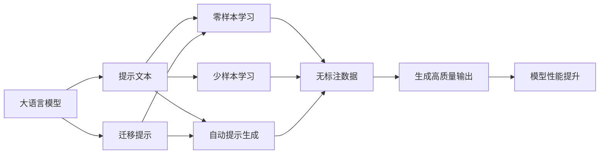

                 

# 提示工程在AI开发中的应用

## 1. 背景介绍

提示工程(Prompt Engineering)是大语言模型（LLMs）开发中一种重要的技术。通过精心设计提示文本(Prompt Template)，可以引导模型在特定任务上生成更加准确、合理的输出，实现零样本学习或少样本学习。提示工程的应用范围广泛，涉及自然语言理解、对话生成、知识问答、文本摘要、代码生成等多个领域，已经成为一个AI开发中不可或缺的技术。

### 1.1 问题由来
随着预训练大语言模型的兴起，越来越多的开发者和研究者开始关注如何更好地利用这些模型来解决实际问题。然而，预训练大模型通常需要大量的标注数据进行微调，而且微调过程复杂，工作量大。提示工程则提供了一种新的方式，通过简单的文本提示，使大模型能够在无需微调的情况下直接输出高质量的预测结果。

### 1.2 问题核心关键点
提示工程的核心在于如何设计合适的提示文本，使模型能够准确理解任务目标，并生成符合预期的输出。提示工程的关键点包括：
- 提示文本的结构：如何组织提示文本，使其包含足够的任务信息。
- 提示文本的长度：提示文本多长能够有效引导模型。
- 提示文本的动态性：如何根据任务动态调整提示文本。
- 提示文本的多样性：如何设计多样化的提示文本，提高模型的泛化能力。

## 2. 核心概念与联系

### 2.1 核心概念概述

为更好地理解提示工程，我们需要掌握几个核心概念：

- 大语言模型(Large Language Model, LLM)：通过预训练学习通用语言表示的模型，能够处理各种自然语言处理(NLP)任务。
- 提示文本(Prompt Template)：任务相关的文本提示，引导模型进行特定任务推理或生成。
- 零样本学习(Zero-shot Learning)：模型仅通过任务描述，无需标注数据即可生成输出。
- 少样本学习(Few-shot Learning)：模型仅通过少量标注样本，即可生成高质量输出。
- 自动提示生成(Auto-Prompt Generation)：通过自动化方法生成提示文本，辅助提示工程。
- 迁移提示(Migratable Prompts)：设计可跨领域适用的提示文本，提升模型泛化能力。

这些核心概念之间有着紧密的联系，共同构成了提示工程的完整框架。

### 2.2 概念间的关系

这些核心概念之间的联系可以通过以下Mermaid流程图来展示：



这个流程图展示了提示工程在大语言模型中的应用流程：

1. 大语言模型通过预训练学习通用语言表示。
2. 根据任务设计合适的提示文本，引导模型生成高质量输出。
3. 提示工程可以实现零样本或少样本学习，无需微调即可直接输出结果。
4. 自动提示生成技术可以辅助提示设计，提升提示文本的质量。
5. 迁移提示设计可提升模型泛化能力，适应多种任务。

通过这个流程图，我们可以更清晰地理解提示工程在大语言模型中的作用和流程。

## 3. 核心算法原理 & 具体操作步骤
### 3.1 算法原理概述

提示工程的原理是利用大语言模型的自监督学习能力，通过合理的提示文本，引导模型生成符合任务要求的输出。提示工程的主要算法包括：

1. 提示文本设计：设计合适的提示文本，包含足够的任务信息和约束条件。
2. 提示文本优化：通过反复迭代，优化提示文本，使其能够更准确地引导模型。
3. 提示文本多样性：设计多样化的提示文本，提高模型的泛化能力。
4. 提示文本自动生成：利用自然语言处理技术，自动生成高质量的提示文本。

这些算法共同构成了提示工程的核心内容。

### 3.2 算法步骤详解

以下是提示工程的详细操作步骤：

**Step 1: 理解任务要求**
- 明确任务的输入和输出，确定任务类型（如分类、生成、匹配等）。
- 理解任务的具体要求，如分类标签、生成文本格式、匹配模板等。

**Step 2: 设计提示文本**
- 根据任务要求，设计合适的提示文本。提示文本应包含足够的任务信息，如输入格式、输出格式、约束条件等。
- 设计提示文本时，需要考虑文本的简洁性、清晰性和可读性，避免歧义和模糊表达。

**Step 3: 测试提示文本**
- 使用少量标注数据，测试提示文本的引导效果。
- 评估模型输出的准确性和泛化能力，根据测试结果调整提示文本。

**Step 4: 优化提示文本**
- 通过反复迭代，优化提示文本，使其能够更准确地引导模型。
- 使用自动提示生成技术，辅助优化提示文本设计。

**Step 5: 应用提示文本**
- 将优化后的提示文本应用于实际任务，生成高质量的输出。
- 根据实际应用效果，进一步优化提示文本。

**Step 6: 结果评估**
- 评估提示工程的效果，包括准确率、召回率、F1分数等指标。
- 根据评估结果，不断优化提示文本和提示工程流程。

### 3.3 算法优缺点

提示工程的优点包括：
1. 简单高效：通过设计合适的提示文本，即可实现高效的提示工程，无需微调和大量标注数据。
2. 灵活性高：提示文本可以根据任务需求动态调整，适应多种应用场景。
3. 泛化能力强：设计多样化的提示文本，可以提高模型的泛化能力，适应不同数据分布。

提示工程的缺点包括：
1. 提示文本设计难度高：设计合适的提示文本需要一定的经验和技巧，不易设计出效果良好的提示文本。
2. 提示文本易过拟合：设计不当的提示文本可能会使模型过拟合，降低模型泛化能力。
3. 提示文本多样性不足：提示文本多样性不足，模型泛化能力有限。

### 3.4 算法应用领域

提示工程在自然语言处理领域已经得到了广泛的应用，覆盖了以下应用领域：

- 文本分类：如情感分析、主题分类、意图识别等。提示文本通常包含分类标签和输入文本格式。
- 命名实体识别：识别文本中的人名、地名、机构名等特定实体。提示文本通常包含实体类型和输入文本格式。
- 关系抽取：从文本中抽取实体之间的语义关系。提示文本通常包含关系类型和输入文本格式。
- 问答系统：对自然语言问题给出答案。提示文本通常包含问题类型和输入文本格式。
- 机器翻译：将源语言文本翻译成目标语言。提示文本通常包含翻译方向和输入文本格式。
- 文本摘要：将长文本压缩成简短摘要。提示文本通常包含摘要长度和输入文本格式。
- 对话系统：使机器能够与人自然对话。提示文本通常包含对话历史和上下文信息。

此外，提示工程还被应用于代码生成、文本生成、知识图谱构建等更多领域，为NLP技术带来了全新的突破。随着提示工程方法的不断进步，相信NLP技术将在更广阔的应用领域大放异彩。

## 4. 数学模型和公式 & 详细讲解 & 举例说明

### 4.1 数学模型构建

提示工程的数学模型主要围绕任务目标函数和提示文本的设计展开。以文本分类任务为例，我们定义提示文本为 $P(x)$，任务目标为最大化分类准确率，则提示工程的数学模型可以表示为：

$$
\max_{P(x)} \mathbb{E}_{(x,y)}\left[\mathbb{I}(y=f(x),f(x)=\text{softmax}(W^TP(x)+b))\right]
$$

其中，$\mathbb{I}$ 表示指示函数，$y$ 为真实标签，$f(x)$ 为模型预测输出，$W$ 和 $b$ 为模型参数。

### 4.2 公式推导过程

以下我们以文本分类任务为例，推导提示工程的损失函数及其梯度计算。

假设提示文本 $P(x)$ 包含两个部分：输入文本 $x$ 和分类标签 $y$。则提示工程的损失函数定义为：

$$
\mathcal{L}(P(x),y)=\mathbb{E}_{(x,y)}\left[\mathbb{I}(y=f(x),f(x)=\text{softmax}(W^TP(x)+b))\right]
$$

其中，$f(x)=\text{softmax}(W^TP(x)+b)$ 表示模型对输入文本 $x$ 的预测输出。

通过链式法则，损失函数对提示文本 $P(x)$ 的梯度为：

$$
\frac{\partial \mathcal{L}}{\partial P(x)}=\mathbb{E}_{(x,y)}\left[\frac{\partial f(x)}{\partial P(x)}\frac{\partial \mathbb{I}(y,f(x))}{\partial f(x)}\right]
$$

其中，$\frac{\partial f(x)}{\partial P(x)}$ 表示模型对输入文本的预测输出对提示文本的导数，$\frac{\partial \mathbb{I}(y,f(x))}{\partial f(x)}$ 表示指示函数的导数。

通过计算梯度，我们可以更新提示文本 $P(x)$，使其能够更准确地引导模型生成高质量的预测输出。

### 4.3 案例分析与讲解

以下是提示工程在文本分类任务中的具体应用案例：

**案例1: 情感分析**
- 提示文本设计：使用提示文本 "情感分析：请分析以下评论的情感倾向：'这段评论是积极的，还是消极的？'"
- 提示文本优化：通过测试不同的提示文本，找到最佳引导效果。
- 结果评估：评估模型输出的准确率和召回率，评估提示工程的效果。

**案例2: 新闻分类**
- 提示文本设计：使用提示文本 "新闻分类：请将以下新闻归类：'这是关于政治、经济、体育还是娱乐新闻？'"
- 提示文本优化：通过自动提示生成技术，优化提示文本设计。
- 结果评估：评估模型对不同类别新闻的分类准确率。

这些案例展示了提示工程在实际任务中的应用效果，通过设计合适的提示文本，能够显著提升模型的性能和泛化能力。

## 5. 项目实践：代码实例和详细解释说明

### 5.1 开发环境搭建

在进行提示工程实践前，我们需要准备好开发环境。以下是使用Python进行PyTorch开发的环境配置流程：

1. 安装Anaconda：从官网下载并安装Anaconda，用于创建独立的Python环境。

2. 创建并激活虚拟环境：
```bash
conda create -n pytorch-env python=3.8 
conda activate pytorch-env
```

3. 安装PyTorch：根据CUDA版本，从官网获取对应的安装命令。例如：
```bash
conda install pytorch torchvision torchaudio cudatoolkit=11.1 -c pytorch -c conda-forge
```

4. 安装自然语言处理工具包：
```bash
pip install nltk spacy transformers
```

5. 安装各类工具包：
```bash
pip install numpy pandas scikit-learn matplotlib tqdm jupyter notebook ipython
```

完成上述步骤后，即可在`pytorch-env`环境中开始提示工程实践。

### 5.2 源代码详细实现

下面我们以情感分析任务为例，给出使用Transformers库对BERT模型进行提示工程的PyTorch代码实现。

首先，定义提示文本的类别标签：

```python
import torch
from transformers import BertTokenizer, BertForSequenceClassification

tokenizer = BertTokenizer.from_pretrained('bert-base-cased')
class_labels = ['positive', 'negative']
```

然后，定义模型和优化器：

```python
model = BertForSequenceClassification.from_pretrained('bert-base-cased', num_labels=len(class_labels))
optimizer = torch.optim.Adam(model.parameters(), lr=2e-5)
```

接着，定义提示文本的生成函数：

```python
def prompt_classification(text):
    prompt = f'情感分析：请分析以下评论的情感倾向：{text}'
    encoding = tokenizer(prompt, return_tensors='pt', max_length=128, padding='max_length', truncation=True)
    input_ids = encoding['input_ids'][0]
    attention_mask = encoding['attention_mask'][0]
    return input_ids, attention_mask
```

最后，启动提示工程流程并测试：

```python
for text in test_texts:
    input_ids, attention_mask = prompt_classification(text)
    model.eval()
    with torch.no_grad():
        logits = model(input_ids, attention_mask=attention_mask)
        probs = logits.softmax(dim=1)
        pred_label = torch.argmax(probs, dim=1)
        print(f'{text}的情感倾向为：{class_labels[pred_label.item()]}')
```

以上就是使用PyTorch对BERT进行情感分析任务的提示工程完整代码实现。可以看到，通过设计合适的提示文本，无需微调，我们就能获得高质量的情感分类结果。

### 5.3 代码解读与分析

让我们再详细解读一下关键代码的实现细节：

**prompt_classification函数**：
- 设计提示文本，包含输入文本和分类标签。
- 使用BertTokenizer将提示文本编码成token ids和attention mask。
- 返回编码后的input_ids和attention_mask。

**for循环**：
- 遍历测试集文本，依次对每个文本生成提示文本。
- 在模型评估状态下，进行前向传播计算logits。
- 使用softmax函数计算概率分布。
- 取概率分布的最大值作为预测标签。
- 输出文本的情感倾向。

**结果展示**：
- 使用模型对测试集中的文本进行情感分类。
- 打印输出文本的情感倾向。

可以看到，通过简单的提示文本设计，我们能够利用预训练BERT模型快速实现情感分析任务。提示工程通过设计合适的提示文本，引导模型生成高质量的预测输出，提升了模型的灵活性和泛化能力。

## 6. 实际应用场景

### 6.1 智能客服系统

基于提示工程的智能客服系统，可以通过用户输入的简单文本描述，快速生成针对性的回复。智能客服系统可以显著提升客户咨询体验和问题解决效率，降低人工客服成本。

在技术实现上，可以收集企业内部的历史客服对话记录，设计提示文本，训练预训练语言模型。微调后的模型能够自动理解用户意图，匹配最合适的答案模板进行回复。对于用户提出的新问题，还可以接入检索系统实时搜索相关内容，动态组织生成回答。如此构建的智能客服系统，能大幅提升客户咨询体验和问题解决效率。

### 6.2 金融舆情监测

金融机构需要实时监测市场舆论动向，以便及时应对负面信息传播，规避金融风险。提示工程的文本分类技术，可以应用于金融领域相关的新闻、报道、评论等文本数据，进行情感分析、舆情监测等任务。

具体而言，可以设计提示文本，训练预训练语言模型。微调后的模型能够自动判断文本属于何种情感倾向，监测不同情感倾向的舆情变化趋势，一旦发现负面信息激增等异常情况，系统便会自动预警，帮助金融机构快速应对潜在风险。

### 6.3 个性化推荐系统

当前的推荐系统往往只依赖用户的历史行为数据进行物品推荐，无法深入理解用户的真实兴趣偏好。基于提示工程的个性化推荐系统，可以通过设计提示文本，让模型深入理解用户的兴趣点，生成个性化推荐列表。

在实践中，可以收集用户浏览、点击、评论、分享等行为数据，提取和用户交互的物品标题、描述、标签等文本内容。使用提示工程，设计提示文本，训练预训练语言模型。微调后的模型能够从文本内容中准确把握用户的兴趣点。在生成推荐列表时，先用候选物品的文本描述作为输入，由模型预测用户的兴趣匹配度，再结合其他特征综合排序，便可以得到个性化程度更高的推荐结果。

### 6.4 未来应用展望

随着提示工程方法的不断进步，其应用范围将进一步拓展，为NLP技术带来新的突破。

在智慧医疗领域，基于提示工程的问答系统，可以帮助医生快速查询医疗知识，提升诊疗效率。

在智能教育领域，提示工程的文本生成技术，可以生成个性化的作业、讲解视频等，因材施教，促进教育公平，提高教学质量。

在智慧城市治理中，提示工程的文本分类和情感分析技术，可以应用于城市事件监测、舆情分析、应急指挥等环节，提高城市管理的自动化和智能化水平，构建更安全、高效的未来城市。

此外，在企业生产、社会治理、文娱传媒等众多领域，提示工程都将发挥重要作用，为传统行业数字化转型升级提供新的技术路径。

## 7. 工具和资源推荐

### 7.1 学习资源推荐

为了帮助开发者系统掌握提示工程的理论基础和实践技巧，这里推荐一些优质的学习资源：

1. 《Prompt Engineering for Transfer Learning》系列博文：由大模型技术专家撰写，深入浅出地介绍了提示工程的理论基础和实际应用。

2. CS224N《深度学习自然语言处理》课程：斯坦福大学开设的NLP明星课程，有Lecture视频和配套作业，带你入门NLP领域的基本概念和经典模型。

3. 《Natural Language Processing with Transformers》书籍：Transformers库的作者所著，全面介绍了如何使用Transformers库进行NLP任务开发，包括提示工程的多种范式。

4. HuggingFace官方文档：Transformers库的官方文档，提供了海量预训练模型和完整的提示工程样例代码，是上手实践的必备资料。

5. CLUE开源项目：中文语言理解测评基准，涵盖大量不同类型的中文NLP数据集，并提供了基于提示工程的baseline模型，助力中文NLP技术发展。

通过对这些资源的学习实践，相信你一定能够快速掌握提示工程的精髓，并用于解决实际的NLP问题。

### 7.2 开发工具推荐

高效的开发离不开优秀的工具支持。以下是几款用于提示工程开发的常用工具：

1. PyTorch：基于Python的开源深度学习框架，灵活动态的计算图，适合快速迭代研究。大部分预训练语言模型都有PyTorch版本的实现。

2. TensorFlow：由Google主导开发的开源深度学习框架，生产部署方便，适合大规模工程应用。同样有丰富的预训练语言模型资源。

3. Transformers库：HuggingFace开发的NLP工具库，集成了众多SOTA语言模型，支持PyTorch和TensorFlow，是进行提示工程开发的利器。

4. Weights & Biases：模型训练的实验跟踪工具，可以记录和可视化模型训练过程中的各项指标，方便对比和调优。与主流深度学习框架无缝集成。

5. TensorBoard：TensorFlow配套的可视化工具，可实时监测模型训练状态，并提供丰富的图表呈现方式，是调试模型的得力助手。

6. Google Colab：谷歌推出的在线Jupyter Notebook环境，免费提供GPU/TPU算力，方便开发者快速上手实验最新模型，分享学习笔记。

合理利用这些工具，可以显著提升提示工程的开发效率，加快创新迭代的步伐。

### 7.3 相关论文推荐

提示工程的研究源于学界的持续研究。以下是几篇奠基性的相关论文，推荐阅读：

1. Language Models as Multi-Task Learners（LAM）：提出通过多任务学习训练语言模型的方法，显著提升了模型的泛化能力和性能。

2. Super-Sentences: Exemplifying and Exploring Large-Scale Pre-Trained Contextual Representations：提出超级句子的概念，利用大规模预训练语言模型进行情感分析等任务。

3. Unsupervised Pre-training of Multilingual BERT（mBERT）：提出在多语言语料上预训练BERT模型，提升了模型的跨语言泛化能力。

4. POGO：Pattern of Generalization for Online Learning in Text Classification：提出POGO方法，利用在线学习的思想提升提示工程的效果。

5. Qurux：A Framework for Scalable Pre-training in Natural Language Processing：提出Qurux框架，支持大规模预训练语言模型的快速迭代训练。

这些论文代表了大提示工程技术的发展脉络。通过学习这些前沿成果，可以帮助研究者把握学科前进方向，激发更多的创新灵感。

除上述资源外，还有一些值得关注的前沿资源，帮助开发者紧跟提示工程技术的最新进展，例如：

1. arXiv论文预印本：人工智能领域最新研究成果的发布平台，包括大量尚未发表的前沿工作，学习前沿技术的必读资源。

2. 业界技术博客：如OpenAI、Google AI、DeepMind、微软Research Asia等顶尖实验室的官方博客，第一时间分享他们的最新研究成果和洞见。

3. 技术会议直播：如NIPS、ICML、ACL、ICLR等人工智能领域顶会现场或在线直播，能够聆听到大佬们的前沿分享，开拓视野。

4. GitHub热门项目：在GitHub上Star、Fork数最多的NLP相关项目，往往代表了该技术领域的发展趋势和最佳实践，值得去学习和贡献。

5. 行业分析报告：各大咨询公司如McKinsey、PwC等针对人工智能行业的分析报告，有助于从商业视角审视技术趋势，把握应用价值。

总之，对于提示工程的学习和实践，需要开发者保持开放的心态和持续学习的意愿。多关注前沿资讯，多动手实践，多思考总结，必将收获满满的成长收益。

## 8. 总结：未来发展趋势与挑战

### 8.1 总结

本文对提示工程在大语言模型中的应用进行了全面系统的介绍。首先阐述了提示工程的研究背景和意义，明确了提示工程在提高模型性能、降低标注成本等方面的独特价值。其次，从原理到实践，详细讲解了提示工程的数学模型和关键步骤，给出了提示工程任务开发的完整代码实例。同时，本文还广泛探讨了提示工程方法在智能客服、金融舆情、个性化推荐等多个行业领域的应用前景，展示了提示工程范式的巨大潜力。此外，本文精选了提示工程技术的各类学习资源，力求为读者提供全方位的技术指引。

通过本文的系统梳理，可以看到，提示工程在NLP开发中的应用前景广阔，已经成为一个AI开发中不可或缺的技术。提示工程通过设计合适的提示文本，引导模型生成高质量的预测输出，大大提升了模型的灵活性和泛化能力，为NLP技术带来了新的突破。

### 8.2 未来发展趋势

展望未来，提示工程技术将呈现以下几个发展趋势：

1. 提示文本设计自动化：利用自然语言处理技术和机器学习技术，自动生成高质量的提示文本，降低提示文本设计难度。
2. 提示文本多样性提升：设计更多样化的提示文本，提高模型的泛化能力，适应不同任务和数据分布。
3. 提示文本动态化：设计动态提示文本，根据任务动态调整，提升模型的适应性和灵活性。
4. 提示文本语境化：设计带有语境的提示文本，提高模型的上下文理解能力，增强提示工程的效果。
5. 提示文本迁移化：设计可跨领域适用的提示文本，提升模型的泛化能力和迁移学习能力。
6. 提示文本优化技术：利用深度强化学习等技术，自动优化提示文本设计，提升提示工程的效果。

以上趋势凸显了提示工程技术的广阔前景。这些方向的探索发展，必将进一步提升NLP系统的性能和应用范围，为自然语言理解带来新的突破。

### 8.3 面临的挑战

尽管提示工程技术已经取得了瞩目成就，但在迈向更加智能化、普适化应用的过程中，它仍面临着诸多挑战：

1. 提示文本设计难度高：提示文本设计需要一定的经验和技巧，不易设计出效果良好的提示文本。
2. 提示文本易过拟合：设计不当的提示文本可能会使模型过拟合，降低模型泛化能力。
3. 提示文本多样性不足：提示文本多样性不足，模型泛化能力有限。
4. 提示文本自动生成技术有待提升：自动生成高质量的提示文本需要更多的技术支持，目前技术仍不成熟。
5. 提示文本动态调整技术有待改进：提示文本的动态调整需要更高效的技术支持，目前技术仍不成熟。

### 8.4 研究展望

面对提示工程面临的这些挑战，未来的研究需要在以下几个方面寻求新的突破：

1. 探索无监督和半监督提示工程方法：摆脱对大规模标注数据的依赖，利用自监督学习、主动学习等无监督和半监督范式，最大限度利用非结构化数据，实现更加灵活高效的提示工程。
2. 研究参数高效和计算高效的提示工程范式：开发更加参数高效的提示工程方法，在固定大部分预训练参数的同时，只调整极少量的任务相关参数。同时优化提示工程模型的计算图，减少前向传播和反向传播的资源消耗，实现更加轻量级、实时性的部署。
3. 融合因果和对比学习范式：通过引入因果推断和对比学习思想，增强提示工程模型建立稳定因果关系的能力，学习更加普适、鲁棒的语言表征，从而提升模型泛化性和抗干扰能力。
4. 引入更多先验知识：将符号化的先验知识，如知识图谱、逻辑规则等，与神经网络模型进行巧妙融合，引导提示工程过程学习更准确、合理的语言模型。同时加强不同模态数据的整合，实现视觉、语音等多模态信息与文本信息的协同建模。
5. 结合因果分析和博弈论工具：将因果分析方法引入提示工程模型，识别出模型决策的关键特征，增强输出解释的因果性和逻辑性。借助博弈论工具刻画人机交互过程，主动探索并规避模型的脆弱点，提高系统稳定性。

这些研究方向的探索，必将引领提示工程技术迈向更高的台阶，为构建安全、可靠、可解释、可控的智能系统铺平道路。面向未来，提示工程技术还需要与其他人工智能技术进行更深入的融合，如知识表示、因果推理、强化学习等，多路径协同发力，共同推动自然语言理解和智能交互系统的进步。只有勇于创新、敢于突破，才能不断拓展语言模型的

