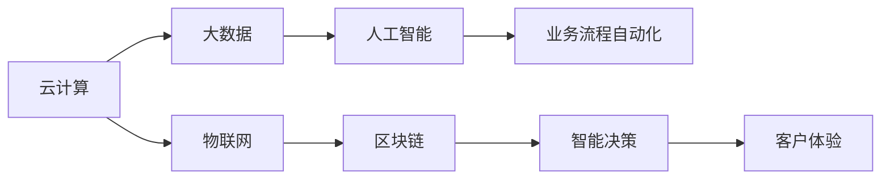

                 

# 数字化转型的趋势、技术和应用

> 关键词：数字化转型, 人工智能, 大数据, 云计算, 物联网, 区块链, 业务流程自动化

## 1. 背景介绍

### 1.1 问题由来

数字化转型(Digital Transformation, DX)是指企业利用现代信息技术和商业模式，优化业务流程，提升运营效率，增强客户体验，实现可持续发展的一种战略转变。数字化转型已经成为全球各大企业和组织的重要战略方向，尤其是在新冠疫情的推动下，数字化转型的浪潮席卷全球，加速了各行各业的数字化进程。

然而，数字化转型不仅仅是技术的堆砌，更涉及企业战略、文化、组织结构、人才等多方面的深刻变革。如何在技术驱动的同时，平衡好组织的变革过程，成为数字化转型成功的关键。

### 1.2 问题核心关键点

数字化转型主要涉及以下核心关键点：

- **技术基础**：云计算、大数据、人工智能、物联网、区块链等新技术的普及与应用。
- **数据驱动**：以数据为核心驱动业务决策，实现数据驱动的决策支持。
- **业务流程优化**：通过自动化、智能化等技术优化业务流程，提高效率，降低成本。
- **客户体验提升**：通过个性化、定制化服务等手段，提升客户体验，增强客户忠诚度。
- **组织变革**：在技术应用过程中，对组织结构、人才、流程、文化进行变革，以适应新的业务模式和市场需求。

### 1.3 问题研究意义

数字化转型是企业适应新经济、新挑战、新机遇的重要途径。通过数字化转型，企业可以：

1. **提升运营效率**：通过自动化、智能化等技术，优化业务流程，降低运营成本，提高效率。
2. **增强竞争力**：通过数字化手段，快速响应市场需求，提升产品和服务质量，增强市场竞争力。
3. **扩大市场机会**：通过数字化手段，拓展新市场，开拓新客户，实现业务增长。
4. **实现可持续发展**：通过数字化转型，优化资源配置，提升能效，实现绿色、可持续发展。

数字化转型不仅是技术变革，更是企业管理模式的深刻变革。它涉及到企业的方方面面，从战略规划到执行落地，需要全面考虑。因此，对数字化转型的深入研究和应用具有重要的理论和实践意义。

## 2. 核心概念与联系

### 2.1 核心概念概述

数字化转型涉及多个核心概念，包括但不限于：

- **云计算(Cloud Computing)**：通过互联网提供可扩展的计算资源和数据存储，支持弹性计算、按需付费等新业务模式。
- **大数据(Big Data)**：通过处理大规模、高速、多样化数据，实现数据驱动的决策和洞察。
- **人工智能(Artificial Intelligence, AI)**：利用机器学习、深度学习等技术，实现智能决策、自然语言处理、计算机视觉等应用。
- **物联网(IoT)**：通过互联网连接各种设备，实现实时数据采集和处理，推动工业物联网、智能家居、智慧城市等应用。
- **区块链(Blockchain)**：通过去中心化的分布式账本技术，实现安全、透明、可信的数据交换和交易。
- **业务流程自动化(Automation Process Automation, BPA)**：通过机器人流程自动化(RPA)等技术，优化业务流程，提高效率和准确性。

这些核心概念之间通过信息流、数据流、业务流等紧密联系，共同构成数字化转型的完整生态系统。

### 2.2 概念间的关系

数字化转型的核心概念之间关系密切，可以通过以下Mermaid流程图来展示：



这个流程图展示了各个核心概念之间的联系：

1. 云计算为大数据、人工智能等提供基础设施支持。
2. 大数据通过数据处理和分析，为人工智能提供数据基础。
3. 人工智能通过机器学习等技术，为智能决策、自动化等提供技术支撑。
4. 物联网通过设备联网，为大数据、人工智能提供数据来源。
5. 区块链通过分布式账本技术，为数据交换和交易提供安全保障。
6. 业务流程自动化通过自动化技术，提升流程效率和准确性。
7. 智能决策、自动化、客户体验等通过上述技术协同实现，提升业务价值。

这些概念共同构成了数字化转型的核心框架，为数字化转型的实现提供了坚实的基础。

## 3. 核心算法原理 & 具体操作步骤

### 3.1 算法原理概述

数字化转型涉及多个核心算法和技术的协同应用，包括但不限于以下内容：

- **云计算**：弹性计算、分布式存储、容器化部署等技术。
- **大数据**：数据清洗、数据集成、数据仓库、数据湖等技术。
- **人工智能**：机器学习、深度学习、自然语言处理、计算机视觉等技术。
- **物联网**：设备管理、数据采集、数据传输、边缘计算等技术。
- **区块链**：共识算法、分布式账本、智能合约等技术。
- **业务流程自动化**：机器人流程自动化、业务规则引擎、低代码平台等技术。

这些技术和算法通过集成和协同应用，实现数字化转型的目标。

### 3.2 算法步骤详解

数字化转型的操作步骤主要包括：

1. **战略规划**：明确数字化转型的目标、路径、重点领域。
2. **技术评估**：评估云计算、大数据、人工智能、物联网、区块链等技术适用性。
3. **数据准备**：收集、清洗、整合、存储、管理数据。
4. **平台建设**：建设云计算、大数据、人工智能等技术平台。
5. **应用开发**：开发数字化应用，实现业务自动化、智能化、个性化等。
6. **运营管理**：确保技术平台和应用的稳定运行，提供持续改进的机制。
7. **效果评估**：评估数字化转型的效果，持续优化。

这些步骤涉及到技术、业务、组织、文化等多方面，需要全面考虑和协调。

### 3.3 算法优缺点

数字化转型的算法和技术具有以下优点：

1. **提升效率**：通过自动化、智能化等技术，优化业务流程，提高效率。
2. **增强创新**：利用大数据、人工智能等技术，挖掘数据价值，驱动创新。
3. **降低成本**：通过云计算、物联网等技术，实现资源共享，降低运营成本。
4. **提高客户满意度**：通过个性化、定制化服务等手段，提升客户体验。

数字化转型也存在以下缺点：

1. **成本高昂**：数字化转型初期需要大量投资，涉及技术、人才、组织变革等。
2. **数据隐私和安全风险**：大量数据的采集和处理可能带来隐私和数据安全风险。
3. **技术复杂性**：涉及多个核心技术和算法，技术复杂度高，实施难度大。
4. **组织变革挑战**：涉及组织结构、流程、文化等多方面变革，协调难度大。

### 3.4 算法应用领域

数字化转型的算法和技术已经广泛应用于以下领域：

- **零售和电子商务**：通过大数据分析，提升库存管理、营销策略、客户体验。
- **金融服务**：通过区块链和人工智能，实现供应链金融、风险控制、智能投顾等。
- **制造业**：通过物联网、大数据，实现智能制造、供应链优化、预测性维护等。
- **医疗健康**：通过人工智能和大数据，实现医疗影像分析、疾病预测、个性化医疗等。
- **政府和企业**：通过数字化手段，提升公共服务、内部管理、业务流程等。

## 4. 数学模型和公式 & 详细讲解 & 举例说明

### 4.1 数学模型构建

数字化转型的数学模型可以构建如下：

假设数字化转型涉及N个技术，每个技术对业务的价值贡献率为V_i(i=1,2,...,N)，技术之间的协同作用系数为C_ij(i,j=1,2,...,N)，且C_ij=C_ji。

数字化转型的总价值贡献率为V，则有：

$$V=\sum_{i=1}^N V_i + \sum_{i=1}^N \sum_{j=1}^N C_{ij}V_iV_j$$

其中，第一个求和项表示单个技术的贡献，第二个求和项表示技术之间的协同效应。

### 4.2 公式推导过程

假设数字化转型涉及云计算、大数据、人工智能等三种技术，每种技术的价值贡献率分别为V云、V大数据、V人工智能，且技术之间的协同作用系数分别为C云-大数据、C云-人工智能、C大数据-人工智能。

根据公式推导：

$$V=\sum_{i=1}^3 V_i + C_{云-大数据}V_{云}V_{大数据} + C_{云-人工智能}V_{云}V_{人工智能} + C_{大数据-人工智能}V_{大数据}V_{人工智能}$$

通过数学模型，可以更直观地理解数字化转型各个技术的贡献和协同作用，从而指导决策。

### 4.3 案例分析与讲解

以智慧医院为例，智慧医院通过云计算、大数据、人工智能、物联网、区块链等技术，实现数字化转型。

- **云计算**：提供弹性的计算和存储资源，支持医院的数据管理和分析。
- **大数据**：通过整合和分析医院的历史数据，提升医疗决策的科学性和精准性。
- **人工智能**：利用机器学习算法，实现疾病预测、影像分析、智能诊断等。
- **物联网**：通过连接医疗设备，实现实时监测、远程医疗等。
- **区块链**：确保病历、药品等数据的可信性和隐私保护。

这些技术的集成应用，显著提升了医院的运营效率和医疗服务质量，实现了数字化转型的目标。

## 5. 项目实践：代码实例和详细解释说明

### 5.1 开发环境搭建

为了实现数字化转型，需要进行多技术平台的搭建。以下是主要开发环境的搭建步骤：

1. **云计算平台**：搭建AWS、阿里云、华为云等云平台，提供弹性的计算和存储资源。
2. **大数据平台**：搭建Hadoop、Spark、Flink等大数据平台，进行数据处理和分析。
3. **人工智能平台**：搭建TensorFlow、PyTorch等人工智能平台，进行模型训练和推理。
4. **物联网平台**：搭建MQTT、CoAP、RESTful等物联网平台，实现设备互联和数据采集。
5. **区块链平台**：搭建Hyperledger Fabric、Ethereum等区块链平台，确保数据的安全和可信。
6. **业务流程自动化平台**：搭建UiPath、Blue Prism等自动化平台，实现业务流程的自动化。

完成以上环境的搭建后，即可进行数字化转型的开发和部署。

### 5.2 源代码详细实现

以智慧医院为例，以下是主要实现步骤：

1. **数据采集**：通过IoT设备采集患者的健康数据，存储在云平台的数据湖中。
2. **数据清洗和处理**：利用大数据平台进行数据清洗和处理，确保数据质量。
3. **模型训练和部署**：利用人工智能平台进行模型训练，部署到云平台中进行推理。
4. **数据共享和互操作**：通过区块链平台实现数据的安全共享和互操作。
5. **业务流程自动化**：利用自动化平台进行业务流程的自动化，提升效率。

这些步骤涉及到多个技术的集成应用，需要紧密协调和协作。

### 5.3 代码解读与分析

以数据清洗和处理为例，以下是主要代码实现：

```python
import pandas as pd

# 数据清洗
def data_cleaning(data):
    # 去除缺失值
    data = data.dropna()
    # 去除重复值
    data = data.drop_duplicates()
    # 标准化处理
    data = pd.get_dummies(data)
    return data

# 数据处理
def data_processing(data):
    # 特征工程
    data = pd.get_dummies(data)
    # 特征选择
    data = data.select_dtypes(include=[float, int])
    # 特征归一化
    data = (data - data.mean()) / data.std()
    return data
```

通过以上代码，可以对数据进行清洗和处理，确保数据质量，为后续的分析和应用奠定基础。

### 5.4 运行结果展示

以智慧医院的医疗影像分析为例，以下是主要运行结果展示：

- **数据清洗和处理结果**：展示数据清洗和处理后的统计信息，确保数据质量。
- **模型训练结果**：展示模型训练后的精度、召回率等指标，评估模型效果。
- **自动化结果**：展示自动化流程的运行结果，提升效率和准确性。
- **数据分析结果**：展示数据分析的结果，提供决策支持。

## 6. 实际应用场景

### 6.1 智慧医疗

智慧医疗是数字化转型的典型应用场景之一。通过云计算、大数据、人工智能、物联网、区块链等技术，智慧医院可以实现数字化转型，提升医疗服务质量和管理效率。

具体应用场景包括：

- **电子病历系统**：通过大数据和人工智能，实现电子病历的智能化管理和分析。
- **影像分析系统**：通过人工智能和大数据，实现医学影像的自动化分析和诊断。
- **远程医疗**：通过云计算和物联网，实现远程医疗和远程监控。
- **药品管理**：通过区块链技术，确保药品的供应链安全和管理透明。
- **业务流程自动化**：通过自动化平台，优化医院内部的流程，提升效率和准确性。

通过智慧医疗的应用，可以显著提升医疗服务质量，降低运营成本，增强医疗机构的竞争力。

### 6.2 智慧制造

智慧制造是数字化转型的另一个重要应用场景。通过云计算、物联网、大数据等技术，智慧制造可以实现数字化转型，提升生产效率和产品质量。

具体应用场景包括：

- **设备监控和维护**：通过物联网技术，实现设备的实时监控和预测性维护。
- **生产流程优化**：通过大数据分析，优化生产流程，提高效率和质量。
- **供应链管理**：通过物联网和区块链技术，实现供应链的数字化管理和监控。
- **智能制造**：通过人工智能和大数据，实现智能制造和质量控制。
- **业务流程自动化**：通过自动化平台，优化生产流程，提升效率和准确性。

通过智慧制造的应用，可以显著提升生产效率，降低成本，增强企业的市场竞争力。

### 6.3 智慧城市

智慧城市是数字化转型的重要应用方向之一。通过云计算、物联网、大数据等技术，智慧城市可以实现数字化转型，提升城市治理水平和居民生活质量。

具体应用场景包括：

- **智能交通**：通过物联网和云计算，实现交通流量监控和智能调度。
- **城市安全**：通过物联网和人工智能，实现城市安全的监控和预警。
- **公共服务**：通过大数据和人工智能，优化公共服务的提供和调度。
- **智慧医疗**：通过云计算和物联网，实现智慧医院和远程医疗。
- **智能家居**：通过物联网和人工智能，实现智能家居和智慧社区。

通过智慧城市的应用，可以显著提升城市治理水平，增强居民生活质量，实现城市的可持续发展。

### 6.4 未来应用展望

随着技术的不断进步，数字化转型将进一步深化和扩展，新的应用场景也将不断涌现。以下是未来数字化转型的几个重要方向：

1. **边缘计算**：通过在设备端进行数据处理，实现实时数据分析和决策。
2. **量子计算**：利用量子计算的高效性和安全性，提升数据分析和计算能力。
3. **5G网络**：通过5G网络的高速和低延时，实现更高效的数据传输和交互。
4. **人工智能伦理**：在人工智能应用中，注重伦理和安全，确保技术的公正和透明。
5. **智能合约**：通过区块链和智能合约技术，实现自动化、可信任的交易和合作。

## 7. 工具和资源推荐

### 7.1 学习资源推荐

为了帮助开发者系统掌握数字化转型的技术，以下是一些优质的学习资源：

1. **《数字化转型之路》书籍**：深入浅出地介绍了数字化转型的理论和实践，涵盖云计算、大数据、人工智能、物联网等多个技术领域。
2. **《智慧医疗》课程**：斯坦福大学开设的智慧医疗课程，涵盖电子病历、影像分析、远程医疗等多个智慧医疗应用场景。
3. **《智慧制造》课程**：麻省理工学院开设的智慧制造课程，涵盖智能制造、供应链管理、设备监控等多个智慧制造应用场景。
4. **《智慧城市》课程**：哈佛大学开设的智慧城市课程，涵盖智能交通、城市安全、公共服务等多个智慧城市应用场景。
5. **《数字化转型实战》博文**：行业专家分享的数字化转型实践经验和技术案例，涵盖多个应用场景和实际问题。

通过这些资源的学习和实践，相信你一定能够系统掌握数字化转型的技术，并应用于实际业务场景。

### 7.2 开发工具推荐

高效的开发离不开优秀的工具支持。以下是几款用于数字化转型的开发工具：

1. **AWS**：亚马逊云平台，提供弹性的计算和存储资源，支持各种云计算应用。
2. **Hadoop**：开源大数据处理平台，支持数据清洗、数据集成、数据仓库等多个环节。
3. **TensorFlow**：开源人工智能平台，支持模型训练和推理，适用于多种深度学习应用。
4. **IoT平台**：如MQTT、CoAP、RESTful等，实现设备的互联和数据采集。
5. **区块链平台**：如Hyperledger Fabric、Ethereum等，确保数据的安全和可信。
6. **自动化平台**：如UiPath、Blue Prism等，实现业务流程的自动化。

合理利用这些工具，可以显著提升数字化转型的开发效率，加快创新迭代的步伐。

### 7.3 相关论文推荐

数字化转型技术的发展源于学界的持续研究。以下是几篇奠基性的相关论文，推荐阅读：

1. **《云计算与数据中心技术》论文**：介绍云计算技术和架构，为数字化转型提供基础设施支持。
2. **《大数据分析与处理》论文**：探讨大数据技术和应用，为数字化转型提供数据基础。
3. **《人工智能与机器学习》论文**：分析人工智能和机器学习算法，为数字化转型提供技术支撑。
4. **《物联网技术与应用》论文**：介绍物联网技术和应用，为数字化转型提供设备互联和数据采集支持。
5. **《区块链技术与安全》论文**：探讨区块链技术和安全问题，为数字化转型提供数据可信和互操作保障。

这些论文代表了大数字化转型技术的发展脉络。通过学习这些前沿成果，可以帮助研究者把握学科前进方向，激发更多的创新灵感。

除上述资源外，还有一些值得关注的前沿资源，帮助开发者紧跟数字化转型的最新进展，例如：

1. **arXiv论文预印本**：人工智能领域最新研究成果的发布平台，包括大量尚未发表的前沿工作，学习前沿技术的必读资源。
2. **业界技术博客**：如AWS、Google AI、DeepMind、微软Research Asia等顶尖实验室的官方博客，第一时间分享他们的最新研究成果和洞见。
3. **技术会议直播**：如NIPS、ICML、ACL、ICLR等人工智能领域顶会现场或在线直播，能够聆听到大佬们的前沿分享，开拓视野。
4. **GitHub热门项目**：在GitHub上Star、Fork数最多的数字化转型相关项目，往往代表了该技术领域的发展趋势和最佳实践，值得去学习和贡献。
5. **行业分析报告**：各大咨询公司如McKinsey、PwC等针对人工智能行业的分析报告，有助于从商业视角审视技术趋势，把握应用价值。

总之，对于数字化转型的学习和实践，需要开发者保持开放的心态和持续学习的意愿。多关注前沿资讯，多动手实践，多思考总结，必将收获满满的成长收益。

## 8. 总结：未来发展趋势与挑战

### 8.1 总结

本文对数字化转型的趋势、技术和应用进行了全面系统的介绍。首先阐述了数字化转型的背景、核心概念和关键点，明确了数字化转型的重要性和应用场景。其次，从原理到实践，详细讲解了数字化转型的数学模型和操作步骤，给出了具体的代码实例和运行结果展示。同时，本文还广泛探讨了数字化转型的未来趋势和挑战，提供了相关的学习资源和开发工具推荐。

通过本文的系统梳理，可以看到，数字化转型不仅仅是技术的变革，更是企业管理模式的深刻变革。它涉及到企业的方方面面，从战略规划到执行落地，需要全面考虑和协调。数字化转型技术的不断发展，为各行各业带来了深刻的变化和机遇，但也面临着诸多挑战和问题。只有积极应对并寻求突破，才能真正实现数字化转型的目标。

### 8.2 未来发展趋势

展望未来，数字化转型将呈现以下几个发展趋势：

1. **技术融合加速**：云计算、大数据、人工智能、物联网、区块链等技术将进一步融合，形成更加综合、高效的技术生态系统。
2. **数据驱动决策**：数据的价值将进一步被挖掘，数据驱动的决策将成为企业和组织决策的主要方式。
3. **AI伦理和安全**：人工智能伦理和安全问题将引起广泛关注，AI应用的透明性和公正性将成为重要研究方向。
4. **智能化和自动化**：通过AI和自动化技术，实现智能化、自动化、个性化等业务应用。
5. **智慧化和普适化**：智慧医疗、智慧制造、智慧城市等应用将不断拓展，推动社会各个领域的数字化转型。

### 8.3 面临的挑战

尽管数字化转型技术已经取得了一定的成果，但在迈向更加智能化、普适化应用的过程中，它仍面临着诸多挑战：

1. **技术复杂性**：涉及多个核心技术和算法，技术复杂度高，实施难度大。
2. **成本和资源**：数字化转型初期需要大量投资，涉及技术、人才、组织变革等。
3. **数据隐私和安全**：大量数据的采集和处理可能带来隐私和数据安全风险。
4. **组织变革挑战**：涉及组织结构、流程、文化等多方面变革，协调难度大。
5. **技术和业务协同**：技术应用需要与业务需求紧密结合，协调难度大。

### 8.4 研究展望

面对数字化转型面临的挑战，未来的研究需要在以下几个方面寻求新的突破：

1. **技术和业务协同**：加强技术和业务的协同应用，推动数字化转型的落地。
2. **数据治理和隐私保护**：加强数据治理和隐私保护，确保数据的安全和合法使用。
3. **人工智能伦理**：在AI应用中，注重伦理和安全，确保技术的公正和透明。
4. **智能化和自动化**：通过AI和自动化技术，实现智能化、自动化、个性化等业务应用。
5. **智慧化和普适化**：智慧医疗、智慧制造、智慧城市等应用将不断拓展，推动社会各个领域的数字化转型。

这些研究方向的探索，必将引领数字化转型技术的不断进步，为构建更加智能、高效、可持续的数字化生态系统提供支撑。

## 9. 附录：常见问题与解答

**Q1：如何选择合适的数字化转型技术？**

A: 选择数字化转型技术需要考虑多个因素，包括业务需求、数据现状、技术成熟度、资源投入等。建议先明确数字化转型的目标和关键领域，再结合现有资源和技术能力，选择最适合的技术方案。

**Q2：如何评估数字化转型的效果？**

A: 数字化转型的效果评估可以从多个维度进行，包括业务流程优化、运营效率提升、成本降低、客户满意度提升等。通过定量和定性分析，全面评估数字化转型的效果。

**Q3：数字化转型过程中如何管理数据隐私和安全？**

A: 数字化转型过程中，数据隐私和安全是重要问题。建议采用数据加密、访问控制、审计日志等技术，确保数据的安全和合法使用。同时，遵守相关法律法规，保护用户隐私。

**Q4：数字化转型对组织变革的影响是什么？**

A: 数字化转型涉及组织结构的变革，需要重新定义角色和职责，优化流程和流程，提升员工技能和素养。同时，需要加强组织文化和团队协作，推动数字化转型的顺利实施。

**Q5：数字化转型是否需要大规模投资？**

A: 数字化转型需要一定的初期投资，包括技术采购、平台建设、人才培养等。但长期来看，数字化转型带来的业务效率提升和成本降低，可以带来更大的收益。因此，建议综合考虑短期和长期收益，制定合理的投资策略。

---

作者：禅与计算机程序设计艺术 / Zen and the Art of Computer Programming

