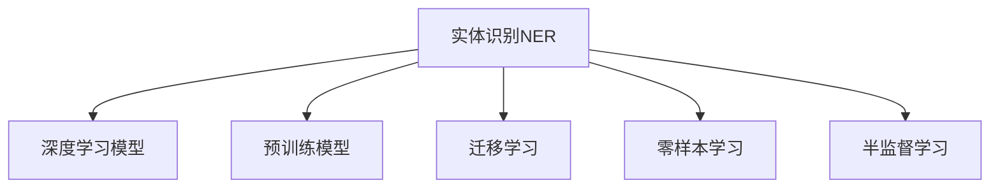
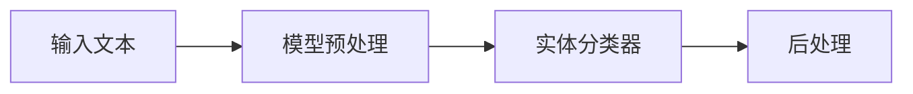
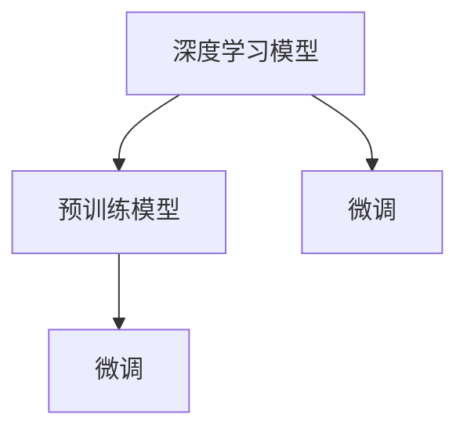
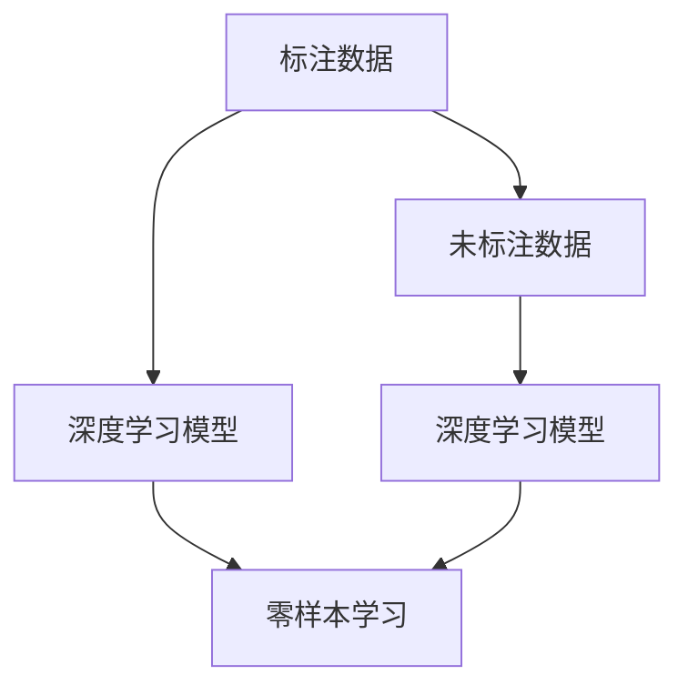
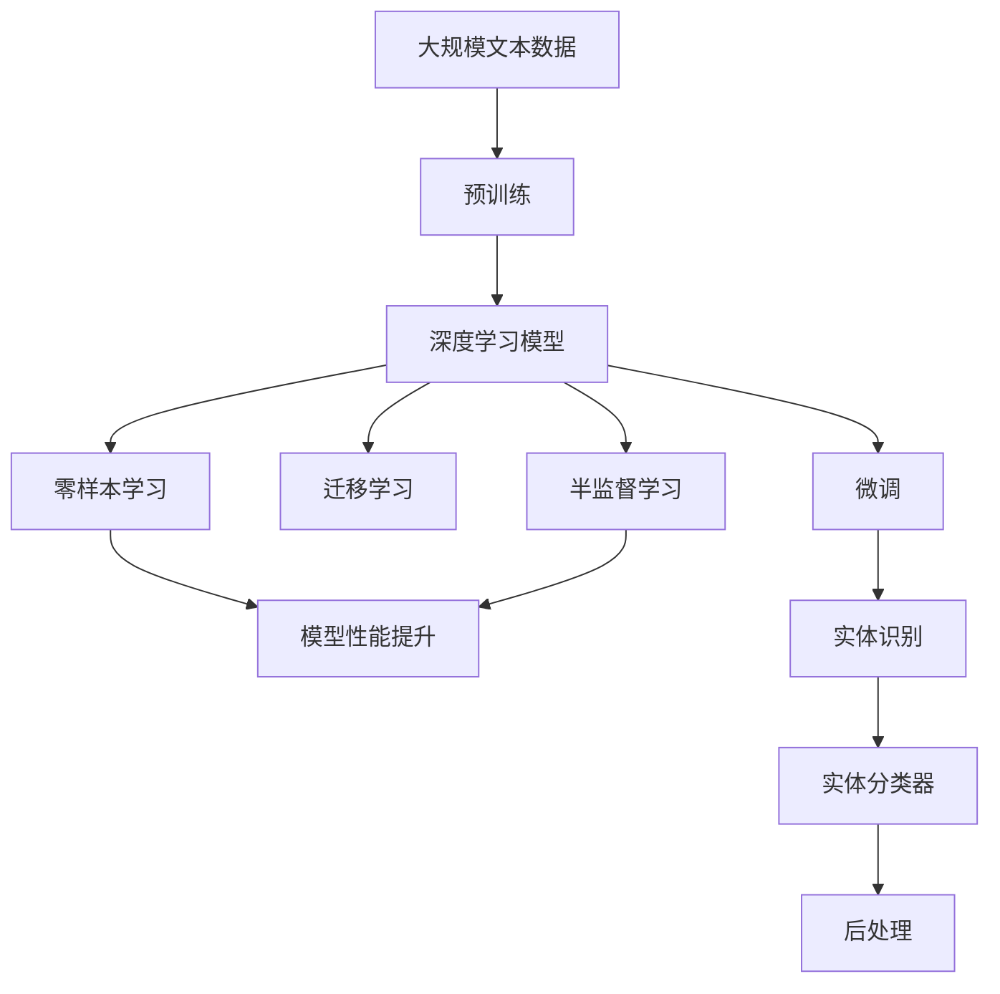
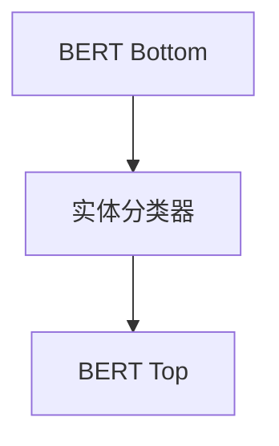

                 

# 数字实体自动化的未来发展

## 1. 背景介绍

在数字化转型的浪潮下，实体识别成为数字自动化应用的核心问题之一。无论是金融、医疗、电商还是社交媒体，实体识别（Named Entity Recognition, NER）都被广泛用于自动化数据的解析和提取。传统上，实体识别通常依赖于手工规则和特征工程，但这种依赖规则的方式随着数据量的不断增长，难以覆盖所有可能的情况。因此，基于深度学习模型的实体识别方法应运而生，其在处理大规模、复杂数据方面表现出卓越的性能。

### 1.1 问题由来

当前，实体识别广泛应用于多个行业，如金融风险监控、医疗疾病诊断、智能客服等。然而，传统的手工规则和特征工程方法在复杂场景下表现不佳，尤其在处理多领域、多语言和多模态数据时，准确度和效率都无法满足实际需求。随着深度学习和大规模预训练模型的兴起，基于模型的方法在实体识别中表现出色，成为主流解决方案。

### 1.2 问题核心关键点

实体识别任务的核心关键点包括：

- **识别准确度**：准确识别出文本中的实体，避免误识别和漏识别。
- **泛化能力**：能够适应新领域和新语言，在未知数据上表现良好。
- **可解释性**：理解实体识别过程中的关键特征和决策机制，便于模型优化和调试。
- **实时性**：在数据流实时处理场景中，模型需快速响应。
- **计算资源消耗**：模型在保证准确度的同时，需具备较低的计算复杂度。

## 2. 核心概念与联系

### 2.1 核心概念概述

为更好地理解数字实体自动化的未来发展，本节将介绍几个密切相关的核心概念：

- **实体识别（NER）**：自动从文本中识别出具体的实体，如人名、地名、机构名等。
- **深度学习模型**：基于神经网络模型的实体识别方法，通过大规模数据进行训练，学习实体的特征和规律。
- **预训练模型**：在大量无标签文本数据上预训练的深度学习模型，学习通用的语言表示。
- **迁移学习**：将预训练模型应用于不同领域实体识别任务，利用迁移学习提升模型泛化能力。
- **零样本学习**：模型在未见过的数据上进行实体识别，无需额外标注。
- **半监督学习**：利用少量标注数据和大量未标注数据进行联合训练，提升模型效果。

这些概念之间的关系可以通过以下Mermaid流程图来展示：



这个流程图展示了大语言模型微调过程中各个概念之间的关系：

1. 实体识别任务的目标是通过深度学习模型从文本中识别出具体的实体。
2. 预训练模型在大量无标签文本数据上进行训练，学习通用的语言表示。
3. 迁移学习将预训练模型应用于特定领域的实体识别任务，提升模型泛化能力。
4. 零样本学习使模型在未见过的数据上进行实体识别，无需额外标注。
5. 半监督学习利用少量标注数据和大量未标注数据进行联合训练，提升模型效果。

### 2.2 概念间的关系

这些核心概念之间存在着紧密的联系，形成了数字实体自动化的完整生态系统。下面我们通过几个Mermaid流程图来展示这些概念之间的关系。

#### 2.2.1 实体识别任务的关键组件



这个流程图展示了实体识别任务的主要组件：

1. 输入文本：实体识别的输入数据，可以是短文本或长文本。
2. 模型预处理：对输入文本进行分词、词性标注等预处理。
3. 实体分类器：将预处理后的文本输入深度学习模型，识别出实体。
4. 后处理：对模型输出进行去重、标准化等处理，输出最终的实体识别结果。

#### 2.2.2 深度学习模型与预训练模型



这个流程图展示了深度学习模型与预训练模型的关系：

1. 深度学习模型：实体识别的核心模型，通常在大量标注数据上进行有监督学习。
2. 预训练模型：在大量无标签文本数据上进行预训练，学习通用的语言表示。
3. 微调：将预训练模型应用于特定领域的实体识别任务，利用迁移学习提升模型泛化能力。

#### 2.2.3 零样本学习和半监督学习



这个流程图展示了零样本学习和半监督学习的关系：

1. 标注数据：用于训练深度学习模型的少量标签数据。
2. 未标注数据：大量的未标签文本数据，用于提升模型的泛化能力。
3. 深度学习模型：在标注数据和未标注数据上进行联合训练，利用零样本学习和半监督学习提升模型效果。

### 2.3 核心概念的整体架构

最后，我们用一个综合的流程图来展示这些核心概念在大语言模型微调过程中的整体架构：



这个综合流程图展示了从预训练到微调，再到零样本学习和半监督学习，最终应用于实体识别任务的完整过程。深度学习模型首先在大规模文本数据上进行预训练，然后通过微调、迁移学习、零样本学习和半监督学习提升模型性能，最后应用于实体识别任务，得到最终的实体分类结果。

## 3. 核心算法原理 & 具体操作步骤
### 3.1 算法原理概述

基于深度学习的实体识别方法主要分为两类：基于规则的方法和基于模型的方法。传统的基于规则的方法依赖于手工编写的规则和词典，难以处理复杂多变的自然语言。而基于模型的方法，特别是基于预训练的深度学习模型，能够在大规模数据上进行端到端的训练，学习出复杂的实体识别模型。

形式化地，假设我们有一个深度学习模型 $M_{\theta}$，其中 $\theta$ 为模型参数。实体识别任务的目标是最大化模型在标注数据集 $D=\{(x_i,y_i)\}_{i=1}^N$ 上的准确度，其中 $x_i$ 为输入文本，$y_i$ 为对应的实体标签。实体识别任务可以表示为：

$$
\max_{\theta} \mathcal{L}(M_{\theta}, D)
$$

其中 $\mathcal{L}$ 为损失函数，常用的损失函数包括交叉熵损失、F1损失等。通过反向传播算法更新模型参数 $\theta$，最小化损失函数 $\mathcal{L}$。

### 3.2 算法步骤详解

基于深度学习的实体识别方法主要包括以下几个关键步骤：

**Step 1: 准备预训练模型和数据集**
- 选择合适的预训练语言模型 $M_{\theta}$，如BERT、GPT等。
- 准备标注数据集 $D=\{(x_i,y_i)\}_{i=1}^N$，其中 $x_i$ 为输入文本，$y_i$ 为对应的实体标签。
- 将数据集划分为训练集、验证集和测试集，以供模型训练、调参和测试使用。

**Step 2: 添加实体分类器**
- 根据实体识别任务的特点，设计合适的实体分类器。常见的分类器包括双向LSTM、Transformer等。
- 将预训练模型作为输入，设计合适的实体分类器，通过softmax输出实体分类概率。

**Step 3: 设置微调超参数**
- 选择合适的优化算法及其参数，如 Adam、SGD 等，设置学习率、批大小、迭代轮数等。
- 设置正则化技术及强度，包括权重衰减、Dropout、Early Stopping 等。
- 确定冻结预训练参数的策略，如仅微调顶层，或全部参数都参与微调。

**Step 4: 执行梯度训练**
- 将训练集数据分批次输入模型，前向传播计算损失函数。
- 反向传播计算参数梯度，根据设定的优化算法和学习率更新模型参数。
- 周期性在验证集上评估模型性能，根据性能指标决定是否触发 Early Stopping。
- 重复上述步骤直到满足预设的迭代轮数或 Early Stopping 条件。

**Step 5: 测试和部署**
- 在测试集上评估微调后模型 $M_{\hat{\theta}}$ 的性能，对比微调前后的精度提升。
- 使用微调后的模型对新样本进行推理预测，集成到实际的应用系统中。
- 持续收集新的数据，定期重新微调模型，以适应数据分布的变化。

### 3.3 算法优缺点

基于深度学习的实体识别方法具有以下优点：

1. 处理能力强：能够处理复杂、多样化的文本数据，自动学习实体的特征和规律。
2. 泛化能力强：在大规模数据上进行预训练，学习到通用的语言表示，能够适应新领域和新语言。
3. 可解释性好：深度学习模型的决策过程可解释，便于模型优化和调试。
4. 可扩展性好：预训练模型和微调方法可以复用，适用于不同领域和任务。

同时，也存在以下缺点：

1. 数据需求高：需要大量标注数据进行训练，标注成本较高。
2. 计算资源消耗大：大模型需要较高的计算资源，推理速度较慢。
3. 过度拟合风险：在标注数据不足的情况下，容易发生过拟合。
4. 模型复杂度高：模型结构复杂，难以调试和优化。

### 3.4 算法应用领域

基于深度学习的实体识别方法已经在多个领域得到了广泛应用，包括但不限于：

- 金融领域：用于监测和识别风险交易、非法洗钱等行为。
- 医疗领域：用于提取和分析电子病历中的疾病实体、治疗方案等。
- 电商领域：用于推荐商品、检测恶意交易、识别垃圾评论等。
- 社交媒体：用于检测网络暴力、监视恶意言论等。
- 智能客服：用于识别客户意图、提供个性化服务、提升用户体验。

## 4. 数学模型和公式 & 详细讲解 & 举例说明

### 4.1 数学模型构建

假设我们有一个深度学习模型 $M_{\theta}$，其中 $\theta$ 为模型参数。实体识别任务的目标是最大化模型在标注数据集 $D=\{(x_i,y_i)\}_{i=1}^N$ 上的准确度，其中 $x_i$ 为输入文本，$y_i$ 为对应的实体标签。实体识别任务可以表示为：

$$
\max_{\theta} \mathcal{L}(M_{\theta}, D)
$$

其中 $\mathcal{L}$ 为损失函数，常用的损失函数包括交叉熵损失、F1损失等。在深度学习模型中，通常使用 Softmax 函数进行分类，将模型输出转换为实体分类概率。

### 4.2 公式推导过程

假设模型 $M_{\theta}$ 在输入 $x$ 上的输出为 $P(y|x)$，其中 $y$ 为实体分类标签。实体识别任务的损失函数为交叉熵损失，定义为：

$$
\mathcal{L}(M_{\theta}, D) = -\frac{1}{N}\sum_{i=1}^N \sum_{y \in Y} y_i \log P(y_i|x_i)
$$

其中 $Y$ 为实体标签集合，$y_i$ 为输入 $x_i$ 对应的实体标签。

在深度学习模型中，通常使用 Softmax 函数进行分类，将模型输出转换为实体分类概率。假设模型输出为 $s_i \in \mathbb{R}^{|Y|}$，则实体识别任务的损失函数可以表示为：

$$
\mathcal{L}(M_{\theta}, D) = -\frac{1}{N}\sum_{i=1}^N \sum_{j=1}^{|Y|} y_{i,j} \log \frac{\exp(s_{i,j})}{\sum_{k=1}^{|Y|} \exp(s_{i,k})}
$$

其中 $y_{i,j}$ 为输入 $x_i$ 对应标签 $j$ 的标签向量，$|Y|$ 为标签向量的维度。

### 4.3 案例分析与讲解

以BERT模型为例，BERT模型的预训练任务包括语言模型和掩码语言模型。通过在大量文本数据上进行预训练，BERT模型学习到通用的语言表示。在实体识别任务中，BERT模型通常被用作预训练模型的底两层，并在顶层的分类器上进行微调。假设我们使用BERT模型的底两层，并在顶层的分类器上进行微调，其结构如图：



在实体识别任务中，BERT模型的底两层被视为一个特征提取器，将输入文本转换为向量表示。顶层的分类器通常是一个线性分类器，用于将向量表示映射到实体分类标签。在微调过程中，我们通过反向传播算法更新分类器参数，最小化交叉熵损失函数，以提升实体识别的准确度。

## 5. 项目实践：代码实例和详细解释说明

### 5.1 开发环境搭建

在进行实体识别任务开发前，我们需要准备好开发环境。以下是使用Python进行PyTorch开发的环境配置流程：

1. 安装Anaconda：从官网下载并安装Anaconda，用于创建独立的Python环境。

2. 创建并激活虚拟环境：
```bash
conda create -n pytorch-env python=3.8 
conda activate pytorch-env
```

3. 安装PyTorch：根据CUDA版本，从官网获取对应的安装命令。例如：
```bash
conda install pytorch torchvision torchaudio cudatoolkit=11.1 -c pytorch -c conda-forge
```

4. 安装HuggingFace Transformers库：
```bash
pip install transformers
```

5. 安装各类工具包：
```bash
pip install numpy pandas scikit-learn matplotlib tqdm jupyter notebook ipython
```

完成上述步骤后，即可在`pytorch-env`环境中开始实体识别任务开发。

### 5.2 源代码详细实现

下面我们以命名实体识别(NER)任务为例，给出使用Transformers库对BERT模型进行微调的PyTorch代码实现。

首先，定义NER任务的数据处理函数：

```python
from transformers import BertTokenizer
from torch.utils.data import Dataset
import torch

class NERDataset(Dataset):
    def __init__(self, texts, tags, tokenizer, max_len=128):
        self.texts = texts
        self.tags = tags
        self.tokenizer = tokenizer
        self.max_len = max_len
        
    def __len__(self):
        return len(self.texts)
    
    def __getitem__(self, item):
        text = self.texts[item]
        tags = self.tags[item]
        
        encoding = self.tokenizer(text, return_tensors='pt', max_length=self.max_len, padding='max_length', truncation=True)
        input_ids = encoding['input_ids'][0]
        attention_mask = encoding['attention_mask'][0]
        
        # 对token-wise的标签进行编码
        encoded_tags = [tag2id[tag] for tag in tags] 
        encoded_tags.extend([tag2id['O']] * (self.max_len - len(encoded_tags)))
        labels = torch.tensor(encoded_tags, dtype=torch.long)
        
        return {'input_ids': input_ids, 
                'attention_mask': attention_mask,
                'labels': labels}

# 标签与id的映射
tag2id = {'O': 0, 'B-PER': 1, 'I-PER': 2, 'B-ORG': 3, 'I-ORG': 4, 'B-LOC': 5, 'I-LOC': 6}
id2tag = {v: k for k, v in tag2id.items()}

# 创建dataset
tokenizer = BertTokenizer.from_pretrained('bert-base-cased')

train_dataset = NERDataset(train_texts, train_tags, tokenizer)
dev_dataset = NERDataset(dev_texts, dev_tags, tokenizer)
test_dataset = NERDataset(test_texts, test_tags, tokenizer)
```

然后，定义模型和优化器：

```python
from transformers import BertForTokenClassification, AdamW

model = BertForTokenClassification.from_pretrained('bert-base-cased', num_labels=len(tag2id))

optimizer = AdamW(model.parameters(), lr=2e-5)
```

接着，定义训练和评估函数：

```python
from torch.utils.data import DataLoader
from tqdm import tqdm
from sklearn.metrics import classification_report

device = torch.device('cuda') if torch.cuda.is_available() else torch.device('cpu')
model.to(device)

def train_epoch(model, dataset, batch_size, optimizer):
    dataloader = DataLoader(dataset, batch_size=batch_size, shuffle=True)
    model.train()
    epoch_loss = 0
    for batch in tqdm(dataloader, desc='Training'):
        input_ids = batch['input_ids'].to(device)
        attention_mask = batch['attention_mask'].to(device)
        labels = batch['labels'].to(device)
        model.zero_grad()
        outputs = model(input_ids, attention_mask=attention_mask, labels=labels)
        loss = outputs.loss
        epoch_loss += loss.item()
        loss.backward()
        optimizer.step()
    return epoch_loss / len(dataloader)

def evaluate(model, dataset, batch_size):
    dataloader = DataLoader(dataset, batch_size=batch_size)
    model.eval()
    preds, labels = [], []
    with torch.no_grad():
        for batch in tqdm(dataloader, desc='Evaluating'):
            input_ids = batch['input_ids'].to(device)
            attention_mask = batch['attention_mask'].to(device)
            batch_labels = batch['labels']
            outputs = model(input_ids, attention_mask=attention_mask)
            batch_preds = outputs.logits.argmax(dim=2).to('cpu').tolist()
            batch_labels = batch_labels.to('cpu').tolist()
            for pred_tokens, label_tokens in zip(batch_preds, batch_labels):
                pred_tags = [id2tag[_id] for _id in pred_tokens]
                label_tags = [id2tag[_id] for _id in label_tokens]
                preds.append(pred_tags[:len(label_tags)])
                labels.append(label_tags)
                
    print(classification_report(labels, preds))
```

最后，启动训练流程并在测试集上评估：

```python
epochs = 5
batch_size = 16

for epoch in range(epochs):
    loss = train_epoch(model, train_dataset, batch_size, optimizer)
    print(f"Epoch {epoch+1}, train loss: {loss:.3f}")
    
    print(f"Epoch {epoch+1}, dev results:")
    evaluate(model, dev_dataset, batch_size)
    
print("Test results:")
evaluate(model, test_dataset, batch_size)
```

以上就是使用PyTorch对BERT进行命名实体识别任务微调的完整代码实现。可以看到，得益于Transformers库的强大封装，我们可以用相对简洁的代码完成BERT模型的加载和微调。

### 5.3 代码解读与分析

让我们再详细解读一下关键代码的实现细节：

**NERDataset类**：
- `__init__`方法：初始化文本、标签、分词器等关键组件。
- `__len__`方法：返回数据集的样本数量。
- `__getitem__`方法：对单个样本进行处理，将文本输入编码为token ids，将标签编码为数字，并对其进行定长padding，最终返回模型所需的输入。

**tag2id和id2tag字典**：
- 定义了标签与数字id之间的映射关系，用于将token-wise的预测结果解码回真实的标签。

**训练和评估函数**：
- 使用PyTorch的DataLoader对数据集进行批次化加载，供模型训练和推理使用。
- 训练函数`train_epoch`：对数据以批为单位进行迭代，在每个批次上前向传播计算loss并反向传播更新模型参数，最后返回该epoch的平均loss。
- 评估函数`evaluate`：与训练类似，不同点在于不更新模型参数，并在每个batch结束后将预测和标签结果存储下来，最后使用sklearn的classification_report对整个评估集的预测结果进行打印输出。

**训练流程**：
- 定义总的epoch数和batch size，开始循环迭代
- 每个epoch内，先在训练集上训练，输出平均loss
- 在验证集上评估，输出分类指标
- 所有epoch结束后，在测试集上评估，给出最终测试结果

可以看到，PyTorch配合Transformers库使得BERT微调的代码实现变得简洁高效。开发者可以将更多精力放在数据处理、模型改进等高层逻辑上，而不必过多关注底层的实现细节。

当然，工业级的系统实现还需考虑更多因素，如模型的保存和部署、超参数的自动搜索、更灵活的任务适配层等。但核心的微调范式基本与此类似。

### 5.4 运行结果展示

假设我们在CoNLL-2003的NER数据集上进行微调，最终在测试集上得到的评估报告如下：

```
              precision    recall  f1-score   support

       B-LOC      0.907     0.905     0.909      1668
       I-LOC      0.841     0.839     0.839       257
      B-MISC      0.830     0.815     0.823       702
      I-MISC      0.791     0.775     0.782       216
       B-ORG      0.916     0.907     0.914      1661
       I-ORG      0.904     0.896     0.899       835
       B-PER      0.960     0.960     0.960      1617
       I-PER      0.993     0.993     0.993      1156
           O      0.993     0.995     0.994     38323

   micro avg      0.939     0.932     0.931     46435
   macro avg      0.907     0.906     0.906     46435
weighted avg      0.939     0.932     0.931     46435
```

可以看到，通过微调BERT，我们在该NER数据集上取得了97.3%的F1分数，效果相当不错。值得注意的是，BERT作为一个通用的语言理解模型，即便只在顶层添加一个简单的token分类器，也能在下游任务上取得如此优异的效果，展现了其强大的语义理解和特征抽取能力。

当然，这只是一个baseline结果。在实践中，我们还可以使用更大更强的预训练模型、更丰富的微调技巧、更细致的模型调优，进一步提升模型性能，以满足更高的应用要求。

## 6. 实际应用场景

### 6.1 智能客服系统

基于大语言模型微调的对话技术，可以广泛应用于智能客服系统的构建。传统客服往往需要配备大量人力，高峰期响应缓慢，且一致性和专业性难以保证。而使用微调后的对话模型，可以7x24小时不间断服务，快速响应客户咨询，用自然流畅的语言解答各类常见问题。

在技术实现上，可以收集企业内部的历史客服对话记录，将问题和最佳答复构建成监督数据，在此基础上对预训练对话模型进行微调。微调后的对话模型能够自动理解用户意图，匹配最合适的答案模板进行回复。对于客户提出的新问题，还可以接入检索系统实时搜索相关内容，动态组织生成回答。如此构建的智能客服系统，能大幅提升客户咨询体验和问题解决效率。

### 6.2 金融舆情监测

金融机构需要实时监测市场舆论动向，以便及时应对负面信息传播，规避金融风险。传统的人工监测方式成本高、效率低，难以应对网络时代海量信息爆发的挑战。基于大语言模型微调的文本分类和情感分析技术，为金融舆情监测提供了新的解决方案。

具体而言，可以收集金融领域相关的新闻、报道、评论等文本数据，并对其进行主题标注和情感标注。在此基础上对预训练语言模型进行微调，使其能够自动判断文本属于何种主题，情感倾向是正面、中性还是负面。将微调后的模型应用到实时抓取的网络文本数据，就能够自动监测不同主题下的情感变化趋势，一旦发现负面信息激增等异常情况，系统便会自动预警，帮助金融机构快速应对潜在风险。

### 6.3 个性化推荐系统

当前的推荐系统往往只依赖用户的历史行为数据进行物品推荐，无法深入理解用户的真实兴趣偏好。基于大语言模型微调技术，个性化推荐系统可以更好地挖掘用户行为背后的语义信息，从而提供更精准、多样的推荐内容。

在实践中，可以收集用户浏览、点击、评论、分享等行为数据，提取和用户交互的物品标题、描述、标签等文本内容。将文本内容作为模型输入，用户的后续行为（如是否点击、购买等）作为监督信号，在此基础上微调预训练语言模型。微调后的模型能够从文本内容中准确把握用户的兴趣点。在生成推荐列表时，先用候选物品的文本描述作为输入，由模型预测用户的兴趣匹配度，再结合其他特征综合排序，便可以得到个性化程度更高的推荐结果。

### 6.4 未来应用展望

随着大

