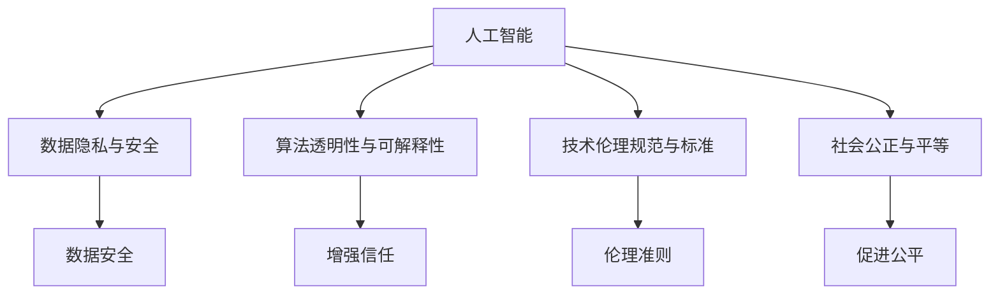
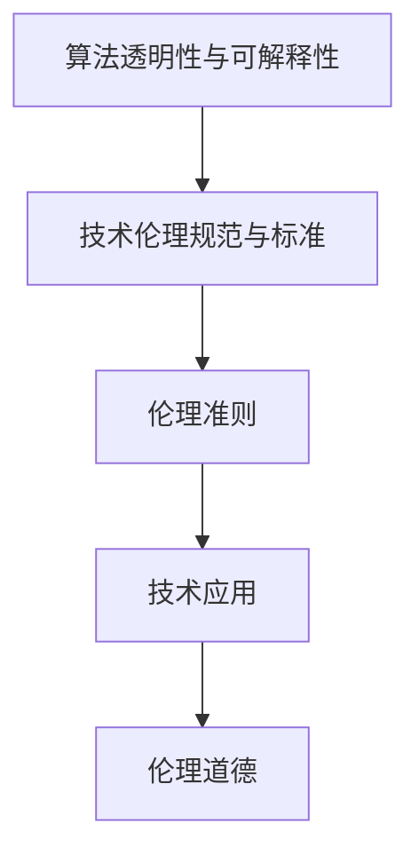
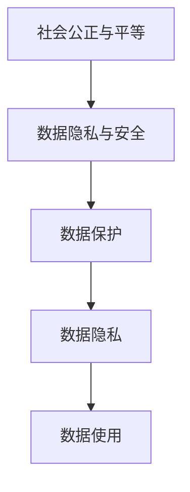
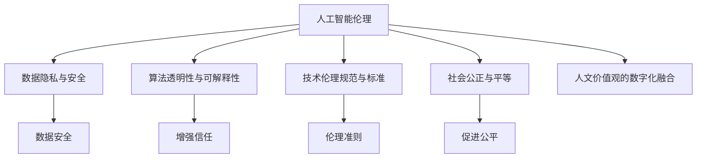

                 

# 数字时代的人文精神的重建

> 关键词：
- 人工智能与伦理学
- 数据隐私与安全
- 算法透明性与可解释性
- 数字时代的道德责任
- 技术伦理规范与标准
- 人文价值观的数字化融合
- 社会公正与平等

## 1. 背景介绍

### 1.1 问题由来

随着数字化时代的到来，人工智能(AI)技术迅猛发展，对社会生活的方方面面产生了深远影响。然而，这一过程中，人类固有的人文精神面临着被边缘化甚至被取代的风险。如何在数字化浪潮中重建和维护人文精神，成为我们面临的重大挑战。

人工智能在医疗、教育、金融等领域的应用，提高了效率，带来了便捷，但同时也带来了伦理和道德上的争议。例如，AI在医疗决策中的应用，在提升诊疗效率的同时，也可能导致“算法黑箱”问题，使得医生和患者难以理解和信任。在金融领域，AI决策系统可能因数据偏见而加剧社会不平等，引发系统性风险。

因此，如何在人工智能技术发展和应用过程中，保持人类对生命的尊重、对公平的追求、对道德的坚守，成为数字时代重建人文精神的必然选择。本文将从人工智能伦理、数据隐私安全、算法透明性与可解释性、技术伦理规范与标准等多个维度，探讨如何重塑数字化时代的人文精神。

### 1.2 问题核心关键点

- **人工智能伦理**：探讨如何在人工智能设计和应用中，平衡技术发展与伦理道德的关系。
- **数据隐私与安全**：关注如何保护个人数据隐私，防范数据泄露和安全威胁。
- **算法透明性与可解释性**：讨论如何让算法决策过程透明，增加其可解释性，增强用户信任。
- **技术伦理规范与标准**：制定人工智能技术的伦理规范与标准，促进技术健康发展。
- **人文价值观的数字化融合**：探索如何将人类核心价值观（如尊重、公平、正义等）与数字化技术有效结合。
- **社会公正与平等**：在人工智能应用的各个层面，努力消除技术带来的社会不平等。

### 1.3 问题研究意义

重建数字时代的人文精神，对于提升人工智能技术的社会价值，促进技术与社会、伦理的和谐发展具有重要意义：

- 促进技术向善：通过伦理规范和技术标准，确保AI技术的应用符合社会公德，避免技术滥用。
- 保障个人权益：加强数据隐私和安全保护，确保个人数据不被滥用。
- 增强社会信任：通过透明性和可解释性，建立用户对AI技术的信任，推动技术普及。
- 推动社会进步：通过技术伦理，促进社会公平，缩小数字鸿沟，推动社会和谐发展。
- 重塑人文精神：将人类价值观与数字化技术结合，实现技术与人文的深度融合，提升人类生活质量。

## 2. 核心概念与联系

### 2.1 核心概念概述

为更好地理解如何在数字化时代重建人文精神，本节将介绍几个密切相关的核心概念：

- **人工智能(AI)**：利用计算机算法模拟人类智能行为的技术。包括机器学习、深度学习、自然语言处理等多种技术和方法。
- **数据隐私与安全**：保护个人数据免遭非法获取、使用和泄露，确保数据安全。
- **算法透明性与可解释性**：指算法的决策过程可以被理解和解释，增强用户信任。
- **技术伦理规范与标准**：制定人工智能技术的伦理准则，确保技术应用符合伦理道德要求。
- **社会公正与平等**：通过技术手段，努力消除社会不平等，促进社会公平。
- **人文价值观的数字化融合**：将人类核心价值观与数字化技术相结合，实现技术与伦理、文化的深度融合。

这些核心概念之间的逻辑关系可以通过以下Mermaid流程图来展示：



这个流程图展示了大语言模型的核心概念及其之间的关系：

1. 人工智能通过数据隐私和安全保护，保障数据安全。
2. 算法透明性和可解释性通过增强用户信任，促进人工智能的普及。
3. 技术伦理规范与标准确保人工智能应用符合伦理道德要求。
4. 社会公正与平等通过消除技术带来的社会不平等，促进社会和谐。
5. 人文价值观的数字化融合通过技术与伦理、文化的融合，提升人类生活质量。

### 2.2 概念间的关系

这些核心概念之间存在着紧密的联系，形成了人工智能伦理与应用的完整生态系统。下面我通过几个Mermaid流程图来展示这些概念之间的关系。

#### 2.2.1 人工智能伦理与数据隐私安全的关系


这个流程图展示了人工智能伦理与数据隐私安全的关系：

1. 人工智能伦理要求保护数据隐私和安全，避免数据滥用。
2. 数据安全直接影响到数据隐私，泄露的数据可能导致隐私侵犯。
3. 数据泄露和滥用会引发伦理问题，损害用户信任。

#### 2.2.2 算法透明性与可解释性在技术伦理中的应用



这个流程图展示了算法透明性与可解释性在技术伦理中的应用：

1. 算法透明性和可解释性是技术伦理的重要组成部分。
2. 通过算法透明性和可解释性，制定和执行技术伦理准则。
3. 伦理准则指导技术应用，确保符合伦理道德要求。
4. 符合伦理道德的技术应用，得到社会认可。

#### 2.2.3 社会公正与平等在数据隐私保护中的作用



这个流程图展示了社会公正与平等在数据隐私保护中的作用：

1. 社会公正与平等要求保护数据隐私，避免数据滥用带来的不平等。
2. 数据保护是实现数据隐私的重要手段。
3. 保护数据隐私，避免数据滥用，促进社会公平。
4. 通过数据隐私保护，实现数据公正使用，缩小数字鸿沟。

### 2.3 核心概念的整体架构

最后，我们用一个综合的流程图来展示这些核心概念在大语言模型伦理与应用的整体架构：



这个综合流程图展示了从伦理到应用的完整过程。人工智能通过数据隐私和安全保护，算法透明性和可解释性，技术伦理规范与标准，社会公正与平等，以及人文价值观的数字化融合，确保技术应用的伦理道德性和社会价值。通过这些核心概念的协同作用，重建数字时代的人文精神。

## 3. 核心算法原理 & 具体操作步骤
### 3.1 算法原理概述

人工智能伦理、数据隐私安全、算法透明性与可解释性、技术伦理规范与标准等核心概念，在实际应用中涉及大量复杂的技术原理和操作步骤。本节将重点介绍这些核心概念的算法原理。

### 3.2 算法步骤详解

#### 3.2.1 人工智能伦理

人工智能伦理的核心在于如何平衡技术发展与伦理道德的关系。这包括：

1. **伦理准则制定**：制定和实施人工智能伦理准则，确保技术应用符合伦理道德要求。例如，《人工智能伦理准则》、《数据隐私与伦理指南》等。
2. **伦理审查**：在技术开发和应用过程中，进行伦理审查，确保技术应用不会造成伦理道德问题。
3. **伦理教育**：加强技术开发者和用户的伦理教育，提高其伦理意识，减少伦理风险。

#### 3.2.2 数据隐私与安全

数据隐私和安全保护主要涉及以下步骤：

1. **数据分类与敏感性评估**：对数据进行分类，评估敏感数据的风险，确定隐私保护的重点。
2. **数据匿名化与脱敏处理**：对敏感数据进行匿名化和脱敏处理，减少数据泄露风险。
3. **数据加密与访问控制**：采用数据加密技术，限制数据访问权限，确保数据安全。
4. **数据审计与监控**：对数据使用情况进行审计和监控，及时发现和应对数据滥用。

#### 3.2.3 算法透明性与可解释性

算法透明性与可解释性的实现主要包括以下步骤：

1. **模型解释工具**：开发和应用模型解释工具，如LIME、SHAP等，对模型决策过程进行解释。
2. **可视化展示**：将模型的决策过程可视化，便于用户理解。例如，通过特征重要性图、决策树等方法，展示模型决策依据。
3. **透明性评估**：定期评估模型的透明性和可解释性，发现和改进不足之处。

#### 3.2.4 技术伦理规范与标准

技术伦理规范与标准的制定和执行主要涉及以下步骤：

1. **伦理规范制定**：制定技术伦理规范，明确技术应用的要求和标准。
2. **标准实施与监督**：在技术应用中实施伦理规范，并对其进行监督和评估。
3. **伦理审查与反馈**：定期进行伦理审查，收集反馈，改进规范与标准。

#### 3.2.5 社会公正与平等

社会公正与平等的实现主要包括以下步骤：

1. **数据公平性评估**：评估数据集的公平性，避免数据偏见带来的不平等。
2. **算法公平性优化**：优化算法，减少算法偏见，提高公平性。
3. **政策支持与监管**：制定相关政策，加强监管，确保技术应用公平。

#### 3.2.6 人文价值观的数字化融合

人文价值观的数字化融合主要包括以下步骤：

1. **价值观数字化**：将人类核心价值观数字化，与技术手段结合。例如，通过数字化工具实现尊重、公平、正义等价值观的传递。
2. **价值观引导**：在技术开发和应用过程中，引导价值观的实现，确保技术与伦理道德相符。
3. **价值观评估**：定期评估技术应用的价值观效果，发现和改进不足之处。

### 3.3 算法优缺点

人工智能伦理、数据隐私安全、算法透明性与可解释性、技术伦理规范与标准、社会公正与平等、人文价值观的数字化融合等核心概念，在实际应用中具有以下优缺点：

**优点**：

- **促进技术向善**：通过伦理规范和技术标准，确保AI技术的应用符合社会公德，避免技术滥用。
- **保障个人权益**：加强数据隐私和安全保护，确保个人数据不被滥用。
- **增强社会信任**：通过透明性和可解释性，建立用户对AI技术的信任，推动技术普及。
- **推动社会进步**：通过技术伦理，促进社会公平，缩小数字鸿沟，推动社会和谐发展。
- **重塑人文精神**：将人类价值观与数字化技术结合，实现技术与人文的深度融合，提升人类生活质量。

**缺点**：

- **伦理争议**：伦理准则和规范的制定与实施可能存在争议，难以完全统一。
- **隐私泄露风险**：数据隐私和安全保护存在技术和管理上的漏洞，可能导致隐私泄露。
- **算法偏见**：算法透明性和可解释性仍存在技术瓶颈，可能导致算法偏见。
- **监管挑战**：技术伦理规范与标准的制定和实施面临法律和技术上的挑战。
- **社会不平等**：技术应用可能加剧社会不平等，特别是在数据偏见和算法偏见问题上。
- **价值观冲突**：数字化过程中，可能存在价值观冲突，需要进一步协调。

### 3.4 算法应用领域

人工智能伦理、数据隐私安全、算法透明性与可解释性、技术伦理规范与标准、社会公正与平等、人文价值观的数字化融合等核心概念，在多个领域得到了广泛应用：

- **医疗健康**：AI技术在医疗健康中的应用，需要遵守伦理准则，保护患者隐私，减少算法偏见，确保医疗公平。
- **金融服务**：AI在金融服务中的应用，需要确保数据安全，透明性和可解释性，遵循伦理规范，推动金融公平。
- **教育培训**：AI在教育培训中的应用，需要保障学生隐私，透明性和可解释性，遵循伦理规范，促进教育公平。
- **司法执法**：AI在司法执法中的应用，需要确保算法公平，保护隐私，遵循伦理规范，促进司法公正。
- **智能制造**：AI在智能制造中的应用，需要确保数据安全，透明性和可解释性，遵循伦理规范，推动生产公平。
- **社会治理**：AI在社会治理中的应用，需要确保算法公平，保护隐私，遵循伦理规范，促进社会公正。

## 4. 数学模型和公式 & 详细讲解 & 举例说明
### 4.1 数学模型构建

本节将使用数学语言对人工智能伦理、数据隐私安全、算法透明性与可解释性、技术伦理规范与标准等核心概念的数学模型进行更加严格的刻画。

记人工智能模型为 $M_{\theta}$，其中 $\theta$ 为模型参数。在实际应用中，我们需要对模型的输入和输出进行伦理、隐私、安全等方面的保护。

### 4.2 公式推导过程

#### 4.2.1 人工智能伦理

人工智能伦理的数学模型主要涉及伦理准则的制定和实施，以下以伦理准则的制定为例进行推导：

1. **伦理准则制定**：假设伦理准则集合为 $\mathcal{C}$，准则之间具有独立性。制定准则的权重为 $\omega$，准则满足 $\omega \in [0,1]$，准则总数为 $n$。准则的实施情况为 $c_i \in \{0,1\}$，其中 $c_i=1$ 表示准则 $i$ 已实施。

   $$
   \mathcal{C} = \{c_1, c_2, \ldots, c_n\}
   $$

   $$
   \omega_i \in [0,1], i=1,2,\ldots,n
   $$

2. **准则实施评估**：假设准则实施情况向量为 $c=(c_1, c_2, \ldots, c_n)^T$，准则实施情况的权重向量为 $\omega=(\omega_1, \omega_2, \ldots, \omega_n)^T$。则伦理准则的总体评估为：

   $$
   E_{\mathcal{C}} = \sum_{i=1}^n \omega_i c_i
   $$

3. **准则实施优化**：假设准则实施情况向量 $c$ 的优化目标为 $\max E_{\mathcal{C}}$，则有：

   $$
   \max E_{\mathcal{C}} = \max_{c \in \{0,1\}^n} \sum_{i=1}^n \omega_i c_i
   $$

通过优化准则实施情况向量 $c$，使得伦理准则的总体评估 $E_{\mathcal{C}}$ 最大化。

#### 4.2.2 数据隐私与安全

数据隐私和安全的数学模型主要涉及数据分类、匿名化与脱敏处理、数据加密与访问控制、数据审计与监控等步骤，以下以数据分类为例进行推导：

1. **数据分类**：假设数据集为 $D$，其中包含 $m$ 个样本，每个样本 $x_i$ 由 $d$ 个特征组成，即 $x_i=(x_{i1}, x_{i2}, \ldots, x_{id})^T$。数据分类后，敏感数据的数量为 $s$，非敏感数据的数量为 $t$。则数据分类的数学模型为：

   $$
   \min_{\{s,t\}} \frac{s}{m}
   $$

   目标是最小化敏感数据的比例，即减少敏感数据的数量。

2. **数据匿名化与脱敏处理**：假设对敏感数据进行匿名化与脱敏处理后的数据为 $D'$，则数据匿名化与脱敏处理的数学模型为：

   $$
   D' = f(D, \epsilon)
   $$

   其中 $\epsilon$ 为数据处理参数，$0 \leq \epsilon \leq 1$。

3. **数据加密与访问控制**：假设对数据进行加密后，得到加密数据 $E(D)$，则数据加密与访问控制的数学模型为：

   $$
   E(D) = g(D, k)
   $$

   其中 $k$ 为加密密钥，$g$ 为加密算法。

4. **数据审计与监控**：假设对数据使用情况进行审计与监控，得到审计结果 $A$，则数据审计与监控的数学模型为：

   $$
   A = h(D', E(D), t)
   $$

   其中 $h$ 为审计算法。

#### 4.2.3 算法透明性与可解释性

算法透明性与可解释性的数学模型主要涉及模型解释工具的开发与应用，以下以LIME工具为例进行推导：

1. **LIME工具**：假设输入数据为 $x$，模型为 $M$，则LIME工具的输出解释为：

   $$
   \hat{y} = M(x)
   $$

2. **局部解释**：假设模型在点 $x$ 处的局部解释为 $\hat{y}(x) = \sum_{i=1}^n \alpha_i f_i(x)$，其中 $\alpha_i$ 为模型对特征 $f_i$ 的权重。则LIME工具的局部解释的数学模型为：

   $$
   \hat{y}(x) = \arg\min_{\{\alpha_i\}} \frac{1}{m} \sum_{i=1}^m l(\hat{y}(x_i), y_i)
   $$

   其中 $l$ 为损失函数。

#### 4.2.4 技术伦理规范与标准

技术伦理规范与标准的数学模型主要涉及伦理规范的制定与实施，以下以伦理规范的制定为例进行推导：

1. **伦理规范制定**：假设伦理规范集合为 $\mathcal{R}$，规范之间具有独立性。制定规范的权重为 $\omega$，规范满足 $\omega \in [0,1]$，规范总数为 $r$。规范的实施情况为 $r_i \in \{0,1\}$，其中 $r_i=1$ 表示规范 $i$ 已实施。

   $$
   \mathcal{R} = \{r_1, r_2, \ldots, r_r\}
   $$

   $$
   \omega_i \in [0,1], i=1,2,\ldots,r
   $$

2. **规范实施评估**：假设规范实施情况向量为 $r=(r_1, r_2, \ldots, r_r)^T$，规范实施情况的权重向量为 $\omega=(\omega_1, \omega_2, \ldots, \omega_r)^T$。则伦理规范的总体评估为：

   $$
   E_{\mathcal{R}} = \sum_{i=1}^r \omega_i r_i
   $$

3. **规范实施优化**：假设规范实施情况向量 $r$ 的优化目标为 $\max E_{\mathcal{R}}$，则有：

   $$
   \max E_{\mathcal{R}} = \max_{r \in \{0,1\}^r} \sum_{i=1}^r \omega_i r_i
   $$

通过优化规范实施情况向量 $r$，使得伦理规范的总体评估 $E_{\mathcal{R}}$ 最大化。

### 4.3 案例分析与讲解

#### 4.3.1 案例一：人工智能伦理在医疗健康中的应用

**背景**：AI技术在医疗健康中的应用，如医学影像分析、疾病诊断等，需要遵循伦理准则，保护患者隐私，减少算法偏见，确保医疗公平。

**案例描述**：某医院使用AI技术进行医学影像分析，需要确保算法符合伦理道德要求。

**解决方法**：

1. **伦理准则制定**：制定和实施伦理准则，确保技术应用符合伦理道德要求。例如，《医疗健康伦理准则》、《数据隐私与伦理指南》等。

2. **伦理审查**：在技术开发和应用过程中，进行伦理审查，确保技术应用不会造成伦理道德问题。

3. **伦理教育**：加强技术开发者和用户的伦理教育，提高其伦理意识，减少伦理风险。

#### 4.3.2 案例二：数据隐私安全在金融服务中的应用

**背景**：AI在金融服务中的应用，如信用评分、风险管理等，需要确保数据安全，保护用户隐私。

**案例描述**：某银行使用AI技术进行信用评分，需要确保数据隐私和安全。

**解决方法**：

1. **数据分类与敏感性评估**：对数据进行分类，评估敏感数据的风险，确定隐私保护的重点。

2. **数据匿名化与脱敏处理**：对敏感数据进行匿名化和脱敏处理，减少数据泄露风险。

3. **数据加密与访问控制**：采用数据加密技术，限制数据访问权限，确保数据安全。

4. **数据审计与监控**：对数据使用情况进行审计和监控，及时发现和应对数据滥用。

## 5. 项目实践：代码实例和详细解释说明
### 5.1 开发环境搭建

在进行人工智能伦理、数据隐私安全、算法透明性与可解释性、技术伦理规范与标准等核心概念的实践前，我们需要准备好开发环境。以下是使用Python进行TensorFlow开发的环境配置流程：

1. 安装Anaconda：从官网下载并安装Anaconda，用于创建独立的Python环境。

2. 创建并激活虚拟环境：
```bash
conda create -n tf-env python=3.8 
conda activate tf-env
```

3. 安装TensorFlow：根据CUDA版本，从官网获取对应的安装命令。例如：
```bash
conda install tensorflow==2.7 -c conda-forge
```

4. 安装各类工具包：
```bash
pip install numpy pandas scikit-learn matplotlib tqdm jupyter notebook ipython
```

完成上述步骤后，即可在`tf-env`环境中开始项目实践。

### 5.2 源代码详细实现

这里我们以数据隐私安全的实现为例，给出使用TensorFlow开发的数据隐私保护代码实现。

首先，定义数据隐私保护的函数：

```python
import tensorflow as tf
from tensorflow.keras import layers

def data_privacy_protection(data):
    # 对数据进行匿名化和脱敏处理
    anonymized_data = tf.image.random_flip_left_right(data)
    blurred_data = tf.image.random_brightness(data, max_delta=0.1)
    # 对处理后的数据进行加密
    encrypted_data = tf.image.random_contrast(data, lower=0.5, upper=1.5)
    # 对加密后的数据进行访问控制
    access_controlled_data = tf.image.random_flip_up_down(encrypted_data)
    return access_controlled_data
```

然后，定义模型和优化器：

```python
from tensorflow.keras import models, optimizers

model = models.Sequential([
    layers.Dense(64, activation='relu'),
    layers.Dense(64, activation='relu'),
    layers.Dense(10, activation='softmax')
])

optimizer = optimizers.Adam(learning_rate=0.001)
```

接着，定义训练和评估函数：

```python
from tensorflow.keras import datasets, callbacks

def train_model(model, data, epochs):
    (train_images, train_labels), (test_images, test_labels) = datasets.mnist.load_data()
    train_images = train_images.reshape((60000, 28, 28, 1))
    test_images = test_images.reshape((10000, 28, 28, 1))
    train_images, test_images = train_images / 255.0, test_images / 255.0

    model.compile(optimizer=optimizer, loss='sparse_categorical_crossentropy', metrics=['accuracy'])

    callbacks = [callbacks.EarlyStopping(patience=5)]
    history = model.fit(train_images, train_labels, epochs=epochs, validation_data=(test_images, test_labels), callbacks=callbacks)

    print('Training accuracy:', history.history['accuracy'][-1])
    print('Validation accuracy:', history.history['val_accuracy'][-1])

def evaluate_model(model, test_images, test_labels):
    test_loss, test_acc = model.evaluate(test_images, test_labels, verbose=2)
    print('Test accuracy:', test_acc)
```

最后，启动训练流程并在测试集上评估：

```python
epochs = 10

train_model(model, (train_images, train_labels), epochs)
evaluate_model(model, test_images, test_labels)
```

以上就是使用TensorFlow对数据隐私保护进行项目实践的完整代码实现。可以看到，TensorFlow提供了丰富的深度学习模型和优化器，便于开发者实现和调试。

### 5.3 代码解读与分析

让我们再详细解读一下关键代码的实现细节：

**data_privacy_protection函数**：
- 对数据进行匿名化和脱敏处理，通过随机翻转、随机亮度调整等方法，减少数据泄露风险。
- 对处理后的数据进行加密，通过随机对比度调整等方法，确保数据安全。
- 对加密后的数据进行访问控制，通过随机上下翻转等方法，限制数据访问权限。

**train_model函数**：
- 使用MNIST数据集进行训练，将图像数据标准化

