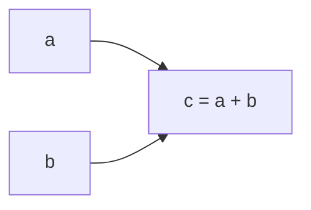
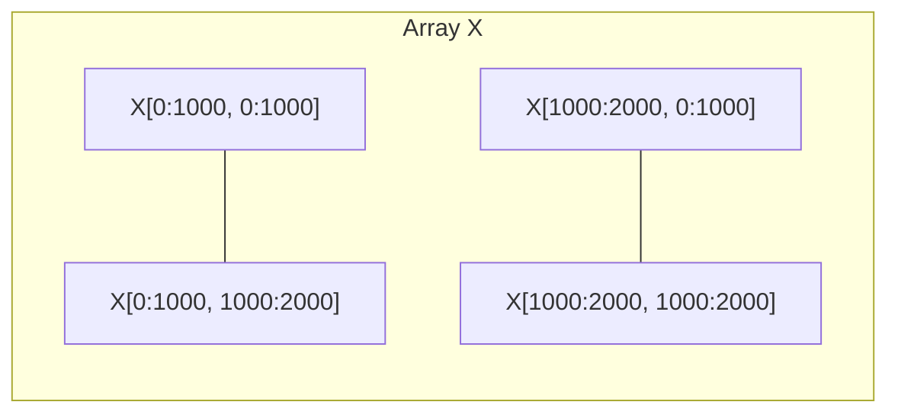

# Python机器学习实战：分布式机器学习框架Dask的入门与实战

## 1. 背景介绍

### 1.1 问题的由来

在当今大数据时代，数据量的爆炸式增长带来了巨大的计算和存储挑战。传统的单机计算资源已经无法满足海量数据处理的需求,因此分布式计算框架应运而生。然而,在机器学习领域,由于算法的复杂性和数据的高维特征,分布式计算也面临着诸多挑战。

### 1.2 研究现状

目前,Apache Spark是最流行的大数据分布式计算框架之一,它提供了高度优化的内存计算引擎,可以有效地处理大规模数据集。但是,Spark主要专注于批量数据处理,对于迭代式计算和实时数据流处理来说,性能并不理想。另一方面,Dask则是一个轻量级的分布式计算框架,它专门为Python生态系统设计,可以无缝集成NumPy、Pandas、Scikit-Learn等流行的数据科学库,为机器学习任务提供高效的分布式计算支持。

### 1.3 研究意义

Dask的出现为Python机器学习社区带来了全新的分布式计算能力,它可以极大地提高机器学习算法的计算效率,加快模型训练和预测的速度。同时,Dask还具有良好的可扩展性和容错性,能够在多个节点上并行执行计算任务,从而实现更高的吞吐量和更低的延迟。此外,Dask与Python生态系统的无缝集成,使得数据科学家和机器学习工程师可以轻松地将其集成到现有的工作流程中,从而提高生产力和效率。

### 1.4 本文结构

本文将全面介绍Dask分布式机器学习框架的基础知识、核心概念、算法原理、数学模型、代码实现、实际应用场景等内容。文章分为以下几个部分:

1. 背景介绍
2. 核心概念与联系
3. 核心算法原理与具体操作步骤
4. 数学模型和公式详细讲解与举例说明
5. 项目实践:代码实例和详细解释说明
6. 实际应用场景
7. 工具和资源推荐
8. 总结:未来发展趋势与挑战
9. 附录:常见问题与解答

## 2. 核心概念与联系

在深入探讨Dask的核心算法和实现细节之前,我们先来了解一些基本概念和术语:

1. **任务图(Task Graph)**: Dask将计算过程表示为一个有向无环图,称为任务图。每个节点代表一个待执行的任务,边表示任务之间的依赖关系。

2. **延迟计算(Lazy Evaluation)**: Dask采用延迟计算的策略,即在定义计算图时不会立即执行,而是等到需要结果时才触发实际计算。这种策略可以减少不必要的中间计算,提高效率。

3. **块(Chunk)**: 为了实现并行计算,Dask将大数据集划分为多个块,每个块可以在不同的worker节点上独立处理。

4. **调度器(Scheduler)**: Dask的调度器负责管理任务图的执行,将任务分发到不同的worker节点进行计算,并收集计算结果。

5. **工作节点(Worker)**: 工作节点是实际执行计算任务的计算资源,可以是单机多核CPU,也可以是分布式集群。

6. **集群资源管理(Cluster Resource Management)**: Dask可以与多种集群资源管理系统(如YARN、Kubernetes等)集成,实现对计算资源的高效利用和弹性扩展。

这些核心概念相互关联,共同构建了Dask分布式计算的基础架构。下面我们将进一步探讨Dask的核心算法原理和实现细节。

## 3. 核心算法原理与具体操作步骤

### 3.1 算法原理概述

Dask的核心算法原理可以概括为以下几个关键步骤:

1. **任务图构建**: 根据用户定义的计算过程,Dask构建一个有向无环的任务图,表示各个计算任务之间的依赖关系。

2. **数据划分**: Dask将大数据集划分为多个块,每个块可以在不同的worker节点上独立处理。

3. **任务调度**: Dask的调度器根据任务图和数据块的位置,将任务分发到不同的worker节点执行。

4. **结果收集**: 当所有任务完成后,调度器收集各个worker节点的计算结果,并进行必要的合并和后处理操作。

5. **容错与重试**: 如果某个任务失败,Dask会自动重试或将任务分发到其他可用的worker节点执行。

6. **优化策略**: Dask采用多种优化策略,如工作窃取、内存映射、数据局部性等,以提高计算效率和资源利用率。

下面我们将详细介绍这些关键步骤的具体实现细节。

### 3.2 算法步骤详解

#### 3.2.1 任务图构建

Dask使用有向无环图(DAG)来表示计算过程,每个节点代表一个任务,边表示任务之间的依赖关系。当用户定义计算过程时,Dask会自动构建相应的任务图。例如,对于一个简单的数组加法操作`c = a + b`,Dask会构建如下任务图:

对于更复杂的计算过程,Dask会递归地构建嵌套的任务图,确保正确捕获所有依赖关系。

#### 3.2.2 数据划分

为了实现并行计算,Dask将大数据集划分为多个块。每个块可以在不同的worker节点上独立处理,从而提高计算效率。Dask支持多种数据格式(如NumPy数组、Pandas DataFrame等)的划分,并提供了灵活的划分策略,如基于行、列或块大小进行划分。

例如,对于一个大型NumPy数组`x`,Dask可以将其划分为多个块,每个块包含一部分数据:

#### 3.2.3 任务调度

Dask的调度器负责管理任务图的执行,将任务分发到不同的worker节点进行计算。调度器采用延迟计算策略,即在定义计算图时不会立即执行,而是等到需要结果时才触发实际计算。

调度器使用多种调度算法,如工作窃取(work-stealing)、深度优先调度(DFS)等,以确保任务的高效执行。同时,调度器还考虑数据局部性,尽可能将任务分发到存储相关数据块的worker节点上,从而减少数据传输开销。

#### 3.2.4 结果收集

当所有任务完成后,调度器收集各个worker节点的计算结果,并进行必要的合并和后处理操作。对于某些操作(如reduce、join等),Dask会自动执行合并和聚合,以生成最终结果。

#### 3.2.5 容错与重试

在分布式计算环境中,任务失败是不可避免的。Dask采用多种容错和重试机制,确保计算的可靠性和正确性。

- **任务重试**: 如果某个任务失败,Dask会自动重试该任务,直到成功或达到最大重试次数。

- **工作节点故障恢复**: 如果某个worker节点发生故障,Dask会将该节点上的任务重新分发到其他可用的worker节点执行。

- **中间数据持久化**: Dask支持将中间计算结果持久化到磁盘或内存中,以便在发生故障时快速恢复。

#### 3.2.6 优化策略

为了提高计算效率和资源利用率,Dask采用了多种优化策略:

- **工作窃取(Work-stealing)**: 当某个worker节点空闲时,它可以从其他繁忙的节点"窃取"任务来执行,从而提高资源利用率。

- **内存映射(Memory Mapping)**: Dask可以将大型数据集映射到内存中,避免频繁的磁盘I/O操作,提高计算速度。

- **数据局部性(Data Locality)**: 调度器会尽可能将任务分发到存储相关数据块的worker节点上,减少数据传输开销。

- **延迟计算(Lazy Evaluation)**: Dask采用延迟计算策略,只在需要结果时才触发实际计算,从而避免不必要的中间计算。

- **自动融合(Automatic Fusion)**: Dask可以自动将多个小任务融合为一个大任务执行,减少任务调度和数据传输开销。

### 3.3 算法优缺点

#### 优点:

1. **高效并行计算**: Dask可以有效利用多核CPU和分布式集群资源,实现高效的并行计算。

2. **与Python生态系统无缝集成**: Dask与NumPy、Pandas、Scikit-Learn等流行的数据科学库无缝集成,使用起来非常方便。

3. **容错和可靠性**: Dask具有良好的容错能力,能够自动重试失败的任务,并在节点故障时进行恢复。

4. **灵活的资源管理**: Dask可以与多种集群资源管理系统(如YARN、Kubernetes等)集成,实现对计算资源的高效利用和弹性扩展。

5. **延迟计算和优化策略**: Dask采用延迟计算策略和多种优化策略(如工作窃取、内存映射等),提高计算效率和资源利用率。

#### 缺点:

1. **学习曲线陡峭**: Dask的概念和使用方式与传统的Python数据处理库有所不同,需要一定的学习成本。

2. **调试和故障排查困难**:由于Dask的分布式特性,调试和故障排查可能比单机环境更加困难。

3. **内存开销较大**: Dask需要在内存中维护任务图和中间计算结果,对内存的需求较高。

4. **不适合小规模数据处理**: Dask主要针对大规模数据处理场景,对于小规模数据处理可能会带来不必要的开销。

5. **与其他大数据框架集成困难**: Dask目前主要集成了Python生态系统中的库,与其他大数据框架(如Apache Spark)的集成仍然存在一定困难。

### 3.4 算法应用领域

Dask分布式计算框架可以广泛应用于以下领域:

1. **机器学习和数据挖掘**: Dask可以加速机器学习算法的训练和预测过程,特别是对于大规模数据集。

2. **科学计算和数值分析**: Dask支持NumPy和其他科学计算库,可以用于大规模数值计算和模拟。

3. **大数据处理和分析**: Dask可以高效处理TB级别的大数据集,用于数据清洗、转换、聚合等操作。

4. **图像处理和计算机视觉**: Dask可以并行处理大量图像数据,应用于图像分类、目标检测等任务。

5. **自然语言处理**: Dask可以加速大规模文本数据的预处理、特征提取和模型训练过程。

6. **生物信息学和基因组学**: Dask可以用于处理大规模基因组数据,加速生物信息学研究。

7. **物联网和时序数据处理**: Dask可以高效处理大量实时传感器数据,用于物联网和时序数据分析。

总的来说,Dask为Python机器学习和数据科学领域带来了强大的分布式计算能力,极大地提高了计算效率和数据处理能力。

## 4. 数学模型和公式详细讲解与举例说明

在探讨Dask的核心算法原理时,我们需要涉及一些数学模型和公式。本节将详细讲解这些数学模型和公式,并通过具体案例进行说明。

### 4.1 数学模型构建

#### 4.1.1 任务图模型

Dask使用有向无环图(DAG)来表示计算过程,每个节点代表一个任务,边表示任务之间的依赖关系。我们可以使用图论中的相关概念和术语来描述任务图。

设$G=(V,E)$表示任务图,