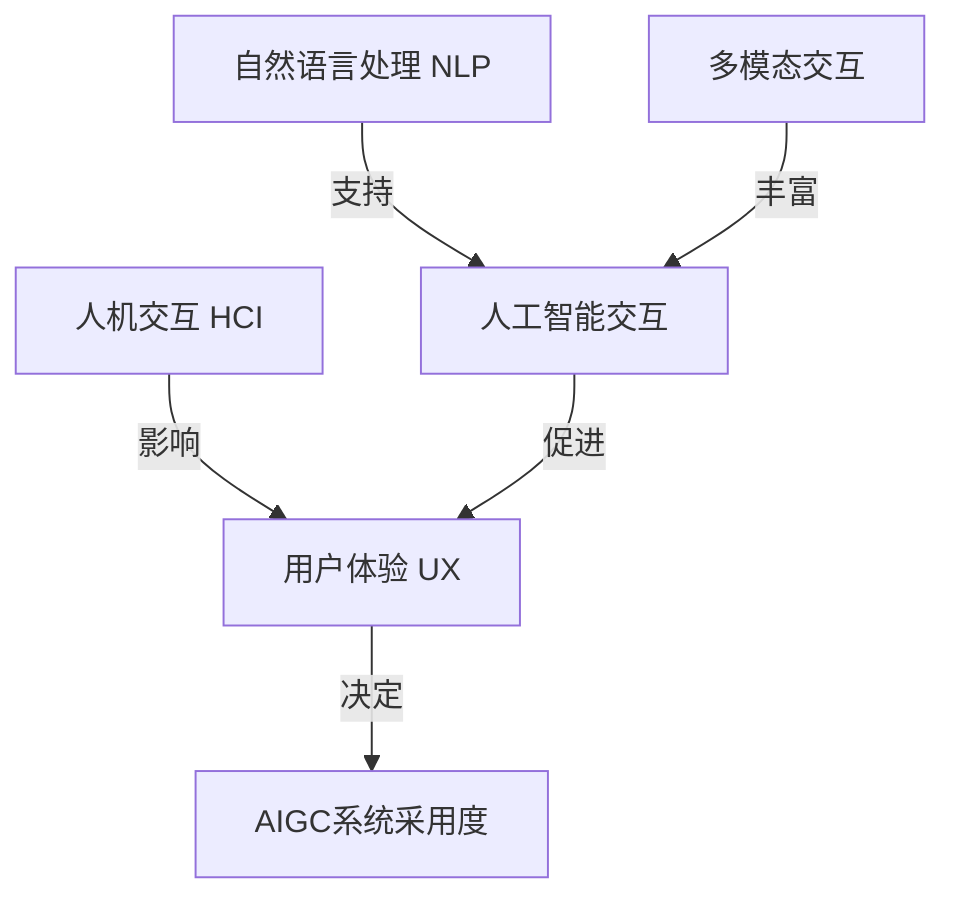

# 生成式AIGC是金矿还是泡沫：缺的不是技术而是"让人尖叫"的用户体验

## 1. 背景介绍

### 1.1 问题的由来

人工智能生成内容（AIGC）技术近年来突飞猛进，从文本到图像、视频、音频等多种形式的内容均可通过AI模型自动生成。这种生成式AI技术的兴起，给传统内容创作行业带来了巨大冲击，引发了热烈的讨论和争议。

一方面，AIGC技术可以极大提高内容生产效率，降低成本，为内容创作者提供强大的辅助工具。另一方面，也有人担心AI生成内容会取代人类创作者的工作，并可能产生低质量、缺乏创意的"垃圾内容"，影响内容质量。

在这场技术革命的浪潮中，一个关键问题浮出水面：生成式AIGC到底是一座金矿还是一个泡沫？答案或许就藏在用户体验中。

### 1.2 研究现状

目前，AIGC技术在多个领域已经取得了长足进步，例如：

- 文本生成：GPT-3等大型语言模型可以生成看似人性化的文本内容，如新闻报道、小说、诗歌等。
- 图像生成：Stable Diffusion、DALL-E等模型可以根据文本描述生成逼真的图像。
- 视频生成：一些AI模型能够根据文本输入生成短视频。
- 音频生成：AI可以模仿人声、合成音乐等。

然而，尽管技术层面取得了突破性进展，但AIGC的用户体验仍然存在诸多不足，制约了其在实际应用中的广泛采用。

### 1.3 研究意义

提升AIGC的用户体验是推动这一技术落地的关键。只有当AIGC能够真正满足用户需求、提供出色的体验时，它才能被大众所接受和使用。因此，研究如何优化AIGC的用户体验，对于释放这一技术的巨大潜力至关重要。

本文将深入探讨AIGC用户体验的现状和挑战，提出改进建议，并展望未来发展趋势，以期为AIGC技术的成熟和普及贡献一份力量。

### 1.4 本文结构

本文将从以下几个方面对AIGC的用户体验进行全面分析：

1. 背景介绍：阐述AIGC技术的发展现状及用户体验的重要性。
2. 核心概念与联系：介绍AIGC用户体验相关的核心概念及其关联。
3. 核心算法原理与具体操作步骤：解析AIGC中用于优化用户体验的关键算法。
4. 数学模型和公式详细讲解与举例说明：深入探讨AIGC用户体验优化中的数学模型及公式推导。
5. 项目实践：代码实例和详细解释说明：提供实际项目案例，分析代码实现细节。
6. 实际应用场景：探讨AIGC优化用户体验的实际应用场景及未来展望。
7. 工具和资源推荐：介绍相关学习资源、开发工具和论文等。
8. 总结：未来发展趋势与挑战：总结研究成果，展望发展趋势并分析面临的挑战。
9. 附录：常见问题与解答：解答AIGC用户体验优化相关的常见问题。

## 2. 核心概念与联系

在探讨AIGC用户体验优化之前，我们需要先了解一些核心概念及其相互关联。

### 2.1 人机交互(Human-Computer Interaction, HCI)

人机交互是研究人与计算机之间交互过程的一门学科。它关注如何设计用户友好、高效的交互界面和体验。在AIGC系统中,人机交互扮演着至关重要的角色,决定了用户与AI模型之间的交互质量。

### 2.2 用户体验(User Experience, UX)

用户体验指用户在使用某个产品或服务时的整体感受和满意度。良好的用户体验可以提高用户粘性,增强用户对产品的信任和依赖。对于AIGC系统而言,优秀的用户体验是吸引用户、推广技术的关键所在。

### 2.3 人工智能交互(Human-AI Interaction)

人工智能交互是一个新兴的研究领域,专注于探索人与AI系统之间的交互方式。它结合了人机交互和人工智能技术,旨在设计出自然、高效的人机交互模式,提升AI系统的可用性和用户体验。

### 2.4 自然语言处理(Natural Language Processing, NLP)

自然语言处理是人工智能的一个分支,致力于让计算机能够理解和生成人类语言。在AIGC系统中,NLP技术被广泛应用于理解用户输入的自然语言指令,并生成相应的内容输出。

### 2.5 多模态交互(Multimodal Interaction)

多模态交互指的是人与计算机系统之间通过多种模态(如语音、手势、眼动等)进行交互的过程。在AIGC场景下,多模态交互可以让用户以更自然、高效的方式与AI模型进行内容创作互动。

上述概念相互关联、环环相扣,共同构建了AIGC系统优秀用户体验的理论基础和技术支撑。

## 3. 核心算法原理与具体操作步骤

优化AIGC系统的用户体验离不开先进的算法支持。本节将介绍其中的两种核心算法:基于强化学习的对话策略优化算法和基于注意力机制的多模态融合算法。

### 3.1 算法原理概述

#### 3.1.1 基于强化学习的对话策略优化算法

这种算法旨在通过强化学习,训练出一个优化的对话策略模型,使得AIGC系统能够生成更加自然、贴合上下文的响应,提升用户体验。

算法原理如下:

1. 构建对话环境:将人机对话过程建模为马尔可夫决策过程。
2. 定义奖励函数:根据对话质量设计合理的奖励函数,作为强化学习的目标。
3. 策略迭代优化:使用强化学习算法(如策略梯度)不断优化对话策略模型的参数。
4. 模型部署:将训练好的对话策略模型集成到AIGC系统中。

#### 3.1.2 基于注意力机制的多模态融合算法

这种算法旨在有效融合多种模态输入(如文本、图像、语音等),生成高质量的多模态输出,提升AIGC系统的交互体验。

算法原理如下:

1. 模态编码:将不同模态的输入数据编码为对应的特征表示。
2. 注意力计算:通过注意力机制,自适应地学习不同模态特征之间的相关性权重。
3. 特征融合:根据学习到的注意力权重,将多模态特征进行加权融合。
4. 解码生成:将融合后的特征解码,生成所需的多模态输出。

### 3.2 算法步骤详解

#### 3.2.1 基于强化学习的对话策略优化算法

1. **构建对话环境**
    - 将人机对话过程建模为马尔可夫决策过程(MDP)
    - 状态空间S:包含对话历史和上下文信息
    - 动作空间A:代理可执行的响应动作(生成的对话回复)
    - 转移概率P(s'|s,a):从状态s执行动作a后,转移到状态s'的概率
    - 奖励函数R(s,a):评估动作a在状态s下的质量分数

2. **定义奖励函数**
    - 奖励函数R(s,a)需要量化对话质量,可设计为多项指标的加权组合:
        - 语义相关性:回复与上下文的语义相关程度
        - 流畅性:回复的语言流畅、通顺程度
        - 多样性:回复的多样性和创新性
        - 知识一致性:回复内容与知识库的一致性
        - ...

3. **策略迭代优化**
    - 初始化一个对话策略模型π(a|s),模型参数θ
    - 对话模拟交互:根据π(a|s)生成动作序列,并在环境中执行
    - 计算累积奖励:R = Σ γ^t * R(s_t, a_t)  (γ为折现因子)
    - 策略梯度更新:max E[R] => θ = θ + α * ∇θ log π(a|s) * R  (α为学习率)
    - 重复上述过程,直至策略收敛

4. **模型部署**
    - 将训练好的对话策略模型π(a|s)集成到AIGC系统中
    - 在实际对话时,模型根据当前状态s输出最优响应动作a

#### 3.2.2 基于注意力机制的多模态融合算法

1. **模态编码**
    - 文本编码:使用BERT等预训练语言模型编码文本输入
    - 图像编码:使用CNN等卷积神经网络编码图像输入
    - 语音编码:使用Speech Transformer等模型编码语音输入
    - ...

2. **注意力计算**
    - 对每一对模态特征(如文本特征和图像特征),计算注意力权重矩阵:
        $$ \mathrm{Attention}(Q, K, V) = \mathrm{softmax}(\frac{QK^T}{\sqrt{d_k}})V $$
        - Q:查询向量(来自一种模态)
        - K:键向量(来自另一模态)
        - V:值向量(来自另一模态)
        - 通过点积计算Q和K的相关性,得到注意力权重

3. **特征融合**
    - 将加权后的不同模态特征进行融合:
        $$ \mathrm{MultiModal\_Feature} = \sum_{i=1}^{M}w_i*\mathrm{Attention}(Q_i, K_i, V_i) $$
        - M:模态数量
        - w_i:第i个模态的权重(可训练或手动设置)

4. **解码生成**
    - 将融合的多模态特征输入解码器(如Transformer解码器)
    - 解码器生成所需的多模态输出(如文本、图像等)

通过上述算法步骤,AIGC系统可以学会自适应地融合多模态输入,生成高质量、与输入语义高度相关的多模态输出,从而提升用户交互体验。

### 3.3 算法优缺点

#### 3.3.1 基于强化学习的对话策略优化算法

优点:
- 可以直接优化对话质量,提升用户体验
- 策略模型具有很强的泛化能力,可应对多样化的对话场景
- 奖励函数设计灵活,可根据需求量身定制

缺点:
- 需要大量的人工对话数据用于策略训练
- 训练过程计算代价高,收敛较慢
- 奖励函数的设计对算法性能影响较大,需要一定的经验

#### 3.3.2 基于注意力机制的多模态融合算法

优点:
- 能够自适应地融合多种模态输入,提高交互自然性
- 注意力机制赋予了模型"selective看"的能力,聚焦于重要信息
- 生成的多模态输出与输入高度相关,提升了输出质量

缺点:
- 需要大量标注的多模态数据集进行训练
- 不同模态之间的特征表示存在差异,需要进行对齐
- 模态之间的注意力计算成本较高

### 3.4 算法应用领域

上述两种算法可广泛应用于各种AIGC场景,以优化人机交互体验:

- 对话系统:基于强化学习的对话策略优化可提升对话自然性、一致性。
- 多模态内容生成:注意力融合算法可用于生成图文视频等多模态内容。
- 智能助手:两种算法的结合可构建出人机交互体验卓越的智能助手。
- 教育领域:个性化、多模态的AI教学相比传统方式可提供更佳体验。
- 游戏、娱乐:AI