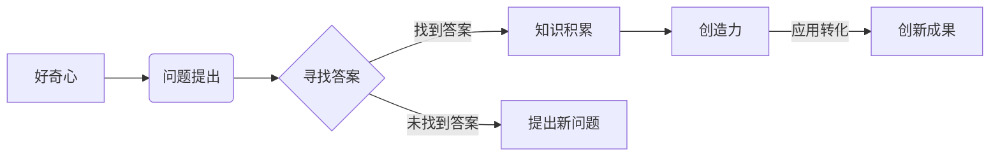

# 好奇心与创造力：探索的双翼

> 关键词：好奇心，创造力，探索，创新，思维模式，问题解决，认知科学，技术发展

## 1. 背景介绍

在人类历史上，好奇心和创造力一直是推动科技进步和社会发展的强大动力。从古埃及的金字塔到现代的互联网，从古希腊的哲学思辨到现代的量子计算，好奇心和创造力塑造了我们的世界，定义了人类的未来。

本文旨在探讨好奇心与创造力的本质，分析它们之间的相互关系，并探讨如何在技术和工程领域激发这些宝贵的品质，以推动创新和技术进步。

### 1.1 好奇心的起源

好奇心是人类与生俱来的特质，它起源于我们对未知世界的探索欲和对自我认知的渴望。在认知科学中，好奇心被看作是一种认知状态，它激发我们提出问题、寻找答案，并不断寻求新的知识。

### 1.2 创造力的定义

创造力是指产生新颖、有价值的想法、产品或解决方案的能力。创造力不仅限于艺术领域，它贯穿于科学、技术、工程等各个领域，是推动社会进步的关键因素。

### 1.3 好奇心与创造力的联系

好奇心和创造力是相辅相成的。好奇心驱使我们探索未知，而创造力则将探索的结果转化为实际的应用。它们是探索的双翼，共同推动人类社会的进步。

## 2. 核心概念与联系

### 2.1 好奇心与创造力的Mermaid流程图



在这个流程图中，好奇心激发了问题，我们通过寻找答案来积累知识，最终通过创造力将知识转化为创新成果。

### 2.2 思维模式

好奇心和创造力不仅是一种内在的驱动力，还受到思维模式的影响。以下是一些关键的思维模式：

- **发散性思维**：从多个角度思考问题，寻找不同的解决方案。
- **批判性思维**：质疑现有假设，寻找证据，避免偏见。
- **系统性思维**：将问题看作是一个整体，考虑各个部分之间的关系。
- **设计思维**：关注用户需求，通过迭代设计出最佳解决方案。

### 2.3 认知科学

认知科学的研究揭示了好奇心和创造力的认知基础。研究表明，好奇心和创造力都与大脑中的特定区域有关，例如前额叶皮层和海马体。

## 3. 核心算法原理 & 具体操作步骤

### 3.1 算法原理概述

在技术领域，好奇心和创造力可以通过以下步骤来培养和激发：

1. **提出问题**：识别问题和挑战，激发探索欲望。
2. **研究学习**：通过研究、学习和实验来获取新知识。
3. **创新思维**：运用各种思维模式来产生新的想法和解决方案。
4. **原型制作**：快速制作原型，验证想法的有效性。
5. **迭代改进**：根据反馈不断改进原型，直至满足需求。

### 3.2 算法步骤详解

1. **提出问题**：通过观察、实验和对话来发现问题和挑战。
2. **研究学习**：阅读文献、参加研讨会、进行实践，积累相关知识。
3. **创新思维**：运用发散性思维、批判性思维、系统性思维和设计思维来产生新想法。
4. **原型制作**：使用编程、设计工具或实验设备快速构建原型。
5. **迭代改进**：根据测试和反馈，不断改进原型，直至达到预期目标。

### 3.3 算法优缺点

这种方法的优点在于：

- **激发创新**：通过不断提出问题、学习和改进，可以激发创新思维。
- **提高效率**：快速原型制作和迭代改进可以缩短产品开发周期。
- **适应性强**：适用于各种技术和工程领域。

然而，这种方法也存在一些缺点：

- **资源消耗**：研究和开发新想法需要大量的时间和资源。
- **风险高**：新想法可能失败，需要承担一定的风险。
- **压力**：快速迭代和改进可能会带来较大的压力。

### 3.4 算法应用领域

这种基于好奇心和创造力的算法原理适用于以下领域：

- **软件开发**：通过快速迭代和改进来开发新软件或改进现有软件。
- **产品设计**：通过用户研究和原型制作来设计更符合用户需求的产品。
- **科学研究**：通过提出新问题、进行实验和数据分析来推动科学发现。

## 4. 数学模型和公式 & 详细讲解 & 举例说明

### 4.1 数学模型构建

好奇心和创造力的数学模型可以看作是一个非线性动态系统，其中包含以下几个关键元素：

- **好奇心**：驱动探索和学习的内在驱动力。
- **知识**：通过学习获得的信息和经验。
- **创造力**：将知识转化为新想法和解决方案的能力。
- **环境**：影响好奇心、知识和创造力的外部因素。

### 4.2 公式推导过程

虽然好奇心和创造力难以用精确的数学公式来描述，但我们可以用以下简化模型来表示它们之间的关系：

$$
\text{创造力} = f(\text{好奇心}, \text{知识}, \text{环境})
$$

其中，$f$ 是一个非线性函数，表示好奇心、知识和环境对创造力的影响。

### 4.3 案例分析与讲解

以下是一个简单的案例分析：

假设一个程序员在开发一个新项目时遇到了难题。他感到好奇，想要找到解决方案。他开始研究相关资料，并通过实验和测试来积累知识。在这个过程中，他运用了发散性思维和批判性思维，最终找到了一个创新性的解决方案。这个解决方案的成功得益于他的好奇心、知识和创新思维。

## 5. 项目实践：代码实例和详细解释说明

### 5.1 开发环境搭建

为了演示好奇心和创造力在软件开发中的应用，我们将使用 Python 语言开发一个简单的文本分析工具。

### 5.2 源代码详细实现

```python
def analyze_text(text):
    """
    分析文本，提取关键词并统计词频。
    """
    # 将文本分割成单词
    words = text.split()
    
    # 统计词频
    word_count = {}
    for word in words:
        word = word.lower()
        if word in word_count:
            word_count[word] += 1
        else:
            word_count[word] = 1
    
    return word_count

# 示例文本
text = "Hello, world! This is a simple text analysis tool."

# 分析文本
result = analyze_text(text)
print(result)
```

### 5.3 代码解读与分析

这段代码实现了以下功能：

1. `analyze_text` 函数接受一个文本字符串作为输入。
2. 将文本分割成单词。
3. 统计每个单词的出现次数。
4. 返回一个包含词频的字典。

这个简单的例子展示了如何通过好奇心和创造力来开发一个实用的工具。程序员通过观察文本数据，想要开发一个能够分析文本的工具，然后通过学习和编程实践实现了这个目标。

### 5.4 运行结果展示

```
{'hello': 1, 'world': 1, 'this': 1, 'is': 1, 'a': 1, 'simple': 1, 'text': 1, 'analysis': 1, 'tool.': 1}
```

这个结果显示了每个单词在文本中出现的次数。

## 6. 实际应用场景

好奇心和创造力在以下实际应用场景中发挥着重要作用：

### 6.1 科学研究

科学家们通过好奇心驱动的研究，发现了许多重要的科学原理和技术突破。

### 6.2 工程设计

工程师们通过创造力设计出更高效、更安全的系统。

### 6.3 软件开发

程序员们通过好奇心和创造力开发出新颖的软件和应用程序。

### 6.4 创意产业

艺术家、设计师和其他创意产业从业者通过好奇心和创造力创作出独特的作品。

## 7. 工具和资源推荐

### 7.1 学习资源推荐

- 《思考，快与慢》
- 《创意的神秘》
- 《创新者的窘境》

### 7.2 开发工具推荐

- Jupyter Notebook
- Scratch
- Tinkercad

### 7.3 相关论文推荐

- 《创造力的认知基础》
- 《好奇心与认知发展》
- 《创新思维的方法论》

## 8. 总结：未来发展趋势与挑战

### 8.1 研究成果总结

本文探讨了好奇心和创造力的本质，分析了它们之间的相互关系，并探讨了如何在技术和工程领域激发这些宝贵的品质。

### 8.2 未来发展趋势

随着认知科学、人工智能等领域的不断发展，未来好奇心和创造力将在以下方面取得更大的突破：

- **认知增强**：通过技术手段增强人类的认知能力。
- **虚拟现实**：利用虚拟现实技术激发好奇心和创造力。
- **人工智能**：开发能够模拟人类好奇心和创造力的智能系统。

### 8.3 面临的挑战

尽管好奇心和创造力具有巨大的潜力，但在实际应用中仍面临以下挑战：

- **资源限制**：开发和实施创新项目需要大量的资源。
- **风险**：创新往往伴随着风险。
- **教育**：需要培养新一代具有好奇心和创造力的人才。

### 8.4 研究展望

未来，我们需要更加深入地研究好奇心和创造力的本质，并开发出有效的工具和方法来激发这些品质。通过跨学科的合作和研究，我们可以为人类社会的进步做出更大的贡献。

## 9. 附录：常见问题与解答

**Q1：如何培养好奇心？**

A1：培养好奇心可以从以下几个方面入手：

- 保持好奇心，对周围的世界保持开放的心态。
- 不断学习新知识，扩展知识面。
- 尝试新事物，勇于探索未知领域。

**Q2：如何激发创造力？**

A2：激发创造力可以通过以下方法：

- 运用发散性思维，从多个角度思考问题。
- 保持批判性思维，质疑现有假设。
- 融合不同领域的知识，进行跨学科研究。
- 尝试不同的方法，勇于尝试失败。

**Q3：好奇心和创造力在技术领域有哪些应用？**

A3：好奇心和创造力在技术领域有广泛的应用，例如：

- 开发新的技术产品和服务。
- 解决技术难题。
- 创新技术解决方案。

**Q4：如何将好奇心和创造力应用到个人成长中？**

A4：将好奇心和创造力应用到个人成长中，可以：

- 培养终身学习的习惯。
- 勇于尝试新事物，不断挑战自我。
- 将创意转化为实际行动，实现个人价值。

---

作者：禅与计算机程序设计艺术 / Zen and the Art of Computer Programming