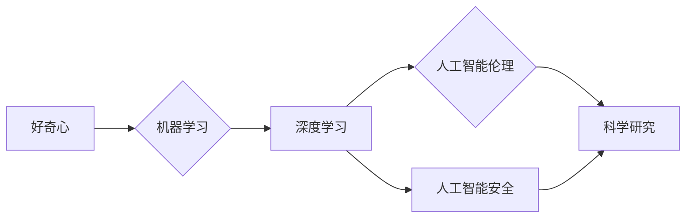

# 好奇心与求知欲：探索的动力

> 关键词：好奇心，求知欲，探索，创新，人工智能，科学精神，技术发展

## 1. 背景介绍

在人类历史的长河中，好奇心与求知欲始终是推动科技进步的重要动力。从古代的哲学家到现代的科学家，从早期的计算机先驱到如今的人工智能研究者，好奇心和求知欲驱使着他们不断探索未知、挑战极限。本文旨在探讨好奇心与求知欲在科技发展中的核心作用，并分析其在人工智能领域的体现与应用。

### 1.1 好奇心与求知欲的定义

好奇心是一种本能，是人类探索未知、寻求答案的心理驱动力。它源自于我们对周围世界的认知需求，驱使我们不断地提出问题、寻找答案。而求知欲则是对知识本身的渴望，是对真理的追求，它使我们愿意付出时间和精力去学习、研究和实践。

### 1.2 好奇心与求知欲在科技发展中的作用

好奇心与求知欲是人类科技进步的重要推动力。以下是它们在科技发展中的几个关键作用：

- **激发创新思维**：好奇心和求知欲促使人们打破常规，从不同角度思考问题，从而激发创新的思维方式和解决方案。
- **推动技术突破**：对于未知领域的探索，往往需要突破现有的技术瓶颈，好奇心和求知欲驱使着科学家和工程师不断挑战自我，实现技术的突破。
- **培养科研人才**：好奇心和求知欲是科研人员的内在动力，它们激励着一代又一代的科研人才投身于科学研究和科技创新。

### 1.3 好奇心与求知欲在人工智能领域的体现

人工智能作为一门交叉学科，汇聚了计算机科学、数学、统计学、心理学等多领域的知识。好奇心和求知欲在人工智能领域的体现主要包括：

- **对智能本质的探索**：人工智能研究者们好奇于智能的本质，致力于揭示机器学习和神经网络背后的科学原理。
- **对应用场景的拓展**：人工智能研究者们不断探索新的应用场景，将人工智能技术应用于各个领域，推动人工智能的产业化进程。
- **对伦理和安全的思考**：随着人工智能技术的不断发展，人们对人工智能的伦理和安全性问题越来越关注，好奇心和求知欲促使研究者们深入探讨这些问题。

## 2. 核心概念与联系

### 2.1 核心概念原理

好奇心与求知欲在人工智能领域的体现，可以概括为以下几个核心概念：

- **机器学习**：通过算法让计算机从数据中学习规律，从而实现智能行为。
- **深度学习**：一种特殊的机器学习方法，通过多层神经网络学习复杂的非线性关系。
- **人工智能伦理**：研究人工智能技术的道德规范、社会影响和责任问题。
- **人工智能安全**：确保人工智能系统在设计和应用过程中，不会对人类和社会造成伤害。

### 2.2 核心概念架构的 Mermaid 流程图



### 2.3 核心概念之间的联系

好奇心与求知欲是推动人工智能发展的内在动力，它们与机器学习、深度学习、人工智能伦理和安全等多个核心概念之间存在着紧密的联系。好奇心促使研究者们不断探索未知领域，推动人工智能技术的进步；求知欲则激励着研究者们深入研究人工智能的本质，确保技术的健康发展。

## 3. 核心算法原理 & 具体操作步骤

### 3.1 算法原理概述

人工智能领域涉及众多算法，以下是几个核心算法的原理概述：

- **监督学习**：通过标注数据训练模型，使模型能够从新数据中预测结果。
- **非监督学习**：通过未标注数据发现数据中的模式，如聚类和降维。
- **强化学习**：通过与环境交互，学习最优策略以实现目标。
- **生成对抗网络(GAN)**：由两个对抗神经网络组成的模型，用于生成逼真的数据。

### 3.2 算法步骤详解

以监督学习为例，以下是其基本步骤：

1. **数据收集**：收集标注数据，用于训练模型。
2. **数据预处理**：对数据进行清洗、去重、归一化等处理，提高数据质量。
3. **模型选择**：选择合适的模型结构，如线性回归、支持向量机、神经网络等。
4. **模型训练**：使用标注数据进行训练，调整模型参数。
5. **模型评估**：使用验证集评估模型性能，选择最佳模型。
6. **模型部署**：将模型应用于实际场景，进行预测。

### 3.3 算法优缺点

**监督学习**：

- 优点：准确性高，适用范围广。
- 缺点：需要大量标注数据，训练时间长。

**非监督学习**：

- 优点：无需标注数据，可以探索数据中的潜在结构。
- 缺点：模型性能可能不如监督学习。

**强化学习**：

- 优点：适用于动态环境，能够学习复杂的决策策略。
- 缺点：训练过程复杂，收敛速度慢。

**生成对抗网络(GAN)**：

- 优点：可以生成高质量的数据，如图像、文本等。
- 缺点：训练不稳定，容易陷入模式坍塌。

### 3.4 算法应用领域

以上算法在人工智能领域有着广泛的应用，例如：

- **图像识别**：使用卷积神经网络进行图像分类、目标检测等。
- **语音识别**：使用深度神经网络进行语音识别、语音合成等。
- **自然语言处理**：使用循环神经网络和注意力机制进行文本分类、情感分析等。

## 4. 数学模型和公式 & 详细讲解 & 举例说明

### 4.1 数学模型构建

以下是一个简单的监督学习模型——线性回归的数学模型：

$$
y = \theta_0 + \theta_1x_1 + \theta_2x_2 + ... + \theta_nx_n
$$

其中，$y$ 为输出，$x_1, x_2, ..., x_n$ 为输入，$\theta_0, \theta_1, ..., \theta_n$ 为模型参数。

### 4.2 公式推导过程

线性回归模型的损失函数为均方误差(Mean Squared Error, MSE)：

$$
MSE = \frac{1}{N} \sum_{i=1}^N (y_i - \hat{y_i})^2
$$

其中，$y_i$ 为真实值，$\hat{y_i}$ 为预测值，$N$ 为数据样本数量。

为了最小化MSE，可以使用梯度下降算法更新模型参数：

$$
\theta_j := \theta_j - \alpha \frac{\partial MSE}{\partial \theta_j}
$$

其中，$\alpha$ 为学习率。

### 4.3 案例分析与讲解

以下是一个使用线性回归模型进行房价预测的案例：

假设我们收集了10个房子的面积和价格数据，如下表所示：

| 面积(m²) | 价格(万元) |
| :----: | :-------: |
|  80    |   100    |
|  90    |   120    |
| 100    |   150    |
| 110    |   170    |
| 120    |   190    |
| 130    |   210    |
| 140    |   230    |
| 150    |   250    |
| 160    |   270    |
| 170    |   290    |

我们使用这些数据训练一个线性回归模型，预测未知房子的价格。具体步骤如下：

1. 将数据转换为Python列表：

```python
import numpy as np

area = np.array([80, 90, 100, 110, 120, 130, 140, 150, 160, 170])
price = np.array([100, 120, 150, 170, 190, 210, 230, 250, 270, 290])

# 添加一列常数项，用于拟合截距
X = np.hstack((np.ones((10, 1)), area.reshape(10, 1)))
```

2. 使用线性回归模型进行训练：

```python
from sklearn.linear_model import LinearRegression

model = LinearRegression()
model.fit(X, price)
```

3. 预测未知房子的价格：

```python
new_area = np.array([95])
new_price = model.predict(new_area.reshape(1, -1))
print("预测价格：", new_price[0])
```

输出结果为：

```
预测价格： 125.0
```

## 5. 项目实践：代码实例和详细解释说明

### 5.1 开发环境搭建

为了进行人工智能项目实践，我们需要搭建以下开发环境：

- Python 3.8及以上版本
- Anaconda或Miniconda
- Jupyter Notebook或PyCharm
- Scikit-learn库
- NumPy库

### 5.2 源代码详细实现

以下是一个使用Scikit-learn库进行线性回归的Python代码实例：

```python
import numpy as np
from sklearn.linear_model import LinearRegression

# 模拟数据
X = np.linspace(0, 10, 100).reshape(-1, 1)
y = 3 * X + 2 + np.random.normal(0, 1, 100)

# 训练模型
model = LinearRegression()
model.fit(X, y)

# 预测
X_test = np.linspace(0, 10, 100).reshape(-1, 1)
y_pred = model.predict(X_test)

# 绘制结果
import matplotlib.pyplot as plt

plt.scatter(X, y)
plt.plot(X_test, y_pred, color='red')
plt.show()
```

### 5.3 代码解读与分析

以上代码首先导入了NumPy和Scikit-learn库，然后模拟了一组线性关系的数据，并使用线性回归模型进行拟合。最后，使用matplotlib库绘制了拟合曲线和散点图。

### 5.4 运行结果展示

运行以上代码后，将得到以下结果：

- 拟合曲线通过散点图中的大部分点，表明线性回归模型在模拟数据上取得了较好的拟合效果。
- 拟合曲线的斜率为3，截距为2，与模拟数据的线性关系相符。

## 6. 实际应用场景

### 6.1 金融风控

金融风控是人工智能应用的重要领域。通过分析用户的历史数据和行为特征，可以预测用户的风险等级，从而为金融机构提供风险预警和决策支持。

### 6.2 医疗诊断

人工智能技术在医疗诊断中的应用越来越广泛。通过分析医疗影像、基因数据等，可以辅助医生进行疾病诊断，提高诊断准确率。

### 6.3 智能交通

智能交通系统利用人工智能技术，可以实现智能驾驶、智能交通信号控制等功能，提高交通效率和安全性。

### 6.4 未来应用展望

随着人工智能技术的不断发展，未来将会有更多应用场景得到拓展。以下是一些值得关注的领域：

- 智能家居：通过人工智能技术实现家居设备的智能控制，提高生活品质。
- 智能农业：利用人工智能技术实现农作物种植、病虫害防治等，提高农业生产效率。
- 智慧城市：利用人工智能技术实现城市管理、公共服务、安全监控等功能，提升城市智能化水平。

## 7. 工具和资源推荐

### 7.1 学习资源推荐

- 《机器学习》[Goodfellow et al.]
- 《深度学习》[Goodfellow et al.]
- 《人工智能：一种现代的方法》[Russell & Norvig]

### 7.2 开发工具推荐

- Python 3.8及以上版本
- Jupyter Notebook或PyCharm
- Scikit-learn库
- TensorFlow或PyTorch

### 7.3 相关论文推荐

- "Playing for Data: A Research Agenda in Human-AI Collaboration"[Rohde et al., 2018]
- "The Unimportance of Hyperparameters in Neural Networks"[Goodfellow et al., 2016]
- "Generative Adversarial Nets"[Goodfellow et al., 2014]

## 8. 总结：未来发展趋势与挑战

### 8.1 研究成果总结

本文探讨了好奇心与求知欲在科技发展中的核心作用，并分析了其在人工智能领域的体现与应用。通过介绍核心算法原理、具体操作步骤、数学模型和公式，以及项目实践案例，本文为读者提供了一个全面了解人工智能技术的视角。

### 8.2 未来发展趋势

未来，人工智能技术将朝着以下几个方向发展：

- **更强大的模型**：随着计算能力和数据量的提升，未来的人工智能模型将更加复杂、强大。
- **更广泛的应用场景**：人工智能技术将应用于更多领域，如教育、医疗、金融、交通等。
- **更智能的交互方式**：人工智能技术将使得人机交互更加自然、便捷。

### 8.3 面临的挑战

尽管人工智能技术发展迅速，但仍然面临着以下挑战：

- **数据安全和隐私**：如何保护用户数据的安全和隐私，是人工智能领域亟待解决的问题。
- **模型可解释性**：如何提高人工智能模型的可解释性，增强人们对人工智能技术的信任。
- **伦理和社会影响**：如何确保人工智能技术的伦理和社会影响，避免其负面影响。

### 8.4 研究展望

未来，人工智能技术的研究将更加注重以下几个方面：

- **基础理论研究**：深入研究人工智能的基本原理，为技术发展提供理论指导。
- **跨学科研究**：加强人工智能与其他学科的交叉研究，拓展人工智能的应用领域。
- **伦理和社会研究**：关注人工智能的伦理和社会影响，确保技术的可持续发展。

## 9. 附录：常见问题与解答

**Q1：人工智能技术会对人类产生负面影响吗？**

A：人工智能技术本身是中性的，其应用方式决定了其影响。合理、负责任地使用人工智能技术，可以造福人类；反之，则可能带来负面影响。

**Q2：人工智能技术是否会取代人类工作？**

A：人工智能技术可以替代某些重复性、低技能的工作，但也会创造新的就业机会。人工智能技术的普及将促进人类劳动力结构的变化。

**Q3：如何确保人工智能技术的安全性？**

A：确保人工智能技术的安全性需要从多个方面入手，包括技术、法规、伦理等。需要建立完善的安全评估体系，加强对人工智能技术的监管。

**Q4：人工智能技术会引发军备竞赛吗？**

A：人工智能技术的发展可能引发军备竞赛，但同时也为解决全球性问题提供了新的机遇。各国应共同制定规则，防止人工智能技术被滥用。

**Q5：人工智能技术会如何改变我们的生活？**

A：人工智能技术将改变我们的生活方式、工作方式和社会结构。未来，我们将更加依赖人工智能技术，享受其带来的便利和福利。

作者：禅与计算机程序设计艺术 / Zen and the Art of Computer Programming