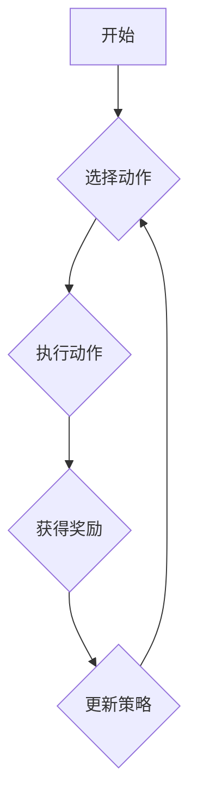

# 强化学习(Reinforcement Learning) - 原理与代码实例讲解

> 关键词：强化学习，智能体，环境，奖励，策略，值函数，Q学习，策略梯度，深度强化学习，应用场景

## 1. 背景介绍

强化学习（Reinforcement Learning, RL）是机器学习的一个重要分支，它让机器通过与环境的交互来学习如何做出决策。与监督学习和无监督学习不同，强化学习中的学习过程是基于奖励和惩罚的，通过不断尝试和错误来优化决策策略。近年来，随着深度学习技术的飞速发展，深度强化学习（Deep Reinforcement Learning, DRL）成为了人工智能领域的研究热点，并在游戏、机器人、自动驾驶、资源管理等领域取得了显著的成果。

### 1.1 问题的由来

强化学习起源于20世纪50年代，由美国心理学家兼数学家Richard Bellman提出。最初，强化学习被用于解决最优控制问题。随着计算机科学和人工智能的发展，强化学习逐渐应用于更广泛的领域。然而，由于早期计算资源有限，强化学习的研究和应用受到限制。直到深度学习技术兴起，强化学习才得到了新的生命力。

### 1.2 研究现状

目前，强化学习的研究主要集中在以下几个方面：

- 策略学习：学习直接决策策略，例如策略梯度方法。
- 值函数学习：学习状态价值和期望回报，例如Q学习。
- 深度强化学习：结合深度学习技术，提高强化学习算法的效率和效果。
- 多智能体强化学习：研究多个智能体在复杂环境中的协作和竞争。

### 1.3 研究意义

强化学习在人工智能领域具有重要的理论意义和应用价值：

- 理论意义：丰富和发展了机器学习理论，提出了新的学习范式。
- 应用价值：为解决实际问题提供了新的思路和方法，例如智能控制、机器人、自动驾驶等。

### 1.4 本文结构

本文将系统介绍强化学习的原理、算法、代码实例和应用场景。具体内容包括：

- 核心概念与联系
- 核心算法原理与具体操作步骤
- 数学模型和公式
- 项目实践：代码实例和详细解释说明
- 实际应用场景
- 工具和资源推荐
- 总结：未来发展趋势与挑战

## 2. 核心概念与联系

强化学习中的核心概念主要包括智能体、环境、状态、动作、奖励和策略。

### 2.1 智能体

智能体（Agent）是强化学习中的主体，它可以通过与环境交互来学习。智能体可以是机器人、软件程序、虚拟角色等。

### 2.2 环境

环境（Environment）是智能体行动的空间，它包含状态和动作空间。环境可以是一个物理世界，也可以是一个虚拟世界。

### 2.3 状态

状态（State）是环境的描述，通常用向量表示。状态可以是智能体的位置、速度、环境中的其他对象等。

### 2.4 动作

动作（Action）是智能体可以采取的行为。动作可以是移动、旋转、抓取等。

### 2.5 奖励

奖励（Reward）是环境对智能体的动作做出的反馈。奖励可以是正的、负的或零。

### 2.6 策略

策略（Policy）是智能体在给定状态下选择动作的规则。

### 2.7 Mermaid 流程图

以下是一个简化的Mermaid流程图，展示了强化学习的基本流程：



## 3. 核心算法原理 & 具体操作步骤

### 3.1 算法原理概述

强化学习算法通过学习策略来优化智能体的决策过程。以下是两种主要的强化学习算法：

- 值函数方法：学习状态值或状态-动作值函数，通过最大化期望回报来选择动作。
- 策略梯度方法：直接学习策略参数，通过最大化策略的价值函数来选择动作。

### 3.2 算法步骤详解

#### 3.2.1 值函数方法

值函数方法包括以下步骤：

1. 初始化策略参数和值函数参数。
2. 在环境中进行随机模拟，收集状态、动作、奖励和下一个状态。
3. 使用贝尔曼方程更新值函数参数。
4. 根据更新后的值函数更新策略参数。
5. 重复步骤2-4，直到收敛。

#### 3.2.2 策略梯度方法

策略梯度方法包括以下步骤：

1. 初始化策略参数。
2. 在环境中进行随机模拟，收集状态、动作和奖励。
3. 计算策略梯度。
4. 使用梯度下降算法更新策略参数。
5. 重复步骤2-4，直到收敛。

### 3.3 算法优缺点

#### 值函数方法的优缺点

优点：

- 学习速度快，收敛性较好。
- 可以直接得到状态值或状态-动作值函数。

缺点：

- 需要存储大量的状态或状态-动作对。
- 在连续动作空间中难以使用。

#### 策略梯度方法的优缺点

优点：

- 无需存储大量的状态或状态-动作对。
- 可以直接优化策略参数。

缺点：

- 学习速度较慢，收敛性较差。
- 需要计算策略梯度，计算复杂度较高。

### 3.4 算法应用领域

强化学习算法可以应用于各种领域，以下是一些常见的应用场景：

- 机器人控制
- 自动驾驶
- 游戏人工智能
- 股票交易
- 网络流量管理

## 4. 数学模型和公式

### 4.1 数学模型构建

强化学习中的数学模型主要包括：

- 状态空间 $S$：智能体可能处于的所有状态的集合。
- 动作空间 $A$：智能体可能采取的所有动作的集合。
- 奖励函数 $R(s,a)$：环境对智能体采取动作 $a$ 在状态 $s$ 时的奖励。
- 策略 $\pi(a|s)$：智能体在状态 $s$ 时的动作选择策略。
- 值函数 $V(s)$：在状态 $s$ 下采取最优策略所能获得的最大期望回报。
- 状态-动作值函数 $Q(s,a)$：在状态 $s$ 采取动作 $a$ 所能获得的最大期望回报。

### 4.2 公式推导过程

#### 4.2.1 值函数方法

值函数方法的目标是最小化以下损失函数：

$$
L(\theta) = E_{\pi(s,a)}[R(s,a) + \gamma V(s')]
$$

其中，$\theta$ 是值函数参数，$\gamma$ 是折扣因子。

#### 4.2.2 策略梯度方法

策略梯度方法的目标是最小化以下损失函数：

$$
L(\theta) = E_{\pi(s,a)}[-\log \pi(s,a)]
$$

其中，$\theta$ 是策略参数。

### 4.3 案例分析与讲解

以经典的Atari游戏Pong为例，讲解强化学习算法的应用。

### 4.3.1 状态和动作

在Pong游戏中，状态可以用球的位置、速度、台球的位置、速度和方向来描述。动作可以是左右移动台球。

### 4.3.2 奖励

奖励函数可以是球的得分，也可以是球的失分。

### 4.3.3 策略

策略可以是基于简单的规则，也可以是基于深度学习模型。

### 4.3.4 训练过程

使用深度Q网络（DQN）进行训练，通过与环境交互学习最优策略。

## 5. 项目实践：代码实例和详细解释说明

### 5.1 开发环境搭建

使用Python进行强化学习开发，需要安装以下库：

- NumPy：用于数值计算
- PyTorch：用于深度学习
- Gym：用于构建强化学习环境

### 5.2 源代码详细实现

以下是一个使用PyTorch和Gym实现的Q学习算法的代码实例：

```python
import gym
import numpy as np
import torch
import torch.nn as nn
import torch.optim as optim

# 环境配置
env = gym.make("CartPole-v1")

# 定义Q网络
class QNetwork(nn.Module):
    def __init__(self):
        super(QNetwork, self).__init__()
        self.fc1 = nn.Linear(4, 32)
        self.fc2 = nn.Linear(32, 2)

    def forward(self, x):
        x = torch.relu(self.fc1(x))
        x = self.fc2(x)
        return x

# 初始化Q网络和优化器
q_network = QNetwork()
optimizer = optim.Adam(q_network.parameters(), lr=0.01)

# 训练过程
def train():
    for episode in range(1000):
        state = env.reset()
        done = False
        while not done:
            action = q_network(state).argmax().item()
            next_state, reward, done, _ = env.step(action)
            reward = -1 if done else 0
            next_state = torch.from_numpy(next_state).float()
            state = torch.from_numpy(state).float()
            target = reward + gamma * q_network(next_state).max()
            q_values = q_network(state)
            q_values[0, action] = target
            optimizer.zero_grad()
            loss = nn.MSELoss()(q_values, target)
            loss.backward()
            optimizer.step()
            state = next_state
        print(f"Episode {episode+1} done with {len(env._Episodes) - 1} steps")

# 训练模型
train()

# 保存模型
torch.save(q_network.state_dict(), "q_network.pth")

# 加载模型
q_network.load_state_dict(torch.load("q_network.pth"))

# 测试模型
def test():
    state = env.reset()
    done = False
    while not done:
        action = q_network(state).argmax().item()
        next_state, reward, done, _ = env.step(action)
        state = next_state
    print(f"Test done with {len(env._Episodes) - 1} steps")

# 测试模型
test()
```

### 5.3 代码解读与分析

- Gym库用于构建Pong游戏环境。
- QNetwork类定义了Q网络的结构，包括两个全连接层。
- train函数负责训练模型，包括初始化网络参数、优化器、环境、状态、动作、奖励和下一个状态。
- optimizer.zero_grad()用于清空梯度。
- nn.MSELoss()用于计算均方误差损失。
- loss.backward()用于反向传播梯度。
- test函数用于测试模型，即执行一个回合的游戏。

### 5.4 运行结果展示

运行代码后，模型将在Pong游戏中进行训练和测试。在测试过程中，模型可以通过观察和尝试来学习游戏规则，并尝试得分。

## 6. 实际应用场景

强化学习在各个领域都有广泛的应用，以下是一些常见的应用场景：

- 机器人控制
- 自动驾驶
- 游戏人工智能
- 股票交易
- 网络流量管理

### 6.1 机器人控制

强化学习可以用于机器人控制，例如路径规划、避障、抓取等。通过与环境交互，机器人可以学习到如何在复杂环境中做出正确的决策。

### 6.2 自动驾驶

自动驾驶是强化学习的典型应用场景之一。通过学习驾驶策略，自动驾驶汽车可以在道路上安全行驶。

### 6.3 游戏人工智能

强化学习可以用于游戏人工智能，例如电子竞技、棋类游戏、角色扮演游戏等。通过学习游戏规则，游戏AI可以与人类玩家进行对抗。

### 6.4 股票交易

强化学习可以用于股票交易，例如预测股票价格、制定交易策略等。通过学习股票市场规律，强化学习模型可以帮助投资者获得更好的收益。

### 6.5 网络流量管理

强化学习可以用于网络流量管理，例如动态路由、流量控制等。通过学习网络状态和流量模式，强化学习模型可以帮助网络管理员优化网络性能。

## 7. 工具和资源推荐

### 7.1 学习资源推荐

- 《Reinforcement Learning: An Introduction》
- 《Reinforcement Learning: A Deep Dive》
- 《Deep Reinforcement Learning》
- 《Reinforcement Learning with Python》

### 7.2 开发工具推荐

- PyTorch
- TensorFlow
- Gym
- OpenAI Baselines
- Stable Baselines

### 7.3 相关论文推荐

- Q-Learning
- Temporal-Difference Learning
- Deep Q-Network
- Policy Gradient Methods
- Actor-Critic Methods

## 8. 总结：未来发展趋势与挑战

### 8.1 研究成果总结

近年来，强化学习取得了显著的成果，在各个领域都有广泛的应用。深度强化学习技术的发展，使得强化学习算法能够处理更复杂的问题。

### 8.2 未来发展趋势

未来，强化学习将朝着以下方向发展：

- 更强大的模型和算法
- 更广泛的应用领域
- 与其他人工智能技术的融合

### 8.3 面临的挑战

尽管强化学习取得了显著的成果，但仍面临以下挑战：

- 算法收敛性
- 算法可解释性
- 算法安全性

### 8.4 研究展望

随着研究的不断深入，相信强化学习将在未来取得更大的突破，为人工智能的发展做出更大的贡献。

## 9. 附录：常见问题与解答

### 9.1 Q1：强化学习和监督学习有什么区别？

A1：强化学习通过与环境交互来学习，而监督学习通过学习已标记的数据来学习。强化学习需要奖励信号，而监督学习需要标签。

### 9.2 Q2：深度强化学习和传统强化学习有什么区别？

A2：深度强化学习使用深度学习技术来学习状态表示和策略，而传统强化学习使用简单的状态表示和策略。

### 9.3 Q3：如何解决强化学习中的收敛性问题？

A3：可以使用经验回放、目标网络、优先级回放等技术来提高强化学习算法的收敛性。

### 9.4 Q4：如何确保强化学习算法的安全性？

A4：可以通过安全约束、强化学习算法的安全性分析等方法来确保强化学习算法的安全性。

作者：禅与计算机程序设计艺术 / Zen and the Art of Computer Programming