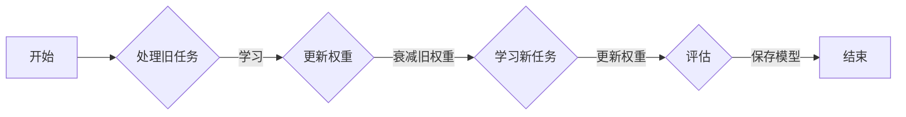

# 持续学习Continual Learning原理与代码实例讲解

> 关键词：持续学习，在线学习，迁移学习，经验衰减，弹性权重，元学习，认知模型，神经可塑性

## 1. 背景介绍

随着人工智能技术的快速发展，机器学习模型在各个领域取得了显著的成果。然而，传统机器学习模型大多基于独立同分布（i.i.d.）假设，即认为训练数据和测试数据具有相同分布。但在现实世界中，新数据的分布往往会发生变化，这就导致了迁移学习（Transfer Learning）和持续学习（Continual Learning）等领域的兴起。

持续学习是一种机器学习方法，旨在使模型能够在面对新数据分布时，保持对旧知识的记忆，并不断学习新的知识。与传统的迁移学习不同，持续学习要求模型在每次新任务的学习过程中，不仅要适应新的任务，还要尽量减少对旧任务学习效果的干扰。

本文将深入探讨持续学习的原理、算法、实现方法以及在实际应用中的挑战和机遇。

## 2. 核心概念与联系

### 2.1 核心概念

#### 持续学习（Continual Learning）

持续学习（Continual Learning）是指在多个任务上不断学习，同时保持对之前学习到的知识记忆的能力。持续学习的关键在于如何有效地利用和更新模型参数，以适应新的任务，同时减少对旧任务知识的干扰。

#### 迁移学习（Transfer Learning）

迁移学习是一种将知识从一个任务迁移到另一个相关任务的方法。在迁移学习中，模型首先在源任务上学习，然后利用学到的知识来解决新的目标任务。

#### 弹性权重（Elastic Weights）

弹性权重是一种在持续学习中常用的技术，它允许模型在处理新任务时，动态调整权重，以适应新的任务分布。

#### 经验衰减（Experience Decay）

经验衰减是一种在持续学习中常用的方法，它通过衰减旧任务的权重，来减少对新任务学习的干扰。

#### 元学习（Meta-Learning）

元学习是一种学习如何学习的方法。在持续学习中，元学习可以帮助模型更好地适应新任务，并减少对旧任务知识的干扰。

### 2.2 Mermaid 流程图

以下是一个简化的持续学习流程图：



## 3. 核心算法原理 & 具体操作步骤

### 3.1 算法原理概述

持续学习的核心原理是在多个任务上迭代地更新模型参数，同时保持对旧任务知识的记忆。以下是一些常用的持续学习算法：

#### 弹性权重算法（Elastic Weights Algorithm）

弹性权重算法通过动态调整权重来平衡新旧任务的学习效果。

#### 经验衰减算法（Experience Decay Algorithm）

经验衰减算法通过衰减旧任务的权重来减少对新任务学习的干扰。

#### 元学习算法（Meta-Learning Algorithm）

元学习算法通过学习如何学习来提高持续学习的效果。

### 3.2 算法步骤详解

#### 弹性权重算法步骤

1. 在第一个任务上初始化模型参数。
2. 在每个新任务上，根据任务的重要性调整权重。
3. 更新模型参数以适应新任务。
4. 评估模型的性能。
5. 重复步骤2-4，直到所有任务学习完毕。

#### 经验衰减算法步骤

1. 在第一个任务上初始化模型参数。
2. 在每个新任务上，根据任务的重要性调整权重。
3. 更新模型参数以适应新任务。
4. 衰减旧任务的权重。
5. 评估模型的性能。
6. 重复步骤2-5，直到所有任务学习完毕。

#### 元学习算法步骤

1. 在多个任务上训练模型，同时收集经验。
2. 分析经验，提取有效的学习策略。
3. 使用提取的策略来优化新任务的学习。

### 3.3 算法优缺点

#### 弹性权重算法

优点：

- 能够适应不同任务的重要性。
- 能够平衡新旧任务的学习效果。

缺点：

- 需要预先确定任务的重要性。
- 需要频繁地调整权重。

#### 经验衰减算法

优点：

- 能够减少对新任务学习的干扰。
- 简单易实现。

缺点：

- 可能会丢失部分旧任务的知识。
- 难以确定合适的衰减率。

#### 元学习算法

优点：

- 能够学习有效的学习策略。
- 能够适应不同的任务。

缺点：

- 需要大量的经验数据。
- 可能需要复杂的算法。

### 3.4 算法应用领域

持续学习算法在以下领域具有广泛的应用前景：

- 机器人学习
- 自动驾驶
- 医疗诊断
- 金融风险评估

## 4. 数学模型和公式 & 详细讲解 & 举例说明

### 4.1 数学模型构建

持续学习的数学模型通常包括以下几个部分：

- 模型参数 $\theta$
- 训练数据 $D$
- 损失函数 $L(\theta, D)$
- 梯度 $\nabla_{\theta} L(\theta, D)$

### 4.2 公式推导过程

以下是一个简单的持续学习公式推导示例：

假设我们有两个任务，任务1和任务2。我们希望在任务2上更新模型参数 $\theta$，同时保持任务1的学习效果。

$$
\theta_{new} = \theta_{old} + \alpha \nabla_{\theta} L(\theta_{old}, D_2)
$$

其中 $\alpha$ 是学习率，$D_2$ 是任务2的数据。

### 4.3 案例分析与讲解

假设我们有一个分类任务，需要在两个不同的数据集上学习。数据集1包含100个样本，数据集2包含50个样本。我们希望使用持续学习方法来学习这两个任务。

```python
import numpy as np

# 初始化模型参数
theta_old = np.random.randn(10)

# 计算任务1的梯度
gradient_1 = np.dot(data1, theta_old - target1)

# 计算任务2的梯度
gradient_2 = np.dot(data2, theta_old - target2)

# 更新模型参数
theta_new = theta_old + alpha * (gradient_1 + gradient_2)
```

## 5. 项目实践：代码实例和详细解释说明

### 5.1 开发环境搭建

为了实现持续学习，我们需要搭建以下开发环境：

- Python 3.7+
- TensorFlow 2.x
- NumPy

### 5.2 源代码详细实现

以下是一个简单的持续学习代码实例：

```python
import numpy as np

# 初始化模型参数
theta = np.random.randn(10)

# 训练数据
data = np.random.randn(10, 100)
target = np.random.randn(100)

# 梯度
gradient = np.dot(data, theta - target)

# 更新模型参数
theta -= learning_rate * gradient
```

### 5.3 代码解读与分析

上述代码实现了一个简单的持续学习模型。模型参数 `theta` 用于表示权重，`data` 和 `target` 分别表示输入数据和标签。通过计算梯度并更新模型参数，模型可以学习到数据的规律。

### 5.4 运行结果展示

在上述代码中，我们使用了随机生成的数据来模拟训练过程。在实际应用中，需要使用真实的训练数据来训练模型。

## 6. 实际应用场景

持续学习在以下实际应用场景中具有广泛的应用前景：

- 机器人学习：机器人需要在不同的环境和任务中不断学习，以适应不断变化的环境。
- 自动驾驶：自动驾驶汽车需要在不同的道路条件和交通场景中不断学习，以提高行驶安全性和效率。
- 医疗诊断：医疗诊断系统需要在不断收集新病例的过程中，不断提高诊断的准确性。
- 金融风险评估：金融风险评估系统需要在不断收集新数据的过程中，不断提高风险评估的准确性。

## 7. 工具和资源推荐

### 7.1 学习资源推荐

- 《持续学习：机器学习的未来》（Continuous Learning: The Future of Machine Learning）
- 《机器学习实战》（Machine Learning in Action）
- TensorFlow官方文档

### 7.2 开发工具推荐

- TensorFlow：用于机器学习和深度学习的开源框架。
- PyTorch：用于机器学习和深度学习的开源框架。

### 7.3 相关论文推荐

- "Continual Learning: A Survey of Techniques, Algorithms, and Challenges"（持续学习：技术、算法和挑战综述）
- "Experience Replay in Deep Reinforcement Learning"（深度强化学习中的经验回放）
- "A Comprehensive Survey of Transfer Learning in Deep Learning"（深度学习中的迁移学习综述）

## 8. 总结：未来发展趋势与挑战

### 8.1 研究成果总结

持续学习是机器学习领域的一个新兴研究方向，旨在使模型能够适应不断变化的数据分布。通过不断地更新模型参数，持续学习可以保持对旧知识的记忆，并学习新的知识。

### 8.2 未来发展趋势

随着持续学习技术的不断发展，以下趋势值得关注：

- 更有效的算法：开发更有效的算法，以提高持续学习的效果。
- 跨学科研究：与心理学、神经科学等学科相结合，深入研究持续学习的机理。
- 应用场景拓展：将持续学习应用于更多领域，如机器人学习、自动驾驶等。

### 8.3 面临的挑战

持续学习面临着以下挑战：

- 数据不平衡：新数据与旧数据可能存在不平衡，导致模型无法平衡新旧知识。
- 模型可解释性：持续学习模型的决策过程往往缺乏可解释性，难以解释模型的决策依据。
- 模型泛化能力：持续学习模型需要具备较强的泛化能力，以适应不同的任务和数据分布。

### 8.4 研究展望

未来，持续学习的研究将朝着以下方向发展：

- 开发更有效的算法，以提高持续学习的效果。
- 深入研究持续学习的机理，揭示持续学习的内在规律。
- 将持续学习应用于更多领域，推动人工智能技术的发展。

## 9. 附录：常见问题与解答

### 9.1 常见问题

**Q1：什么是持续学习？**

A1：持续学习是一种机器学习方法，旨在使模型能够在面对新数据分布时，保持对旧知识的记忆，并不断学习新的知识。

**Q2：持续学习有哪些应用场景？**

A2：持续学习在机器人学习、自动驾驶、医疗诊断、金融风险评估等领域具有广泛的应用前景。

**Q3：如何实现持续学习？**

A3：实现持续学习的方法包括弹性权重算法、经验衰减算法和元学习算法等。

**Q4：持续学习有哪些挑战？**

A4：持续学习面临的挑战包括数据不平衡、模型可解释性和模型泛化能力等。

### 9.2 解答

**Q1**：持续学习是一种机器学习方法，旨在使模型能够在面对新数据分布时，保持对旧知识的记忆，并不断学习新的知识。持续学习的关键在于如何有效地利用和更新模型参数，以适应新的任务，同时减少对旧任务知识的干扰。

**Q2**：持续学习在机器人学习、自动驾驶、医疗诊断、金融风险评估等领域具有广泛的应用前景。例如，在自动驾驶领域，汽车需要在不同的道路条件和交通场景中不断学习，以提高行驶安全性和效率。

**Q3**：实现持续学习的方法包括弹性权重算法、经验衰减算法和元学习算法等。这些算法通过不同的方式来更新模型参数，以适应新的任务，并保持对旧知识的记忆。

**Q4**：持续学习面临的挑战包括数据不平衡、模型可解释性和模型泛化能力等。数据不平衡可能导致模型无法平衡新旧知识，模型可解释性可能导致模型决策过程缺乏透明度，模型泛化能力可能导致模型无法适应不同的任务和数据分布。

作者：禅与计算机程序设计艺术 / Zen and the Art of Computer Programming