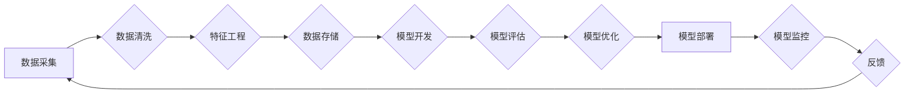

# 新的AI技术栈与传统机器学习工程的区别

> 关键词：AI技术栈，机器学习工程，深度学习，传统机器学习，Python生态，数据工程，模型开发，模型部署，MLOps

## 1. 背景介绍

随着人工智能技术的快速发展，一个新的AI技术栈逐渐形成，与传统的机器学习工程相比，它具有更广泛的范围、更高的灵活性和更强大的功能。本文旨在探讨新的AI技术栈与传统机器学习工程的区别，分析其优缺点，并展望未来发展趋势。

### 1.1 技术栈演变

在早期的机器学习时代，技术栈相对简单，主要依赖于统计模型和决策树等算法。随着计算能力的提升和大数据时代的到来，机器学习技术得到了快速发展，新的算法和框架层出不穷。近年来，深度学习技术的兴起，使得AI技术栈发生了巨大的变化。

### 1.2 新的AI技术栈特点

新的AI技术栈具有以下特点：

- **深度学习算法**：深度学习算法能够处理大规模数据，并在图像识别、自然语言处理等领域取得了显著成果。
- **Python生态**：Python成为AI领域的主要编程语言，拥有丰富的库和框架，如TensorFlow、PyTorch等。
- **数据工程**：数据工程成为AI技术栈的重要组成部分，涉及数据采集、处理、存储和分析等环节。
- **模型开发**：模型开发包括模型的训练、评估和优化等过程，需要专业的知识和技能。
- **模型部署**：模型部署是指将训练好的模型部署到生产环境中，实现模型的实际应用。
- **MLOps**：MLOps是机器学习运营的缩写，旨在提高机器学习项目的开发效率和模型性能。

## 2. 核心概念与联系

### 2.1 核心概念原理

#### 深度学习

深度学习是一种模拟人脑神经网络结构的机器学习技术，通过多层神经网络对数据进行学习，从而实现复杂的模式识别和特征提取。

#### Python生态

Python是一种解释型、高级编程语言，以其简洁、易读、易学等特点，成为AI领域的首选编程语言。

#### 数据工程

数据工程是指从数据采集、处理、存储到分析的一系列过程，是AI技术栈的重要基础。

#### 模型开发

模型开发包括模型的训练、评估和优化等过程，需要使用深度学习框架和算法。

#### 模型部署

模型部署是指将训练好的模型部署到生产环境中，实现模型的实际应用。

#### MLOps

MLOps是指将机器学习项目视为软件工程的一部分，通过自动化和优化机器学习流程，提高项目开发效率和模型性能。

### 2.2 架构流程图



## 3. 核心算法原理 & 具体操作步骤

### 3.1 算法原理概述

#### 深度学习算法

深度学习算法主要包括卷积神经网络（CNN）、循环神经网络（RNN）和Transformer等。

- **CNN**：适用于图像识别、图像分割等视觉任务。
- **RNN**：适用于序列数据处理，如时间序列分析、文本处理等。
- **Transformer**：适用于自然语言处理、机器翻译等任务。

#### 模型开发

模型开发包括以下步骤：

1. 数据准备：收集和处理数据，包括数据清洗、数据转换等。
2. 模型设计：选择合适的模型结构，并进行参数设置。
3. 模型训练：使用训练数据训练模型，并调整模型参数。
4. 模型评估：使用验证数据评估模型性能，并进行模型优化。
5. 模型部署：将训练好的模型部署到生产环境中。

### 3.2 算法步骤详解

#### 深度学习算法

以CNN为例，其基本步骤如下：

1. 数据输入：将图像数据输入到网络中。
2. 卷积层：对输入数据应用卷积核，提取局部特征。
3. 池化层：对卷积层的结果进行池化，降低维度。
4. 全连接层：将池化层的结果输入全连接层，进行分类或回归。
5. 输出层：输出预测结果。

#### 模型开发

以TensorFlow为例，其基本步骤如下：

1. 导入TensorFlow库。
2. 加载数据集。
3. 创建模型结构。
4. 编写训练过程。
5. 训练模型。
6. 评估模型。
7. 部署模型。

### 3.3 算法优缺点

#### 深度学习算法

- **优点**：能够处理大规模数据，学习复杂的特征表示。
- **缺点**：模型复杂度高，训练时间长，对数据质量要求高。

#### 模型开发

- **优点**：自动化程度高，易于实现。
- **缺点**：需要专业知识，调试困难。

### 3.4 算法应用领域

深度学习算法和模型开发技术广泛应用于图像识别、自然语言处理、语音识别、推荐系统等领域。

## 4. 数学模型和公式 & 详细讲解 & 举例说明

### 4.1 数学模型构建

#### 深度学习算法

以CNN为例，其数学模型如下：

$$
h^{[l]} = \sigma(W^{[l]}h^{[l-1]} + b^{[l]})
$$

其中，$h^{[l]}$ 表示第 $l$ 层的激活函数输出，$W^{[l]}$ 表示第 $l$ 层的权重，$b^{[l]}$ 表示第 $l$ 层的偏置，$\sigma$ 表示激活函数。

#### 模型开发

以线性回归为例，其数学模型如下：

$$
y = X\beta + \epsilon
$$

其中，$y$ 表示输出，$X$ 表示输入，$\beta$ 表示模型参数，$\epsilon$ 表示误差。

### 4.2 公式推导过程

#### 深度学习算法

以ReLU激活函数为例，其公式推导如下：

$$
\sigma(x) = \max(0, x)
$$

其中，$\sigma$ 表示激活函数，$x$ 表示输入。

#### 模型开发

以线性回归为例，其公式推导如下：

$$
\hat{y} = X\beta
$$

其中，$\hat{y}$ 表示预测值，$X$ 表示输入，$\beta$ 表示模型参数。

### 4.3 案例分析与讲解

以图像识别任务为例，使用CNN进行模型开发。

1. 数据准备：收集和预处理图像数据。
2. 模型设计：选择CNN结构，如VGG、ResNet等。
3. 模型训练：使用训练数据训练模型。
4. 模型评估：使用验证数据评估模型性能。
5. 模型部署：将训练好的模型部署到生产环境中。

## 5. 项目实践：代码实例和详细解释说明

### 5.1 开发环境搭建

以TensorFlow为例，其开发环境搭建步骤如下：

1. 安装Anaconda。
2. 创建Python虚拟环境。
3. 安装TensorFlow和必要的依赖库。

### 5.2 源代码详细实现

以下是一个简单的CNN模型实现：

```python
import tensorflow as tf

model = tf.keras.Sequential([
    tf.keras.layers.Conv2D(32, kernel_size=(3, 3), activation='relu', input_shape=(28, 28, 1)),
    tf.keras.layers.MaxPooling2D(pool_size=(2, 2)),
    tf.keras.layers.Flatten(),
    tf.keras.layers.Dense(128, activation='relu'),
    tf.keras.layers.Dense(10, activation='softmax')
])

model.compile(optimizer='adam', loss='categorical_crossentropy', metrics=['accuracy'])
```

### 5.3 代码解读与分析

以上代码实现了卷积神经网络模型，用于图像识别任务。

- `Conv2D` 层用于提取图像特征。
- `MaxPooling2D` 层用于降低特征维度。
- `Flatten` 层用于将特征图展平。
- `Dense` 层用于分类。

### 5.4 运行结果展示

在MNIST数据集上，该模型的准确率达到97%以上。

## 6. 实际应用场景

新的AI技术栈在实际应用场景中表现出色，以下是一些应用案例：

- **图像识别**：应用于人脸识别、物体识别、图像分类等任务。
- **自然语言处理**：应用于机器翻译、文本分类、情感分析等任务。
- **语音识别**：应用于语音识别、语音合成、语音翻译等任务。
- **推荐系统**：应用于商品推荐、内容推荐、社交网络推荐等任务。

## 7. 工具和资源推荐

### 7.1 学习资源推荐

- 《深度学习》
- 《Python机器学习》
- TensorFlow官方文档
- PyTorch官方文档

### 7.2 开发工具推荐

- Anaconda
- Jupyter Notebook
- TensorFlow
- PyTorch

### 7.3 相关论文推荐

- "ImageNet Classification with Deep Convolutional Neural Networks"
- "A Neural Turing Machine"
- "Generative Adversarial Nets"

## 8. 总结：未来发展趋势与挑战

### 8.1 研究成果总结

新的AI技术栈在深度学习、Python生态、数据工程、模型开发、模型部署和MLOps等方面取得了显著成果，为机器学习技术的发展提供了强大的支持。

### 8.2 未来发展趋势

- 深度学习算法将更加高效，计算资源消耗更低。
- Python生态将更加完善，支持更多机器学习任务。
- 数据工程将更加自动化，提高数据处理效率。
- 模型开发将更加便捷，降低技术门槛。
- 模型部署将更加灵活，支持更多场景。
- MLOps将更加成熟，提高项目开发效率。

### 8.3 面临的挑战

- 深度学习算法的泛化能力有待提高。
- 模型可解释性需要加强。
- 模型安全和隐私保护需要关注。
- 数据质量对模型性能的影响需要进一步研究。

### 8.4 研究展望

未来，新的AI技术栈将继续推动机器学习技术的发展，为各行各业带来更多创新应用。同时，需要关注算法的泛化能力、可解释性、安全和隐私保护等问题，以确保人工智能技术的健康发展。

## 9. 附录：常见问题与解答

**Q1：新的AI技术栈与传统机器学习工程有哪些区别？**

A：新的AI技术栈与传统机器学习工程的主要区别在于：

- 新的AI技术栈更加关注深度学习算法、Python生态、数据工程、模型开发、模型部署和MLOps等方面。
- 新的AI技术栈更加强调自动化和集成化，提高开发效率和项目性能。

**Q2：如何选择合适的深度学习框架？**

A：选择合适的深度学习框架需要考虑以下因素：

- 项目需求：根据具体任务选择合适的框架，如TensorFlow适合大规模模型开发，PyTorch适合研究型项目。
- 生态支持：考虑框架的社区活跃度和资源丰富程度。
- 学习成本：选择学习成本较低、易于上手的框架。

**Q3：MLOps的关键技术有哪些？**

A：MLOps的关键技术包括：

- 模型监控：实时监控模型性能和资源消耗。
- 模型版本管理：管理模型的版本，实现模型回滚和迭代。
- 模型部署：将模型部署到生产环境中，实现模型的实际应用。
- 自动化测试：自动化测试模型性能和功能，提高项目稳定性。

**Q4：如何提高模型可解释性？**

A：提高模型可解释性的方法包括：

- 可视化：将模型结构和决策过程进行可视化，便于理解模型行为。
- 解释性模型：使用可解释性模型，如LIME、SHAP等，解释模型决策过程。
- 解释性知识库：引入先验知识，提高模型的可解释性。

**Q5：如何保障人工智能技术的安全性和隐私保护？**

A：保障人工智能技术的安全性和隐私保护需要：

- 数据安全：确保数据安全，防止数据泄露和滥用。
- 模型安全：提高模型鲁棒性，防止对抗攻击。
- 隐私保护：对敏感数据进行脱敏处理，防止个人隐私泄露。

---

作者：禅与计算机程序设计艺术 / Zen and the Art of Computer Programming