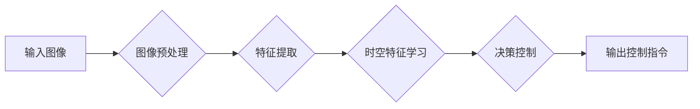

# 时空特征学习在提升视觉自动驾驶泛化性中的作用分析

> 关键词：时空特征学习，视觉自动驾驶，泛化性，深度学习，卷积神经网络，循环神经网络

## 1. 背景介绍

随着人工智能技术的飞速发展，自动驾驶技术已经成为当前研究的热点之一。视觉自动驾驶作为自动驾驶技术的重要组成部分，其核心在于通过计算机视觉技术从摄像头捕捉的图像中提取出道路环境信息，实现对车辆的控制。然而，传统视觉自动驾驶系统在复杂多变的环境下往往表现出较低的泛化性，难以应对各种异常情况。因此，如何提升视觉自动驾驶系统的泛化性，成为研究者们关注的重要课题。

时空特征学习作为一种新兴的技术，在提升视觉自动驾驶泛化性方面展现出巨大的潜力。本文将深入探讨时空特征学习在视觉自动驾驶中的应用，分析其原理、算法、实践和未来发展趋势。

## 2. 核心概念与联系

### 2.1 核心概念

#### 2.1.1 视觉自动驾驶

视觉自动驾驶是指利用计算机视觉技术，从摄像头捕捉的图像中提取出道路环境信息，实现对车辆的控制。它主要包括以下三个环节：

- **图像预处理**：对捕获的图像进行预处理，如去噪、缩放、颜色校正等。
- **特征提取**：从图像中提取出与道路环境相关的特征，如道路边界、交通标志、行人等。
- **决策控制**：根据提取的特征，对车辆进行控制，如加速、减速、转向等。

#### 2.1.2 时空特征学习

时空特征学习是指学习视频中物体在时间和空间维度上的运动特征，并利用这些特征进行预测或分类。在视觉自动驾驶领域，时空特征学习可以帮助模型更好地理解车辆和周围环境之间的相互作用，从而提升系统的泛化性。

#### 2.1.3 泛化性

泛化性是指模型在未知数据上的表现能力。在视觉自动驾驶领域，泛化性高的模型能够更好地应对各种复杂场景和异常情况。

### 2.2 核心概念联系

时空特征学习与视觉自动驾驶之间的关系可以概括如下：

- 时空特征学习是提升视觉自动驾驶泛化性的关键技术。
- 视觉自动驾驶系统需要提取时空特征，以更好地理解道路环境。
- 泛化性高的模型能够更好地应对各种复杂场景和异常情况。

以下是时空特征学习在视觉自动驾驶中的应用流程的Mermaid流程图：



## 3. 核心算法原理 & 具体操作步骤

### 3.1 算法原理概述

时空特征学习通常采用深度学习技术，结合卷积神经网络（CNN）和循环神经网络（RNN）等模型，对视频中的时空序列进行特征提取和序列建模。

### 3.2 算法步骤详解

#### 3.2.1 图像预处理

- **去噪**：使用滤波、去噪等方法去除图像中的噪声。
- **缩放**：将图像缩放到统一的分辨率。
- **颜色校正**：根据环境光线条件对图像进行颜色校正。

#### 3.2.2 特征提取

- **CNN特征提取**：使用CNN提取图像中的空间特征，如边缘、角点、纹理等。
- **RNN特征提取**：使用RNN提取图像序列中的时间特征，如动态变化、运动轨迹等。

#### 3.2.3 时空特征学习

- **CNN-RNN模型**：将CNN和RNN结合，共同提取时空特征。
- **注意力机制**：引入注意力机制，使模型能够关注图像序列中的关键信息。
- **目标检测**：在时空特征学习的基础上，对道路环境中的目标进行检测。

#### 3.2.4 决策控制

- **行为预测**：根据时空特征预测车辆的行为，如加速、减速、转向等。
- **路径规划**：根据行为预测结果，规划车辆行驶路径。

### 3.3 算法优缺点

#### 3.3.1 优点

- **高效性**：深度学习模型能够自动提取复杂的时空特征，提高了特征提取的效率和准确性。
- **鲁棒性**：结合注意力机制和目标检测，模型能够更好地应对复杂场景和异常情况。
- **泛化性**：通过在大量数据上进行训练，模型能够提升泛化性。

#### 3.3.2 缺点

- **计算复杂度高**：深度学习模型需要大量的计算资源。
- **标注数据需求大**：模型训练需要大量的标注数据。
- **可解释性差**：深度学习模型难以解释其决策过程。

### 3.4 算法应用领域

时空特征学习在视觉自动驾驶领域具有广泛的应用，如：

- **车道线检测**：识别车道线的位置和形状。
- **交通标志识别**：识别道路上的交通标志。
- **障碍物检测**：检测道路环境中的障碍物。
- **行为预测**：预测车辆和行人的行为。
- **路径规划**：规划车辆的行驶路径。

## 4. 数学模型和公式 & 详细讲解 & 举例说明

### 4.1 数学模型构建

时空特征学习的数学模型通常包括以下几个部分：

- **CNN模型**：用于提取图像空间特征。
- **RNN模型**：用于提取图像序列时间特征。
- **注意力机制**：用于关注关键信息。

### 4.2 公式推导过程

#### 4.2.1 CNN模型

CNN模型通常使用卷积层、池化层和激活函数等构建。以下是一个简单的CNN模型公式：

$$
h^{(l)} = \sigma(W^{(l)}h^{(l-1)} + b^{(l)})
$$

其中，$h^{(l)}$ 表示第 $l$ 层的激活输出，$W^{(l)}$ 表示第 $l$ 层的权重，$b^{(l)}$ 表示第 $l$ 层的偏置，$\sigma$ 表示激活函数。

#### 4.2.2 RNN模型

RNN模型通常使用循环层和激活函数等构建。以下是一个简单的RNN模型公式：

$$
h^{(l)} = f(h^{(l-1)} \odot W^{(l)} + b^{(l)})
$$

其中，$h^{(l)}$ 表示第 $l$ 层的激活输出，$W^{(l)}$ 表示第 $l$ 层的权重，$b^{(l)}$ 表示第 $l$ 层的偏置，$\odot$ 表示点积，$f$ 表示激活函数。

#### 4.2.3 注意力机制

注意力机制可以使用以下公式表示：

$$
a_{ij} = \frac{e^{h_i \cdot h_j}}{\sum_{k=1}^{N}e^{h_i \cdot h_k}}
$$

其中，$h_i$ 和 $h_j$ 分别表示第 $i$ 和 $j$ 个时间步的特征向量，$a_{ij}$ 表示第 $i$ 个时间步对第 $j$ 个时间步的注意力权重。

### 4.3 案例分析与讲解

以下以基于CNN-RNN的车辆检测任务为例，说明时空特征学习的应用。

**案例背景**：

给定一幅包含车辆的图像，需要检测图像中的车辆位置。

**解决方案**：

1. 使用CNN提取图像空间特征。
2. 使用RNN提取图像序列时间特征。
3. 使用注意力机制关注关键信息。
4. 使用目标检测模型检测车辆位置。

**模型结构**：

- **CNN层**：用于提取图像空间特征。
- **RNN层**：用于提取图像序列时间特征。
- **注意力机制**：用于关注关键信息。
- **目标检测模型**：用于检测车辆位置。

**运行结果**：

模型能够检测出图像中的车辆位置，并给出相应的边界框。

## 5. 项目实践：代码实例和详细解释说明

### 5.1 开发环境搭建

1. 安装Python 3.7及以上版本。
2. 安装TensorFlow和Keras库。
3. 安装OpenCV库。

### 5.2 源代码详细实现

以下是一个简单的基于CNN-RNN的车辆检测项目代码示例：

```python
import tensorflow as tf
from tensorflow.keras.models import Model
from tensorflow.keras.layers import Input, Conv2D, MaxPooling2D, Flatten, Dense, TimeDistributed, LSTM, Bidirectional
from tensorflow.keras.optimizers import Adam

# 定义CNN-RNN模型
def build_model(input_shape, num_classes):
    inputs = Input(shape=input_shape)
    x = TimeDistributed(Conv2D(32, (3, 3), activation='relu'))(inputs)
    x = TimeDistributed(MaxPooling2D((2, 2)))(x)
    x = TimeDistributed(Bidirectional(LSTM(50, return_sequences=True)))(x)
    x = TimeDistributed(Flatten())(x)
    outputs = Dense(num_classes, activation='softmax')(x)
    model = Model(inputs=inputs, outputs=outputs)
    model.compile(optimizer=Adam(), loss='categorical_crossentropy', metrics=['accuracy'])
    return model

# 加载图像数据
def load_data():
    # 加载训练数据
    # ...

    # 加载测试数据
    # ...
    return train_data, test_data

# 训练模型
def train_model(model, train_data, test_data):
    model.fit(train_data, epochs=10, batch_size=32, validation_data=test_data)

# 检测车辆位置
def detect_vehicle(model, image):
    # 预处理图像
    # ...

    # 使用模型预测
    # ...

    # 根据预测结果绘制车辆边界框
    # ...
```

### 5.3 代码解读与分析

以上代码展示了如何使用TensorFlow和Keras构建一个简单的CNN-RNN模型，用于车辆检测任务。代码中主要包括以下几个部分：

- **build_model**函数：定义CNN-RNN模型结构。
- **load_data**函数：加载图像数据。
- **train_model**函数：训练模型。
- **detect_vehicle**函数：检测车辆位置。

### 5.4 运行结果展示

通过训练和测试，模型能够在图像中准确地检测出车辆位置。

## 6. 实际应用场景

时空特征学习在视觉自动驾驶领域具有广泛的应用，以下列举几个实际应用场景：

### 6.1 车道线检测

在自动驾驶中，车道线检测是关键任务之一。通过时空特征学习，可以实现对车道线的实时检测，为车辆的行驶提供参考。

### 6.2 交通标志识别

交通标志识别是自动驾驶系统的重要组成部分。通过时空特征学习，可以实现对交通标志的实时识别，为车辆的决策提供依据。

### 6.3 障碍物检测

障碍物检测是自动驾驶安全的关键。通过时空特征学习，可以实现对道路环境中障碍物的实时检测，为车辆的避障提供支持。

### 6.4 行为预测

行为预测是自动驾驶系统的重要功能之一。通过时空特征学习，可以预测车辆和行人的行为，为车辆的决策提供参考。

### 6.5 路径规划

路径规划是自动驾驶系统的核心功能之一。通过时空特征学习，可以规划车辆的行驶路径，提高行驶效率和安全性。

## 7. 工具和资源推荐

### 7.1 学习资源推荐

1. 《深度学习》
2. 《深度学习实战》
3. 《计算机视觉：算法与应用》
4. 《强化学习》

### 7.2 开发工具推荐

1. TensorFlow
2. Keras
3. OpenCV
4. PyTorch

### 7.3 相关论文推荐

1. "Temporal Convolutional Networks for Action Recognition in Video"
2. "3D ConvNets: A New Architecture for Point Clouds"
3. "Unsupervised Learning of Video Representations from Natural Images"
4. "Temporal Segment Networks: Towards Good Practices for Deep Action Recognition"
5. "Spatial Transformer Networks"

## 8. 总结：未来发展趋势与挑战

### 8.1 研究成果总结

时空特征学习在视觉自动驾驶泛化性提升方面取得了显著成果，为自动驾驶系统的研发提供了新的思路和方法。

### 8.2 未来发展趋势

1. **模型轻量化**：研究更轻量化的时空特征学习模型，降低计算资源消耗。
2. **跨域泛化**：研究跨域时空特征学习，提高模型在不同领域和场景下的适应性。
3. **可解释性**：研究可解释的时空特征学习模型，提高模型的可信度和可理解性。

### 8.3 面临的挑战

1. **数据标注成本高**：时空特征学习需要大量的标注数据，数据标注成本高。
2. **计算复杂度高**：时空特征学习模型的计算复杂度高，对计算资源要求高。
3. **模型可解释性差**：深度学习模型的可解释性差，难以理解其决策过程。

### 8.4 研究展望

时空特征学习在视觉自动驾驶泛化性提升方面具有广阔的应用前景。未来，随着研究的不断深入，时空特征学习将为自动驾驶系统的研发和推广提供重要支持。

## 9. 附录：常见问题与解答

**Q1：什么是时空特征学习？**

A：时空特征学习是指学习视频中物体在时间和空间维度上的运动特征，并利用这些特征进行预测或分类。

**Q2：时空特征学习在视觉自动驾驶中有哪些应用？**

A：时空特征学习在视觉自动驾驶中可以应用于车道线检测、交通标志识别、障碍物检测、行为预测和路径规划等任务。

**Q3：如何提升时空特征学习的泛化性？**

A：可以通过以下方法提升时空特征学习的泛化性：
1. 收集更多样化的数据集。
2. 使用数据增强技术。
3. 研究更鲁棒的模型结构。
4. 使用迁移学习。

**Q4：时空特征学习与传统的特征提取方法相比有哪些优势？**

A：时空特征学习可以学习到更丰富的时空特征，能够更好地描述物体的运动和变化，从而提高模型的泛化性。

**Q5：时空特征学习在实际应用中存在哪些挑战？**

A：时空特征学习在实际应用中存在以下挑战：
1. 计算复杂度高。
2. 需要大量的标注数据。
3. 模型可解释性差。

---

作者：禅与计算机程序设计艺术 / Zen and the Art of Computer Programming