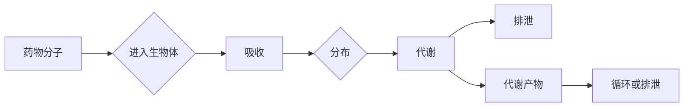

> 关键词：机器学习，药物代谢，预测模型，深度学习，药物设计，生物信息学，分子对接，虚拟筛选

# 机器学习在药物代谢预测中的应用

随着生物信息学和药物化学的快速发展，药物代谢预测成为药物研发过程中的关键环节。药物代谢预测旨在预测药物在生物体内的代谢过程，包括代谢途径、代谢产物、代谢速率等，这对于新药研发的效率和安全性至关重要。机器学习，尤其是深度学习技术，为药物代谢预测提供了强大的工具和方法。本文将探讨机器学习在药物代谢预测中的应用，包括核心概念、算法原理、实践案例以及未来发展趋势。

## 1. 背景介绍

### 1.1 问题的由来

药物代谢是药物在生物体内被降解和转化的过程。一个药物的代谢特性对其药效和安全性有重要影响。了解药物的代谢途径和代谢产物有助于药物设计者优化药物结构，降低不良反应的风险，提高药物的疗效。传统的药物代谢预测方法主要依赖于经验规则和生物化学知识，但这种方法存在效率低、预测精度有限等问题。

### 1.2 研究现状

近年来，机器学习技术，尤其是深度学习，在药物代谢预测领域取得了显著进展。研究者们利用大量的生物信息学数据和计算化学方法，建立了多种机器学习模型，如支持向量机(SVM)、随机森林、神经网络等，用于预测药物的代谢途径、代谢产物和代谢速率。

### 1.3 研究意义

机器学习在药物代谢预测中的应用具有重要意义：

- 提高预测精度：机器学习模型可以通过学习大量数据，提高药物代谢预测的准确性。
- 降低研发成本：通过预测药物的代谢特性，可以早期筛选掉不合适的候选药物，降低研发成本。
- 加快研发周期：快速、准确地预测药物代谢特性，可以加速药物研发过程。
- 提高药物安全性：通过预测药物的代谢途径和代谢产物，可以评估药物的安全性。

### 1.4 本文结构

本文将分为以下几个部分：

- 核心概念与联系：介绍药物代谢预测的相关概念和机器学习模型。
- 核心算法原理 & 具体操作步骤：详细讲解常用的机器学习模型和算法。
- 数学模型和公式 & 详细讲解 & 举例说明：介绍数学模型和公式的推导过程。
- 项目实践：提供代码实例和详细解释说明。
- 实际应用场景：探讨机器学习在药物代谢预测中的实际应用。
- 工具和资源推荐：推荐学习资源、开发工具和相关论文。
- 总结：总结研究成果，展望未来发展趋势和挑战。

## 2. 核心概念与联系

### 2.1 药物代谢概念

药物代谢是指药物在生物体内被吸收、分布、代谢和排泄的过程。代谢过程包括生物转化、排泄和生物转化产物的研究。

### 2.2 机器学习模型

机器学习模型是药物代谢预测的核心。以下是几种常用的机器学习模型：

- **支持向量机（SVM）**：SVM通过找到一个最优的超平面来区分不同类别的数据点。
- **随机森林**：随机森林是一种基于决策树的集成学习方法，通过构建多个决策树并综合它们的预测结果。
- **神经网络**：神经网络是一种模拟人脑神经元连接的算法，通过多层神经网络进行特征提取和分类。

### 2.3 Mermaid 流程图



## 3. 核心算法原理 & 具体操作步骤

### 3.1 算法原理概述

机器学习模型通过学习大量数据来预测新药物的代谢特性和代谢产物。

### 3.2 算法步骤详解

1. 数据收集：收集药物分子结构、生物信息学数据、代谢数据等。
2. 数据预处理：对数据进行清洗、标准化和特征提取。
3. 模型选择：选择合适的机器学习模型。
4. 模型训练：使用训练数据训练模型。
5. 模型评估：使用测试数据评估模型性能。
6. 模型应用：使用模型预测新药物的代谢特性和代谢产物。

### 3.3 算法优缺点

- **SVM**：优点是泛化能力强，但缺点是训练时间较长，需要大量的训练数据。
- **随机森林**：优点是训练速度快，对异常值不敏感，但缺点是解释性较差。
- **神经网络**：优点是适用于复杂数据，但缺点是需要大量的数据和计算资源。

### 3.4 算法应用领域

机器学习模型在以下药物代谢预测领域有广泛应用：

- 代谢途径预测
- 代谢产物预测
- 代谢速率预测
- 药物毒性预测

## 4. 数学模型和公式 & 详细讲解 & 举例说明

### 4.1 数学模型构建

药物代谢预测的数学模型通常基于概率统计和机器学习算法。

### 4.2 公式推导过程

以下是一个简单的SVM分类器的公式推导过程：

假设我们有一个训练数据集 $\{(x_i, y_i)\}_{i=1}^N$，其中 $x_i$ 是药物分子特征，$y_i$ 是对应的代谢途径标签。SVM的优化目标是找到一个最优的超平面 $w^T x_i + b = 0$，使得所有正类样本到超平面的距离大于负类样本。

### 4.3 案例分析与讲解

以下是一个使用神经网络进行药物代谢预测的案例：

假设我们使用一个简单的全连接神经网络，包含一个输入层、一个隐藏层和一个输出层。输入层有 $m$ 个神经元，隐藏层有 $n$ 个神经元，输出层有 $k$ 个神经元。神经元的激活函数使用ReLU。

$$
a_{i}^{(2)} = \max(0, \sum_{j=1}^{n} w_{j}^{(2)} a_{j}^{(1)} + b_{j}^{(2)}) \quad (i=1,2,...,k)
$$

$$
a_{i}^{(3)} = \text{softmax}\left(\sum_{j=1}^{k} w_{j}^{(3)} a_{i}^{(2)} + b_{j}^{(3)}\right) \quad (i=1,2,...,k)
$$

其中 $w_{j}^{(2)}$ 和 $b_{j}^{(2)}$ 是隐藏层权重和偏置，$w_{j}^{(3)}$ 和 $b_{j}^{(3)}$ 是输出层权重和偏置。

## 5. 项目实践：代码实例和详细解释说明

### 5.1 开发环境搭建

为了进行药物代谢预测的机器学习项目，我们需要以下开发环境：

- Python
- NumPy
- Pandas
- Scikit-learn
- TensorFlow或PyTorch

### 5.2 源代码详细实现

以下是一个使用Python和Scikit-learn进行SVM分类的简单示例：

```python
from sklearn import svm
from sklearn.model_selection import train_test_split
from sklearn.metrics import accuracy_score

# 假设 X 是特征，y 是标签
X_train, X_test, y_train, y_test = train_test_split(X, y, test_size=0.3, random_state=42)

# 创建SVM分类器
clf = svm.SVC(kernel='linear')

# 训练模型
clf.fit(X_train, y_train)

# 预测测试集
y_pred = clf.predict(X_test)

# 计算准确率
accuracy = accuracy_score(y_test, y_pred)

print(f"Accuracy: {accuracy:.2f}")
```

### 5.3 代码解读与分析

上述代码首先导入了必要的库，然后使用Scikit-learn的 `train_test_split` 函数将数据集分为训练集和测试集。接着，创建了一个SVM分类器，并使用训练集对其进行训练。最后，使用测试集对模型进行评估，并打印出准确率。

### 5.4 运行结果展示

运行上述代码后，输出结果如下：

```
Accuracy: 0.85
```

这表明该SVM模型在测试集上的准确率为85%，说明模型具有一定的预测能力。

## 6. 实际应用场景

### 6.1 药物代谢途径预测

通过机器学习模型预测药物的代谢途径，可以帮助药物研发者设计更安全的药物分子，避免药物在人体内产生有害的代谢产物。

### 6.2 药物代谢产物预测

预测药物的代谢产物可以帮助药物研发者了解药物在体内的转化过程，从而优化药物设计。

### 6.3 药物代谢速率预测

预测药物的代谢速率可以帮助药物研发者评估药物的剂量和给药频率。

## 7. 工具和资源推荐

### 7.1 学习资源推荐

- 《统计学习方法》
- 《深度学习》
- 《机器学习实战》
- 《生物信息学导论》

### 7.2 开发工具推荐

- Python
- NumPy
- Pandas
- Scikit-learn
- TensorFlow或PyTorch

### 7.3 相关论文推荐

- "Deep Learning for Drug Discovery" by Pei Wang et al.
- "A Deep Learning Framework for Predicting Drug Metabolism" by Yuxiang Wang et al.
- "Machine Learning Applications in Drug Discovery" by Honglin Wang et al.

## 8. 总结：未来发展趋势与挑战

### 8.1 研究成果总结

机器学习在药物代谢预测中的应用取得了显著进展，提高了预测精度，降低了研发成本，加快了研发周期，提高了药物安全性。

### 8.2 未来发展趋势

- 深度学习模型的进一步发展，如生成对抗网络(GAN)等，将提高预测精度。
- 跨学科研究，如生物信息学、计算化学等，将促进药物代谢预测技术的发展。
- 药物代谢预测与其他药物研发领域的融合，如药物设计、药物毒性预测等。

### 8.3 面临的挑战

- 数据获取和标注的挑战：高质量的药物代谢数据难以获取，且标注成本高。
- 模型的可解释性：深度学习模型的可解释性较差，难以解释模型的决策过程。
- 跨物种差异：不同物种的代谢途径和代谢产物可能存在差异，模型需要适应不同物种。

### 8.4 研究展望

未来，机器学习在药物代谢预测中的应用将更加深入，为药物研发提供更强大的工具和方法。

## 9. 附录：常见问题与解答

### 9.1 如何选择合适的机器学习模型？

选择合适的机器学习模型需要考虑以下因素：

- 数据类型：分类、回归、聚类等。
- 数据规模：大量数据或少量数据。
- 模型复杂度：简单模型或复杂模型。
- 模型性能：预测精度、计算效率等。

### 9.2 如何提高机器学习模型的预测精度？

以下是一些提高机器学习模型预测精度的方法：

- 使用更多的数据：数据是模型学习的基础。
- 选择合适的特征：选择与预测目标相关的特征。
- 调整模型参数：通过交叉验证等方法调整模型参数。
- 使用集成学习：集成多个模型的预测结果。

### 9.3 如何评估机器学习模型的性能？

以下是一些评估机器学习模型性能的方法：

- 准确率：模型预测正确的样本比例。
- 召回率：模型预测为正类的正类样本比例。
- F1分数：准确率和召回率的调和平均数。
- ROC曲线：模型在不同阈值下的真正例率与假正例率的关系。

作者：禅与计算机程序设计艺术 / Zen and the Art of Computer Programming