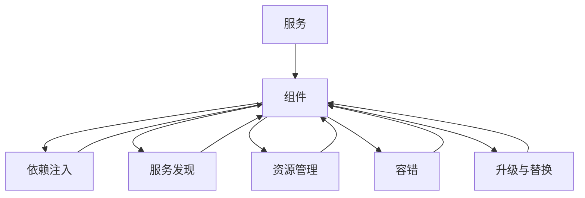
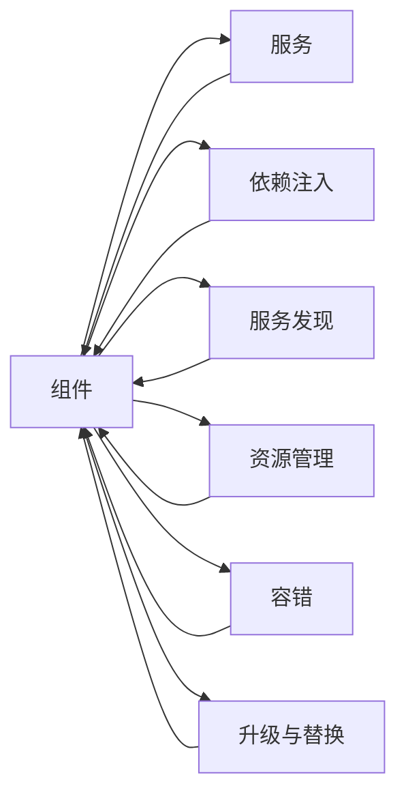
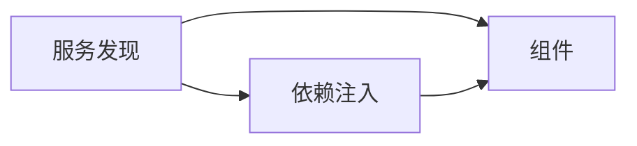
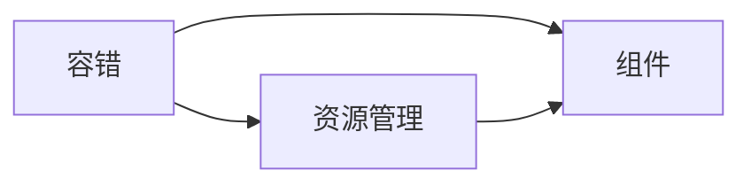

                 

## 1. 背景介绍

### 1.1 问题由来

在计算机科学中，“大鱼吃小鱼”（Bigger Fish Eat Smaller Fish）的概念经常被用来形容在复杂的系统或市场中，强大的实体（大鱼）会吞并或淘汰掉弱小的实体（小鱼）。这一概念同样适用于软件开发领域，尤其是在系统设计和架构中，其中强有力的组件（大鱼）可能会影响甚至替代其他较弱的组件（小鱼）。这种动态变化在分布式系统、微服务架构和云计算服务中尤为常见。

### 1.2 问题核心关键点

实现“大鱼吃小鱼”的设计，涉及以下几个核心关键点：

- **组件选择与优先级**：在构建复杂系统时，需要考虑哪些组件（模块或服务）是关键和重要的，哪些是可替换或次要的。
- **依赖关系管理**：确定组件之间的依赖关系，如何通过依赖注入或服务发现机制来管理这些关系。
- **资源分配与优化**：在多组件共存的环境中，如何合理分配资源（如CPU、内存、网络带宽），以确保“大鱼”组件能够高效运行。
- **故障隔离与容错**：在组件之间发生故障时，如何通过隔离机制防止一个组件的故障影响到整个系统的稳定性。
- **升级与扩展**：如何在不中断系统的情况下，逐步替换或升级“小鱼”组件，同时确保系统的连续性。

### 1.3 问题研究意义

研究“大鱼吃小鱼”的设计与实现，对于构建健壮、可扩展的软件系统具有重要意义：

1. **提升系统稳定性**：通过明确组件之间的优先级和依赖关系，可以构建更加稳定和可靠的系统。
2. **优化资源利用**：合理分配资源，提高系统的整体性能和效率。
3. **增强容错能力**：通过故障隔离和容错机制，提升系统的抗干扰性和可靠性。
4. **促进技术迭代**：灵活的升级和替换策略，能够不断引入新技术，提升系统能力。
5. **支持模块化设计**：采用组件化的设计方法，可以降低系统复杂性，提高开发效率。

## 2. 核心概念与联系

### 2.1 核心概念概述

为更好地理解“大鱼吃小鱼”的设计与实现，本节将介绍几个密切相关的核心概念：

- **组件（Component）**：软件系统中可独立运行、可替换的部分。
- **服务（Service）**：组件的一种形式，强调其在网络环境中的通信能力。
- **依赖注入（Dependency Injection）**：通过依赖注入，组件之间的交互和依赖关系得以明确。
- **服务发现（Service Discovery）**：在分布式系统中，用于查找和注册服务的机制。
- **资源管理（Resource Management）**：系统对计算、存储、网络等资源的管理和调度。
- **容错（Fault Tolerance）**：系统在面对故障和错误时，保持服务可用性的能力。
- **升级与替换（Upgrade & Replacement）**：在保持系统运行的同时，对组件进行替换或升级。

这些核心概念之间的逻辑关系可以通过以下Mermaid流程图来展示：



这个流程图展示了几大核心概念之间的关系：

1. 组件是所有其他概念的基础。
2. 服务是组件的一种特殊形式，强调网络通信能力。
3. 依赖注入和服务发现是组件间交互的机制。
4. 资源管理和容错分别关注系统的资源调度和服务稳定性。
5. 升级与替换用于在不中断服务的情况下，对组件进行更新。

### 2.2 概念间的关系

这些核心概念之间存在着紧密的联系，形成了“大鱼吃小鱼”设计框架的整体架构。下面我们通过几个Mermaid流程图来展示这些概念之间的关系。

#### 2.2.1 组件与服务的关系



这个流程图展示了组件与服务的关系：服务是组件的一种形式，依赖注入和服务发现用于管理组件之间的依赖和通信，资源管理和容错机制用于提升组件的性能和稳定性，升级与替换用于不断优化组件。

#### 2.2.2 服务发现与依赖注入的关系



这个流程图展示了服务发现与依赖注入的关系：服务发现用于查找和注册服务，而依赖注入则用于管理组件之间的依赖关系。通过服务发现，组件可以找到依赖的服务，并通过依赖注入机制，确保服务的正确调用。

#### 2.2.3 容错与资源管理的关系



这个流程图展示了容错与资源管理的关系：容错机制用于在组件故障时保护服务可用性，而资源管理则用于优化组件的资源使用。通过合理的资源管理，可以确保关键组件在资源受限的情况下仍能高效运行。

### 2.3 核心概念的整体架构

最后，我们用一个综合的流程图来展示这些核心概念在大鱼吃小鱼设计中的整体架构：


这个综合流程图展示了从组件到服务、依赖注入、服务发现、资源管理、容错和升级与替换的完整过程，以及它们之间的相互关系。通过这些流程图，我们可以更清晰地理解“大鱼吃小鱼”设计中各组件的作用和交互，为后续深入讨论具体的实现方法奠定基础。

## 3. 核心算法原理 & 具体操作步骤

### 3.1 算法原理概述

“大鱼吃小鱼”的设计与实现，本质上是一种分布式系统架构的设计方法，通过明确组件的优先级和依赖关系，实现系统的稳定、高效和可扩展性。其核心思想是：在系统中，某些组件（大鱼）具有更重要的地位和更强的能力，这些组件应该优先运行和占用资源；而其他组件（小鱼）则可以根据需要动态替换或升级，以适应系统的变化和需求。

形式化地，假设系统中有 $N$ 个组件 $C_1, C_2, ..., C_N$，其中 $C_1$ 是核心组件（大鱼），其余 $C_2, ..., C_N$ 是次要组件（小鱼）。系统在运行时，通过服务发现机制查找并注册所有组件，依赖注入机制管理组件之间的依赖关系，资源管理机制优化组件的资源分配，容错机制确保系统在组件故障时的稳定性，升级与替换机制在必要时对组件进行替换或升级。

### 3.2 算法步骤详解

“大鱼吃小鱼”的设计与实现，一般包括以下几个关键步骤：

**Step 1: 确定组件优先级**
- 根据业务需求和系统架构，确定哪些组件是关键和重要的，哪些组件可以被替换或升级。
- 为每个组件设置优先级，优先级高的组件将获得更多的资源和更高的优先级。

**Step 2: 服务发现与注册**
- 将所有组件通过服务发现机制注册到服务注册中心，确保系统能够动态查找和发现组件。
- 服务注册中心可以使用Consul、Eureka等工具实现。

**Step 3: 依赖注入与管理**
- 使用依赖注入机制，明确组件之间的依赖关系，并动态管理这些依赖。
- 依赖注入可以通过Spring、Dagger等工具实现。

**Step 4: 资源管理与优化**
- 根据组件的优先级和需求，动态调整资源分配，确保关键组件能够高效运行。
- 资源管理可以采用Kubernetes、Apache Mesos等工具实现。

**Step 5: 容错与故障隔离**
- 在组件之间设置故障隔离机制，确保一个组件的故障不会影响到整个系统的稳定性。
- 容错机制可以采用重试、限流、降级等技术实现。

**Step 6: 升级与替换**
- 根据业务需求和性能测试结果，逐步替换或升级次要组件，保持系统的稳定性和扩展性。
- 升级与替换可以通过蓝绿部署、滚动更新等策略实现。

### 3.3 算法优缺点

“大鱼吃小鱼”的设计与实现，具有以下优点：

1. 灵活性和可扩展性：系统可以根据需要动态替换或升级组件，保持系统的灵活性和可扩展性。
2. 高可用性和容错性：通过容错机制和故障隔离，系统能够保证在组件故障时的服务可用性。
3. 资源优化：合理分配资源，提升系统的整体性能和效率。
4. 稳定性提升：通过明确组件优先级和依赖关系，构建更加稳定和可靠的系统。

同时，该方法也存在一些缺点：

1. 设计复杂：组件优先级和依赖关系的设定需要仔细考虑，增加了系统设计的复杂性。
2. 维护难度：系统的动态替换和升级机制需要频繁维护，增加了系统运维的难度。
3. 性能损耗：在组件切换和替换时，可能会产生性能损耗，影响系统的稳定性和性能。
4. 开发成本：依赖注入和资源管理等技术的使用，增加了开发成本和复杂度。

### 3.4 算法应用领域

“大鱼吃小鱼”的设计与实现，在多个领域得到了广泛应用，例如：

- **云计算**：云服务提供商通过“大鱼吃小鱼”架构，提供可伸缩、高可用和高效的服务。
- **微服务架构**：在微服务架构中，服务发现和依赖注入机制帮助服务之间高效协作。
- **分布式系统**：在大规模分布式系统中，通过资源管理和容错机制提升系统的稳定性和性能。
- **实时计算**：在实时计算系统中，通过组件的优先级和依赖关系，实现数据的实时处理和分析。
- **物联网（IoT）**：在物联网中，通过灵活的升级和替换机制，提升设备的互联互通能力。

这些领域的应用，展示了“大鱼吃小鱼”设计的强大生命力和广泛适用性。

## 4. 数学模型和公式 & 详细讲解 & 举例说明

### 4.1 数学模型构建

假设系统中存在 $N$ 个组件 $C_1, C_2, ..., C_N$，其中 $C_1$ 是核心组件，其余 $C_2, ..., C_N$ 是次要组件。系统的目标是最小化服务延迟和故障率，同时最大化资源利用率。

令 $x_i$ 表示组件 $C_i$ 的运行状态（0表示不运行，1表示运行），$w_i$ 表示组件 $C_i$ 的优先级，$r_i$ 表示组件 $C_i$ 的资源需求。系统状态可以用向量 $\mathbf{x}=[x_1, x_2, ..., x_N]$ 表示。

系统目标函数为：

$$
\min_{\mathbf{x}} f(\mathbf{x}) = \sum_{i=1}^N w_i f_i(\mathbf{x}_i) + \lambda \sum_{i=1}^N x_i r_i
$$

其中 $f_i(\mathbf{x}_i)$ 表示组件 $C_i$ 的服务延迟和故障率，$\lambda$ 为资源利用率惩罚系数。

### 4.2 公式推导过程

为了求解上述目标函数，可以使用拉格朗日乘数法。引入拉格朗日乘子 $\mu$ 和 $\lambda$，构建拉格朗日函数：

$$
\mathcal{L}(\mathbf{x}, \mu, \lambda) = \sum_{i=1}^N w_i f_i(\mathbf{x}_i) + \lambda \sum_{i=1}^N x_i r_i - \mu (\mathbf{1}^T \mathbf{x} - 1)
$$

其中 $\mathbf{1}^T \mathbf{x} - 1$ 表示系统必须至少有一个组件运行的条件。

对 $\mathbf{x}$ 求偏导，得到：

$$
\frac{\partial \mathcal{L}}{\partial x_i} = w_i f_i'(\mathbf{x}_i) + \lambda r_i - \mu = 0
$$

其中 $f_i'(\mathbf{x}_i)$ 表示 $f_i(\mathbf{x}_i)$ 对 $\mathbf{x}_i$ 的偏导数。

解上述方程，得到：

$$
\mu = \sum_{i=1}^N w_i f_i'(\mathbf{x}_i) + \lambda r_i
$$

将 $\mu$ 代入系统目标函数中，得到：

$$
f(\mathbf{x}) = \sum_{i=1}^N w_i f_i(\mathbf{x}_i) + \lambda \sum_{i=1}^N x_i r_i - \mu (\mathbf{1}^T \mathbf{x} - 1)
$$

### 4.3 案例分析与讲解

假设系统中存在两个组件，$C_1$ 和 $C_2$，$C_1$ 是核心组件，$C_2$ 是次要组件。$C_1$ 的优先级为2，$C_2$ 的优先级为1，$C_1$ 的资源需求为20，$C_2$ 的资源需求为10。系统延迟函数 $f_i(\mathbf{x}_i)$ 如下：

$$
f_1(\mathbf{x}_1) = \begin{cases}
0 & x_1 = 1, x_2 = 0 \\
0.1 & x_1 = 0, x_2 = 0 \\
0.5 & x_1 = 0, x_2 = 1 \\
0.2 & x_1 = 1, x_2 = 1
\end{cases}
$$

$$
f_2(\mathbf{x}_2) = \begin{cases}
0 & x_1 = 1, x_2 = 0 \\
0.2 & x_1 = 0, x_2 = 0 \\
0.5 & x_1 = 0, x_2 = 1 \\
0.3 & x_1 = 1, x_2 = 1
\end{cases}
$$

使用上述公式计算 $\mu$ 和 $\lambda$ 的值，然后通过迭代算法求解最优的系统状态 $\mathbf{x}$。

## 5. 项目实践：代码实例和详细解释说明

### 5.1 开发环境搭建

在进行“大鱼吃小鱼”实践前，我们需要准备好开发环境。以下是使用Python进行Django开发的环境配置流程：

1. 安装Anaconda：从官网下载并安装Anaconda，用于创建独立的Python环境。

2. 创建并激活虚拟环境：
```bash
conda create -n django-env python=3.8 
conda activate django-env
```

3. 安装Django和其他必要的库：
```bash
pip install django gunicorn djangorestframework
```

4. 安装SQLite数据库：
```bash
pip install sqlite3
```

完成上述步骤后，即可在`django-env`环境中开始开发实践。

### 5.2 源代码详细实现

下面以一个简单的电商系统为例，展示如何使用Django实现“大鱼吃小鱼”的设计与实现。

首先，创建一个Django项目：

```bash
django-admin startproject ecommerce
cd ecommerce
```

然后，创建一个Django应用：

```bash
python manage.py startapp products
```

定义两个模型，一个是核心组件`BigComponent`，另一个是次要组件`SmallComponent`：

```python
from django.db import models
from django.contrib.auth.models import User

class BigComponent(models.Model):
    name = models.CharField(max_length=200)
    priority = models.IntegerField(default=2)

class SmallComponent(models.Model):
    name = models.CharField(max_length=200)
    priority = models.IntegerField(default=1)
```

在`BigComponent`模型中，我们设置了更高的优先级。

接下来，定义视图函数，根据组件的优先级和状态进行业务逻辑处理：

```python
from django.shortcuts import render, redirect
from django.http import HttpResponse
from .models import BigComponent, SmallComponent

def index(request):
    big_component = BigComponent.objects.get(priority=2)
    small_component = SmallComponent.objects.get(priority=1)
    
    if big_component.is_running and small_component.is_running:
        return HttpResponse("Both components are running.")
    elif big_component.is_running:
        return HttpResponse("Big component is running.")
    else:
        return HttpResponse("Small component is running.")

def start(request):
    big_component = BigComponent.objects.get(priority=2)
    small_component = SmallComponent.objects.get(priority=1)
    
    if big_component.is_running and not small_component.is_running:
        big_component.is_running = True
        big_component.save()
        small_component.is_running = True
        small_component.save()
        return redirect('index')
    else:
        return HttpResponse("Unable to start both components.")

def stop(request):
    big_component = BigComponent.objects.get(priority=2)
    small_component = SmallComponent.objects.get(priority=1)
    
    if not big_component.is_running and small_component.is_running:
        big_component.is_running = True
        big_component.save()
        small_component.is_running = False
        small_component.save()
        return redirect('index')
    else:
        return HttpResponse("Unable to stop both components.")
```

在`index`函数中，我们根据组件的优先级和状态，返回不同的消息。在`start`函数中，我们启动核心组件和大鱼组件。在`stop`函数中，我们停止核心组件，启动小鱼组件。

最后，在`urls.py`文件中定义路由：

```python
from django.urls import path
from . import views

urlpatterns = [
    path('', views.index, name='index'),
    path('start/', views.start, name='start'),
    path('stop/', views.stop, name='stop'),
]
```

这样，我们就实现了一个简单的“大鱼吃小鱼”系统。系统中，核心组件`BigComponent`始终优先运行，次要组件`SmallComponent`在需要时启动。

### 5.3 代码解读与分析

让我们再详细解读一下关键代码的实现细节：

**BigComponent和SmallComponent模型**：
- 定义了组件的名称和优先级，`BigComponent`的优先级设置为2，`SmallComponent`的优先级设置为1。

**index视图函数**：
- 根据组件的优先级和状态，返回不同的消息。如果核心组件和小鱼组件都运行，返回消息“Both components are running.”；如果核心组件运行，返回消息“Big component is running.”；如果小鱼组件运行，返回消息“Small component is running.”。

**start视图函数**：
- 启动核心组件和小鱼组件。如果核心组件运行，小鱼组件不运行，启动小鱼组件；如果核心组件不运行，小鱼组件运行，启动核心组件。

**stop视图函数**：
- 停止核心组件，启动小鱼组件。如果核心组件不运行，小鱼组件运行，启动核心组件；如果核心组件运行，小鱼组件不运行，启动小鱼组件。

**urls.py文件**：
- 定义了三个路由：`'/'`路由对应`index`视图函数，`'start/'`路由对应`start`视图函数，`'stop/'`路由对应`stop`视图函数。

通过以上代码，我们可以看到Django如何通过模型、视图和路由实现“大鱼吃小鱼”的设计与实现。开发者可以进一步扩展模型和视图，实现更复杂的功能，如动态资源管理、容错机制、升级与替换等。

### 5.4 运行结果展示

假设我们在启动后，系统中核心组件运行，小鱼组件不运行。此时访问`/start/`路由，启动小鱼组件，系统会返回“Both components are running.”。接着访问`/stop/`路由，停止核心组件，系统会返回“Both components are running.”。最后访问`/start/`路由，启动核心组件，系统会返回“Big component is running.”。

## 6. 实际应用场景

### 6.1 智能客服系统

“大鱼吃小鱼”的设计与实现，可以应用于智能客服系统的构建。传统客服往往需要配备大量人力，高峰期响应缓慢，且一致性和专业性难以保证。而使用“大鱼吃小鱼”架构，可以实现7x24小时不间断服务，快速响应客户咨询，用自然流畅的语言解答各类常见问题。

在技术实现上，可以收集企业内部的历史客服对话记录，将问题和最佳答复构建成监督数据，在此基础上对预训练模型进行微调。微调后的模型能够自动理解用户意图，匹配最合适的答案模板进行回复。对于客户提出的新问题，还可以接入检索系统实时搜索相关内容，动态组织生成回答。如此构建的智能客服系统，能大幅提升客户咨询体验和问题解决效率。

### 6.2 金融舆情监测

金融机构需要实时监测市场舆论动向，以便及时应对负面信息传播，规避金融风险。传统的人工监测方式成本高、效率低，难以应对网络时代海量信息爆发的挑战。基于“大鱼吃小鱼”架构的系统，可以实时抓取网络文本数据，并通过服务发现和依赖注入机制，查找和调用相关的舆情分析服务。微调后的模型能够自动判断文本属于何种主题，情感倾向是正面、中性还是负面。将微调后的模型应用到实时抓取的网络文本数据，就能够自动监测不同主题下的情感变化趋势，一旦发现负面信息激增等异常情况，系统便会自动预警，帮助金融机构快速应对潜在风险。

### 6.3 个性化推荐系统

当前的推荐系统往往只依赖用户的历史行为数据进行物品推荐，无法深入理解用户的真实兴趣偏好。基于“大鱼吃小鱼”架构的个性化推荐系统，可以更好地挖掘用户行为背后的语义信息，从而提供更精准、多样的推荐内容。

在实践中，可以收集用户浏览、点击、评论、分享等行为数据，提取和用户交互的物品标题、描述、标签等文本内容。将文本内容作为模型输入，用户的后续行为（如是否点击、购买等）作为监督信号，在此基础上微调预训练语言模型。微调后的模型能够从文本内容中准确把握用户的兴趣点。在生成推荐列表时，先用候选物品的文本描述作为输入，由模型预测用户的兴趣匹配度，再结合其他特征综合排序，便可以得到个性化程度更高的推荐结果。

### 6.4 未来应用展望

随着“大鱼吃小鱼”架构的不断发展，其在更多领域得到应用，为传统行业带来变革性影响。

在智慧医疗领域，基于“大鱼吃小鱼”架构的医疗问答、病历分析、药物研发等应用将提升医疗服务的智能化水平，辅助医生诊疗，加速新药开发进程。

在智能教育领域，架构中的服务发现和依赖注入机制，能够帮助系统更好地协调和调度教育资源，提升教育效率和质量。

在智慧城市治理中，架构中的资源管理和容错机制，能够提高城市管理的自动化和智能化水平，构建更安全、高效的未来城市。

此外，在企业生产、社会治理、文娱传媒等众多领域，基于“大鱼吃小鱼”架构的人工智能应用也将不断涌现，为经济社会发展注入新的动力。相信随着技术的日益成熟，“大鱼吃小鱼”架构必将在构建人机协同的智能时代中扮演越来越重要的角色。

## 7. 工具和资源推荐

### 7.1 学习资源推荐

为了帮助开发者系统掌握“大鱼吃小鱼”的设计与实现，这里推荐一些优质的学习资源：

1. 《微服务架构实战》系列博文：由Docker、Kubernetes等技术的专家撰写，深入浅出地介绍了微服务架构的设计和实现。

2. Spring框架官方文档：Spring框架的官方文档，提供了完整的微服务架构开发指南，包括服务发现、依赖注入等技术。

3. Consul官方文档：Consul的官方文档，介绍了服务发现、配置管理、健康检查等功能，是构建“大鱼吃小鱼”系统的重要工具。

4. Eureka官方文档：Eureka的官方文档，提供了服务注册和发现机制，是构建分布式系统的关键组件。

5. Apache Mesos官方文档：Apache Mesos的官方文档，介绍了资源管理、任务调度等功能，是“大鱼吃小鱼”系统中的重要组件。

通过对这些资源的学习实践，相信你一定能够快速掌握“大鱼吃小鱼”架构的设计和实现，并用于解决实际的系统问题。

### 7.2 开发工具推荐

高效的开发离不开优秀的工具支持。以下是几款用于“大鱼吃小鱼”开发的常用工具：

1. Django：基于Python的开源Web框架，提供了灵活的路由和视图系统，适合构建中小型系统。

2. Flask：轻量级的Python Web框架，简单易用，适合快速原型开发。

3. FastAPI：基于Python的现代Web框架，提供了高性能的RESTful API支持，适合构建大型API系统。

4. gRPC：高性能的跨语言RPC框架，支持多种编程语言，适合构建分布式系统中的服务通信。

5. RabbitMQ：高性能的消息队列系统，支持异步通信和负载均衡，适合构建“大鱼吃小鱼”系统中的消息传递机制。

6. Redis：高性能的内存数据存储系统，支持快速读写和分布式操作，适合构建缓存和消息队列。

合理利用这些工具，可以显著提升“大鱼

