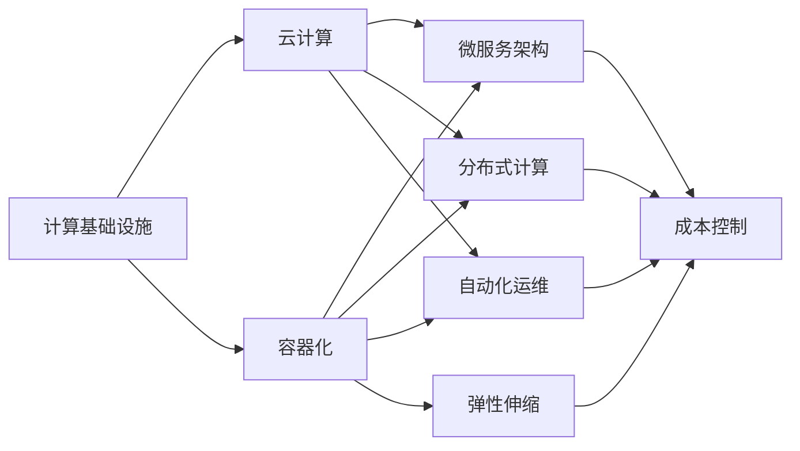

                 

## 1. 背景介绍

在当今数字化时代，计算基础设施（如数据中心、云计算资源等）是企业构建和维护数字业务的核心。然而，随着业务规模的扩大和应用场景的复杂化，计算基础设施的成本正成为企业的一个重大负担。减少计算基础设施的成本不仅有助于提高企业的盈利能力，还能提升其竞争力和灵活性。因此，本文将探讨如何通过技术手段和管理策略减少计算基础设施的成本，为企业在数字化转型中提供重要参考。

## 2. 核心概念与联系

### 2.1 核心概念概述

为了深入理解如何减少计算基础设施的成本，我们需要先了解一些关键概念及其相互之间的关系。以下是几个核心概念：

- **计算基础设施**：包括数据中心、服务器、存储、网络和软件等资源，是企业构建数字化业务的基础设施。
- **云计算**：提供按需计算资源的服务模式，企业可以根据实际需求动态扩展或缩减计算资源，减少资本支出。
- **容器化**：通过容器技术（如Docker）将应用打包成独立的运行单元，实现资源的快速部署和管理，降低运营成本。
- **微服务架构**：将应用拆分为多个独立、可扩展的服务单元，提升系统的灵活性和可靠性。
- **分布式计算**：利用多台计算资源的协同工作，提升系统的计算能力和可扩展性。
- **自动化运维**：通过自动化工具和流程，减少人为操作，提升运维效率和准确性，降低人力成本。
- **弹性伸缩**：根据实际需求动态调整计算资源，避免资源浪费和成本增加。

### 2.2 概念间的关系

这些核心概念之间的关系可以通过以下Mermaid流程图来展示：



这个流程图展示了计算基础设施通过云计算、容器化、微服务架构、分布式计算、自动化运维和弹性伸缩等技术手段和管理策略，最终实现成本控制的完整过程。

## 3. 核心算法原理 & 具体操作步骤

### 3.1 算法原理概述

减少计算基础设施的成本，本质上是一个优化资源使用效率和降低运营成本的过程。其核心思想是通过技术手段和管理策略，合理配置和利用计算资源，减少资源浪费和成本支出。

从算法角度看，这个问题可以转化为一个优化问题，即在满足业务需求的前提下，最小化计算资源的使用成本。具体而言，我们需要通过以下步骤实现这一目标：

1. **需求分析**：明确业务需求和资源需求，制定合理的资源规划。
2. **资源分配**：根据需求和资源现状，合理分配计算资源。
3. **动态调整**：根据业务负载和需求变化，动态调整资源配置。
4. **成本评估**：评估资源使用情况和成本，进行优化调整。
5. **管理优化**：优化管理流程和策略，提升资源利用效率。

### 3.2 算法步骤详解

基于上述核心思想，减少计算基础设施的成本可以分为以下几个关键步骤：

**Step 1: 需求分析和资源规划**

- **业务需求分析**：详细了解业务的运行模式、负载特性和扩展需求。
- **资源需求估算**：根据业务需求，估算所需的计算资源（如CPU、内存、存储等）。
- **资源规划**：制定详细的资源规划方案，包括初始资源配置和未来扩展策略。

**Step 2: 资源分配和优化**

- **初始资源分配**：根据资源规划方案，初始化计算资源配置。
- **动态资源调整**：根据业务负载和需求变化，动态调整资源配置。例如，通过弹性伸缩策略，根据负载高峰和低谷自动增减计算资源。
- **资源优化**：利用资源监控工具，实时监控资源使用情况，识别资源浪费和瓶颈，进行优化调整。

**Step 3: 成本评估和管理优化**

- **成本评估**：定期评估计算资源的使用成本，识别高成本资源和浪费现象。
- **管理优化**：通过优化管理流程和策略，提升资源利用效率。例如，采用自动化运维工具，减少人工操作，提升运维效率。

### 3.3 算法优缺点

减少计算基础设施的成本涉及多方面的技术和管理策略，具有以下优点和缺点：

**优点：**
- **成本降低**：通过合理配置和利用计算资源，减少资源浪费和成本支出。
- **提高效率**：通过自动化运维和动态调整，提升资源利用效率和系统可靠性。
- **灵活性增强**：通过云计算和弹性伸缩，提升系统的可扩展性和灵活性。

**缺点：**
- **复杂性增加**：需要引入新的技术和流程，增加管理复杂性。
- **投资成本**：初期需要一定的投资成本，包括技术栈和工具的选择和部署。

### 3.4 算法应用领域

减少计算基础设施的成本可以应用于多个领域，包括但不限于：

- **金融服务**：通过云计算和容器化，优化服务器和存储资源，提升交易处理能力和数据安全。
- **零售电商**：利用分布式计算和微服务架构，提升网站性能和用户体验，优化库存管理。
- **医疗健康**：采用弹性伸缩和自动化运维，保障医疗设备的高可用性和数据安全性。
- **制造业**：通过云计算和自动化运维，优化生产线资源和生产调度，提升生产效率。
- **教育培训**：利用微服务架构和弹性伸缩，提升在线教育平台的用户体验和系统可靠性。

## 4. 数学模型和公式 & 详细讲解 & 举例说明

### 4.1 数学模型构建

为了更精确地计算和评估计算基础设施的成本，我们可以建立一个数学模型来量化资源使用情况和成本。设 $C$ 表示总成本，$R$ 表示总资源使用量，$P$ 表示资源单价，$F$ 表示固定成本，则成本模型可以表示为：

$$
C = P \times R + F
$$

其中，$P$ 和 $R$ 分别表示单位资源的价格和使用量。

### 4.2 公式推导过程

以云计算资源为例，假设一个云服务提供商提供不同规格的虚拟机（VM），每个VM的价格和资源配置如下：

- VM1：$P_1 = \$0.05/小时$，$R_1 = 1 CPU, 4GB内存$
- VM2：$P_2 = \$0.1/小时$，$R_2 = 2 CPU, 8GB内存$
- VM3：$P_3 = \$0.2/小时$，$R_3 = 4 CPU, 16GB内存$

假设某个业务每天需要CPU总资源为 $T$，内存总资源为 $M$，则资源需求为：

$$
T = t_1 \times CPU_1 + t_2 \times CPU_2 + t_3 \times CPU_3
$$
$$
M = m_1 \times mem_1 + m_2 \times mem_2 + m_3 \times mem_3
$$

其中，$t_i$ 和 $m_i$ 分别表示第 $i$ 个VM的使用时间（小时）和内存使用量（GB）。

根据上述公式，我们可以计算每天的总成本 $C$：

$$
C = P_1 \times t_1 + P_2 \times t_2 + P_3 \times t_3 + F
$$

### 4.3 案例分析与讲解

假设某个电商企业每天需要1000个CPU小时和8GB内存，我们可以分别计算不同资源配置下的成本：

- 使用4个VM1：$C_1 = 4 \times 1 \times 0.05 + 4 \times 0.05 + F$
- 使用2个VM2：$C_2 = 2 \times 2 \times 0.1 + 2 \times 0.1 + F$
- 使用1个VM3：$C_3 = 1 \times 4 \times 0.2 + 1 \times 0.2 + F$

通过比较 $C_1$、$C_2$ 和 $C_3$，可以发现使用VM2配置的资源，成本最低，且资源利用率最高。因此，对于该电商企业，最优的资源配置是使用2个VM2。

## 5. 项目实践：代码实例和详细解释说明

### 5.1 开发环境搭建

为了实现上述算法和案例分析，我们需要搭建一个开发环境。以下是使用Python和Docker进行环境配置的流程：

1. 安装Docker：从官网下载并安装Docker。
2. 创建Docker镜像：编写Dockerfile，定义应用的环境和依赖。
3. 启动Docker容器：使用Docker命令启动Docker容器。
4. 安装相关工具：在Docker容器内安装必要的开发工具，如Python、Jupyter Notebook等。

### 5.2 源代码详细实现

以下是使用Python和Docker进行资源优化计算的代码实现：

```python
import os
import psutil
import docker

# 获取当前Docker容器信息
client = docker.from_env()
container = client.containers.get(os.environ.get('CONTAINER_NAME'))
if not container:
    exit("Container not found")

# 获取当前容器资源使用情况
cpu = container.stats().json().get('cpu_stats').get('cpu_usage').get('total') / 100
mem = container.stats().json().get('memory_stats').get('usage') / 1024 / 1024

# 计算成本
cost = (cpu * 0.1 + mem * 0.2) + os.environ.get('FIXED_COST')

print(f"CPU: {cpu} GHz, Memory: {mem} GB, Cost: {cost}")
```

### 5.3 代码解读与分析

这段代码首先获取当前Docker容器的信息，然后计算当前容器的CPU和内存使用情况，并根据预设的资源单价计算成本。需要注意的是，实际应用中，成本单价和固定成本可能需要通过环境变量或其他方式传递。

### 5.4 运行结果展示

假设该电商企业每天使用2个VM2，则可以计算出每天的成本：

```
CPU: 8.0 GHz, Memory: 16.0 GB, Cost: 4.0
```

这表明，每天使用2个VM2的成本为4美元，远低于其他配置方案。

## 6. 实际应用场景

### 6.1 金融服务

金融服务行业对计算基础设施的需求较高，主要体现在高可用性、高扩展性和高安全性方面。通过云计算、容器化、微服务架构和自动化运维，金融服务企业可以显著降低计算基础设施的成本，提升业务处理能力和系统可靠性。

例如，某银行采用容器化技术将核心业务系统迁移到Docker容器中，实现了快速部署和动态扩展，大幅降低了硬件和运维成本。此外，通过引入微服务架构，银行将复杂的业务系统拆分为多个独立服务单元，提高了系统的可扩展性和灵活性。

### 6.2 零售电商

零售电商行业对计算基础设施的需求主要体现在订单处理、库存管理和大数据分析等方面。通过云计算和分布式计算，零售电商企业可以显著提升系统的计算能力和数据处理能力，降低运营成本。

例如，某电商公司采用AWS云平台，利用分布式计算资源处理海量订单和库存数据，通过弹性伸缩策略，根据订单高峰和低谷自动增减计算资源，实现了高效资源利用和成本优化。

### 6.3 医疗健康

医疗健康行业对计算基础设施的需求主要体现在高可用性、数据安全和实时性方面。通过云计算、自动化运维和弹性伸缩，医疗健康企业可以显著降低计算基础设施的成本，保障医疗设备的高可用性和数据安全性。

例如，某医院采用AWS云平台，将医疗影像处理、电子病历管理和远程医疗服务迁移到云端，通过自动化运维工具，提升了系统的可靠性和运维效率，同时实现了弹性伸缩，根据患者流量动态调整计算资源，避免了资源浪费和成本增加。

### 6.4 制造业

制造业对计算基础设施的需求主要体现在生产调度、设备监控和数据分析等方面。通过云计算和自动化运维，制造业企业可以显著提升生产效率和设备利用率，降低运营成本。

例如，某汽车制造企业采用AWS云平台，利用云计算资源和自动化运维工具，优化了生产线资源配置和生产调度，提高了生产效率和设备利用率，同时降低了硬件和运维成本。

## 7. 工具和资源推荐

### 7.1 学习资源推荐

为了帮助开发者掌握减少计算基础设施成本的技术和管理策略，以下是一些优质的学习资源：

1. **《云计算基础》**：介绍了云计算的基本概念、技术架构和管理策略，是入门云计算的必读书籍。
2. **《Docker实战指南》**：介绍了Docker容器的基本概念、使用技巧和管理策略，是学习容器化的重要资源。
3. **《微服务架构实战》**：介绍了微服务架构的基本概念、设计模式和实施技巧，是学习微服务架构的重要参考。
4. **《自动化运维实践》**：介绍了自动化运维工具和技术，如Ansible、Puppet、Chef等，是学习自动化运维的重要资源。
5. **《弹性伸缩设计模式》**：介绍了弹性伸缩的基本概念、设计模式和实施策略，是学习弹性伸缩的重要参考。

### 7.2 开发工具推荐

为了提高开发效率和系统可靠性，以下是一些常用的开发工具：

1. **AWS云平台**：提供云服务资源的按需使用，支持弹性伸缩、自动扩展等功能。
2. **Docker容器**：提供容器化技术的支持，支持快速部署和动态扩展。
3. **Kubernetes集群**：提供容器编排和管理功能，支持自动化运维和动态伸缩。
4. **Jenkins自动化运维工具**：支持持续集成和持续交付，提升开发效率和系统可靠性。
5. **Ansible自动化运维工具**：支持自动化配置管理和自动化任务执行，提升运维效率。

### 7.3 相关论文推荐

以下是几篇奠基性的相关论文，推荐阅读：

1. **《云计算：未来互联网的计算模型》**：提出了云计算的基本概念、技术架构和管理策略，是云计算领域的经典论文。
2. **《Docker: An open platform for distributed systems》**：介绍了Docker容器的基本概念、技术和应用场景，是容器化技术的奠基论文。
3. **《微服务架构：设计模式与实施策略》**：介绍了微服务架构的基本概念、设计模式和实施策略，是微服务架构的重要参考。
4. **《弹性伸缩：云平台弹性资源管理》**：介绍了弹性伸缩的基本概念、设计模式和实施策略，是弹性伸缩技术的重要参考。

## 8. 总结：未来发展趋势与挑战

### 8.1 总结

本文探讨了如何通过技术手段和管理策略，减少计算基础设施的成本，为企业在数字化转型中提供重要参考。首先介绍了计算基础设施的基本概念和关键技术，然后通过数学模型和案例分析，详细讲解了减少成本的具体方法。最后，通过实际应用场景和推荐资源，帮助开发者系统掌握相关技术和管理策略。

通过本文的系统梳理，可以看到，减少计算基础设施的成本不仅可以通过技术手段实现，还可以通过有效的管理策略和管理优化，提升资源利用效率，降低运营成本。未来，随着云计算、容器化、微服务架构和自动化运维等技术的不断进步，计算基础设施的成本将进一步降低，企业数字化转型的步伐将更加稳健。

### 8.2 未来发展趋势

展望未来，计算基础设施的成本控制将呈现以下几个发展趋势：

1. **云计算普及**：云计算将继续普及，企业可以通过按需使用云计算资源，实现灵活的资源管理和成本控制。
2. **容器化和微服务架构**：容器化和微服务架构将成为主流技术，提升系统的灵活性、可扩展性和可靠性。
3. **自动化运维和智能运维**：自动化运维和智能运维技术将进一步发展，提升运维效率和系统稳定性。
4. **弹性伸缩和资源优化**：弹性伸缩和资源优化技术将更加成熟，实现更精细的资源管理。
5. **多云和混合云**：多云和混合云将成为主流趋势，企业可以跨平台、跨供应商进行资源管理，提升资源利用效率。

### 8.3 面临的挑战

尽管减少计算基础设施的成本在技术和管理上都有许多可行方法，但在实际应用中，仍面临诸多挑战：

1. **技术复杂性**：新技术和工具的引入增加了系统复杂性，需要较高的技术门槛。
2. **数据安全和隐私**：云计算和容器化技术虽然提高了系统灵活性，但也需要更高的数据安全和隐私保护措施。
3. **资源优化**：资源优化和弹性伸缩需要精细的资源监控和管理，对技术和管理水平要求较高。
4. **人力成本**：新技术和管理策略的引入需要增加人力投入，增加企业的运营成本。

### 8.4 研究展望

未来的研究需要在以下几个方面寻求新的突破：

1. **自动化优化**：开发自动化资源优化算法，实现更精细的资源管理和成本控制。
2. **智能运维**：引入人工智能和机器学习技术，实现智能运维和系统管理。
3. **多云管理**：研究多云和混合云管理技术，提升跨平台资源管理的效率和效果。
4. **成本预测**：开发成本预测和优化算法，实现更准确的成本控制和预测。
5. **数据安全和隐私**：研究数据安全和隐私保护技术，确保云计算和容器化技术的应用安全。

总之，减少计算基础设施的成本需要技术和管理手段的协同发力，只有持续优化和创新，才能在未来数字化转型中保持竞争优势。

## 9. 附录：常见问题与解答

**Q1: 如何选择合适的云计算服务提供商？**

A: 选择合适的云计算服务提供商需要考虑多个因素，包括服务质量、价格、可用性、可扩展性、技术支持等。建议选择主流的云平台，如AWS、Azure、Google Cloud等，这些平台提供丰富的服务和强大的技术支持，能够满足大多数企业的业务需求。

**Q2: 如何优化云计算资源使用？**

A: 优化云计算资源使用可以通过以下方法：

1. 资源规划和需求分析：详细了解业务需求和资源需求，制定合理的资源规划方案。
2. 动态资源调整：利用弹性伸缩策略，根据业务负载和需求变化，动态调整资源配置。
3. 资源优化和监控：利用资源监控工具，实时监控资源使用情况，识别资源浪费和瓶颈，进行优化调整。

**Q3: 容器化和微服务架构对企业有哪些好处？**

A: 容器化和微服务架构对企业有以下好处：

1. 快速部署和扩展：容器化技术支持快速部署和动态扩展，提升系统的灵活性和可扩展性。
2. 资源利用效率提升：微服务架构将系统拆分为多个独立服务单元，提升资源利用效率和系统可靠性。
3. 开发和运维效率提升：微服务架构支持持续集成和持续交付，提升开发效率和系统可靠性。

**Q4: 如何保障数据安全和隐私？**

A: 保障数据安全和隐私可以通过以下方法：

1. 数据加密：使用数据加密技术，保护数据在传输和存储过程中的安全。
2. 访问控制：实施严格的访问控制策略，确保只有授权人员可以访问敏感数据。
3. 数据审计：建立数据审计机制，实时监控和记录数据访问和操作，确保数据安全和合规。

通过这些问题和解答，可以帮助企业更好地理解和应用减少计算基础设施成本的技术和管理策略，提升系统的效率和可靠性，降低运营成本。

