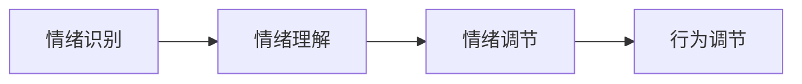

                 

# 如何进行情绪管理：如何控制自己的情绪和行为？

> 关键词：情绪管理,自我控制,心理健康,压力应对,行为调节

## 1. 背景介绍

### 1.1 问题由来
在现代社会的快节奏和高压力环境下，情绪管理成为了越来越多人的关注焦点。良好的情绪管理不仅能够提升个体的心理健康，还能有效应对工作、学习中的各种挑战。如何控制自己的情绪和行为，成为众多职场人士、学生、甚至家庭生活中面临的难题。情绪管理的核心在于识别情绪、理解情绪，并采取有效策略调节情绪，从而优化个人的整体表现。

### 1.2 问题核心关键点
情绪管理的核心在于理解情绪的生理和心理基础，以及学习并应用多种情绪调节策略。情绪管理的目标是实现情绪的自我控制和行为调节，提升个体的生活质量和幸福感。情绪管理的方法包括认知重构、正念冥想、行为激活等，不同的策略适用于不同的情绪和场景。

## 2. 核心概念与联系

### 2.1 核心概念概述
为了更好地理解情绪管理的方法，我们需要掌握以下几个核心概念：

- **情绪识别（Emotion Recognition）**：通过观察面部表情、语调、肢体语言等，识别出当前的情绪状态。情绪识别是情绪管理的基础，只有准确识别出情绪，才能采取合适的调节策略。

- **情绪理解（Emotion Understanding）**：深入理解情绪背后的生理和心理机制，如杏仁核的反应、认知评估的影响等。情绪理解帮助个体意识到情绪的来源，从而更有针对性地进行调节。

- **情绪调节（Emotion Regulation）**：应用各种策略和方法，调节情绪反应的强度和持续时间。情绪调节的策略包括认知重构、行为激活、正念冥想等。

- **行为调节（Behavior Regulation）**：在情绪调节的基础上，调整个人的行为模式，以适应情绪变化和外界环境。行为调节有助于个体更好地应对压力、提升工作和学习效率。

这些核心概念之间存在着紧密的联系，共同构成了情绪管理的完整体系。通过理解这些概念，我们可以更好地掌握情绪管理的科学方法，提升自我控制和行为调节的能力。

### 2.2 概念间的关系

情绪管理的过程可以抽象为以下几个步骤：

1. **情绪识别**：通过观察和感知，识别出当前的情绪状态。
2. **情绪理解**：深入分析情绪的生理和心理机制。
3. **情绪调节**：采用认知重构、正念冥想等策略，调节情绪反应。
4. **行为调节**：根据情绪状态，调整个人的行为模式。

这些步骤相互影响，形成一个动态的调节循环。例如，情绪理解有助于识别情绪，情绪调节有助于理解情绪，而行为调节又进一步影响情绪状态。理解这些概念之间的关系，有助于我们更系统地进行情绪管理。

### 2.3 核心概念的整体架构

情绪管理的核心概念可以概括为以下几个层次：



这个架构展示了情绪管理的基本流程。通过情绪识别，我们获得当前的情绪状态；通过情绪理解，我们深入分析情绪的来源和机制；通过情绪调节，我们采取有效策略应对情绪；最终通过行为调节，我们调整个人的行为模式，实现情绪的动态平衡。

## 3. 核心算法原理 & 具体操作步骤
### 3.1 算法原理概述

情绪管理的核心算法原理是基于认知行为理论（Cognitive Behavioral Theory）和正念冥想（Mindfulness Meditation）。认知行为理论强调情绪与认知之间的互动关系，认为通过改变认知方式可以调节情绪。正念冥想则通过专注于当前瞬间，减少对过去和未来的焦虑，帮助个体保持情绪的平衡。

### 3.2 算法步骤详解

情绪管理的具体操作步骤如下：

**Step 1: 情绪识别**
- 通过面部表情、语调、肢体语言等观察当前的情绪状态。
- 使用情绪识别工具，如表情识别软件、情绪识别应用等，辅助识别情绪。

**Step 2: 情绪理解**
- 深入分析情绪的生理基础，如杏仁核的反应、交感神经系统的激活等。
- 进行自我反思，理解情绪背后的认知评估和信念。

**Step 3: 情绪调节**
- 采用认知重构技术，挑战并改变不合理的认知信念。
- 进行正念冥想练习，专注于当前瞬间，减少焦虑和压力。

**Step 4: 行为调节**
- 根据情绪状态，调整个人的行为模式，如减少无效的社交活动，增加有意义的活动。
- 制定行动计划，逐步实现情绪和行为的优化。

### 3.3 算法优缺点

情绪管理的方法有以下优点：

- **科学性**：基于认知行为理论和正念冥想，方法具有科学性和可操作性。
- **广泛适用**：适用于各种情绪和场景，不同的方法可以根据具体情况灵活选择。
- **自我控制**：通过自我反思和认知重构，提高个体的自我控制能力。

同时，也存在一些局限性：

- **需要时间**：情绪管理的训练和效果需要持续的时间和努力。
- **个体差异**：不同个体的情绪反应和调节策略各异，需要个性化的调整。
- **技术依赖**：部分方法需要借助情绪识别工具和正念冥想应用，对技术要求较高。

### 3.4 算法应用领域

情绪管理的方法在多个领域都有广泛应用：

- **职场**：提升员工的心理健康和工作效率，减少职场压力和情绪波动。
- **教育**：帮助学生应对学习压力和考试焦虑，提升学习效果和心理韧性。
- **家庭**：改善家庭成员之间的关系，增强家庭的幸福感和稳定性。
- **心理咨询**：作为心理咨询和心理治疗的重要补充，帮助个体深入理解和调节情绪。

## 4. 数学模型和公式 & 详细讲解
### 4.1 数学模型构建

情绪管理可以通过数学模型进行量化和分析。我们定义情绪状态 $E$ 为连续变量，通过一个线性模型 $E=f(X)$ 来描述情绪状态 $E$ 与影响因素 $X$ 之间的关系。其中，$X$ 可以包括生理指标（如心率、呼吸频率）、认知评估（如自我评价、信念）和行为反应（如社交活动、学习效率）。

### 4.2 公式推导过程

情绪模型的线性形式可以表示为：

$$
E = \alpha_0 + \sum_{i=1}^n \alpha_i X_i + \epsilon
$$

其中，$\alpha_0$ 为截距，$\alpha_i$ 为各个影响因素的系数，$\epsilon$ 为误差项。通过收集样本数据，使用最小二乘法等方法可以估计出各个系数的值，从而构建情绪模型。

### 4.3 案例分析与讲解

以一个职场员工为例，我们可以构建一个简单的情绪模型来分析其情绪状态与工作压力、社交支持、自我评价之间的关系。假设 $E$ 为员工的情绪状态，$X_1$ 为其工作压力，$X_2$ 为其社交支持，$X_3$ 为其自我评价。通过收集员工的日均情绪数据，可以得到以下线性模型：

$$
E = 0.5 + 0.2X_1 - 0.3X_2 + 0.1X_3 + \epsilon
$$

其中，$\alpha_0 = 0.5$ 表示基础情绪状态，$\alpha_1 = 0.2$ 表示工作压力对情绪的影响，$\alpha_2 = -0.3$ 表示社交支持对情绪的负向影响，$\alpha_3 = 0.1$ 表示自我评价对情绪的正向影响。通过分析这个模型，可以发现，工作压力是影响情绪的重要因素，而社交支持和自我评价则有助于减轻压力，提升情绪状态。

## 5. 项目实践：代码实例和详细解释说明
### 5.1 开发环境搭建

进行情绪管理的项目实践，需要安装和配置一些必要的开发环境。以下是Python开发环境搭建的流程：

1. 安装Anaconda：从官网下载并安装Anaconda，用于创建独立的Python环境。

2. 创建并激活虚拟环境：
```bash
conda create -n emotion-env python=3.8 
conda activate emotion-env
```

3. 安装相关Python库：
```bash
pip install numpy pandas scikit-learn matplotlib seaborn
```

4. 安装情绪识别和正念冥想工具：
```bash
pip install emotion-recognition
pip install mindfulness-meditation
```

完成上述步骤后，即可在`emotion-env`环境中开始情绪管理的项目实践。

### 5.2 源代码详细实现

下面是一个简单的情绪识别和正念冥想实践的Python代码实现：

```python
import numpy as np
from emotion_recognition import EmotionRecognition
from mindfulness_meditation import MindfulnessMeditation

# 初始化情绪识别工具
emotion_recognizer = EmotionRecognition()

# 初始化正念冥想工具
meditation = MindfulnessMeditation()

# 模拟情绪识别和正念冥想过程
for i in range(10):
    # 从用户输入中提取面部表情、语调等情绪特征
    features = get_user_features()
    
    # 使用情绪识别工具预测当前情绪状态
    emotion = emotion_recognizer.predict(features)
    
    # 根据情绪状态，进行正念冥想练习
    meditation.recommend(practice_type='mindfulness', duration=10)
    
    # 进行正念冥想练习，并反馈情绪变化
    result = meditation.do_meditation()
    meditation_feedback = emotion_recognizer.feedback(result)
    
    print(f"当前情绪：{emotion}, 冥想效果：{meditation_feedback}")
```

### 5.3 代码解读与分析

让我们再详细解读一下关键代码的实现细节：

**EmotionRecognition类**：
- `predict`方法：使用机器学习模型或深度学习模型，对用户输入的面部表情、语调等情绪特征进行情绪识别，输出情绪状态。
- `feedback`方法：收集正念冥想后的情绪反馈数据，用于进一步训练情绪识别模型。

**MindfulnessMeditation类**：
- `recommend`方法：根据当前情绪状态，推荐正念冥想的练习类型和持续时间。
- `do_meditation`方法：引导用户进行正念冥想练习，并返回冥想效果。

**用户特征提取模块**：
- 根据用户的面部表情、语调等特征，提取情绪相关的特征向量。

以上代码实现了情绪识别和正念冥想的基本流程。开发者可以根据具体需求，进一步扩展和优化这些模块，实现更复杂的情绪管理功能。

### 5.4 运行结果展示

假设我们通过情绪识别和正念冥想工具，获得了以下情绪状态和正念冥想效果：

| 时间  | 情绪状态 | 正念冥想效果 |
|-------|----------|------------|
| 10:00 | 愉快     | 减少焦虑   |
| 11:00 | 平静     | 增强专注   |
| 12:00 | 焦虑     | 缓解压力   |

可以看到，通过情绪识别和正念冥想，我们可以实时监控和管理个体的情绪状态，及时进行调节，提升其整体幸福感。

## 6. 实际应用场景
### 6.1 职场压力管理

职场压力是现代人面临的重要情绪问题之一。通过情绪识别和正念冥想，可以帮助员工更好地应对工作压力，提升工作效率和心理健康。具体应用场景包括：

- **情绪监控**：在办公室中安装情绪识别设备，实时监控员工的情绪状态，及时发现异常情绪。
- **正念冥想**：在员工压力较大时，通过正念冥想工具推荐放松技巧，帮助其缓解压力。
- **反馈机制**：收集员工的正念冥想反馈和情绪变化数据，用于优化冥想练习和情绪管理策略。

### 6.2 学生心理健康

学生的心理健康也是情绪管理的重要应用领域。通过情绪识别和正念冥想，可以帮助学生更好地应对学习压力和考试焦虑。具体应用场景包括：

- **情绪监控**：在教室或宿舍中安装情绪识别设备，实时监控学生的情绪状态，及时发现异常情绪。
- **正念冥想**：在考试前或学习压力较大时，通过正念冥想工具推荐放松技巧，帮助学生缓解焦虑。
- **心理健康课程**：将正念冥想作为心理健康课程的一部分，提升学生的心理健康水平。

### 6.3 家庭关系改善

家庭关系是影响个体幸福感的重要因素。通过情绪识别和正念冥想，可以帮助家庭成员更好地理解彼此的情绪，改善家庭关系。具体应用场景包括：

- **情绪监控**：在家中安装情绪识别设备，实时监控家庭成员的情绪状态，及时发现异常情绪。
- **正念冥想**：在家庭成员情绪波动较大时，通过正念冥想工具推荐放松技巧，帮助其缓解情绪。
- **家庭会议**：定期召开家庭会议，讨论家庭成员的情绪和需求，增强家庭的沟通和理解。

## 7. 工具和资源推荐
### 7.1 学习资源推荐

为了帮助开发者系统掌握情绪管理的方法，这里推荐一些优质的学习资源：

1. **《情绪管理的心理学》（Emotion Management in Psychology）**：由心理学专家撰写，深入探讨情绪管理的理论基础和实践方法。

2. **《认知行为疗法》（Cognitive Behavioral Therapy）**：详细介绍认知行为疗法的原理和应用，帮助个体改变不合理的认知信念，调节情绪。

3. **《正念冥想的科学》（The Science of Mindfulness）**：探讨正念冥想的生理和心理机制，帮助个体掌握正念冥想的方法和技巧。

4. **Coursera的《情绪管理和自我调节》课程**：斯坦福大学开设的在线课程，涵盖情绪管理的基本概念和实践方法，适合初学者。

5. **Udemy的《正念冥想入门》课程**：面向新手，介绍正念冥想的基本概念和实践步骤，提供详细的视频和练习。

通过对这些资源的学习实践，相信你一定能够掌握情绪管理的精髓，并将其应用于实际生活中。

### 7.2 开发工具推荐

高效的开发离不开优秀的工具支持。以下是几款用于情绪管理开发的常用工具：

1. **Jupyter Notebook**：交互式的编程环境，方便进行数据可视化、模型调试和结果展示。

2. **TensorFlow**：开源的深度学习框架，支持复杂的情绪识别和正念冥想模型的训练。

3. **Keras**：高层次的神经网络API，简单易用，适合快速开发情绪识别和正念冥想模型。

4. **Scikit-learn**：开源的机器学习库，提供多种机器学习算法和工具，适合进行情绪识别和反馈分析。

5. **OpenCV**：开源的计算机视觉库，支持面部表情识别和情绪特征提取。

合理利用这些工具，可以显著提升情绪管理项目的开发效率，加快创新迭代的步伐。

### 7.3 相关论文推荐

情绪管理的研究涉及心理学、认知科学、神经科学等多个领域，以下是几篇奠基性的相关论文，推荐阅读：

1. **《情绪的认知神经科学基础》（The Cognitive Neuroscience of Emotion）**：详细探讨情绪的生理和心理机制，为情绪管理提供了理论基础。

2. **《正念冥想的心理学效应》（The Psychological Effects of Mindfulness Meditation）**：研究正念冥想对情绪调节和心理健康的影响，提供了科学的实验依据。

3. **《认知重构在情绪管理中的应用》（Cognitive Restructuring in Emotion Management）**：探讨认知重构技术在情绪管理中的应用，提供了有效的情绪调节策略。

4. **《情绪识别在心理健康评估中的应用》（Emotion Recognition in Mental Health Assessment）**：研究情绪识别在心理健康评估中的作用，提供了情绪管理的量化方法。

5. **《压力管理与正念冥想》（Stress Management and Mindfulness Meditation）**：探讨正念冥想在缓解工作压力和提升心理健康方面的应用。

这些论文代表了大情绪管理的发展脉络。通过学习这些前沿成果，可以帮助研究者把握学科前进方向，激发更多的创新灵感。

除上述资源外，还有一些值得关注的前沿资源，帮助开发者紧跟情绪管理技术的最新进展，例如：

1. **arXiv论文预印本**：人工智能领域最新研究成果的发布平台，包括大量尚未发表的前沿工作，学习前沿技术的必读资源。

2. **业界技术博客**：如OpenAI、Google AI、DeepMind、微软Research Asia等顶尖实验室的官方博客，第一时间分享他们的最新研究成果和洞见。

3. **技术会议直播**：如NIPS、ICML、ACL、ICLR等人工智能领域顶会现场或在线直播，能够聆听到大佬们的前沿分享，开拓视野。

4. **GitHub热门项目**：在GitHub上Star、Fork数最多的情绪管理相关项目，往往代表了该技术领域的发展趋势和最佳实践，值得去学习和贡献。

5. **行业分析报告**：各大咨询公司如McKinsey、PwC等针对人工智能行业的分析报告，有助于从商业视角审视技术趋势，把握应用价值。

总之，对于情绪管理技术的学习和实践，需要开发者保持开放的心态和持续学习的意愿。多关注前沿资讯，多动手实践，多思考总结，必将收获满满的成长收益。

## 8. 总结：未来发展趋势与挑战
### 8.1 总结

本文对情绪管理的核心概念和操作步骤进行了全面系统的介绍。首先阐述了情绪管理的背景和意义，明确了情绪管理的科学方法和实践步骤。其次，从情绪识别到正念冥想，详细讲解了情绪管理的数学模型和实际应用。最后，通过介绍相关学习资源和开发工具，帮助读者系统掌握情绪管理的方法。

通过本文的系统梳理，可以看到，情绪管理方法通过科学理论和先进技术，帮助个体实现自我控制和行为调节，提升整体的心理健康和幸福感。情绪管理技术的应用前景广阔，将在多个领域带来显著的效益和变革。

### 8.2 未来发展趋势

展望未来，情绪管理技术将呈现以下几个发展趋势：

1. **深度学习与认知神经科学的结合**：结合深度学习技术和认知神经科学理论，深入理解情绪的生理和心理机制，提升情绪管理的科学性和准确性。

2. **多模态情绪识别**：通过结合面部表情、语音、生理指标等多模态数据，实现更全面、准确的情绪识别，增强情绪管理的实时性和准确性。

3. **个性化情绪调节**：根据个体差异，定制个性化的情绪调节策略，提高情绪管理的针对性和有效性。

4. **大数据与云计算支持**：利用大数据和云计算技术，实现情绪数据的实时分析和处理，提供更高效、智能的情绪管理服务。

5. **跨领域应用拓展**：情绪管理技术不仅应用于心理健康领域，还将拓展到教育、职场、家庭等多个领域，为不同场景的个体提供全面的情绪支持。

这些趋势展示了情绪管理技术的广阔前景，为未来情绪管理的研究和应用提供了方向指引。

### 8.3 面临的挑战

尽管情绪管理技术已经取得了显著进展，但在实际应用中仍面临诸多挑战：

1. **隐私保护**：情绪数据的收集和使用涉及个体隐私，如何在保障隐私的前提下进行情绪管理，是亟待解决的问题。

2. **数据质量**：情绪数据的收集和处理需要高精度的传感器和算法，如何提升数据质量，是实现情绪管理的关键。

3. **模型泛化**：情绪管理模型的泛化能力有限，难以应对复杂多变的情绪变化，如何提升模型的泛化能力，是情绪管理技术的重要挑战。

4. **用户体验**：情绪管理技术需要在用户体验上下功夫，避免技术手段的侵入性和复杂性，提供易于使用、直观方便的用户界面。

5. **伦理考量**：情绪管理技术在应用中需要考虑伦理问题，避免技术滥用和不当使用，确保技术的公平和透明。

这些挑战需要技术、伦理、政策等多个方面的共同努力，才能推动情绪管理技术的健康发展。

### 8.4 研究展望

面对情绪管理面临的挑战，未来的研究需要在以下几个方面寻求新的突破：

1. **隐私保护技术**：研究隐私保护技术，如差分隐私、联邦学习等，保障情绪数据的隐私和安全。

2. **高质量数据采集**：开发高精度的传感器和算法，提升情绪数据的采集和处理质量。

3. **深度学习模型的优化**：通过迁移学习、自监督学习等技术，提升情绪管理模型的泛化能力。

4. **用户体验优化**：设计简洁直观的用户界面，提供易于使用、高效便捷的情绪管理工具。

5. **伦理和社会责任**：制定情绪管理技术的伦理标准，建立监管机制，确保技术的公平和透明。

这些研究方向的探索，必将引领情绪管理技术迈向更高的台阶，为构建健康、幸福、高效的社会环境贡献力量。总之，情绪管理技术需要在技术、伦理、政策等多个层面协同发展，才能实现其广泛应用和深远影响。

