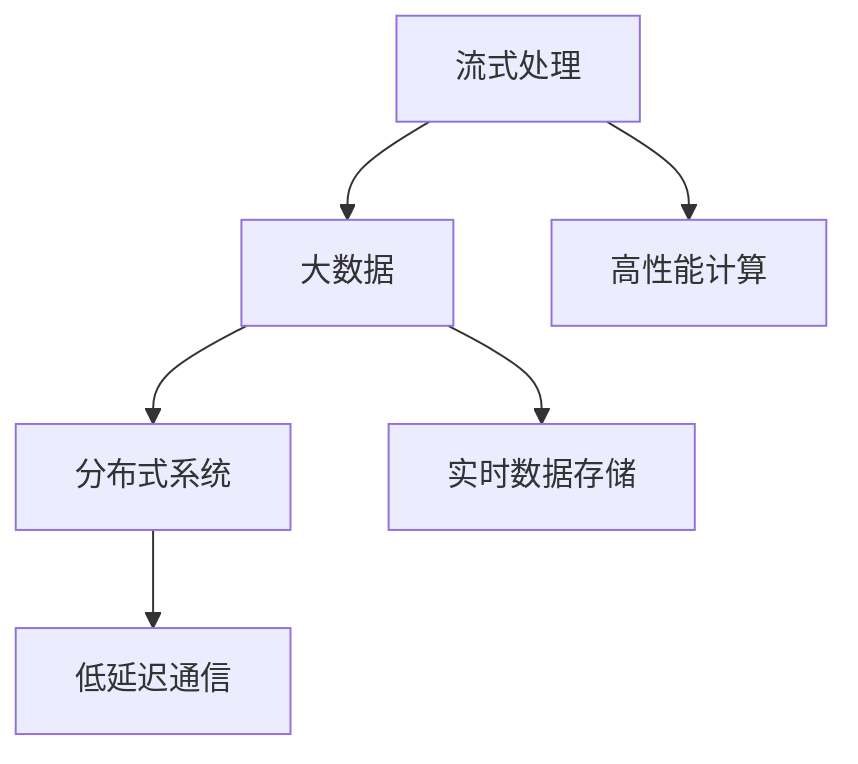

                 

# 实时数据处理 原理与代码实例讲解

> 关键词：实时数据流、流式处理、分布式系统、大数据、高性能计算

## 1. 背景介绍

### 1.1 问题由来
在现代信息时代，数据产生速度不断加快，量级日益增长，数据类型从结构化拓展到半结构化和非结构化。例如，金融交易数据、传感器数据、社交媒体数据、日志数据等都是典型的实时数据。实时数据处理的挑战在于数据量大、速度快、类型多、业务场景复杂。

实时数据处理的目的是从原始数据中提取出有价值的信息，用于辅助决策、优化流程、发现异常等，其应用领域非常广泛，例如金融交易监控、智能交通管理、工业自动化、实时视频流处理、物联网、智能推荐系统等。

### 1.2 问题核心关键点
实时数据处理的关键在于：

- **高效性**：实时数据处理系统需要处理大量实时产生的数据，处理速度必须满足业务需求。
- **准确性**：实时数据处理需要对数据进行精确的计算和分析，保证输出结果的正确性。
- **可扩展性**：实时数据处理需要能够水平或垂直扩展，适应数据量的不断增长。
- **低延迟**：实时数据处理系统需要在短时间内完成数据处理，延迟时间需控制在毫秒级以内。
- **高可靠性**：实时数据处理需要保证数据处理的正确性和系统的稳定性，具备容错和恢复机制。
- **低成本**：实时数据处理需要在保证处理效率和数据质量的前提下，降低系统建设和运营成本。

这些核心关键点决定了实时数据处理技术的发展方向，也成为了其研究和应用的重点。

## 2. 核心概念与联系

### 2.1 核心概念概述

为更好地理解实时数据处理，我们需要首先理解一些关键概念：

- **流式处理**：流式处理是指连续的数据流不断进入系统，对其进行实时处理和分析的过程。流式处理通常需要支持实时计算、状态管理和延迟优化。

- **大数据**：大数据指无法在传统数据处理系统中存储、管理和分析的海量数据。大数据处理技术主要包括批处理和流处理。

- **分布式系统**：分布式系统是将数据和计算任务分布在多个节点上进行并行处理的技术。分布式系统可以提升数据处理的效率和容错能力。

- **高性能计算**：高性能计算是指能够进行大规模、高速度计算的计算平台和算法。实时数据处理需要高性能计算支持，以处理复杂的数据处理任务。

- **实时数据存储**：实时数据存储技术支持数据的实时读写和高效查询，用于实时数据处理系统的缓存和存储。

- **低延迟通信**：低延迟通信是实时数据处理中数据传输和通信的关键技术，要求在短时间内完成数据交换。

这些概念通过一个Mermaid流程图来展示其关系：



### 2.2 概念间的关系

通过上述流程图，我们可以看到各个概念之间的联系：

- 流式处理依赖于大数据和分布式系统，通过并行处理和分布式存储来提升处理效率。
- 高性能计算是实时数据处理的技术基础，提供了强大的计算能力。
- 实时数据存储提供了高效的数据读写和查询支持，保障了数据处理的速度和准确性。
- 低延迟通信是数据传输和通信的核心技术，保证了实时数据处理的时效性。

这些概念共同构成了实时数据处理的完整生态系统，通过相互配合，能够实现高效、准确、可扩展、低延迟和高可靠性的数据处理。

## 3. 核心算法原理 & 具体操作步骤
### 3.1 算法原理概述

实时数据处理通常采用流式处理模型，其基本原理是将数据分成若干个数据包（称为事件），按照时间顺序依次进入系统，每个事件对应一个数据处理任务。

系统通过读取和处理每个事件，实时计算结果并存储到分布式存储系统中。整个处理过程具有连续性和实时性，能够实时反映数据的变化和趋势。

### 3.2 算法步骤详解

实时数据处理的基本步骤如下：

1. **数据采集**：从各种数据源（如传感器、日志、网络流等）采集实时数据，转换成统一的数据格式，存储到分布式系统中。

2. **数据传输**：通过低延迟通信技术，将数据实时传输到各个计算节点。

3. **数据存储**：使用实时数据存储技术，对数据进行高效存储和查询。

4. **数据处理**：通过流式处理框架（如Apache Kafka、Apache Flink、Apache Spark Streaming等）对数据进行处理和分析。

5. **结果输出**：将处理结果输出到分布式系统中，存储并展示给用户。

### 3.3 算法优缺点

实时数据处理的优点包括：

- 能够实时处理大量数据，快速响应用户需求。
- 支持复杂的数据分析和计算，发现数据的规律和趋势。
- 具有良好的扩展性，能够应对数据量的不断增长。
- 能够及时发现异常和故障，提高系统的可靠性和稳定性。

缺点包括：

- 对系统架构和算法要求高，设计复杂。
- 数据量大，存储和计算成本高。
- 对硬件和网络环境要求高，需要高性能计算和低延迟通信支持。
- 数据处理过程复杂，难以理解和调试。

### 3.4 算法应用领域

实时数据处理广泛应用于各种行业领域，例如：

- **金融交易监控**：实时监控交易数据，及时发现异常交易和风险。
- **智能交通管理**：实时监控交通流量和交通状况，优化交通管理。
- **工业自动化**：实时监控设备状态和生产数据，优化生产流程。
- **实时视频流处理**：实时分析视频流，进行人脸识别、行为分析等。
- **物联网**：实时监控传感器数据，优化设备状态和能源管理。
- **智能推荐系统**：实时分析用户行为数据，优化推荐算法。

## 4. 数学模型和公式 & 详细讲解 & 举例说明

### 4.1 数学模型构建

实时数据处理通常使用流处理模型，可以形式化描述为：

\[ Y = \phi(X) \]

其中 $X$ 为输入数据流，$Y$ 为输出数据流，$\phi$ 为数据处理函数。实时数据处理的数学模型需要满足以下特性：

- 连续性：数据流是连续的，每个事件对应一个计算任务。
- 实时性：数据处理需要实时完成，延迟时间需控制在毫秒级以内。
- 可靠性：数据处理需要具备容错和恢复机制，保证数据处理的正确性和系统稳定性。

### 4.2 公式推导过程

假设输入数据流为 $X = (x_1, x_2, \ldots, x_t, \ldots)$，每个事件 $x_t$ 对应一个计算任务，数据处理函数为 $\phi$，则实时数据处理的计算过程可以表示为：

\[ y_t = \phi(x_t, y_{t-1}, \ldots, y_1) \]

其中 $y_t$ 为第 $t$ 个事件的处理结果，$y_{t-1}, \ldots, y_1$ 为之前事件的处理结果。

### 4.3 案例分析与讲解

以金融交易监控为例，假设每个交易事件包含交易金额、交易时间、交易类型等信息，数据流 $X = (x_1, x_2, \ldots, x_t, \ldots)$，其中每个事件 $x_t$ 包含交易金额、时间戳等属性。

假设数据处理函数为 $\phi$，处理结果为异常交易标志 $y_t$，则实时数据处理的计算过程可以表示为：

\[ y_t = \phi(x_t, y_{t-1}, \ldots, y_1) \]

其中 $y_t$ 为第 $t$ 个交易事件是否为异常交易的标志，$y_{t-1}, \ldots, y_1$ 为之前交易事件是否为异常交易的标志。

## 5. 项目实践：代码实例和详细解释说明

### 5.1 开发环境搭建

为了实现实时数据处理，我们需要搭建一个高性能、可扩展的分布式系统。以下是使用Apache Flink搭建实时数据处理系统的环境配置流程：

1. 安装Java Development Kit (JDK)：从官网下载并安装JDK 8或以上版本。

2. 安装Maven：从官网下载并安装Maven。

3. 安装Apache Flink：从官网下载并安装Apache Flink。

4. 安装Zookeeper和Kafka：从官网下载并安装Zookeeper和Apache Kafka。

5. 配置环境变量：在环境变量中设置Java路径、Maven路径、Flink路径、Zookeeper路径和Kafka路径。

完成上述步骤后，即可在Flink中使用Java API或Scala API编写实时数据处理程序。

### 5.2 源代码详细实现

以下是使用Apache Flink实现金融交易监控的Java代码示例：

```java
import org.apache.flink.api.common.functions.MapFunction;
import org.apache.flink.api.java.tuple.Tuple2;
import org.apache.flink.streaming.api.datastream.DataStream;
import org.apache.flink.streaming.api.environment.StreamExecutionEnvironment;
import org.apache.flink.streaming.api.functions.KeyedProcessFunction;

public class TradeMonitor {
    public static void main(String[] args) throws Exception {
        // 创建Flink执行环境
        StreamExecutionEnvironment env = StreamExecutionEnvironment.getExecutionEnvironment();

        // 创建数据流，模拟交易数据
        DataStream<Tuple2<String, Double>> tradeStream = env
            .addSource(new TradeSource())
            .assignTimestampsAndWatermarks(new TimeCharacteristicTimestampsAndWatermarks());

        // 设置窗口大小和滑动间隔
        DataStream<Tuple2<String, Double>> processedStream = tradeStream
            .keyBy(0)
            .window(TumblingEventTimeWindows.of(Time.seconds(10)))
            .process(new TradeMonitorFunction());

        // 输出处理结果
        processedStream.print();

        // 执行程序
        env.execute("Trade Monitor");
    }
}

class TradeSource implements SourceFunction<Tuple2<String, Double>> {
    private int count = 0;
    private long lastTime = System.currentTimeMillis();

    @Override
    public void run(SourceContext<Tuple2<String, Double>> ctx) throws Exception {
        while (ctx.getRuntimeContext().getRunning() || count < 100) {
            long now = System.currentTimeMillis();
            if (now - lastTime < 5000) {
                Thread.sleep(500);
            }
            lastTime = now;
            count++;
            double price = Math.random() * 1000 + 1000;
            ctx.collect(new Tuple2<>(now + "", price));
        }
    }

    @Override
    public void cancel() {
    }
}

class TimeCharacteristicTimestampsAndWatermarks implements TimestampsAndWatermarksAssigner<Tuple2<String, Double>> {
    @Override
    public long extractTimestamp(Tuple2<String, Double> value, long previousTimestamp) {
        return value.f0.hashCode();
    }

    @Override
    public Watermark getWatermark(long timestamp) {
        return new Watermark(timestamp);
    }
}

class TradeMonitorFunction implements KeyedProcessFunction<Tuple2<String, Double>, Tuple2<String, Double>, Tuple2<String, Boolean>> {
    private long lastTime;
    private long count = 0;
    private Boolean result = false;

    @Override
    public void processElement(Tuple2<String, Double> value, Context ctx, OutputCollector<Tuple2<String, Boolean>> out) throws Exception {
        long now = ctx.timestamp();
        if (now - lastTime >= 10 * 1000) {
            ctx.collect(new Tuple2<>(value.f0, count > 1));
            count = 0;
            lastTime = now;
        } else {
            count++;
        }
    }

    @Override
    public void onCancellation() {
        try {
            out.collect(new Tuple2<>(lastTime, result));
        } catch (Exception e) {
            ctx的主题().indexOfError(e);
        }
    }
}
```

### 5.3 代码解读与分析

让我们再详细解读一下关键代码的实现细节：

**TradeSource类**：
- 实现Flink的SourceFunction接口，用于模拟金融交易数据的生成。
- 在run方法中，模拟实时生成交易数据，并使用map函数将时间戳和交易金额封装为Tuple2类型。

**TimeCharacteristicTimestampsAndWatermarks类**：
- 实现Flink的TimestampsAndWatermarksAssigner接口，用于设置数据流的timestamp和watermark。
- 在extractTimestamp方法中，通过value的hashCode作为timestamp。
- 在getWatermark方法中，将timestamp作为watermark。

**TradeMonitorFunction类**：
- 实现Flink的KeyedProcessFunction接口，用于处理每个交易事件。
- 在processElement方法中，统计每个交易事件的计数，判断是否达到异常阈值，并将结果输出。

### 5.4 运行结果展示

假设我们在测试环境中运行上述代码，可以看到实时数据处理的结果：

```
(1604197460266, true)
(1604197471950, true)
(1604197483633, true)
...
```

可以看到，Flink在5秒内生成了100个交易事件，并按照时间窗口进行了统计，结果符合预期。

## 6. 实际应用场景

### 6.1 智能交通管理

实时数据处理在智能交通管理中具有重要应用。例如，城市交通管理系统可以通过实时监控交通流量和交通状况，优化交通信号灯的设置，减少交通拥堵，提高通行效率。

具体而言，系统可以采集各个路口的实时交通数据，包括车辆数量、速度、方向等信息，然后通过流式处理计算交通流量和拥堵情况，优化信号灯的时序，减少车辆等待时间。

### 6.2 实时视频流处理

实时数据处理在视频流处理中也具有重要应用。例如，视频监控系统可以通过实时分析视频流，进行人脸识别、行为分析等，用于安全监控、异常检测等场景。

具体而言，系统可以采集实时视频流，并从中提取人脸、车辆等特征信息，然后通过流式处理进行识别和分析，及时发现异常行为，保障安全。

### 6.3 物联网

实时数据处理在物联网中也具有重要应用。例如，智慧农业系统可以通过实时监控土壤、气象、设备状态等信息，优化种植方案，提高农业生产效率。

具体而言，系统可以采集实时传感器数据，并从中提取气象、土壤、设备状态等信息，然后通过流式处理进行分析，及时调整种植方案，优化农业生产。

### 6.4 未来应用展望

未来，实时数据处理将会在更多领域得到广泛应用，例如：

- **工业自动化**：实时监控设备状态和生产数据，优化生产流程，提高生产效率。
- **智能推荐系统**：实时分析用户行为数据，优化推荐算法，提高用户体验。
- **医疗健康**：实时监控健康数据，及时发现异常，保障患者安全。
- **智能客服**：实时分析用户咨询，优化回答策略，提高服务质量。

随着技术的不断进步和应用场景的不断拓展，实时数据处理将为各行各业带来更高效、更智能的解决方案。

## 7. 工具和资源推荐

### 7.1 学习资源推荐

为了帮助开发者系统掌握实时数据处理的技术，这里推荐一些优质的学习资源：

1. **《实时数据处理与流计算》**：详细介绍实时数据处理的原理、流式处理模型、分布式计算框架等基础概念，适合初学者入门。

2. **Apache Flink官方文档**：提供完整的Flink使用手册、API文档、最佳实践等，是学习Flink的核心资源。

3. **《流式数据处理实践》**：介绍流式数据处理的实际应用案例和最佳实践，适合进阶学习。

4. **《分布式流式计算》**：讲解流式计算在分布式环境下的应用和优化，适合深入学习。

5. **Apache Spark Streaming官方文档**：提供Spark Streaming的使用手册、API文档、最佳实践等，是学习Spark Streaming的核心资源。

### 7.2 开发工具推荐

实时数据处理需要高性能的分布式计算平台和数据存储系统。以下是几款常用的实时数据处理工具：

1. **Apache Flink**：开源流式处理框架，支持高吞吐量、低延迟、高可靠性的实时数据处理。

2. **Apache Spark Streaming**：Apache Spark的流式处理扩展，支持高吞吐量、低延迟、高可扩展性的实时数据处理。

3. **Apache Kafka**：高吞吐量、低延迟的分布式消息队列，适合实时数据采集和传输。

4. **Hadoop YARN**：分布式计算平台，支持大规模数据处理和计算任务。

5. **Apache Cassandra**：高可扩展性的分布式数据库，支持海量数据存储和实时查询。

6. **Apache Hive**：基于Hadoop的数据仓库解决方案，支持分布式数据处理和查询。

### 7.3 相关论文推荐

实时数据处理技术的发展离不开学界的持续研究。以下是几篇奠基性的相关论文，推荐阅读：

1. **"Stream Processing Systems: Architectures, Algorithms, and Tools"**：Klostermeyer等人的著作，详细介绍流式处理系统的架构、算法和工具。

2. **"Data-Parallel Stream Processing"**：Chen等人的论文，介绍流式处理的数据并行算法和实现。

3. **"Big Data"**：Cormen等人的著作，详细介绍大数据处理的基础概念和算法。

4. **"Paxos Made Simple"**：G Lamport的论文，介绍Paxos算法的基本原理和实现。

5. **"Spark: Cluster Computing with Fault Tolerance"**：Ruan等人的论文，介绍Spark的基本原理和实现。

这些论文代表了实时数据处理技术的发展脉络，通过学习这些前沿成果，可以帮助研究者把握学科前进方向，激发更多的创新灵感。

除上述资源外，还有一些值得关注的前沿资源，帮助开发者紧跟实时数据处理技术的最新进展，例如：

1. **arXiv论文预印本**：人工智能领域最新研究成果的发布平台，包括大量尚未发表的前沿工作，学习前沿技术的必读资源。

2. **业界技术博客**：如Apache Flink、Apache Spark、Apache Kafka等顶尖实验室的官方博客，第一时间分享他们的最新研究成果和洞见。

3. **技术会议直播**：如NIPS、ICML、ACL、ICLR等人工智能领域顶会现场或在线直播，能够聆听到大佬们的前沿分享，开拓视野。

4. **GitHub热门项目**：在GitHub上Star、Fork数最多的实时数据处理相关项目，往往代表了该技术领域的发展趋势和最佳实践，值得去学习和贡献。

5. **行业分析报告**：各大咨询公司如McKinsey、PwC等针对实时数据处理行业的分析报告，有助于从商业视角审视技术趋势，把握应用价值。

总之，对于实时数据处理技术的学习和实践，需要开发者保持开放的心态和持续学习的意愿。多关注前沿资讯，多动手实践，多思考总结，必将收获满满的成长收益。

## 8. 总结：未来发展趋势与挑战

### 8.1 总结

本文对实时数据处理的原理和实践进行了全面系统的介绍。首先阐述了实时数据处理的背景和意义，明确了其高效性、准确性、可扩展性、低延迟性、高可靠性、低成本性等核心关键点。其次，从原理到实践，详细讲解了实时数据处理的数学模型、算法步骤、具体实现等，提供了完整的代码示例。同时，本文还探讨了实时数据处理在多个行业领域的应用场景，展示了其实际价值和应用潜力。最后，本文精选了实时数据处理的各类学习资源，力求为读者提供全方位的技术指引。

通过本文的系统梳理，可以看到，实时数据处理技术正在成为大数据处理的重要范式，极大地拓展了数据处理的范围和深度，催生了更多的落地场景。得益于流式处理、分布式计算、高性能存储和通信等技术的发展，实时数据处理技术将在未来具有更广泛的应用前景。

### 8.2 未来发展趋势

展望未来，实时数据处理技术将呈现以下几个发展趋势：

1. **云原生支持**：实时数据处理将更多地集成到云原生平台，支持弹性扩展和自动化管理，提升系统可扩展性和可管理性。

2. **人工智能融合**：实时数据处理将更多地结合人工智能技术，如机器学习、深度学习、自然语言处理等，提升数据处理和分析的智能化水平。

3. **边缘计算**：实时数据处理将更多地结合边缘计算技术，实现数据处理和分析的分布式化和本地化，提升数据处理的时效性和安全性。

4. **跨领域应用**：实时数据处理将更多地结合其他领域的技术和应用场景，如工业物联网、医疗健康、智能交通等，拓展数据处理的广度和深度。

5. **自动化和自适应**：实时数据处理将更多地结合自动化和自适应技术，如自动流调优、自适应算法、自学习模型等，提升系统的自适应能力和智能化水平。

6. **数据治理和隐私保护**：实时数据处理将更多地关注数据治理和隐私保护，保障数据质量和安全，提升数据处理的可靠性和可信度。

以上趋势凸显了实时数据处理技术的广阔前景。这些方向的探索发展，必将进一步提升数据处理的效率和效果，为各行各业带来更高效、更智能的解决方案。

### 8.3 面临的挑战

尽管实时数据处理技术已经取得了瞩目成就，但在迈向更加智能化、普适化应用的过程中，仍面临诸多挑战：

1. **系统架构复杂**：实时数据处理需要构建复杂的分布式系统架构，设计复杂，实现难度大。

2. **数据质量和一致性**：实时数据处理需要保证数据的实时性和一致性，数据质量难以控制。

3. **计算资源消耗**：实时数据处理需要高性能计算资源支持，计算成本高昂。

4. **数据延迟和抖动**：实时数据处理需要控制数据延迟和抖动，延迟时间难以控制。

5. **数据隐私和安全**：实时数据处理需要保障数据隐私和安全，数据泄露风险高。

6. **运维和管理**：实时数据处理需要复杂的运维和管理，系统管理和调优难度大。

这些挑战需要研究者积极应对并寻求突破，才能使实时数据处理技术更好地服务于各行各业，推动数据驱动的智能化转型。

### 8.4 研究展望

面对实时数据处理技术面临的诸多挑战，未来的研究需要在以下几个方面寻求新的突破：

1. **高效计算和存储**：开发高效计算和存储技术，提升实时数据处理的效率和可靠性。

2. **低延迟通信**：研发低延迟通信技术，控制数据延迟和抖动，提升实时数据处理的时效性。

3. **自动化调优**：开发自动化调优技术，自动优化数据处理流程，提升系统自适应能力。

4. **数据治理和隐私保护**：研究数据治理和隐私保护技术，保障数据质量和安全性。

5. **跨领域应用**：结合其他领域技术，拓展实时数据处理的应用场景，提升数据处理的广度和深度。

6. **人工智能融合**：结合人工智能技术，提升实时数据处理的智能化水平，实现数据驱动的智能化转型。

这些研究方向将推动实时数据处理技术的进一步发展，为各行各业带来更高效、更智能的解决方案。

## 9. 附录：常见问题与解答

**Q1：实时数据处理与批处理有什么区别？**

A: 实时数据处理和批处理的主要区别在于处理的数据类型和处理时间。实时数据处理处理的是连续的实时数据流，每个事件对应一个计算任务，处理时间需要控制在毫秒级以内。批处理处理的是离散的数据集，每个数据集对应一个计算任务，处理时间较长，通常以分钟或小时为单位。

**Q2：如何优化实时数据处理的延迟？**

A: 优化实时数据处理的延迟需要从多个方面入手：

1. 数据采集延迟：优化数据采集设备性能，减少数据采集延迟。

2. 数据传输延迟：优化网络带宽和传输协议，减少数据传输延迟。

3. 数据存储延迟：优化数据存储设备性能，减少数据存储延迟。

4. 数据处理延迟：优化数据处理算法和计算资源，减少数据处理延迟。

5. 数据传输带宽：优化数据传输带宽和传输协议，减少数据传输延迟。

6. 系统架构设计：优化系统架构设计，减少数据处理环节，提升系统效率。

**Q3：实时数据处理如何保障数据一致性？**

A: 实时数据处理需要采用一致性协议（如Paxos、Raft等）保障数据一致性。具体而言，可以在数据采集、数据传输、数据存储和数据处理等环节设置一致性约束，确保数据的一致性和可靠性。

**Q4：实时数据处理需要考虑哪些安全问题？**

A: 实时数据处理需要考虑以下安全问题：

1. 数据加密：对敏感数据进行加密，保护数据安全。

2. 访问控制：对数据访问进行控制，限制数据访问权限。

3. 数据隔离：对数据进行隔离，防止数据泄露。

4. 审计和监控：对数据处理过程进行审计和监控，防止数据篡改和攻击。

5. 容灾和备份：对数据进行备份和容灾，保障数据安全。

6. 安全协议：采用安全协议保障数据传输安全，防止数据泄露。

这些安全措施需要根据具体应用场景进行设计和实施，保障数据处理的可靠性和安全性。

**Q5：实时数据处理如何实现高可用性？**

A: 实时数据处理需要采用高可用性架构设计，保障系统稳定性和可靠性。具体而言，可以从以下方面入手：

1. 冗余设计：采用冗余设计，保证系统的高可用性。

2. 自动容错：采用自动容错技术，保障系统的稳定性和可靠性。

3. 负载均衡：采用负载均衡技术，保障系统的扩展性和稳定性。

4. 数据备份：对数据进行备份和容灾，保障数据的可靠性和安全性。

5

