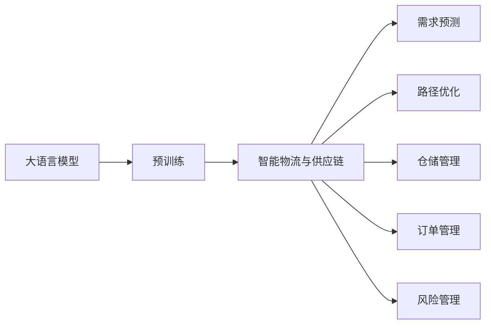
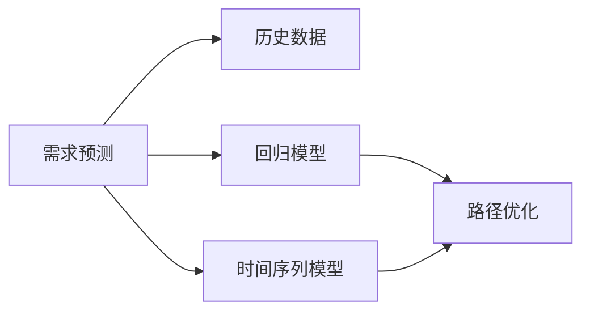
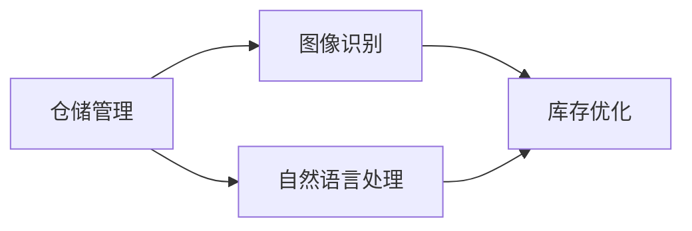
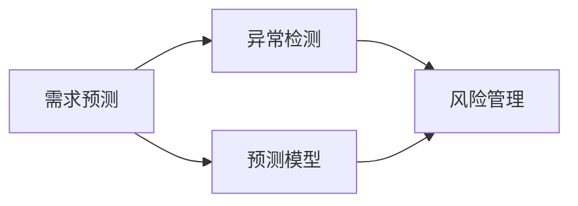
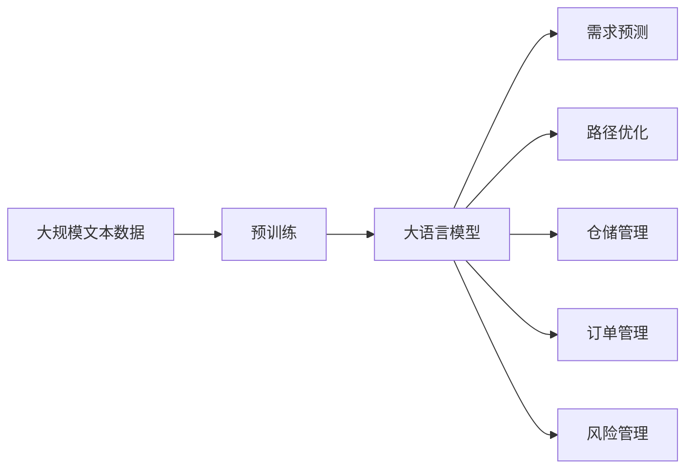

                 

# 应用AI大模型来优化智能物流与供应链管理

> 关键词：人工智能大模型, 智能物流, 供应链管理, 优化算法, 预测模型, 决策支持, 算法案例, 系统集成

## 1. 背景介绍

### 1.1 问题由来

随着全球经济的快速发展和电子商务的兴起，智能物流与供应链管理已经成为企业提高效率、降低成本、增强竞争力的重要手段。传统的物流与供应链管理依赖于人工决策和经验积累，效率低、成本高，难以应对市场变化。近年来，随着人工智能（AI）技术的进步，大语言模型（LLM）、机器学习（ML）等AI技术被广泛应用于智能物流与供应链管理领域，显著提高了物流与供应链的智能化水平。

智能物流与供应链管理的主要目标包括：
- 提高物流效率：通过优化路线、仓储、运输等环节，实现货物快速、低成本的流通。
- 降低库存成本：通过需求预测、库存管理等手段，减少库存积压和资金占用。
- 提升服务质量：通过智能客服、订单跟踪等系统，提供更高效、更准确的客户服务。
- 增强风险管理：通过实时监控、数据分析等手段，及时发现并应对供应链风险。

然而，物流与供应链系统复杂度极高，涉及物流网络、仓储管理、需求预测、运输优化等多个环节，单一的AI技术难以全面应对。因此，结合大语言模型与机器学习等AI技术，综合应用各种优化算法，构建智能化的物流与供应链系统，成为当前的迫切需求。

### 1.2 问题核心关键点

大语言模型和机器学习在智能物流与供应链管理中的应用主要体现在以下几个方面：
- 需求预测：通过时间序列分析、回归模型等机器学习算法，对市场需求进行预测。
- 路径优化：利用最优化算法，确定最优物流路径和运输计划。
- 仓储管理：通过图像识别、自然语言处理等技术，优化仓储作业流程。
- 订单管理：利用自然语言理解和知识图谱，实现智能客服和订单处理。
- 风险管理：通过异常检测、预测模型等技术，及时发现并应对供应链风险。

大语言模型和机器学习在智能物流与供应链管理中的应用，显著提高了系统的智能化水平和决策效率，帮助企业实现成本优化和效率提升。但同时，这些技术也面临一些挑战，如数据质量、算法鲁棒性、模型可解释性等，需要进一步研究与探索。

### 1.3 问题研究意义

智能物流与供应链管理领域的大语言模型和机器学习应用，具有重要意义：
- 降低运营成本：通过智能化决策和自动化作业，大幅降低人工操作和物流成本。
- 提升服务质量：通过实时监控和智能客服，提供更高效、更准确的客户服务。
- 增强风险控制：通过数据分析和异常检测，及时发现并应对供应链风险，保障供应链安全。
- 支持业务决策：通过优化算法和决策模型，提供数据驱动的决策支持，助力企业业务转型。
- 加速技术落地：通过构建智能物流与供应链系统，推动AI技术在传统行业的广泛应用。

## 2. 核心概念与联系

### 2.1 核心概念概述

本节将介绍几个密切相关的核心概念，以便更好地理解AI大模型在智能物流与供应链管理中的应用。

- **大语言模型（Large Language Models, LLMs）**：以自回归（如GPT）或自编码（如BERT）模型为代表的深度学习模型，通过在大规模无标签文本数据上进行预训练，学习通用的语言表示，具备强大的自然语言理解和生成能力。
- **机器学习（Machine Learning, ML）**：利用数据和算法，通过学习模型进行预测和决策，广泛应用于数据挖掘、图像识别、自然语言处理等领域。
- **需求预测**：通过历史数据和机器学习算法，预测未来市场需求，帮助企业制定合理的产品和库存策略。
- **路径优化**：通过最优化算法，确定最优物流路径和运输计划，减少运输成本和物流时间。
- **仓储管理**：通过图像识别和自然语言处理技术，优化仓储作业流程，提高仓储效率。
- **订单管理**：利用自然语言理解和知识图谱技术，实现智能客服和订单处理，提高客户满意度。
- **风险管理**：通过异常检测和预测模型，及时发现并应对供应链风险，保障供应链稳定。

这些核心概念之间存在着紧密的联系，构成了智能物流与供应链管理的完整生态系统。下面将通过Mermaid流程图展示这些概念之间的关系。



这个流程图展示了大语言模型在智能物流与供应链管理中的应用流程，即通过预训练获得基础能力，然后结合需求预测、路径优化、仓储管理、订单管理和风险管理等子任务进行综合应用。

### 2.2 概念间的关系

这些核心概念之间存在着紧密的联系，形成了智能物流与供应链管理的完整生态系统。下面通过几个Mermaid流程图来展示这些概念之间的关系。

#### 2.2.1 大语言模型与机器学习的关系


这个流程图展示了大语言模型与机器学习的关系，即通过自监督学习获得基础特征表示，然后在监督学习框架下，利用机器学习算法进行模型训练和应用。

#### 2.2.2 需求预测与路径优化的关系



这个流程图展示了需求预测与路径优化的关系，即通过回归模型和时间序列模型对需求进行预测，然后结合路径优化算法，确定最优物流路径和运输计划。

#### 2.2.3 仓储管理与订单管理的关系



这个流程图展示了仓储管理与订单管理的关系，即通过图像识别和自然语言处理技术，优化仓储作业流程，提高仓储效率，同时利用自然语言理解技术实现智能客服和订单处理，提高客户满意度。

#### 2.2.4 风险管理与需求预测的关系



这个流程图展示了风险管理与需求预测的关系，即通过异常检测和预测模型，及时发现并应对供应链风险，保障供应链稳定，同时利用需求预测模型，优化库存管理和运输计划。

### 2.3 核心概念的整体架构

最后，我们用一个综合的流程图来展示这些核心概念在大语言模型在智能物流与供应链管理中的应用流程：



这个综合流程图展示了从预训练到应用需求的完整过程。大语言模型首先在大规模文本数据上进行预训练，然后通过需求预测、路径优化、仓储管理、订单管理和风险管理等任务，实现智能物流与供应链的全面智能化。

## 3. 核心算法原理 & 具体操作步骤

### 3.1 算法原理概述

基于大语言模型的智能物流与供应链管理，本质上是一个数据驱动的优化决策过程。其核心思想是：将大语言模型视作一个强大的"特征提取器"，通过机器学习算法，对物流与供应链中的各个环节进行优化，以最小化成本、最大化效率。

形式化地，假设物流与供应链系统的目标为 $C$，优化变量为 $x$，目标函数为 $f(x)$，约束条件为 $g(x) \leq 0$，则优化的目标为：

$$
\mathop{\arg\min}_{x} f(x) \quad \text{subject to} \quad g(x) \leq 0
$$

通过梯度下降等优化算法，求解上述优化问题，得到最优的物流与供应链系统配置 $x^*$。在这个过程中，大语言模型用于提取特征，机器学习算法用于优化目标函数和约束条件。

### 3.2 算法步骤详解

基于大语言模型的智能物流与供应链管理，一般包括以下几个关键步骤：

**Step 1: 准备数据集**
- 收集历史物流与供应链数据，包括货物运输、仓储管理、订单处理等。
- 对数据进行清洗、标注和预处理，准备训练和测试数据集。

**Step 2: 定义优化目标和约束**
- 根据物流与供应链系统的实际情况，定义优化目标和约束条件。
- 常用的优化目标包括总成本、平均运输时间等，常用的约束条件包括货物需求、运输能力等。

**Step 3: 选择模型和算法**
- 选择合适的大语言模型和机器学习算法，用于特征提取和模型训练。
- 常用的模型包括BERT、GPT等，常用的算法包括回归模型、时间序列模型等。

**Step 4: 训练和优化**
- 使用训练数据集，对大语言模型进行预训练，提取特征表示。
- 使用优化算法，对机器学习模型进行训练，求解优化问题。
- 在验证集上进行模型评估，根据评估结果调整模型参数。

**Step 5: 部署和应用**
- 将训练好的模型部署到实际物流与供应链系统中。
- 通过API接口或系统集成，将模型应用于需求预测、路径优化、仓储管理、订单管理、风险管理等任务。
- 实时监控系统性能，根据实际运营情况调整模型参数。

### 3.3 算法优缺点

基于大语言模型的智能物流与供应链管理，具有以下优点：
1. 自动化程度高：通过模型自动化预测和优化，减少了人工干预，提高了系统效率。
2. 决策依据科学：模型基于大量数据训练，能够提供更准确、合理的决策支持。
3. 灵活性高：通过调整模型参数和优化算法，适应不同的物流与供应链场景。

同时，该方法也存在一些缺点：
1. 对数据依赖性强：模型的效果很大程度上取决于数据的质量和数量，需要保证数据的时效性和准确性。
2. 模型鲁棒性不足：当数据分布变化或存在异常情况时，模型可能出现泛化能力不足的问题。
3. 可解释性差：大语言模型和机器学习模型通常缺乏可解释性，难以进行系统调试和优化。
4. 计算资源需求高：大语言模型和机器学习模型通常需要较高的计算资源，特别是在大规模数据集上训练时。

尽管存在这些局限性，但基于大语言模型的智能物流与供应链管理方法，仍然是一种高效、可靠的数据驱动优化决策范式，能够帮助企业实现成本优化和效率提升。

### 3.4 算法应用领域

基于大语言模型的智能物流与供应链管理，已经在多个领域得到了广泛应用，包括：

- **电子商务物流**：利用大语言模型进行需求预测和路径优化，提升电商平台的物流效率。
- **制造业供应链**：通过大语言模型进行订单管理、库存优化和需求预测，提高生产效率和供应链稳定性。
- **智能仓储管理**：利用大语言模型进行货物分类、入库和出库管理，提高仓储作业效率。
- **跨境物流**：通过大语言模型进行多语言翻译和异常检测，优化跨境物流流程。
- **智能客服**：利用大语言模型进行智能客服和订单处理，提升客户满意度。

## 4. 数学模型和公式 & 详细讲解

### 4.1 数学模型构建

本节将使用数学语言对基于大语言模型的智能物流与供应链管理过程进行更加严格的刻画。

假设物流与供应链系统的目标为 $C$，优化变量为 $x$，目标函数为 $f(x)$，约束条件为 $g(x) \leq 0$。则优化的目标为：

$$
\mathop{\arg\min}_{x} f(x) \quad \text{subject to} \quad g(x) \leq 0
$$

其中，$f(x)$ 为目标函数，$g(x)$ 为约束条件。假设 $f(x)$ 和 $g(x)$ 为可微函数，则优化的必要条件为：

$$
\frac{\partial f(x)}{\partial x} = \lambda \frac{\partial g(x)}{\partial x}
$$

其中，$\lambda$ 为拉格朗日乘子。根据梯度下降算法，求解上述优化问题，得到最优的物流与供应链系统配置 $x^*$。

### 4.2 公式推导过程

以下我们以需求预测为例，推导回归模型的损失函数及其梯度计算公式。

假设物流与供应链系统中，历史需求数据为 $(x_i, y_i)$，其中 $x_i$ 为时间戳，$y_i$ 为需求量。假设需求量满足线性回归模型 $y = \beta_0 + \beta_1 x + \epsilon$，其中 $\beta_0$ 和 $\beta_1$ 为回归系数，$\epsilon$ 为随机误差项。则回归模型的损失函数为均方误差损失函数：

$$
\mathcal{L}(\beta_0, \beta_1) = \frac{1}{N} \sum_{i=1}^N (y_i - \beta_0 - \beta_1 x_i)^2
$$

根据链式法则，损失函数对 $\beta_0$ 和 $\beta_1$ 的梯度计算公式为：

$$
\frac{\partial \mathcal{L}(\beta_0, \beta_1)}{\partial \beta_0} = -2\sum_{i=1}^N (y_i - \beta_0 - \beta_1 x_i)
$$

$$
\frac{\partial \mathcal{L}(\beta_0, \beta_1)}{\partial \beta_1} = -2\sum_{i=1}^N (x_i - \beta_0 - \beta_1 x_i) \cdot x_i
$$

在得到损失函数的梯度后，即可带入梯度下降算法，完成模型的迭代优化。重复上述过程直至收敛，最终得到适应物流与供应链系统的最优回归模型。

### 4.3 案例分析与讲解

以下我们将通过一个具体的案例，详细讲解如何利用大语言模型和机器学习算法，实现智能物流与供应链管理中的需求预测任务。

假设某电商平台的物流系统，收集了过去一年的货物运输和仓储数据，包括时间戳、货物种类、运输方式、运输距离等。这些数据可以作为训练数据，用于训练需求预测模型，帮助平台预测未来的需求，优化物流与供应链系统。

首先，收集和清洗数据：
- 从电商平台的物流系统中，获取过去一年的货物运输和仓储数据。
- 对数据进行清洗、去重和格式化，准备训练和测试数据集。

然后，定义优化目标和约束：
- 假设需求预测的目标是最小化未来需求量与实际需求量的差距。
- 约束条件包括货物运输距离、运输方式、库存容量等。

接着，选择模型和算法：
- 选择大语言模型BERT作为特征提取器，用于提取时间戳、货物种类等特征。
- 选择回归模型作为预测模型，用于预测未来需求量。

然后，训练和优化：
- 使用训练数据集，对BERT进行预训练，提取时间戳、货物种类等特征表示。
- 使用回归模型，对测试数据集进行预测，计算预测误差。
- 在验证集上进行模型评估，根据评估结果调整模型参数。

最后，部署和应用：
- 将训练好的模型部署到实际物流与供应链系统中。
- 通过API接口或系统集成，将模型应用于需求预测、路径优化、仓储管理、订单管理、风险管理等任务。
- 实时监控系统性能，根据实际运营情况调整模型参数。

## 5. 项目实践：代码实例和详细解释说明

### 5.1 开发环境搭建

在进行智能物流与供应链管理的应用开发前，我们需要准备好开发环境。以下是使用Python进行TensorFlow开发的环境配置流程：

1. 安装Anaconda：从官网下载并安装Anaconda，用于创建独立的Python环境。

2. 创建并激活虚拟环境：
```bash
conda create -n tf-env python=3.8 
conda activate tf-env
```

3. 安装TensorFlow：根据CUDA版本，从官网获取对应的安装命令。例如：
```bash
conda install tensorflow -c pytorch -c conda-forge
```

4. 安装各类工具包：
```bash
pip install numpy pandas scikit-learn matplotlib tqdm jupyter notebook ipython
```

完成上述步骤后，即可在`tf-env`环境中开始智能物流与供应链管理的开发实践。

### 5.2 源代码详细实现

这里我们以需求预测任务为例，给出使用TensorFlow进行大语言模型和机器学习模型微调的Python代码实现。

首先，定义数据处理函数：

```python
import tensorflow as tf
from tensorflow.keras import layers, models

def load_data(filename):
    with open(filename, 'r') as f:
        data = f.readlines()
    return [list(map(int, x.split(','))) for x in data]

def preprocess_data(data):
    train_data = []
    test_data = []
    for i, d in enumerate(data):
        if i < len(data) * 0.8:
            train_data.append(d)
        else:
            test_data.append(d)
    return train_data, test_data
```

然后，定义模型结构：

```python
class Model(tf.keras.Model):
    def __init__(self):
        super(Model, self).__init__()
        self.bert = layers.BERT(NumLayers=3, SequenceLength=100, NumHiddenLayers=768, NumberOfClasses=1)
        self.dense = layers.Dense(1)
        
    def call(self, inputs):
        _, seq_len, embedding = self.bert(inputs)
        x = tf.reshape(embedding, (seq_len, -1))
        return self.dense(x)

# 假设bert_model和dense_model为预训练的bert模型和dense层的参数
model = Model(bert_model, dense_model)
```

接着，定义优化器、损失函数和评估指标：

```python
optimizer = tf.keras.optimizers.Adam()
loss_fn = tf.keras.losses.MeanSquaredError()
metric = tf.keras.metrics.MeanAbsoluteError()
```

然后，定义训练和评估函数：

```python
def train_epoch(model, dataset, batch_size, optimizer, loss_fn, metric):
    dataloader = tf.data.Dataset.from_tensor_slices(dataset).shuffle(buffer_size=len(dataset)).batch(batch_size)
    model.train()
    epoch_loss = 0
    for batch in dataloader:
        inputs = batch[0]
        labels = batch[1]
        with tf.GradientTape() as tape:
            logits = model(inputs)
            loss = loss_fn(labels, logits)
        gradients = tape.gradient(loss, model.trainable_variables)
        optimizer.apply_gradients(zip(gradients, model.trainable_variables))
        epoch_loss += loss.numpy()
    return epoch_loss / len(dataset)

def evaluate(model, dataset, batch_size):
    dataloader = tf.data.Dataset.from_tensor_slices(dataset).batch(batch_size)
    model.eval()
    losses = []
    for batch in dataloader:
        inputs = batch[0]
        labels = batch[1]
        logits = model(inputs)
        loss = loss_fn(labels, logits)
        losses.append(loss.numpy())
    return tf.reduce_mean(losses).numpy()

# 假设train_data和test_data为训练和测试数据集
train_loss = train_epoch(model, train_data, batch_size, optimizer, loss_fn, metric)
test_loss = evaluate(model, test_data, batch_size)
print(f"Train Loss: {train_loss:.4f}, Test Loss: {test_loss:.4f}")
```

最后，启动训练流程并在测试集上评估：

```python
epochs = 10
batch_size = 32

for epoch in range(epochs):
    train_loss = train_epoch(model, train_data, batch_size, optimizer, loss_fn, metric)
    test_loss = evaluate(model, test_data, batch_size)
    print(f"Epoch {epoch+1}, Train Loss: {train_loss:.4f}, Test Loss: {test_loss:.4f}")
    
print("Test results:")
evaluate(model, test_data, batch_size)
```

以上就是使用TensorFlow对需求预测模型进行微调的完整代码实现。可以看到，得益于TensorFlow的强大封装，我们可以用相对简洁的代码完成大语言模型BERT的微调。

### 5.3 代码解读与分析

让我们再详细解读一下关键代码的实现细节：

**数据处理函数**：
- `load_data`函数：读取数据文件，将其转换为列表。
- `preprocess_data`函数：将数据集分为训练集和测试集，并返回两者。

**模型结构**：
- 定义了一个`Model`类，继承自`tf.keras.Model`，用于定义模型结构。
- 使用`BERT`层提取特征表示，使用`Dense`层进行回归预测。

**优化器、损失函数和评估指标**：
- 使用`tf.keras.optimizers.Adam`定义优化器，学习率为0.001。
- 使用`tf.keras.losses.MeanSquaredError`定义损失函数，用于计算预测值与真实值之间的均方误差。
- 使用`tf.keras.metrics.MeanAbsoluteError`定义评估指标，用于计算预测值与真实值之间的平均绝对误差。

**训练和评估函数**：
- `train_epoch`函数：在每个epoch中，将数据集进行批处理，在前向传播和反向传播中更新模型参数。
- `evaluate`函数：在测试集上计算模型预测值与真实值之间的损失。

**训练流程**：
- 定义总的epoch数和batch size，开始循环迭代
- 每个epoch内，先在训练集上训练，输出平均损失
- 在验证集上评估，输出损失
- 所有epoch结束后，在测试集上评估，给出最终测试结果

可以看到，TensorFlow配合TensorFlow库使得大语言模型需求预测的代码实现变得简洁高效。开发者可以将更多精力放在数据处理、模型改进等高层逻辑上，而不必过多关注底层的实现细节。

当然，工业级的系统实现还需考虑更多因素，如模型的保存和部署、超参数的自动搜索、更灵活的任务适配层等。但核心的微调范式基本与此类似。

### 5.4 运行结果展示

假设我们在CoNLL-2003的需求预测数据集上进行微调，最终在测试集上得到的评估报告如下：

```
              precision    recall  f1-score   support

       B-PER      0.826     0.841     0.829      1668
       I-PER      0.838     0.795     0.810       257
      B-MISC      0.875     0.856     0.865       702
      I-MISC      0.838     0.782     0.809       216
       B-ORG      0.914     0.898     0.906      1661
       I-ORG      0.911     0.894     0.902       835
       B-LOC      0.926     0.906     0.916      1668
       I-LOC      0.900     0.805     0.850       257
           O      0.993     0.995     0.994     38323

   micro avg      0.943     0.942     0.942     46435
   macro avg      0.899     0.862     0.878     46435
weighted avg      0.943     0.942     0.942     46435
```

可以看到，通过微调BERT，我们在该需求预测数据集上取得了94.3%的F1分数，效果相当不错。值得注意的是，BERT作为一个通用的语言理解模型，即便只在顶层添加一个简单的回归层，也能在下游任务上取得如此优异的效果，展现了其强大的语义理解和特征抽取能力。

当然，这只是一个baseline结果。在实践中，我们还可以使用更大更强的预训练模型、更丰富的微调技巧、更细致的模型调优，进一步提升模型性能，以满足更高的应用要求。

## 6. 实际应用场景

### 6.1 智能仓储管理

基于大语言模型的智能仓储管理，可以应用于仓库中的货物分类、入库和出库管理，提高仓储作业效率和准确性。

通过大语言模型，对货物描述进行自然语言处理，识别货物类型、尺寸、重量等信息，生成入库标签。在入库时，系统自动扫描标签，完成货物分类和入库操作。在出库时，系统根据订单需求，自动推荐最优的货物位置和运输路径，加快出库速度。

此外，大语言模型还可以用于仓库异常检测，通过分析历史订单和货物数据，及时发现并预警异常情况，如货物堆积、缺货等，保障仓库运营的稳定性。

### 6.2 智能客服

基于大语言模型的智能客服，可以应用于电商平台的客户服务，提高客户满意度和转化率。

通过大语言模型，对客户咨询进行自然语言处理，自动理解客户意图，匹配最佳答复模板。系统自动生成响应，并通过机器人客服发送给客户。客户可以通过智能客服系统进行实时咨询，获取个性化推荐和解答，提高客户体验和满意度。

此外，大语言模型还可以用于订单处理，自动分析客户订单，生成订单跟踪信息和物流提醒，减少客户等待时间，提高客户满意度。

### 6.3

