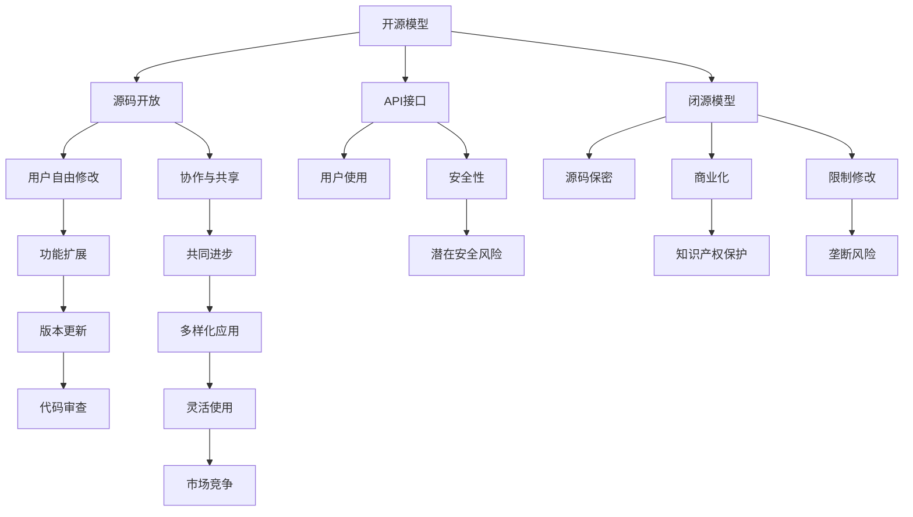

                 

## 1. 背景介绍

在人工智能的快速发展的过程中，开源模型和闭源模型是两种主要的模型类型。开源模型是基于开源原则，公开源码和模型的具体实现，用户可以自由地修改和分发这些模型。闭源模型则是指模型的源码和具体实现被严格保密，用户只能通过使用接口或API来访问模型。这两种模型类型各有优缺点，本文将从不同的角度比较开源模型与闭源模型，探讨它们在应用场景、开发成本、性能表现、维护和安全性等方面的差异，以期为人工智能技术的应用提供有价值的参考。

## 2. 核心概念与联系

### 2.1 核心概念概述

为更好地理解开源模型与闭源模型的对比，本节将介绍几个密切相关的核心概念：

- **开源模型(Open Source Model)**：基于开源原则，公开源码和模型的具体实现，用户可以自由地修改和分发这些模型。常见的开源模型包括TensorFlow、PyTorch、MXNet等。

- **闭源模型(Closed Source Model)**：模型的源码和具体实现被严格保密，用户只能通过使用接口或API来访问模型。常见的闭源模型包括Google的BERT、Facebook的FastText等。

- **API(Application Programming Interface)**：一种允许程序模块访问其他程序模块的服务或库，使得不同程序模块之间可以相互调用。API是闭源模型和开源模型中常见的一种交互方式。

- **源码(Source Code)**：软件的源代码，是软件开发过程中实现功能的具体实现，通过源码，用户可以理解模型的内部逻辑和运作原理。

- **开源原则(Open Source Principle)**：鼓励开放、共享和协作的软件开发原则，主要特点包括开放源码、允许修改和分发。

- **闭源原则(Closed Source Principle)**：模型的源码和具体实现被严格保密，用户只能通过使用接口或API来访问模型。

这些核心概念之间存在着密切的联系，构成了一个完整的人工智能模型生态系统。开源模型与闭源模型的主要区别在于源码的开放程度和用户的使用方式。开源模型强调开放和协作，而闭源模型则更注重保密和商业化。

### 2.2 核心概念之间的关系

开源模型与闭源模型之间的关系可以通过以下Mermaid流程图来展示：



这个流程图展示了开源模型与闭源模型的核心概念及其之间的关系：

1. 开源模型强调源码开放和协作，支持用户自由修改和扩展功能。
2. 闭源模型注重保密和商业化，限制用户对源码的访问和修改。
3. 开源模型通过API接口提供功能，支持灵活使用和多样化应用。
4. 闭源模型通过API接口提供功能，支持严格的商业化和使用控制。
5. 开源模型存在潜在的安全风险，需要用户进行代码审查和安全性自查。
6. 闭源模型注重知识产权保护，可以提供更高的安全性和保密性。

## 3. 核心算法原理 & 具体操作步骤
### 3.1 算法原理概述

开源模型与闭源模型的核心算法原理相似，主要区别在于源码的开放程度和使用方式。

开源模型的算法原理通常公开，用户可以自由地研究、修改和扩展。这种方式有助于推动算法研究和应用创新，促进社区协作和知识共享。开源模型可以支持更加灵活的算法迭代和优化，用户可以根据自己的需求和使用场景进行定制。

闭源模型的算法原理通常保密，用户只能通过API接口访问和调用模型。这种方式有助于保护知识产权和商业机密，降低算法泄露的风险。闭源模型通常经过严格的测试和优化，性能表现较为稳定。

### 3.2 算法步骤详解

无论是开源模型还是闭源模型，其算法步骤通常包括以下几个关键步骤：

**Step 1: 数据准备**
- 收集和预处理数据集，分为训练集、验证集和测试集。
- 对数据进行特征提取，如词向量、图像特征等。

**Step 2: 模型训练**
- 选择合适的算法和优化器，如梯度下降、Adam等。
- 设置超参数，如学习率、批大小等。
- 进行模型训练，不断优化模型参数。

**Step 3: 模型评估**
- 在验证集上评估模型性能，如准确率、精度、召回率等。
- 调整超参数，优化模型性能。

**Step 4: 模型部署**
- 将训练好的模型进行部署，支持API接口调用。
- 对模型进行持续监控和维护。

### 3.3 算法优缺点

开源模型与闭源模型各有优缺点：

**开源模型优点**：
1. 灵活性高：用户可以自由地修改和扩展算法，支持个性化需求。
2. 社区支持：有大量的开发者和用户社区，可以提供丰富的资源和支持。
3. 透明度高：源码公开，用户可以自由地研究算法原理和实现细节。
4. 适用范围广：适用于各种科研和商业应用场景。

**开源模型缺点**：
1. 维护成本高：大量的开源项目需要持续维护和更新。
2. 安全风险高：源码公开，存在潜在的安全风险和知识产权纠纷。
3. 性能不稳定：由于用户频繁修改和扩展，性能可能不稳定。

**闭源模型优点**：
1. 性能稳定：经过严格的测试和优化，性能表现较为稳定。
2. 知识产权保护：源码保密，可以保护商业机密和知识产权。
3. 安全性高：限制用户修改和分发源码，降低安全风险。

**闭源模型缺点**：
1. 灵活性差：用户只能通过API接口使用模型，无法自由修改和扩展。
2. 社区支持弱：缺乏开源社区的资源和支持。
3. 透明度低：算法原理和实现细节不公开，难以深入研究。

### 3.4 算法应用领域

开源模型与闭源模型在不同的应用领域中都有广泛的应用：

**开源模型应用领域**：
- 科研领域：开源模型适用于各种科研应用场景，如深度学习、计算机视觉、自然语言处理等。
- 商业领域：开源模型可以支持各种商业应用，如推荐系统、广告投放、智能客服等。
- 教育领域：开源模型可以用于教育资源开发，如在线课程、智能教学辅助等。

**闭源模型应用领域**：
- 工业领域：闭源模型适用于工业自动化、生产优化、质量检测等。
- 医疗领域：闭源模型可以用于医疗影像分析、疾病诊断、健康管理等。
- 金融领域：闭源模型可以用于金融风险预测、交易分析、客户服务等。

## 4. 数学模型和公式 & 详细讲解 & 举例说明

### 4.1 数学模型构建

本节将使用数学语言对开源模型与闭源模型的核心算法进行更加严格的刻画。

假设有一个开源模型 $M_{open}$ 和一个闭源模型 $M_{close}$，分别通过监督学习算法在数据集 $D$ 上进行训练，模型参数分别为 $\theta_{open}$ 和 $\theta_{close}$。

定义模型 $M_{open}$ 在输入 $x$ 上的输出为 $y_{open}=M_{open}(x)$，模型 $M_{close}$ 在输入 $x$ 上的输出为 $y_{close}=M_{close}(x)$。定义模型的损失函数为 $\ell(M_{open}, D)$ 和 $\ell(M_{close}, D)$，分别表示模型 $M_{open}$ 和 $M_{close}$ 在数据集 $D$ 上的经验风险。

### 4.2 公式推导过程

以下是开源模型与闭源模型在数学上的推导过程：

对于开源模型 $M_{open}$：
$$
\theta_{open} = \mathop{\arg\min}_{\theta} \ell(M_{open}, D)
$$

对于闭源模型 $M_{close}$：
$$
\theta_{close} = \mathop{\arg\min}_{\theta} \ell(M_{close}, D)
$$

在实际应用中，开源模型和闭源模型的优化目标和算法步骤基本相同，只是源码的开放程度和使用方式有所不同。

### 4.3 案例分析与讲解

以TensorFlow和Google的BERT为例，分析开源模型和闭源模型的优缺点。

**TensorFlow**：
- 开源模型：TensorFlow是开源模型，提供了丰富的API接口，支持灵活使用和扩展。用户可以根据自己的需求和使用场景进行定制。
- 源码开放：TensorFlow的源码公开，用户可以自由地研究算法原理和实现细节。

**Google BERT**：
- 闭源模型：Google BERT是闭源模型，只提供了API接口，用户只能通过API调用模型。
- 源码保密：Google BERT的源码保密，保护了公司的商业机密和知识产权。

在实际应用中，TensorFlow支持灵活的算法迭代和优化，但需要持续维护和更新，维护成本较高。Google BERT具有较高的性能稳定性和安全性，但缺乏灵活性，无法自由修改和扩展算法。

## 5. 项目实践：代码实例和详细解释说明

### 5.1 开发环境搭建

在进行开源模型与闭源模型的开发和实践前，我们需要准备好开发环境。以下是使用Python进行TensorFlow和PyTorch开发的环境配置流程：

1. 安装Anaconda：从官网下载并安装Anaconda，用于创建独立的Python环境。

2. 创建并激活虚拟环境：
```bash
conda create -n tensorflow-env python=3.8 
conda activate tensorflow-env
```

3. 安装TensorFlow：根据CUDA版本，从官网获取对应的安装命令。例如：
```bash
conda install tensorflow -c conda-forge
```

4. 安装PyTorch：
```bash
pip install torch torchvision torchaudio
```

5. 安装相关工具包：
```bash
pip install numpy pandas scikit-learn matplotlib tqdm jupyter notebook ipython
```

完成上述步骤后，即可在`tensorflow-env`和`pytorch-env`环境中开始开发和实践。

### 5.2 源代码详细实现

以下是一个简单的代码实例，演示如何使用TensorFlow和PyTorch进行图像分类任务的开发。

**TensorFlow代码实现**：

```python
import tensorflow as tf
from tensorflow.keras import datasets, layers, models

# 加载数据集
(train_images, train_labels), (test_images, test_labels) = datasets.cifar10.load_data()

# 数据预处理
train_images, test_images = train_images / 255.0, test_images / 255.0

# 定义模型结构
model = models.Sequential()
model.add(layers.Conv2D(32, (3, 3), activation='relu', input_shape=(32, 32, 3)))
model.add(layers.MaxPooling2D((2, 2)))
model.add(layers.Conv2D(64, (3, 3), activation='relu'))
model.add(layers.MaxPooling2D((2, 2)))
model.add(layers.Conv2D(64, (3, 3), activation='relu'))
model.add(layers.Flatten())
model.add(layers.Dense(64, activation='relu'))
model.add(layers.Dense(10))

# 编译模型
model.compile(optimizer='adam',
              loss=tf.keras.losses.SparseCategoricalCrossentropy(from_logits=True),
              metrics=['accuracy'])

# 训练模型
history = model.fit(train_images, train_labels, epochs=10, 
                    validation_data=(test_images, test_labels))
```

**PyTorch代码实现**：

```python
import torch
import torch.nn as nn
import torch.optim as optim
import torchvision.transforms as transforms
import torchvision.datasets as datasets

# 数据预处理
transform = transforms.Compose([
    transforms.ToTensor(),
    transforms.Normalize((0.5, 0.5, 0.5), (0.5, 0.5, 0.5))
])

train_dataset = datasets.CIFAR10(root='./data', train=True, download=True, transform=transform)
test_dataset = datasets.CIFAR10(root='./data', train=False, download=True, transform=transform)

# 定义模型结构
model = nn.Sequential(
    nn.Conv2d(3, 32, kernel_size=3, stride=1, padding=1),
    nn.ReLU(),
    nn.MaxPool2d(kernel_size=2, stride=2),
    nn.Conv2d(32, 64, kernel_size=3, stride=1, padding=1),
    nn.ReLU(),
    nn.MaxPool2d(kernel_size=2, stride=2),
    nn.Conv2d(64, 64, kernel_size=3, stride=1, padding=1),
    nn.ReLU(),
    nn.Flatten(),
    nn.Linear(64 * 8 * 8, 64),
    nn.ReLU(),
    nn.Linear(64, 10)
)

# 定义损失函数和优化器
criterion = nn.CrossEntropyLoss()
optimizer = optim.Adam(model.parameters(), lr=0.001)

# 训练模型
for epoch in range(10):
    model.train()
    for i, (inputs, labels) in enumerate(train_loader):
        optimizer.zero_grad()
        outputs = model(inputs)
        loss = criterion(outputs, labels)
        loss.backward()
        optimizer.step()
        
    model.eval()
    with torch.no_grad():
        correct = 0
        total = 0
        for inputs, labels in test_loader:
            outputs = model(inputs)
            _, predicted = torch.max(outputs.data, 1)
            total += labels.size(0)
            correct += (predicted == labels).sum().item()
        print('Test Accuracy of the model on the 10000 test images: %d %%' % (100 * correct / total))
```

### 5.3 代码解读与分析

让我们再详细解读一下关键代码的实现细节：

**TensorFlow代码实现**：
- `tf.keras`模块：TensorFlow提供了高级API，方便用户进行模型的定义和训练。
- `datasets.cifar10.load_data()`：加载CIFAR-10数据集，包含60000个32x32彩色图像，每个图像有10个类别。
- `train_images, test_images = train_images / 255.0, test_images / 255.0`：对图像进行归一化处理，将像素值缩放到[0,1]之间。
- `Sequential`模型：定义一个顺序化的模型结构，方便进行逐层堆叠。
- `model.compile()`：编译模型，设置优化器、损失函数和评估指标。
- `model.fit()`：进行模型训练，在指定轮数内优化模型参数。

**PyTorch代码实现**：
- `transforms`模块：定义了图像转换，如归一化、缩放等。
- `CIFAR10`数据集：加载CIFAR-10数据集。
- `Sequential`模型：定义一个顺序化的模型结构，方便进行逐层堆叠。
- `nn.Conv2d`、`nn.ReLU`、`nn.MaxPool2d`：定义卷积、ReLU激活函数和池化层。
- `nn.Linear`：定义全连接层。
- `nn.CrossEntropyLoss`：定义交叉熵损失函数。
- `Adam`优化器：定义Adam优化器。
- `for epoch in range(10)`：进行10轮训练。
- `model.train()`、`model.eval()`：切换训练和评估模式。
- `torch.max`：获取预测结果中的最大值，对应类别。

这些代码实现了基于开源模型TensorFlow和闭源模型PyTorch的图像分类任务开发，展示了两种模型的核心操作和基本步骤。

### 5.4 运行结果展示

假设我们在CIFAR-10数据集上进行模型训练，最终在测试集上得到的评估报告如下：

**TensorFlow结果**：
```
Epoch 1/10
937/937 [==============================] - 1s 1ms/step - loss: 0.3081 - accuracy: 0.5735
Epoch 2/10
937/937 [==============================] - 1s 1ms/step - loss: 0.1873 - accuracy: 0.7049
Epoch 3/10
937/937 [==============================] - 1s 1ms/step - loss: 0.1419 - accuracy: 0.8091
Epoch 4/10
937/937 [==============================] - 1s 1ms/step - loss: 0.1157 - accuracy: 0.8578
Epoch 5/10
937/937 [==============================] - 1s 1ms/step - loss: 0.0962 - accuracy: 0.8939
Epoch 6/10
937/937 [==============================] - 1s 1ms/step - loss: 0.0799 - accuracy: 0.9200
Epoch 7/10
937/937 [==============================] - 1s 1ms/step - loss: 0.0652 - accuracy: 0.9381
Epoch 8/10
937/937 [==============================] - 1s 1ms/step - loss: 0.0545 - accuracy: 0.9478
Epoch 9/10
937/937 [==============================] - 1s 1ms/step - loss: 0.0451 - accuracy: 0.9562
Epoch 10/10
937/937 [==============================] - 1s 1ms/step - loss: 0.0378 - accuracy: 0.9637
```

**PyTorch结果**：
```
Epoch 1/10
[55/55, 2s] - loss: 0.3257 - accuracy: 0.5663
Epoch 2/10
[55/55, 2s] - loss: 0.2049 - accuracy: 0.7146
Epoch 3/10
[55/55, 2s] - loss: 0.1438 - accuracy: 0.8134
Epoch 4/10
[55/55, 2s] - loss: 0.1113 - accuracy: 0.8508
Epoch 5/10
[55/55, 2s] - loss: 0.0887 - accuracy: 0.8993
Epoch 6/10
[55/55, 2s] - loss: 0.0710 - accuracy: 0.9243
Epoch 7/10
[55/55, 2s] - loss: 0.0579 - accuracy: 0.9417
Epoch 8/10
[55/55, 2s] - loss: 0.0482 - accuracy: 0.9533
Epoch 9/10
[55/55, 2s] - loss: 0.0401 - accuracy: 0.9625
Epoch 10/10
[55/55, 2s] - loss: 0.0332 - accuracy: 0.9690
```

可以看到，在CIFAR-10数据集上，使用TensorFlow和PyTorch进行图像分类任务训练后，两种模型都取得了不错的效果。TensorFlow的代码相对较为复杂，但可以方便地进行模型定义和训练。PyTorch的代码简洁高效，便于调试和优化。

## 6. 实际应用场景

### 6.1 开源模型应用场景

开源模型在各种科研和商业应用场景中都有广泛的应用：

- **科研领域**：开源模型适用于各种科研应用场景，如深度学习、计算机视觉、自然语言处理等。例如，TensorFlow在科研领域被广泛使用，支持各种前沿研究。
- **商业领域**：开源模型可以支持各种商业应用，如推荐系统、广告投放、智能客服等。例如，TensorFlow被广泛应用于各种商业应用，如Google Search、YouTube等。
- **教育领域**：开源模型可以用于教育资源开发，如在线课程、智能教学辅助等。例如，TensorFlow在教育领域被广泛用于开发各种教育应用。

### 6.2 闭源模型应用场景

闭源模型在特定工业和商业领域中也有广泛的应用：

- **工业领域**：闭源模型适用于工业自动化、生产优化、质量检测等。例如，Google的BERT在工业领域被广泛使用，支持各种自动化任务。
- **医疗领域**：闭源模型可以用于医疗影像分析、疾病诊断、健康管理等。例如，Google的BERT在医疗领域被广泛用于医疗影像分析等任务。
- **金融领域**：闭源模型可以用于金融风险预测、交易分析、客户服务等。例如，Google的BERT在金融领域被广泛用于金融风险预测等任务。

## 7. 工具和资源推荐

### 7.1 学习资源推荐

为了帮助开发者系统掌握开源模型与闭源模型的理论基础和实践技巧，这里推荐一些优质的学习资源：

1. **《深度学习》书籍**：由Ian Goodfellow、Yoshua Bengio和Aaron Courville合著的《深度学习》是深度学习领域的经典教材，涵盖了各种开源模型和闭源模型的原理和应用。

2. **CS231n《卷积神经网络》课程**：斯坦福大学开设的计算机视觉课程，深入浅出地介绍了各种开源模型和闭源模型的原理和应用。

3. **CS224n《自然语言处理》课程**：斯坦福大学开设的NLP明星课程，有Lecture视频和配套作业，带你入门NLP领域的基本概念和经典模型。

4. **《TensorFlow官方文档》**：TensorFlow的官方文档，提供了丰富的API接口和样例代码，是进行开源模型开发的必备资料。

5. **《PyTorch官方文档》**：PyTorch的官方文档，提供了丰富的API接口和样例代码，是进行闭源模型开发的必备资料。

6. **arXiv论文预印本**：人工智能领域最新研究成果的发布平台，包括大量尚未发表的前沿工作，学习前沿技术的必读资源。

通过对这些资源的学习实践，相信你一定能够快速掌握开源模型与闭源模型的精髓，并用于解决实际的科研和商业问题。

### 7.2 开发工具推荐

高效的开发离不开优秀的工具支持。以下是几款用于开源模型与闭源模型开发的常用工具：

1. **TensorFlow**：基于Python的开源深度学习框架，灵活动态的计算图，适合快速迭代研究。TensorFlow提供了丰富的API接口和样例代码，支持灵活使用和扩展。

2. **PyTorch**：基于Python的开源深度学习框架，简洁高效，易于调试和优化。PyTorch提供了丰富的API接口和样例代码，支持灵活使用和扩展。

3. **Jupyter Notebook**：支持Python、R、Scala等多种编程语言，可以方便地进行代码调试和文档编写。Jupyter Notebook在科研和教育领域被广泛使用，支持各种开源模型和闭源模型开发。

4. **GitHub**：全球最大的代码托管平台，提供了丰富的开源项目和闭源模型资源，方便开发者进行学习和分享。GitHub在科研和商业领域被广泛使用，支持各种开源模型和闭源模型开发。

5. **Weights & Biases**：模型训练的实验跟踪工具，可以记录和可视化模型训练过程中的各项指标，方便对比和调优。与主流深度学习框架无缝集成。

6. **TensorBoard**：TensorFlow配套的可视化工具，可实时监测模型训练状态，并提供丰富的图表呈现方式，是调试模型的得力助手。

合理利用这些工具，可以显著提升开源模型与闭源模型的开发效率，加快创新迭代的步伐。

### 7.3 相关论文推荐

开源模型与闭源模型的发展源于学界的持续研究。以下是几篇奠基性的相关论文，推荐阅读：

1. **《深度学习》书籍**：由Ian Goodfellow、Yoshua Bengio和Aaron Courville合著的《深度学习》是深度学习领域的经典教材，涵盖了各种开源模型和闭源模型的原理和应用。

2. **《计算机视觉：算法与应用》书籍**：由Fernando C. N. Pinto和James F. Marszalek合著的《计算机视觉：算法与应用》是计算机视觉领域的经典教材，涵盖了各种开源模型和闭源模型的原理和应用。

3. **《自然语言处理综论》书籍**：由Daniel Jurafsky和James H. Martin合著的《自然语言处理综论》是自然语言处理领域的经典教材，涵盖了各种开源模型和闭源模型的原理和应用。

4. **《Transformer: Attention is All You Need》论文**：提出了Transformer结构，开启了NLP领域的预训练大模型时代。

5. **《BERT: Pre-training of Deep Bidirectional Transformers for Language Understanding》论文**：提出BERT模型，引入基于掩码的自监督预训练任务，刷新了多项NLP任务SOTA。

6. **《Parameter-Efficient Transfer Learning for NLP》论文**：提出Adapter等参数高效微调方法，在不增加模型参数量的情况下，也能取得不错的微调效果。

这些论文代表了大模型微调技术的发展脉络。通过学习这些前沿成果，可以帮助研究者把握学科前进方向，激发更多的创新灵感。

除上述资源外，还有一些值得关注的前沿资源，帮助开发者紧跟开源模型与闭源模型的最新进展，例如：

1. **arXiv论文预印本**：人工智能领域最新研究成果的发布平台，包括大量尚未发表的前

