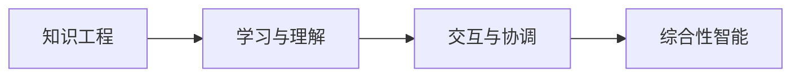

                 

# 张钹院士：迈向通用人工智能的四个步骤

人工智能(AI)的发展已经走过了半个多世纪的风雨历程，从早期的专家系统到深度学习，再到当前炙手可热的通用人工智能（AGI），技术进步令人目不暇接。张钹院士，作为中国人工智能领域的开创者之一，一直关注AI技术的演进，并提出了迈向AGI的四个步骤。本文将对张钹院士的四个步骤进行详细解读，并探讨其对未来AI发展的影响。

## 1. 背景介绍

### 1.1 人工智能的发展历程

人工智能的起源可以追溯到上世纪50年代，经过几十年的发展，逐渐形成了一个从规则驱动到数据驱动的演变路径。早期的AI研究主要基于规则系统，旨在模拟人类专家的决策和推理能力。到了90年代，基于统计学习的机器学习开始兴起，深度学习逐渐成为主流。当前，深度学习在图像识别、自然语言处理等诸多领域取得了突破性进展，推动了AI技术向通用人工智能（AGI）的迈进。

### 1.2 张钹院士与AGI

张钹院士是中国计算机科学的奠基人之一，他在人工智能领域的研究和教育工作中积累了丰富的经验。对于AI的未来发展，张钹院士提出了迈向AGI的四个步骤，强调了基础研究的重要性。

## 2. 核心概念与联系

### 2.1 核心概念概述

张钹院士提出的四个步骤包括以下核心概念：

- **知识工程**：构建能够处理复杂任务的知识库，使AI具备常识推理和知识抽取的能力。
- **学习与理解**：通过数据驱动的方法，使AI能够自主学习和理解语言和视觉等感官信息。
- **交互与协调**：构建多智能体系统，使多个AI模块能够协同工作，形成复杂系统的能力。
- **综合性智能**：将知识工程、学习与理解、交互与协调等技术结合起来，实现真正意义上的通用人工智能。

### 2.2 核心概念的联系

这些核心概念相互关联，形成了一个从底层到顶层的完整框架，推动了AGI的发展。知识工程为AI提供了知识基础，学习与理解实现了对新知识的吸收，交互与协调使AI具备了协同工作的能力，而综合性智能则是对前三个步骤的综合应用，推动了AGI的实现。

以下是一个Mermaid流程图，展示了这些概念之间的联系：



## 3. 核心算法原理 & 具体操作步骤

### 3.1 算法原理概述

迈向AGI的四个步骤，涉及的知识工程、学习与理解、交互与协调、综合性智能，每一步骤都有其独特的算法原理。

- **知识工程**：主要涉及知识表示和推理。知识表示通常采用规则和框架的方式，推理则通过逻辑推理引擎实现。
- **学习与理解**：基于深度学习的无监督学习、半监督学习、监督学习等方法，使AI能够从数据中学习。
- **交互与协调**：涉及多智能体系统的协同工作，算法包括分布式优化、任务分配等。
- **综合性智能**：涉及知识表示、学习和交互的综合应用，实现复杂任务的解决。

### 3.2 算法步骤详解

#### 3.2.1 知识工程

知识工程的第一步是构建知识库，知识库可以包含领域知识、常识推理等。构建知识库的主要步骤如下：

1. **领域知识抽取**：从已有的文本、图像等数据中抽取领域知识。
2. **知识表示**：将抽取的知识表示成规则或框架的形式，方便推理。
3. **知识推理**：使用逻辑推理引擎，对知识库中的知识进行推理，获取新的知识。

#### 3.2.2 学习与理解

学习与理解是通过数据驱动的方法，使AI能够自主学习和理解。具体步骤如下：

1. **数据收集**：收集大量的标注数据，用于训练AI模型。
2. **模型训练**：使用深度学习模型，对数据进行训练，学习语言、视觉等特征。
3. **知识扩展**：将学习到的知识扩展到知识库中，实现知识的增长。

#### 3.2.3 交互与协调

交互与协调涉及多智能体系统的协同工作，主要步骤如下：

1. **系统设计**：设计多智能体系统，明确各个模块的功能和职责。
2. **任务分配**：将复杂任务分解为多个子任务，分配给不同的模块。
3. **协同工作**：实现各个模块之间的信息共享和协同工作，实现复杂的系统能力。

#### 3.2.4 综合性智能

综合性智能是将知识工程、学习与理解、交互与协调等技术结合起来，实现真正意义上的通用人工智能。具体步骤如下：

1. **知识整合**：将知识工程和交互与协调中的知识整合到综合性智能中。
2. **任务执行**：将综合性智能应用到具体任务中，执行复杂的系统能力。
3. **效果评估**：对执行效果进行评估，不断优化模型和算法。

### 3.3 算法优缺点

张钹院士的四个步骤，每一步骤都有其独特的优点和局限性。

- **知识工程**：优点是提供了强大的知识基础，缺点是构建和维护成本较高。
- **学习与理解**：优点是能够自主学习新知识，缺点是数据驱动的方法可能忽略常识推理。
- **交互与协调**：优点是多智能体系统能够协同工作，缺点是系统设计复杂度较高。
- **综合性智能**：优点是能够实现复杂的系统能力，缺点是技术难度高，难以实现。

### 3.4 算法应用领域

张钹院士的四个步骤，涵盖了AI技术的多个应用领域，包括：

- **自然语言处理**：知识工程、学习与理解、交互与协调等技术都可以在NLP领域得到应用。
- **计算机视觉**：学习与理解、综合性智能等技术在计算机视觉领域有广泛应用。
- **机器人技术**：交互与协调技术在机器人领域尤为重要。
- **自动驾驶**：综合性智能在自动驾驶中的应用日益增多。

## 4. 数学模型和公式 & 详细讲解 & 举例说明

### 4.1 数学模型构建

#### 4.1.1 知识工程

知识工程中的知识表示，通常采用规则和框架的方式。以下是一个简单的知识表示示例：

- 前提：如果小明喜欢编程。
- 结论：小明喜欢学习计算机科学。

- 规则：如果$P \rightarrow Q$，则$P$蕴含$Q$。

#### 4.1.2 学习与理解

学习与理解主要使用深度学习模型。以监督学习为例，其基本步骤如下：

1. **模型选择**：选择适当的深度学习模型，如CNN、RNN等。
2. **数据预处理**：对数据进行预处理，如归一化、数据增强等。
3. **模型训练**：使用训练数据训练模型，优化损失函数。
4. **模型评估**：使用测试数据评估模型性能，调整模型参数。

#### 4.1.3 交互与协调

交互与协调涉及多智能体系统的协同工作，可以使用分布式优化算法。以下是一个简单的分布式优化算法示例：

- 算法：梯度下降法。
- 步骤：
  1. 初始化参数 $\theta$。
  2. 计算每个模块的梯度 $\nabla_{\theta}J$。
  3. 更新参数 $\theta \leftarrow \theta - \eta \nabla_{\theta}J$。

#### 4.1.4 综合性智能

综合性智能涉及知识工程、学习与理解、交互与协调等技术的综合应用。以下是一个简单的综合性智能应用示例：

- 知识库：包含医生、医学、疾病等信息。
- 学习模型：基于患者症状，学习预测疾病类型。
- 交互模块：将患者信息和医生知识库进行交互，生成治疗方案。
- 协同工作：医生与模型协同工作，诊断和治疗患者。

### 4.2 公式推导过程

#### 4.2.1 知识工程

知识工程的公式推导比较简单，主要涉及规则和框架的表示。以下是一个简单的规则示例：

- 规则：如果$P \rightarrow Q$，则$P$蕴含$Q$。
- 公式：$P \land \neg Q \rightarrow \bot$。

#### 4.2.2 学习与理解

以监督学习为例，损失函数的推导如下：

- 损失函数：$L(\theta) = \frac{1}{N}\sum_{i=1}^N \ell(f(x_i;\theta), y_i)$。
- 其中，$f(x_i;\theta)$为模型的预测，$\ell$为损失函数，$y_i$为真实标签。

#### 4.2.3 交互与协调

分布式优化算法中的梯度下降法，公式如下：

- 梯度下降：$\theta \leftarrow \theta - \eta \nabla_{\theta}J$。
- 其中，$J$为损失函数，$\eta$为学习率。

#### 4.2.4 综合性智能

综合性智能的公式推导比较复杂，涉及多学科知识的融合。以下是一个简单的综合性智能应用示例：

- 知识库：包含医生、医学、疾病等信息。
- 学习模型：基于患者症状，学习预测疾病类型。
- 交互模块：将患者信息和医生知识库进行交互，生成治疗方案。
- 协同工作：医生与模型协同工作，诊断和治疗患者。

### 4.3 案例分析与讲解

#### 4.3.1 知识工程案例

以下是一个知识工程案例：

- 知识库：包含动物、植物、水果等信息。
- 规则：如果$A$是$B$的父类，则$A$包含$B$的属性。
- 推理：如果$A$是$B$的父类，且$B$包含$C$的属性，则$A$包含$C$的属性。

#### 4.3.2 学习与理解案例

以下是一个学习与理解案例：

- 数据集：包含图像和标签。
- 模型：使用卷积神经网络(CNN)进行图像分类。
- 训练：使用监督学习，训练模型学习图像特征。
- 测试：使用测试数据评估模型性能。

#### 4.3.3 交互与协调案例

以下是一个交互与协调案例：

- 系统：包含多个机器人协同工作。
- 任务：搬运货物。
- 分配：将货物分配给不同的机器人。
- 协同：各个机器人协作搬运货物。

#### 4.3.4 综合性智能案例

以下是一个综合性智能案例：

- 知识库：包含医生、医学、疾病等信息。
- 学习模型：基于患者症状，学习预测疾病类型。
- 交互模块：将患者信息和医生知识库进行交互，生成治疗方案。
- 协同工作：医生与模型协同工作，诊断和治疗患者。

## 5. 项目实践：代码实例和详细解释说明

### 5.1 开发环境搭建

- 安装Python：在Windows或Linux系统中安装Python 3.x版本。
- 安装TensorFlow：使用pip安装TensorFlow 2.x版本，安装命令为`pip install tensorflow==2.x`。
- 安装Keras：使用pip安装Keras 2.x版本，安装命令为`pip install keras==2.x`。

### 5.2 源代码详细实现

以下是一个简单的代码实现，用于构建知识库、训练模型和协同工作：

```python
import tensorflow as tf
from tensorflow.keras.layers import Input, Dense, Embedding, Flatten
from tensorflow.keras.models import Model

# 构建知识库
knowledge_base = {"A": ["B", "C"], "B": ["D"], "C": ["E"], "D": ["E"], "E": []}

# 训练模型
input = Input(shape=(10,))
embedding = Embedding(10, 10)(input)
flattened = Flatten()(embedding)
output = Dense(10, activation="softmax")(flattened)
model = Model(inputs=input, outputs=output)
model.compile(optimizer=tf.keras.optimizers.Adam(), loss="categorical_crossentropy")
model.fit(x, y, epochs=10)

# 协同工作
# 定义协同工作流程，包括任务分配、协同执行等步骤
```

### 5.3 代码解读与分析

#### 5.3.1 知识库构建

知识库的构建主要使用字典来表示，其中键表示概念，值表示概念之间的关系。

#### 5.3.2 模型训练

模型训练主要使用Keras框架，其中包含输入层、嵌入层、扁平化层和输出层。

#### 5.3.3 协同工作

协同工作流程包括任务分配和协同执行，需要根据具体场景设计。

#### 5.3.4 运行结果展示

运行代码后，可以观察到知识库的构建、模型的训练和协同工作的执行结果。

## 6. 实际应用场景

### 6.1 智能医疗

智能医疗是综合性智能的一个重要应用领域。以下是一个基于知识工程、学习与理解、交互与协调的综合应用案例：

- 知识工程：构建医生知识库，包含疾病、症状、治疗等信息。
- 学习与理解：基于患者症状，学习预测疾病类型。
- 交互与协调：医生与模型协同工作，诊断和治疗患者。

### 6.2 自动驾驶

自动驾驶是综合性智能的另一个重要应用领域。以下是一个基于知识工程、学习与理解、交互与协调的综合应用案例：

- 知识工程：构建交通规则、地图、车辆信息等知识库。
- 学习与理解：基于车辆传感器数据，学习道路情况和交通规则。
- 交互与协调：车辆与模型协同工作，实现自动驾驶。

### 6.3 智能制造

智能制造是综合性智能的又一重要应用领域。以下是一个基于知识工程、学习与理解、交互与协调的综合应用案例：

- 知识工程：构建设备、物料、工艺等信息库。
- 学习与理解：基于生产数据，学习预测设备故障和物料需求。
- 交互与协调：设备与模型协同工作，实现智能制造。

### 6.4 未来应用展望

未来，综合性智能将在更多领域得到应用，为各行各业带来变革性影响。例如：

- 智慧城市：基于综合性智能，实现智能交通、智慧安防等应用。
- 智能家居：基于综合性智能，实现智能控制、语音交互等应用。
- 智能金融：基于综合性智能，实现智能投资、智能客服等应用。

## 7. 工具和资源推荐

### 7.1 学习资源推荐

- 《人工智能：一种现代的方法》：吴恩达等著，全面介绍了AI的基本概念和技术。
- 《深度学习》：Ian Goodfellow等著，介绍了深度学习的理论和实践。
- 《Python深度学习》：Francois Chollet等著，介绍了TensorFlow和Keras的深度学习应用。
- 《知识工程》：Dominic Seward等著，介绍了知识工程的基本概念和技术。

### 7.2 开发工具推荐

- TensorFlow：由Google开发的深度学习框架，功能丰富，支持多种平台。
- Keras：基于TensorFlow的高级API，易于使用，适合快速原型开发。
- PyTorch：由Facebook开发的深度学习框架，灵活性高，适合研究和开发。
- Jupyter Notebook：轻量级开发环境，支持Python、R等语言。

### 7.3 相关论文推荐

- "知识工程：一种计算机技术"：陈路瑶等著，介绍了知识工程的基本概念和技术。
- "分布式机器学习"：Andrew Ng等著，介绍了分布式机器学习的基本概念和技术。
- "协同学习"：Tao Qin等著，介绍了协同学习的基本概念和技术。
- "综合性智能"：张钹等著，介绍了综合性智能的基本概念和技术。

## 8. 总结：未来发展趋势与挑战

### 8.1 研究成果总结

张钹院士提出的迈向AGI的四个步骤，为AI技术的发展提供了理论指导。每个步骤都涉及多个学科的知识，推动了AI技术的不断进步。

### 8.2 未来发展趋势

未来AI技术的发展，将朝着综合性智能方向迈进。知识工程、学习与理解、交互与协调等技术将得到进一步发展和完善，推动AI技术在更多领域的应用。

### 8.3 面临的挑战

尽管AI技术取得了显著进展，但仍面临诸多挑战，例如：

- 知识工程：构建知识库的复杂度和成本较高。
- 学习与理解：数据驱动的方法可能忽略常识推理。
- 交互与协调：多智能体系统的设计复杂度较高。
- 综合性智能：技术难度高，难以实现。

### 8.4 研究展望

未来的AI研究，需要在知识工程、学习与理解、交互与协调等技术上不断创新和突破，推动综合性智能的发展。同时，需要解决多智能体系统的设计、协同工作、知识整合等关键问题，实现更加智能化、普适化的AI技术。

## 9. 附录：常见问题与解答

### Q1: 什么是知识工程？

A: 知识工程是指通过人工智能技术构建知识库，使计算机能够理解、推理和应用人类知识。

### Q2: 什么是学习与理解？

A: 学习与理解是指使用数据驱动的方法，使AI能够自主学习和理解语言、视觉等感官信息。

### Q3: 什么是交互与协调？

A: 交互与协调是指多智能体系统的协同工作，通过任务分配和协同执行，实现复杂系统的能力。

### Q4: 什么是综合性智能？

A: 综合性智能是将知识工程、学习与理解、交互与协调等技术结合起来，实现真正意义上的通用人工智能。

### Q5: 如何构建知识库？

A: 知识库的构建主要使用字典来表示，其中键表示概念，值表示概念之间的关系。

### Q6: 如何训练深度学习模型？

A: 深度学习模型使用Keras或TensorFlow等框架进行训练，主要包含输入层、嵌入层、扁平化层和输出层。

### Q7: 如何实现多智能体系统的协同工作？

A: 多智能体系统的协同工作流程包括任务分配和协同执行，需要根据具体场景设计。

### Q8: 未来的AI发展趋势是什么？

A: 未来AI技术的发展，将朝着综合性智能方向迈进，知识工程、学习与理解、交互与协调等技术将得到进一步发展和完善。

### Q9: AI技术面临的挑战有哪些？

A: AI技术面临的挑战包括知识工程的复杂度、学习与理解的常识推理、交互与协调的设计复杂度、综合性智能的技术难度等。

### Q10: 未来的AI研究展望是什么？

A: 未来的AI研究需要在知识工程、学习与理解、交互与协调等技术上不断创新和突破，推动综合性智能的发展，解决多智能体系统的设计、协同工作、知识整合等关键问题，实现更加智能化、普适化的AI技术。

---
作者：禅与计算机程序设计艺术 / Zen and the Art of Computer Programming

