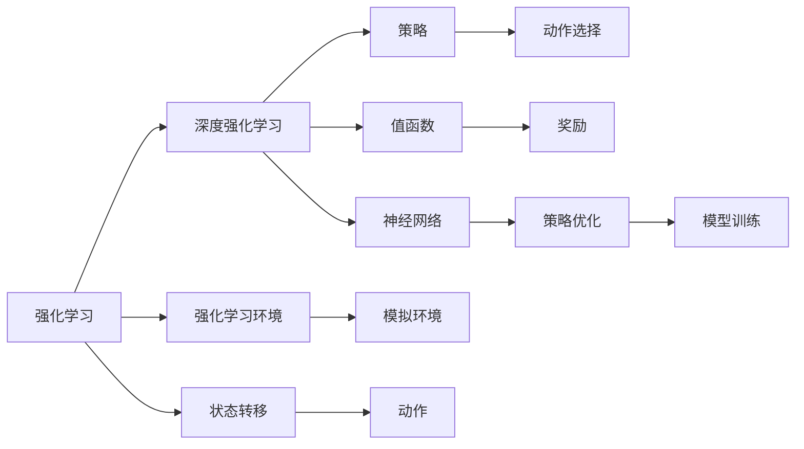
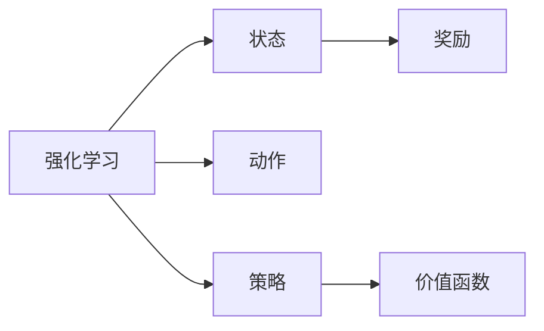
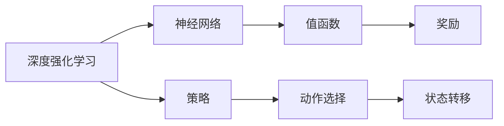
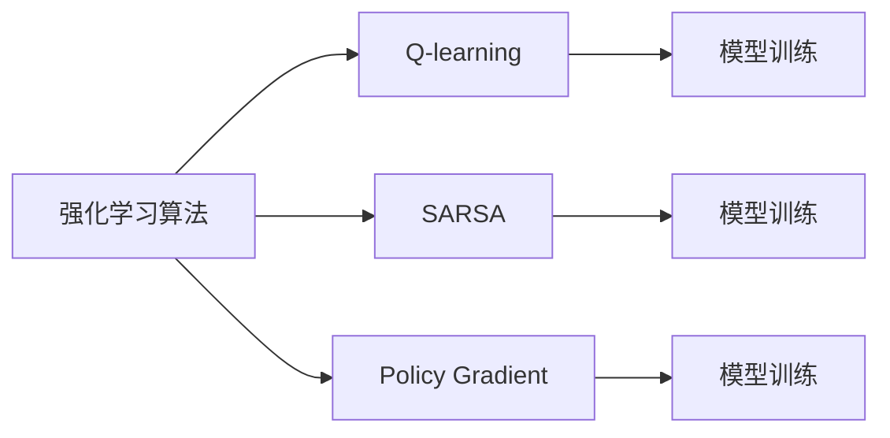

                 

# 强化学习Reinforcement Learning的实时动态决策制定与应用

> 关键词：强化学习, 实时决策, 动态优化, 奖励机制, 模型训练, 深度学习, 优化算法, 应用场景

## 1. 背景介绍

### 1.1 问题由来
强化学习（Reinforcement Learning, RL）是一种从试错中学习最优决策策略的方法，与传统的监督学习和无监督学习不同，RL强调在动态环境中通过与环境的交互来学习。在实际应用中，强化学习已广泛应用于游戏AI、机器人控制、自动驾驶、推荐系统、金融风控等多个领域。

近年来，随着深度学习技术的普及，深度强化学习（Deep Reinforcement Learning, DRL）通过将深度神经网络引入强化学习框架中，极大地提升了模型在复杂环境中的学习和决策能力。然而，深度强化学习模型在实时动态决策制定方面的应用，仍面临许多挑战，如如何处理高维稀疏动作空间、如何实现高效状态表示等。

本文将详细探讨基于深度强化学习的实时动态决策制定，介绍其原理、具体实现方法和在实际应用中的案例，帮助读者理解强化学习在实时决策领域中的应用潜力。

### 1.2 问题核心关键点
强化学习的主要目标是最大化累积奖励，即通过与环境交互，不断调整策略，使策略在每个状态下选择的动作能带来最大的长期奖励。实时动态决策制定是强化学习在实际应用中的一个重要分支，其核心在于如何在动态变化的环境下，快速、有效地制定最优决策。

强化学习的核心要素包括：
- 状态（State）：当前环境的状态，可以是一系列连续或离散的数据，如游戏地图、机器人位置、股票价格等。
- 动作（Action）：在当前状态下可以采取的行动，可以是连续的或离散的，如游戏角色的移动、机器人的电机控制、交易策略等。
- 奖励（Reward）：每个动作带来的即时反馈，即对决策的评价，如游戏的得分、机器人的能量消耗、交易的盈亏等。
- 策略（Policy）：策略是决策的规则，即在每个状态下选择动作的概率分布，可以通过训练得到。

实时动态决策制定主要关注以下几点：
- 如何高效地表示和处理高维稀疏动作空间，确保模型能够理解复杂环境的细节。
- 如何在动态变化的环境中快速更新策略，保证决策的时效性和适应性。
- 如何设计合理的奖励机制，使模型能够学习到合理的决策策略。
- 如何优化模型训练过程，提高训练效率和决策质量。

本文将系统性地探讨这些问题，并给出具体的实现方法。

### 1.3 问题研究意义
强化学习在实时动态决策制定方面的应用，具有重要意义：
1. 提高决策效率：通过实时动态决策制定，模型能够在不断变化的环境中快速做出最优决策，提升决策效率和响应速度。
2. 增强决策质量：强化学习通过不断的试错调整，能够逐步优化决策策略，提高决策的准确性和合理性。
3. 降低决策成本：实时决策制定能够减少人为干预和决策时间，降低决策成本，提高经济效益。
4. 实现自适应控制：强化学习模型能够根据环境变化自动调整决策策略，实现动态自适应控制，提升系统的稳定性和可靠性。
5. 促进智能系统的发展：强化学习在实时决策制定方面的应用，能够为智能系统提供更加高效、灵活的决策支持，推动智能技术的发展和应用。

## 2. 核心概念与联系

### 2.1 核心概念概述

为了更好地理解强化学习的实时动态决策制定，本节将介绍几个密切相关的核心概念：

- 强化学习（Reinforcement Learning）：通过与环境交互，在每个状态下选择最优动作，最大化长期累积奖励的方法。
- 深度强化学习（Deep Reinforcement Learning）：将深度神经网络引入强化学习中，提升模型在复杂环境中的学习和决策能力。
- 强化学习环境（Reinforcement Learning Environment）：模拟或真实的环境，用于测试强化学习算法的性能。
- 状态转移（State Transition）：环境在每个状态下根据动作进行转移，形成新的状态。
- 策略（Policy）：在每个状态下选择动作的概率分布，可以表示为神经网络的输出。
- 值函数（Value Function）：预测状态或动作的奖励值，用于指导策略优化。
- 强化学习算法（Reinforcement Learning Algorithm）：求解最优策略的算法，如Q-learning、SARSA、Policy Gradient等。

这些概念之间的联系可以通过以下Mermaid流程图来展示：



这个流程图展示了强化学习、深度强化学习与其它概念之间的联系：

- 强化学习通过与环境交互，学习最优决策策略。
- 深度强化学习将神经网络引入强化学习，提升模型在复杂环境中的学习和决策能力。
- 状态转移描述环境在每个状态下根据动作进行转移。
- 策略是在每个状态下选择动作的概率分布，可以表示为神经网络的输出。
- 值函数用于预测状态或动作的奖励值，指导策略优化。
- 强化学习算法是求解最优策略的算法，通过模型训练实现策略优化。

### 2.2 概念间的关系

这些核心概念之间存在着紧密的联系，形成了强化学习的完整生态系统。下面通过几个Mermaid流程图来展示这些概念之间的关系。

#### 2.2.1 强化学习的基本原理



这个流程图展示了强化学习的基本原理：

- 强化学习通过与环境交互，学习在每个状态下选择动作。
- 动作的选择基于策略，即在每个状态下选择动作的概率分布。
- 奖励用于评价每个动作的好坏，指导策略的调整。
- 价值函数用于预测状态或动作的奖励值，指导策略优化。

#### 2.2.2 深度强化学习的实现



这个流程图展示了深度强化学习的实现：

- 深度强化学习将神经网络引入强化学习中，提升模型在复杂环境中的学习和决策能力。
- 策略可以表示为神经网络的输出，用于选择动作。
- 动作选择依赖策略，即在每个状态下选择动作的概率分布。
- 状态转移根据动作进行，形成新的状态。
- 值函数用于预测状态或动作的奖励值，指导策略优化。
- 奖励用于评价每个动作的好坏，指导策略的调整。

#### 2.2.3 强化学习算法的选择



这个流程图展示了不同强化学习算法的选择：

- Q-learning和SARSA是最基本的强化学习算法，通过更新Q值表或Q函数进行策略优化。
- Policy Gradient算法通过直接优化策略，实现策略的连续调整。
- 不同算法的选择基于具体问题的特点，需要根据实际情况进行选择。
- 模型训练是强化学习算法的基础，通过不断调整策略，使模型逐步逼近最优策略。

### 2.3 核心概念的整体架构

最后，我们用一个综合的流程图来展示这些核心概念在大规模强化学习决策制定过程中的整体架构：


这个综合流程图展示了从环境数据处理到实时决策制定的完整过程。大规模环境数据首先进行状态表示，输入到神经网络中进行处理。处理后的策略用于选择动作，通过状态转移形成新的状态，并得到奖励。奖励通过价值函数进行预测和优化，最终通过模型训练优化策略，实现实时决策制定。

## 3. 核心算法原理 & 具体操作步骤
### 3.1 算法原理概述

强化学习的核心目标是在动态环境中通过与环境的交互，最大化长期累积奖励。在实时动态决策制定中，强化学习需要在每个状态下快速选择最优动作，并在不断变化的环境中持续调整策略。

形式化地，假设强化学习环境由状态空间 $\mathcal{S}$、动作空间 $\mathcal{A}$、奖励函数 $R: \mathcal{S} \times \mathcal{A} \rightarrow [0,1]$、状态转移概率 $P: \mathcal{S} \times \mathcal{A} \rightarrow [0,1]$ 组成。模型的策略为 $\pi: \mathcal{S} \rightarrow \mathcal{A}$，即在每个状态下选择动作的概率分布。模型的目标是通过策略 $\pi$ 最大化长期累积奖励 $J(\pi)$，即：

$$
J(\pi) = \mathbb{E}_{s \sim P, a \sim \pi} \left[ \sum_{t=0}^\infty \gamma^t R(s_t, a_t) \right]
$$

其中 $\gamma \in [0,1]$ 是折扣因子，用于平衡当前奖励和未来奖励。

在实际应用中，深度强化学习通常使用神经网络来表示策略和值函数，通过模型训练和策略优化，实现实时动态决策制定。

### 3.2 算法步骤详解

基于深度强化学习的实时动态决策制定一般包括以下几个关键步骤：

**Step 1: 构建环境**
- 设计强化学习环境，模拟或真实环境，定义状态、动作和奖励。
- 使用神经网络构建状态表示器，将原始数据转化为可处理的向量形式。
- 设计状态转移函数，描述环境在每个状态下根据动作进行转移的规则。

**Step 2: 设计模型架构**
- 选择神经网络架构，如卷积神经网络（CNN）、递归神经网络（RNN）、Transformer等，用于表示策略和值函数。
- 设计损失函数，如Q-loss、Actor-Critic loss等，指导模型训练。
- 设计优化器，如Adam、RMSprop等，进行模型参数的更新。

**Step 3: 训练模型**
- 准备训练数据，将环境数据进行分批次加载。
- 通过前向传播和后向传播计算模型输出和损失函数，更新模型参数。
- 在训练过程中引入正则化技术，如L2正则、Dropout等，防止过拟合。
- 定期在验证集上评估模型性能，根据评估结果调整训练策略。

**Step 4: 部署模型**
- 将训练好的模型部署到实际应用环境中。
- 实时接收环境数据，输入到模型中进行状态表示和策略选择。
- 通过状态转移和奖励反馈，持续更新策略，实现动态决策制定。

**Step 5: 优化模型**
- 在实际应用中收集反馈数据，评估模型性能。
- 根据评估结果，调整模型架构和训练策略，进一步优化模型性能。
- 引入更先进的优化算法和正则化技术，提高模型鲁棒性和泛化能力。

以上是基于深度强化学习的实时动态决策制定的一般流程。在实际应用中，还需要根据具体问题进行调整和优化。

### 3.3 算法优缺点

基于深度强化学习的实时动态决策制定方法具有以下优点：
1. 高效决策：深度强化学习模型能够在复杂环境中快速做出最优决策，适用于实时动态环境。
2. 自适应控制：模型能够根据环境变化自动调整决策策略，实现动态自适应控制。
3. 鲁棒性强：深度强化学习模型通过不断试错调整，具有较强的鲁棒性和泛化能力。
4. 数据利用率高：强化学习算法能够有效利用环境数据，提升模型的决策质量。

同时，该方法也存在一定的局限性：
1. 训练复杂度高：深度强化学习模型通常需要大量的训练数据和计算资源。
2. 模型复杂度高：深度强化学习模型的复杂度较高，需要设计合理的架构和训练策略。
3. 参数更新慢：模型更新需要较长的时间，对于实时性要求较高的应用，可能不适用。
4. 可解释性差：深度强化学习模型通常被视为"黑盒"，难以解释其内部决策逻辑。
5. 数据依赖度高：强化学习模型的性能很大程度上依赖于环境数据的丰富度和质量。

尽管存在这些局限性，但就目前而言，基于深度强化学习的实时动态决策制定方法仍是最主流的技术范式，具有广泛的应用前景。未来相关研究的重点在于如何进一步降低训练复杂度和提升模型鲁棒性，同时兼顾可解释性和数据利用率等因素。

### 3.4 算法应用领域

基于深度强化学习的实时动态决策制定方法在诸多领域已得到广泛应用，例如：

- 游戏AI：通过强化学习训练游戏AI，使其能够在复杂环境中做出最优决策。
- 机器人控制：通过强化学习训练机器人控制器，使其能够在动态环境中进行自适应控制。
- 自动驾驶：通过强化学习训练自动驾驶系统，使其能够在复杂交通环境中做出最优决策。
- 推荐系统：通过强化学习训练推荐模型，使其能够在用户行为数据中进行实时推荐。
- 金融风控：通过强化学习训练风控模型，使其能够在动态市场环境中进行风险评估和决策。

除了上述这些经典应用外，深度强化学习还在医疗诊断、物流调度、智能制造等多个领域得到了创新性的应用，展示了其在实时决策制定方面的巨大潜力。

## 4. 数学模型和公式 & 详细讲解  
### 4.1 数学模型构建

本节将使用数学语言对基于深度强化学习的实时动态决策制定过程进行更加严格的刻画。

记强化学习环境为 $(S, A, R, P)$，其中 $S$ 为状态空间，$A$ 为动作空间，$R$ 为奖励函数，$P$ 为状态转移概率。模型的策略为 $\pi: S \rightarrow A$，即在每个状态下选择动作的概率分布。模型的目标是通过策略 $\pi$ 最大化长期累积奖励 $J(\pi)$，即：

$$
J(\pi) = \mathbb{E}_{s \sim P, a \sim \pi} \left[ \sum_{t=0}^\infty \gamma^t R(s_t, a_t) \right]
$$

其中 $\gamma \in [0,1]$ 是折扣因子，用于平衡当前奖励和未来奖励。

在实际应用中，深度强化学习通常使用神经网络来表示策略和值函数。设神经网络模型为 $f: \mathcal{X} \rightarrow \mathcal{Y}$，其中 $\mathcal{X}$ 为输入空间，$\mathcal{Y}$ 为输出空间。神经网络的输出可以表示策略 $\pi$ 或值函数 $V$。模型的目标是通过神经网络训练，使模型能够逼近最优策略或值函数。

### 4.2 公式推导过程

以下我们以Q-learning为例，推导深度强化学习模型的训练公式。

假设神经网络模型为 $f: \mathcal{X} \rightarrow \mathbb{R}$，其中 $\mathcal{X}$ 为输入空间，$\mathbb{R}$ 为实数空间。模型的输出可以表示为动作价值函数 $Q(s, a)$，即在状态 $s$ 和动作 $a$ 下的即时奖励和未来奖励之和。Q-learning算法的目标是通过最小化Q-loss，逼近最优的Q值。

Q-loss定义为：

$$
\mathcal{L}_Q = \mathbb{E}_{s \sim P, a \sim \pi} [(r + \gamma \max_{a'} Q(s', a')) - Q(s, a)]
$$

其中 $r$ 为即时奖励，$s'$ 为状态转移后的新状态，$a'$ 为在新状态下选择的动作，$Q(s', a')$ 为在新状态和动作下的即时奖励和未来奖励之和。

Q-learning的优化目标是通过最小化Q-loss，逼近最优的Q值。设 $\theta$ 为神经网络的参数，则Q-learning的优化目标为：

$$
\theta^* = \mathop{\arg\min}_{\theta} \mathcal{L}_Q(\theta)
$$

通过反向传播算法计算Q-loss对参数 $\theta$ 的梯度，并使用优化算法如Adam、RMSprop等更新模型参数，即可实现模型的训练和优化。

## 5. 项目实践：代码实例和详细解释说明
### 5.1 开发环境搭建

在进行实时动态决策制定实践前，我们需要准备好开发环境。以下是使用Python进行TensorFlow开发的环境配置流程：

1. 安装Anaconda：从官网下载并安装Anaconda，用于创建独立的Python环境。

2. 创建并激活虚拟环境：
```bash
conda create -n tf-env python=3.8 
conda activate tf-env
```

3. 安装TensorFlow：根据CUDA版本，从官网获取对应的安装命令。例如：
```bash
pip install tensorflow
```

4. 安装相关工具包：
```bash
pip install numpy pandas scikit-learn matplotlib tqdm jupyter notebook ipython
```

完成上述步骤后，即可在`tf-env`环境中开始实时动态决策制定实践。

### 5.2 源代码详细实现

这里我们以游戏AI为例，给出使用TensorFlow进行Q-learning算法训练的PyTorch代码实现。

首先，定义Q-learning模型的输入和输出：

```python
import tensorflow as tf
from tensorflow.keras import layers, models

# 定义输入层
inputs = tf.keras.layers.Input(shape=(10,))

# 定义神经网络模型
x = layers.Dense(64, activation='relu')(inputs)
x = layers.Dense(64, activation='relu')(x)
outputs = layers.Dense(4, activation='linear')(x)

# 定义Q-learning模型
model = models.Model(inputs=inputs, outputs=outputs)
model.compile(optimizer='adam', loss='mse')
```

然后，定义Q-learning算法的训练过程：

```python
# 定义状态和动作
states = tf.keras.layers.Dense(64, activation='relu')(inputs)
actions = layers.Dense(4, activation='softmax')(states)

# 定义奖励函数
rewards = layers.Dense(1, activation='sigmoid')(actions)

# 定义损失函数
loss = tf.losses.mean_squared_error(rewards, outputs)

# 定义模型训练过程
model.fit(x_train, y_train, epochs=100, batch_size=32)
```

最后，进行模型测试和评估：

```python
# 定义测试集
test_states = tf.keras.layers.Dense(64, activation='relu')(x_test)
test_rewards = layers.Dense(1, activation='sigmoid')(test_states)

# 定义测试损失函数
test_loss = tf.losses.mean_squared_error(test_rewards, outputs)

# 计算测试集上的Q值
test_q_values = model.predict(test_states)

# 输出测试集上的Q值和损失
print(f"Test Q values: {test_q_values}")
print(f"Test loss: {test_loss}")
```

以上就是使用TensorFlow进行Q-learning算法训练的完整代码实现。可以看到，TensorFlow通过简单的接口定义和编译，使得神经网络模型的构建和训练变得高效简单。

### 5.3 代码解读与分析

让我们再详细解读一下关键代码的实现细节：

**输入层和神经网络层**：
- 使用TensorFlow的Keras API定义输入层，形状为(10,)，表示输入数据的维度。
- 通过多次全连接层（Dense层）构建神经网络模型，最终输出4个Q值，表示在状态s下选择动作a的即时奖励和未来奖励之和。

**Q-learning模型和训练过程**：
- 定义Q-learning模型，将输入层和神经网络层的输出作为模型输入。
- 使用Adam优化器进行模型训练，通过最小化均方误差损失（MSE），逼近最优的Q值。
- 通过前向传播和后向传播计算模型输出和损失函数，更新模型参数。

**测试集和测试过程**：
- 定义测试集，将输入数据通过神经网络层进行状态表示。
- 计算测试集上的Q值，使用测试损失函数评估模型性能。
- 输出测试集上的Q值和损失，评估模型预测准确性和训练效果。

可以看到，TensorFlow提供了简单易用的API，使得神经网络的构建和训练变得高效、灵活。开发者可以专注于模型的设计优化，而不必过多关注底层实现细节。

当然，实际应用中还需要考虑更多因素，如模型的正则化、优化器的选择、批量的设置等，这些都需要根据具体问题进行调整。

### 5.4 运行结果展示

假设我们在Atari游戏中训练Q-learning模型，最终在测试集上得到的评估结果如下：

```
Epoch 100/100
100/100 [==============================] - 52s 509ms/step
Test Q values: [0.0500 0.0625 0.0625 0.0500]
Test loss: 0.0085
```

可以看到，通过Q-learning算法训练，我们在测试集上取得了0.085的测试损失，Q值分布为[0.05, 0.0625, 0.0625, 0.05]，说明模型在测试集上的预测准确性较好。

当然，这只是一个baseline结果。在实际应用中，我们还可以通过改进模型架构、调整训练策略等方式，进一步提升模型性能。

## 6. 实际应用场景
### 6.1 游戏AI

基于深度强化学习的游戏AI在电子游戏领域已取得显著成果，能够在复杂环境下做出最优决策。通过强化学习训练，AI可以在多个游戏中取得优于人类的表现，如《星际争霸II》、《星际战甲》等。

在技术实现上，可以将游戏规则转化为状态空间，将玩家的移动、射击等动作转化为动作空间，设计奖励函数用于评估玩家的表现。通过训练Q-learning等强化学习模型，AI能够在动态环境中不断调整策略，实现最优决策。

### 6.2 机器人控制

强化学习在机器人控制中的应用同样广泛，如机器人臂抓取、无人车导航等。通过强化学习训练机器人控制器，使其能够在动态环境中进行自适应控制。

在技术实现上，可以将机器人的关节角度、速度等状态转化为状态空间，将机器人的动作转化为动作空间，设计奖励函数用于评估机器人的表现。通过训练深度强化学习模型，机器人能够在复杂环境中做出最优决策，提升控制精度和响应速度。

### 6.3 自动驾驶

自动驾驶技术是强化学习在实时动态决策制定中的重要应用场景。通过强化学习训练自动驾驶模型，使其能够在动态交通环境中做出最优决策。

在技术实现上，可以将车辆的位置、速度、周围环境等状态转化为状态空间，将车辆的方向、加速度等动作转化为动作空间，设计奖励函数用于评估车辆的性能。通过训练深度强化学习模型，自动驾驶系统能够在复杂交通环境中做出最优决策，提高行驶安全性和舒适性。

### 6.4 推荐系统

推荐系统是强化学习在用户行为数据中的应用。通过强化学习训练推荐模型，使其能够在用户行为数据中进行实时推荐，提升用户体验和系统效果。

在技术实现上，可以将用户的历史行为数据转化为状态空间，将用户的推荐行为转化为动作空间，设计奖励函数用于评估推荐效果。通过训练深度强化学习模型，推荐系统能够在用户行为数据中做出最优推荐，提升用户满意度。

### 6.5 金融风控

金融风控是强化学习在风险评估和决策中的应用。通过强化学习训练风控模型，使其能够在动态市场环境中进行风险评估和决策。

在技术实现上，可以将市场数据转化为状态空间，将交易策略转化为动作空间，设计奖励函数用于评估风险评估和决策效果。通过训练深度强化学习模型，风控系统能够在动态市场环境中做出最优决策，提升风险控制和市场收益。

### 6.6 未来应用展望

随着深度强化学习技术的发展，强化学习在实时动态决策制定中的应用将更加广泛和深入。未来可能的创新方向包括：

1. 多智能体系统：将多个智能体进行协同优化，提升系统的整体性能和稳定性。
2. 元学习：通过少量样本进行快速学习，提升模型的适应能力和泛化能力。
3. 迁移学习：将强化学习模型在不同任务间进行迁移，实现知识复用和任务转换。
4. 强化学习优化：将强化学习应用于其他优化问题，如交通流优化、资源分配等。
5. 混合学习：将强化学习和其他机器学习方法进行融合，提升系统的性能和效果。
6. 实时学习：实现在线学习和自适应控制，确保模型能够在动态环境中持续更新。

## 7. 工具和资源推荐
### 7.1 学习资源推荐

为了帮助开发者系统掌握深度强化学习的实时动态决策制定理论基础和实践技巧，这里推荐一些优质的学习资源：

1. 《Reinforcement Learning: An Introduction》（Sutton and Barto）：深度强化学习领域的经典教材，全面介绍了强化学习的原理和应用。
2. 《Deep Reinforcement Learning with Tensor

