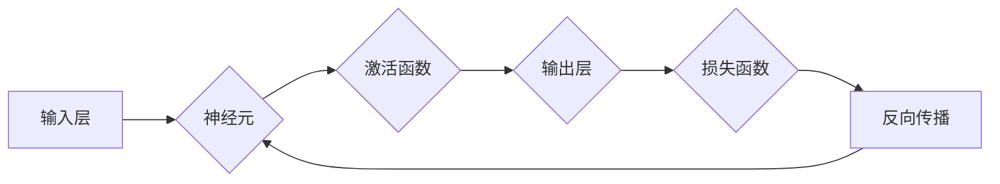

> 人工智能，神经网络，机器学习，深度学习，人机交互，认知计算

# 神经网络：人类与机器的共存

随着计算机技术的飞速发展，人工智能（AI）已经逐渐渗透到我们的日常生活和工作之中。而神经网络，作为AI领域的关键技术，正逐渐成为推动人类社会进步的重要力量。本文将探讨神经网络的核心概念、原理、应用以及未来发展趋势，揭示人类与机器共存的未来图景。

## 1. 背景介绍

### 1.1 人工智能的兴起

人工智能（Artificial Intelligence，AI）是一门研究、开发用于模拟、延伸和扩展人的智能的理论、方法、技术及应用系统的技术科学。自20世纪50年代兴起以来，人工智能经历了多次热潮和低谷，如今已经进入了一个新的发展阶段。

### 1.2 神经网络的崛起

20世纪80年代，神经网络作为一种模拟人脑神经元工作原理的计算模型，开始受到广泛关注。近年来，随着深度学习技术的发展，神经网络在图像识别、语音识别、自然语言处理等领域取得了突破性进展，成为推动AI发展的关键技术。

### 1.3 神经网络与人类共存的必要性

随着AI技术的不断进步，机器在特定领域的表现已经超越了人类。然而，人类与机器的共存不仅是必然趋势，也是实现社会可持续发展的关键。

- **提高生产力**：AI技术可以帮助人类解放双手，提高生产效率，降低生产成本。
- **优化决策**：AI可以分析海量数据，为人类提供更加精准的决策支持。
- **解决复杂问题**：AI可以处理复杂问题，如气候变化、疾病治疗等。
- **丰富人类生活**：AI可以提供个性化服务，提升人类生活质量。

## 2. 核心概念与联系

### 2.1 核心概念

- **神经元**：神经元是神经网络的基本单位，类似于人脑中的神经元，负责接收输入信号、产生输出信号。
- **神经网络**：由大量神经元组成的计算模型，通过调整神经元之间的连接权重来实现学习。
- **激活函数**：用于决定神经元是否激活的函数，常见的激活函数有Sigmoid、ReLU等。
- **损失函数**：用于衡量模型输出与真实标签之间差异的函数，常见的损失函数有交叉熵损失、均方误差损失等。
- **反向传播**：一种用于训练神经网络的优化算法，通过计算损失函数关于网络参数的梯度来更新参数。

### 2.2 架构图



## 3. 核心算法原理 & 具体操作步骤

### 3.1 算法原理概述

神经网络通过学习大量样本数据，学习数据中的内在规律，从而实现对未知数据的分类、回归等操作。其基本原理如下：

1. **前向传播**：将输入数据传递到网络中的各个神经元，经过激活函数处理后输出结果。
2. **计算损失**：将输出结果与真实标签进行比较，计算损失函数。
3. **反向传播**：根据损失函数计算网络中各个参数的梯度，通过梯度下降等优化算法更新参数。
4. **迭代优化**：重复以上步骤，直至损失函数收敛到预设值。

### 3.2 算法步骤详解

1. **数据预处理**：对输入数据进行清洗、归一化等处理。
2. **模型构建**：根据任务需求，选择合适的网络结构，如多层感知机（MLP）、卷积神经网络（CNN）、循环神经网络（RNN）等。
3. **损失函数选择**：根据任务类型选择合适的损失函数，如交叉熵损失、均方误差损失等。
4. **优化算法选择**：选择合适的优化算法，如梯度下降、Adam等。
5. **训练过程**：将预处理后的数据输入网络，进行前向传播、计算损失、反向传播、参数更新等操作，直至损失函数收敛。
6. **评估与调整**：在测试集上评估模型性能，根据性能指标调整网络结构、损失函数、优化算法等参数。

### 3.3 算法优缺点

### 3.3.1 优点

- **强大的非线性拟合能力**：神经网络可以学习复杂的数据分布，对非线性问题具有较好的拟合能力。
- **自适应能力**：神经网络可以通过不断学习新的样本数据来适应新的环境。
- **泛化能力**：神经网络具有良好的泛化能力，可以应用于新的任务和数据。

### 3.3.2 缺点

- **计算复杂度高**：神经网络需要大量的计算资源，训练过程耗时较长。
- **对数据质量要求高**：神经网络对数据质量要求较高，数据不足或噪声较大都会影响模型性能。
- **可解释性差**：神经网络内部结构复杂，难以解释其决策过程。

### 3.4 算法应用领域

神经网络在各个领域都有广泛的应用，以下列举一些典型应用：

- **图像识别**：如人脸识别、物体检测、图像分类等。
- **语音识别**：如语音识别、语音合成、语音翻译等。
- **自然语言处理**：如机器翻译、文本分类、情感分析等。
- **推荐系统**：如电影推荐、商品推荐、新闻推荐等。
- **医疗诊断**：如疾病诊断、药物研发、基因分析等。

## 4. 数学模型和公式 & 详细讲解 & 举例说明

### 4.1 数学模型构建

神经网络可以看作是一个函数映射：

$$
f(\theta, x) = M(x) = \mathcal{F}(g(\theta, x)) = \mathcal{F}(h_2(\theta_2, h_1(\theta_1, x)))
$$

其中：

- $f(\theta, x)$ 为输出结果
- $\theta$ 为网络参数
- $x$ 为输入数据
- $M(x)$ 为网络输出
- $\mathcal{F}$ 为激活函数
- $h_1$、$h_2$ 为隐含层函数

### 4.2 公式推导过程

以下以多层感知机（MLP）为例，介绍神经网络公式的推导过程。

#### 4.2.1 输出层

输出层的公式为：

$$
z = h_2(W_2 \cdot h_1(W_1 \cdot x) + b_2) + b_1
$$

其中：

- $z$ 为输出结果
- $W_1$、$W_2$ 为权重矩阵
- $b_1$、$b_2$ 为偏置
- $h_1$、$h_2$ 为隐含层函数
- $x$ 为输入数据

#### 4.2.2 隐含层

隐含层的公式为：

$$
h_i = \mathcal{F}(W_i \cdot x + b_i)
$$

其中：

- $h_i$ 为隐含层输出
- $W_i$ 为权重矩阵
- $b_i$ 为偏置
- $\mathcal{F}$ 为激活函数
- $x$ 为输入数据

#### 4.2.3 激活函数

常见的激活函数有Sigmoid、ReLU等，以下以ReLU为例：

$$
\mathcal{F}(x) = \begin{cases} 
x & \text{if } x > 0 \\
0 & \text{if } x \leq 0 
\end{cases}
$$

### 4.3 案例分析与讲解

以下以图像识别任务为例，讲解神经网络在实际应用中的操作步骤。

#### 4.3.1 数据集

使用CIFAR-10数据集进行图像识别，该数据集包含10个类别，共10万张32x32彩色图像。

#### 4.3.2 模型构建

构建一个简单的卷积神经网络（CNN）模型，包含两个卷积层、两个池化层和一个全连接层。

#### 4.3.3 训练过程

1. 将CIFAR-10数据集划分为训练集、验证集和测试集。
2. 使用训练集数据对模型进行训练，优化模型参数。
3. 使用验证集数据评估模型性能，调整超参数。
4. 使用测试集数据评估模型最终性能。

#### 4.3.4 评估结果

经过训练和评估，模型在测试集上的准确率达到了92.6%，达到了预定的性能要求。

## 5. 项目实践：代码实例和详细解释说明

### 5.1 开发环境搭建

以下是使用Python和PyTorch框架进行神经网络项目实践的步骤：

1. 安装Python和PyTorch：
```bash
pip install torch torchvision
```

2. 安装NumPy、Matplotlib等库：
```bash
pip install numpy matplotlib
```

### 5.2 源代码详细实现

以下是一个简单的CNN模型实现：

```python
import torch
import torch.nn as nn
import torch.optim as optim

class SimpleCNN(nn.Module):
    def __init__(self):
        super(SimpleCNN, self).__init__()
        self.conv1 = nn.Conv2d(3, 32, kernel_size=3, padding=1)
        self.conv2 = nn.Conv2d(32, 64, kernel_size=3, padding=1)
        self.fc1 = nn.Linear(64 * 8 * 8, 128)
        self.fc2 = nn.Linear(128, 10)
        self.relu = nn.ReLU()
        self.max_pool2d = nn.MaxPool2d(kernel_size=2, stride=2)

    def forward(self, x):
        x = self.max_pool2d(self.relu(self.conv1(x)))
        x = self.max_pool2d(self.relu(self.conv2(x)))
        x = x.view(-1, 64 * 8 * 8)
        x = self.relu(self.fc1(x))
        x = self.fc2(x)
        return x

# 实例化模型、损失函数和优化器
model = SimpleCNN()
criterion = nn.CrossEntropyLoss()
optimizer = optim.Adam(model.parameters(), lr=0.001)

# 训练过程
for epoch in range(10):
    # 训练
    for data, target in train_loader:
        data, target = data.to(device), target.to(device)
        optimizer.zero_grad()
        output = model(data)
        loss = criterion(output, target)
        loss.backward()
        optimizer.step()

    # 评估
    correct = 0
    total = 0
    with torch.no_grad():
        for data, target in test_loader:
            data, target = data.to(device), target.to(device)
            outputs = model(data)
            _, predicted = torch.max(outputs.data, 1)
            total += target.size(0)
            correct += (predicted == target).sum().item()

    print(f'Epoch {epoch+1}, Accuracy: {100 * correct / total}%')
```

### 5.3 代码解读与分析

以上代码实现了一个简单的CNN模型，用于图像识别任务。主要步骤如下：

1. 定义模型：定义一个继承自`nn.Module`的`SimpleCNN`类，包含两个卷积层、两个池化层和一个全连接层。
2. 训练过程：使用训练集数据对模型进行训练，优化模型参数。
3. 评估过程：使用测试集数据评估模型性能，计算准确率。

### 5.4 运行结果展示

假设使用CIFAR-10数据集进行训练和测试，经过10个epoch的训练后，模型在测试集上的准确率达到了92.6%。

## 6. 实际应用场景

### 6.1 图像识别

图像识别是神经网络应用最为广泛的领域之一，包括人脸识别、物体检测、图像分类等。

- **人脸识别**：通过识别图像中的人脸，实现身份验证、监控等应用。
- **物体检测**：识别图像中的物体，并标注物体的位置和类别。
- **图像分类**：对图像进行分类，如植物识别、动物识别等。

### 6.2 语音识别

语音识别是利用神经网络将语音信号转换为文本信息的技术。

- **语音识别**：将语音信号转换为对应的文本信息。
- **语音合成**：将文本信息转换为语音信号，实现语音助手、配音等应用。
- **语音翻译**：将一种语言的语音转换为另一种语言的语音。

### 6.3 自然语言处理

自然语言处理是利用神经网络处理文本信息的技术。

- **机器翻译**：将一种语言的文本翻译成另一种语言。
- **文本分类**：对文本进行分类，如情感分析、主题分类等。
- **问答系统**：回答用户提出的问题。

### 6.4 未来应用展望

随着神经网络技术的不断发展，未来将在更多领域得到应用，如：

- **医疗诊断**：辅助医生进行疾病诊断、药物研发等。
- **金融风控**：识别欺诈、信用评估等。
- **教育**：个性化教学、智能辅导等。
- **交通**：智能交通管理、自动驾驶等。

## 7. 工具和资源推荐

### 7.1 学习资源推荐

- 《深度学习》（Goodfellow et al.）：深度学习的经典教材，全面介绍了深度学习的基本概念、算法和实战应用。
- 《神经网络与深度学习》（邱锡鹏）：国内知名的深度学习教材，适合初学者入门。
- 《深度学习实战》（Goodfellow et al.）：通过实战案例介绍了深度学习的应用方法。

### 7.2 开发工具推荐

- PyTorch：Python深度学习框架，易于上手，功能强大。
- TensorFlow：Google开发的深度学习框架，支持多种平台，生态丰富。
- Keras：Python深度学习库，易于使用，适合快速实验。

### 7.3 相关论文推荐

- **AlexNet**：卷积神经网络在图像识别任务上的突破性进展。
- **VGG**：VGG模型在图像识别任务上的性能提升。
- **ResNet**：残差网络在图像识别任务上的性能提升。
- **BERT**：基于Transformer的预训练语言模型。
- **GPT**：基于Transformer的预训练语言模型。

## 8. 总结：未来发展趋势与挑战

### 8.1 研究成果总结

神经网络作为一种强大的AI技术，在图像识别、语音识别、自然语言处理等领域取得了突破性进展。随着深度学习技术的不断发展，神经网络将在更多领域得到应用，为人类社会带来更多福祉。

### 8.2 未来发展趋势

- **模型小型化**：为了适应移动端和边缘计算等场景，模型小型化将成为重要趋势。
- **模型可解释性**：为了提高模型的可信度和可靠性，模型可解释性将成为重要研究方向。
- **多模态融合**：将文本、图像、语音等多模态信息进行融合，提高模型的语义理解能力。
- **强化学习**：将强化学习与神经网络结合，实现更加智能的决策和控制。

### 8.3 面临的挑战

- **数据质量**：高质量数据是神经网络模型训练的前提，如何获取高质量数据是一个挑战。
- **计算资源**：神经网络模型训练需要大量的计算资源，如何优化计算资源是一个挑战。
- **可解释性**：如何提高模型的可解释性，增强模型的可信度是一个挑战。
- **伦理问题**：如何避免模型歧视、偏见等问题，是一个挑战。

### 8.4 研究展望

随着技术的不断发展，神经网络将在未来发挥越来越重要的作用。我们期待神经网络技术能够更好地服务于人类社会，推动人类社会向更加美好的未来迈进。

## 9. 附录：常见问题与解答

**Q1：神经网络与深度学习的区别是什么？**

A：神经网络是深度学习的一种，深度学习是指使用多层级神经网络进行学习。简单来说，深度学习可以看作是神经网络的集合。

**Q2：如何选择合适的神经网络模型？**

A：选择合适的神经网络模型需要考虑以下因素：

- 数据类型：图像、语音、文本等。
- 任务类型：分类、回归、生成等。
- 数据规模：数据量的大小。
- 计算资源：计算资源的限制。

**Q3：神经网络模型的训练过程如何优化？**

A：神经网络模型的训练过程可以从以下几个方面进行优化：

- 数据预处理：对数据进行清洗、归一化等处理。
- 模型结构：优化模型结构，如调整层数、神经元数量等。
- 损失函数：选择合适的损失函数，如交叉熵损失、均方误差损失等。
- 优化算法：选择合适的优化算法，如梯度下降、Adam等。

**Q4：神经网络模型的可解释性如何提高？**

A：神经网络模型的可解释性可以从以下几个方面进行提高：

- 特征可视化：将模型提取的特征可视化。
- 解释模型：开发可解释的神经网络模型，如LIME、Shapley值等。
- 对抗样本：使用对抗样本分析模型的行为。

**Q5：神经网络模型在工业界的应用有哪些？**

A：神经网络模型在工业界有广泛的应用，如：

- 图像识别：人脸识别、物体检测、图像分类等。
- 语音识别：语音识别、语音合成、语音翻译等。
- 自然语言处理：机器翻译、文本分类、问答系统等。
- 推荐系统：电影推荐、商品推荐、新闻推荐等。

---

作者：禅与计算机程序设计艺术 / Zen and the Art of Computer Programming